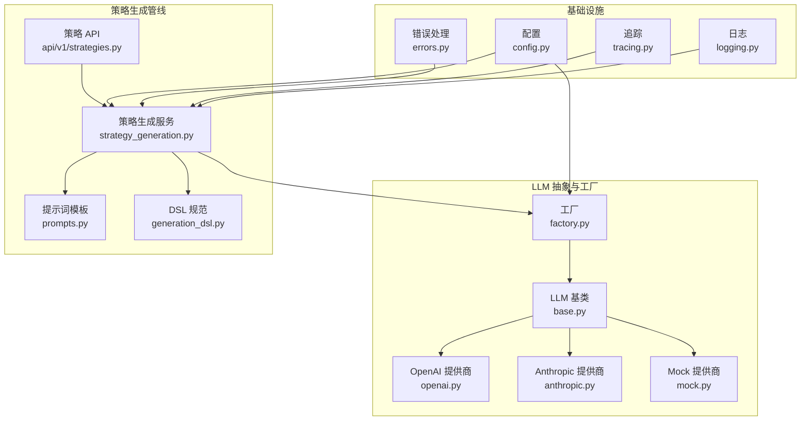
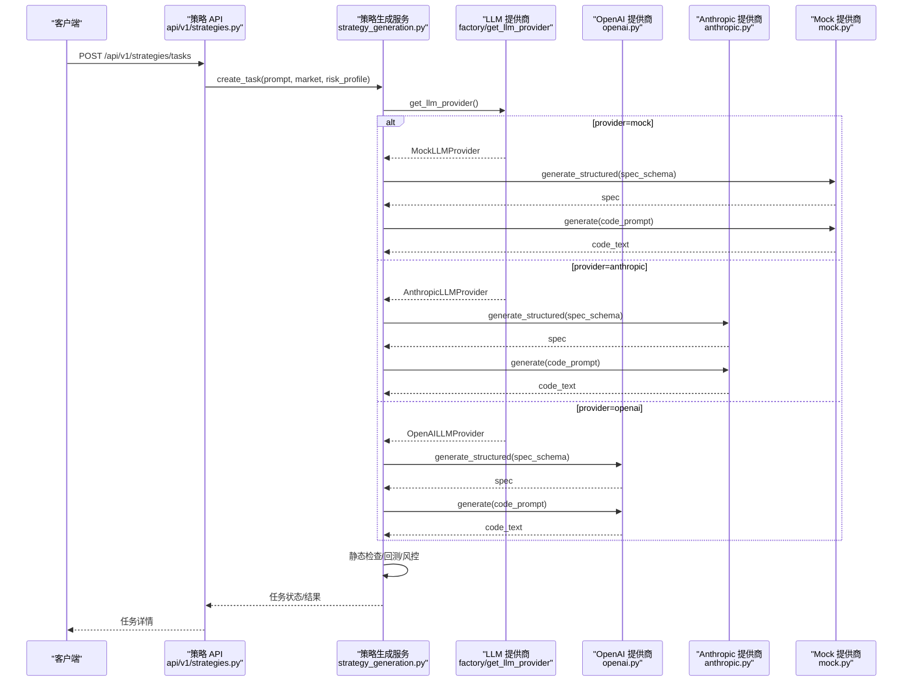
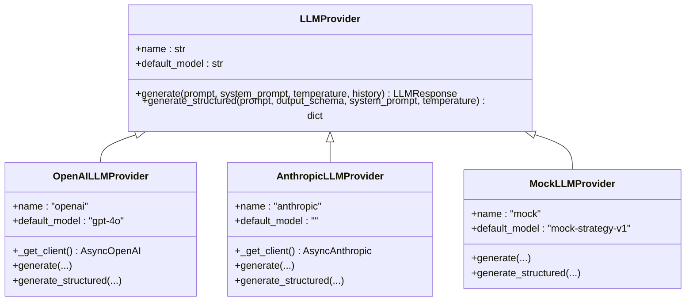
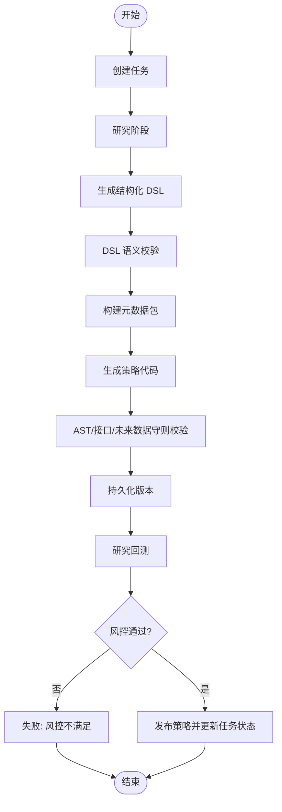
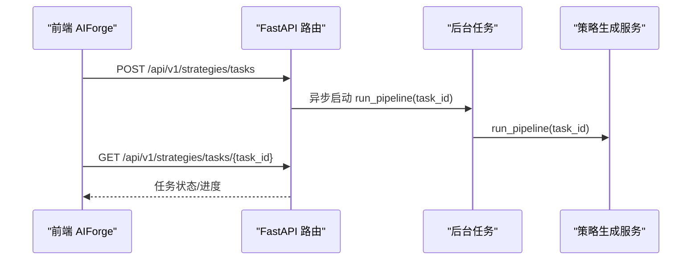
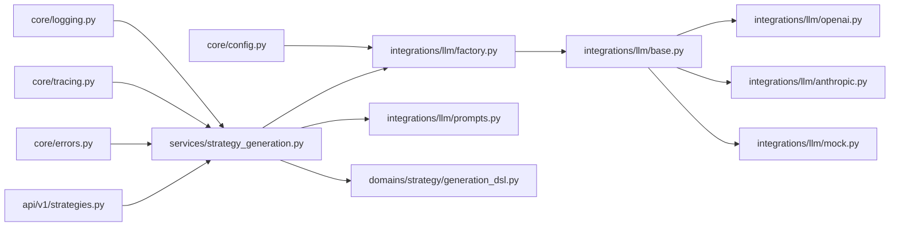

# AI 集成架构

<cite>
**本文引用的文件**
- [backend/app/integrations/llm/__init__.py](file://backend/app/integrations/llm/__init__.py)
- [backend/app/integrations/llm/base.py](file://backend/app/integrations/llm/base.py)
- [backend/app/integrations/llm/factory.py](file://backend/app/integrations/llm/factory.py)
- [backend/app/integrations/llm/openai.py](file://backend/app/integrations/llm/openai.py)
- [backend/app/integrations/llm/anthropic.py](file://backend/app/integrations/llm/anthropic.py)
- [backend/app/integrations/llm/mock.py](file://backend/app/integrations/llm/mock.py)
- [backend/app/integrations/llm/prompts.py](file://backend/app/integrations/llm/prompts.py)
- [backend/app/services/strategy_generation.py](file://backend/app/services/strategy_generation.py)
- [backend/app/domains/strategy/generation_dsl.py](file://backend/app/domains/strategy/generation_dsl.py)
- [backend/app/api/v1/strategies.py](file://backend/app/api/v1/strategies.py)
- [backend/app/core/config.py](file://backend/app/core/config.py)
- [backend/app/core/errors.py](file://backend/app/core/errors.py)
- [backend/app/core/tracing.py](file://backend/app/core/tracing.py)
- [backend/app/core/logging.py](file://backend/app/core/logging.py)
</cite>

## 目录
1. [引言](#引言)
2. [项目结构](#项目结构)
3. [核心组件](#核心组件)
4. [架构总览](#架构总览)
5. [详细组件分析](#详细组件分析)
6. [依赖分析](#依赖分析)
7. [性能考虑](#性能考虑)
8. [故障排查指南](#故障排查指南)
9. [结论](#结论)
10. [附录](#附录)

## 引言
本文件系统性阐述 llmine-quant 的 AI 集成架构，重点围绕大语言模型（LLM）的抽象接口、工厂模式与多提供商适配、策略生成工作流、提示词工程、模型参数调优、上下文管理与服务降级策略展开。文档同时给出端到端的集成示例、错误处理机制与性能监控方案，帮助开发者快速理解并扩展 AI 功能。

## 项目结构
LLM 集成位于 backend/app/integrations/llm 下，采用“抽象基类 + 工厂 + 具体提供商”的分层设计；策略生成服务位于 backend/app/services/strategy_generation.py，贯穿提示词工程、DSL 规范、代码生成、静态校验、回测与风控等阶段；API 层通过 FastAPI 路由暴露任务创建与状态查询；配置、错误与追踪分别在 core 子模块中统一管理。

**图表来源**
- [backend/app/integrations/llm/base.py:31-75](file://backend/app/integrations/llm/base.py#L31-L75)
- [backend/app/integrations/llm/factory.py:11-66](file://backend/app/integrations/llm/factory.py#L11-L66)
- [backend/app/integrations/llm/openai.py:14-132](file://backend/app/integrations/llm/openai.py#L14-L132)
- [backend/app/integrations/llm/anthropic.py:19-150](file://backend/app/integrations/llm/anthropic.py#L19-L150)
- [backend/app/integrations/llm/mock.py:148-182](file://backend/app/integrations/llm/mock.py#L148-L182)
- [backend/app/integrations/llm/prompts.py:1-94](file://backend/app/integrations/llm/prompts.py#L1-L94)
- [backend/app/domains/strategy/generation_dsl.py:78-144](file://backend/app/domains/strategy/generation_dsl.py#L78-L144)
- [backend/app/services/strategy_generation.py:86-584](file://backend/app/services/strategy_generation.py#L86-L584)
- [backend/app/api/v1/strategies.py:301-334](file://backend/app/api/v1/strategies.py#L301-L334)
- [backend/app/core/config.py:48-196](file://backend/app/core/config.py#L48-L196)
- [backend/app/core/errors.py:66-119](file://backend/app/core/errors.py#L66-L119)
- [backend/app/core/tracing.py:49-87](file://backend/app/core/tracing.py#L49-L87)
- [backend/app/core/logging.py:11-41](file://backend/app/core/logging.py#L11-L41)

**章节来源**
- [backend/app/integrations/llm/__init__.py:1-7](file://backend/app/integrations/llm/__init__.py#L1-L7)
- [backend/app/integrations/llm/base.py:1-75](file://backend/app/integrations/llm/base.py#L1-L75)
- [backend/app/integrations/llm/factory.py:1-66](file://backend/app/integrations/llm/factory.py#L1-L66)
- [backend/app/services/strategy_generation.py:1-584](file://backend/app/services/strategy_generation.py#L1-L584)
- [backend/app/api/v1/strategies.py:1-605](file://backend/app/api/v1/strategies.py#L1-L605)

## 核心组件
- 抽象接口与数据模型
  - LLMMessage：单条对话消息（角色与内容）
  - LLMResponse：LLM 返回封装（文本、模型名、提供商、用量、原始响应）
  - LLMProvider：抽象基类，定义 generate/generate_structured 两个核心方法
- 工厂模式
  - get_llm_provider：根据配置动态返回具体提供商实例（mock/anthropic/openai）
- 具体提供商
  - OpenAILLMProvider：使用官方 openai SDK，支持自定义 base_url
  - AnthropicLLMProvider：使用官方 anthropic SDK，支持 bearer-style auth 与自定义 base_url
  - MockLLMProvider：离线/演示用，返回确定性策略模板或结构化元数据
- 提示词工程
  - STRATEGY_GENERATION_SYSTEM_PROMPT/USER_PROMPT
  - STRATEGY_SPEC_SYSTEM_PROMPT/USER_PROMPT
  - STRATEGY_METADATA_SYSTEM_PROMPT/USER_PROMPT
  - STRATEGY_SPEC_FOR_CODE_APPEND：将验证后的 DSL 注入到最终代码生成提示中
- DSL 规范
  - StrategyGenerationSpec：严格字段与校验，确保下游稳定契约
- 策略生成服务
  - 协调研究、代码生成、静态检查、版本持久化、回测、风控与发布
- 配置与错误
  - Settings：自动检测 ~/.claude 与 ~/.codex，填充空值；默认 provider 选择逻辑
  - LLMException：统一 LLM 相关异常，便于 API 层捕获与返回
- 追踪与日志
  - tracing：请求级 trace/actor 上下文注入
  - logging：结构化日志配置

**章节来源**
- [backend/app/integrations/llm/base.py:12-75](file://backend/app/integrations/llm/base.py#L12-L75)
- [backend/app/integrations/llm/factory.py:11-66](file://backend/app/integrations/llm/factory.py#L11-L66)
- [backend/app/integrations/llm/openai.py:14-132](file://backend/app/integrations/llm/openai.py#L14-L132)
- [backend/app/integrations/llm/anthropic.py:19-150](file://backend/app/integrations/llm/anthropic.py#L19-L150)
- [backend/app/integrations/llm/mock.py:148-182](file://backend/app/integrations/llm/mock.py#L148-L182)
- [backend/app/integrations/llm/prompts.py:1-94](file://backend/app/integrations/llm/prompts.py#L1-L94)
- [backend/app/domains/strategy/generation_dsl.py:78-144](file://backend/app/domains/strategy/generation_dsl.py#L78-L144)
- [backend/app/services/strategy_generation.py:86-584](file://backend/app/services/strategy_generation.py#L86-L584)
- [backend/app/core/config.py:48-196](file://backend/app/core/config.py#L48-L196)
- [backend/app/core/errors.py:66-119](file://backend/app/core/errors.py#L66-L119)
- [backend/app/core/tracing.py:49-87](file://backend/app/core/tracing.py#L49-L87)
- [backend/app/core/logging.py:11-41](file://backend/app/core/logging.py#L11-L41)

## 架构总览
以下序列图展示从 API 创建任务到策略生成与回测的端到端流程，以及 LLM 工厂与提供商的选择路径。

**图表来源**
- [backend/app/api/v1/strategies.py:301-334](file://backend/app/api/v1/strategies.py#L301-L334)
- [backend/app/services/strategy_generation.py:132-373](file://backend/app/services/strategy_generation.py#L132-L373)
- [backend/app/integrations/llm/factory.py:11-66](file://backend/app/integrations/llm/factory.py#L11-L66)
- [backend/app/integrations/llm/openai.py:60-132](file://backend/app/integrations/llm/openai.py#L60-L132)
- [backend/app/integrations/llm/anthropic.py:70-150](file://backend/app/integrations/llm/anthropic.py#L70-L150)
- [backend/app/integrations/llm/mock.py:154-182](file://backend/app/integrations/llm/mock.py#L154-L182)

## 详细组件分析

### LLM 抽象与工厂模式
- 抽象接口
  - LLMProvider 定义统一的 generate/generate_structured 方法，屏蔽不同提供商差异
  - LLMMessage/LLMResponse 作为跨提供商的数据契约
- 工厂选择
  - 支持显式 provider 参数覆盖；否则读取 settings.llm_provider
  - 自动检测 ~/.claude 与 ~/.codex，填充空值；若均无则回退 mock
  - 对 anthropic 必填 model/base_url 做显式校验，避免运行时失败
- 具体提供商
  - OpenAI：延迟导入 SDK，校验 API Key；支持自定义 base_url
  - Anthropic：支持 bearer-style auth（auth_token）与 api_key；按 system/messages 字段映射
  - Mock：返回确定性策略模板与结构化元数据，便于离线开发与演示

**图表来源**
- [backend/app/integrations/llm/base.py:31-75](file://backend/app/integrations/llm/base.py#L31-L75)
- [backend/app/integrations/llm/openai.py:14-132](file://backend/app/integrations/llm/openai.py#L14-L132)
- [backend/app/integrations/llm/anthropic.py:19-150](file://backend/app/integrations/llm/anthropic.py#L19-L150)
- [backend/app/integrations/llm/mock.py:148-182](file://backend/app/integrations/llm/mock.py#L148-L182)

**章节来源**
- [backend/app/integrations/llm/base.py:12-75](file://backend/app/integrations/llm/base.py#L12-L75)
- [backend/app/integrations/llm/factory.py:11-66](file://backend/app/integrations/llm/factory.py#L11-L66)
- [backend/app/integrations/llm/openai.py:36-94](file://backend/app/integrations/llm/openai.py#L36-L94)
- [backend/app/integrations/llm/anthropic.py:43-113](file://backend/app/integrations/llm/anthropic.py#L43-L113)
- [backend/app/integrations/llm/mock.py:154-182](file://backend/app/integrations/llm/mock.py#L154-L182)

### 策略生成工作流与提示词工程
- 流程概览
  - 创建任务 -> 研究阶段 -> 结构化 DSL 生成 -> 静态检查 -> 版本持久化 -> 回测 -> 风控 -> 发布
- 提示词工程
  - 使用 STRATEGY_GENERATION_SYSTEM_PROMPT 约束输出为 RuleBasedStrategy 类
  - 使用 STRATEGY_SPEC_SYSTEM_PROMPT 约束输出为 StrategyGenerationSpec JSON
  - 将验证后的 spec 注入最终代码生成提示（STRATEGY_SPEC_FOR_CODE_APPEND）
- DSL 规范
  - 严格字段与校验，保证下游回测与风控稳定消费
- 风控阈值
  - 基于风险画像设置最大回撤上限，确保策略通过风控才发布

**图表来源**
- [backend/app/services/strategy_generation.py:132-373](file://backend/app/services/strategy_generation.py#L132-L373)
- [backend/app/integrations/llm/prompts.py:1-94](file://backend/app/integrations/llm/prompts.py#L1-L94)
- [backend/app/domains/strategy/generation_dsl.py:78-144](file://backend/app/domains/strategy/generation_dsl.py#L78-L144)

**章节来源**
- [backend/app/services/strategy_generation.py:445-514](file://backend/app/services/strategy_generation.py#L445-L514)
- [backend/app/integrations/llm/prompts.py:1-94](file://backend/app/integrations/llm/prompts.py#L1-L94)
- [backend/app/domains/strategy/generation_dsl.py:98-144](file://backend/app/domains/strategy/generation_dsl.py#L98-L144)

### API 集成与前端交互
- API 路由
  - POST /api/v1/strategies/tasks：创建生成任务并异步执行管线
  - GET /api/v1/strategies/tasks/{task_id}：查询任务状态
  - 提供策略列表、详情、事件流等接口
- 前端集成
  - AIForge 组件发起任务创建，订阅 WebSocket 实时事件流，轮询任务状态
  - 通过快捷键触发生成，支持风险画像过滤模板

**图表来源**
- [backend/app/api/v1/strategies.py:301-334](file://backend/app/api/v1/strategies.py#L301-L334)
- [backend/app/services/strategy_generation.py:125-130](file://backend/app/services/strategy_generation.py#L125-L130)

**章节来源**
- [backend/app/api/v1/strategies.py:301-334](file://backend/app/api/v1/strategies.py#L301-L334)
- [frontend/src/screens/Strategy/AIForge.tsx:144-162](file://frontend/src/screens/Strategy/AIForge.tsx#L144-L162)

## 依赖分析
- 组件耦合
  - 策略生成服务依赖工厂获取 LLM 提供商，依赖提示词模板与 DSL 规范
  - API 层仅负责编排与转发，业务逻辑集中在服务层
- 外部依赖
  - OpenAI/Anthropic SDK 延迟导入，避免未安装时阻塞启动
  - 配置模块自动加载本地 CLI 凭据，提升开发体验
- 循环依赖
  - 未见循环依赖；各模块职责清晰，接口边界明确

**图表来源**
- [backend/app/api/v1/strategies.py:301-334](file://backend/app/api/v1/strategies.py#L301-L334)
- [backend/app/services/strategy_generation.py:86-584](file://backend/app/services/strategy_generation.py#L86-L584)
- [backend/app/integrations/llm/factory.py:11-66](file://backend/app/integrations/llm/factory.py#L11-L66)
- [backend/app/integrations/llm/base.py:31-75](file://backend/app/integrations/llm/base.py#L31-L75)
- [backend/app/integrations/llm/openai.py:14-132](file://backend/app/integrations/llm/openai.py#L14-L132)
- [backend/app/integrations/llm/anthropic.py:19-150](file://backend/app/integrations/llm/anthropic.py#L19-L150)
- [backend/app/integrations/llm/mock.py:148-182](file://backend/app/integrations/llm/mock.py#L148-L182)
- [backend/app/integrations/llm/prompts.py:1-94](file://backend/app/integrations/llm/prompts.py#L1-L94)
- [backend/app/domains/strategy/generation_dsl.py:78-144](file://backend/app/domains/strategy/generation_dsl.py#L78-L144)
- [backend/app/core/config.py:48-196](file://backend/app/core/config.py#L48-L196)
- [backend/app/core/errors.py:66-119](file://backend/app/core/errors.py#L66-L119)
- [backend/app/core/tracing.py:49-87](file://backend/app/core/tracing.py#L49-L87)
- [backend/app/core/logging.py:11-41](file://backend/app/core/logging.py#L11-L41)

**章节来源**
- [backend/app/services/strategy_generation.py:86-584](file://backend/app/services/strategy_generation.py#L86-L584)
- [backend/app/integrations/llm/factory.py:11-66](file://backend/app/integrations/llm/factory.py#L11-L66)
- [backend/app/core/config.py:110-172](file://backend/app/core/config.py#L110-L172)

## 性能考虑
- 超时与令牌限制
  - 所有提供商统一使用 settings.llm_timeout_seconds 与 llm_max_tokens 控制请求耗时与输出长度
- 模型参数调优
  - 默认 temperature=0.2，兼顾创造性与稳定性；可在调用侧按需调整
- 成本控制
  - 通过 max_tokens 与回测前的 DSL 校验减少无效调用
  - 风控阈值限制高风险策略进入生产
- 并发与异步
  - OpenAI/Anthropic 使用异步客户端；API 层异步启动后台任务，避免阻塞请求

[本节为通用指导，无需特定文件分析]

## 故障排查指南
- 常见异常类型
  - LLMException：LLM 请求失败、SDK 未安装、配置缺失等
  - NotFound/BadRequest 等：API 层标准异常
- 错误处理
  - 统一捕获并记录 trace_id，返回结构化错误响应
  - 管线失败阶段自动归因（回测/验证/生成/管道）
- 配置检查
  - anthropic：必须配置 model 与 base_url；可选 auth_token 或 api_key
  - openai：必须配置 api_key；可选 base_url
  - 未配置时自动回退 mock，便于本地开发
- 追踪与日志
  - 中间件注入 trace_id 与 actor_id，便于问题定位
  - 结构化日志输出，生产环境以 JSON 渲染

**章节来源**
- [backend/app/core/errors.py:66-119](file://backend/app/core/errors.py#L66-L119)
- [backend/app/services/strategy_generation.py:308-373](file://backend/app/services/strategy_generation.py#L308-L373)
- [backend/app/integrations/llm/openai.py:36-58](file://backend/app/integrations/llm/openai.py#L36-L58)
- [backend/app/integrations/llm/anthropic.py:43-68](file://backend/app/integrations/llm/anthropic.py#L43-L68)
- [backend/app/integrations/llm/factory.py:31-65](file://backend/app/integrations/llm/factory.py#L31-L65)
- [backend/app/core/tracing.py:49-87](file://backend/app/core/tracing.py#L49-L87)
- [backend/app/core/logging.py:11-41](file://backend/app/core/logging.py#L11-L41)

## 结论
该架构以工厂模式解耦多提供商，以抽象接口与严格 DSL 规范确保输出质量与下游稳定性；通过提示词工程与风控阈值实现从自然语言到可回测策略的可靠转化。配合完善的错误处理、追踪与日志体系，开发者可以快速扩展与维护 AI 功能。

[本节为总结，无需特定文件分析]

## 附录

### 集成示例（步骤说明）
- 开启 OpenAI
  - 设置 OPENAI_API_KEY；可选 OPENAI_BASE_URL；设置 LLM_PROVIDER=openai
- 开启 Anthropic
  - 设置 ANTHROPIC_MODEL 与 ANTHROPIC_BASE_URL；可选 ANTHROPIC_API_KEY 或 ANTHROPIC_AUTH_TOKEN
- 本地开发
  - 不设置任何 LLM 相关变量，自动回退 mock

**章节来源**
- [backend/app/core/config.py:87-99](file://backend/app/core/config.py#L87-L99)
- [backend/app/integrations/llm/factory.py:21-65](file://backend/app/integrations/llm/factory.py#L21-L65)

### 关键配置项
- 应用与安全
  - env、secret_key、access_token_expire_minutes、algorithm
- 数据库与缓存
  - database_url、redis_url
- LLM
  - llm_provider、llm_timeout_seconds、llm_max_tokens、anthropic_*、openai_*
- 自动加载
  - auto_load_agent_config：启用从 ~/.claude 与 ~/.codex 自动填充

**章节来源**
- [backend/app/core/config.py:48-196](file://backend/app/core/config.py#L48-L196)