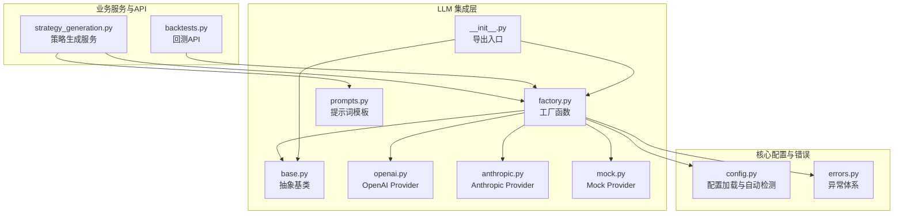
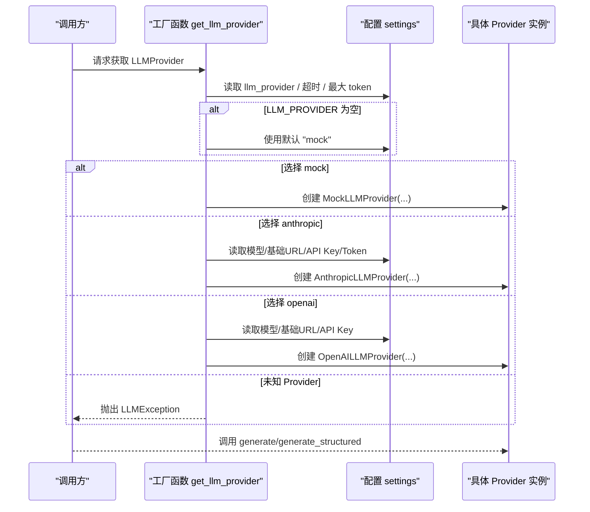
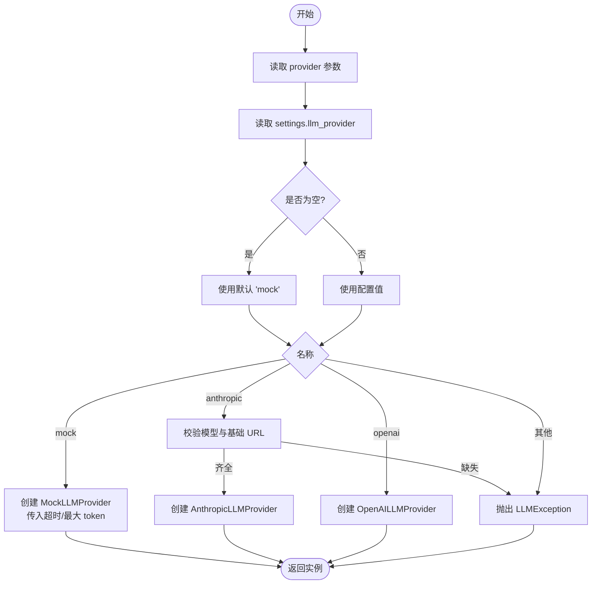
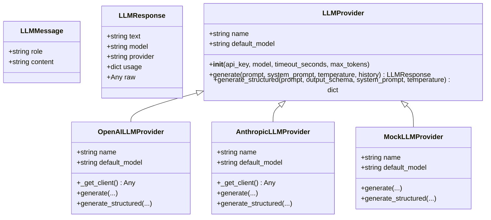
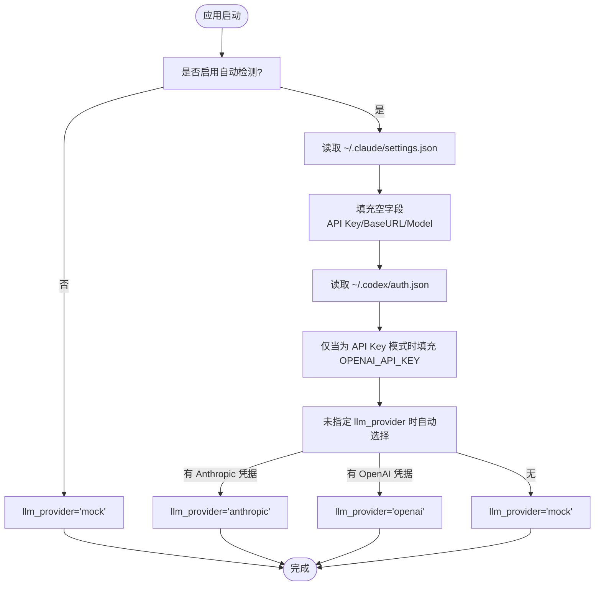
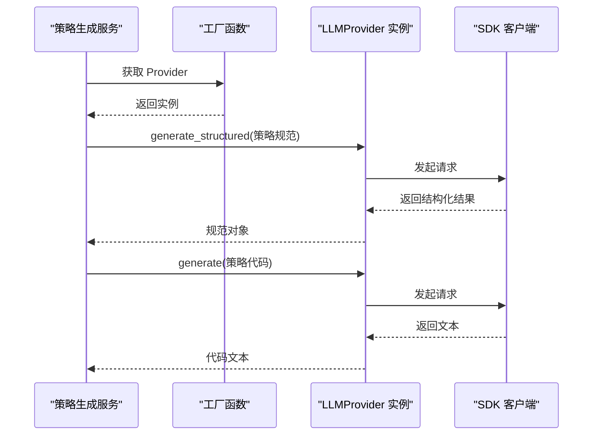
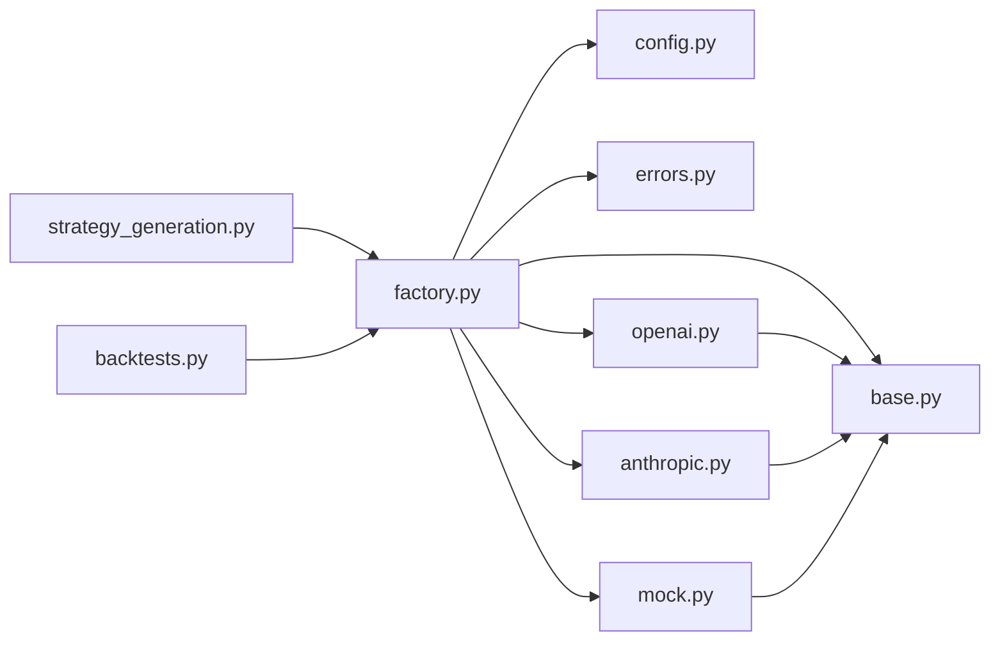

# LLM Factory 工厂模式

<cite>
**本文档引用的文件**
- [factory.py](file://backend/app/integrations/llm/factory.py)
- [base.py](file://backend/app/integrations/llm/base.py)
- [openai.py](file://backend/app/integrations/llm/openai.py)
- [anthropic.py](file://backend/app/integrations/llm/anthropic.py)
- [mock.py](file://backend/app/integrations/llm/mock.py)
- [config.py](file://backend/app/core/config.py)
- [errors.py](file://backend/app/core/errors.py)
- [strategy_generation.py](file://backend/app/services/strategy_generation.py)
- [backtests.py](file://backend/app/api/v1/backtests.py)
- [prompts.py](file://backend/app/integrations/llm/prompts.py)
- [__init__.py](file://backend/app/integrations/llm/__init__.py)
</cite>

## 目录
1. [简介](#简介)
2. [项目结构](#项目结构)
3. [核心组件](#核心组件)
4. [架构总览](#架构总览)
5. [详细组件分析](#详细组件分析)
6. [依赖关系分析](#依赖关系分析)
7. [性能考虑](#性能考虑)
8. [故障排查指南](#故障排查指南)
9. [结论](#结论)
10. [附录](#附录)

## 简介
本文件系统性阐述 LLM Factory 工厂模式在 LLM Provider 选择中的应用，涵盖配置加载机制、动态实例化流程、环境变量优先级与默认值策略、扩展点与新 Provider 集成流程、配置验证机制、使用示例、错误处理策略以及性能监控方案。该工厂模式遵循“抽象统一接口 + 多实现 + 运行时选择”的设计，确保在不同 Provider 之间平滑切换，并提供一致的调用体验。

## 项目结构
LLM Factory 所在目录位于后端集成层，围绕抽象基类、具体 Provider 实现、工厂函数与配置加载模块协同工作，形成清晰的职责分离与可扩展架构。

**图表来源**
- [factory.py:1-66](file://backend/app/integrations/llm/factory.py#L1-L66)
- [base.py:1-75](file://backend/app/integrations/llm/base.py#L1-L75)
- [openai.py:1-132](file://backend/app/integrations/llm/openai.py#L1-L132)
- [anthropic.py:1-150](file://backend/app/integrations/llm/anthropic.py#L1-L150)
- [mock.py:1-193](file://backend/app/integrations/llm/mock.py#L1-L193)
- [config.py:1-196](file://backend/app/core/config.py#L1-L196)
- [errors.py:1-119](file://backend/app/core/errors.py#L1-L119)
- [strategy_generation.py:440-584](file://backend/app/services/strategy_generation.py#L440-L584)
- [backtests.py:330-529](file://backend/app/api/v1/backtests.py#L330-L529)
- [prompts.py:1-94](file://backend/app/integrations/llm/prompts.py#L1-L94)
- [__init__.py:1-7](file://backend/app/integrations/llm/__init__.py#L1-L7)

**章节来源**
- [factory.py:1-66](file://backend/app/integrations/llm/factory.py#L1-L66)
- [config.py:1-196](file://backend/app/core/config.py#L1-L196)

## 核心组件
- 抽象基类 LLMProvider：定义统一接口与公共参数（名称、默认模型、超时、最大 token 等），约束子类必须实现 generate 与 generate_structured 两个异步方法。
- 具体 Provider：
  - OpenAILLMProvider：封装 OpenAI SDK，支持自定义 base_url 与校验 API Key。
  - AnthropicLLMProvider：封装 Anthropic SDK，支持标准 API Key 或 Bearer-style auth_token，支持自定义 base_url。
  - MockLLMProvider：离线/演示用，返回确定性模板或结构化元数据。
- 工厂函数 get_llm_provider：根据传入参数或配置选择 Provider 并实例化，负责参数传递与错误抛出。
- 配置加载与自动检测：从环境变量与用户主目录配置文件自动填充 Provider 参数，明确优先级与默认行为。
- 异常体系：统一的 LLMException 封装错误码、状态码与追踪信息，便于上层捕获与记录。

**章节来源**
- [base.py:31-75](file://backend/app/integrations/llm/base.py#L31-L75)
- [openai.py:14-132](file://backend/app/integrations/llm/openai.py#L14-L132)
- [anthropic.py:19-150](file://backend/app/integrations/llm/anthropic.py#L19-L150)
- [mock.py:159-193](file://backend/app/integrations/llm/mock.py#L159-L193)
- [factory.py:11-66](file://backend/app/integrations/llm/factory.py#L11-L66)
- [config.py:48-196](file://backend/app/core/config.py#L48-L196)
- [errors.py:66-71](file://backend/app/core/errors.py#L66-L71)

## 架构总览
工厂模式在本项目中的作用是“运行时选择并实例化 Provider”。其控制流如下：

**图表来源**
- [factory.py:11-66](file://backend/app/integrations/llm/factory.py#L11-L66)
- [config.py:87-99](file://backend/app/core/config.py#L87-L99)
- [errors.py:66-71](file://backend/app/core/errors.py#L66-L71)

## 详细组件分析

### 工厂函数 get_llm_provider
- 输入参数 provider 支持外部覆盖配置；若为空则使用 settings.llm_provider；最终兜底为 "mock"。
- 对于 anthropic，强制要求配置模型与基础 URL，否则抛出 LLMException。
- 统一将全局超时与最大 token 传递给各 Provider 实例，保证行为一致性。
- 未知 Provider 名称时抛出 LLMException，便于上层捕获与降级。

**图表来源**
- [factory.py:11-66](file://backend/app/integrations/llm/factory.py#L11-L66)
- [errors.py:66-71](file://backend/app/core/errors.py#L66-L71)

**章节来源**
- [factory.py:11-66](file://backend/app/integrations/llm/factory.py#L11-L66)

### 抽象基类 LLMProvider 与数据结构
- LLMMessage：单条对话消息（角色/内容）。
- LLMResponse：LLM 调用响应包装（文本、模型名、Provider、用量、原始响应）。
- LLMProvider：定义 name/default_model 与构造参数（API Key、模型、超时、最大 token），并声明 generate/generate_structured 两个抽象方法。

**图表来源**
- [base.py:12-75](file://backend/app/integrations/llm/base.py#L12-L75)
- [openai.py:14-132](file://backend/app/integrations/llm/openai.py#L14-L132)
- [anthropic.py:19-150](file://backend/app/integrations/llm/anthropic.py#L19-L150)
- [mock.py:159-193](file://backend/app/integrations/llm/mock.py#L159-L193)

**章节来源**
- [base.py:12-75](file://backend/app/integrations/llm/base.py#L12-L75)

### OpenAI Provider
- 特性：延迟导入 SDK，校验 API Key，支持自定义 base_url；generate/generate_structured 均通过 SDK 客户端完成请求。
- 错误处理：SDK 调用失败时抛出 LLMException，包含 Provider 名称与模型信息；generate_structured 在 JSON 解析失败时同样抛出 LLMException。

**章节来源**
- [openai.py:14-132](file://backend/app/integrations/llm/openai.py#L14-L132)

### Anthropic Provider
- 特性：支持标准 API Key 或 Bearer-style auth_token（兼容 Kimi 等代理），支持自定义 base_url；generate/generate_structured 均通过 SDK 客户端完成请求。
- 错误处理：SDK 调用失败时抛出 LLMException；generate_structured 会将输出 schema 注入系统提示以引导模型返回 JSON。

**章节来源**
- [anthropic.py:19-150](file://backend/app/integrations/llm/anthropic.py#L19-L150)

### Mock Provider
- 特性：离线/演示用，generate 返回确定性策略模板；generate_structured 根据输出 schema 返回预设的策略规范、股票池建议或元数据。
- 用途：在未配置真实密钥或 CI 环境下保证功能可用。

**章节来源**
- [mock.py:159-193](file://backend/app/integrations/llm/mock.py#L159-L193)

### 配置加载与自动检测
- 配置项：llm_provider、llm_timeout_seconds、llm_max_tokens、anthropic_*、openai_*。
- 自动检测：启动时从用户主目录的 ~/.claude/settings.json 与 ~/.codex/auth.json 读取环境变量块，填充 Anthropic/OpenAI 相关字段。
- 优先级：显式环境变量/.env > Claude 配置 > Codex 配置 > mock。
- 默认行为：未指定 llm_provider 且无可用凭据时，默认使用 mock。

**图表来源**
- [config.py:110-172](file://backend/app/core/config.py#L110-L172)

**章节来源**
- [config.py:48-196](file://backend/app/core/config.py#L48-L196)

### 使用示例与调用链
- 策略生成服务：在生成策略规范与代码时，通过工厂函数获取 Provider，分别调用 generate_structured 与 generate。
- 回测 API：在建议股票池时，调用 generate_structured 获取 AI 推荐结果。

**图表来源**
- [strategy_generation.py:448-498](file://backend/app/services/strategy_generation.py#L448-L498)
- [factory.py:11-66](file://backend/app/integrations/llm/factory.py#L11-L66)

**章节来源**
- [strategy_generation.py:440-584](file://backend/app/services/strategy_generation.py#L440-L584)
- [backtests.py:330-427](file://backend/app/api/v1/backtests.py#L330-L427)

## 依赖关系分析
- 工厂函数依赖配置模块与异常模块，按名称分支创建具体 Provider 实例。
- 具体 Provider 依赖抽象基类与异常模块，内部延迟导入对应 SDK。
- 业务服务与 API 层仅依赖工厂函数与抽象接口，不关心具体实现细节，体现高内聚低耦合。

**图表来源**
- [factory.py:1-8](file://backend/app/integrations/llm/factory.py#L1-L8)
- [openai.py:10-11](file://backend/app/integrations/llm/openai.py#L10-L11)
- [anthropic.py:15-16](file://backend/app/integrations/llm/anthropic.py#L15-L16)
- [mock.py:10](file://backend/app/integrations/llm/mock.py#L10)
- [strategy_generation.py:30](file://backend/app/services/strategy_generation.py#L30)
- [backtests.py:209](file://backend/app/api/v1/backtests.py#L209)

**章节来源**
- [factory.py:1-8](file://backend/app/integrations/llm/factory.py#L1-L8)

## 性能考虑
- 超时与最大 token：工厂函数将全局超时与最大 token 传入各 Provider，避免重复 IO 与资源浪费。
- SDK 客户端复用：Provider 内部按需延迟导入 SDK 并创建客户端，减少启动时依赖加载开销。
- 结构化输出：通过 response_format 或系统提示引导模型返回 JSON，降低后处理成本。
- 建议监控指标：请求耗时、Token 使用量、错误率、Provider 切换次数，结合追踪 ID 进行端到端观测。

[本节为通用性能指导，无需特定文件引用]

## 故障排查指南
- 未知 Provider：工厂函数会抛出 LLMException，检查 LLM_PROVIDER 是否为 mock/anthropic/openai。
- Anthropic 缺少模型或基础 URL：工厂函数会抛出 LLMException，检查 ANTHROPIC_MODEL 与 ANTHROPIC_BASE_URL。
- OpenAI 缺少 API Key：OpenAI Provider 的 _get_client 会抛出 LLMException，检查 OPENAI_API_KEY。
- SDK 未安装：延迟导入时抛出 LLMException，按提示安装对应 SDK。
- JSON 解析失败：generate_structured 在解析非 JSON 输出时抛出 LLMException，检查模型是否遵循 JSON 输出格式。
- 上层处理：统一由 LLMException 捕获，返回标准化错误响应，包含追踪 ID 便于定位问题。

**章节来源**
- [factory.py:32-43](file://backend/app/integrations/llm/factory.py#L32-L43)
- [openai.py:46-50](file://backend/app/integrations/llm/openai.py#L46-L50)
- [openai.py:118-131](file://backend/app/integrations/llm/openai.py#L118-L131)
- [anthropic.py:53-57](file://backend/app/integrations/llm/anthropic.py#L53-L57)
- [anthropic.py:146-149](file://backend/app/integrations/llm/anthropic.py#L146-L149)
- [errors.py:66-71](file://backend/app/core/errors.py#L66-L71)

## 结论
本工厂模式通过抽象统一接口与运行时选择，实现了 LLM Provider 的灵活切换与一致调用体验。配合完善的配置加载与自动检测机制、严格的错误处理与统一异常体系，既满足开发调试与演示需求，又能在生产环境中稳定运行。通过扩展新的 Provider 类并遵循工厂函数分支规则，即可无缝集成新的 LLM 后端。

## 附录

### 环境变量与默认值速查
- LLM_PROVIDER：提供商选择（anthropic / openai / mock）
- ANTHROPIC_API_KEY：标准 API Key
- ANTHROPIC_AUTH_TOKEN：Bearer Token（Kimi 代理）
- ANTHROPIC_BASE_URL：自定义端点
- ANTHROPIC_MODEL：模型 ID（默认空）
- OPENAI_API_KEY：标准 API Key
- OPENAI_BASE_URL：自定义端点
- OPENAI_MODEL：模型 ID（默认 gpt-4o）
- LLM_TIMEOUT_SECONDS：超时（默认 120s）
- LLM_MAX_TOKENS：最大 Token 数（默认 4096）

**章节来源**
- [config.py:87-99](file://backend/app/core/config.py#L87-L99)
- [doc/系统核心介绍/03-模型配置与Agent构建逻辑.md:478-492](file://doc/系统核心介绍/03-模型配置与Agent构建逻辑.md#L478-L492)

### 新 Provider 集成步骤
- 实现继承 LLMProvider 的具体类，定义 name/default_model，并实现 generate/generate_structured。
- 在 factory.py 的分支中添加新 Provider 的分支逻辑，必要时进行配置校验与异常抛出。
- 如需自动检测，可在 config.py 的自动检测函数中补充从用户配置文件读取的逻辑。
- 更新 __all__ 导出列表，确保对外暴露新 Provider 与工厂函数。
- 补充单元测试与集成测试，覆盖正常路径与错误路径。

**章节来源**
- [base.py:31-75](file://backend/app/integrations/llm/base.py#L31-L75)
- [factory.py:11-66](file://backend/app/integrations/llm/factory.py#L11-L66)
- [config.py:110-172](file://backend/app/core/config.py#L110-L172)
- [__init__.py:1-7](file://backend/app/integrations/llm/__init__.py#L1-L7)