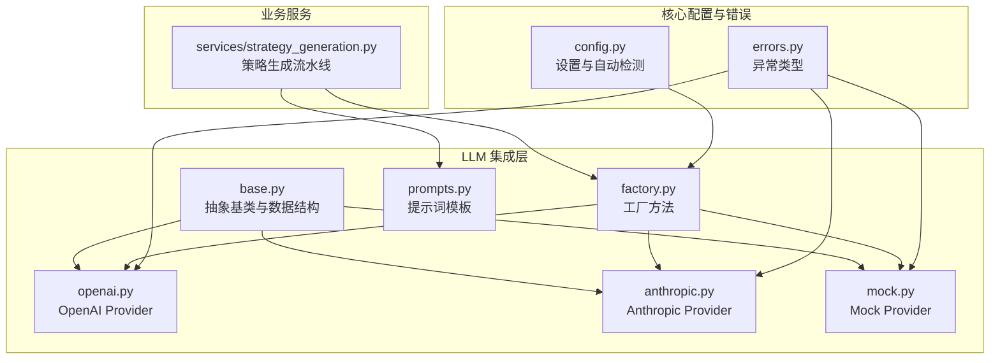
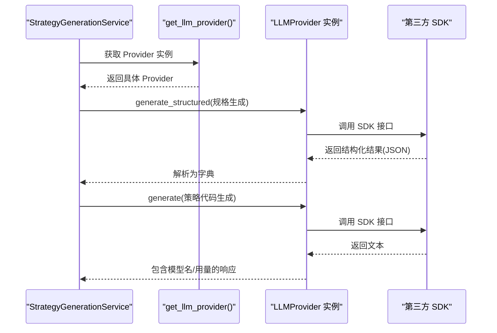
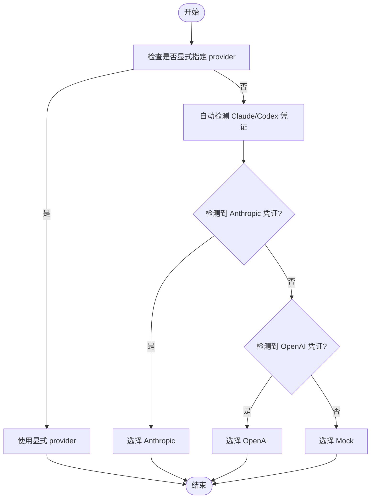
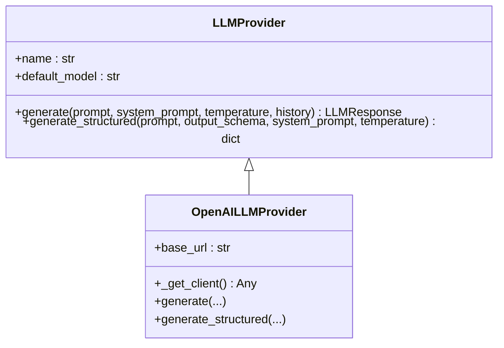
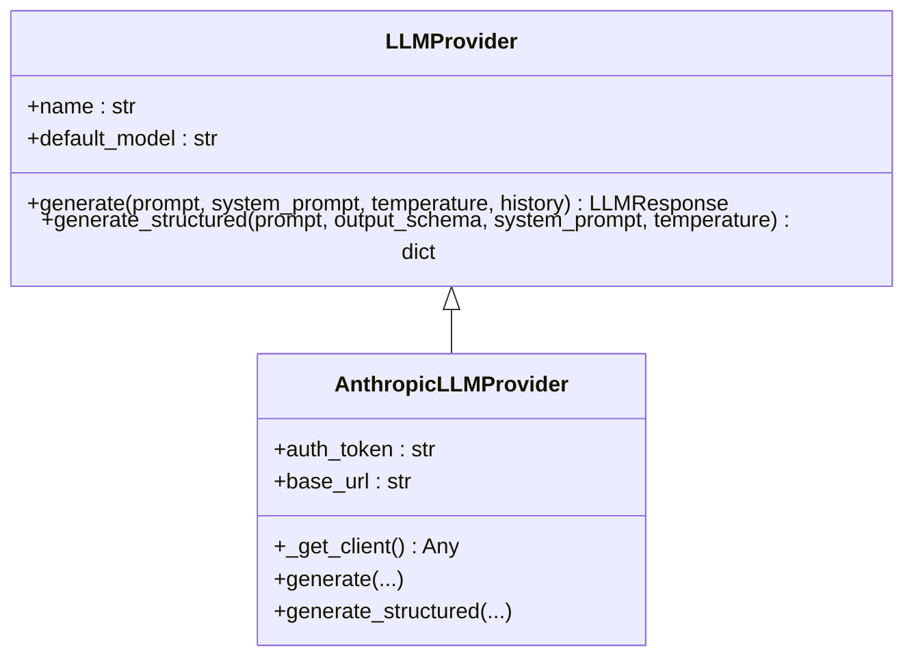
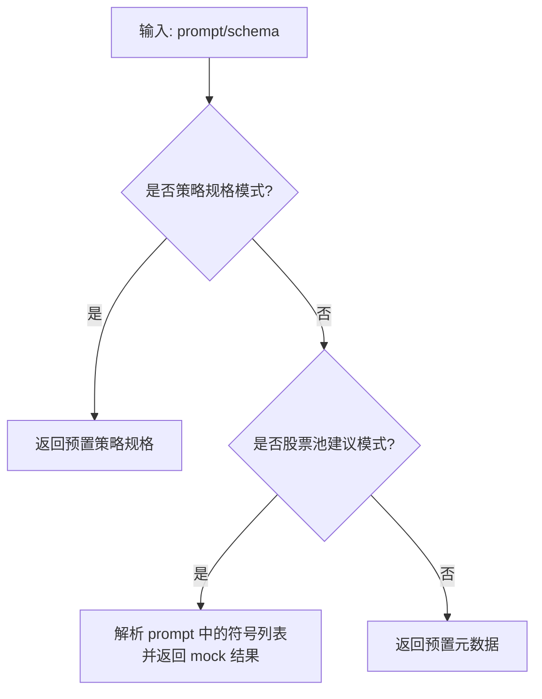
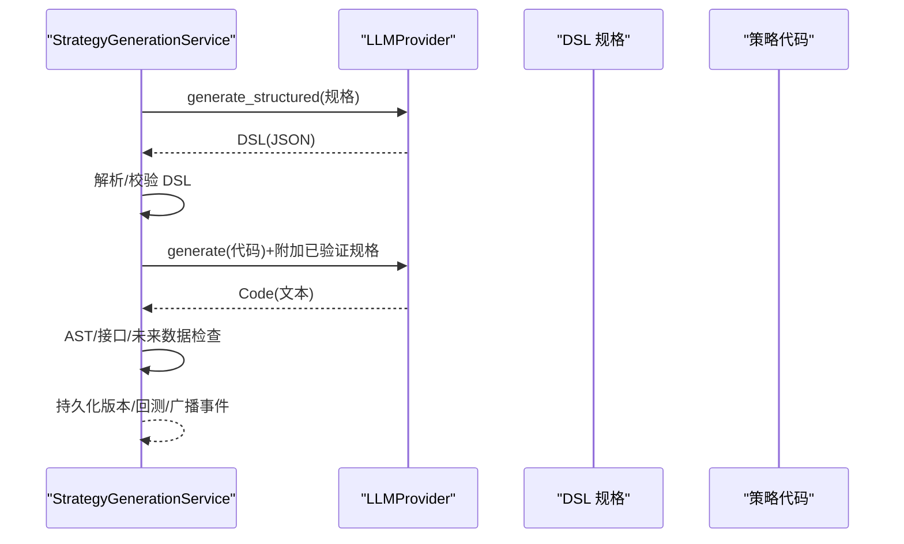
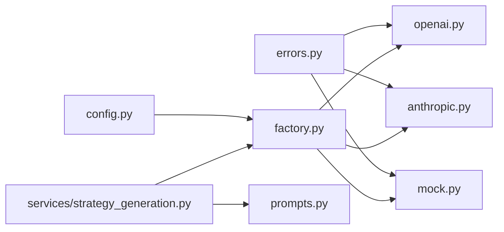

# LLM Provider 具体实现

<cite>
**本文引用的文件**
- [backend/app/integrations/llm/__init__.py](file://backend/app/integrations/llm/__init__.py)
- [backend/app/integrations/llm/base.py](file://backend/app/integrations/llm/base.py)
- [backend/app/integrations/llm/factory.py](file://backend/app/integrations/llm/factory.py)
- [backend/app/integrations/llm/openai.py](file://backend/app/integrations/llm/openai.py)
- [backend/app/integrations/llm/anthropic.py](file://backend/app/integrations/llm/anthropic.py)
- [backend/app/integrations/llm/mock.py](file://backend/app/integrations/llm/mock.py)
- [backend/app/integrations/llm/prompts.py](file://backend/app/integrations/llm/prompts.py)
- [backend/app/core/config.py](file://backend/app/core/config.py)
- [backend/app/core/errors.py](file://backend/app/core/errors.py)
- [backend/app/services/strategy_generation.py](file://backend/app/services/strategy_generation.py)
- [backend/tests/services/test_strategy_generation_e2e.py](file://backend/tests/services/test_strategy_generation_e2e.py)
</cite>

## 目录
1. [简介](#简介)
2. [项目结构](#项目结构)
3. [核心组件](#核心组件)
4. [架构总览](#架构总览)
5. [详细组件分析](#详细组件分析)
6. [依赖分析](#依赖分析)
7. [性能考量](#性能考量)
8. [故障排查指南](#故障排查指南)
9. [结论](#结论)
10. [附录](#附录)

## 简介
本技术文档聚焦于 LLM Provider 的具体实现，系统性对比 OpenAI 与 Anthropic Provider 的差异、配置参数与使用场景；深入解析初始化流程、API 调用方式、错误处理机制与性能特性；说明 Mock Provider 的设计目的与调试用途；并提供配置示例、最佳实践与迁移指南，帮助在成本、速度、准确性之间做出合理权衡。

## 项目结构
LLM Provider 相关代码位于后端集成层，采用“抽象基类 + 工厂 + 具体实现 + 提示词”的分层组织：
- 抽象基类定义统一接口与数据结构
- 工厂根据配置动态选择 Provider
- 具体 Provider 封装第三方 SDK 的异步调用
- 提示词模块提供策略生成所需的系统提示与用户提示

图表来源
- [backend/app/integrations/llm/base.py:31-75](file://backend/app/integrations/llm/base.py#L31-L75)
- [backend/app/integrations/llm/factory.py:11-66](file://backend/app/integrations/llm/factory.py#L11-L66)
- [backend/app/integrations/llm/openai.py:14-132](file://backend/app/integrations/llm/openai.py#L14-L132)
- [backend/app/integrations/llm/anthropic.py:19-150](file://backend/app/integrations/llm/anthropic.py#L19-L150)
- [backend/app/integrations/llm/mock.py:159-193](file://backend/app/integrations/llm/mock.py#L159-L193)
- [backend/app/integrations/llm/prompts.py:1-94](file://backend/app/integrations/llm/prompts.py#L1-L94)
- [backend/app/core/config.py:48-196](file://backend/app/core/config.py#L48-L196)
- [backend/app/core/errors.py:66-71](file://backend/app/core/errors.py#L66-L71)
- [backend/app/services/strategy_generation.py:445-514](file://backend/app/services/strategy_generation.py#L445-L514)

章节来源
- [backend/app/integrations/llm/__init__.py:1-7](file://backend/app/integrations/llm/__init__.py#L1-L7)
- [backend/app/integrations/llm/base.py:1-75](file://backend/app/integrations/llm/base.py#L1-L75)
- [backend/app/integrations/llm/factory.py:1-66](file://backend/app/integrations/llm/factory.py#L1-L66)
- [backend/app/core/config.py:48-196](file://backend/app/core/config.py#L48-L196)

## 核心组件
- 抽象基类与数据结构
  - LLMMessage：单条对话消息，包含角色与内容
  - LLMResponse：通用响应封装，包含文本、模型名、提供商、用量与原始响应
  - LLMProvider：抽象基类，定义 generate 与 generate_structured 两个核心方法，并提供统一初始化参数（API Key、模型、超时、最大 token）
- 工厂方法
  - 根据配置选择 Provider，支持 mock、anthropic、openai；默认回退到 mock
  - 对 Anthropic 还会校验模型与基础地址是否配置
- 具体 Provider
  - OpenAI：延迟加载 openai SDK，支持自定义 base_url；generate 使用 chat.completions；generate_structured 使用 response_format=json_object
  - Anthropic：延迟加载 anthropic SDK，支持 api_key 或 auth_token（Bearer 风格）；generate 使用 messages.create；generate_structured 在 system 中注入 JSON schema 指令
  - Mock：返回确定性的策略代码或结构化元数据；用于离线/免费/演示场景
- 提示词模板
  - 策略生成系统提示与用户提示
  - 策略元数据系统提示与用户提示
  - 策略规格系统提示与用户提示
  - 代码追加的规格片段

章节来源
- [backend/app/integrations/llm/base.py:12-75](file://backend/app/integrations/llm/base.py#L12-L75)
- [backend/app/integrations/llm/factory.py:11-66](file://backend/app/integrations/llm/factory.py#L11-L66)
- [backend/app/integrations/llm/openai.py:14-132](file://backend/app/integrations/llm/openai.py#L14-L132)
- [backend/app/integrations/llm/anthropic.py:19-150](file://backend/app/integrations/llm/anthropic.py#L19-L150)
- [backend/app/integrations/llm/mock.py:159-193](file://backend/app/integrations/llm/mock.py#L159-L193)
- [backend/app/integrations/llm/prompts.py:1-94](file://backend/app/integrations/llm/prompts.py#L1-L94)

## 架构总览
下图展示从策略生成服务到 Provider 的调用链路，以及工厂如何按配置选择 Provider：

图表来源
- [backend/app/services/strategy_generation.py:445-514](file://backend/app/services/strategy_generation.py#L445-L514)
- [backend/app/integrations/llm/factory.py:11-66](file://backend/app/integrations/llm/factory.py#L11-L66)
- [backend/app/integrations/llm/openai.py:60-132](file://backend/app/integrations/llm/openai.py#L60-L132)
- [backend/app/integrations/llm/anthropic.py:70-150](file://backend/app/integrations/llm/anthropic.py#L70-L150)

## 详细组件分析

### 抽象基类与数据结构
- 设计要点
  - 统一的消息与响应结构，便于上层业务解耦
  - 通过抽象方法约束具体 Provider 的行为
  - 初始化参数集中管理，便于工厂按需传参
- 数据结构复杂度
  - LLMMessage：常数级存储
  - LLMResponse：常数级存储，usage 字典通常包含少量键值
- 错误处理
  - 基类不直接处理网络异常，交由具体 Provider 实现捕获并抛出自定义异常

章节来源
- [backend/app/integrations/llm/base.py:12-75](file://backend/app/integrations/llm/base.py#L12-L75)

### 工厂方法
- 选择逻辑
  - 若显式 provider 或配置为空且检测到 Claude/Codex 凭证，则自动选择对应 Provider
  - 默认 fallback 到 mock
- 参数传递
  - 超时与最大 token 从全局设置继承
  - Anthropic 需要模型与基础地址配置，否则抛出 LLM 异常
- 性能特性
  - 工厂本身无状态，开销极低
  - 选择分支清晰，便于扩展新 Provider

图表来源
- [backend/app/integrations/llm/factory.py:11-66](file://backend/app/integrations/llm/factory.py#L11-L66)
- [backend/app/core/config.py:110-172](file://backend/app/core/config.py#L110-L172)

章节来源
- [backend/app/integrations/llm/factory.py:11-66](file://backend/app/integrations/llm/factory.py#L11-L66)
- [backend/app/core/config.py:110-172](file://backend/app/core/config.py#L110-L172)

### OpenAI Provider
- 初始化
  - 支持自定义 base_url，便于代理或兼容其他服务
  - 必须配置 API Key，否则抛出 LLM 异常
- API 调用
  - generate：拼接 system + 历史 + 当前用户消息，调用 chat.completions
  - generate_structured：通过 response_format=json_object 强制 JSON 输出
- 错误处理
  - 导入失败、配置缺失、SDK 调用异常均包装为 LLM 异常
- 性能特性
  - 异步客户端，适合高并发
  - 用量字段包含 prompt/completion tokens，便于成本控制

图表来源
- [backend/app/integrations/llm/base.py:31-75](file://backend/app/integrations/llm/base.py#L31-L75)
- [backend/app/integrations/llm/openai.py:14-132](file://backend/app/integrations/llm/openai.py#L14-L132)

章节来源
- [backend/app/integrations/llm/openai.py:14-132](file://backend/app/integrations/llm/openai.py#L14-L132)
- [backend/app/core/errors.py:66-71](file://backend/app/core/errors.py#L66-L71)

### Anthropic Provider
- 初始化
  - 支持 api_key 或 auth_token（Bearer 风格），可选 base_url
  - 必须至少配置其一，否则抛出 LLM 异常
- API 调用
  - generate：使用 messages.create，支持 system 参数
  - generate_structured：在 system 中注入 JSON schema 指令，再剥离 Markdown 围栏
- 错误处理
  - 导入失败、配置缺失、SDK 调用异常均包装为 LLM 异常
- 性能特性
  - 异步客户端，用量字段映射 input/output tokens
  - 对结构化输出更友好，适合严格 JSON 场景

图表来源
- [backend/app/integrations/llm/base.py:31-75](file://backend/app/integrations/llm/base.py#L31-L75)
- [backend/app/integrations/llm/anthropic.py:19-150](file://backend/app/integrations/llm/anthropic.py#L19-L150)

章节来源
- [backend/app/integrations/llm/anthropic.py:19-150](file://backend/app/integrations/llm/anthropic.py#L19-L150)
- [backend/app/core/errors.py:66-71](file://backend/app/core/errors.py#L66-L71)

### Mock Provider
- 设计目的
  - 无 API Key 时的离线/免费/演示替代方案
  - 返回确定性策略代码或结构化元数据，便于端到端测试与开发验证
- 行为特征
  - generate：始终返回预置策略模板
  - generate_structured：根据输出模式返回策略规格、股票池建议或元数据
- 调试用途
  - 测试策略生成流水线的完整性
  - 验证静态检查、AST 校验、回测链路

图表来源
- [backend/app/integrations/llm/mock.py:159-193](file://backend/app/integrations/llm/mock.py#L159-L193)

章节来源
- [backend/app/integrations/llm/mock.py:159-193](file://backend/app/integrations/llm/mock.py#L159-L193)

### 提示词模板与策略生成流水线
- 提示词模板
  - 策略生成：约束输出为 RuleBasedStrategy 子类，限制依赖与数据可用性
  - 策略元数据：约束输出 JSON 字段与取值范围
  - 策略规格：约束输出为 DSL 规格 JSON，包含因子、过滤器、风控等
- 流水线
  - 先生成 DSL 规格（结构化），再生成策略代码（自由文本）
  - 代码生成时附加已验证的规格 JSON，确保一致性
  - 最终进行 AST 校验与静态检查

图表来源
- [backend/app/services/strategy_generation.py:445-514](file://backend/app/services/strategy_generation.py#L445-L514)
- [backend/app/integrations/llm/prompts.py:1-94](file://backend/app/integrations/llm/prompts.py#L1-L94)

章节来源
- [backend/app/integrations/llm/prompts.py:1-94](file://backend/app/integrations/llm/prompts.py#L1-L94)
- [backend/app/services/strategy_generation.py:445-514](file://backend/app/services/strategy_generation.py#L445-L514)

## 依赖分析
- 组件耦合
  - 工厂仅依赖配置与具体 Provider 类，耦合度低
  - 具体 Provider 仅依赖抽象基类与 SDK，便于替换
- 外部依赖
  - OpenAI：openai SDK（异步客户端）
  - Anthropic：anthropic SDK（异步客户端）
- 潜在循环依赖
  - 未发现循环依赖，模块职责清晰

图表来源
- [backend/app/core/config.py:48-196](file://backend/app/core/config.py#L48-L196)
- [backend/app/integrations/llm/factory.py:1-66](file://backend/app/integrations/llm/factory.py#L1-L66)
- [backend/app/core/errors.py:1-119](file://backend/app/core/errors.py#L1-L119)
- [backend/app/services/strategy_generation.py:1-200](file://backend/app/services/strategy_generation.py#L1-L200)

章节来源
- [backend/app/core/config.py:48-196](file://backend/app/core/config.py#L48-L196)
- [backend/app/integrations/llm/factory.py:1-66](file://backend/app/integrations/llm/factory.py#L1-L66)
- [backend/app/core/errors.py:1-119](file://backend/app/core/errors.py#L1-L119)
- [backend/app/services/strategy_generation.py:1-200](file://backend/app/services/strategy_generation.py#L1-L200)

## 性能考量
- 并发与超时
  - 所有 Provider 均使用异步客户端，适合高并发场景
  - 超时与最大 token 可配置，避免长时间阻塞
- 成本控制
  - OpenAI/Anthropic 均返回用量信息（prompt/completion tokens），可用于成本预算
- 响应稳定性
  - OpenAI：response_format=json_object 提升结构化输出稳定性
  - Anthropic：在 system 中注入 JSON schema 指令，减少模型偏离
- 本地开发体验
  - Mock Provider 提供确定性输出，便于快速迭代与回归测试

## 故障排查指南
- 常见异常
  - LLM 异常：网络、SDK 未安装、配置缺失、解析失败等
  - 通过统一异常处理器返回标准化错误响应
- 定位步骤
  - 检查配置：llm_provider、anthropic_*、openai_*、llm_timeout_seconds、llm_max_tokens
  - 确认 SDK 是否安装：openai 或 anthropic
  - 查看 trace_id 与 details 字段定位具体 Provider 与模型
- 单元测试参考
  - 端到端测试强制使用 Mock Provider，验证从自然语言到回测的完整链路

章节来源
- [backend/app/core/errors.py:66-119](file://backend/app/core/errors.py#L66-L119)
- [backend/tests/services/test_strategy_generation_e2e.py:87-200](file://backend/tests/services/test_strategy_generation_e2e.py#L87-L200)

## 结论
- OpenAI 与 Anthropic 在结构化输出与 JSON 稳定性方面各有优势，结合业务需求选择
- Mock Provider 有效降低开发与测试门槛，适合离线/演示场景
- 工厂与抽象基类的设计使扩展新 Provider 变得简单，同时保证上层调用一致
- 建议在生产中启用用量监控与超时控制，并在 CI 中使用 Mock 保障稳定性

## 附录

### 配置参数与示例
- 通用参数
  - llm_provider：mock / anthropic / openai，默认空表示自动检测
  - llm_timeout_seconds：请求超时（秒）
  - llm_max_tokens：最大生成 token 数
- Anthropic
  - anthropic_api_key 或 anthropic_auth_token（Bearer 风格）
  - anthropic_base_url：可选，用于代理或兼容服务
  - anthropic_model：必须配置
- OpenAI
  - openai_api_key：必须配置
  - openai_base_url：可选，用于代理或兼容服务
  - openai_model：默认 gpt-4o
- 自动检测
  - 启动时可从 ~/.claude/settings.json 与 ~/.codex/auth.json 自动填充凭据
  - 优先级：显式环境变量 > Claude 设置 > Codex 设置 > mock

章节来源
- [backend/app/core/config.py:48-196](file://backend/app/core/config.py#L48-L196)
- [backend/app/integrations/llm/factory.py:11-66](file://backend/app/integrations/llm/factory.py#L11-L66)

### 使用场景与最佳实践
- 开发/测试：使用 mock，确保快速反馈与可重复性
- 生产：根据准确性和成本选择 OpenAI 或 Anthropic；优先启用 response_format/json schema
- 配置管理：尽量通过环境变量或 ~/.claude 设置集中管理，避免硬编码
- 监控与告警：基于用量与延迟建立成本与稳定性指标

### 迁移指南
- 从 Mock 迁移到 OpenAI/Anthropic
  - 配置对应 API Key/base_url/model
  - 在工厂层确认 llm_provider 选择正确
  - 如需结构化输出，确保使用 generate_structured 并提供输出模式
- 从 OpenAI 迁移到 Anthropic
  - 更换 Provider 名称与认证方式（api_key/auth_token）
  - 注意 messages.create 与 chat.completions 的差异，必要时调整 system 提示
- 从 Anthropic 迁移到 OpenAI
  - 同样注意接口差异与 response_format 的使用