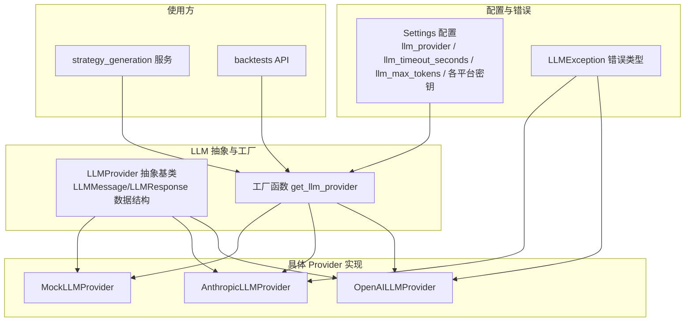
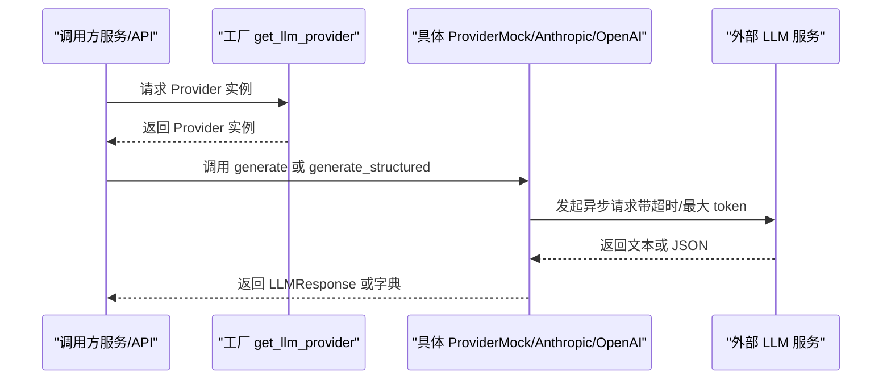
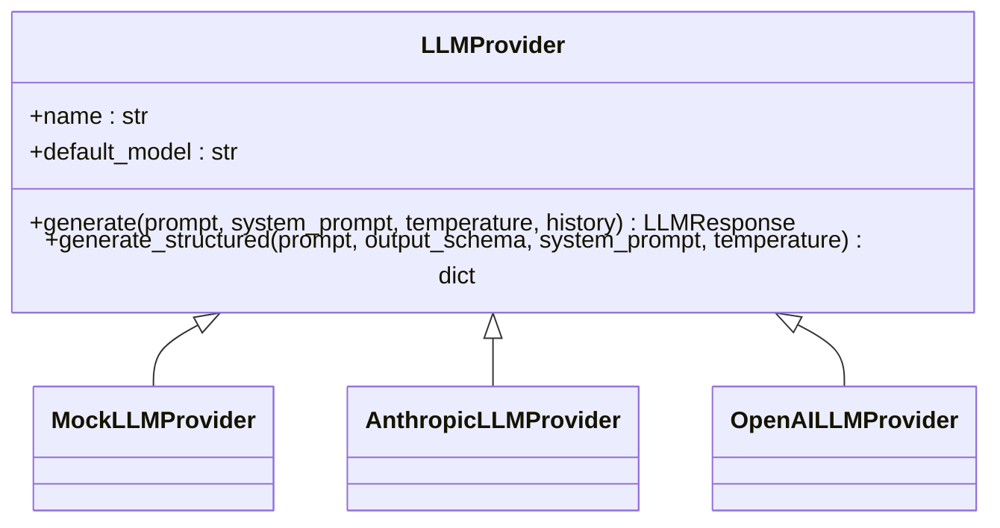
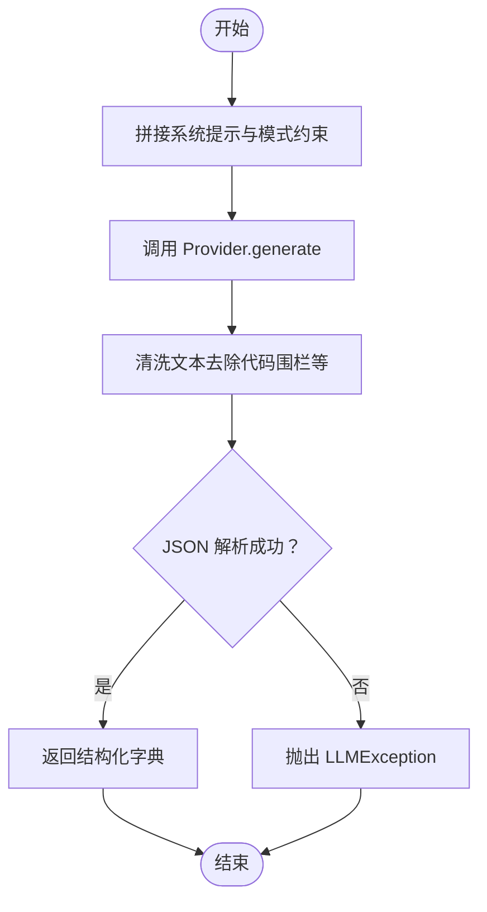

# LLM Provider 抽象设计

<cite>
**本文引用的文件**
- [backend/app/integrations/llm/base.py](file://backend/app/integrations/llm/base.py)
- [backend/app/integrations/llm/factory.py](file://backend/app/integrations/llm/factory.py)
- [backend/app/integrations/llm/__init__.py](file://backend/app/integrations/llm/__init__.py)
- [backend/app/integrations/llm/mock.py](file://backend/app/integrations/llm/mock.py)
- [backend/app/integrations/llm/anthropic.py](file://backend/app/integrations/llm/anthropic.py)
- [backend/app/integrations/llm/openai.py](file://backend/app/integrations/llm/openai.py)
- [backend/app/integrations/llm/prompts.py](file://backend/app/integrations/llm/prompts.py)
- [backend/app/core/config.py](file://backend/app/core/config.py)
- [backend/app/core/errors.py](file://backend/app/core/errors.py)
- [backend/app/services/strategy_generation.py](file://backend/app/services/strategy_generation.py)
- [backend/app/api/v1/backtests.py](file://backend/app/api/v1/backtests.py)
</cite>

## 目录
1. [引言](#引言)
2. [项目结构](#项目结构)
3. [核心组件](#核心组件)
4. [架构总览](#架构总览)
5. [组件详解](#组件详解)
6. [依赖关系分析](#依赖关系分析)
7. [性能考量](#性能考量)
8. [故障排查指南](#故障排查指南)
9. [结论](#结论)
10. [附录](#附录)

## 引言
本文件系统性阐述 LLM Provider 抽象设计，围绕抽象基类 LLMProvider、消息与响应数据结构、生成接口规范、工厂模式与配置注入、错误处理策略以及性能优化建议展开，并结合项目中的具体实现给出可操作的最佳实践与参考路径。

## 项目结构
LLM 集成位于 backend/app/integrations/llm 下，采用“抽象基类 + 多实现 + 工厂 + 配置”的分层设计：
- 抽象层：定义统一接口与数据结构
- 实现层：Mock、Anthropic、OpenAI 三种 Provider
- 工厂层：根据配置动态选择 Provider
- 配置层：集中管理 Provider 名称、超时、最大 token、各平台密钥与基础地址等
- 使用层：服务与 API 层通过工厂获取 Provider 并调用接口

图表来源
- [backend/app/integrations/llm/base.py:31-74](file://backend/app/integrations/llm/base.py#L31-L74)
- [backend/app/integrations/llm/factory.py:11-65](file://backend/app/integrations/llm/factory.py#L11-L65)
- [backend/app/integrations/llm/mock.py:148-181](file://backend/app/integrations/llm/mock.py#L148-L181)
- [backend/app/integrations/llm/anthropic.py:19-149](file://backend/app/integrations/llm/anthropic.py#L19-L149)
- [backend/app/integrations/llm/openai.py:14-131](file://backend/app/integrations/llm/openai.py#L14-L131)
- [backend/app/core/config.py:48-99](file://backend/app/core/config.py#L48-L99)
- [backend/app/core/errors.py:66-71](file://backend/app/core/errors.py#L66-L71)
- [backend/app/services/strategy_generation.py:448-497](file://backend/app/services/strategy_generation.py#L448-L497)
- [backend/app/api/v1/backtests.py:334-341](file://backend/app/api/v1/backtests.py#L334-L341)

章节来源
- [backend/app/integrations/llm/__init__.py:1-7](file://backend/app/integrations/llm/__init__.py#L1-L7)
- [backend/app/integrations/llm/base.py:1-75](file://backend/app/integrations/llm/base.py#L1-L75)
- [backend/app/integrations/llm/factory.py:1-66](file://backend/app/integrations/llm/factory.py#L1-L66)
- [backend/app/core/config.py:1-196](file://backend/app/core/config.py#L1-L196)

## 核心组件
- 抽象基类 LLMProvider：定义统一的初始化参数与两个异步接口 generate/generate_structured
- 数据结构 LLMMessage/LLMResponse：封装单条消息与通用响应载体
- 工厂函数 get_llm_provider：按配置选择 Provider 实例
- 具体 Provider：Mock、Anthropic、OpenAI
- 配置 Settings：集中管理 Provider 名称、超时、最大 token、密钥与基础地址
- 错误类型 LLMException：统一包装 LLM 调用异常

章节来源
- [backend/app/integrations/llm/base.py:12-74](file://backend/app/integrations/llm/base.py#L12-L74)
- [backend/app/integrations/llm/factory.py:11-65](file://backend/app/integrations/llm/factory.py#L11-L65)
- [backend/app/core/config.py:48-99](file://backend/app/core/config.py#L48-L99)
- [backend/app/core/errors.py:66-71](file://backend/app/core/errors.py#L66-L71)

## 架构总览
LLM Provider 的调用链路遵循“工厂选择 Provider → 使用方调用接口 → Provider 发起外部请求 → 返回统一响应”的模式。工厂根据配置自动选择 Provider，支持本地开发与 CI 的 Mock 回退。

图表来源
- [backend/app/integrations/llm/factory.py:11-65](file://backend/app/integrations/llm/factory.py#L11-L65)
- [backend/app/integrations/llm/mock.py:154-181](file://backend/app/integrations/llm/mock.py#L154-L181)
- [backend/app/integrations/llm/anthropic.py:70-149](file://backend/app/integrations/llm/anthropic.py#L70-L149)
- [backend/app/integrations/llm/openai.py:60-131](file://backend/app/integrations/llm/openai.py#L60-L131)

## 组件详解

### 抽象基类与数据结构
- LLMMessage：封装一条对话消息的角色与内容
- LLMResponse：封装统一响应，包含文本、模型名、提供商、用量统计与原始响应对象
- LLMProvider：定义构造参数（API Key、模型、超时、最大 token），并声明两个抽象方法：
  - generate：自由文本生成
  - generate_structured：结构化 JSON 生成，返回 Python 字典

章节来源
- [backend/app/integrations/llm/base.py:12-74](file://backend/app/integrations/llm/base.py#L12-L74)

### 工厂模式与配置注入
- 工厂函数 get_llm_provider：根据传入名称或配置选择 Provider
  - 支持名称：mock、anthropic、openai
  - 未指定时优先使用配置项 llm_provider，否则回退到 mock
  - 对 Anthropic 还会校验模型与基础地址是否配置
- 配置 Settings：集中管理 llm_provider、llm_timeout_seconds、llm_max_tokens、各平台密钥与基础地址
- 自动检测：启动时可从用户主目录的配置文件自动填充密钥与模型，提升本地开发体验

章节来源
- [backend/app/integrations/llm/factory.py:11-65](file://backend/app/integrations/llm/factory.py#L11-L65)
- [backend/app/core/config.py:48-99](file://backend/app/core/config.py#L48-L99)
- [backend/app/core/config.py:110-172](file://backend/app/core/config.py#L110-L172)

### 具体 Provider 实现

#### MockLLMProvider
- 用途：离线/演示场景，返回确定性的策略代码与元数据
- generate：总是返回预设模板与估算用量
- generate_structured：根据输出模式返回策略规格、元数据或模拟的候选标的集合

章节来源
- [backend/app/integrations/llm/mock.py:148-181](file://backend/app/integrations/llm/mock.py#L148-L181)

#### AnthropicLLMProvider
- 依赖：延迟加载 anthropic SDK
- 认证：支持 api_key 或 auth_token（Bearer 风格，适用于兼容代理）
- generate：组装消息列表，调用 messages.create，聚合文本块，提取用量
- generate_structured：在系统提示中附加 JSON 模式约束，解析返回 JSON

章节来源
- [backend/app/integrations/llm/anthropic.py:19-149](file://backend/app/integrations/llm/anthropic.py#L19-L149)

#### OpenAILLMProvider
- 依赖：延迟加载 openai SDK
- 认证：需要 api_key
- generate：组装 messages，调用 chat.completions.create，提取用量
- generate_structured：通过 response_format 指定 json_object，解析返回 JSON

章节来源
- [backend/app/integrations/llm/openai.py:14-131](file://backend/app/integrations/llm/openai.py#L14-L131)

### Prompt 模板与业务集成
- 提供策略生成、元数据抽取、规格生成等系统与用户提示词模板
- 在服务层与 API 层被调用，驱动 Provider 完成结构化生成与代码生成

章节来源
- [backend/app/integrations/llm/prompts.py:1-94](file://backend/app/integrations/llm/prompts.py#L1-L94)
- [backend/app/services/strategy_generation.py:448-514](file://backend/app/services/strategy_generation.py#L448-L514)
- [backend/app/api/v1/backtests.py:334-341](file://backend/app/api/v1/backtests.py#L334-L341)

### 接口规范与参数说明

#### generate
- 功能：生成自由文本响应
- 参数
  - prompt: str，用户输入
  - system_prompt: str | None，系统提示
  - temperature: float，默认 0.2
  - history: list[LLMMessage] | None，历史消息
- 返回：LLMResponse，包含 text、model、provider、usage、raw

章节来源
- [backend/app/integrations/llm/base.py:49-58](file://backend/app/integrations/llm/base.py#L49-L58)
- [backend/app/integrations/llm/anthropic.py:70-113](file://backend/app/integrations/llm/anthropic.py#L70-L113)
- [backend/app/integrations/llm/openai.py:60-94](file://backend/app/integrations/llm/openai.py#L60-L94)
- [backend/app/integrations/llm/mock.py:154-168](file://backend/app/integrations/llm/mock.py#L154-L168)

#### generate_structured
- 功能：生成符合输出模式的 JSON 对象
- 参数
  - prompt: str
  - output_schema: dict[str, Any]，输出模式（JSON Schema 风格）
  - system_prompt: str | None
  - temperature: float，默认 0.2
- 返回：dict[str, Any]，由 Provider 解析后的字典

章节来源
- [backend/app/integrations/llm/base.py:60-73](file://backend/app/integrations/llm/base.py#L60-L73)
- [backend/app/integrations/llm/anthropic.py:115-149](file://backend/app/integrations/llm/anthropic.py#L115-L149)
- [backend/app/integrations/llm/openai.py:96-131](file://backend/app/integrations/llm/openai.py#L96-L131)
- [backend/app/integrations/llm/mock.py:170-181](file://backend/app/integrations/llm/mock.py#L170-L181)

### 使用示例与最佳实践

#### 如何实现自定义 Provider
- 继承 LLMProvider，实现 generate 与 generate_structured
- 在工厂中注册新 Provider 的分支，或通过传入名称强制使用
- 注意：
  - 正确处理 SDK 导入失败与认证缺失
  - 规范化返回 LLMResponse 或结构化字典
  - 合理设置超时与最大 token，避免阻塞

参考路径
- [backend/app/integrations/llm/base.py:31-74](file://backend/app/integrations/llm/base.py#L31-L74)
- [backend/app/integrations/llm/factory.py:11-65](file://backend/app/integrations/llm/factory.py#L11-L65)

#### 如何正确使用抽象接口
- 通过工厂获取 Provider 实例
- 以结构化生成（generate_structured）先行，再进行自由文本生成（generate）
- 对返回结果进行严格校验与异常捕获

参考路径
- [backend/app/services/strategy_generation.py:448-514](file://backend/app/services/strategy_generation.py#L448-L514)
- [backend/app/api/v1/backtests.py:334-341](file://backend/app/api/v1/backtests.py#L334-L341)

## 依赖关系分析
- 抽象层与实现层解耦：通过 ABC 与继承实现多态
- 工厂与配置耦合：工厂依赖配置决定 Provider 选择
- 使用方与工厂解耦：通过统一接口调用，便于替换与测试
- 错误处理：Provider 内部捕获外部调用异常并转为 LLMException

图表来源
- [backend/app/integrations/llm/base.py:31-74](file://backend/app/integrations/llm/base.py#L31-L74)
- [backend/app/integrations/llm/mock.py:148-181](file://backend/app/integrations/llm/mock.py#L148-L181)
- [backend/app/integrations/llm/anthropic.py:19-149](file://backend/app/integrations/llm/anthropic.py#L19-L149)
- [backend/app/integrations/llm/openai.py:14-131](file://backend/app/integrations/llm/openai.py#L14-L131)

章节来源
- [backend/app/integrations/llm/base.py:31-74](file://backend/app/integrations/llm/base.py#L31-L74)
- [backend/app/integrations/llm/factory.py:11-65](file://backend/app/integrations/llm/factory.py#L11-L65)

## 性能考量
- 超时与最大 token：通过配置项 llm_timeout_seconds 与 llm_max_tokens 控制请求耗时与成本
- 结构化优先：先用 generate_structured 获取稳定 JSON，再用 generate 获取代码，减少无效往返
- Mock 回退：在本地或 CI 环境使用 Mock，避免外部依赖导致的性能波动
- 用量统计：LLMResponse 中的 usage 可用于成本监控与预算控制

章节来源
- [backend/app/core/config.py:88-99](file://backend/app/core/config.py#L88-L99)
- [backend/app/integrations/llm/base.py:49-73](file://backend/app/integrations/llm/base.py#L49-L73)
- [backend/app/integrations/llm/mock.py:154-168](file://backend/app/integrations/llm/mock.py#L154-L168)
- [backend/app/integrations/llm/anthropic.py:108-111](file://backend/app/integrations/llm/anthropic.py#L108-L111)
- [backend/app/integrations/llm/openai.py:89-93](file://backend/app/integrations/llm/openai.py#L89-L93)

## 故障排查指南
- 常见问题
  - SDK 未安装：导入异常会被包装为 LLMException
  - 认证缺失：Anthropic 需要 api_key 或 auth_token；OpenAI 需要 api_key
  - 配置不全：Anthropic 需要模型与基础地址
  - 非 JSON 输出：当 Provider 返回非 JSON 文本时抛出 LLMException
- 建议
  - 在本地启用 Mock 以快速验证流程
  - 为 generate_structured 提供明确的 JSON Schema，提高稳定性
  - 捕获并记录 LLMException 的 details 字段，便于定位问题

章节来源
- [backend/app/integrations/llm/anthropic.py:43-68](file://backend/app/integrations/llm/anthropic.py#L43-L68)
- [backend/app/integrations/llm/openai.py:36-58](file://backend/app/integrations/llm/openai.py#L36-L58)
- [backend/app/integrations/llm/factory.py:32-43](file://backend/app/integrations/llm/factory.py#L32-L43)
- [backend/app/core/errors.py:66-71](file://backend/app/core/errors.py#L66-L71)

## 结论
该抽象设计以清晰的接口、稳定的工厂与完善的配置体系，实现了 Provider 的可插拔与可替换。通过 generate 与 generate_structured 的分工协作，既满足结构化需求，又保留自由文本生成的灵活性。配合统一的错误处理与性能参数，可在不同环境中可靠运行。

## 附录

### 关键流程图：generate_structured 到 JSON 解析

图表来源
- [backend/app/integrations/llm/anthropic.py:115-149](file://backend/app/integrations/llm/anthropic.py#L115-L149)
- [backend/app/integrations/llm/openai.py:96-131](file://backend/app/integrations/llm/openai.py#L96-L131)