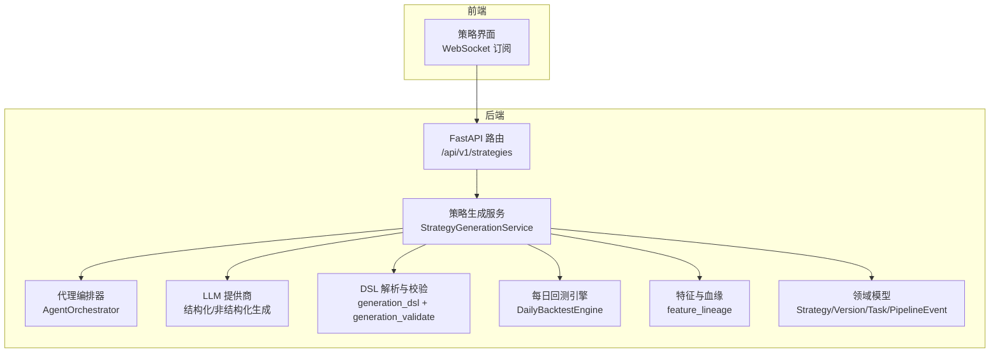
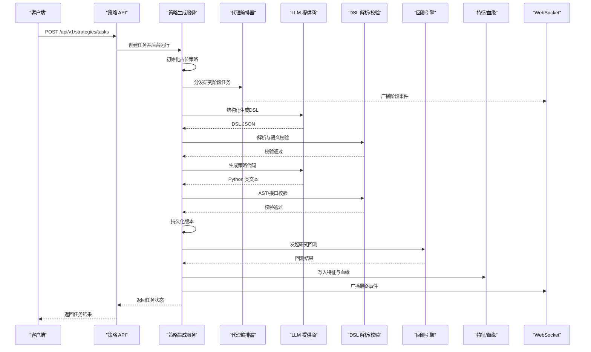
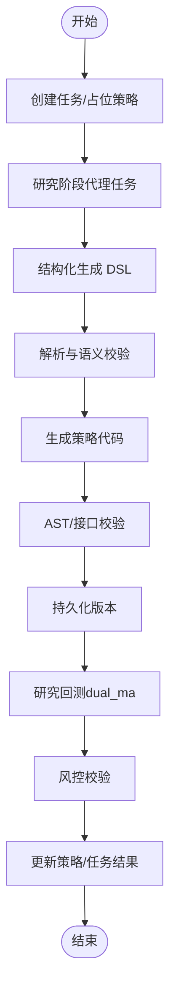
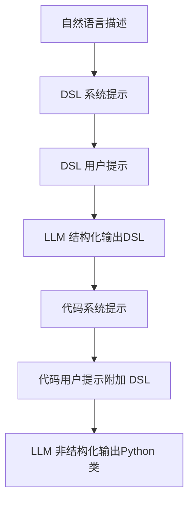
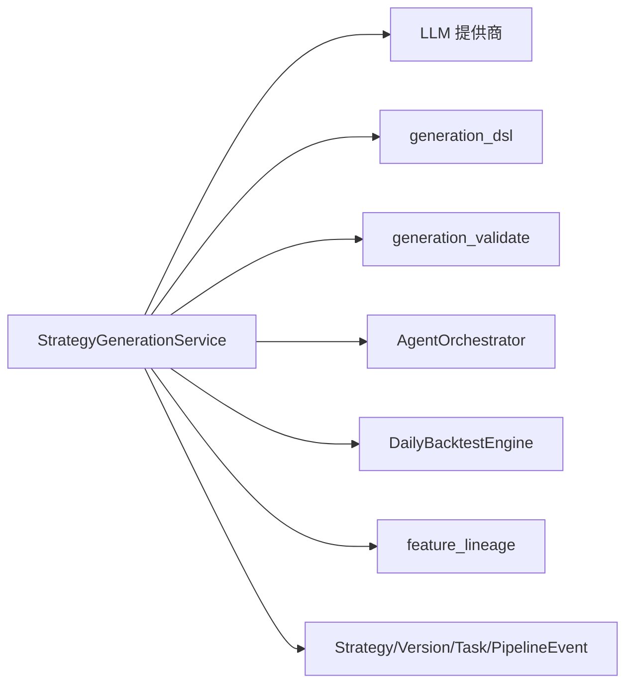

# 策略生成工作流程

<cite>
**本文档引用的文件**
- [backend/app/services/strategy_generation.py](file://backend/app/services/strategy_generation.py)
- [backend/app/services/strategy_generation_research.py](file://backend/app/services/strategy_generation_research.py)
- [backend/app/domains/strategy/generation_dsl.py](file://backend/app/domains/strategy/generation_dsl.py)
- [backend/app/domains/strategy/generation_validate.py](file://backend/app/domains/strategy/generation_validate.py)
- [backend/app/integrations/llm/prompts.py](file://backend/app/integrations/llm/prompts.py)
- [backend/app/domains/strategy/models.py](file://backend/app/domains/strategy/models.py)
- [backend/app/services/agent_orchestrator.py](file://backend/app/services/agent_orchestrator.py)
- [backend/app/services/daily_backtest.py](file://backend/app/services/daily_backtest.py)
- [backend/app/domains/strategy/examples.py](file://backend/app/domains/strategy/examples.py)
- [backend/app/domains/strategy/runtime.py](file://backend/app/domains/strategy/runtime.py)
- [backend/app/services/feature_lineage.py](file://backend/app/services/feature_lineage.py)
- [backend/app/api/v1/strategies.py](file://backend/app/api/v1/strategies.py)
- [doc/plan/phase-2-ai-to-backtest.md](file://doc/plan/phase-2-ai-to-backtest.md)
- [doc/prd/backtest-lab-v2.md](file://doc/prd/backtest-lab-v2.md)
</cite>

## 目录
1. [引言](#引言)
2. [项目结构](#项目结构)
3. [核心组件](#核心组件)
4. [架构总览](#架构总览)
5. [详细组件分析](#详细组件分析)
6. [依赖分析](#依赖分析)
7. [性能考虑](#性能考虑)
8. [故障排查指南](#故障排查指南)
9. [结论](#结论)
10. [附录](#附录)

## 引言
本文件面向“策略生成工作流程”的技术文档，系统阐述从自然语言描述到策略代码生成、再到回测集成与版本管理的完整流水线。文档重点包括：
- 提示词工程的设计原则与优化策略
- 策略生成的五个阶段：需求理解、代码生成、语法验证、回测集成、版本管理
- 提示词模板设计、上下文管理、多轮对话处理与结果优化机制
- 错误恢复策略与性能监控方案
- 最佳实践与常见问题解决方案

## 项目结构
后端采用分层与领域驱动设计，围绕“策略”域构建，包含服务层、API 层、集成层与基础设施层。前端通过 WebSocket 接收实时事件，展示策略生命周期与回测结果。



**图表来源**
- [backend/app/api/v1/strategies.py:301-315](file://backend/app/api/v1/strategies.py#L301-L315)
- [backend/app/services/strategy_generation.py:132-373](file://backend/app/services/strategy_generation.py#L132-L373)
- [backend/app/services/agent_orchestrator.py:15-105](file://backend/app/services/agent_orchestrator.py#L15-L105)
- [backend/app/domains/strategy/generation_dsl.py:98-143](file://backend/app/domains/strategy/generation_dsl.py#L98-L143)
- [backend/app/domains/strategy/generation_validate.py:48-216](file://backend/app/domains/strategy/generation_validate.py#L48-L216)
- [backend/app/services/daily_backtest.py:185-372](file://backend/app/services/daily_backtest.py#L185-L372)
- [backend/app/services/feature_lineage.py:41-194](file://backend/app/services/feature_lineage.py#L41-L194)
- [backend/app/domains/strategy/models.py:9-84](file://backend/app/domains/strategy/models.py#L9-L84)

**章节来源**
- [backend/app/api/v1/strategies.py:162-605](file://backend/app/api/v1/strategies.py#L162-L605)
- [doc/plan/phase-2-ai-to-backtest.md:1-59](file://doc/plan/phase-2-ai-to-backtest.md#L1-L59)

## 核心组件
- 策略生成服务：协调任务创建、阶段推进、事件广播与审计记录，贯穿研究、代码生成、静态校验、版本持久化、回测与风控。
- DSL 与校验：将自然语言约束映射为受控策略意图，进行语义与参数范围校验；同时对生成代码进行 AST 与接口契约校验。
- LLM 提示词：提供系统提示与用户提示模板，确保输出结构化与可执行。
- 代理编排器：将阶段事件转化为代理任务与消息，实现跨组件协作。
- 回测引擎：基于内置策略与真实日线数据执行回测，产出指标与血缘。
- 特征与血缘：将策略使用的特征写入特征集并建立从原始行情到策略运行的血缘链路。
- 领域模型：统一策略、版本、任务与流水事件的数据契约。

**章节来源**
- [backend/app/services/strategy_generation.py:86-373](file://backend/app/services/strategy_generation.py#L86-L373)
- [backend/app/domains/strategy/generation_dsl.py:78-143](file://backend/app/domains/strategy/generation_dsl.py#L78-L143)
- [backend/app/domains/strategy/generation_validate.py:48-216](file://backend/app/domains/strategy/generation_validate.py#L48-L216)
- [backend/app/integrations/llm/prompts.py:1-94](file://backend/app/integrations/llm/prompts.py#L1-L94)
- [backend/app/services/agent_orchestrator.py:15-105](file://backend/app/services/agent_orchestrator.py#L15-L105)
- [backend/app/services/daily_backtest.py:185-372](file://backend/app/services/daily_backtest.py#L185-L372)
- [backend/app/services/feature_lineage.py:41-194](file://backend/app/services/feature_lineage.py#L41-L194)
- [backend/app/domains/strategy/models.py:9-84](file://backend/app/domains/strategy/models.py#L9-L84)

## 架构总览
策略生成工作流以“任务驱动”的方式串联多个阶段，每个阶段产生 PipelineEvent 事件并广播到 WebSocket，前端订阅实时更新。服务层负责与 LLM、DSL 校验、回测引擎与特征血缘模块交互。



**图表来源**
- [backend/app/api/v1/strategies.py:301-315](file://backend/app/api/v1/strategies.py#L301-L315)
- [backend/app/services/strategy_generation.py:132-373](file://backend/app/services/strategy_generation.py#L132-L373)
- [backend/app/services/agent_orchestrator.py:31-105](file://backend/app/services/agent_orchestrator.py#L31-L105)
- [backend/app/domains/strategy/generation_dsl.py:98-143](file://backend/app/domains/strategy/generation_dsl.py#L98-L143)
- [backend/app/domains/strategy/generation_validate.py:107-216](file://backend/app/domains/strategy/generation_validate.py#L107-L216)
- [backend/app/services/daily_backtest.py:285-372](file://backend/app/services/daily_backtest.py#L285-L372)
- [backend/app/services/feature_lineage.py:100-194](file://backend/app/services/feature_lineage.py#L100-L194)

## 详细组件分析

### 策略生成服务（StrategyGenerationService）
职责与流程要点：
- 任务创建：持久化 StrategyTask，初始化占位策略，记录审计日志并广播“排队”事件。
- 研究阶段：触发代理任务，用于宏观与板块轮动扫描。
- 代码生成：先生成结构化 DSL，再生成策略类文本；生成后进行 AST 与接口契约校验。
- 静态检查：记录 AST 解析、DSL 语义、策略接口与未来数据泄漏检查结果。
- 版本管理：将代码与元数据持久化为 StrategyVersion。
- 回测集成：基于默认研究宇宙与 DSL 推导参数，运行内置 dual_ma 研究回测，产出指标并持久化。
- 风控校验：依据风险画像阈值判断是否通过。
- 结果落库：更新策略状态与任务结果，记录审计与最终事件广播。



**图表来源**
- [backend/app/services/strategy_generation.py:132-373](file://backend/app/services/strategy_generation.py#L132-L373)
- [backend/app/services/strategy_generation_research.py:15-81](file://backend/app/services/strategy_generation_research.py#L15-L81)
- [backend/app/domains/strategy/generation_dsl.py:98-143](file://backend/app/domains/strategy/generation_dsl.py#L98-L143)
- [backend/app/domains/strategy/generation_validate.py:107-216](file://backend/app/domains/strategy/generation_validate.py#L107-L216)

**章节来源**
- [backend/app/services/strategy_generation.py:86-373](file://backend/app/services/strategy_generation.py#L86-L373)

### DSL 与校验（generation_dsl + generation_validate）
- DSL 定义：StrategyGenerationSpec 描述策略类型、因子、过滤器、调仓频率、仓位与风控规则，严格禁止未知字段。
- 语义校验：根据风险画像限制单只权重与最大回撤上限；校验因子参数范围与字段命名规范；禁止未来字段名。
- 代码校验：解析 AST，拒绝负偏移 shift、负周期 pct_change/diff、负偏移 roll 等典型未来数据泄漏模式；要求至少存在一个满足策略接口的类（RuleBasedStrategy/BaseStrategy）。

```mermaid
classDiagram
class StrategyGenerationSpec {
+schema_version
+strategy_kind
+factors[]
+filters[]
+rebalance_frequency
+position_rules
+risk_rules
}
class FactorSpec {
+name
+kind
+description
+params{}
}
class PositionRules {
+target_gross_exposure
+max_single_name_weight
+min_positions
+max_positions
}
class RiskRules {
+max_portfolio_drawdown
+per_symbol_stop_loss_pct
+max_sector_weight
}
StrategyGenerationSpec --> FactorSpec : "包含"
StrategyGenerationSpec --> PositionRules : "包含"
StrategyGenerationSpec --> RiskRules : "包含"
```

**图表来源**
- [backend/app/domains/strategy/generation_dsl.py:78-143](file://backend/app/domains/strategy/generation_dsl.py#L78-L143)

**章节来源**
- [backend/app/domains/strategy/generation_dsl.py:1-144](file://backend/app/domains/strategy/generation_dsl.py#L1-L144)
- [backend/app/domains/strategy/generation_validate.py:48-216](file://backend/app/domains/strategy/generation_validate.py#L48-L216)

### LLM 提示词工程（prompts.py）
- 系统提示：限定输出为单一 Python 类，仅允许标准库与 numpy/pandas；要求实现 generate_signals 与风险/调仓方法；明确禁止未来数据使用。
- 用户提示：包含市场、风险画像与自然语言描述；在生成代码阶段附加已验证的 DSL JSON，确保一致性。
- 结构化提示：将自然语言约束映射为受控 JSON（SnakeCase），并提供 JSON Schema 以约束输出。



**图表来源**
- [backend/app/integrations/llm/prompts.py:1-94](file://backend/app/integrations/llm/prompts.py#L1-L94)

**章节来源**
- [backend/app/integrations/llm/prompts.py:1-94](file://backend/app/integrations/llm/prompts.py#L1-L94)

### 代理编排器（AgentOrchestrator）
- 任务派发：按角色查找可用代理 ID，持久化 AgentTask 并记录关联元数据。
- 任务完成：记录结果与完成时间。
- 消息发送：在代理间发送主题化消息，便于跨组件协同。

**章节来源**
- [backend/app/services/agent_orchestrator.py:15-105](file://backend/app/services/agent_orchestrator.py#L15-L105)

### 回测引擎（DailyBacktestEngine）
- 配置：支持内置策略（如 dual_ma、momentum、mean_reversion）与参数注入；交易成本假设可配置。
- 执行：按交易日顺序加载日线行情，构造 StrategyContext，运行策略生成信号与再平衡计划，计算交易与费用，累积净值曲线与交易清单。
- 指标：计算累计收益、年化收益、最大回撤、夏普比率、胜率、换手率、Calmar、Sortino、波动率、盈亏比等。
- 血缘：回测完成后写入 EquityPoint、BacktestTrade、WalkForwardFold 等结果并持久化。

```mermaid
classDiagram
class DailyBacktestConfig {
+universe[]
+start_date
+end_date
+strategy_name
+initial_cash
+strategy_params{}
+cost_config
+in_sample_end_date
}
class DailyBacktestEngine {
+run(config) DailyBacktestResult
+run_and_persist(config) DailyBacktestResult
}
class StrategyRunner {
+initialize(context) StrategyState
+run_daily(context, bars) StrategyRunResult
}
DailyBacktestEngine --> DailyBacktestConfig : "使用"
DailyBacktestEngine --> StrategyRunner : "驱动"
```

**图表来源**
- [backend/app/services/daily_backtest.py:148-372](file://backend/app/services/daily_backtest.py#L148-L372)
- [backend/app/domains/strategy/examples.py:21-200](file://backend/app/domains/strategy/examples.py#L21-L200)
- [backend/app/domains/strategy/runtime.py:175-229](file://backend/app/domains/strategy/runtime.py#L175-L229)

**章节来源**
- [backend/app/services/daily_backtest.py:185-800](file://backend/app/services/daily_backtest.py#L185-L800)
- [backend/app/domains/strategy/examples.py:1-368](file://backend/app/domains/strategy/examples.py#L1-L368)
- [backend/app/domains/strategy/runtime.py:1-240](file://backend/app/domains/strategy/runtime.py#L1-L240)

### 特征与血缘（feature_lineage）
- 特征集：从 DSL 因子推导特征版本，去重并写入 FeatureSet。
- 使用记录：记录 StrategyVersion 对特征的使用关系（FeatureUsage）。
- 血缘链：raw(market_bars_daily) → cleaned → feature(s) → strategy(version) → run，形成可追溯的链路。

**章节来源**
- [backend/app/services/feature_lineage.py:1-217](file://backend/app/services/feature_lineage.py#L1-L217)

### API 屏幕与前端集成
- 任务查询与事件流：提供任务详情、事件列表、策略矩阵与流水看板。
- 实时事件：通过 WebSocket 广播策略事件，前端订阅并渲染。
- 策略详情：包含版本列表、最近事件与关键指标。

**章节来源**
- [backend/app/api/v1/strategies.py:162-605](file://backend/app/api/v1/strategies.py#L162-L605)
- [backend/app/services/strategy_generation.py:556-584](file://backend/app/services/strategy_generation.py#L556-L584)

## 依赖分析
- 服务层依赖：策略生成服务依赖 LLM 提供商、DSL 解析/校验、代理编排器、回测引擎与特征血缘模块。
- 数据契约：领域模型统一了策略、版本、任务与流水事件的存储结构。
- 外部依赖：回测引擎依赖数据库中的 MarketBarDaily 与回测结果模型。



**图表来源**
- [backend/app/services/strategy_generation.py:31-56](file://backend/app/services/strategy_generation.py#L31-L56)
- [backend/app/domains/strategy/models.py:9-84](file://backend/app/domains/strategy/models.py#L9-L84)

**章节来源**
- [backend/app/services/strategy_generation.py:86-373](file://backend/app/services/strategy_generation.py#L86-L373)
- [backend/app/domains/strategy/models.py:9-84](file://backend/app/domains/strategy/models.py#L9-L84)

## 性能考虑
- 回测性能：内置策略与日线数据回测在合理参数范围内应控制在秒级；若需扩展至多策略/多参数扫描，建议引入异步执行与并发队列。
- LLM 生成：结构化输出具备更强可控性，减少后处理开销；温度参数建议维持较低以提升确定性。
- 数据加载：回测前预筛选股票池与日期范围，避免不必要的数据扫描。
- 指标计算：指标计算集中在内存序列上，注意避免重复计算与冗余序列拷贝。

[本节为通用指导，无需特定文件引用]

## 故障排查指南
- 生成失败：检查 LLM 输出是否符合结构化 JSON Schema；确认系统提示与用户提示上下文完整。
- DSL 校验失败：核对风险画像与参数范围；修正因子命名与参数类型。
- 代码校验失败：检查是否存在满足策略接口的类定义；避免负偏移 shift/pct_change/diff/roll 等未来数据使用。
- 回测失败：确认数据库中存在足够日线数据；检查研究宇宙与日期范围；核对交易成本与滑点设置。
- 风控未通过：降低单只权重上限或提高目标杠杆；调整回测参数以改善最大回撤与夏普比率。
- 事件未广播：检查 WebSocket 广播逻辑与订阅连接状态。

**章节来源**
- [backend/app/services/strategy_generation.py:308-373](file://backend/app/services/strategy_generation.py#L308-L373)
- [backend/app/domains/strategy/generation_validate.py:107-216](file://backend/app/domains/strategy/generation_validate.py#L107-L216)
- [backend/app/services/daily_backtest.py:29-47](file://backend/app/services/daily_backtest.py#L29-L47)

## 结论
该工作流通过“受控 DSL + 严格校验 + 真实回测 + 版本管理”的闭环，实现了从自然语言到可验证策略的自动化生产。提示词工程与代理编排器保障了流程的稳定性与可观测性，特征与血缘模块提升了可追溯性与可复用性。建议在后续迭代中增强异步执行与可视化能力，进一步提升用户体验与工程效率。

[本节为总结性内容，无需特定文件引用]

## 附录

### 提示词工程设计原则与优化策略
- 明确输出格式：优先采用结构化 JSON Schema，必要时在代码生成阶段附加已验证的 DSL。
- 上下文完备：在用户提示中包含市场、风险画像与自然语言描述，确保生成意图清晰。
- 未来数据防护：在系统提示中明确禁止使用负偏移与前瞻字段，结合 AST 校验强化约束。
- 温度与采样：生成 DSL 时采用低温度以提升确定性；生成代码时可适度放宽但需严格校验。

**章节来源**
- [backend/app/integrations/llm/prompts.py:1-94](file://backend/app/integrations/llm/prompts.py#L1-L94)
- [backend/app/domains/strategy/generation_validate.py:154-216](file://backend/app/domains/strategy/generation_validate.py#L154-L216)

### 多轮对话与上下文管理
- 通过 StrategyTask 与 PipelineEvent 记录阶段上下文，前端可按阶段回放事件。
- 在代理编排器中维护 correlation_id，便于跨组件关联同一生成任务的多次交互。

**章节来源**
- [backend/app/services/strategy_generation.py:377-443](file://backend/app/services/strategy_generation.py#L377-L443)
- [backend/app/services/agent_orchestrator.py:31-60](file://backend/app/services/agent_orchestrator.py#L31-L60)

### 版本管理与回测集成
- 版本持久化：StrategyVersion 记录代码文本、参数 Schema 与风控规则，保证可复现。
- 回测关联：回测任务与运行记录与策略版本建立外键关联，便于溯源与对比。

**章节来源**
- [backend/app/services/strategy_generation.py:537-554](file://backend/app/services/strategy_generation.py#L537-L554)
- [backend/app/services/daily_backtest.py:285-372](file://backend/app/services/daily_backtest.py#L285-L372)

### 产品规划与演进方向
- 回测实验室 v2.0：新增 Calmar、Sortino、波动率与盈亏比等指标，扩展策略库与可视化组件。
- 端到端测试：覆盖 NL→DSL→校验→真实回测→落库的完整链路，保障质量与可回归性。

**章节来源**
- [doc/prd/backtest-lab-v2.md:77-252](file://doc/prd/backtest-lab-v2.md#L77-L252)
- [doc/plan/phase-2-ai-to-backtest.md:16-59](file://doc/plan/phase-2-ai-to-backtest.md#L16-L59)