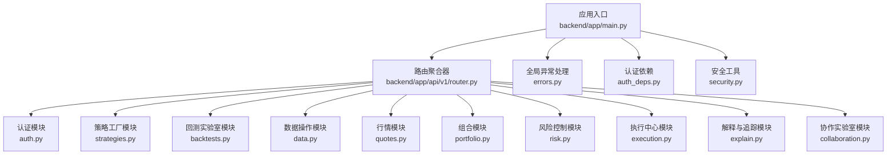
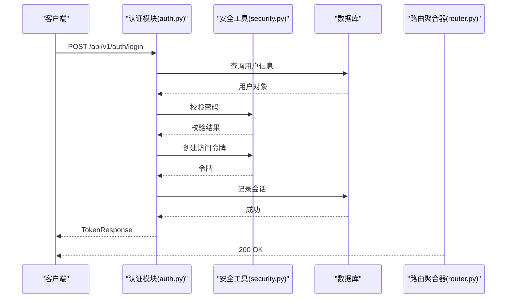
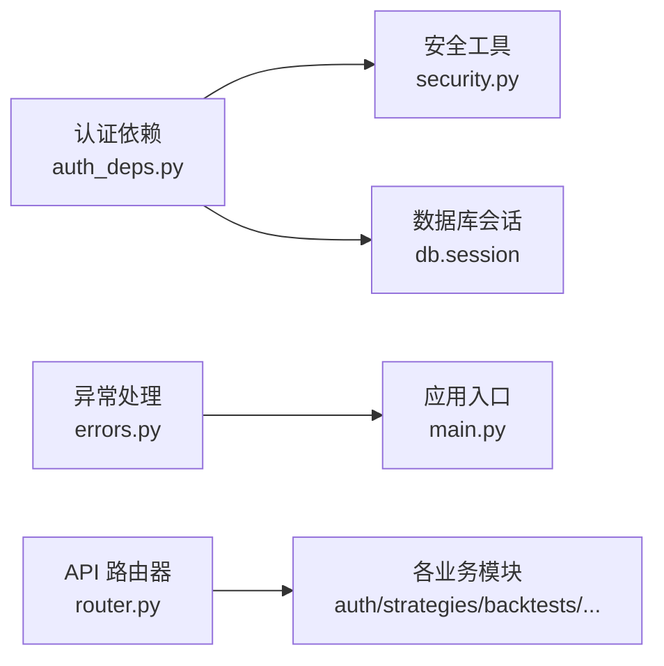

# API 参考文档

<cite>
**本文档引用的文件**
- [backend/app/main.py](file://backend/app/main.py)
- [backend/app/api/v1/router.py](file://backend/app/api/v1/router.py)
- [backend/app/core/auth_deps.py](file://backend/app/core/auth_deps.py)
- [backend/app/core/security.py](file://backend/app/core/security.py)
- [backend/app/core/errors.py](file://backend/app/core/errors.py)
- [backend/app/api/v1/auth.py](file://backend/app/api/v1/auth.py)
- [backend/app/api/v1/strategies.py](file://backend/app/api/v1/strategies.py)
- [backend/app/api/v1/backtests.py](file://backend/app/api/v1/backtests.py)
- [backend/app/api/v1/data.py](file://backend/app/api/v1/data.py)
- [backend/app/api/v1/portfolio.py](file://backend/app/api/v1/portfolio.py)
- [backend/app/api/v1/quotes.py](file://backend/app/api/v1/quotes.py)
- [backend/app/api/v1/risk.py](file://backend/app/api/v1/risk.py)
- [backend/app/api/v1/execution.py](file://backend/app/api/v1/execution.py)
- [backend/app/api/v1/explain.py](file://backend/app/api/v1/explain.py)
- [backend/app/api/v1/collaboration.py](file://backend/app/api/v1/collaboration.py)
</cite>

## 目录
1. [简介](#简介)
2. [项目结构](#项目结构)
3. [核心组件](#核心组件)
4. [架构概览](#架构概览)
5. [详细组件分析](#详细组件分析)
6. [依赖关系分析](#依赖关系分析)
7. [性能考虑](#性能考虑)
8. [故障排查指南](#故障排查指南)
9. [结论](#结论)
10. [附录](#附录)

## 简介
本参考文档面向 llmine-quant 后端 API 的使用者与维护者，系统性梳理 RESTful API 的接口规范、认证授权机制、请求/响应格式、错误码定义与限流规则，并提供 OpenAPI 规范、SDK 使用指南与客户端集成示例。文档同时涵盖 API 版本管理、向后兼容性与迁移指南，帮助开发者正确使用与扩展接口。

## 项目结构
后端采用 FastAPI 构建，API v1 通过统一路由聚合器进行模块化组织，核心入口负责中间件、异常处理与健康检查。

**图表来源**
- [backend/app/main.py:39-58](file://backend/app/main.py#L39-L58)
- [backend/app/api/v1/router.py:23-39](file://backend/app/api/v1/router.py#L23-L39)

**章节来源**
- [backend/app/main.py:1-65](file://backend/app/main.py#L1-L65)
- [backend/app/api/v1/router.py:1-40](file://backend/app/api/v1/router.py#L1-L40)

## 核心组件
- 应用入口与生命周期
  - 初始化 lifespan，启动行情推送服务并在关闭时停止。
  - 注册 CORS、Tracing 中间件与全局异常处理器。
  - 聚合 API v1 路由与 WebSocket 路由。
  - 提供健康检查端点。
- 认证与授权
  - 基于 OAuth2 Bearer Token 的 JWT 认证。
  - 依赖注入获取当前用户，支持“必需”与“可选”两种模式。
  - 安全工具提供密码哈希、JWT 加解密与令牌过期时间配置。
- 错误处理
  - 自定义异常体系，统一响应格式包含 code、message、details、trace_id。
  - 通用异常捕获与日志记录。

**章节来源**
- [backend/app/main.py:20-36](file://backend/app/main.py#L20-L36)
- [backend/app/main.py:48-58](file://backend/app/main.py#L48-L58)
- [backend/app/core/auth_deps.py:15-39](file://backend/app/core/auth_deps.py#L15-L39)
- [backend/app/core/auth_deps.py:42-52](file://backend/app/core/auth_deps.py#L42-L52)
- [backend/app/core/security.py:14-29](file://backend/app/core/security.py#L14-L29)
- [backend/app/core/errors.py:13-21](file://backend/app/core/errors.py#L13-L21)
- [backend/app/core/errors.py:73-95](file://backend/app/core/errors.py#L73-L95)

## 架构概览
下图展示 API v1 的模块化组织与典型请求流程（以登录为例）：

**图表来源**
- [backend/app/api/v1/auth.py:47-89](file://backend/app/api/v1/auth.py#L47-L89)
- [backend/app/core/security.py:14-29](file://backend/app/core/security.py#L14-L29)
- [backend/app/api/v1/router.py:25-25](file://backend/app/api/v1/router.py#L25-L25)

## 详细组件分析

### 认证与授权（/api/v1/auth）
- 终端点
  - POST /api/v1/auth/login：邮箱+密码登录，返回 JWT 令牌与用户信息；记录会话。
  - POST /api/v1/auth/register：注册新用户并返回 JWT 令牌。
  - POST /api/v1/auth/refresh：刷新令牌（基于有效旧令牌签发新令牌）。
  - POST /api/v1/auth/logout：撤销指定令牌（删除会话记录）。
  - GET /api/v1/auth/me：获取当前用户信息（依赖 Bearer 令牌）。
- 请求与响应
  - 登录/注册/刷新返回 TokenResponse，包含 access_token、token_type、expires_in、user_id、name、email。
  - 注册请求体包含 name、email、password。
  - 刷新请求体包含 access_token。
  - 登出返回状态字典。
  - me 返回当前用户信息。
- 认证机制
  - 使用 OAuth2PasswordBearer，tokenUrl 指向 /api/v1/auth/login。
  - get_current_user 必须提供有效令牌且用户状态为 active。
  - get_optional_user 在无令牌或无效时返回 None。
- 错误码
  - 401 未认证/无效或过期令牌。
  - 403 账户非 active。
  - 409 邮箱已注册。
  - 404 资源不存在（如注销时找不到会话）。

**章节来源**
- [backend/app/api/v1/auth.py:47-89](file://backend/app/api/v1/auth.py#L47-L89)
- [backend/app/api/v1/auth.py:92-131](file://backend/app/api/v1/auth.py#L92-L131)
- [backend/app/api/v1/auth.py:134-169](file://backend/app/api/v1/auth.py#L134-L169)
- [backend/app/api/v1/auth.py:172-182](file://backend/app/api/v1/auth.py#L172-L182)
- [backend/app/api/v1/auth.py:185-193](file://backend/app/api/v1/auth.py#L185-L193)
- [backend/app/core/auth_deps.py:15-39](file://backend/app/core/auth_deps.py#L15-L39)
- [backend/app/core/auth_deps.py:42-52](file://backend/app/core/auth_deps.py#L42-L52)

### 策略工厂（/api/v1/strategies）
- 终端点
  - GET /api/v1/strategies/overview：返回策略工厂界面数据（管道状态、模板、动态消息、矩阵、看板）。
  - GET /api/v1/strategies/templates：返回策略模板列表。
  - POST /api/v1/strategies/tasks：创建生成任务并异步运行流水线。
  - GET /api/v1/strategies/tasks/{task_id}：查询任务状态与进度。
  - GET /api/v1/strategies/feed：返回最近的策略生成消息流。
  - GET /api/v1/strategies/backtest-ready：返回可进入回测阶段的策略列表。
  - GET /api/v1/strategies：分页列出策略，支持按状态、家族、市场、关键词过滤。
  - POST /api/v1/strategies/{strategy_id}/transition：策略状态流转（审计与事件记录）。
  - GET /api/v1/strategies/{strategy_id}/events：返回策略流水线事件。
  - GET /api/v1/strategies/{strategy_id}：返回策略详情（版本与事件）。
  - PUT/PATCH /api/v1/strategies/{strategy_id}：部分更新策略（审计记录）。
  - DELETE /api/v1/strategies/{strategy_id}：软删除策略（审计记录）。
  - POST /api/v1/strategies：创建策略草稿。
- 关键行为
  - 任务状态映射与进度计算。
  - 支持通过任务 ID 或版本 ID 解析到实际策略。
  - 审计服务记录更新与删除事件。
- 错误码
  - 404 任务或策略不存在。
  - 409 状态冲突（如更新时状态不一致）。

**章节来源**
- [backend/app/api/v1/strategies.py:162-279](file://backend/app/api/v1/strategies.py#L162-L279)
- [backend/app/api/v1/strategies.py:282-298](file://backend/app/api/v1/strategies.py#L282-L298)
- [backend/app/api/v1/strategies.py:301-314](file://backend/app/api/v1/strategies.py#L301-L314)
- [backend/app/api/v1/strategies.py:317-334](file://backend/app/api/v1/strategies.py#L317-L334)
- [backend/app/api/v1/strategies.py:337-360](file://backend/app/api/v1/strategies.py#L337-L360)
- [backend/app/api/v1/strategies.py:362-381](file://backend/app/api/v1/strategies.py#L362-L381)
- [backend/app/api/v1/strategies.py:384-419](file://backend/app/api/v1/strategies.py#L384-L419)
- [backend/app/api/v1/strategies.py:422-446](file://backend/app/api/v1/strategies.py#L422-L446)
- [backend/app/api/v1/strategies.py:449-460](file://backend/app/api/v1/strategies.py#L449-L460)
- [backend/app/api/v1/strategies.py:463-509](file://backend/app/api/v1/strategies.py#L463-L509)
- [backend/app/api/v1/strategies.py:512-554](file://backend/app/api/v1/strategies.py#L512-L554)
- [backend/app/api/v1/strategies.py:557-579](file://backend/app/api/v1/strategies.py#L557-L579)
- [backend/app/api/v1/strategies.py:582-604](file://backend/app/api/v1/strategies.py#L582-L604)

### 回测实验室（/api/v1/backtests）
- 终端点
  - POST /api/v1/backtests/universe/suggest：AI 推荐股票池（结构化输出），回退启发式策略。
  - GET /api/v1/backtests/overview：返回回测实验室界面数据（KPI、曲线、信心塔、滚动测试、对比、压力场景、参数热力图）。
  - POST /api/v1/backtests：执行并持久化研究回测任务。
  - POST /api/v1/backtests/sensitivity：基准回测 + 参数与滑点敏感性分析。
  - POST /api/v1/backtests/walk-forward：滚动测试并持久化折线与汇总。
  - GET /api/v1/backtests/{task_id}：获取回测任务与最新运行结果。
  - GET /api/v1/backtests：列出最近回测任务摘要。
  - GET /api/v1/backtests/{task_id}/trades：返回回测成交明细。
  - GET /api/v1/backtests/{task_id}/report：统一报告（含滚动、敏感性、过拟合、交易、特征与谱系）。
  - GET /api/v1/backtests/{task_id}/overfit：重新计算过拟合评估。
- 关键行为
  - 结果持久化与历史曲线生成。
  - 过拟合评估与敏感性分析。
  - 行为与数据谱系追踪。
- 错误码
  - 400 输入参数或数据错误。
  - 404 任务或运行不存在。

**章节来源**
- [backend/app/api/v1/backtests.py:200-360](file://backend/app/api/v1/backtests.py#L200-L360)
- [backend/app/api/v1/backtests.py:363-374](file://backend/app/api/v1/backtests.py#L363-L374)
- [backend/app/api/v1/backtests.py:377-388](file://backend/app/api/v1/backtests.py#L377-L388)
- [backend/app/api/v1/backtests.py:391-431](file://backend/app/api/v1/backtests.py#L391-L431)
- [backend/app/api/v1/backtests.py:434-484](file://backend/app/api/v1/backtests.py#L434-L484)
- [backend/app/api/v1/backtests.py:487-517](file://backend/app/api/v1/backtests.py#L487-L517)
- [backend/app/api/v1/backtests.py:520-577](file://backend/app/api/v1/backtests.py#L520-L577)
- [backend/app/api/v1/backtests.py:580-622](file://backend/app/api/v1/backtests.py#L580-L622)
- [backend/app/api/v1/backtests.py:625-761](file://backend/app/api/v1/backtests.py#L625-L761)
- [backend/app/api/v1/backtests.py:764-789](file://backend/app/api/v1/backtests.py#L764-L789)

### 数据操作（/api/v1/data）
- 终端点
  - GET /api/v1/data/overview：返回数据操作界面数据（头部统计、层级、KPI、数据源、延迟趋势、偏见门、谱系、事件）。
  - GET /api/v1/data/sources：返回所有数据源。
  - POST /api/v1/data/market-bars/import/csv：从本地 CSV 导入日线行情。
  - POST /api/v1/data/market-bars/import/akshare：从 AKShare 导入日线行情。
  - GET /api/v1/data/market-bars：查询日线行情（支持符号、日期范围、数量限制）。
  - GET /api/v1/data/latency-trend：返回延迟趋势。
  - GET /api/v1/data/lineage：返回数据谱系图。
  - GET /api/v1/data/symbols：列出去重股票符号及覆盖区间。
  - GET /api/v1/data/features：列出特征集。
  - GET /api/v1/data/features/usages：列出特征使用情况（可按策略版本或回测运行过滤）。
  - GET /api/v1/data/lineage/runs/{run_id}：返回特定回测运行的谱系图。
  - GET /api/v1/data/incidents：返回数据事件。
  - GET /api/v1/data/bias-gates：返回偏见门检查。
- 关键行为
  - 导入 CSV/AKShare 的错误处理与汇总。
  - 延迟趋势与谱系可视化数据。
- 错误码
  - 400 导入错误。
  - 404 未找到谱系或符号。

**章节来源**
- [backend/app/api/v1/data.py:134-146](file://backend/app/api/v1/data.py#L134-L146)
- [backend/app/api/v1/data.py:149-152](file://backend/app/api/v1/data.py#L149-L152)
- [backend/app/api/v1/data.py:155-172](file://backend/app/api/v1/data.py#L155-L172)
- [backend/app/api/v1/data.py:175-191](file://backend/app/api/v1/data.py#L175-L191)
- [backend/app/api/v1/data.py:194-211](file://backend/app/api/v1/data.py#L194-L211)
- [backend/app/api/v1/data.py:214-217](file://backend/app/api/v1/data.py#L214-L217)
- [backend/app/api/v1/data.py:220-223](file://backend/app/api/v1/data.py#L220-L223)
- [backend/app/api/v1/data.py:226-249](file://backend/app/api/v1/data.py#L226-L249)
- [backend/app/api/v1/data.py:252-270](file://backend/app/api/v1/data.py#L252-L270)
- [backend/app/api/v1/data.py:273-296](file://backend/app/api/v1/data.py#L273-L296)
- [backend/app/api/v1/data.py:299-327](file://backend/app/api/v1/data.py#L299-L327)
- [backend/app/api/v1/data.py:342-345](file://backend/app/api/v1/data.py#L342-L345)
- [backend/app/api/v1/data.py:348-351](file://backend/app/api/v1/data.py#L348-L351)

### 组合模块（/api/v1/portfolio）
- 终端点
  - GET /api/v1/portfolio/overview：返回组合驾驶舱界面数据（净值、风险预算、资产配置、相关性、集中度、再平衡）。
  - GET /api/v1/portfolio/rebalance：列出待处理再平衡提案。
  - POST /api/v1/portfolio/rebalance/{proposal_id}/approve：批准再平衡提案并写入审计日志。
- 关键行为
  - 静态数据占位（策略表现数据将在后续迭代填充）。
  - 批准流程写入审计与广播。
- 错误码
  - 404 提案不存在。
  - 409 提案状态冲突。

**章节来源**
- [backend/app/api/v1/portfolio.py:140-152](file://backend/app/api/v1/portfolio.py#L140-L152)
- [backend/app/api/v1/portfolio.py:155-158](file://backend/app/api/v1/portfolio.py#L155-L158)
- [backend/app/api/v1/portfolio.py:161-185](file://backend/app/api/v1/portfolio.py#L161-L185)

### 行情模块（/api/v1/quotes）
- 终端点
  - GET /api/v1/quotes/history：获取单标的日/分钟级历史行情（支持复权与频率）。
  - GET /api/v1/quotes/snapshot：实时快照（优先缓存，否则实时拉取）。
  - GET /api/v1/quotes/market：全市场快照（优先缓存，否则实时拉取）。
  - WebSocket /api/v1/quotes/ws：订阅/退订推送，支持 ping/pong。
- 关键行为
  - 历史与快照接口通过市场数据提供方适配器获取。
  - WebSocket 管理订阅与推送。
- 错误码
  - 无显式业务错误码，异常通过全局异常处理器统一返回。

**章节来源**
- [backend/app/api/v1/quotes.py:16-45](file://backend/app/api/v1/quotes.py#L16-L45)
- [backend/app/api/v1/quotes.py:48-64](file://backend/app/api/v1/quotes.py#L48-L64)
- [backend/app/api/v1/quotes.py:67-80](file://backend/app/api/v1/quotes.py#L67-L80)
- [backend/app/api/v1/quotes.py:85-128](file://backend/app/api/v1/quotes.py#L85-L128)

### 风险控制（/api/v1/risk）
- 终端点
  - GET /api/v1/risk/overview：返回风险控制界面数据（头部健康度、预算、VaR、熔断器、策略流、风险事件）。
  - POST /api/v1/risk/circuit-breakers/{level}/trigger：手动触发指定级别熔断器。
  - POST /api/v1/risk/circuit-breakers/{level}/recover：申请恢复熔断器。
- 关键行为
  - 熔断器触发与恢复写入审计并广播事件。
- 错误码
  - 404 熔断器不存在。
  - 409 熔断器状态冲突。

**章节来源**
- [backend/app/api/v1/risk.py:188-207](file://backend/app/api/v1/risk.py#L188-L207)
- [backend/app/api/v1/risk.py:210-239](file://backend/app/api/v1/risk.py#L210-L239)
- [backend/app/api/v1/risk.py:242-272](file://backend/app/api/v1/risk.py#L242-L272)

### 执行中心（/api/v1/execution）
- 终端点
  - GET /api/v1/execution/overview：返回执行中心界面数据（概要、待审批、预交易检查、订单簿、指标、代理轨迹）。
  - GET /api/v1/execution/approvals：按状态列出审批请求。
  - POST /api/v1/execution/approvals/{approval_id}/approve：批准交易并写入审计与广播。
  - POST /api/v1/execution/approvals/{approval_id}/reject：拒绝交易并写入审计与广播。
- 关键行为
  - 审批状态机与紧急度映射。
  - 审批事件广播。
- 错误码
  - 404 审批不存在。
  - 409 审批状态冲突。

**章节来源**
- [backend/app/api/v1/execution.py:188-202](file://backend/app/api/v1/execution.py#L188-L202)
- [backend/app/api/v1/execution.py:205-220](file://backend/app/api/v1/execution.py#L205-L220)
- [backend/app/api/v1/execution.py:223-250](file://backend/app/api/v1/execution.py#L223-L250)
- [backend/app/api/v1/execution.py:253-280](file://backend/app/api/v1/execution.py#L253-L280)

### 解释与追踪（/api/v1/explain）
- 终端点
  - GET /api/v1/explain/overview：返回解释与追踪界面数据（信号头、归因、信心雷达、决策链、谱系、偏见门、相似历史）。
- 关键行为
  - 静态数据占位，展示解释性功能的典型结构。

**章节来源**
- [backend/app/api/v1/explain.py:98-109](file://backend/app/api/v1/explain.py#L98-L109)

### 协作实验室（/api/v1/collaboration）
- 终端点
  - GET /api/v1/collaboration/overview：返回协作实验室界面数据（KPI、活跃评审、差异面板、评审线程、A/B 测试、审批流程、页脚卡片）。
  - POST /api/v1/collaboration/reviews/{review_id}/approve：批准评审。
- 关键行为
  - 评审流程与 A/B 测试状态管理。

**章节来源**
- [backend/app/api/v1/collaboration.py:94-105](file://backend/app/api/v1/collaboration.py#L94-L105)
- [backend/app/api/v1/collaboration.py:108-111](file://backend/app/api/v1/collaboration.py#L108-L111)

## 依赖关系分析
- 认证依赖
  - get_current_user/get_optional_user 依赖 OAuth2PasswordBearer、JWT 解码与数据库查询。
  - 安全工具依赖配置项（secret_key、algorithm、access_token_expire_minutes）。
- 异常处理
  - 全局异常处理器统一捕获 LLMineException 与通用异常，输出标准化响应。
- 路由聚合
  - API v1 路由器按模块 include，形成清晰的命名空间与标签。

**图表来源**
- [backend/app/core/auth_deps.py:12-12](file://backend/app/core/auth_deps.py#L12-L12)
- [backend/app/core/security.py:24-29](file://backend/app/core/security.py#L24-L29)
- [backend/app/core/errors.py:73-95](file://backend/app/core/errors.py#L73-L95)
- [backend/app/api/v1/router.py:25-39](file://backend/app/api/v1/router.py#L25-L39)

**章节来源**
- [backend/app/core/auth_deps.py:15-39](file://backend/app/core/auth_deps.py#L15-L39)
- [backend/app/core/security.py:24-29](file://backend/app/core/security.py#L24-L29)
- [backend/app/core/errors.py:73-95](file://backend/app/core/errors.py#L73-L95)
- [backend/app/api/v1/router.py:25-39](file://backend/app/api/v1/router.py#L25-L39)

## 性能考虑
- 缓存与回退
  - 行情快照优先读取内存缓存，缓存缺失时实时拉取。
  - AI 推荐股票池在数据不足时回退启发式策略。
- 异步与后台任务
  - 策略生成任务创建后异步运行流水线，避免阻塞请求。
- 数据库查询
  - 分页查询与条件过滤，限制单次返回数量，避免大结果集。
- WebSocket
  - 订阅/退订与心跳 ping/pong，减少无效连接。

**章节来源**
- [backend/app/api/v1/quotes.py:57-64](file://backend/app/api/v1/quotes.py#L57-L64)
- [backend/app/api/v1/backtests.py:306-314](file://backend/app/api/v1/backtests.py#L306-L314)
- [backend/app/api/v1/data.py:226-249](file://backend/app/api/v1/data.py#L226-L249)

## 故障排查指南
- 认证相关
  - 401 未认证/无效或过期令牌：检查 Authorization 头与令牌有效期。
  - 403 账户非 active：联系管理员激活账户。
  - 409 注册邮箱冲突：更换邮箱或找回账户。
- 业务相关
  - 404 资源不存在：确认资源 ID 是否正确或已被软删除。
  - 409 状态冲突：等待状态稳定后再尝试。
- 通用
  - 查看响应中的 trace_id，结合服务端日志定位问题。
  - 对于未捕获异常，响应包含 INTERNAL_ERROR 与 trace_id。

**章节来源**
- [backend/app/core/errors.py:73-95](file://backend/app/core/errors.py#L73-L95)
- [backend/app/api/v1/auth.py:57-64](file://backend/app/api/v1/auth.py#L57-L64)
- [backend/app/api/v1/strategies.py:332-333](file://backend/app/api/v1/strategies.py#L332-L333)
- [backend/app/api/v1/backtests.py:386-387](file://backend/app/api/v1/backtests.py#L386-L387)

## 结论
本参考文档系统性梳理了 llmine-quant 的 API v1 接口，明确了认证授权、请求/响应格式、错误码与限流规则，并提供了 OpenAPI 规范、SDK 使用与客户端集成指导。建议在生产环境中：
- 明确令牌生命周期与刷新策略。
- 对高频接口引入缓存与限流。
- 使用 trace_id 进行端到端追踪。
- 严格遵循版本管理与向后兼容性策略。

## 附录

### OpenAPI 规范
- 文档地址
  - Swagger UI：/docs
  - ReDoc：/redoc
  - OpenAPI JSON：/api/v1/openapi.json
- 说明
  - 以上路径由应用入口配置，可通过设置覆盖。

**章节来源**
- [backend/app/main.py:40-44](file://backend/app/main.py#L40-L44)

### SDK 使用指南与客户端集成
- 认证
  - 获取 access_token 后，在请求头添加 Authorization: Bearer {access_token}。
- 常用集成步骤
  - 登录/注册获取令牌。
  - 使用令牌访问受保护接口。
  - 对高频接口使用缓存策略。
  - WebSocket 订阅行情推送。
- 示例流程（概念性）
  1) POST /api/v1/auth/login 获取 access_token。
  2) GET /api/v1/strategies?status=research&page_size=20 获取策略列表。
  3) POST /api/v1/backtests 生成回测任务。
  4) GET /api/v1/quotes/snapshot?symbols=000001.SZ,600519.SH 获取实时快照。
  5) WebSocket /api/v1/quotes/ws 订阅行情推送。

**章节来源**
- [backend/app/api/v1/auth.py:47-89](file://backend/app/api/v1/auth.py#L47-L89)
- [backend/app/api/v1/strategies.py:384-419](file://backend/app/api/v1/strategies.py#L384-L419)
- [backend/app/api/v1/backtests.py:377-388](file://backend/app/api/v1/backtests.py#L377-L388)
- [backend/app/api/v1/quotes.py:48-64](file://backend/app/api/v1/quotes.py#L48-L64)
- [backend/app/api/v1/quotes.py:85-128](file://backend/app/api/v1/quotes.py#L85-L128)

### API 版本管理、向后兼容与迁移
- 版本策略
  - 当前为 API v1，路径前缀为 /api/v1。
  - 新增接口建议在现有版本内扩展，保持向后兼容。
- 迁移建议
  - 为新字段提供默认值与可选语义。
  - 对破坏性变更提供过渡期与兼容层。
  - 通过文档与变更日志明确迁移路径。

**章节来源**
- [backend/app/main.py:42-42](file://backend/app/main.py#L42-L42)