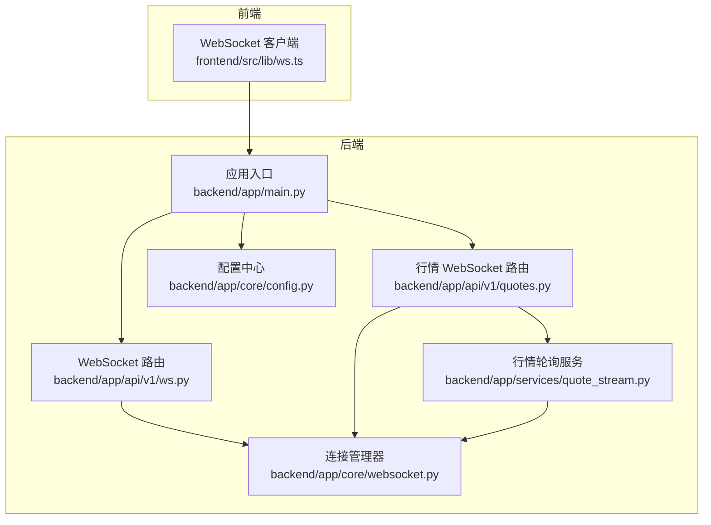
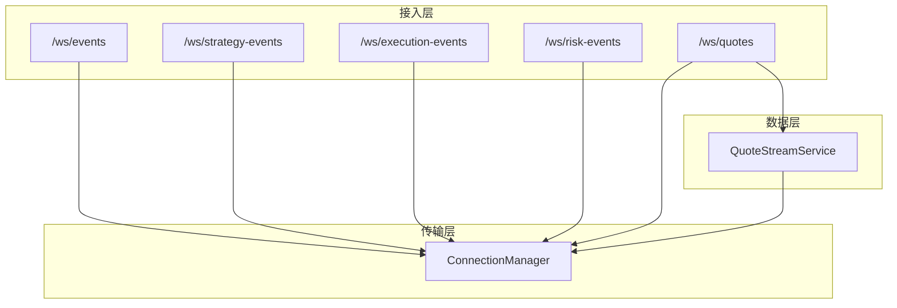
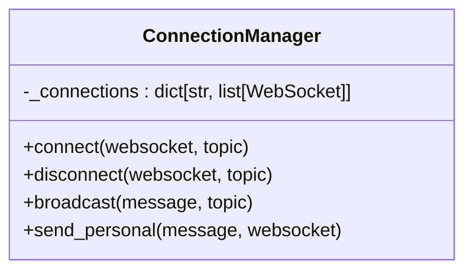
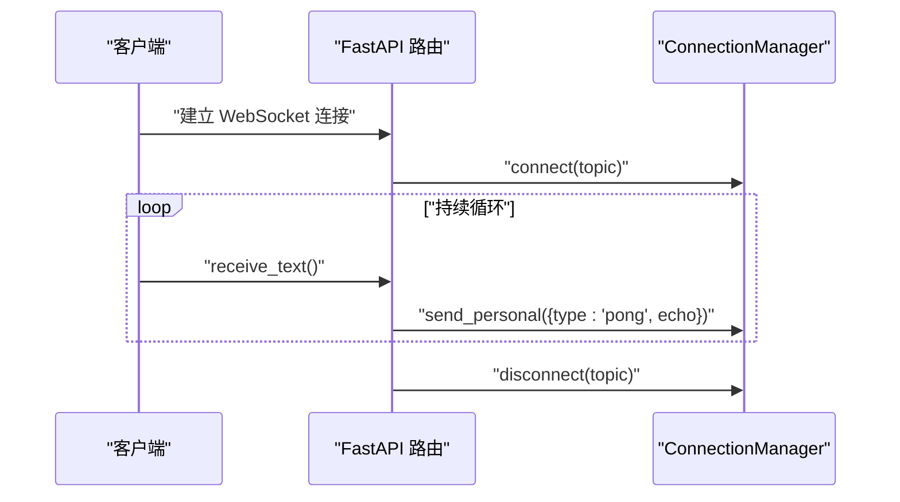
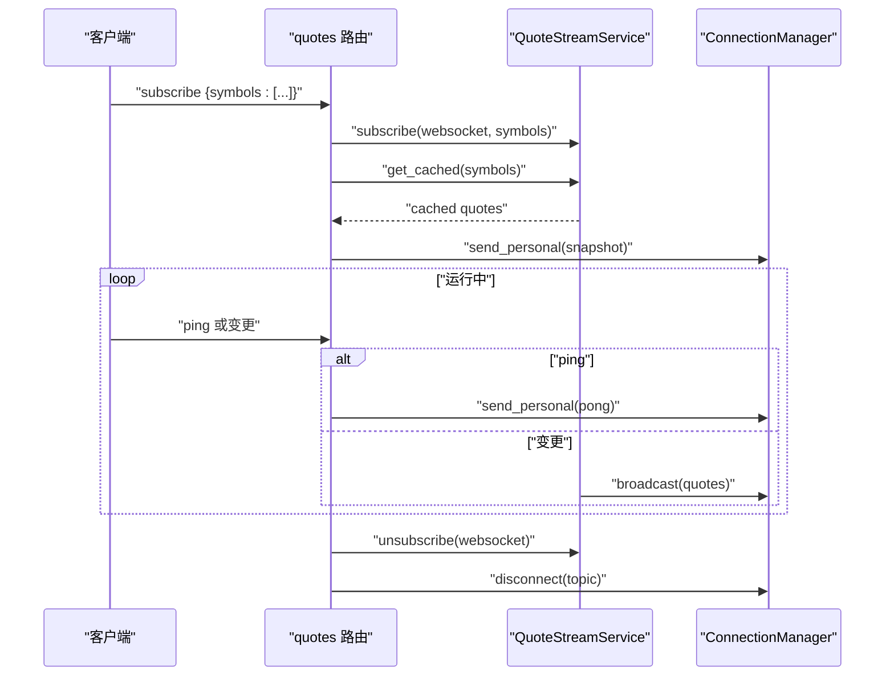
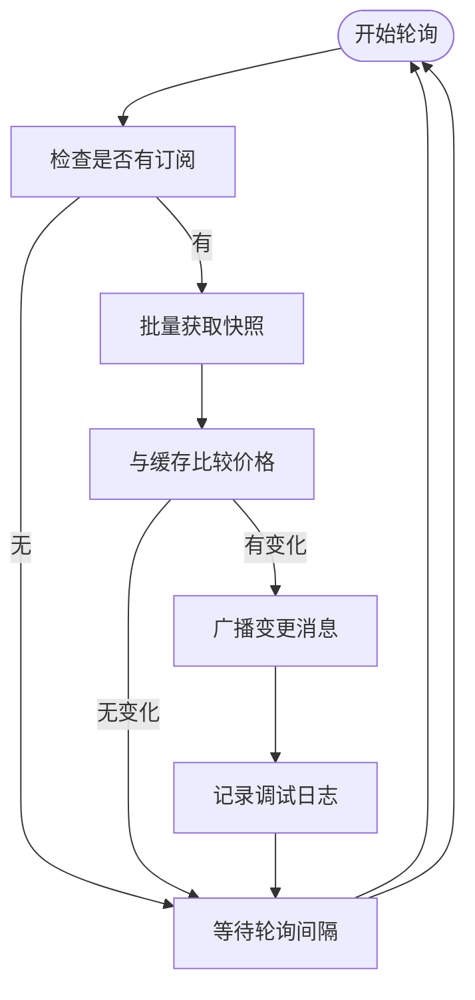
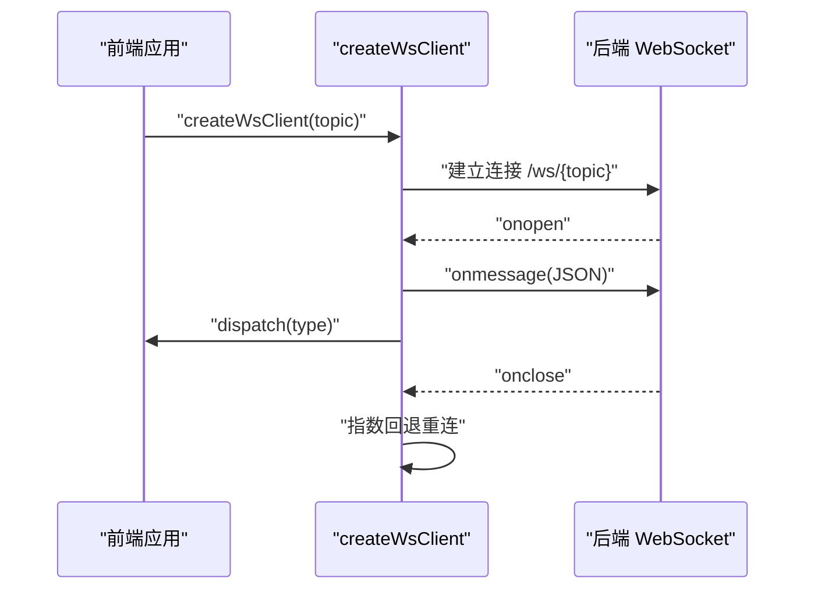
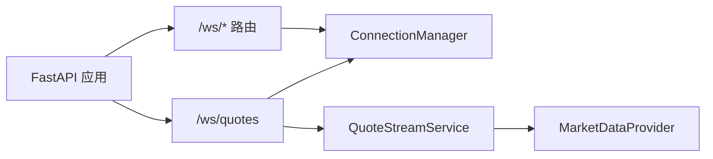

# WebSocket API

<cite>
**本文引用的文件**
- [backend/app/core/websocket.py](file://backend/app/core/websocket.py)
- [backend/app/api/v1/ws.py](file://backend/app/api/v1/ws.py)
- [backend/app/api/v1/quotes.py](file://backend/app/api/v1/quotes.py)
- [backend/app/services/quote_stream.py](file://backend/app/services/quote_stream.py)
- [backend/app/main.py](file://backend/app/main.py)
- [backend/app/core/config.py](file://backend/app/core/config.py)
- [frontend/src/lib/ws.ts](file://frontend/src/lib/ws.ts)
- [backend/app/core/errors.py](file://backend/app/core/errors.py)
- [backend/app/core/logging.py](file://backend/app/core/logging.py)
</cite>

## 目录
1. [简介](#简介)
2. [项目结构](#项目结构)
3. [核心组件](#核心组件)
4. [架构总览](#架构总览)
5. [详细组件分析](#详细组件分析)
6. [依赖关系分析](#依赖关系分析)
7. [性能考虑](#性能考虑)
8. [故障排查指南](#故障排查指南)
9. [结论](#结论)
10. [附录](#附录)

## 简介
本文件为 WebSocket API 的权威技术文档，覆盖实时连接建立、消息路由、事件推送、心跳机制、市场数据推送、交易状态更新、系统通知、错误处理、连接管理、消息格式、订阅机制以及断线重连等完整能力。文档同时提供实时数据处理最佳实践与性能优化建议，并通过可视化图表帮助读者快速理解系统架构与调用流程。

## 项目结构
后端基于 FastAPI 构建，WebSocket 能力由独立的 WebSocket 路由与连接管理器实现；市场行情数据通过后台轮询服务聚合并通过 WebSocket 广播；前端提供通用 WebSocket 客户端封装，支持自动重连与主题订阅。

**图表来源**
- [backend/app/main.py:39-58](file://backend/app/main.py#L39-L58)
- [backend/app/api/v1/ws.py:28-49](file://backend/app/api/v1/ws.py#L28-L49)
- [backend/app/api/v1/quotes.py:85-128](file://backend/app/api/v1/quotes.py#L85-L128)
- [backend/app/core/websocket.py:10-44](file://backend/app/core/websocket.py#L10-L44)
- [backend/app/services/quote_stream.py:62-151](file://backend/app/services/quote_stream.py#L62-L151)
- [frontend/src/lib/ws.ts:27-89](file://frontend/src/lib/ws.ts#L27-L89)

**章节来源**
- [backend/app/main.py:39-58](file://backend/app/main.py#L39-L58)
- [backend/app/api/v1/ws.py:28-49](file://backend/app/api/v1/ws.py#L28-L49)
- [backend/app/api/v1/quotes.py:85-128](file://backend/app/api/v1/quotes.py#L85-L128)
- [backend/app/core/websocket.py:10-44](file://backend/app/core/websocket.py#L10-L44)
- [backend/app/services/quote_stream.py:62-151](file://backend/app/services/quote_stream.py#L62-L151)
- [frontend/src/lib/ws.ts:27-89](file://frontend/src/lib/ws.ts#L27-L89)

## 核心组件
- 连接管理器：负责 WebSocket 连接的接入、断开、按主题广播与点对点发送。
- 通用事件流：提供多主题的通用事件推送通道（如策略事件、执行事件、风控事件）。
- 行情 WebSocket：支持订阅/退订、快照推送、周期性行情变更推送与心跳响应。
- 后台行情轮询服务：按订阅集合拉取行情并增量广播。
- 应用生命周期：在启动时开启行情轮询，在关闭时停止任务。
- 前端客户端：统一的 WebSocket 客户端封装，内置自动重连与事件分发。

**章节来源**
- [backend/app/core/websocket.py:10-44](file://backend/app/core/websocket.py#L10-L44)
- [backend/app/api/v1/ws.py:12-25](file://backend/app/api/v1/ws.py#L12-L25)
- [backend/app/api/v1/quotes.py:85-128](file://backend/app/api/v1/quotes.py#L85-L128)
- [backend/app/services/quote_stream.py:62-151](file://backend/app/services/quote_stream.py#L62-L151)
- [backend/app/main.py:20-36](file://backend/app/main.py#L20-L36)
- [frontend/src/lib/ws.ts:27-89](file://frontend/src/lib/ws.ts#L27-L89)

## 架构总览
WebSocket 架构分为三层：
- 接入层：FastAPI WebSocket 路由注册与连接处理。
- 传输层：连接管理器维护主题到连接列表的映射，负责广播与点对点发送。
- 数据层：行情轮询服务按订阅集合拉取数据并增量推送，其他事件通过连接管理器直接广播。

**图表来源**
- [backend/app/api/v1/ws.py:28-49](file://backend/app/api/v1/ws.py#L28-L49)
- [backend/app/api/v1/quotes.py:85-128](file://backend/app/api/v1/quotes.py#L85-L128)
- [backend/app/core/websocket.py:10-44](file://backend/app/core/websocket.py#L10-L44)
- [backend/app/services/quote_stream.py:62-151](file://backend/app/services/quote_stream.py#L62-L151)

## 详细组件分析

### 连接管理器（ConnectionManager）
- 功能职责
  - 维护主题到 WebSocket 列表的映射。
  - 提供连接接入、断开、按主题广播、点对点发送。
  - 记录连接数与断开事件的日志。
- 关键方法
  - connect：接受连接并加入指定主题。
  - disconnect：从主题中移除连接。
  - broadcast：向主题内所有连接广播消息。
  - send_personal：向单个连接发送消息。
- 复杂度与性能
  - 广播复杂度 O(N)，N 为主题连接数。
  - 断线清理在广播过程中进行，避免并发修改问题。

**图表来源**
- [backend/app/core/websocket.py:10-44](file://backend/app/core/websocket.py#L10-L44)

**章节来源**
- [backend/app/core/websocket.py:10-44](file://backend/app/core/websocket.py#L10-L44)

### 通用事件流（/ws/events 与多主题）
- 路由定义
  - /ws/events：通用事件主题。
  - /ws/strategy-events：策略流水线事件。
  - /ws/execution-events：执行审批事件。
  - /ws/risk-events：风控/熔断事件。
- 处理流程
  - 接受连接并加入对应主题。
  - 循环等待文本消息，收到任意文本后回显 pong 并 echo 原文。
  - 捕获断开异常与未知异常，记录告警并断开连接。
- 心跳机制
  - 服务端不主动 ping，仅在收到客户端文本消息时返回 pong。
  - 建议客户端以固定间隔发送 ping 文本维持存活。

**图表来源**
- [backend/app/api/v1/ws.py:12-25](file://backend/app/api/v1/ws.py#L12-L25)
- [backend/app/core/websocket.py:16-25](file://backend/app/core/websocket.py#L16-L25)

**章节来源**
- [backend/app/api/v1/ws.py:28-49](file://backend/app/api/v1/ws.py#L28-L49)
- [backend/app/api/v1/ws.py:12-25](file://backend/app/api/v1/ws.py#L12-L25)
- [backend/app/core/websocket.py:16-25](file://backend/app/core/websocket.py#L16-L25)

### 行情 WebSocket（/ws/quotes）
- 路由定义
  - /ws/quotes：行情主题。
- 客户端消息协议
  - 订阅：{"action":"subscribe","symbols":["000001.SZ","600519.SH"]}
  - 退订：{"action":"unsubscribe","symbols":["000001.SZ"]}
  - 心跳：{"action":"ping"}
- 服务端消息协议
  - 快照：{"type":"snapshot","data":[...]}
  - 变更：{"type":"quotes","data":[...],"ts":<毫秒时间戳>}
  - 回声：{"type":"pong"}
- 处理流程
  - 接受连接并加入主题。
  - 收到订阅请求后，写入订阅集合，并回传缓存快照。
  - 收到退订请求后，从订阅集合移除。
  - 收到 ping 后，回传 pong。
  - 异常捕获后断开连接并清理订阅。

**图表来源**
- [backend/app/api/v1/quotes.py:85-128](file://backend/app/api/v1/quotes.py#L85-L128)
- [backend/app/services/quote_stream.py:86-147](file://backend/app/services/quote_stream.py#L86-L147)
- [backend/app/core/websocket.py:16-25](file://backend/app/core/websocket.py#L16-L25)

**章节来源**
- [backend/app/api/v1/quotes.py:85-128](file://backend/app/api/v1/quotes.py#L85-L128)
- [backend/app/services/quote_stream.py:86-147](file://backend/app/services/quote_stream.py#L86-L147)

### 后台行情轮询服务（QuoteStreamService）
- 生命周期
  - 启动：创建后台任务，初始化行情提供商。
  - 停止：取消后台任务，释放资源。
- 订阅管理
  - 记录每个连接关注的股票集合。
  - 支持全量退订与部分退订。
- 轮询与广播
  - 仅对有订阅的股票发起一次批量拉取。
  - 比较缓存判断价格变化，仅对发生变化的股票生成增量消息。
  - 使用连接管理器按主题广播。
- 配置
  - 交易时段轮询间隔由配置项控制，默认 3 秒；非交易时段退化为 30 秒以节省带宽。

**图表来源**
- [backend/app/services/quote_stream.py:112-147](file://backend/app/services/quote_stream.py#L112-L147)
- [backend/app/core/config.py:84](file://backend/app/core/config.py#L84)

**章节来源**
- [backend/app/services/quote_stream.py:62-151](file://backend/app/services/quote_stream.py#L62-L151)
- [backend/app/core/config.py:84](file://backend/app/core/config.py#L84)

### 应用生命周期与路由挂载
- 启停钩子
  - 启动：初始化日志、注册路由、启动行情轮询服务。
  - 关闭：停止行情轮询服务。
- 路由挂载
  - REST API 路由前缀为 /api/v1。
  - WebSocket 路由前缀为 /ws。

**章节来源**
- [backend/app/main.py:20-36](file://backend/app/main.py#L20-L36)
- [backend/app/main.py:57-58](file://backend/app/main.py#L57-L58)

### 前端 WebSocket 客户端（自动重连与事件分发）
- 主题路由
  - 支持按主题创建客户端实例，如 strategy-events、execution-events、risk-events。
- 自动重连
  - 断线后指数回退重连，最大延迟不超过 30 秒。
- 事件分发
  - 支持按消息类型分发，或通配符分发。
- 连接状态
  - 提供 isConnected 方法查询当前连接状态。

**图表来源**
- [frontend/src/lib/ws.ts:27-89](file://frontend/src/lib/ws.ts#L27-L89)

**章节来源**
- [frontend/src/lib/ws.ts:27-89](file://frontend/src/lib/ws.ts#L27-L89)

## 依赖关系分析
- 组件耦合
  - WebSocket 路由依赖连接管理器。
  - 行情路由依赖连接管理器与后台轮询服务。
  - 后台轮询服务依赖行情提供商工厂与连接管理器。
- 外部依赖
  - FastAPI 提供路由与 WebSocket 支持。
  - 结构化日志与异常处理贯穿各层。
- 潜在风险
  - 广播过程中的连接断开需及时清理，避免悬挂连接。
  - 行情轮询未订阅时应跳过网络请求，降低外部依赖压力。

**图表来源**
- [backend/app/api/v1/ws.py:28-49](file://backend/app/api/v1/ws.py#L28-L49)
- [backend/app/api/v1/quotes.py:85-128](file://backend/app/api/v1/quotes.py#L85-L128)
- [backend/app/core/websocket.py:10-44](file://backend/app/core/websocket.py#L10-L44)
- [backend/app/services/quote_stream.py:62-151](file://backend/app/services/quote_stream.py#L62-L151)

**章节来源**
- [backend/app/api/v1/ws.py:28-49](file://backend/app/api/v1/ws.py#L28-L49)
- [backend/app/api/v1/quotes.py:85-128](file://backend/app/api/v1/quotes.py#L85-L128)
- [backend/app/core/websocket.py:10-44](file://backend/app/core/websocket.py#L10-L44)
- [backend/app/services/quote_stream.py:62-151](file://backend/app/services/quote_stream.py#L62-L151)

## 性能考虑
- 广播成本控制
  - 按主题分发，避免跨主题广播。
  - 在广播过程中清理断连连接，减少无效发送。
- 行情轮询优化
  - 仅对有订阅的股票发起批量请求，避免全市场扫描。
  - 交易时段默认 3 秒轮询，非交易时段退化为 30 秒。
- 内存与缓存
  - 行情缓存按 symbol 存储，快照与增量推送复用同一缓存。
- 前端优化
  - 自动重连采用指数回退，避免雪崩式重连。
  - 建议客户端在订阅时先请求快照，再接收增量推送。

[本节为通用性能建议，无需特定文件引用]

## 故障排查指南
- 常见错误与处理
  - WebSocket 断开：路由层捕获断开异常并断开连接，记录告警。
  - 未知异常：捕获异常后断开连接并记录告警，确保资源释放。
  - 日志定位：使用结构化日志查看连接/断开/广播等关键事件。
- 建议排查步骤
  - 检查应用启动日志，确认行情轮询已启动。
  - 检查 WebSocket 路由是否正确挂载。
  - 使用前端客户端验证连接与消息收发。
  - 关注广播日志，确认主题连接数量与消息发送情况。

**章节来源**
- [backend/app/api/v1/ws.py:19-23](file://backend/app/api/v1/ws.py#L19-L23)
- [backend/app/api/v1/quotes.py:122-128](file://backend/app/api/v1/quotes.py#L122-L128)
- [backend/app/core/errors.py:73-118](file://backend/app/core/errors.py#L73-L118)
- [backend/app/core/logging.py:11-35](file://backend/app/core/logging.py#L11-L35)

## 结论
该 WebSocket API 体系以连接管理器为核心，结合通用事件流与行情主题，提供了稳定、可扩展的实时通信能力。通过后台轮询与增量广播，既保证了数据新鲜度，又兼顾了性能与成本。前端客户端提供自动重连与事件分发，便于集成与二次开发。建议在生产环境中配合监控与限流策略，进一步提升稳定性与可观测性。

[本节为总结性内容，无需特定文件引用]

## 附录

### API 规范总览
- 通用事件流
  - 路径：/ws/events、/ws/strategy-events、/ws/execution-events、/ws/risk-events
  - 协议：文本消息，服务端收到后回显 pong 并 echo 原文
- 行情主题
  - 路径：/ws/quotes
  - 客户端消息：
    - 订阅：{"action":"subscribe","symbols":["000001.SZ","600519.SH"]}
    - 退订：{"action":"unsubscribe","symbols":["000001.SZ"]}
    - 心跳：{"action":"ping"}
  - 服务端消息：
    - 快照：{"type":"snapshot","data":[...]}
    - 变更：{"type":"quotes","data":[...],"ts":<毫秒时间戳>}
    - 回声：{"type":"pong"}

**章节来源**
- [backend/app/api/v1/ws.py:28-49](file://backend/app/api/v1/ws.py#L28-L49)
- [backend/app/api/v1/quotes.py:85-128](file://backend/app/api/v1/quotes.py#L85-L128)

### 连接管理与订阅机制
- 连接管理
  - 主题维度维护连接列表，支持按主题广播与点对点发送。
- 订阅机制
  - 行情主题：按连接维度记录关注的股票集合，订阅时回传缓存快照。
  - 通用主题：连接即订阅，断开即退订。

**章节来源**
- [backend/app/core/websocket.py:16-25](file://backend/app/core/websocket.py#L16-L25)
- [backend/app/api/v1/quotes.py:105-113](file://backend/app/api/v1/quotes.py#L105-L113)
- [backend/app/services/quote_stream.py:86-100](file://backend/app/services/quote_stream.py#L86-L100)

### 断线重连与心跳
- 服务端
  - 不主动 ping，仅在收到文本消息时回显 pong。
- 客户端
  - 断线自动重连，指数回退，最大延迟 30 秒。
  - 建议客户端定期发送 ping 文本维持连接活跃。

**章节来源**
- [backend/app/api/v1/ws.py:18](file://backend/app/api/v1/ws.py#L18)
- [frontend/src/lib/ws.ts:57-67](file://frontend/src/lib/ws.ts#L57-L67)