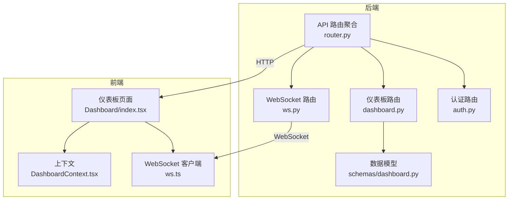
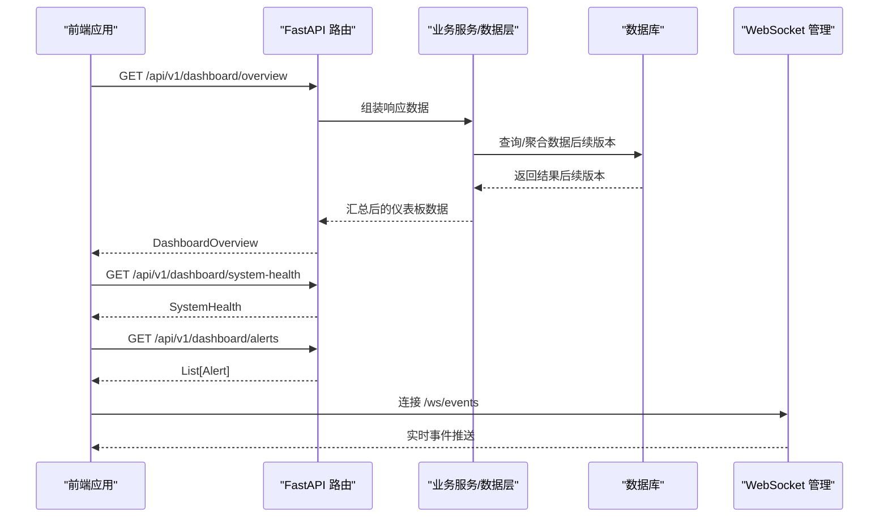
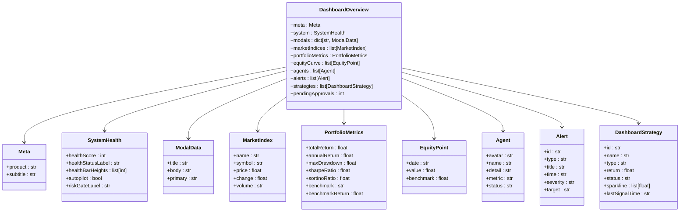
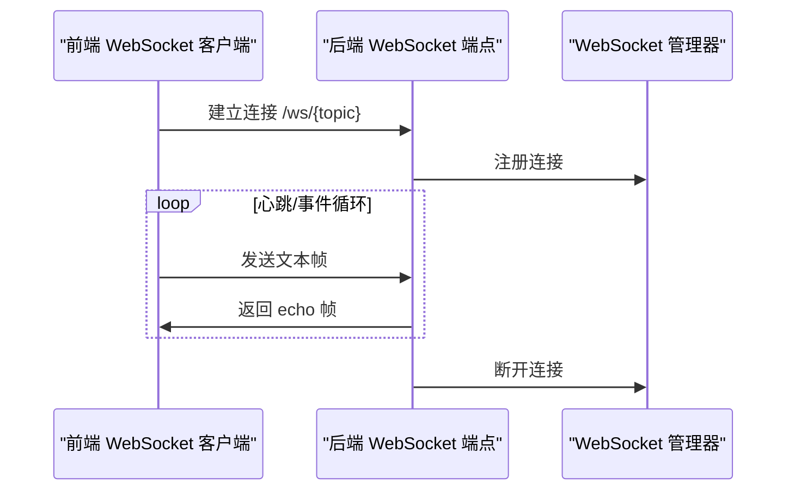
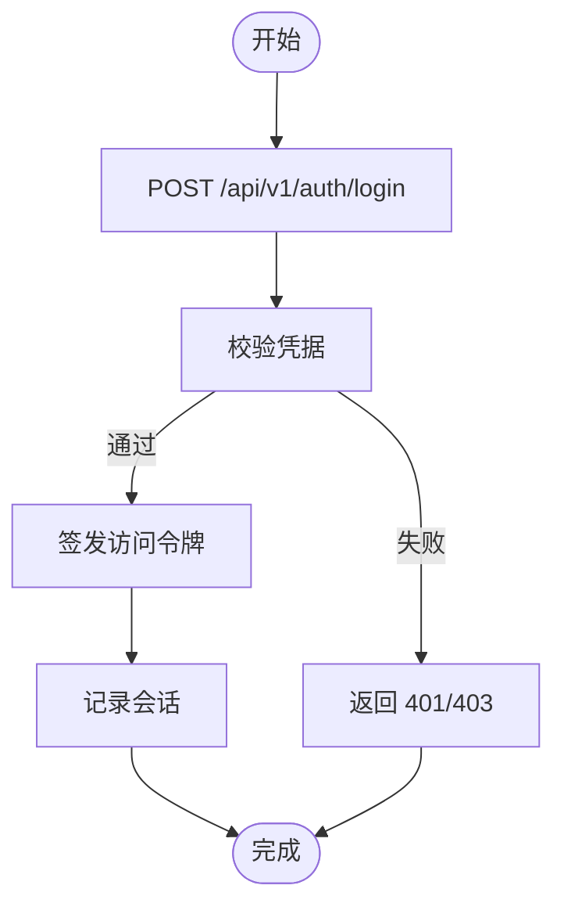
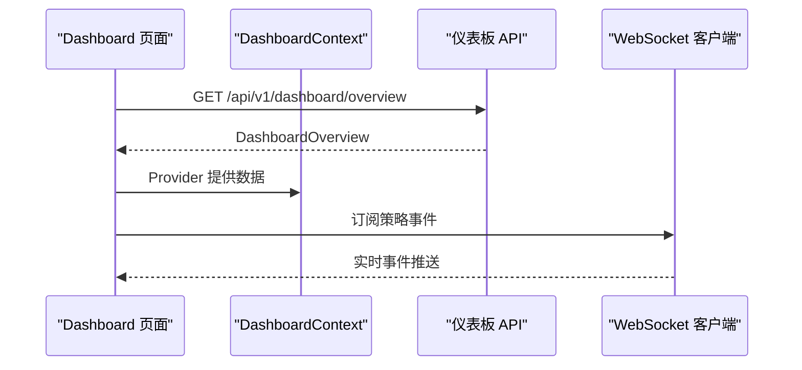
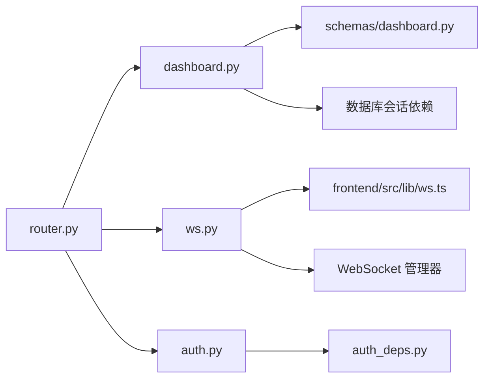

# 仪表板 API

<cite>
**本文档引用的文件**
- [backend/app/api/v1/dashboard.py](file://backend/app/api/v1/dashboard.py)
- [backend/app/schemas/dashboard.py](file://backend/app/schemas/dashboard.py)
- [backend/app/api/v1/router.py](file://backend/app/api/v1/router.py)
- [backend/app/api/v1/ws.py](file://backend/app/api/v1/ws.py)
- [backend/app/api/v1/auth.py](file://backend/app/api/v1/auth.py)
- [backend/app/core/auth_deps.py](file://backend/app/core/auth_deps.py)
- [frontend/src/screens/Dashboard/index.tsx](file://frontend/src/screens/Dashboard/index.tsx)
- [frontend/src/contexts/DashboardContext.tsx](file://frontend/src/contexts/DashboardContext.tsx)
- [frontend/src/lib/ws.ts](file://frontend/src/lib/ws.ts)
- [backend/app/integrations/market_data/factory.py](file://backend/app/integrations/market_data/factory.py)
</cite>

## 目录
1. [简介](#简介)
2. [项目结构](#项目结构)
3. [核心组件](#核心组件)
4. [架构总览](#架构总览)
5. [详细组件分析](#详细组件分析)
6. [依赖关系分析](#依赖关系分析)
7. [性能考虑](#性能考虑)
8. [故障排查指南](#故障排查指南)
9. [结论](#结论)
10. [附录](#附录)

## 简介
本文件为仪表板 API 的全面技术文档，覆盖系统概览、关键指标、实时状态、性能监控等接口规范；包含数据聚合、图表渲染、实时更新、个性化配置等核心功能；说明仪表板组件配置、数据源连接、权限控制和自定义视图的 API 接口；并提供仪表板设计最佳实践与用户体验优化指南。

仪表板 API 当前以 Mock 数据为主，后续将逐步替换为数据库查询与真实业务数据流。前端通过上下文与 WebSocket 实现实时更新与交互。

## 项目结构
仪表板 API 位于后端 FastAPI 应用中，采用模块化路由组织方式，统一挂载于 `/api/v1` 前缀下。前端通过 React 组件消费 API 并维护本地状态。

**图表来源**
- [backend/app/api/v1/router.py:25-26](file://backend/app/api/v1/router.py#L25-L26)
- [backend/app/api/v1/dashboard.py:20-148](file://backend/app/api/v1/dashboard.py#L20-L148)
- [backend/app/schemas/dashboard.py:83-94](file://backend/app/schemas/dashboard.py#L83-L94)
- [frontend/src/screens/Dashboard/index.tsx:17-47](file://frontend/src/screens/Dashboard/index.tsx#L17-L47)
- [frontend/src/contexts/DashboardContext.tsx:1-13](file://frontend/src/contexts/DashboardContext.tsx#L1-L13)
- [frontend/src/lib/ws.ts:27-95](file://frontend/src/lib/ws.ts#L27-L95)

**章节来源**
- [backend/app/api/v1/router.py:1-40](file://backend/app/api/v1/router.py#L1-L40)
- [backend/app/api/v1/dashboard.py:1-148](file://backend/app/api/v1/dashboard.py#L1-L148)
- [frontend/src/screens/Dashboard/index.tsx:1-47](file://frontend/src/screens/Dashboard/index.tsx#L1-L47)

## 核心组件
- 仪表板概览接口：返回系统元信息、健康度、模态框配置、市场指数、投资组合指标、净值曲线、Agent 状态、告警队列、策略列表与待审批数量。
- 系统健康接口：返回系统健康评分、状态标签、柱状图高度序列、自动驾驶开关与风控门状态。
- 告警接口：返回当前活动告警列表。
- WebSocket 实时事件：提供通用事件流与策略/执行/风控主题订阅。
- 认证与权限：基于 JWT 的登录、注册、刷新与登出流程，以及当前用户查询。
- 数据源与市场数据：数据源概览、延迟趋势、偏差门检查、特征使用追踪、导入任务等（用于数据面板，与仪表板联动）。

**章节来源**
- [backend/app/api/v1/dashboard.py:121-147](file://backend/app/api/v1/dashboard.py#L121-L147)
- [backend/app/api/v1/ws.py:28-50](file://backend/app/api/v1/ws.py#L28-L50)
- [backend/app/api/v1/auth.py:47-194](file://backend/app/api/v1/auth.py#L47-L194)

## 架构总览
仪表板 API 的请求处理链路如下：

**图表来源**
- [backend/app/api/v1/dashboard.py:121-147](file://backend/app/api/v1/dashboard.py#L121-L147)
- [backend/app/api/v1/ws.py:28-50](file://backend/app/api/v1/ws.py#L28-L50)

## 详细组件分析

### 仪表板概览接口
- 路径：GET /api/v1/dashboard/overview
- 功能：一次性返回完整的仪表板数据，包括系统元信息、健康度、模态框、市场指数、投资组合指标、净值曲线、Agent 状态、告警队列、策略列表与待审批数量。
- 响应模型：DashboardOverview（包含嵌套模型：Meta、SystemHealth、ModalData、MarketIndex、PortfolioMetrics、EquityPoint、Agent、Alert、DashboardStrategy）。
- 数据来源：当前为 Mock 数据，后续将替换为数据库查询与实时数据聚合。

**图表来源**
- [backend/app/schemas/dashboard.py:7-94](file://backend/app/schemas/dashboard.py#L7-L94)
- [backend/app/api/v1/dashboard.py:121-135](file://backend/app/api/v1/dashboard.py#L121-L135)

**章节来源**
- [backend/app/api/v1/dashboard.py:121-135](file://backend/app/api/v1/dashboard.py#L121-L135)
- [backend/app/schemas/dashboard.py:83-94](file://backend/app/schemas/dashboard.py#L83-L94)

### 系统健康接口
- 路径：GET /api/v1/dashboard/system-health
- 功能：返回系统健康状态，包括健康评分、状态标签、柱状图高度序列、自动驾驶开关与风控门状态。
- 响应模型：SystemHealth。

**章节来源**
- [backend/app/api/v1/dashboard.py:138-141](file://backend/app/api/v1/dashboard.py#L138-L141)
- [backend/app/schemas/dashboard.py:63-69](file://backend/app/schemas/dashboard.py#L63-L69)

### 告警接口
- 路径：GET /api/v1/dashboard/alerts
- 功能：返回当前活动告警列表。
- 响应模型：List[Alert]。

**章节来源**
- [backend/app/api/v1/dashboard.py:144-147](file://backend/app/api/v1/dashboard.py#L144-L147)
- [backend/app/schemas/dashboard.py:42-49](file://backend/app/schemas/dashboard.py#L42-L49)

### WebSocket 实时事件
- 路径：/ws/events、/ws/strategy-events、/ws/execution-events、/ws/risk-events
- 功能：提供通用事件流与策略、执行、风控主题的实时事件推送；客户端自动重连与消息分发。
- 前端集成：提供 createWsClient 工厂方法，按主题创建独立客户端实例。

**图表来源**
- [backend/app/api/v1/ws.py:28-50](file://backend/app/api/v1/ws.py#L28-L50)
- [frontend/src/lib/ws.ts:27-95](file://frontend/src/lib/ws.ts#L27-L95)

**章节来源**
- [backend/app/api/v1/ws.py:12-50](file://backend/app/api/v1/ws.py#L12-L50)
- [frontend/src/lib/ws.ts:1-95](file://frontend/src/lib/ws.ts#L1-L95)

### 认证与权限
- 登录：POST /api/v1/auth/login，返回 JWT 令牌与用户信息，并记录会话。
- 注册：POST /api/v1/auth/register，创建新用户并返回 JWT 令牌。
- 刷新：POST /api/v1/auth/refresh，颁发新令牌。
- 登出：POST /api/v1/auth/logout，撤销令牌。
- 当前用户：GET /api/v1/auth/me，返回当前用户信息。
- 依赖注入：OAuth2PasswordBearer 提供令牌解析，get_current_user 获取当前激活用户。

**图表来源**
- [backend/app/api/v1/auth.py:47-89](file://backend/app/api/v1/auth.py#L47-L89)
- [backend/app/core/auth_deps.py:15-39](file://backend/app/core/auth_deps.py#L15-L39)

**章节来源**
- [backend/app/api/v1/auth.py:47-194](file://backend/app/api/v1/auth.py#L47-L194)
- [backend/app/core/auth_deps.py:1-53](file://backend/app/core/auth_deps.py#L1-L53)

### 数据源与市场数据（与仪表板联动）
- 数据概览：GET /api/v1/data/overview，返回数据源层级、健康度、延迟趋势、偏差门检查、血缘关系与事件。
- 数据源列表：GET /api/v1/data/sources。
- 市场数据导入：CSV 导入与 AKShare 导入。
- 市场数据查询：GET /api/v1/data/market-bars，支持符号、日期范围与限制。
- 特征与使用追踪：GET /api/v1/data/features 与 GET /api/v1/data/features/usages。
- 血缘关系：GET /api/v1/data/lineage 与 GET /api/v1/data/lineage/runs/{run_id}。
- 事件与偏差门：GET /api/v1/data/incidents 与 GET /api/v1/data/bias-gates。

这些接口为仪表板的数据面板提供底层数据支撑，便于进行数据质量监控与可视化展示。

**章节来源**
- [backend/app/api/v1/data.py:134-392](file://backend/app/api/v1/data.py#L134-L392)

### 前端集成与上下文
- 页面组件：Dashboard/index.tsx 在挂载时调用仪表板概览接口，并通过 DashboardProvider 将数据传递给子组件。
- 上下文：DashboardContext.tsx 提供 useDashboard 钩子，确保在 Provider 内部使用。
- 实时更新：前端通过 createWsClient 订阅策略/执行/风控事件，实现动态更新。

**图表来源**
- [frontend/src/screens/Dashboard/index.tsx:17-47](file://frontend/src/screens/Dashboard/index.tsx#L17-L47)
- [frontend/src/contexts/DashboardContext.tsx:1-13](file://frontend/src/contexts/DashboardContext.tsx#L1-L13)
- [frontend/src/lib/ws.ts:27-95](file://frontend/src/lib/ws.ts#L27-L95)

**章节来源**
- [frontend/src/screens/Dashboard/index.tsx:1-47](file://frontend/src/screens/Dashboard/index.tsx#L1-L47)
- [frontend/src/contexts/DashboardContext.tsx:1-13](file://frontend/src/contexts/DashboardContext.tsx#L1-L13)
- [frontend/src/lib/ws.ts:1-95](file://frontend/src/lib/ws.ts#L1-L95)

## 依赖关系分析
- 路由聚合：router.py 将各模块路由挂载到统一前缀，dashboard 路由位于 /api/v1/dashboard。
- 仪表板依赖：dashboard.py 依赖 schemas/dashboard.py 中的数据模型；使用数据库会话依赖 get_db（当前未实际使用，后续版本将替换为查询）。
- WebSocket：ws.py 依赖 WebSocket 管理器与日志模块；前端通过 ws.ts 创建客户端并按主题订阅。
- 认证：auth.py 依赖安全工具与会话模型；auth_deps.py 提供 get_current_user 依赖注入。
- 数据源工厂：market_data/factory.py 根据配置选择具体数据提供商实现。

**图表来源**
- [backend/app/api/v1/router.py:25-26](file://backend/app/api/v1/router.py#L25-L26)
- [backend/app/api/v1/dashboard.py:3-18](file://backend/app/api/v1/dashboard.py#L3-L18)
- [backend/app/api/v1/ws.py:3-6](file://backend/app/api/v1/ws.py#L3-L6)
- [frontend/src/lib/ws.ts:27-95](file://frontend/src/lib/ws.ts#L27-L95)
- [backend/app/api/v1/auth.py:13-18](file://backend/app/api/v1/auth.py#L13-L18)
- [backend/app/core/auth_deps.py:12-12](file://backend/app/core/auth_deps.py#L12-L12)

**章节来源**
- [backend/app/api/v1/router.py:1-40](file://backend/app/api/v1/router.py#L1-L40)
- [backend/app/api/v1/dashboard.py:1-148](file://backend/app/api/v1/dashboard.py#L1-L148)
- [backend/app/api/v1/ws.py:1-50](file://backend/app/api/v1/ws.py#L1-L50)
- [backend/app/api/v1/auth.py:1-194](file://backend/app/api/v1/auth.py#L1-L194)
- [backend/app/core/auth_deps.py:1-53](file://backend/app/core/auth_deps.py#L1-L53)

## 性能考虑
- Mock 数据到真实数据的迁移：建议在 dashboard 概览接口中引入分页与缓存策略，避免一次性加载大量历史净值曲线与策略明细。
- WebSocket 吞吐：前端客户端具备指数退避重连机制，建议后端对心跳包进行节流与错误日志记录，防止资源浪费。
- 认证与会话：登录/刷新接口需严格校验令牌有效性与用户状态，避免重复会话记录导致的数据库压力。
- 数据源延迟：结合 data 屏幕的延迟趋势与偏差门检查，前端可针对高延迟数据源进行降级或提示策略。

[本节为通用指导，无需特定文件来源]

## 故障排查指南
- 仪表板概览接口报错：检查后端日志与数据库连接；当前版本为 Mock 数据，若出现异常需定位路由与模型定义。
- WebSocket 连接失败：确认前端 ws 基础地址与后端端点一致；查看连接/断开回调与重连逻辑。
- 认证失败：核对登录凭据、令牌格式与用户状态；检查会话表记录是否正确写入。
- 数据源异常：参考 data 屏幕的健康度与事件列表，定位具体数据源与提供商实现。

**章节来源**
- [backend/app/api/v1/dashboard.py:121-147](file://backend/app/api/v1/dashboard.py#L121-L147)
- [backend/app/api/v1/ws.py:12-25](file://backend/app/api/v1/ws.py#L12-L25)
- [backend/app/api/v1/auth.py:53-62](file://backend/app/api/v1/auth.py#L53-L62)
- [backend/app/api/v1/data.py:134-146](file://backend/app/api/v1/data.py#L134-L146)

## 结论
仪表板 API 当前以 Mock 数据为基础，提供完整的前端界面占位与交互体验；后续将逐步接入数据库查询、实时事件流与更丰富的指标体系。通过统一的路由聚合、清晰的数据模型与前后端协作，可实现高性能、可扩展的量化交易仪表板。

[本节为总结性内容，无需特定文件来源]

## 附录

### API 接口清单（概览）
- GET /api/v1/dashboard/overview：仪表板概览
- GET /api/v1/dashboard/system-health：系统健康
- GET /api/v1/dashboard/alerts：活动告警
- GET /api/v1/data/overview：数据概览（与仪表板联动）
- GET /api/v1/data/sources：数据源列表
- GET /api/v1/data/market-bars：市场日线数据
- GET /api/v1/data/features：特征列表
- GET /api/v1/data/features/usages：特征使用追踪
- GET /api/v1/data/incidents：数据事件
- GET /api/v1/data/bias-gates：偏差门检查
- POST /api/v1/data/market-bars/import/csv：CSV 导入
- POST /api/v1/data/market-bars/import/akshare：AKShare 导入
- POST /api/v1/auth/login：登录
- POST /api/v1/auth/register：注册
- POST /api/v1/auth/refresh：刷新令牌
- POST /api/v1/auth/logout：登出
- GET /api/v1/auth/me：当前用户
- WebSocket /ws/events：通用事件
- WebSocket /ws/strategy-events：策略事件
- WebSocket /ws/execution-events：执行事件
- WebSocket /ws/risk-events：风控事件

[本节为概览性内容，无需特定文件来源]