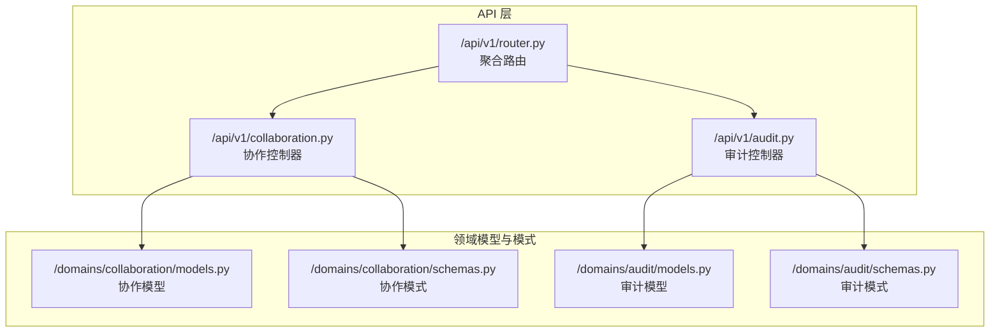
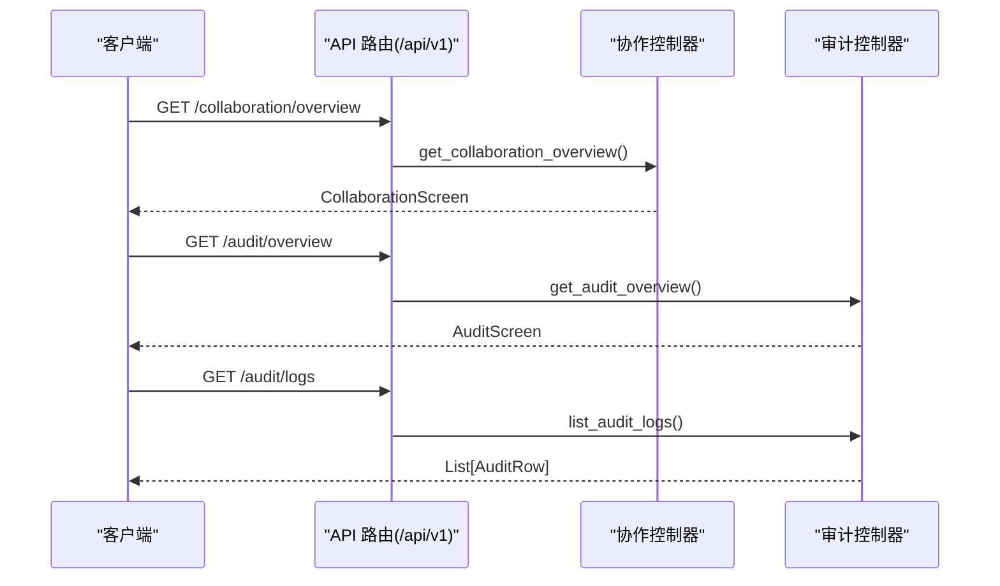
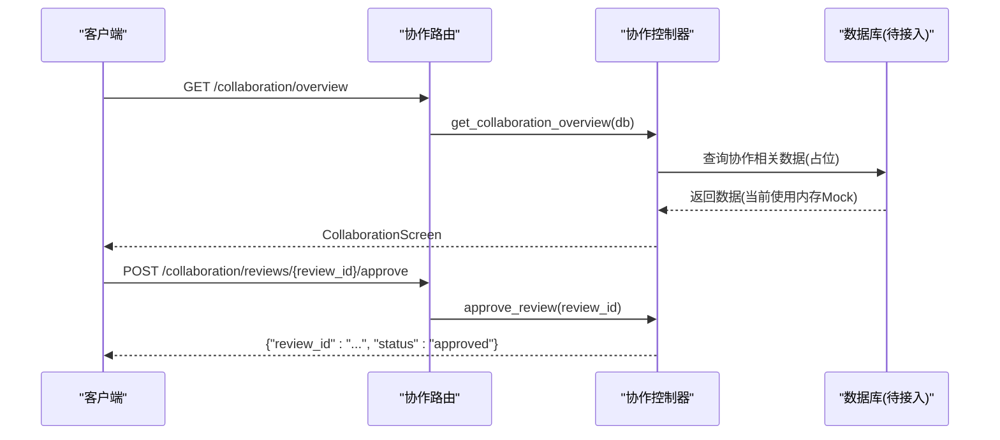
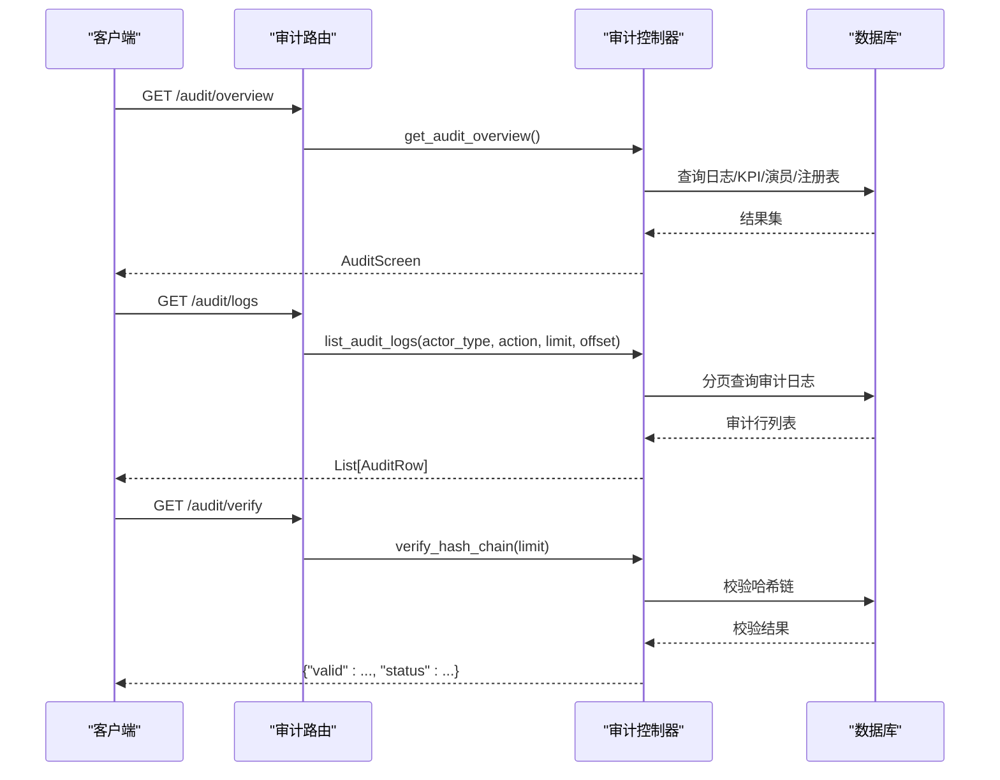
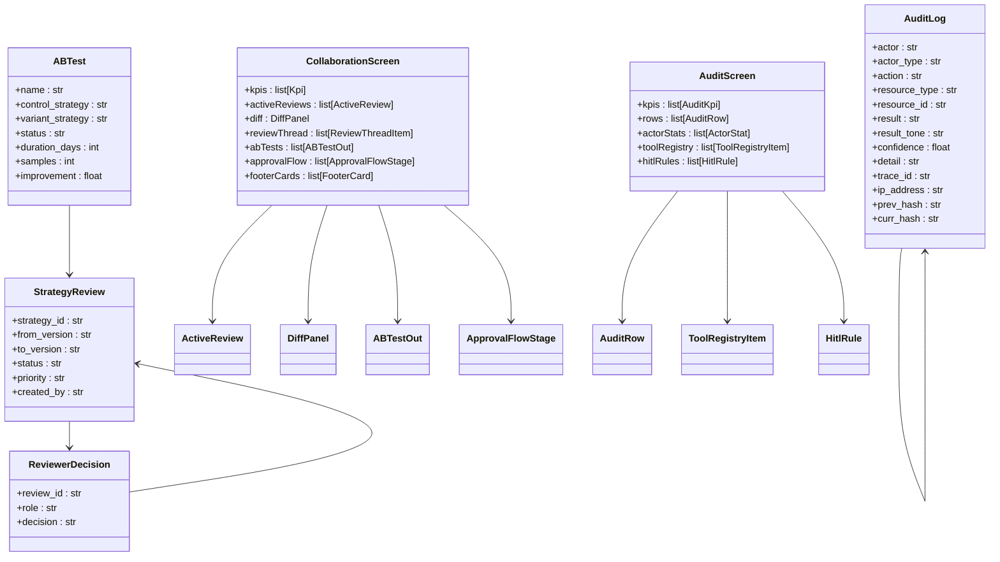
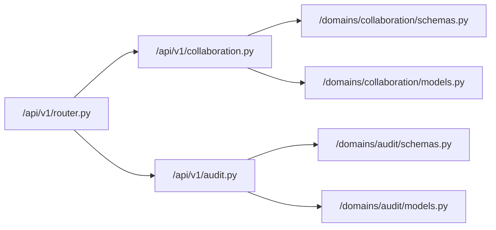

# 协作 API

<cite>
**本文引用的文件**
- [backend/app/api/v1/collaboration.py](file://backend/app/api/v1/collaboration.py)
- [backend/app/domains/collaboration/schemas.py](file://backend/app/domains/collaboration/schemas.py)
- [backend/app/domains/collaboration/models.py](file://backend/app/domains/collaboration/models.py)
- [backend/app/api/v1/audit.py](file://backend/app/api/v1/audit.py)
- [backend/app/domains/audit/schemas.py](file://backend/app/domains/audit/schemas.py)
- [backend/app/domains/audit/models.py](file://backend/app/domains/audit/models.py)
- [backend/app/api/v1/router.py](file://backend/app/api/v1/router.py)
</cite>

## 目录
1. [简介](#简介)
2. [项目结构](#项目结构)
3. [核心组件](#核心组件)
4. [架构总览](#架构总览)
5. [详细组件分析](#详细组件分析)
6. [依赖关系分析](#依赖关系分析)
7. [性能考虑](#性能考虑)
8. [故障排查指南](#故障排查指南)
9. [结论](#结论)
10. [附录](#附录)

## 简介
本文件为“协作 API”的完整接口文档，聚焦于多人协作、审批流程、版本比较、评论系统等能力，并结合审计与合规视角，提供策略协作、代码评审、变更管理、权限控制、流程配置、状态跟踪、通知机制与审计日志的 API 规范与最佳实践。当前实现以前端 Mock 数据驱动为主，后续可无缝对接真实数据库与业务服务。

## 项目结构
协作 API 位于后端应用的 v1 路由下，采用按领域分层组织：API 控制器负责路由与响应模型装配；领域模型与模式定义分别承载数据库表结构与请求/响应序列化；审计模块提供合规与不可篡改日志能力；主路由聚合各子模块。

图表来源
- [backend/app/api/v1/router.py:23-40](file://backend/app/api/v1/router.py#L23-L40)
- [backend/app/api/v1/collaboration.py:1-112](file://backend/app/api/v1/collaboration.py#L1-L112)
- [backend/app/api/v1/audit.py:1-258](file://backend/app/api/v1/audit.py#L1-L258)
- [backend/app/domains/collaboration/models.py:1-44](file://backend/app/domains/collaboration/models.py#L1-L44)
- [backend/app/domains/collaboration/schemas.py:1-88](file://backend/app/domains/collaboration/schemas.py#L1-L88)
- [backend/app/domains/audit/models.py:1-51](file://backend/app/domains/audit/models.py#L1-L51)
- [backend/app/domains/audit/schemas.py:1-53](file://backend/app/domains/audit/schemas.py#L1-L53)

章节来源
- [backend/app/api/v1/router.py:1-40](file://backend/app/api/v1/router.py#L1-L40)

## 核心组件
- 协作控制器：提供协作看板概览与评审审批接口，返回 KPI、活动评审、差异面板、评审线程、A/B 测试、审批流程与页脚卡片等。
- 审计控制器：提供审计看板概览、日志列表、演员统计、哈希链校验、CSV 导出、工具注册表与 HITL 规则查询。
- 领域模式：统一前后端数据结构，确保接口契约稳定。
- 领域模型：定义协作与审计的数据库表结构，支撑持久化与扩展。

章节来源
- [backend/app/api/v1/collaboration.py:94-112](file://backend/app/api/v1/collaboration.py#L94-L112)
- [backend/app/api/v1/audit.py:153-258](file://backend/app/api/v1/audit.py#L153-L258)
- [backend/app/domains/collaboration/schemas.py:1-88](file://backend/app/domains/collaboration/schemas.py#L1-L88)
- [backend/app/domains/audit/schemas.py:1-53](file://backend/app/domains/audit/schemas.py#L1-L53)

## 架构总览
协作与审计模块通过 FastAPI 路由暴露 REST 接口，使用 Pydantic 模式进行输入输出校验，依赖 SQLAlchemy 模型进行数据持久化。当前协作接口以内存数据装配返回，审计接口支持分页查询、导出与完整性校验。

图表来源
- [backend/app/api/v1/router.py:36-39](file://backend/app/api/v1/router.py#L36-L39)
- [backend/app/api/v1/collaboration.py:94-105](file://backend/app/api/v1/collaboration.py#L94-L105)
- [backend/app/api/v1/audit.py:153-186](file://backend/app/api/v1/audit.py#L153-L186)

## 详细组件分析

### 协作 API 组件
- 概览接口：返回协作看板全量数据，包括 KPI、活动评审、差异面板、评审线程、A/B 测试、审批流程与页脚卡片。
- 审批接口：对指定评审发起审批动作，返回状态结果。

图表来源
- [backend/app/api/v1/collaboration.py:94-112](file://backend/app/api/v1/collaboration.py#L94-L112)

章节来源
- [backend/app/api/v1/collaboration.py:94-112](file://backend/app/api/v1/collaboration.py#L94-L112)
- [backend/app/domains/collaboration/schemas.py:1-88](file://backend/app/domains/collaboration/schemas.py#L1-L88)
- [backend/app/domains/collaboration/models.py:1-44](file://backend/app/domains/collaboration/models.py#L1-L44)

### 审计 API 组件
- 概览接口：返回审计看板数据，包含 KPI、日志行、演员统计、工具注册表与 HITL 规则。
- 日志列表：支持按演员类型、动作关键字分页查询。
- 演员统计：按操作频率统计演员。
- 哈希链校验：验证最近 N 条日志的哈希链完整性。
- CSV 导出：按条件导出审计日志。
- 工具注册表：返回启用的工具清单及允许使用的 Agent。
- HITL 规则：返回人工介入规则集合。

图表来源
- [backend/app/api/v1/audit.py:153-212](file://backend/app/api/v1/audit.py#L153-L212)

章节来源
- [backend/app/api/v1/audit.py:153-258](file://backend/app/api/v1/audit.py#L153-L258)
- [backend/app/domains/audit/schemas.py:1-53](file://backend/app/domains/audit/schemas.py#L1-L53)
- [backend/app/domains/audit/models.py:1-51](file://backend/app/domains/audit/models.py#L1-L51)

### 数据模型与模式
- 协作模式：KPI、评审者、活动评审、差异行、差异面板、评审线程项、A/B 测试输出、审批流程阶段、页脚卡片与协作看板。
- 审计模式：审计 KPI、审计行、演员统计、工具注册项、HITL 规则与审计看板。
- 协作模型：策略评审、评审决策、A/B 测试实验。
- 审计模型：审计日志（不可变）、幂等性键、事件出站。

图表来源
- [backend/app/domains/collaboration/schemas.py:1-88](file://backend/app/domains/collaboration/schemas.py#L1-L88)
- [backend/app/domains/audit/schemas.py:1-53](file://backend/app/domains/audit/schemas.py#L1-L53)
- [backend/app/domains/collaboration/models.py:1-44](file://backend/app/domains/collaboration/models.py#L1-L44)
- [backend/app/domains/audit/models.py:1-51](file://backend/app/domains/audit/models.py#L1-L51)

## 依赖关系分析
- 路由聚合：主路由将协作与审计子路由纳入统一前缀，便于版本化与模块化管理。
- 控制器依赖：协作控制器依赖协作模式与数据库会话；审计控制器依赖审计模式、服务与数据库。
- 模式与模型：控制器通过模式进行输入输出约束，模型用于数据库映射与扩展。

图表来源
- [backend/app/api/v1/router.py:23-40](file://backend/app/api/v1/router.py#L23-L40)
- [backend/app/api/v1/collaboration.py:1-20](file://backend/app/api/v1/collaboration.py#L1-L20)
- [backend/app/api/v1/audit.py:1-26](file://backend/app/api/v1/audit.py#L1-L26)

章节来源
- [backend/app/api/v1/router.py:1-40](file://backend/app/api/v1/router.py#L1-L40)
- [backend/app/api/v1/collaboration.py:1-20](file://backend/app/api/v1/collaboration.py#L1-L20)
- [backend/app/api/v1/audit.py:1-26](file://backend/app/api/v1/audit.py#L1-L26)

## 性能考虑
- 分页与限制：审计日志列表支持 limit/offset 与字段过滤，避免一次性加载过多数据。
- 内存 Mock 到持久化迁移：协作概览当前使用内存数据，建议在接入数据库后增加索引与缓存策略。
- 导出性能：CSV 导出受数据库查询与网络带宽影响，建议限制单次导出条数并提供异步导出任务。
- 哈希链校验：校验范围可配置，建议按需调整验证窗口大小以平衡安全与性能。

## 故障排查指南
- 审计日志导出为空：检查 actor_type 过滤条件与 limit 设置是否过小。
- 哈希链校验失败：根据返回的 brokenEntryId 定位问题条目，核查对应日志是否被篡改或缺失。
- 审计看板数据异常：确认数据库连接与查询权限，检查最新日志是否具备 curr_hash 字段（新日志应具备）。
- 协作概览空白：确认数据库会话注入与协作数据初始化，当前实现依赖内存数据，如需持久化请补充数据源。

章节来源
- [backend/app/api/v1/audit.py:171-245](file://backend/app/api/v1/audit.py#L171-L245)
- [backend/app/api/v1/audit.py:198-212](file://backend/app/api/v1/audit.py#L198-L212)

## 结论
协作 API 提供了策略评审、版本差异、A/B 测试与审批流程的统一入口，配合审计模块实现了合规与不可篡改日志能力。当前以 Mock 数据为主，建议尽快完成数据库集成与服务编排，完善权限控制与通知机制，以满足生产级协作与合规需求。

## 附录

### 接口一览与规范

- 协作概览
  - 方法与路径：GET /api/v1/collaboration/overview
  - 请求参数：无
  - 响应模型：CollaborationScreen
  - 说明：返回协作看板全量数据，包含 KPI、活动评审、差异面板、评审线程、A/B 测试、审批流程与页脚卡片。

- 评审审批
  - 方法与路径：POST /api/v1/collaboration/reviews/{review_id}/approve
  - 路径参数：review_id（字符串）
  - 响应：{"review_id": "...", "status": "approved"}

- 审计概览
  - 方法与路径：GET /api/v1/audit/overview
  - 响应模型：AuditScreen
  - 说明：返回审计 KPI、日志行、演员统计、工具注册表与 HITL 规则。

- 审计日志列表
  - 方法与路径：GET /api/v1/audit/logs
  - 查询参数：
    - actor_type（可选，字符串）
    - action（可选，字符串）
    - limit（默认 50，范围 1-500）
    - offset（默认 0，≥0）
  - 响应：List[AuditRow]

- 演员统计
  - 方法与路径：GET /api/v1/audit/actor-stats
  - 查询参数：limit（默认 20，范围 1-100）
  - 响应：List[ActorStat]

- 哈希链校验
  - 方法与路径：GET /api/v1/audit/verify
  - 查询参数：limit（默认 500，范围 1-5000）
  - 响应：{"valid": bool, "verifiedCount": int, "brokenEntryId": str?, "status": "intact|broken", "statusTone": "green|red"}

- 审计日志导出
  - 方法与路径：GET /api/v1/audit/export
  - 查询参数：actor_type（可选）、limit（默认 1000，范围 1-10000）
  - 响应：CSV 文件流

- 工具注册表
  - 方法与路径：GET /api/v1/audit/registry
  - 响应：List[ToolRegistryItem]

- HITL 规则
  - 方法与路径：GET /api/v1/audit/hitl-rules
  - 响应：List[HitlRule]

章节来源
- [backend/app/api/v1/collaboration.py:94-112](file://backend/app/api/v1/collaboration.py#L94-L112)
- [backend/app/api/v1/audit.py:153-258](file://backend/app/api/v1/audit.py#L153-L258)