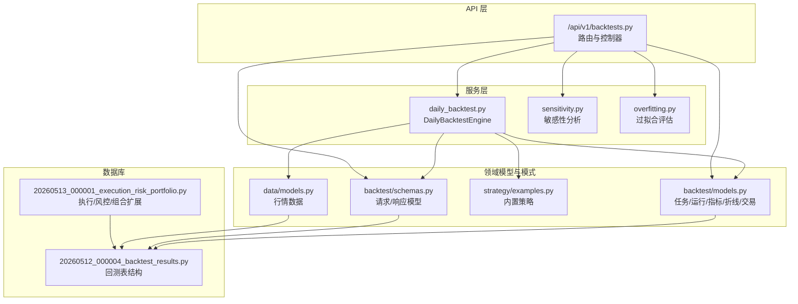
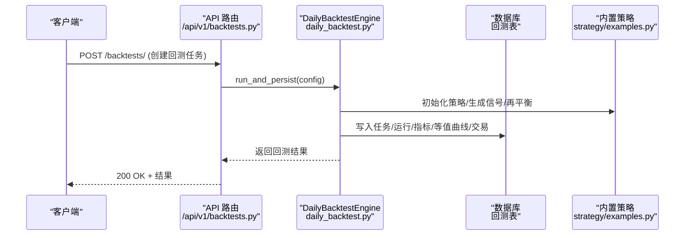
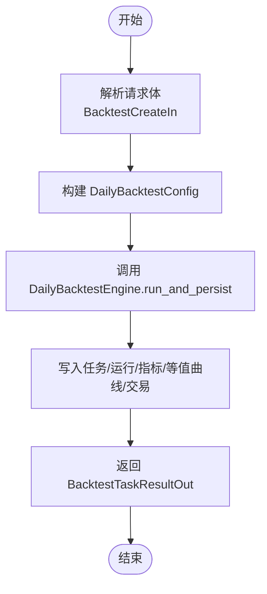
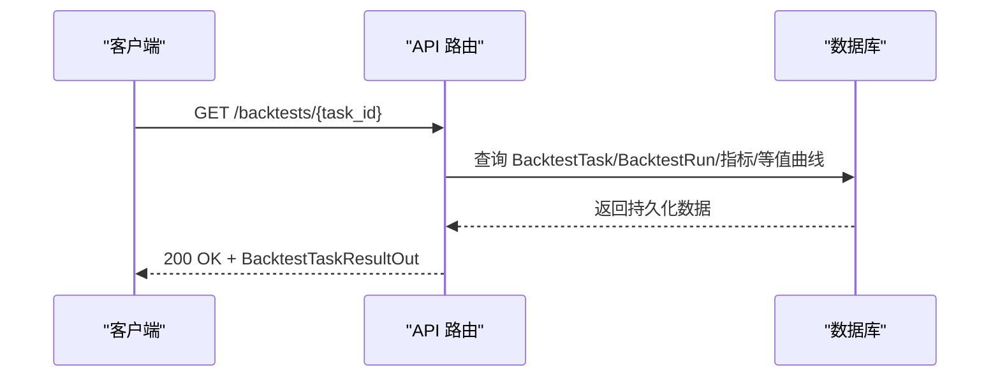
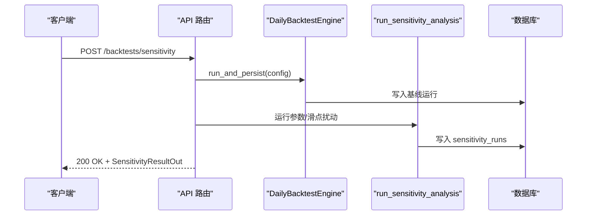
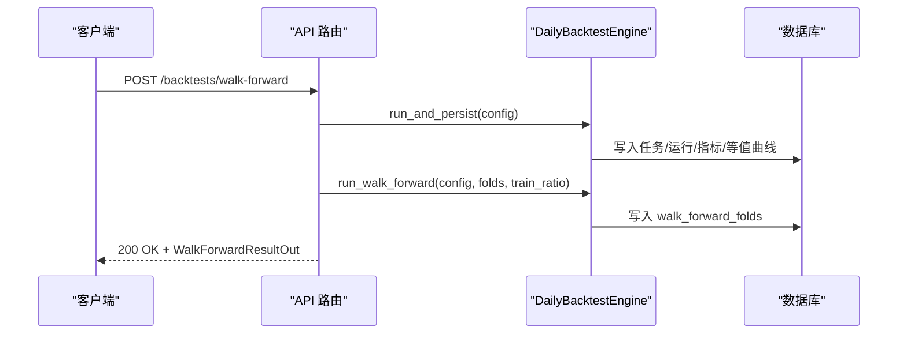
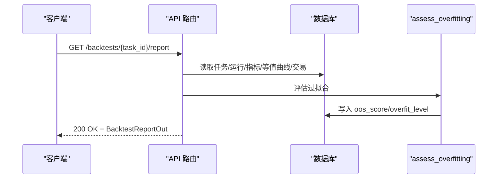
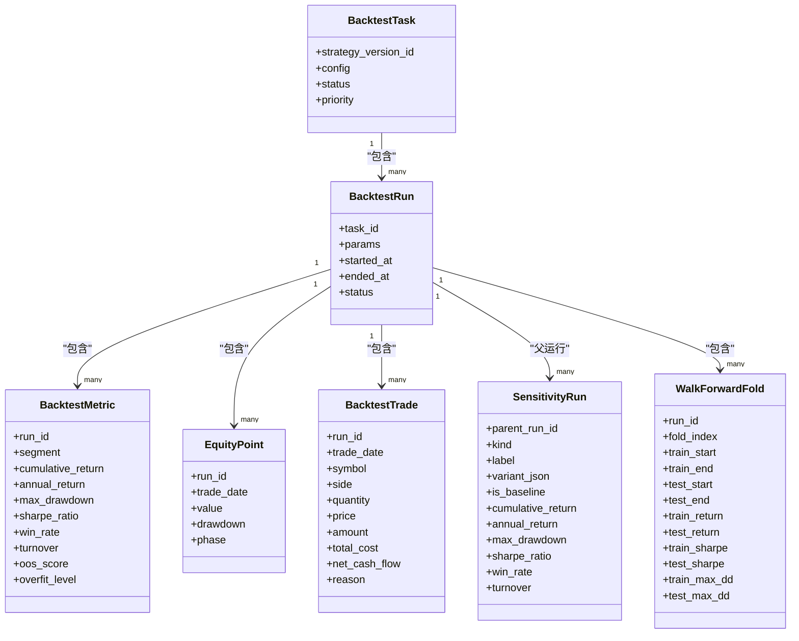

# 回测 API

<cite>
**本文引用的文件**
- [backtests.py](file://backend/app/api/v1/backtests.py)
- [models.py](file://backend/app/domains/backtest/models.py)
- [schemas.py](file://backend/app/domains/backtest/schemas.py)
- [daily_backtest.py](file://backend/app/services/daily_backtest.py)
- [sensitivity.py](file://backend/app/services/sensitivity.py)
- [overfitting.py](file://backend/app/services/overfitting.py)
- [examples.py](file://backend/app/domains/strategy/examples.py)
- [models.py](file://backend/app/domains/data/models.py)
- [test_backtests.py](file://backend/tests/api/test_backtests.py)
- [20260512_000004_backtest_results.py](file://backend/app/db/migrations/versions/20260512_000004_backtest_results.py)
- [20260513_000001_execution_risk_portfolio.py](file://backend/app/db/migrations/versions/20260513_000001_execution_risk_portfolio.py)
</cite>

## 目录
1. [简介](#简介)
2. [项目结构](#项目结构)
3. [核心组件](#核心组件)
4. [架构总览](#架构总览)
5. [详细组件分析](#详细组件分析)
6. [依赖关系分析](#依赖关系分析)
7. [性能考量](#性能考量)
8. [故障排除指南](#故障排除指南)
9. [结论](#结论)
10. [附录](#附录)

## 简介
本文件为回测 API 的完整技术文档，涵盖回测任务创建、状态查询、结果获取、批量回测、参数配置、数据源选择、指标计算、可视化图表、引擎调用、进度跟踪、结果分析与报告生成等全流程接口规范。文档同时提供配置示例、性能优化建议与常见问题排查指引，帮助开发者与研究人员快速上手并稳定使用回测系统。

## 项目结构
回测相关代码位于后端应用的 API 层、服务层与领域模型层，配合数据库迁移脚本定义持久化结构。前端通过上下文组件消费这些接口，实现可视化展示与交互。

**图表来源**
- [backtests.py:1-1121](file://backend/app/api/v1/backtests.py#L1-L1121)
- [daily_backtest.py:1-899](file://backend/app/services/daily_backtest.py#L1-L899)
- [sensitivity.py:1-139](file://backend/app/services/sensitivity.py#L1-L139)
- [overfitting.py:1-168](file://backend/app/services/overfitting.py#L1-L168)
- [models.py:1-155](file://backend/app/domains/backtest/models.py#L1-L155)
- [schemas.py:1-349](file://backend/app/domains/backtest/schemas.py#L1-L349)
- [examples.py:1-368](file://backend/app/domains/strategy/examples.py#L1-L368)
- [models.py:1-144](file://backend/app/domains/data/models.py#L1-L144)
- [20260512_000004_backtest_results.py:1-132](file://backend/app/db/migrations/versions/20260512_000004_backtest_results.py#L1-L132)
- [20260513_000001_execution_risk_portfolio.py:1-316](file://backend/app/db/migrations/versions/20260513_000001_execution_risk_portfolio.py#L1-L316)

**章节来源**
- [backtests.py:1-1121](file://backend/app/api/v1/backtests.py#L1-L1121)
- [daily_backtest.py:1-899](file://backend/app/services/daily_backtest.py#L1-L899)
- [models.py:1-155](file://backend/app/domains/backtest/models.py#L1-L155)
- [schemas.py:1-349](file://backend/app/domains/backtest/schemas.py#L1-L349)
- [examples.py:1-368](file://backend/app/domains/strategy/examples.py#L1-L368)
- [models.py:1-144](file://backend/app/domains/data/models.py#L1-L144)
- [20260512_000004_backtest_results.py:1-132](file://backend/app/db/migrations/versions/20260512_000004_backtest_results.py#L1-L132)
- [20260513_000001_execution_risk_portfolio.py:1-316](file://backend/app/db/migrations/versions/20260513_000001_execution_risk_portfolio.py#L1-L316)

## 核心组件
- API 控制器：提供回测任务创建、查询、报告聚合、敏感性分析、滚动验证等 REST 接口。
- 引擎与服务：DailyBacktestEngine 执行回测循环，计算指标与生成等值曲线；敏感性分析与过拟合评估作为扩展能力。
- 领域模型与模式：统一的任务、运行、指标、折线、交易等实体与 Pydantic 模型，确保前后端契约清晰。
- 数据模型：每日行情数据 MarketBarDaily 作为回测输入，支持 A 股交易规则与停复牌标记。
- 基础设施：数据库迁移脚本定义回测结果表结构，便于持久化与查询。

**章节来源**
- [backtests.py:444-584](file://backend/app/api/v1/backtests.py#L444-L584)
- [daily_backtest.py:185-452](file://backend/app/services/daily_backtest.py#L185-L452)
- [models.py:9-155](file://backend/app/domains/backtest/models.py#L9-L155)
- [schemas.py:102-349](file://backend/app/domains/backtest/schemas.py#L102-L349)
- [models.py:40-67](file://backend/app/domains/data/models.py#L40-L67)

## 架构总览
回测 API 的调用链路如下：客户端发起请求到 FastAPI 路由，路由解析请求体并构造配置，调用 DailyBacktestEngine 执行回测，引擎加载行情数据、运行策略、执行交易、计算指标并持久化结果；随后可选地运行敏感性分析与过拟合评估，并通过报告接口聚合输出。

**图表来源**
- [backtests.py:444-455](file://backend/app/api/v1/backtests.py#L444-L455)
- [daily_backtest.py:285-371](file://backend/app/services/daily_backtest.py#L285-L371)
- [examples.py:342-353](file://backend/app/domains/strategy/examples.py#L342-L353)

**章节来源**
- [backtests.py:444-551](file://backend/app/api/v1/backtests.py#L444-L551)
- [daily_backtest.py:185-371](file://backend/app/services/daily_backtest.py#L185-L371)

## 详细组件分析

### 1) 回测任务创建与执行
- 接口：POST /api/v1/backtests/
- 请求体：BacktestCreateIn
  - universe：标的列表
  - startDate/endDate：回测起止日期
  - strategyName/strategyParams：策略名称与参数
  - initialCash：初始资金
  - costConfig：交易成本配置（佣金、印花税、最低佣金、滑点）
  - inSampleEndDate：可选的样本内切分日期
- 处理流程：
  - 将请求体转换为 DailyBacktestConfig
  - 调用 DailyBacktestEngine.run_and_persist 执行回测并持久化
  - 返回 BacktestTaskResultOut，包含任务 ID、运行 ID、指标、等值曲线、月度收益等
- 错误处理：当无行情数据或参数非法时抛出 400

**图表来源**
- [backtests.py:444-455](file://backend/app/api/v1/backtests.py#L444-L455)
- [daily_backtest.py:285-371](file://backend/app/services/daily_backtest.py#L285-L371)

**章节来源**
- [backtests.py:444-455](file://backend/app/api/v1/backtests.py#L444-L455)
- [schemas.py:102-119](file://backend/app/domains/backtest/schemas.py#L102-L119)
- [daily_backtest.py:148-183](file://backend/app/services/daily_backtest.py#L148-L183)

### 2) 回测任务状态查询与历史列表
- 获取单个任务：GET /api/v1/backtests/{task_id}
  - 返回最新运行的指标、等值曲线、IS/OOS 分段指标与阶段标签
- 获取任务列表：GET /api/v1/backtests/?limit=N
  - 返回最近回测任务摘要，包含策略版本、时间范围、关键指标与创建时间

**图表来源**
- [backtests.py:554-584](file://backend/app/api/v1/backtests.py#L554-L584)
- [backtests.py:587-644](file://backend/app/api/v1/backtests.py#L587-L644)

**章节来源**
- [backtests.py:554-644](file://backend/app/api/v1/backtests.py#L554-L644)

### 3) 敏感性分析（参数与滑点扰动）
- 接口：POST /api/v1/backtests/sensitivity
- 请求体：SensitivityCreateIn
- 流程：
  - 先运行基准回测并持久化
  - 对参数（如双均线窗口）与滑点进行小规模扰动
  - 计算每种变体的指标并写入 sensitivity_runs
- 输出：SensitivityResultOut，包含基线与各扰动变体的指标对比

**图表来源**
- [backtests.py:458-498](file://backend/app/api/v1/backtests.py#L458-L498)
- [sensitivity.py:60-138](file://backend/app/services/sensitivity.py#L60-L138)

**章节来源**
- [backtests.py:458-498](file://backend/app/api/v1/backtests.py#L458-L498)
- [sensitivity.py:1-139](file://backend/app/services/sensitivity.py#L1-L139)

### 4) 滚动验证（Walk-Forward）
- 接口：POST /api/v1/backtests/walk-forward
- 请求体：WalkForwardCreateIn
  - folds：折数（默认 4）
  - trainRatio：训练期比例（默认 0.7）
- 流程：
  - 先运行全区间回测并持久化
  - 将等值曲线按折数切分，分别计算训练与测试期指标
  - 写入 walk_forward_folds 并返回聚合指标
- 输出：WalkForwardResultOut，包含每折的训练/测试指标与聚合指标

**图表来源**
- [backtests.py:501-551](file://backend/app/api/v1/backtests.py#L501-L551)
- [daily_backtest.py:373-452](file://backend/app/services/daily_backtest.py#L373-L452)

**章节来源**
- [backtests.py:501-551](file://backend/app/api/v1/backtests.py#L501-L551)
- [daily_backtest.py:373-452](file://backend/app/services/daily_backtest.py#L373-L452)

### 5) 报告聚合与过拟合评估
- 获取报告：GET /api/v1/backtests/{task_id}/report
- 聚合内容：
  - 基线回测摘要
  - Walk-Forward 折叠指标
  - 敏感性分析结果
  - 过拟合评估（OOS 分数、等级、分项组件）
  - 成交明细与特征使用、数据血缘节点/边计数
  - 实验室检查清单与晋级门禁决策
- 过拟合评估：实时计算并持久化到指标表的 oos_score 与 overfit_level 字段

**图表来源**
- [backtests.py:692-828](file://backend/app/api/v1/backtests.py#L692-L828)
- [overfitting.py:129-167](file://backend/app/services/overfitting.py#L129-L167)

**章节来源**
- [backtests.py:692-828](file://backend/app/api/v1/backtests.py#L692-L828)
- [overfitting.py:1-168](file://backend/app/services/overfitting.py#L1-L168)

### 6) 成交明细与等值曲线
- 获取成交明细：GET /api/v1/backtests/{task_id}/trades?limit=N
  - 返回每笔模拟成交及触发原因
- 获取等值曲线：随任务详情返回，包含阶段标签（IS/OOS）

**章节来源**
- [backtests.py:647-689](file://backend/app/api/v1/backtests.py#L647-L689)
- [backtests.py:1078-1121](file://backend/app/api/v1/backtests.py#L1078-L1121)

### 7) 数据源与参数配置
- 数据源：MarketBarDaily 提供每日 OHLCV 与交易标志（停复牌、涨跌停、买卖权限）
- 参数配置：
  - BacktestCostIn：佣金率、最低佣金、印花税率、滑点（bps）
  - BacktestCreateIn：标的、时间范围、策略、初始资金、成本配置、可选 IS/OOS 切分
  - SensitivityCreateIn/WalkForwardCreateIn：在上述基础上增加敏感性/滚动验证参数

**章节来源**
- [schemas.py:93-119](file://backend/app/domains/backtest/schemas.py#L93-L119)
- [schemas.py:294-326](file://backend/app/domains/backtest/schemas.py#L294-L326)
- [models.py:40-67](file://backend/app/domains/data/models.py#L40-L67)

### 8) 指标计算与可视化
- 指标：累计收益、年化收益、最大回撤、夏普比率、索提诺比率、Calmar 比率、波动率、胜率、换手率、利润因子等
- 可视化：前端组件消费等值曲线、月度收益、参数敏感性热力图、压力情景等

**章节来源**
- [daily_backtest.py:702-799](file://backend/app/services/daily_backtest.py#L702-L799)
- [schemas.py:154-167](file://backend/app/domains/backtest/schemas.py#L154-L167)

## 依赖关系分析

**图表来源**
- [models.py:9-155](file://backend/app/domains/backtest/models.py#L9-L155)

**章节来源**
- [models.py:1-155](file://backend/app/domains/backtest/models.py#L1-L155)

## 性能考量
- 数据加载：按日期与标的排序加载行情，避免重复扫描；确保 MarketBarDaily 上的索引有效。
- 指标计算：日度指标采用向量化与一次遍历计算，尽量减少二次扫描。
- 持久化：批量写入指标、等值曲线与交易，减少事务开销。
- 并发与限流：API 层可结合限流策略控制批量回测并发度，避免数据库压力过大。
- 滚动验证：折数不宜过大，避免等值曲线过短导致统计不稳定；训练期比例建议在 0.6–0.8 区间。
- 敏感性分析：扰动集应小而精，避免过多变体导致长时间阻塞。

[本节为通用指导，无需特定文件引用]

## 故障排除指南
- 无行情数据错误
  - 现象：创建回测返回 400，提示“无市场 K 线”
  - 排查：确认 MarketBarDaily 中是否存在目标标的与日期范围内的数据；若缺失，先导入数据
  - 参考测试：[test_backtests.py:93-107](file://backend/tests/api/test_backtests.py#L93-L107)
- IS/OOS 切分日期非法
  - 现象：返回 400，提示切分日期无效
  - 排查：确保 inSampleEndDate 在 [startDate, endDate) 区间内，且切分后 OOS 至少有一天
  - 参考测试：[test_backtests.py:293-309](file://backend/tests/api/test_backtests.py#L293-L309)
- 滚动验证数据不足
  - 现象：Walk-Forward 返回 400，提示需要至少 N 条 K 线
  - 排查：增加回测区间长度或减少折数
  - 参考测试：[test_backtests.py:261-291](file://backend/tests/api/test_backtests.py#L261-L291)
- 成交证据为空
  - 现象：报告中的交易证据检查为警告
  - 排查：检查策略信号是否产生真实成交，或调整策略参数提升信号频率
  - 参考实现：[backtests.py:894-956](file://backend/app/api/v1/backtests.py#L894-L956)

**章节来源**
- [test_backtests.py:93-107](file://backend/tests/api/test_backtests.py#L93-L107)
- [test_backtests.py:293-309](file://backend/tests/api/test_backtests.py#L293-L309)
- [test_backtests.py:261-291](file://backend/tests/api/test_backtests.py#L261-L291)
- [backtests.py:894-956](file://backend/app/api/v1/backtests.py#L894-L956)

## 结论
回测 API 提供了从任务创建、执行、持久化到报告聚合的完整闭环，结合敏感性分析与过拟合评估，能够支撑高质量的研究工作流。通过合理的参数配置、数据准备与性能优化，用户可在可控范围内高效完成多策略、多标的的回测与分析。

[本节为总结，无需特定文件引用]

## 附录

### A. 接口一览与字段说明
- POST /api/v1/backtests/
  - 请求体：BacktestCreateIn
  - 响应：BacktestTaskResultOut
- GET /api/v1/backtests/{task_id}
  - 响应：BacktestTaskResultOut
- GET /api/v1/backtests/
  - 查询参数：limit
  - 响应：list[BacktestTaskListItem]
- POST /api/v1/backtests/sensitivity
  - 请求体：SensitivityCreateIn
  - 响应：SensitivityResultOut
- POST /api/v1/backtests/walk-forward
  - 请求体：WalkForwardCreateIn
  - 响应：WalkForwardResultOut
- GET /api/v1/backtests/{task_id}/report
  - 响应：BacktestReportOut
- GET /api/v1/backtests/{task_id}/trades
  - 查询参数：limit
  - 响应：list[BacktestTradeOut]
- GET /api/v1/backtests/{task_id}/overfit
  - 响应：OverfitAssessmentOut

**章节来源**
- [backtests.py:444-856](file://backend/app/api/v1/backtests.py#L444-L856)

### B. 数据库表结构要点
- backtest_tasks：任务元信息与状态
- backtest_runs：运行参数与时间戳
- backtest_metrics：指标（支持 segment=“all”/“is”/“oos”）
- equity_points：等值曲线与阶段标签
- backtest_trades：模拟成交明细
- sensitivity_runs：敏感性分析结果
- walk_forward_folds：滚动验证折叠指标

**章节来源**
- [20260512_000004_backtest_results.py:34-106](file://backend/app/db/migrations/versions/20260512_000004_backtest_results.py#L34-L106)

### C. 配置示例（路径参考）
- 回测任务创建请求体示例：[test_backtests.py:39-54](file://backend/tests/api/test_backtests.py#L39-L54)
- IS/OOS 切分示例：[test_backtests.py:173-189](file://backend/tests/api/test_backtests.py#L173-L189)
- 滚动验证示例：[test_backtests.py:267-283](file://backend/tests/api/test_backtests.py#L267-L283)
- 敏感性分析示例：[backtests.py:458-498](file://backend/app/api/v1/backtests.py#L458-L498)