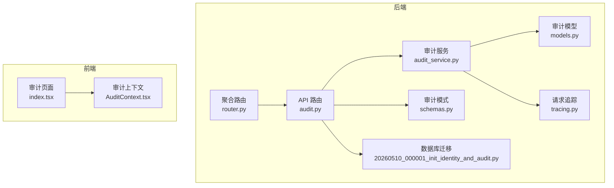
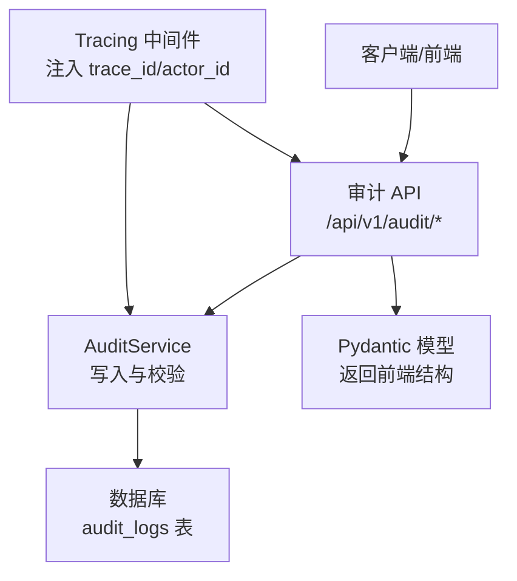
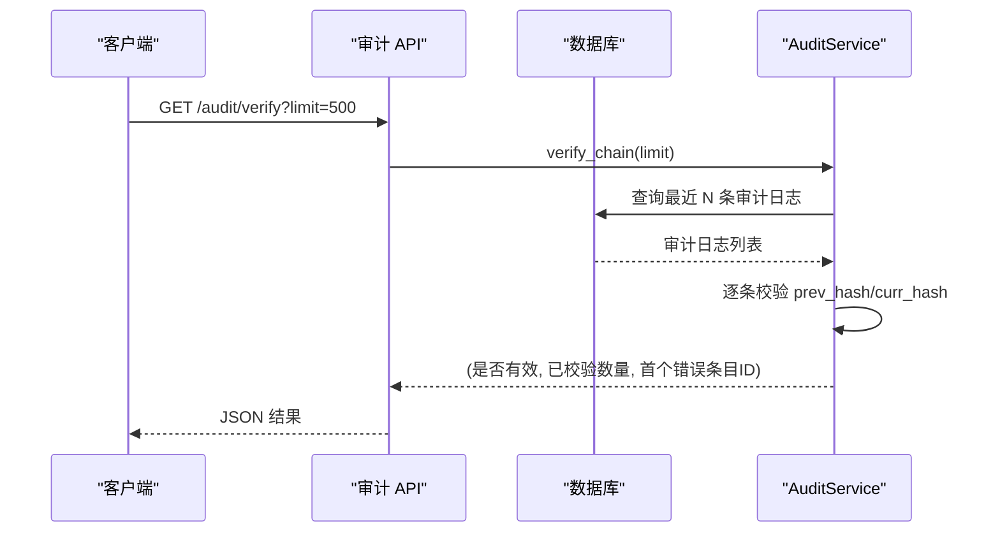
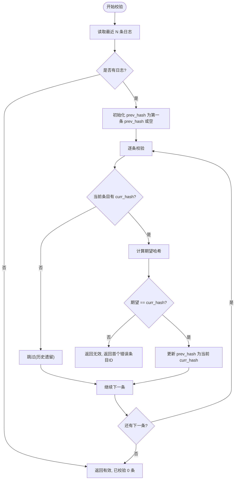
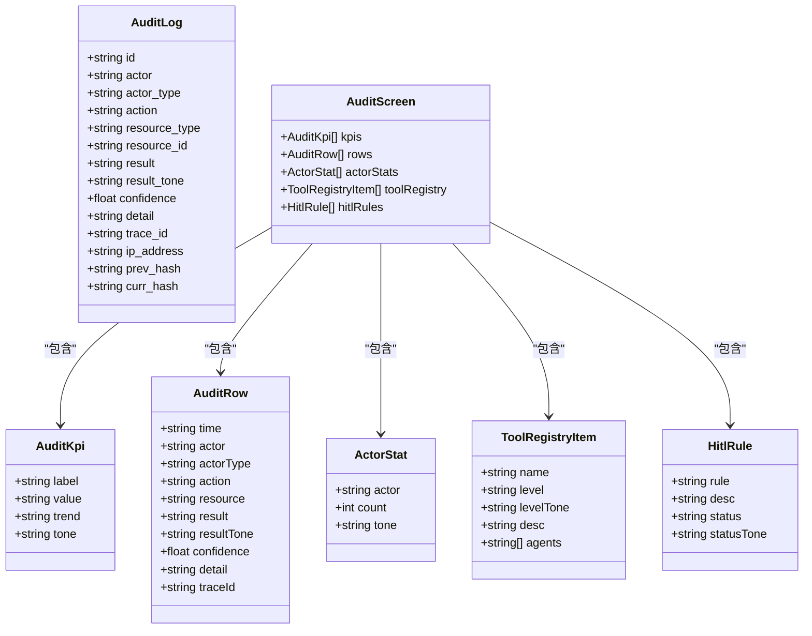
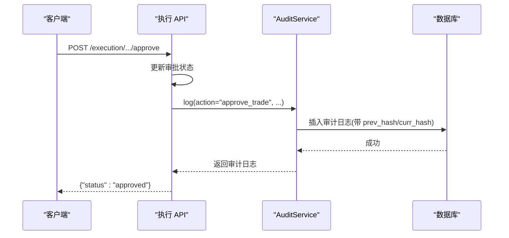
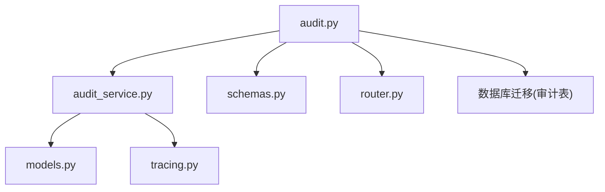

# 审计 API

<cite>
**本文引用的文件**
- [audit.py](file://backend/app/api/v1/audit.py)
- [schemas.py](file://backend/app/domains/audit/schemas.py)
- [models.py](file://backend/app/domains/audit/models.py)
- [audit_service.py](file://backend/app/services/audit_service.py)
- [router.py](file://backend/app/api/v1/router.py)
- [20260510_000001_init_identity_and_audit.py](file://backend/app/db/migrations/versions/20260510_000001_init_identity_and_audit.py)
- [tracing.py](file://backend/app/core/tracing.py)
- [execution.py](file://backend/app/api/v1/execution.py)
- [risk.py](file://backend/app/api/v1/risk.py)
- [portfolio.py](file://backend/app/api/v1/portfolio.py)
- [index.tsx](file://frontend/src/screens/Audit/index.tsx)
- [AuditContext.tsx](file://frontend/src/contexts/AuditContext.tsx)
</cite>

## 目录
1. [简介](#简介)
2. [项目结构](#项目结构)
3. [核心组件](#核心组件)
4. [架构概览](#架构概览)
5. [详细组件分析](#详细组件分析)
6. [依赖分析](#依赖分析)
7. [性能考虑](#性能考虑)
8. [故障排除指南](#故障排除指南)
9. [结论](#结论)
10. [附录](#附录)

## 简介
本文件为审计 API 的详细技术文档，涵盖操作日志、合规检查、报告生成、监控告警等接口规范。重点说明审计轨迹追踪、合规规则检查、风险事件记录、监管报告等核心功能，并提供审计数据查询、合规指标计算、异常检测和报告导出的 API 接口说明。同时给出合规管理最佳实践和监管要求指南，帮助开发团队正确集成和使用审计能力。

## 项目结构
审计相关代码采用分层架构组织，后端按领域划分（domains）、服务层（services）、API 层（api），前端通过上下文和页面组件消费审计数据。

**图表来源**
- [audit.py:153-168](file://backend/app/api/v1/audit.py#L153-L168)
- [audit_service.py:32-81](file://backend/app/services/audit_service.py#L32-L81)
- [models.py:9-26](file://backend/app/domains/audit/models.py#L9-L26)
- [schemas.py:6-53](file://backend/app/domains/audit/schemas.py#L6-L53)
- [tracing.py:49-86](file://backend/app/core/tracing.py#L49-L86)
- [router.py:37-37](file://backend/app/api/v1/router.py#L37-L37)
- [20260510_000001_init_identity_and_audit.py:106-130](file://backend/app/db/migrations/versions/20260510_000001_init_identity_and_audit.py#L106-L130)
- [index.tsx:16-42](file://frontend/src/screens/Audit/index.tsx#L16-L42)
- [AuditContext.tsx:1-13](file://frontend/src/contexts/AuditContext.tsx#L1-L13)

**章节来源**
- [audit.py:1-258](file://backend/app/api/v1/audit.py#L1-L258)
- [router.py:1-40](file://backend/app/api/v1/router.py#L1-L40)

## 核心组件
- 审计 API 路由：提供审计概览、日志列表、角色统计、哈希链验证、CSV 导出、工具注册表、HITL 规则等接口。
- 审计服务：负责写入不可变审计日志并维护 SHA-256 哈希链，支持链式完整性校验。
- 审计模型：定义不可变审计日志表结构及索引字段，确保可追溯性与查询效率。
- 审计模式：定义前端展示所需的数据结构，包括 KPI、审计行、角色统计、工具注册项、HITL 规则。
- 请求追踪：在中间件中注入 trace_id 和 actor_id，贯穿整个请求生命周期，用于审计关联。
- 数据库迁移：初始化审计日志表、幂等键表、事件出站表等基础结构。

**章节来源**
- [audit.py:153-257](file://backend/app/api/v1/audit.py#L153-L257)
- [audit_service.py:32-109](file://backend/app/services/audit_service.py#L32-L109)
- [models.py:9-51](file://backend/app/domains/audit/models.py#L9-L51)
- [schemas.py:6-53](file://backend/app/domains/audit/schemas.py#L6-L53)
- [tracing.py:49-86](file://backend/app/core/tracing.py#L49-L86)
- [20260510_000001_init_identity_and_audit.py:106-168](file://backend/app/db/migrations/versions/20260510_000001_init_identity_and_audit.py#L106-L168)

## 架构概览
审计系统围绕不可变审计日志展开，通过服务层统一写入，API 层提供查询与导出能力，前端页面消费数据并展示。

**图表来源**
- [audit.py:153-257](file://backend/app/api/v1/audit.py#L153-L257)
- [audit_service.py:32-109](file://backend/app/services/audit_service.py#L32-L109)
- [models.py:9-26](file://backend/app/domains/audit/models.py#L9-L26)
- [schemas.py:6-53](file://backend/app/domains/audit/schemas.py#L6-L53)
- [tracing.py:49-86](file://backend/app/core/tracing.py#L49-L86)

## 详细组件分析

### 审计 API 接口规范
- 获取审计概览
  - 方法：GET
  - 路径：/api/v1/audit/overview
  - 功能：返回审计与合规面板的完整数据，包括 KPI、最近日志、角色统计、工具注册表、HITL 规则。
  - 返回：AuditScreen 结构体
  - 关键实现：[audit.py:153-168](file://backend/app/api/v1/audit.py#L153-L168)

- 分页查询审计日志
  - 方法：GET
  - 路径：/api/v1/audit/logs
  - 查询参数：
    - actor_type：角色类型过滤
    - action：动作关键词过滤
    - limit：每页数量，默认 50，最大 500
    - offset：偏移量，默认 0
  - 返回：AuditRow 列表
  - 关键实现：[audit.py:171-186](file://backend/app/api/v1/audit.py#L171-L186)

- 获取角色操作统计
  - 方法：GET
  - 路径：/api/v1/audit/actor-stats
  - 查询参数：
    - limit：限制返回条数，默认 20，最大 100
  - 返回：ActorStat 列表
  - 关键实现：[audit.py:189-195](file://backend/app/api/v1/audit.py#L189-L195)

- 验证哈希链完整性
  - 方法：GET
  - 路径：/api/v1/audit/verify
  - 查询参数：
    - limit：校验最近条目数量，默认 500，最大 5000
  - 返回：包含 valid、verifiedCount、brokenEntryId、status、statusTone 的字典
  - 关键实现：[audit.py:198-212](file://backend/app/api/v1/audit.py#L198-L212)

- 导出审计日志为 CSV
  - 方法：GET
  - 路径：/api/v1/audit/export
  - 查询参数：
    - actor_type：角色类型过滤
    - limit：导出条数，默认 1000，最大 10000
  - 返回：CSV 流（StreamingResponse）
  - 关键实现：[audit.py:215-245](file://backend/app/api/v1/audit.py#L215-L245)

- 获取工具注册表
  - 方法：GET
  - 路径：/api/v1/audit/registry
  - 返回：ToolRegistryItem 列表
  - 关键实现：[audit.py:248-251](file://backend/app/api/v1/audit.py#L248-L251)

- 获取 HITL 规则
  - 方法：GET
  - 路径：/api/v1/audit/hitl-rules
  - 返回：HITL 规则列表
  - 关键实现：[audit.py:254-257](file://backend/app/api/v1/audit.py#L254-L257)

**图表来源**
- [audit.py:198-212](file://backend/app/api/v1/audit.py#L198-L212)
- [audit_service.py:83-109](file://backend/app/services/audit_service.py#L83-L109)

**章节来源**
- [audit.py:153-257](file://backend/app/api/v1/audit.py#L153-L257)

### 审计服务与哈希链
- 写入审计日志
  - 通过 AuditService.log 写入新条目，自动计算前一条记录的 curr_hash 作为 prev_hash，再计算当前 curr_hash。
  - 自动注入 actor、actor_type、trace_id、时间戳等上下文信息。
  - 关键实现：[audit_service.py:38-81](file://backend/app/services/audit_service.py#L38-L81)

- 验证哈希链
  - 从最早到最晚顺序遍历，逐条比对计算值与 curr_hash 是否一致。
  - 对于历史遗留无哈希的条目跳过校验。
  - 关键实现：[audit_service.py:83-109](file://backend/app/services/audit_service.py#L83-L109)

**图表来源**
- [audit_service.py:83-109](file://backend/app/services/audit_service.py#L83-L109)

**章节来源**
- [audit_service.py:32-109](file://backend/app/services/audit_service.py#L32-L109)

### 数据模型与前端对接
- 审计模型字段
  - 包含 actor、actor_type、action、resource_type、resource_id、result、result_tone、confidence、detail、trace_id、ip_address、prev_hash、curr_hash 等。
  - 关键实现：[models.py:9-26](file://backend/app/domains/audit/models.py#L9-L26)

- 前端模式
  - AuditKpi、AuditRow、ActorStat、ToolRegistryItem、HitlRule、AuditScreen 等结构体，用于前端渲染。
  - 关键实现：[schemas.py:6-53](file://backend/app/domains/audit/schemas.py#L6-L53)

- 前端页面与上下文
  - 审计页面通过 api.audit.overview() 获取数据，使用 AuditContext 提供的数据进行渲染。
  - 关键实现：[index.tsx:16-42](file://frontend/src/screens/Audit/index.tsx#L16-L42)，[AuditContext.tsx:1-13](file://frontend/src/contexts/AuditContext.tsx#L1-L13)

**图表来源**
- [models.py:9-26](file://backend/app/domains/audit/models.py#L9-L26)
- [schemas.py:6-53](file://backend/app/domains/audit/schemas.py#L6-L53)

**章节来源**
- [models.py:9-51](file://backend/app/domains/audit/models.py#L9-L51)
- [schemas.py:6-53](file://backend/app/domains/audit/schemas.py#L6-L53)
- [index.tsx:16-42](file://frontend/src/screens/Audit/index.tsx#L16-L42)
- [AuditContext.tsx:1-13](file://frontend/src/contexts/AuditContext.tsx#L1-L13)

### 典型调用流程示例
- 执行审批与拒绝
  - 审批：POST /api/v1/execution/approvals/{approval_id}/approve，成功后写入审计日志 approve_trade。
  - 拒绝：POST /api/v1/execution/approvals/{approval_id}/reject，成功后写入审计日志 reject_trade。
  - 关键实现：[execution.py:223-281](file://backend/app/api/v1/execution.py#L223-L281)

- 风控触发与恢复
  - 触发熔断：POST /api/v1/risk/circuit-breakers/{level}/trigger，写入 trigger_circuit_breaker。
  - 恢复熔断：POST /api/v1/risk/circuit-breakers/{level}/recover，写入 recover_circuit_breaker。
  - 关键实现：[risk.py:225-273](file://backend/app/api/v1/risk.py#L225-L273)

- 组合调拨审批
  - 审批：POST /api/v1/portfolio/rebalance/{proposal_id}/approve，写入 approve_rebalance。
  - 关键实现：[portfolio.py:161-186](file://backend/app/api/v1/portfolio.py#L161-L186)

**图表来源**
- [execution.py:223-250](file://backend/app/api/v1/execution.py#L223-L250)
- [audit_service.py:38-81](file://backend/app/services/audit_service.py#L38-L81)

**章节来源**
- [execution.py:223-281](file://backend/app/api/v1/execution.py#L223-L281)
- [risk.py:225-273](file://backend/app/api/v1/risk.py#L225-L273)
- [portfolio.py:161-186](file://backend/app/api/v1/portfolio.py#L161-L186)

## 依赖分析
- 组件耦合
  - API 层仅依赖服务层与模式定义，保持清晰的职责分离。
  - 服务层依赖模型与追踪上下文，保证审计日志的完整性与可追溯性。
  - 前端通过上下文消费后端提供的结构化数据，解耦展示与数据源。

- 外部依赖
  - FastAPI 路由与响应模型。
  - SQLAlchemy 异步会话与 ORM 映射。
  - Python 哈希库用于 SHA-256 计算。

**图表来源**
- [audit.py:153-257](file://backend/app/api/v1/audit.py#L153-L257)
- [audit_service.py:32-109](file://backend/app/services/audit_service.py#L32-L109)
- [schemas.py:6-53](file://backend/app/domains/audit/schemas.py#L6-L53)
- [models.py:9-51](file://backend/app/domains/audit/models.py#L9-L51)
- [tracing.py:49-86](file://backend/app/core/tracing.py#L49-L86)
- [router.py:37-37](file://backend/app/api/v1/router.py#L37-L37)

**章节来源**
- [audit.py:153-257](file://backend/app/api/v1/audit.py#L153-L257)
- [audit_service.py:32-109](file://backend/app/services/audit_service.py#L32-L109)
- [router.py:37-37](file://backend/app/api/v1/router.py#L37-L37)

## 性能考虑
- 查询优化
  - 审计日志表在 actor、action、resource_id、trace_id 等字段建立索引，提升过滤与排序性能。
  - 关键实现：[20260510_000001_init_identity_and_audit.py:118-129](file://backend/app/db/migrations/versions/20260510_000001_init_identity_and_audit.py#L118-L129)

- 分页与限制
  - 日志查询与导出均设置上限参数，避免超大数据量查询导致性能问题。
  - 关键实现：[audit.py:171-186](file://backend/app/api/v1/audit.py#L171-L186)，[audit.py:215-245](file://backend/app/api/v1/audit.py#L215-L245)

- 哈希链校验范围
  - 默认校验最近 500 条，可根据需要调整 limit 参数，平衡准确性与性能。
  - 关键实现：[audit.py:198-212](file://backend/app/api/v1/audit.py#L198-L212)，[audit_service.py:83-109](file://backend/app/services/audit_service.py#L83-L109)

## 故障排除指南
- 哈希链验证失败
  - 现象：verify 接口返回 broken 或 status 为 broken。
  - 排查：检查返回的 brokenEntryId 对应记录，确认是否存在篡改或导入异常；确认历史遗留记录未参与校验。
  - 关键实现：[audit.py:198-212](file://backend/app/api/v1/audit.py#L198-L212)，[audit_service.py:83-109](file://backend/app/services/audit_service.py#L83-L109)

- 导出 CSV 字段缺失
  - 现象：导出文件缺少某些字段。
  - 排查：确认导出接口使用的字段列表与模型字段一致；检查 detail 字段换行符替换逻辑。
  - 关键实现：[audit.py:215-245](file://backend/app/api/v1/audit.py#L215-L245)

- 前端数据为空
  - 现象：审计页面加载后无数据。
  - 排查：确认 /audit/overview 接口返回结构与前端模式匹配；检查网络请求与错误日志。
  - 关键实现：[index.tsx:16-42](file://frontend/src/screens/Audit/index.tsx#L16-L42)，[AuditContext.tsx:1-13](file://frontend/src/contexts/AuditContext.tsx#L1-L13)

**章节来源**
- [audit.py:198-245](file://backend/app/api/v1/audit.py#L198-L245)
- [audit_service.py:83-109](file://backend/app/services/audit_service.py#L83-L109)
- [index.tsx:16-42](file://frontend/src/screens/Audit/index.tsx#L16-L42)
- [AuditContext.tsx:1-13](file://frontend/src/contexts/AuditContext.tsx#L1-L13)

## 结论
审计 API 通过不可变日志与哈希链实现了强合规性与可追溯性，结合前端可视化界面，能够满足监管报告、合规检查、风险事件记录与监控告警等需求。建议在生产环境中配合严格的访问控制、限流与日志审计，确保系统的安全与稳定。

## 附录

### 合规管理最佳实践
- 审计轨迹追踪
  - 使用 trace_id 关联同一请求的全链路行为，便于跨模块审计。
  - 关键实现：[tracing.py:49-86](file://backend/app/core/tracing.py#L49-L86)

- 合规规则检查
  - 将业务关键动作（如审批、风控操作）纳入审计日志，确保可回溯。
  - 关键实现：[execution.py:223-281](file://backend/app/api/v1/execution.py#L223-L281)，[risk.py:225-273](file://backend/app/api/v1/risk.py#L225-L273)，[portfolio.py:161-186](file://backend/app/api/v1/portfolio.py#L161-L186)

- 风险事件记录
  - 对熔断触发、恢复等高风险事件进行审计记录，标注结果色调（绿色/黄色/红色）。
  - 关键实现：[risk.py:225-273](file://backend/app/api/v1/risk.py#L225-L273)

- 监控告警
  - 基于异常事件 KPI（result_tone 为 red）与哈希链完整性状态进行告警联动。
  - 关键实现：[audit.py:73-106](file://backend/app/api/v1/audit.py#L73-L106)，[audit.py:198-212](file://backend/app/api/v1/audit.py#L198-L212)

- 报告生成
  - 使用 /audit/export 接口导出 CSV，结合 /audit/overview 的 KPI 进行合规报告汇总。
  - 关键实现：[audit.py:153-168](file://backend/app/api/v1/audit.py#L153-L168)，[audit.py:215-245](file://backend/app/api/v1/audit.py#L215-L245)

- 监管要求指南
  - 留存期：根据监管要求设定审计日志保留期限。
  - 可检索性：利用索引字段进行高效检索与报表生成。
  - 不可篡改性：定期执行哈希链验证，发现异常立即处置。
  - 关键实现：[20260510_000001_init_identity_and_audit.py:106-130](file://backend/app/db/migrations/versions/20260510_000001_init_identity_and_audit.py#L106-L130)，[audit.py:198-212](file://backend/app/api/v1/audit.py#L198-L212)