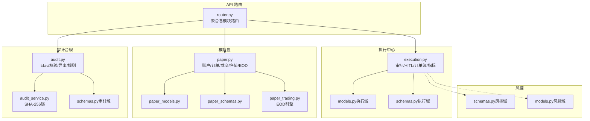
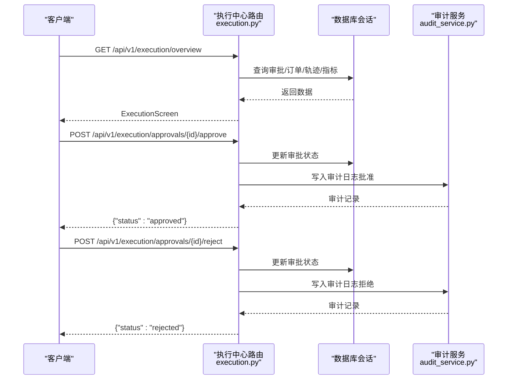
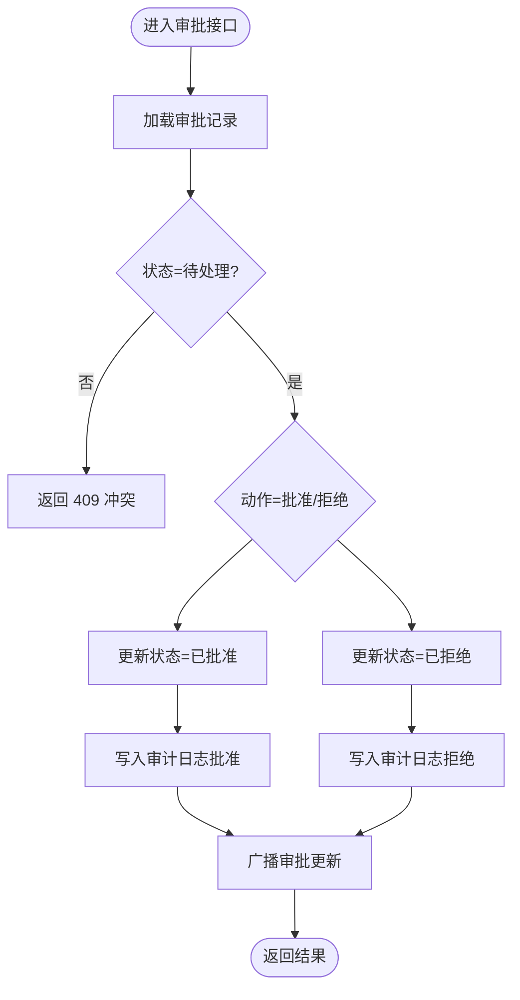
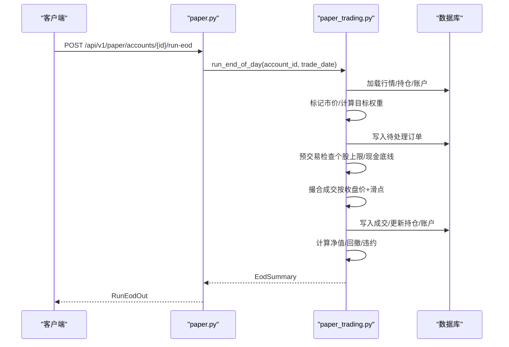
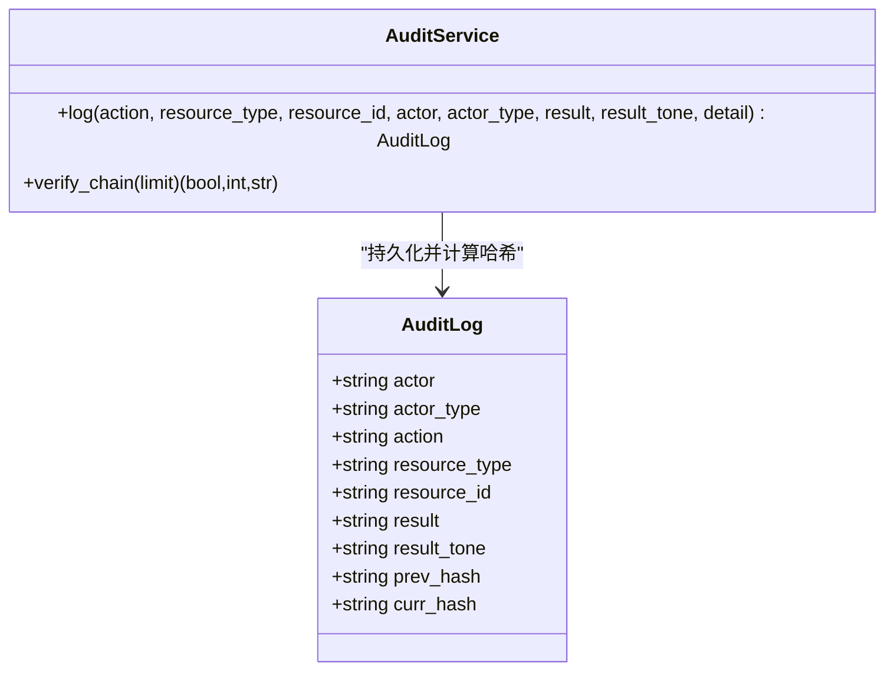
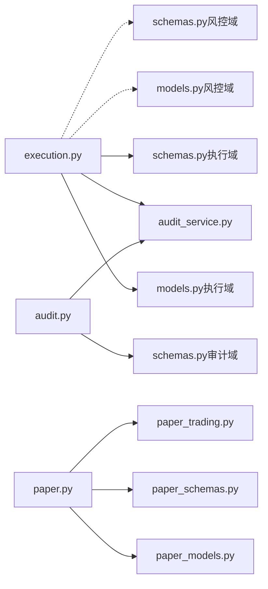

# 执行 API

<cite>
**本文引用的文件**
- [execution.py](file://backend/app/api/v1/execution.py)
- [schemas.py（执行域）](file://backend/app/domains/execution/schemas.py)
- [models.py（执行域）](file://backend/app/domains/execution/models.py)
- [paper.py](file://backend/app/api/v1/paper.py)
- [paper_schemas.py](file://backend/app/domains/execution/paper_schemas.py)
- [paper_models.py](file://backend/app/domains/execution/paper_models.py)
- [paper_trading.py](file://backend/app/services/paper_trading.py)
- [audit.py](file://backend/app/api/v1/audit.py)
- [audit_service.py](file://backend/app/services/audit_service.py)
- [schemas.py（审计域）](file://backend/app/domains/audit/schemas.py)
- [router.py](file://backend/app/api/v1/router.py)
- [schemas.py（风控域）](file://backend/app/domains/risk/schemas.py)
- [models.py（风控域）](file://backend/app/domains/risk/models.py)
- [test_paper.py](file://backend/tests/api/test_paper.py)
</cite>

## 目录
1. [简介](#简介)
2. [项目结构](#项目结构)
3. [核心组件](#核心组件)
4. [架构总览](#架构总览)
5. [详细组件分析](#详细组件分析)
6. [依赖关系分析](#依赖关系分析)
7. [性能考量](#性能考量)
8. [故障排查指南](#故障排查指南)
9. [结论](#结论)
10. [附录：接口规范与最佳实践](#附录接口规范与最佳实践)

## 简介
本文件为“执行 API”的完整文档，覆盖订单管理、交易执行、风控检查、人工确认（HITL）等接口规范，并同时说明模拟盘与实盘交易的差异与集成方式。内容包括：
- 订单类型与状态流转
- 执行算法与滑点处理
- 成交回报与净值计算
- 交易审批流程与审计日志
- 风控检查与熔断机制
- 异常处理与重试建议
- 交易策略集成示例与最佳实践

## 项目结构
执行 API 由后端 FastAPI 路由聚合，按领域拆分模块：
- 执行中心：审批请求、订单簿、代理轨迹、执行指标
- 模拟盘：账户、订单、成交、净值、风控违约
- 审计合规：不可篡改审计链、工具注册表、人工确认规则
- 风控：预算、VaR、熔断器、违规事件

**图表来源**
- [router.py:1-40](file://backend/app/api/v1/router.py#L1-L40)
- [execution.py:1-281](file://backend/app/api/v1/execution.py#L1-L281)
- [paper.py:1-276](file://backend/app/api/v1/paper.py#L1-L276)
- [audit.py:1-258](file://backend/app/api/v1/audit.py#L1-L258)
- [paper_trading.py:1-634](file://backend/app/services/paper_trading.py#L1-L634)

**章节来源**
- [router.py:1-40](file://backend/app/api/v1/router.py#L1-L40)

## 核心组件
- 执行中心（Execution Center）
  - 审批请求列表与人工确认（批准/拒绝）
  - 订单簿展示与状态
  - 代理轨迹与执行指标（滑点、成交率、拒绝原因）
- 模拟盘（Paper Trading）
  - 账户生命周期、持仓、订单、成交、净值、风控违约
  - EOD 自动运行与手动触发
- 审计合规（Audit & Compliance）
  - 不可篡改审计链（SHA-256）、哈希链校验、导出
  - 工具注册表、人工确认规则
- 风控（Risk Control）
  - 规则、预算、VaR、熔断器、违规事件

**章节来源**
- [execution.py:188-281](file://backend/app/api/v1/execution.py#L188-L281)
- [paper.py:43-276](file://backend/app/api/v1/paper.py#L43-L276)
- [audit.py:153-258](file://backend/app/api/v1/audit.py#L153-L258)
- [schemas.py（执行域）:100-107](file://backend/app/domains/execution/schemas.py#L100-L107)
- [schemas.py（审计域）:47-53](file://backend/app/domains/audit/schemas.py#L47-L53)
- [schemas.py（风控域）:88-96](file://backend/app/domains/risk/schemas.py#L88-L96)

## 架构总览
执行 API 的关键交互如下：

**图表来源**
- [execution.py:188-281](file://backend/app/api/v1/execution.py#L188-L281)
- [audit_service.py:32-82](file://backend/app/services/audit_service.py#L32-L82)

## 详细组件分析

### 组件一：执行中心（审批、订单簿、指标）
- 接口概览
  - 获取执行中心总览：返回汇总、审批列表、预交易检查、订单簿、指标、代理轨迹
  - 列表审批请求：支持按状态过滤与数量限制
  - 人工确认：批准/拒绝审批请求，写入审计日志并广播更新
- 数据模型与输出
  - 审批输出字段：类型、方向、数量、名义金额、限价、止损、置信度、风险等级、时效、紧急度、策略等
  - 订单簿行：时间、标的、方向、数量、限价、已成交、状态、滑点、收益
  - 指标：滑点分布（均值、中位数、95 分位）、成交率、拒绝原因统计
- 处理逻辑
  - 审批状态仅允许从“待处理”变为“已批准/已拒绝”，并发冲突时返回 409
  - 审批变更通过 WebSocket 广播，前端可实时更新
- 风控检查
  - 预交易检查为静态常量（演示用途），实际系统应对接风控服务

**图表来源**
- [execution.py:223-281](file://backend/app/api/v1/execution.py#L223-L281)
- [audit_service.py:38-82](file://backend/app/services/audit_service.py#L38-L82)

**章节来源**
- [execution.py:188-281](file://backend/app/api/v1/execution.py#L188-L281)
- [schemas.py（执行域）:6-107](file://backend/app/domains/execution/schemas.py#L6-L107)
- [models.py（执行域）:9-103](file://backend/app/domains/execution/models.py#L9-L103)

### 组件二：模拟盘（Paper Trading）
- 账户与资产
  - 创建账户：支持初始现金、成本配置、市场、币种、策略版本等
  - 列表与查询：按状态与创建时间排序
- 持仓、订单、成交、净值、风控违约
  - 持仓：按市值降序
  - 订单：按创建时间倒序，含目标权重/数量、已成交量、状态、拒绝原因
  - 成交：含价格、数量、手续费、印花税、滑点、总成本
  - 净值：按交易日升序，包含日收益与回撤
  - 风控违约：按日期倒序，含严重级别与状态
- EOD 运行
  - 自动/手动触发：对指定交易日进行标记、信号、预检查、撮合、净值与后检
  - 成功条件：至少产生订单并完成部分/全部成交，生成净值点
- 执行算法与滑点处理
  - 使用统一的成本模型（佣金、最低收费、印花税、滑点基点）
  - 买入按“可负担数量”回测，卖出按可用仓位执行
  - 滑点：买入为执行价高于市价，卖出为市价高于执行价

**图表来源**
- [paper.py:229-248](file://backend/app/api/v1/paper.py#L229-L248)
- [paper_trading.py:82-134](file://backend/app/services/paper_trading.py#L82-L134)
- [paper_trading.py:374-498](file://backend/app/services/paper_trading.py#L374-L498)

**章节来源**
- [paper.py:43-276](file://backend/app/api/v1/paper.py#L43-L276)
- [paper_schemas.py:8-111](file://backend/app/domains/execution/paper_schemas.py#L8-L111)
- [paper_models.py:14-133](file://backend/app/domains/execution/paper_models.py#L14-L133)
- [paper_trading.py:1-634](file://backend/app/services/paper_trading.py#L1-L634)

### 组件三：审计与合规（不可篡改审计链）
- 接口概览
  - 总览：返回审计 KPI、日志行、演员统计、工具注册表、人工确认规则
  - 日志列表：支持按演员类型/动作过滤与分页
  - 哈希链校验：验证最近 N 条记录的完整性
  - 导出 CSV：支持按演员类型筛选导出
- 审计链
  - 每条记录基于前一条记录的当前哈希计算，形成不可篡改链
  - 支持校验函数返回是否有效、验证条数、首个断裂项 ID

**图表来源**
- [audit_service.py:32-109](file://backend/app/services/audit_service.py#L32-L109)
- [audit.py:153-258](file://backend/app/api/v1/audit.py#L153-L258)

**章节来源**
- [audit.py:153-258](file://backend/app/api/v1/audit.py#L153-L258)
- [audit_service.py:32-109](file://backend/app/services/audit_service.py#L32-L109)
- [schemas.py（审计域）:47-53](file://backend/app/domains/audit/schemas.py#L47-L53)

### 组件四：风控（预算、VaR、熔断器、违规）
- 风控域数据模型
  - 规则：作用范围、指标、阈值、动作（告警/阻断/强停）
  - 检查：资源检查结果与快照
  - 预算：组合维度的限额与占用
  - VaR：日/周 VaR 快照与分解
  - 熔断器：L1/L2/L3/L4 级别与状态
  - 违规：标题、详情、处置、状态
- 在执行中的应用
  - 预交易检查：在模拟盘 EOD 中体现为个股上限与现金底线
  - 实盘审批：可通过人工确认规则强制审批

**章节来源**
- [schemas.py（风控域）:88-96](file://backend/app/domains/risk/schemas.py#L88-L96)
- [models.py（风控域）:9-101](file://backend/app/domains/risk/models.py#L9-L101)
- [paper_trading.py:314-372](file://backend/app/services/paper_trading.py#L314-L372)

## 依赖关系分析
- 路由聚合
  - API v1 路由将执行中心、模拟盘、审计、风控等模块统一挂载
- 执行中心依赖
  - 数据模型：Approval、Order、AgentTrace、ExecutionMetric、PreTradeCheck
  - 输出模式：ExecutionScreen、ApprovalOut、OrderBookRow、AgentTraceOut、ExecutionMetrics
  - 审计服务：批准/拒绝后写入审计日志
- 模拟盘依赖
  - EOD 引擎：统一的成本模型、滑点、佣金、印花税
  - 行情数据：每日 K 线用于标记市价与判断可买/可卖
- 审计依赖
  - 审计服务：SHA-256 链计算与校验

**图表来源**
- [execution.py:1-281](file://backend/app/api/v1/execution.py#L1-L281)
- [paper.py:1-276](file://backend/app/api/v1/paper.py#L1-L276)
- [audit.py:1-258](file://backend/app/api/v1/audit.py#L1-L258)
- [paper_trading.py:1-634](file://backend/app/services/paper_trading.py#L1-L634)

**章节来源**
- [router.py:25-40](file://backend/app/api/v1/router.py#L25-L40)

## 性能考量
- 查询优化
  - 对高频查询（审批、订单、轨迹、审计）使用索引列与 LIMIT 控制返回量
  - 分页参数（如 limit/offset）避免一次性拉取大量数据
- 数据库事务
  - 审批状态更新与审计写入在同一事务内，保证一致性
- EOD 执行
  - 按符号历史长度限制与按日期裁剪，避免超大规模集合扫描
  - 先处理卖出释放现金，再处理买入，减少资金占用与回撤

[本节为通用指导，不直接分析具体文件]

## 故障排查指南
- 审批接口
  - 404：审批不存在
  - 409：审批非“待处理”状态，无法再次操作
  - 审计核验：通过“哈希链校验”接口确认最近 N 条记录是否完整
- 模拟盘 EOD
  - 404：账户不存在或已被删除
  - 无行情：若某交易日无可交易标的，EOD 将跳过并返回空摘要
  - 资金不足：买入时按成本模型重新核算可购数量，不足则拒绝
- 风控
  - 预交易检查失败：个股占比超限或现金不足，订单被拒绝并记录违约

**章节来源**
- [execution.py:223-281](file://backend/app/api/v1/execution.py#L223-L281)
- [paper.py:229-248](file://backend/app/api/v1/paper.py#L229-L248)
- [audit.py:198-213](file://backend/app/api/v1/audit.py#L198-L213)

## 结论
执行 API 提供了从“人工确认—订单簿—执行—成交回报—审计—风控”的闭环能力，既可用于实盘交易的审批与监控，也可用于模拟盘策略验证与回测。通过统一的成本模型与滑点处理，确保实盘与回测的一致性；通过不可篡改审计链保障合规与可追溯。

[本节为总结，不直接分析具体文件]

## 附录：接口规范与最佳实践

### 一、执行中心接口规范
- 获取执行中心总览
  - 方法：GET
  - 路径：/api/v1/execution/overview
  - 返回：ExecutionScreen（汇总、审批、预交易检查、订单簿、指标、代理轨迹）
- 列表审批请求
  - 方法：GET
  - 路径：/api/v1/execution/approvals
  - 查询参数：status（默认 pending）、limit（1-200）
  - 返回：ApprovalOut 数组
- 审批确认
  - 批准：POST /api/v1/execution/approvals/{approval_id}/approve
  - 拒绝：POST /api/v1/execution/approvals/{approval_id}/reject
  - 返回：包含 approval_id 与最终状态
  - 审计：写入审计日志并广播更新

**章节来源**
- [execution.py:188-281](file://backend/app/api/v1/execution.py#L188-L281)
- [schemas.py（执行域）:100-107](file://backend/app/domains/execution/schemas.py#L100-L107)

### 二、模拟盘接口规范
- 账户
  - 创建：POST /api/v1/paper/accounts
  - 列表：GET /api/v1/paper/accounts
  - 查询：GET /api/v1/paper/accounts/{account_id}
- 持仓/订单/成交/净值/违约
  - 持仓：GET /api/v1/paper/accounts/{account_id}/positions
  - 订单：GET /api/v1/paper/accounts/{account_id}/orders
  - 成交：GET /api/v1/paper/accounts/{account_id}/fills
  - 净值：GET /api/v1/paper/accounts/{account_id}/nav
  - 违约：GET /api/v1/paper/accounts/{account_id}/breaches
- EOD 运行
  - 手动触发：POST /api/v1/paper/accounts/{account_id}/run-eod
  - 返回：RunEodOut（订单创建/成交/拒绝数量、违约数、净值）

**章节来源**
- [paper.py:43-276](file://backend/app/api/v1/paper.py#L43-L276)
- [paper_schemas.py:8-111](file://backend/app/domains/execution/paper_schemas.py#L8-L111)

### 三、审计与合规接口规范
- 总览：GET /api/v1/audit/overview
- 日志列表：GET /api/v1/audit/logs?actor_type=&action=&limit=&offset=
- 演员统计：GET /api/v1/audit/actor-stats?limit=
- 哈希链校验：GET /api/v1/audit/verify?limit=
- 导出 CSV：GET /api/v1/audit/export?actor_type=&limit=
- 工具注册表：GET /api/v1/audit/registry
- 人工确认规则：GET /api/v1/audit/hitl-rules

**章节来源**
- [audit.py:153-258](file://backend/app/api/v1/audit.py#L153-L258)
- [schemas.py（审计域）:47-53](file://backend/app/domains/audit/schemas.py#L47-L53)

### 四、执行算法与滑点处理
- 成本模型（统一于回测/模拟盘）
  - 买入：amount = qty × 执行价；佣金 = max(amt×费率, 最低收费)；印花税=0；滑点=qty×(执行价-市价)
  - 卖出：amount = qty × 执行价；佣金 = max(amt×费率, 最低收费)；印花税=amt×税率；滑点=qty×(市价-执行价)
  - 执行价 = 市价 × (1±滑点比例)，买入加正，卖出减负
- 可负担数量（买入）
  - 可购数量 = (现金-最低收费)/(市价×(1+佣金费率))
- EOD 顺序
  - 先处理卖出，再处理买入，以释放现金提高购买力

**章节来源**
- [paper_trading.py:602-634](file://backend/app/services/paper_trading.py#L602-L634)
- [paper_trading.py:374-498](file://backend/app/services/paper_trading.py#L374-L498)

### 五、交易策略集成示例（步骤）
- 步骤 1：创建模拟盘账户并配置成本参数
- 步骤 2：准备历史行情（每日 K 线）
- 步骤 3：调用 EOD 接口（手动或定时任务）
- 步骤 4：读取订单簿与成交明细，评估滑点与成本
- 步骤 5：在执行中心发起人工确认（如需），并记录审计日志
- 步骤 6：监控风控违约与净值曲线，调整策略参数

**章节来源**
- [test_paper.py:54-111](file://backend/tests/api/test_paper.py#L54-L111)
- [paper.py:229-248](file://backend/app/api/v1/paper.py#L229-L248)

### 六、最佳实践
- 审批流程
  - 对大额/高危交易启用人工确认（HITL）
  - 明确紧急度与时效，避免过期导致阻塞
- 风控检查
  - 预交易检查应与实时风控服务联动，动态阈值更合理
  - 对个股集中度、日最大回撤、最大回撤等关键指标设限
- 成本建模
  - 保持回测与实盘/模拟盘一致的成本参数，避免偏差
  - 滑点基点应结合流动性与冲击成本设定
- 审计与合规
  - 定期校验审计链完整性，保留证据链
  - 导出审计日志用于合规审查与问题追溯

[本节为通用指导，不直接分析具体文件]