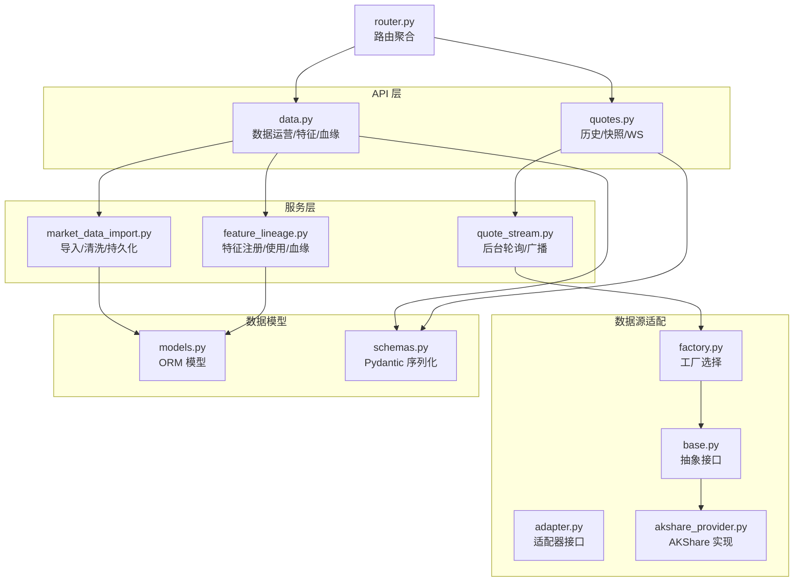
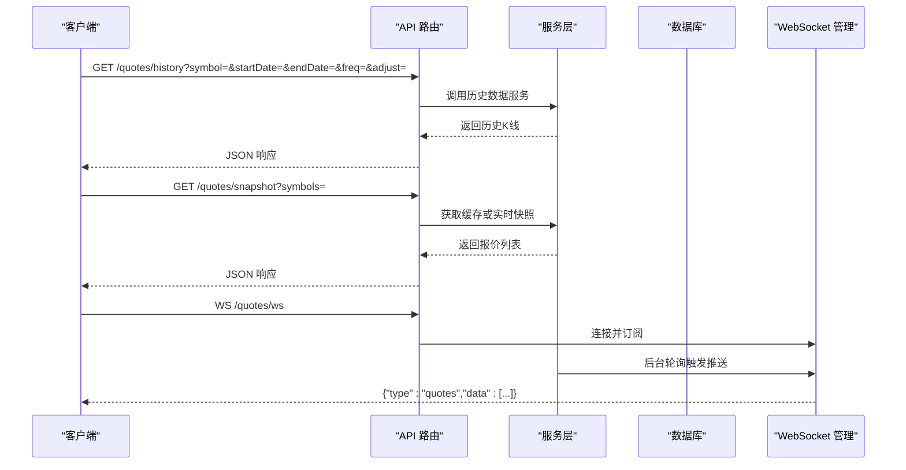
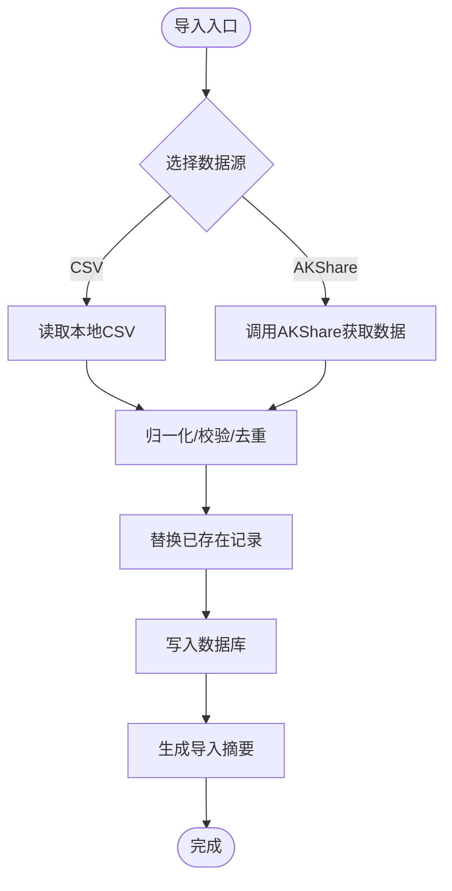
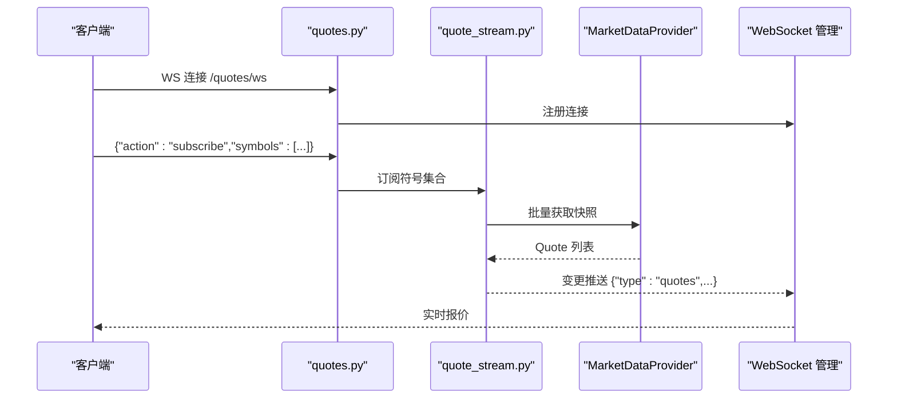
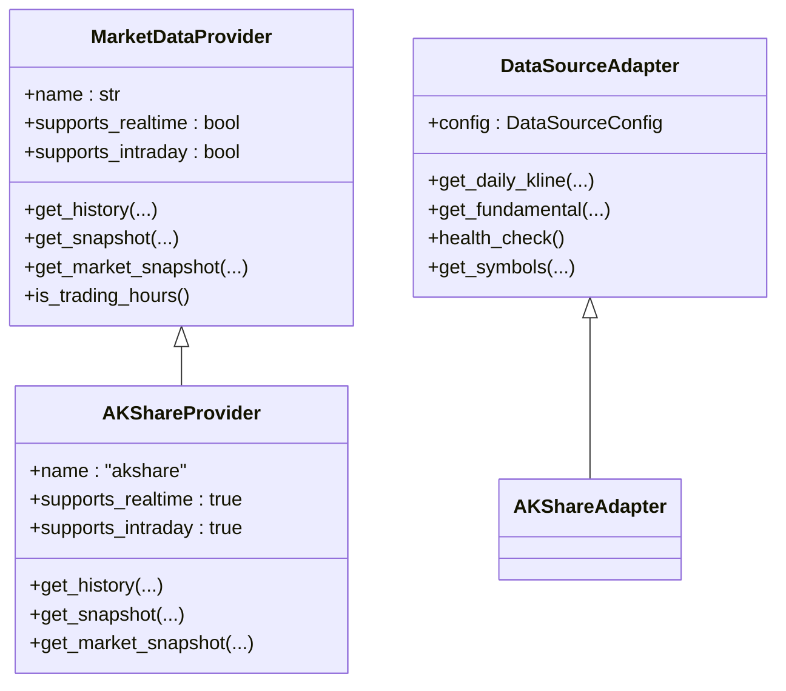
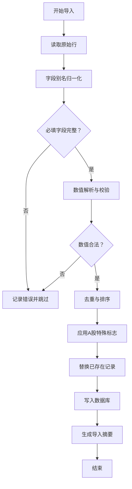
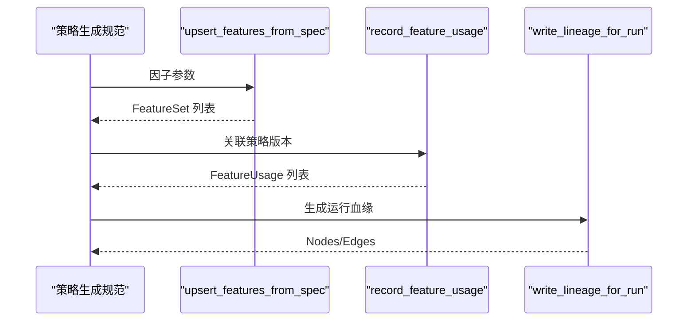
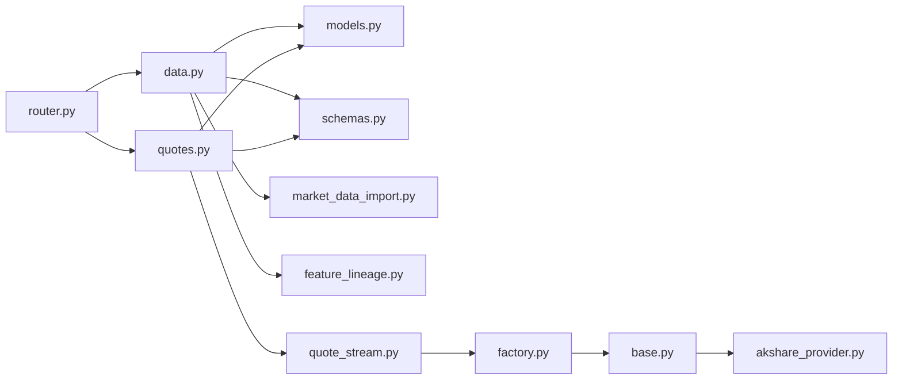

# 数据 API

<cite>
**本文档引用的文件**
- [backend/app/api/v1/data.py](file://backend/app/api/v1/data.py)
- [backend/app/api/v1/quotes.py](file://backend/app/api/v1/quotes.py)
- [backend/app/api/v1/router.py](file://backend/app/api/v1/router.py)
- [backend/app/services/market_data_import.py](file://backend/app/services/market_data_import.py)
- [backend/app/services/feature_lineage.py](file://backend/app/services/feature_lineage.py)
- [backend/app/services/quote_stream.py](file://backend/app/services/quote_stream.py)
- [backend/app/integrations/market_data/base.py](file://backend/app/integrations/market_data/base.py)
- [backend/app/integrations/market_data/adapter.py](file://backend/app/integrations/market_data/adapter.py)
- [backend/app/integrations/market_data/factory.py](file://backend/app/integrations/market_data/factory.py)
- [backend/app/integrations/market_data/akshare_provider.py](file://backend/app/integrations/market_data/akshare_provider.py)
- [backend/app/domains/data/schemas.py](file://backend/app/domains/data/schemas.py)
- [backend/app/domains/data/models.py](file://backend/app/domains/data/models.py)
- [backend/README.md](file://backend/README.md)
- [backend/tests/services/test_market_data_import.py](file://backend/tests/services/test_market_data_import.py)
</cite>

## 目录
1. [简介](#简介)
2. [项目结构](#项目结构)
3. [核心组件](#核心组件)
4. [架构总览](#架构总览)
5. [详细组件分析](#详细组件分析)
6. [依赖关系分析](#依赖关系分析)
7. [性能考量](#性能考量)
8. [故障排查指南](#故障排查指南)
9. [结论](#结论)
10. [附录](#附录)

## 简介
本文件为数据 API 的详细技术文档，覆盖市场数据导入、查询、清洗、特征存储与血缘追踪等核心能力。文档同时说明数据源适配、数据质量检查、特征工程、血缘追踪、历史数据获取、实时数据订阅、数据格式转换与批量处理的接口规范，并提供数据标准化流程与数据治理最佳实践建议。

## 项目结构
后端采用 FastAPI + SQLAlchemy 异步架构，API v1 路由聚合各领域服务。数据相关能力主要分布在以下模块：
- API 层：/backend/app/api/v1/data.py（数据运营与特征）、/backend/app/api/v1/quotes.py（行情）
- 服务层：/backend/app/services/market_data_import.py（导入清洗）、/backend/app/services/feature_lineage.py（特征与血缘）、/backend/app/services/quote_stream.py（实时推送）
- 数据源适配：/backend/app/integrations/market_data/（抽象基类、工厂、适配器、具体提供商）
- 数据模型与序列化：/backend/app/domains/data/models.py、/backend/app/domains/data/schemas.py
- 路由聚合：/backend/app/api/v1/router.py

**图表来源**
- [backend/app/api/v1/data.py:1-392](file://backend/app/api/v1/data.py#L1-L392)
- [backend/app/api/v1/quotes.py:1-129](file://backend/app/api/v1/quotes.py#L1-L129)
- [backend/app/api/v1/router.py:1-40](file://backend/app/api/v1/router.py#L1-L40)
- [backend/app/services/market_data_import.py:1-426](file://backend/app/services/market_data_import.py#L1-L426)
- [backend/app/services/feature_lineage.py:1-217](file://backend/app/services/feature_lineage.py#L1-L217)
- [backend/app/services/quote_stream.py:1-152](file://backend/app/services/quote_stream.py#L1-L152)
- [backend/app/integrations/market_data/base.py:1-113](file://backend/app/integrations/market_data/base.py#L1-L113)
- [backend/app/integrations/market_data/factory.py:1-57](file://backend/app/integrations/market_data/factory.py#L1-L57)
- [backend/app/integrations/market_data/adapter.py:1-115](file://backend/app/integrations/market_data/adapter.py#L1-L115)
- [backend/app/integrations/market_data/akshare_provider.py:1-262](file://backend/app/integrations/market_data/akshare_provider.py#L1-L262)
- [backend/app/domains/data/models.py:1-144](file://backend/app/domains/data/models.py#L1-L144)
- [backend/app/domains/data/schemas.py:1-194](file://backend/app/domains/data/schemas.py#L1-L194)

**章节来源**
- [backend/app/api/v1/router.py:1-40](file://backend/app/api/v1/router.py#L1-L40)
- [backend/README.md:1-45](file://backend/README.md#L1-L45)

## 核心组件
- 数据运营与特征管理：提供数据概览、数据源列表、延迟趋势、偏见门检查、血缘图谱、事件告警、特征清单与使用情况查询等。
- 历史与实时行情：支持按符号/频率/复权条件的历史数据查询；提供缓存优先的实时快照；通过 WebSocket 推送增量报价。
- 导入清洗与持久化：支持本地 CSV 与 AKShare 两种导入路径，统一归一化、校验、去重、A 股特殊标志计算与写库。
- 特征存储与血缘追踪：注册特征集、记录特征使用、生成回测运行级血缘链路（raw → cleaned → feature → strategy → run）。
- 数据源适配：抽象 Provider 接口，工厂模式按配置选择具体实现（AKShare/Tushare/Wind/Mock），适配器模式封装不同数据源差异。

**章节来源**
- [backend/app/api/v1/data.py:134-392](file://backend/app/api/v1/data.py#L134-L392)
- [backend/app/api/v1/quotes.py:1-129](file://backend/app/api/v1/quotes.py#L1-L129)
- [backend/app/services/market_data_import.py:177-426](file://backend/app/services/market_data_import.py#L177-L426)
- [backend/app/services/feature_lineage.py:41-217](file://backend/app/services/feature_lineage.py#L41-L217)
- [backend/app/integrations/market_data/base.py:64-113](file://backend/app/integrations/market_data/base.py#L64-L113)
- [backend/app/integrations/market_data/factory.py:23-56](file://backend/app/integrations/market_data/factory.py#L23-L56)

## 架构总览
数据 API 的调用链路从 FastAPI 路由进入，经服务层完成业务处理，再通过 ORM 持久化到数据库。实时行情通过后台服务轮询上游数据源，命中变更后通过 WebSocket 广播给客户端。

**图表来源**
- [backend/app/api/v1/quotes.py:16-128](file://backend/app/api/v1/quotes.py#L16-L128)
- [backend/app/services/quote_stream.py:62-152](file://backend/app/services/quote_stream.py#L62-L152)

## 详细组件分析

### 数据 API（/data）
- 数据概览与监控
  - GET /data/overview：返回头部指标、数据源分层、KPI、数据源列表、延迟趋势、偏见门检查、血缘图谱、事件告警。
  - GET /data/sources：返回所有数据源元信息。
  - GET /data/latency-trend：返回延迟趋势。
  - GET /data/incidents：返回数据事件。
  - GET /data/bias-gates：返回偏见门检查结果。
- 市场数据导入
  - POST /data/market-bars/import/csv：从本地 CSV 导入日线数据，支持默认符号与来源名。
  - POST /data/market-bars/import/akshare：从 AKShare 导入日线数据，支持符号列表、起止日期、复权参数。
- 市场数据查询
  - GET /data/market-bars：按符号/日期范围/限制条数查询已入库的日线数据。
  - GET /data/symbols：列出去重后的交易标的及其覆盖区间。
- 特征与血缘
  - GET /data/features：列出特征集（可限制版本、类型等）。
  - GET /data/features/usages：按策略版本或回测运行过滤特征使用记录。
  - GET /data/lineage：返回全局血缘图谱。
  - GET /data/lineage/runs/{run_id}：返回指定回测运行的血缘子图。

**图表来源**
- [backend/app/services/market_data_import.py:185-241](file://backend/app/services/market_data_import.py#L185-L241)

**章节来源**
- [backend/app/api/v1/data.py:134-392](file://backend/app/api/v1/data.py#L134-L392)
- [backend/app/domains/data/schemas.py:128-194](file://backend/app/domains/data/schemas.py#L128-L194)
- [backend/app/domains/data/models.py:40-144](file://backend/app/domains/data/models.py#L40-L144)

### 行情 API（/quotes）
- 历史数据
  - GET /quotes/history：按符号、日期范围、频率、复权返回历史 K 线。
- 实时快照
  - GET /quotes/snapshot：优先返回内存缓存，否则调用实时提供商。
  - GET /quotes/market：全市场快照，优先缓存。
- WebSocket 实时推送
  - WS /quotes/ws：订阅/退订，支持 ping/pong；服务端推送变更。

**图表来源**
- [backend/app/api/v1/quotes.py:85-128](file://backend/app/api/v1/quotes.py#L85-L128)
- [backend/app/services/quote_stream.py:62-152](file://backend/app/services/quote_stream.py#L62-L152)
- [backend/app/integrations/market_data/base.py:64-113](file://backend/app/integrations/market_data/base.py#L64-L113)

**章节来源**
- [backend/app/api/v1/quotes.py:1-129](file://backend/app/api/v1/quotes.py#L1-L129)
- [backend/app/services/quote_stream.py:1-152](file://backend/app/services/quote_stream.py#L1-L152)
- [backend/app/integrations/market_data/base.py:1-113](file://backend/app/integrations/market_data/base.py#L1-L113)

### 数据源适配与工厂
- 抽象接口：MarketDataProvider 定义历史、快照、全市场扫描与交易时段判断等方法。
- 工厂：根据配置选择具体提供商（AKShare/Tushare/Wind/Mock），自动降级。
- 适配器：DataSourceAdapter 抽象数据源配置、健康检查、符号列表等。
- 具体实现：AKShareProvider 使用 Sina 批量接口与 AKShare 库，支持日线/周线/月线与复权。

**图表来源**
- [backend/app/integrations/market_data/base.py:64-113](file://backend/app/integrations/market_data/base.py#L64-L113)
- [backend/app/integrations/market_data/adapter.py:34-115](file://backend/app/integrations/market_data/adapter.py#L34-L115)
- [backend/app/integrations/market_data/akshare_provider.py:145-262](file://backend/app/integrations/market_data/akshare_provider.py#L145-L262)

**章节来源**
- [backend/app/integrations/market_data/factory.py:23-56](file://backend/app/integrations/market_data/factory.py#L23-L56)
- [backend/app/integrations/market_data/adapter.py:1-115](file://backend/app/integrations/market_data/adapter.py#L1-L115)
- [backend/app/integrations/market_data/akshare_provider.py:1-262](file://backend/app/integrations/market_data/akshare_provider.py#L1-L262)

### 导入清洗与持久化
- CSV 导入：LocalCsvDailyBarProvider 读取 UTF-8 CSV 文件。
- AKShare 导入：异步调用 AKShare 获取日线数据，转换为统一记录。
- 归一化与校验：字段别名映射、必填字段检查、数值合法性、A 股特殊规则（涨跌停、停牌、ST 标记）。
- 去重与更新：按 symbol+trade_date 去重，重复键删除旧记录后插入新记录。
- 结果汇总：统计导入/插入/更新/跳过/错误数量与时间范围。

**图表来源**
- [backend/app/services/market_data_import.py:243-290](file://backend/app/services/market_data_import.py#L243-L290)

**章节来源**
- [backend/app/services/market_data_import.py:107-426](file://backend/app/services/market_data_import.py#L107-L426)
- [backend/tests/services/test_market_data_import.py:25-134](file://backend/tests/services/test_market_data_import.py#L25-L134)

### 特征存储与血缘追踪
- 特征注册：从策略生成规范提取因子，按参数哈希生成版本，写入 feature_sets。
- 特征使用：记录策略版本与特征的关联，便于审计与回溯。
- 血缘生成：为回测运行构建链路 raw → cleaned → feature(s) → strategy → run，写入 lineage_nodes/edges。

**图表来源**
- [backend/app/services/feature_lineage.py:41-194](file://backend/app/services/feature_lineage.py#L41-L194)

**章节来源**
- [backend/app/services/feature_lineage.py:1-217](file://backend/app/services/feature_lineage.py#L1-L217)
- [backend/app/domains/data/models.py:81-130](file://backend/app/domains/data/models.py#L81-L130)

## 依赖关系分析
- API 路由聚合：/api/v1/router.py 将 /data 与 /quotes 子路由纳入主路由。
- 数据模型：ORM 模型定义了数据源、日线、特征、血缘节点/边、事件等核心实体。
- 序列化模型：Pydantic 模型用于 API 请求/响应的数据结构与字段别名。
- 服务依赖：导入服务依赖 ORM 模型；特征血缘服务依赖策略生成规范；行情服务依赖数据源工厂与 Provider。

**图表来源**
- [backend/app/api/v1/router.py:23-40](file://backend/app/api/v1/router.py#L23-L40)
- [backend/app/api/v1/data.py:1-44](file://backend/app/api/v1/data.py#L1-L44)
- [backend/app/api/v1/quotes.py:1-12](file://backend/app/api/v1/quotes.py#L1-L12)
- [backend/app/domains/data/models.py:1-144](file://backend/app/domains/data/models.py#L1-L144)
- [backend/app/domains/data/schemas.py:1-194](file://backend/app/domains/data/schemas.py#L1-L194)
- [backend/app/services/market_data_import.py:1-40](file://backend/app/services/market_data_import.py#L1-L40)
- [backend/app/services/feature_lineage.py:1-25](file://backend/app/services/feature_lineage.py#L1-L25)
- [backend/app/services/quote_stream.py:1-36](file://backend/app/services/quote_stream.py#L1-L36)
- [backend/app/integrations/market_data/factory.py:1-57](file://backend/app/integrations/market_data/factory.py#L1-L57)
- [backend/app/integrations/market_data/base.py:1-113](file://backend/app/integrations/market_data/base.py#L1-L113)
- [backend/app/integrations/market_data/akshare_provider.py:1-262](file://backend/app/integrations/market_data/akshare_provider.py#L1-L262)

**章节来源**
- [backend/app/api/v1/router.py:1-40](file://backend/app/api/v1/router.py#L1-L40)
- [backend/app/domains/data/models.py:1-144](file://backend/app/domains/data/models.py#L1-L144)
- [backend/app/domains/data/schemas.py:1-194](file://backend/app/domains/data/schemas.py#L1-L194)

## 性能考量
- 实时行情轮询：仅对已订阅符号进行轮询，交易时段短间隔、非交易时段长间隔，避免无效请求。
- 批量快照：Sina 批量接口单次请求获取多个符号，降低网络开销。
- 导入批处理：CSV/HTTP 获取后统一归一化与去重，减少数据库写放大。
- 数据库索引：按 symbol/trade_date 组合建立唯一约束，加速去重与查询。
- 缓存优先：快照接口优先返回内存缓存，提升响应速度。

[本节为通用性能讨论，无需特定文件引用]

## 故障排查指南
- 导入失败
  - CSV 文件不存在或非文件：抛出文件未找到异常。
  - 字段缺失或数值非法：导入服务会记录错误并跳过该行。
  - 重复键：先删除旧记录再插入新记录，确保幂等。
- 实时行情异常
  - WebSocket 断开：服务层捕获断开并清理订阅。
  - 提供商不可用：工厂自动降级至 Mock 提供商并记录警告。
- 血缘查询
  - 运行 ID 不存在：返回 404，提示无该运行的血缘。

**章节来源**
- [backend/app/services/market_data_import.py:110-119](file://backend/app/services/market_data_import.py#L110-L119)
- [backend/app/api/v1/data.py:168-172](file://backend/app/api/v1/data.py#L168-L172)
- [backend/app/api/v1/quotes.py:122-128](file://backend/app/api/v1/quotes.py#L122-L128)
- [backend/app/integrations/market_data/factory.py:36-39](file://backend/app/integrations/market_data/factory.py#L36-L39)
- [backend/app/api/v1/data.py:307-308](file://backend/app/api/v1/data.py#L307-L308)

## 结论
本数据 API 以清晰的分层架构实现了从数据源适配、导入清洗、特征存储到血缘追踪的全链路能力。通过工厂与适配器模式解耦多数据源，通过服务层统一处理业务逻辑，结合 ORM 与 Pydantic 实现稳定的数据契约。实时行情通过后台轮询与 WebSocket 广播实现低延迟推送。建议在生产环境启用 PostgreSQL、Redis（可选）与 Celery 任务队列，配合完善的监控与告警体系保障数据质量与稳定性。

[本节为总结性内容，无需特定文件引用]

## 附录

### API 接口一览（按路径分组）

- 数据运营与特征
  - GET /data/overview：数据运营大屏聚合数据
  - GET /data/sources：数据源列表
  - GET /data/latency-trend：延迟趋势
  - GET /data/incidents：数据事件
  - GET /data/bias-gates：偏见门检查
  - POST /data/market-bars/import/csv：CSV 导入
  - POST /data/market-bars/import/akshare：AKShare 导入
  - GET /data/market-bars：日线查询
  - GET /data/symbols：标的列表
  - GET /data/features：特征清单
  - GET /data/features/usages：特征使用
  - GET /data/lineage：全局血缘
  - GET /data/lineage/runs/{run_id}：运行级血缘

- 行情
  - GET /quotes/history：历史 K 线
  - GET /quotes/snapshot：实时快照
  - GET /quotes/market：全市场快照
  - WS /quotes/ws：实时推送

**章节来源**
- [backend/app/api/v1/data.py:134-392](file://backend/app/api/v1/data.py#L134-L392)
- [backend/app/api/v1/quotes.py:16-128](file://backend/app/api/v1/quotes.py#L16-L128)

### 数据标准化流程与治理最佳实践
- 字段标准化：通过别名映射统一不同来源字段命名，确保必填字段齐全。
- 数值校验：严格校验正数、上下限关系与有限性，异常即刻拒绝。
- A 股特例：涨跌停、停牌、ST 标记与买卖可用性需基于前复权价格推导。
- 去重策略：按 symbol+trade_date 去重，重复项先删后插，保证幂等。
- 血缘治理：特征版本与参数绑定，回测运行级血缘链路完整记录，便于审计与溯源。
- 数据质量：偏见门检查（未来函数、幸存者偏差、完整性、及时性、一致性）持续监控。

**章节来源**
- [backend/app/services/market_data_import.py:90-105](file://backend/app/services/market_data_import.py#L90-L105)
- [backend/app/services/market_data_import.py:389-422](file://backend/app/services/market_data_import.py#L389-L422)
- [backend/app/services/feature_lineage.py:100-194](file://backend/app/services/feature_lineage.py#L100-L194)
- [backend/app/api/v1/data.py:96-102](file://backend/app/api/v1/data.py#L96-L102)