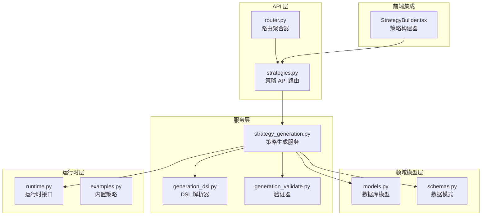
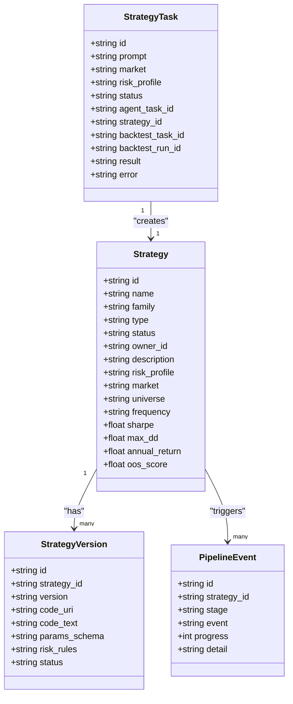
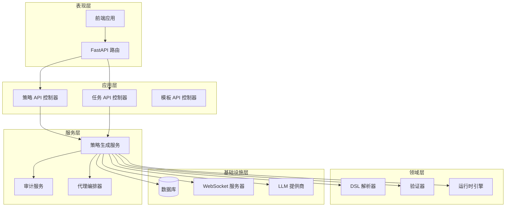
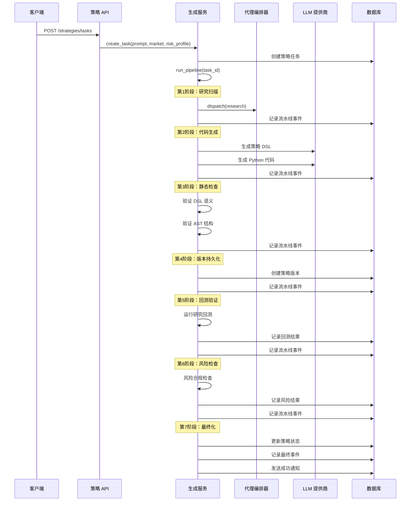
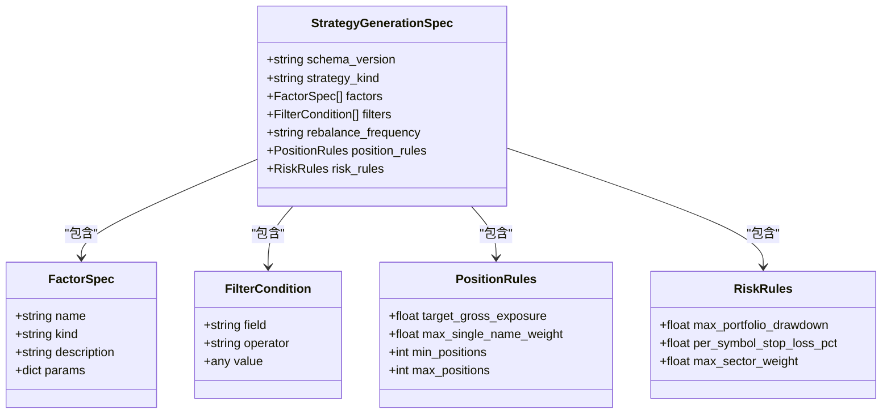
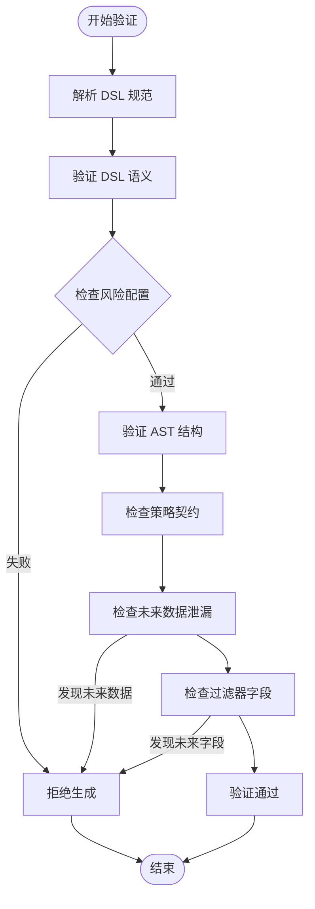
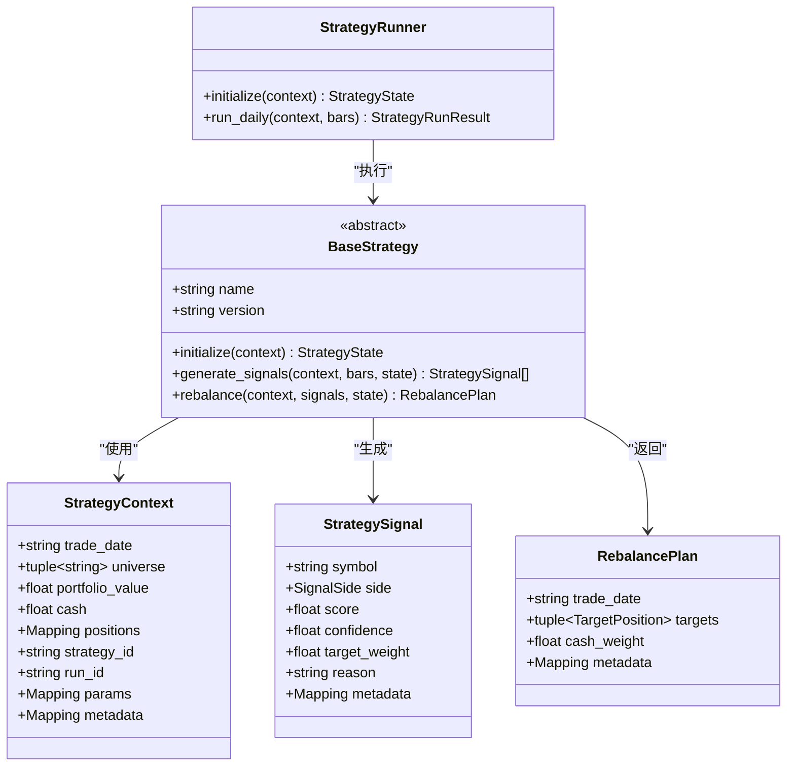
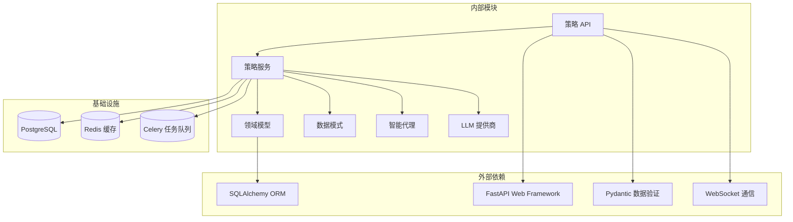

# 策略 API

<cite>
**本文档引用的文件**
- [strategies.py](file://backend/app/api/v1/strategies.py)
- [models.py](file://backend/app/domains/strategy/models.py)
- [schemas.py](file://backend/app/domains/strategy/schemas.py)
- [strategy_generation.py](file://backend/app/services/strategy_generation.py)
- [generation_dsl.py](file://backend/app/domains/strategy/generation_dsl.py)
- [generation_validate.py](file://backend/app/domains/strategy/generation_validate.py)
- [runtime.py](file://backend/app/domains/strategy/runtime.py)
- [examples.py](file://backend/app/domains/strategy/examples.py)
- [router.py](file://backend/app/api/v1/router.py)
- [StrategyBuilder.tsx](file://frontend/src/screens/Strategy/StrategyBuilder.tsx)
</cite>

## 目录
1. [简介](#简介)
2. [项目结构](#项目结构)
3. [核心组件](#核心组件)
4. [架构概览](#架构概览)
5. [详细组件分析](#详细组件分析)
6. [依赖关系分析](#依赖关系分析)
7. [性能考虑](#性能考虑)
8. [故障排除指南](#故障排除指南)
9. [结论](#结论)
10. [附录](#附录)

## 简介

策略 API 是一个完整的量化策略生成和管理系统，基于自然语言描述自动生成可执行的交易策略代码。该系统提供了从策略概念到实际部署的全生命周期管理，包括策略创建、版本管理、回测验证、风险控制和发布流程。

系统采用现代化的微服务架构，通过 FastAPI 提供 RESTful API 接口，结合 WebSocket 实时推送策略生成进度，并通过 Agent Orchestrator 协调多个智能代理完成复杂的策略生成任务。

## 项目结构

策略 API 位于后端应用的 `app/api/v1/` 目录下，主要包含以下核心模块：



**图表来源**
- [strategies.py:1-605](file://backend/app/api/v1/strategies.py#L1-L605)
- [router.py:1-40](file://backend/app/api/v1/router.py#L1-L40)

**章节来源**
- [strategies.py:1-605](file://backend/app/api/v1/strategies.py#L1-L605)
- [router.py:1-40](file://backend/app/api/v1/router.py#L1-L40)

## 核心组件

### 数据模型

策略系统的核心数据模型包括策略主记录、版本管理、任务跟踪和流水线事件四个主要实体：



**图表来源**
- [models.py:9-84](file://backend/app/domains/strategy/models.py#L9-L84)

### API 路由结构

策略 API 提供了完整的 CRUD 操作和高级功能：

| 资源 | 方法 | 路径 | 功能描述 |
|------|------|------|----------|
| 策略 | GET | `/strategies` | 列出所有策略 |
| 策略 | POST | `/strategies` | 创建新策略草稿 |
| 策略 | GET | `/strategies/{id}` | 获取策略详情 |
| 策略 | PUT/PATCH | `/strategies/{id}` | 更新策略信息 |
| 策略 | DELETE | `/strategies/{id}` | 删除策略（软删除） |
| 策略 | POST | `/strategies/{id}/transition` | 策略状态转换 |
| 策略 | GET | `/strategies/{id}/events` | 获取流水线事件 |
| 任务 | POST | `/strategies/tasks` | 创建生成任务 |
| 任务 | GET | `/strategies/tasks/{task_id}` | 查询任务状态 |
| 其他 | GET | `/strategies/templates` | 获取策略模板 |
| 其他 | GET | `/strategies/feed` | 获取活动流 |

**章节来源**
- [strategies.py:162-605](file://backend/app/api/v1/strategies.py#L162-L605)

## 架构概览

策略 API 采用分层架构设计，确保关注点分离和模块化：



**图表来源**
- [strategy_generation.py:86-584](file://backend/app/services/strategy_generation.py#L86-L584)
- [strategies.py:1-605](file://backend/app/api/v1/strategies.py#L1-L605)

## 详细组件分析

### 策略生成流水线

策略生成是整个系统的核心功能，通过多阶段的自动化处理实现从自然语言到可执行代码的转换：



**图表来源**
- [strategy_generation.py:132-373](file://backend/app/services/strategy_generation.py#L132-L373)
- [strategy_generation.py:445-514](file://backend/app/services/strategy_generation.py#L445-L514)

### DSL 结构定义

系统使用严格的 DSL（领域特定语言）来描述策略意图，确保生成的代码质量和一致性：



**图表来源**
- [generation_dsl.py:78-144](file://backend/app/domains/strategy/generation_dsl.py#L78-L144)

### 策略验证机制

系统实现了多层次的验证机制，确保生成的策略符合业务规则和技术要求：



**图表来源**
- [generation_validate.py:48-216](file://backend/app/domains/strategy/generation_validate.py#L48-L216)

**章节来源**
- [strategy_generation.py:132-373](file://backend/app/services/strategy_generation.py#L132-L373)
- [generation_dsl.py:78-144](file://backend/app/domains/strategy/generation_dsl.py#L78-L144)
- [generation_validate.py:48-216](file://backend/app/domains/strategy/generation_validate.py#L48-L216)

### 策略运行时接口

系统提供了统一的策略运行时接口，支持多种策略类型的执行：



**图表来源**
- [runtime.py:175-240](file://backend/app/domains/strategy/runtime.py#L175-L240)

**章节来源**
- [runtime.py:175-240](file://backend/app/domains/strategy/runtime.py#L175-L240)
- [examples.py:51-200](file://backend/app/domains/strategy/examples.py#L51-L200)

## 依赖关系分析

策略 API 的依赖关系体现了清晰的关注点分离：



**图表来源**
- [strategies.py:1-605](file://backend/app/api/v1/strategies.py#L1-L605)
- [strategy_generation.py:1-584](file://backend/app/services/strategy_generation.py#L1-L584)

**章节来源**
- [strategies.py:1-605](file://backend/app/api/v1/strategies.py#L1-L605)
- [strategy_generation.py:1-584](file://backend/app/services/strategy_generation.py#L1-L584)

## 性能考虑

策略 API 在设计时充分考虑了性能优化：

### 数据库优化
- 使用异步 SQLAlchemy 连接池
- 合理的索引设计（状态、家族、市场等字段）
- 分页查询优化（默认每页 20 条记录）

### 缓存策略
- WebSocket 广播缓存
- 前端状态缓存
- LLM 响应缓存

### 异步处理
- 策略生成任务异步执行
- 回测任务后台处理
- 实时事件推送

## 故障排除指南

### 常见问题及解决方案

#### 策略生成失败
**症状**: 策略生成任务状态变为 failed
**原因**: 
- DSL 语义验证失败
- AST 结构验证失败
- 风险约束不满足
- LLM 生成错误

**解决方法**:
1. 检查自然语言描述是否清晰明确
2. 验证风险配置是否合理
3. 查看流水线事件获取详细错误信息
4. 重新生成策略

#### 回测数据缺失
**症状**: 回测阶段报错
**原因**:
- 市场数据不足
- 日期范围不正确
- 股票池为空

**解决方法**:
1. 检查数据导入状态
2. 验证回测日期范围
3. 确认股票池配置

#### WebSocket 连接问题
**症状**: 实时进度无法显示
**解决方法**:
1. 检查网络连接
2. 确认 WebSocket 服务器状态
3. 刷新页面重试

**章节来源**
- [strategy_generation.py:308-373](file://backend/app/services/strategy_generation.py#L308-L373)

## 结论

策略 API 提供了一个完整、健壮且高效的量化策略生成和管理平台。通过严格的 DSL 定义、多层次的验证机制和灵活的运行时接口，系统能够可靠地将复杂的交易理念转化为可执行的策略代码。

系统的模块化设计和清晰的分层架构确保了良好的可维护性和扩展性。同时，实时的 WebSocket 通知和详细的审计日志为用户提供了优秀的开发体验。

## 附录

### API 接口规范

#### 策略管理接口

**创建策略草稿**
- 方法: POST `/strategies`
- 请求体: [StrategyCreate:66-75](file://backend/app/domains/strategy/schemas.py#L66-L75)
- 响应: 创建成功的策略 ID 和状态

**获取策略列表**
- 方法: GET `/strategies`
- 查询参数: status, family, market, q, page, page_size
- 响应: [StrategyListResponse:203-208](file://backend/app/domains/strategy/schemas.py#L203-L208)

**获取策略详情**
- 方法: GET `/strategies/{id}`
- 响应: [StrategyDetail:143-166](file://backend/app/domains/strategy/schemas.py#L143-L166)

**更新策略**
- 方法: PUT/PATCH `/strategies/{id}`
- 请求体: [StrategyUpdate:169-181](file://backend/app/domains/strategy/schemas.py#L169-L181)
- 响应: 更新后的策略详情

**删除策略**
- 方法: DELETE `/strategies/{id}`
- 响应: 删除确认信息

#### 策略生成接口

**创建生成任务**
- 方法: POST `/strategies/tasks`
- 请求体: [StrategyTaskCreate:77-82](file://backend/app/domains/strategy/schemas.py#L77-L82)
- 响应: [StrategyTaskOut:85-105](file://backend/app/domains/strategy/schemas.py#L85-L105)

**查询任务状态**
- 方法: GET `/strategies/tasks/{task_id}`
- 响应: [StrategyTaskOut:85-105](file://backend/app/domains/strategy/schemas.py#L85-L105)

#### 流水线管理接口

**状态转换**
- 方法: POST `/strategies/{id}/transition`
- 请求体: [StrategyTransition:122-127](file://backend/app/domains/strategy/schemas.py#L122-L127)
- 响应: 状态转换结果

**获取流水线事件**
- 方法: GET `/strategies/{id}/events`
- 响应: [PipelineEventOut:108-119](file://backend/app/domains/strategy/schemas.py#L108-L119) 数组

### 前端集成示例

前端应用通过 WebSocket 实时接收策略生成进度：

```typescript
// 前端 WebSocket 连接示例
const ws = new WebSocket('ws://localhost:8000/ws/strategy-events');

ws.onmessage = (event) => {
    const message = JSON.parse(event.data);
    if (message.type === 'strategy.event') {
        updateProgress(message.progress, message.event);
    }
};
```

### 最佳实践

1. **策略设计**: 使用清晰的自然语言描述，明确目标市场、风险偏好和投资风格
2. **参数配置**: 合理设置风险约束，避免过度激进的参数
3. **监控检查**: 定期审查策略性能指标和风险指标
4. **版本管理**: 建立完善的版本控制和回滚机制
5. **测试验证**: 在模拟盘环境中充分测试后再部署到实盘