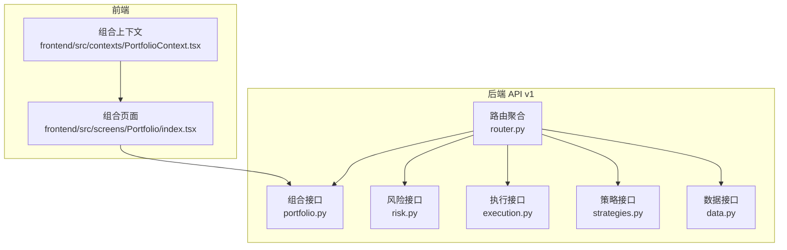
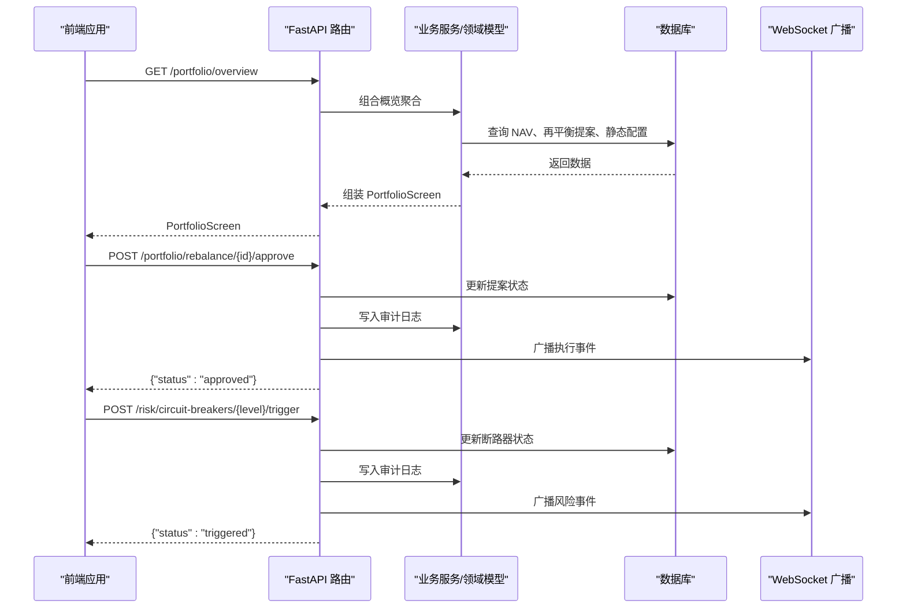
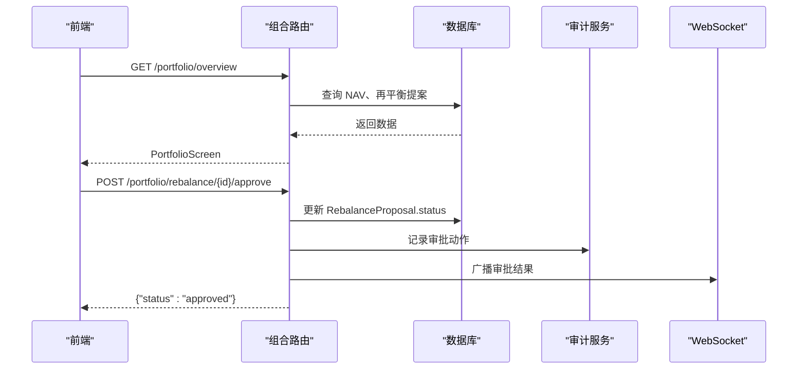
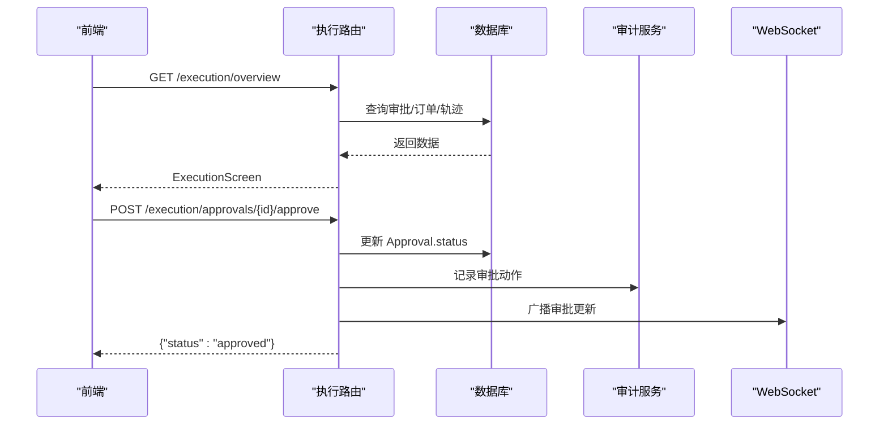
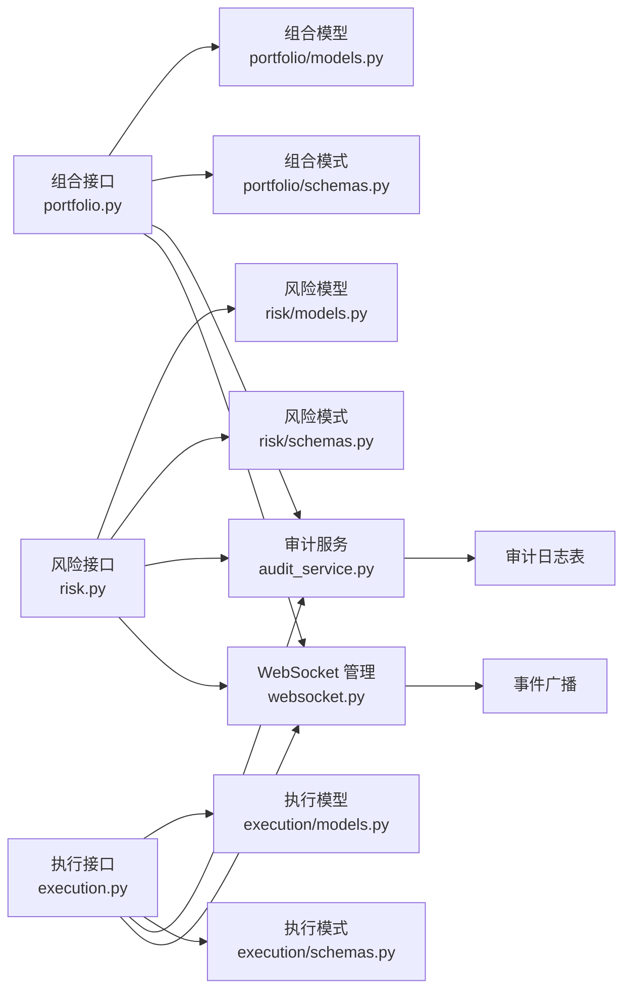

# 组合 API

<cite>
**本文引用的文件**
- [backend/app/api/v1/router.py](file://backend/app/api/v1/router.py)
- [backend/app/api/v1/portfolio.py](file://backend/app/api/v1/portfolio.py)
- [backend/app/domains/portfolio/models.py](file://backend/app/domains/portfolio/models.py)
- [backend/app/domains/portfolio/schemas.py](file://backend/app/domains/portfolio/schemas.py)
- [backend/app/api/v1/risk.py](file://backend/app/api/v1/risk.py)
- [backend/app/domains/risk/models.py](file://backend/app/domains/risk/models.py)
- [backend/app/domains/risk/schemas.py](file://backend/app/domains/risk/schemas.py)
- [backend/app/api/v1/execution.py](file://backend/app/api/v1/execution.py)
- [backend/app/domains/execution/models.py](file://backend/app/domains/execution/models.py)
- [backend/app/domains/execution/schemas.py](file://backend/app/domains/execution/schemas.py)
- [backend/app/api/v1/strategies.py](file://backend/app/api/v1/strategies.py)
- [backend/app/api/v1/data.py](file://backend/app/api/v1/data.py)
- [backend/app/services/audit_service.py](file://backend/app/services/audit_service.py)
- [backend/app/core/websocket.py](file://backend/app/core/websocket.py)
- [frontend/src/screens/Portfolio/index.tsx](file://frontend/src/screens/Portfolio/index.tsx)
- [frontend/src/contexts/PortfolioContext.tsx](file://frontend/src/contexts/PortfolioContext.tsx)
</cite>

## 目录
1. [简介](#简介)
2. [项目结构](#项目结构)
3. [核心组件](#核心组件)
4. [架构概览](#架构概览)
5. [详细组件分析](#详细组件分析)
6. [依赖分析](#依赖分析)
7. [性能考虑](#性能考虑)
8. [故障排查指南](#故障排查指南)
9. [结论](#结论)
10. [附录](#附录)

## 简介
本文件为“组合 API”的详细技术文档，覆盖投资组合管理、资产配置、风险预算、绩效分析等接口规范，并深入解析组合建模、权重调整、再平衡策略、收益归因等核心功能。文档同时涵盖组合层级管理、多组合对比、风险指标计算与报告生成的 API 接口，以及组合优化策略与风险管理最佳实践。

该系统采用前后端分离架构：后端基于 FastAPI 提供 REST API，前端通过 React 组件消费接口并渲染仪表板。组合相关能力由“组合舱”（Portfolio Cockpit）统一呈现，配合“风险控制”“执行中心”“数据运营”“策略工厂”等模块协同工作。

## 项目结构
后端 API v1 路由聚合了多个子模块，其中与组合直接相关的核心路由包括：
- /portfolio：组合概览、风险预算、资产配置、相关性矩阵、集中度、再平衡提案审批
- /risk：风险头寸、预算、VaR、断路器、违规事件、策略流
- /execution：交易审批、订单簿、预交易检查、执行指标
- /strategies：策略生命周期、版本、任务流水线
- /data：数据源、延迟趋势、特征血缘、导入工具

图表来源
- [backend/app/api/v1/router.py:23-40](file://backend/app/api/v1/router.py#L23-L40)
- [backend/app/api/v1/portfolio.py:26](file://backend/app/api/v1/portfolio.py#L26)
- [backend/app/api/v1/risk.py:28](file://backend/app/api/v1/risk.py#L28)
- [backend/app/api/v1/execution.py:27](file://backend/app/api/v1/execution.py#L27)
- [backend/app/api/v1/strategies.py:45](file://backend/app/api/v1/strategies.py#L45)
- [backend/app/api/v1/data.py:42](file://backend/app/api/v1/data.py#L42)
- [frontend/src/screens/Portfolio/index.tsx:17-42](file://frontend/src/screens/Portfolio/index.tsx#L17-L42)
- [frontend/src/contexts/PortfolioContext.tsx:1-13](file://frontend/src/contexts/PortfolioContext.tsx#L1-L13)

章节来源
- [backend/app/api/v1/router.py:23-40](file://backend/app/api/v1/router.py#L23-L40)

## 核心组件
- 组合接口（/portfolio）
  - 获取组合概览：返回净值、风险预算、资产配置、相关性矩阵、集中度、待处理再平衡提案
  - 列出再平衡提案：按状态与时间排序
  - 审批再平衡提案：写入审计日志并广播实时事件
- 风险接口（/risk）
  - 风控总览：健康评分、预算使用、VaR、断路器、策略决策流、违规事件
  - 手动触发/恢复断路器：写入审计日志并广播实时事件
- 执行接口（/execution）
  - 执行中心总览：待审批、订单簿、预交易检查、执行指标、代理轨迹
  - 审批/拒绝交易：写入审计日志并广播实时事件
- 策略接口（/strategies）
  - 策略工厂总览：流水线状态、模板、动态反馈、矩阵、看板
  - 策略任务创建/查询、事件流、详情、更新、删除、阶段迁移
- 数据接口（/data）
  - 数据运营总览：数据源分层、延迟趋势、漂移门、特征血缘、事件
  - 市场数据导入：CSV/AKShare
  - 特征注册与使用追踪：特征清单、使用关系

章节来源
- [backend/app/api/v1/portfolio.py:140-186](file://backend/app/api/v1/portfolio.py#L140-L186)
- [backend/app/api/v1/risk.py:188-273](file://backend/app/api/v1/risk.py#L188-L273)
- [backend/app/api/v1/execution.py:188-281](file://backend/app/api/v1/execution.py#L188-L281)
- [backend/app/api/v1/strategies.py:162-605](file://backend/app/api/v1/strategies.py#L162-L605)
- [backend/app/api/v1/data.py:134-392](file://backend/app/api/v1/data.py#L134-L392)

## 架构概览
组合 API 的数据流与控制流如下：

图表来源
- [backend/app/api/v1/portfolio.py:161-186](file://backend/app/api/v1/portfolio.py#L161-L186)
- [backend/app/api/v1/risk.py:210-239](file://backend/app/api/v1/risk.py#L210-L239)
- [backend/app/services/audit_service.py:32-82](file://backend/app/services/audit_service.py#L32-L82)
- [backend/app/core/websocket.py:27-42](file://backend/app/core/websocket.py#L27-L42)

## 详细组件分析

### 组合接口（/portfolio）
- 概览接口
  - 方法：GET /portfolio/overview
  - 输入：无
  - 输出：PortfolioScreen（包含 NAV、风险预算、资产配置、相关性、集中度、再平衡列表）
  - 关键实现：从数据库读取最新 NAV 快照与待处理再平衡提案，组装静态配置（如风险预算、分配、相关性、集中度）
- 再平衡提案列表
  - 方法：GET /portfolio/rebalance
  - 输入：无
  - 输出：RebalanceAction 列表
  - 关键实现：筛选状态为“pending”，按创建时间倒序，限制数量
- 审批再平衡提案
  - 方法：POST /portfolio/rebalance/{proposal_id}/approve
  - 输入：路径参数 proposal_id
  - 输出：{"proposal_id": "...", "status": "approved"}
  - 关键实现：校验提案存在且状态为“pending”，更新状态为“approved”，写入审计日志，广播执行事件

图表来源
- [backend/app/api/v1/portfolio.py:140-158](file://backend/app/api/v1/portfolio.py#L140-L158)
- [backend/app/api/v1/portfolio.py:161-186](file://backend/app/api/v1/portfolio.py#L161-L186)
- [backend/app/services/audit_service.py:38-81](file://backend/app/services/audit_service.py#L38-L81)
- [backend/app/core/websocket.py:27-42](file://backend/app/core/websocket.py#L27-L42)

章节来源
- [backend/app/api/v1/portfolio.py:140-186](file://backend/app/api/v1/portfolio.py#L140-L186)
- [backend/app/domains/portfolio/models.py:56-83](file://backend/app/domains/portfolio/models.py#L56-L83)
- [backend/app/domains/portfolio/schemas.py:87-94](file://backend/app/domains/portfolio/schemas.py#L87-L94)

### 风控接口（/risk）
- 风控总览
  - 方法：GET /risk/overview
  - 输出：RiskScreen（包含健康评分、预算、VaR、断路器、策略流、违规事件）
  - 关键实现：聚合多个数据源（预算、VaR、断路器、策略决策、违规事件），组装静态 KPI
- 手动触发断路器
  - 方法：POST /risk/circuit-breakers/{level}/trigger
  - 输出：{"level": "...", "status": "triggered"}
  - 关键实现：更新断路器状态为“triggered”，统计 24 小时触发次数，写入审计日志并广播
- 请求恢复断路器
  - 方法：POST /risk/circuit-breakers/{level}/recover
  - 输出：{"level": "...", "status": "recovery_requested"}
  - 关键实现：若非“armed”则冲突；否则置为“cooldown”，写入审计日志并广播

```mermaid
sequenceDiagram
participant FE as "前端"
participant API as "风险路由"
participant DB as "数据库"
participant AUDIT as "审计服务"
participant WS as "WebSocket"
FE->>API : GET /risk/overview
API->>DB : 查询预算/VaR/断路器/策略流/违规
DB-->>API : 返回数据
API-->>FE : RiskScreen
FE->>API : POST /risk/circuit-breakers/{level}/trigger
API->>DB : 更新断路器状态
API->>AUDIT : 记录触发动作
API->>WS : 广播触发事件
API-->>FE : {"status" : "triggered"}
```

图表来源
- [backend/app/api/v1/risk.py:188-207](file://backend/app/api/v1/risk.py#L188-L207)
- [backend/app/api/v1/risk.py:210-239](file://backend/app/api/v1/risk.py#L210-L239)
- [backend/app/services/audit_service.py:38-81](file://backend/app/services/audit_service.py#L38-L81)
- [backend/app/core/websocket.py:27-42](file://backend/app/core/websocket.py#L27-L42)

章节来源
- [backend/app/api/v1/risk.py:188-273](file://backend/app/api/v1/risk.py#L188-L273)
- [backend/app/domains/risk/models.py:34-101](file://backend/app/domains/risk/models.py#L34-L101)
- [backend/app/domains/risk/schemas.py:88-96](file://backend/app/domains/risk/schemas.py#L88-L96)

### 执行接口（/execution）
- 执行中心总览
  - 方法：GET /execution/overview
  - 输出：ExecutionScreen（汇总、待审批列表、预交易检查、订单簿、执行指标、代理轨迹）
  - 关键实现：从数据库读取审批、订单、轨迹等数据，组装静态指标
- 审批/拒绝交易
  - 方法：POST /execution/approvals/{approval_id}/approve 或 /reject
  - 输出：{"approval_id": "...", "status": "..."}
  - 关键实现：校验状态、更新审批状态，写入审计日志并广播

图表来源
- [backend/app/api/v1/execution.py:188-202](file://backend/app/api/v1/execution.py#L188-L202)
- [backend/app/api/v1/execution.py:223-250](file://backend/app/api/v1/execution.py#L223-L250)
- [backend/app/services/audit_service.py:38-81](file://backend/app/services/audit_service.py#L38-L81)
- [backend/app/core/websocket.py:27-42](file://backend/app/core/websocket.py#L27-L42)

章节来源
- [backend/app/api/v1/execution.py:188-281](file://backend/app/api/v1/execution.py#L188-L281)
- [backend/app/domains/execution/models.py:9-103](file://backend/app/domains/execution/models.py#L9-L103)
- [backend/app/domains/execution/schemas.py:100-107](file://backend/app/domains/execution/schemas.py#L100-L107)

### 策略接口（/strategies）
- 策略工厂总览
  - 方法：GET /strategies/overview
  - 输出：StrategyScreen（流水线状态、模板、动态反馈、矩阵、看板）
  - 关键实现：统计各阶段数量、加载模板、最近代理消息、策略矩阵、流水线看板
- 策略任务
  - 创建任务：POST /strategies/tasks
  - 查询任务：GET /strategies/tasks/{task_id}
- 策略详情与事件
  - 详情：GET /strategies/{strategy_id}
  - 事件：GET /strategies/{strategy_id}/events
  - 更新/删除/阶段迁移：PUT/PATCH/DELETE/POST 路由

章节来源
- [backend/app/api/v1/strategies.py:162-605](file://backend/app/api/v1/strategies.py#L162-L605)

### 数据接口（/data）
- 数据运营总览
  - 方法：GET /data/overview
  - 输出：DataScreen（概览、分层、KPI、数据源、延迟趋势、漂移门、血缘、事件）
- 市场数据导入
  - CSV 导入：POST /data/market-bars/import/csv
  - AKShare 导入：POST /data/market-bars/import/akshare
- 血缘与特征
  - 特征清单：GET /data/features
  - 使用追踪：GET /data/features/usages
  - 运行血缘：GET /data/lineage/runs/{run_id}

章节来源
- [backend/app/api/v1/data.py:134-392](file://backend/app/api/v1/data.py#L134-L392)

### 前端集成
- 组合页面自动拉取组合概览
- 组合上下文提供给各可视化组件（净值曲线、资产配置环形图、风险预算仪表、相关性矩阵、集中度条形图、再平衡操作）

章节来源
- [frontend/src/screens/Portfolio/index.tsx:17-42](file://frontend/src/screens/Portfolio/index.tsx#L17-L42)
- [frontend/src/contexts/PortfolioContext.tsx:1-13](file://frontend/src/contexts/PortfolioContext.tsx#L1-L13)

## 依赖分析
- 组件耦合
  - 组合接口依赖数据库中的 NAV 快照与再平衡提案表，输出标准化的 PortfolioScreen
  - 风控接口依赖风险预算、VaR、断路器、策略决策与违规事件表，输出 RiskScreen
  - 执行接口依赖审批、订单、填充与预交易检查表，输出 ExecutionScreen
  - 审计服务与 WebSocket 管理器被广泛用于写入不可篡改审计链与实时广播
- 外部依赖
  - 数据接口依赖外部数据源（AKShare、Tushare、Wind 等）与本地 CSV 文件导入
  - 策略接口依赖生成服务与后台任务队列

图表来源
- [backend/app/api/v1/portfolio.py:10-26](file://backend/app/api/v1/portfolio.py#L10-L26)
- [backend/app/domains/portfolio/models.py:9-83](file://backend/app/domains/portfolio/models.py#L9-L83)
- [backend/app/domains/portfolio/schemas.py:6-94](file://backend/app/domains/portfolio/schemas.py#L6-L94)
- [backend/app/api/v1/risk.py:9-27](file://backend/app/api/v1/risk.py#L9-L27)
- [backend/app/domains/risk/models.py:9-101](file://backend/app/domains/risk/models.py#L9-L101)
- [backend/app/domains/risk/schemas.py:6-96](file://backend/app/domains/risk/schemas.py#L6-L96)
- [backend/app/api/v1/execution.py:9-26](file://backend/app/api/v1/execution.py#L9-L26)
- [backend/app/domains/execution/models.py:9-103](file://backend/app/domains/execution/models.py#L9-L103)
- [backend/app/domains/execution/schemas.py:6-107](file://backend/app/domains/execution/schemas.py#L6-L107)
- [backend/app/services/audit_service.py:32-82](file://backend/app/services/audit_service.py#L32-L82)
- [backend/app/core/websocket.py:10-45](file://backend/app/core/websocket.py#L10-L45)

## 性能考虑
- 数据库查询
  - 组合与风控接口均使用“LIMIT”与“ORDER BY”控制返回规模，避免一次性加载过多历史快照
  - 建议在高频访问场景下增加缓存层（如 Redis）存储热点组合概览与风控面板
- 实时事件
  - WebSocket 广播仅针对特定主题（如“execution-events”“risk-events”），避免广播风暴
- 序列化与响应体
  - 使用 Pydantic 模式进行序列化，建议在前端做懒加载与虚拟滚动以降低首屏压力
- 导入与批处理
  - 市场数据导入接口支持批量写入，建议在后台任务中异步处理并分片提交

## 故障排查指南
- 组合审批失败
  - 现象：返回 404（提案不存在）或 409（状态已变更）
  - 排查：确认 proposal_id 是否正确；检查提案状态是否仍为“pending”
- 断路器操作异常
  - 现象：触发/恢复返回 404 或状态冲突
  - 排查：确认断路器级别是否存在；若已“armed”，恢复请求将被拒绝
- 交易审批异常
  - 现象：审批/拒绝返回 404 或状态冲突
  - 排查：确认 approval_id；确保状态为“pending”
- 审计与可观测性
  - 审计服务提供哈希链校验方法，可用于验证审计链完整性
  - WebSocket 管理器会自动清理断开连接，确保广播稳定性

章节来源
- [backend/app/api/v1/portfolio.py:167-171](file://backend/app/api/v1/portfolio.py#L167-L171)
- [backend/app/api/v1/risk.py:218-219](file://backend/app/api/v1/risk.py#L218-L219)
- [backend/app/api/v1/risk.py:252-253](file://backend/app/api/v1/risk.py#L252-L253)
- [backend/app/api/v1/execution.py:226-230](file://backend/app/api/v1/execution.py#L226-L230)
- [backend/app/services/audit_service.py:83-109](file://backend/app/services/audit_service.py#L83-L109)

## 结论
组合 API 通过清晰的领域模型与标准化响应模式，提供了从组合概览到再平衡审批、从风险监控到执行控制的全链路能力。结合审计与 WebSocket 广播，系统实现了可追溯与实时联动。建议在生产环境中引入缓存、批处理与可观测性增强，持续优化性能与稳定性。

## 附录

### 接口一览（按模块）
- 组合（/portfolio）
  - GET /portfolio/overview → PortfolioScreen
  - GET /portfolio/rebalance → list[RebalanceAction]
  - POST /portfolio/rebalance/{proposal_id}/approve → {"status": "approved"}
- 风控（/risk）
  - GET /risk/overview → RiskScreen
  - POST /risk/circuit-breakers/{level}/trigger → {"status": "triggered"}
  - POST /risk/circuit-breakers/{level}/recover → {"status": "recovery_requested"}
- 执行（/execution）
  - GET /execution/overview → ExecutionScreen
  - GET /execution/approvals → list[ApprovalOut]
  - POST /execution/approvals/{approval_id}/approve → {"status": "approved"}
  - POST /execution/approvals/{approval_id}/reject → {"status": "rejected"}
- 策略（/strategies）
  - GET /strategies/overview → StrategyScreen
  - POST /strategies/tasks → StrategyTaskOut
  - GET /strategies/tasks/{task_id} → StrategyTaskOut
  - GET /strategies/{strategy_id} → StrategyDetail
  - GET /strategies/{strategy_id}/events → list[PipelineEventOut]
  - PUT /strategies/{strategy_id} → StrategyDetail
  - DELETE /strategies/{strategy_id} → {"deleted": "true"}
  - POST /strategies/{strategy_id}/transition → {"status": "new_stage"}
- 数据（/data）
  - GET /data/overview → DataScreen
  - POST /data/market-bars/import/csv → MarketDataImportSummary
  - POST /data/market-bars/import/akshare → MarketDataImportSummary
  - GET /data/features → list[FeatureOut]
  - GET /data/features/usages → list[FeatureUsageOut]
  - GET /data/lineage/runs/{run_id} → RunLineageOut

章节来源
- [backend/app/api/v1/portfolio.py:140-186](file://backend/app/api/v1/portfolio.py#L140-L186)
- [backend/app/api/v1/risk.py:188-273](file://backend/app/api/v1/risk.py#L188-L273)
- [backend/app/api/v1/execution.py:188-281](file://backend/app/api/v1/execution.py#L188-L281)
- [backend/app/api/v1/strategies.py:162-605](file://backend/app/api/v1/strategies.py#L162-L605)
- [backend/app/api/v1/data.py:134-392](file://backend/app/api/v1/data.py#L134-L392)