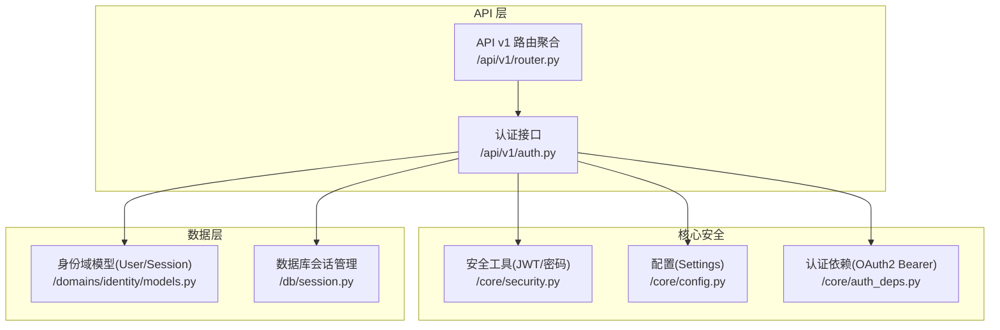
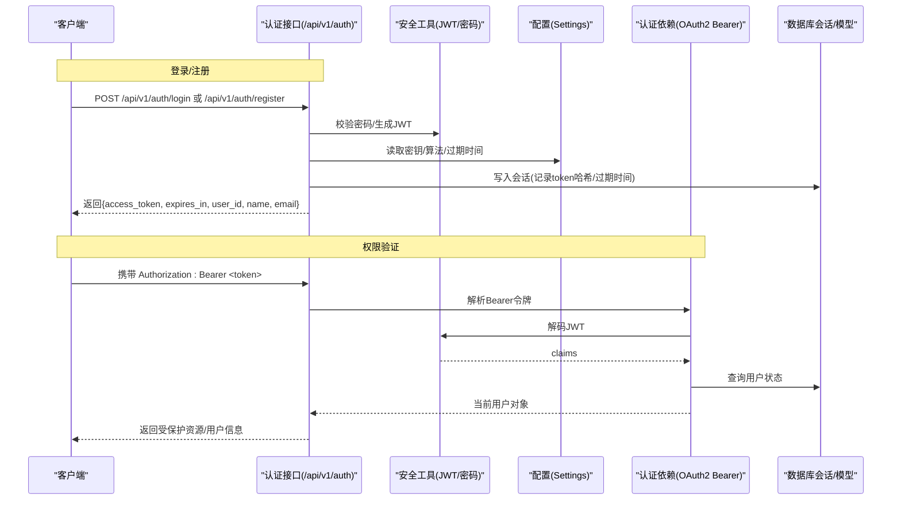
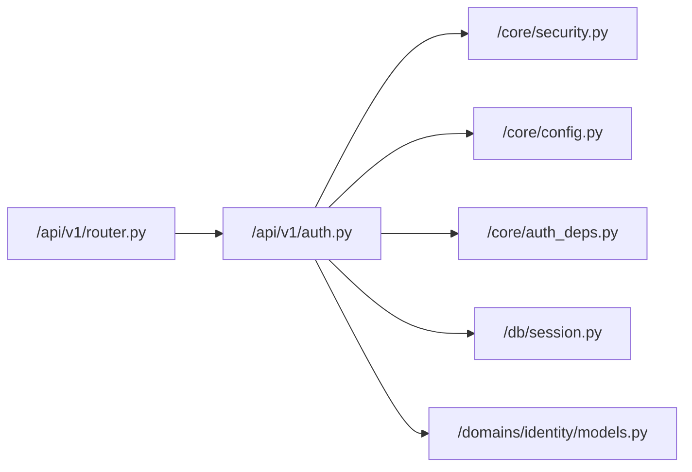
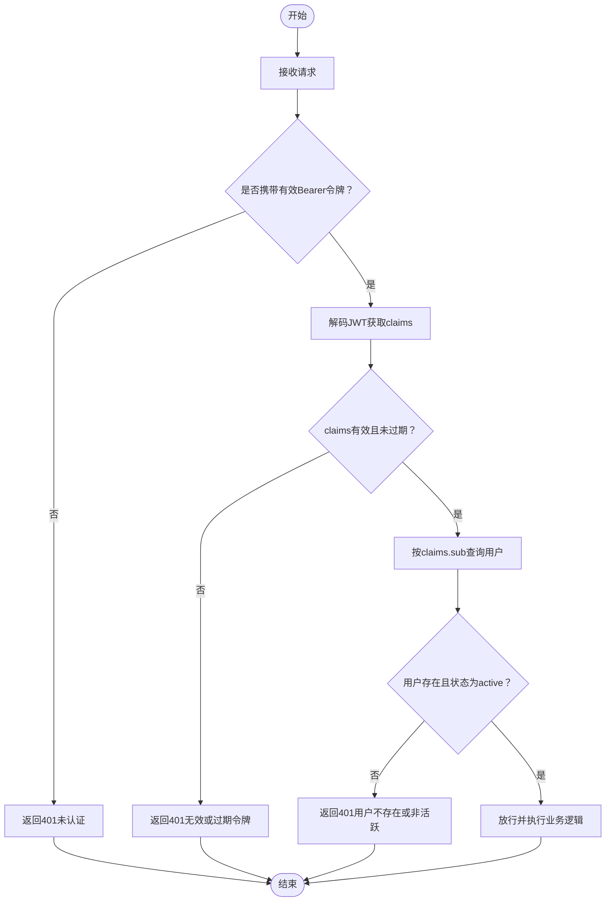

# 认证 API

<cite>
**本文引用的文件**
- [backend/app/api/v1/auth.py](file://backend/app/api/v1/auth.py)
- [backend/app/api/v1/router.py](file://backend/app/api/v1/router.py)
- [backend/app/core/auth_deps.py](file://backend/app/core/auth_deps.py)
- [backend/app/core/security.py](file://backend/app/core/security.py)
- [backend/app/core/config.py](file://backend/app/core/config.py)
- [backend/app/domains/identity/models.py](file://backend/app/domains/identity/models.py)
- [backend/app/db/session.py](file://backend/app/db/session.py)
</cite>

## 目录
1. [简介](#简介)
2. [项目结构](#项目结构)
3. [核心组件](#核心组件)
4. [架构总览](#架构总览)
5. [详细组件分析](#详细组件分析)
6. [依赖分析](#依赖分析)
7. [性能考量](#性能考量)
8. [故障排查指南](#故障排查指南)
9. [结论](#结论)
10. [附录](#附录)

## 简介
本文件为后端认证 API 的权威技术文档，覆盖用户登录、注册、令牌刷新、登出与当前用户查询等接口的完整规范。文档详细说明了基于 JWT 的令牌机制、会话管理策略、权限验证流程，并给出请求参数、响应格式、错误码定义与安全注意事项。同时提供认证流程示例、最佳实践与常见问题解决方案，涵盖多设备登录、自动登出、令牌过期处理等场景。

## 项目结构
认证相关能力由以下模块协同实现：
- 路由聚合：在 API v1 路由中挂载认证子路由
- 认证接口：提供登录、注册、刷新、登出、当前用户信息查询
- 安全工具：密码哈希、JWT 编解码、令牌过期时间配置
- 依赖注入：基于 OAuth2 Bearer 的认证依赖，支持强制与可选认证
- 数据模型：用户与会话表，用于持久化用户状态与令牌哈希
- 数据库会话：异步 SQLAlchemy 会话管理

图表来源
- [backend/app/api/v1/router.py:25](file://backend/app/api/v1/router.py#L25)
- [backend/app/api/v1/auth.py:1-194](file://backend/app/api/v1/auth.py#L1-L194)
- [backend/app/core/security.py:1-38](file://backend/app/core/security.py#L1-L38)
- [backend/app/core/config.py:48-67](file://backend/app/core/config.py#L48-L67)
- [backend/app/core/auth_deps.py:12-39](file://backend/app/core/auth_deps.py#L12-L39)
- [backend/app/domains/identity/models.py:19-60](file://backend/app/domains/identity/models.py#L19-L60)
- [backend/app/db/session.py:24-34](file://backend/app/db/session.py#L24-L34)

章节来源
- [backend/app/api/v1/router.py:25](file://backend/app/api/v1/router.py#L25)
- [backend/app/api/v1/auth.py:1-194](file://backend/app/api/v1/auth.py#L1-L194)
- [backend/app/core/security.py:1-38](file://backend/app/core/security.py#L1-L38)
- [backend/app/core/config.py:48-67](file://backend/app/core/config.py#L48-L67)
- [backend/app/core/auth_deps.py:12-39](file://backend/app/core/auth_deps.py#L12-L39)
- [backend/app/domains/identity/models.py:19-60](file://backend/app/domains/identity/models.py#L19-L60)
- [backend/app/db/session.py:24-34](file://backend/app/db/session.py#L24-L34)

## 核心组件
- 认证接口模块：提供登录、注册、刷新、登出、当前用户查询等端点
- 安全工具模块：封装密码哈希/校验、JWT 签发与解码
- 配置模块：集中管理密钥、算法与令牌有效期
- 认证依赖模块：基于 OAuth2 Bearer 的依赖注入，支持强制与可选认证
- 数据模型模块：用户与会话实体，支撑令牌持久化与会话追踪
- 数据库会话模块：异步会话生命周期管理

章节来源
- [backend/app/api/v1/auth.py:1-194](file://backend/app/api/v1/auth.py#L1-L194)
- [backend/app/core/security.py:1-38](file://backend/app/core/security.py#L1-L38)
- [backend/app/core/config.py:48-67](file://backend/app/core/config.py#L48-L67)
- [backend/app/core/auth_deps.py:12-39](file://backend/app/core/auth_deps.py#L12-L39)
- [backend/app/domains/identity/models.py:19-60](file://backend/app/domains/identity/models.py#L19-L60)
- [backend/app/db/session.py:24-34](file://backend/app/db/session.py#L24-L34)

## 架构总览
认证流程围绕“令牌签发—会话记录—权限验证”展开。用户通过用户名/密码或注册创建账户，服务端签发 JWT 并记录会话；后续请求携带 Bearer 令牌，依赖解析并校验令牌有效性与用户状态，最终返回受保护资源或用户信息。

图表来源
- [backend/app/api/v1/auth.py:47-89](file://backend/app/api/v1/auth.py#L47-L89)
- [backend/app/api/v1/auth.py:92-131](file://backend/app/api/v1/auth.py#L92-L131)
- [backend/app/api/v1/auth.py:134-169](file://backend/app/api/v1/auth.py#L134-L169)
- [backend/app/core/security.py:24-37](file://backend/app/core/security.py#L24-L37)
- [backend/app/core/config.py:64-67](file://backend/app/core/config.py#L64-L67)
- [backend/app/core/auth_deps.py:15-39](file://backend/app/core/auth_deps.py#L15-L39)
- [backend/app/domains/identity/models.py:51-60](file://backend/app/domains/identity/models.py#L51-L60)
- [backend/app/db/session.py:24-34](file://backend/app/db/session.py#L24-L34)

## 详细组件分析

### 认证接口（登录/注册/刷新/登出/当前用户）
- 接口路径与标签：/api/v1/auth（由路由聚合挂载）
- 支持的端点：
  - POST /api/v1/auth/login：邮箱+密码登录，返回访问令牌与用户信息
  - POST /api/v1/auth/register：注册新用户并返回访问令牌
  - POST /api/v1/auth/refresh：使用有效旧令牌换取新令牌
  - POST /api/v1/auth/logout：撤销指定令牌（删除会话记录）
  - GET /api/v1/auth/me：从 Bearer 令牌解析当前用户信息

- 请求与响应要点
  - 登录/注册
    - 请求体：OAuth2 密码模式（用户名即邮箱）、注册时包含姓名、邮箱、密码
    - 响应体：access_token、token_type、expires_in、user_id、name、email
  - 刷新
    - 请求体：包含 access_token 字段
    - 响应体：同上，但签发新的 access_token
  - 登出
    - 请求体：包含 access_token 字段
    - 响应体：{"status": "logged_out"}
  - 当前用户
    - 响应体：{"user_id", "email", "name", "status"}

- 错误码与语义
  - 400：请求参数无效（如密码强度不足等，视具体实现）
  - 401：未认证/无效或过期令牌/密码错误
  - 403：账户非激活状态
  - 409：注册邮箱已存在
  - 404：用户不存在
  - 500：服务器内部错误

- 安全与会话
  - 令牌签发：使用 HS256 算法与配置中的密钥，过期时间来自配置
  - 会话记录：每次签发都会在 sessions 表写入 token_hash 与过期时间
  - 登出：通过删除对应 token_hash 的会话记录实现撤销
  - 当前用户：依赖 OAuth2 Bearer，缺失或无效将返回 401

章节来源
- [backend/app/api/v1/auth.py:47-89](file://backend/app/api/v1/auth.py#L47-L89)
- [backend/app/api/v1/auth.py:92-131](file://backend/app/api/v1/auth.py#L92-L131)
- [backend/app/api/v1/auth.py:134-169](file://backend/app/api/v1/auth.py#L134-L169)
- [backend/app/api/v1/auth.py:172-182](file://backend/app/api/v1/auth.py#L172-L182)
- [backend/app/api/v1/auth.py:185-193](file://backend/app/api/v1/auth.py#L185-L193)
- [backend/app/api/v1/router.py:25](file://backend/app/api/v1/router.py#L25)

### 安全工具与配置
- 密码处理
  - 使用 pbkdf2_sha256 算法进行哈希与校验
- JWT 机制
  - 签发：合并载荷与过期时间，使用配置中的 secret_key 与 algorithm 进行编码
  - 解码：使用相同密钥与算法进行解码，异常则判定为无效或过期
- 配置项
  - secret_key：JWT 密钥
  - algorithm：签名算法（默认 HS256）
  - access_token_expire_minutes：令牌有效期（分钟）

章节来源
- [backend/app/core/security.py:14-37](file://backend/app/core/security.py#L14-L37)
- [backend/app/core/config.py:64-67](file://backend/app/core/config.py#L64-L67)

### 认证依赖（OAuth2 Bearer）
- 强制认证依赖
  - 若缺少令牌或令牌无效/过期，直接返回 401
  - 成功后根据 claims 中的 sub 查询用户，要求用户状态为 active
- 可选认证依赖
  - 若令牌缺失或无效则返回 None，适用于公开端点

章节来源
- [backend/app/core/auth_deps.py:12-39](file://backend/app/core/auth_deps.py#L12-L39)
- [backend/app/core/auth_deps.py:42-52](file://backend/app/core/auth_deps.py#L42-L52)

### 数据模型与会话管理
- 用户模型
  - 关键字段：email（唯一索引）、name、hashed_password、status、mfa_enabled、org_id
- 会话模型
  - 关键字段：user_id（索引）、token_hash（令牌哈希）、expires_at（字符串存储）、ip_address（可选）
- 会话记录策略
  - 每次签发令牌均写入一条会话记录，便于后续登出与审计

章节来源
- [backend/app/domains/identity/models.py:19-60](file://backend/app/domains/identity/models.py#L19-L60)

### 数据库会话管理
- 异步引擎与会话工厂：基于配置的数据库 URL 创建异步引擎
- 依赖函数：提供异步会话上下文，异常时回滚并关闭连接

章节来源
- [backend/app/db/session.py:14-34](file://backend/app/db/session.py#L14-L34)

## 依赖分析
认证模块的关键依赖关系如下：

图表来源
- [backend/app/api/v1/auth.py:1-194](file://backend/app/api/v1/auth.py#L1-L194)
- [backend/app/core/security.py:1-38](file://backend/app/core/security.py#L1-L38)
- [backend/app/core/config.py:48-67](file://backend/app/core/config.py#L48-L67)
- [backend/app/core/auth_deps.py:12-39](file://backend/app/core/auth_deps.py#L12-L39)
- [backend/app/domains/identity/models.py:19-60](file://backend/app/domains/identity/models.py#L19-L60)
- [backend/app/db/session.py:24-34](file://backend/app/db/session.py#L24-L34)
- [backend/app/api/v1/router.py:25](file://backend/app/api/v1/router.py#L25)

章节来源
- [backend/app/api/v1/auth.py:1-194](file://backend/app/api/v1/auth.py#L1-L194)
- [backend/app/core/security.py:1-38](file://backend/app/core/security.py#L1-L38)
- [backend/app/core/config.py:48-67](file://backend/app/core/config.py#L48-L67)
- [backend/app/core/auth_deps.py:12-39](file://backend/app/core/auth_deps.py#L12-L39)
- [backend/app/domains/identity/models.py:19-60](file://backend/app/domains/identity/models.py#L19-L60)
- [backend/app/db/session.py:24-34](file://backend/app/db/session.py#L24-L34)
- [backend/app/api/v1/router.py:25](file://backend/app/api/v1/router.py#L25)

## 性能考量
- 令牌签发与解码：HS256 算法开销极低，性能影响可忽略
- 数据库写入：每次登录/刷新均写入会话记录，建议对 sessions 表建立合适的索引（如 token_hash、user_id）
- 会话清理：可定期清理过期会话以减少冗余数据
- 并发与事务：使用异步会话避免阻塞，确保异常时正确回滚

## 故障排查指南
- 401 未认证
  - 检查 Authorization 头是否正确设置为 Bearer 令牌
  - 核对令牌是否过期或被撤销（会话记录是否仍存在）
- 401 无效或过期令牌
  - 确认密钥与算法配置一致
  - 检查系统时间与时区设置
- 403 账户非激活
  - 确认用户状态为 active
- 409 注册邮箱冲突
  - 提示用户更换邮箱或执行找回流程
- 404 用户不存在
  - 核对 claims.sub 是否匹配真实用户 ID
- 登出无效
  - 确认传入的 access_token 与 sessions 表中的 token_hash 匹配

章节来源
- [backend/app/api/v1/auth.py:57-64](file://backend/app/api/v1/auth.py#L57-L64)
- [backend/app/api/v1/auth.py:140-146](file://backend/app/api/v1/auth.py#L140-L146)
- [backend/app/core/auth_deps.py:20-38](file://backend/app/core/auth_deps.py#L20-L38)
- [backend/app/domains/identity/models.py:56-59](file://backend/app/domains/identity/models.py#L56-L59)

## 结论
本认证体系采用标准 JWT 与 OAuth2 Bearer 流程，结合会话记录实现令牌撤销与审计能力。通过统一的安全工具与配置中心，保证了跨环境的一致性与安全性。建议在生产环境中强化密钥管理、启用 HTTPS、限制令牌有效期并完善会话清理策略。

## 附录

### API 规范摘要
- 基础路径：/api/v1/auth
- 认证方式：Bearer JWT
- 默认令牌有效期：来自配置项 access_token_expire_minutes（分钟）
- 默认签名算法：HS256
- 默认密钥：来自配置项 secret_key

章节来源
- [backend/app/api/v1/router.py:25](file://backend/app/api/v1/router.py#L25)
- [backend/app/core/config.py:64-67](file://backend/app/core/config.py#L64-L67)

### 令牌机制与会话管理流程

图表来源
- [backend/app/core/auth_deps.py:15-39](file://backend/app/core/auth_deps.py#L15-L39)
- [backend/app/core/security.py:32-37](file://backend/app/core/security.py#L32-L37)