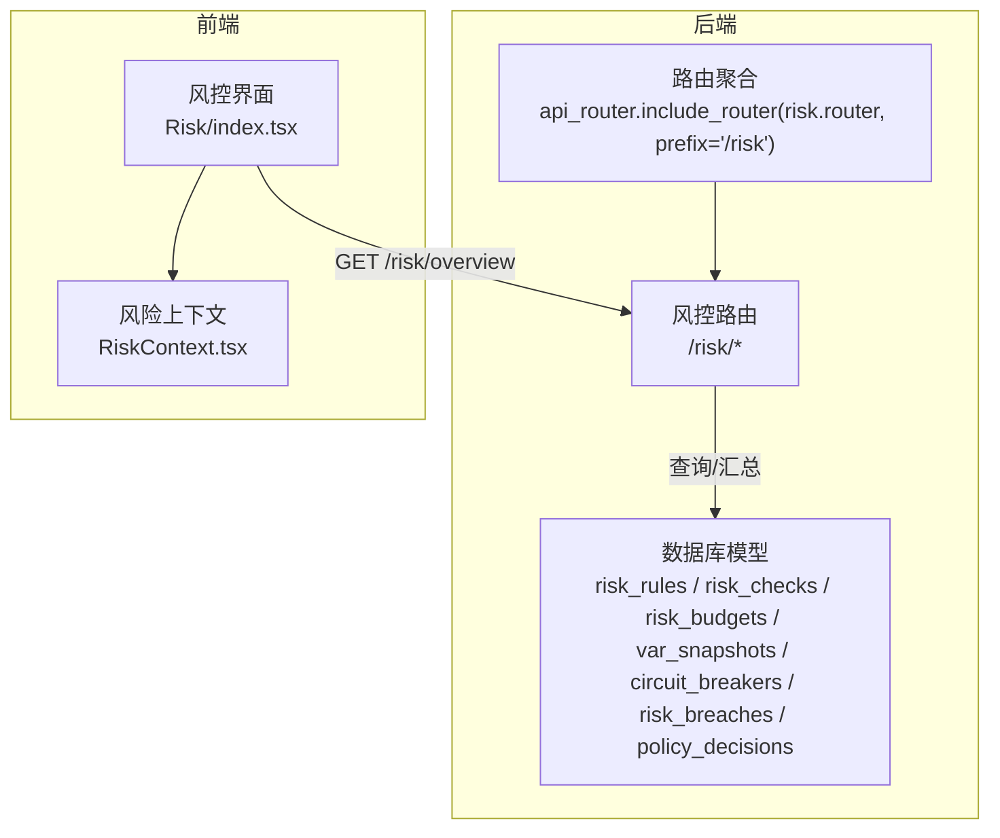
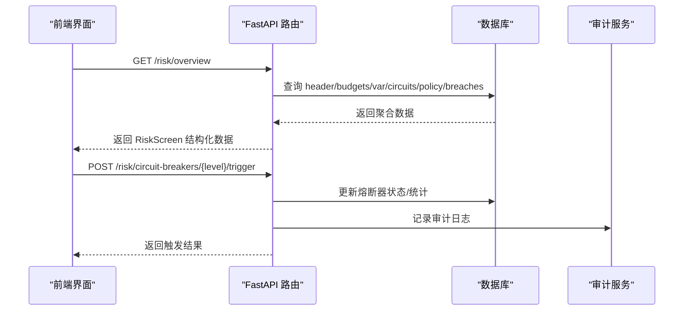
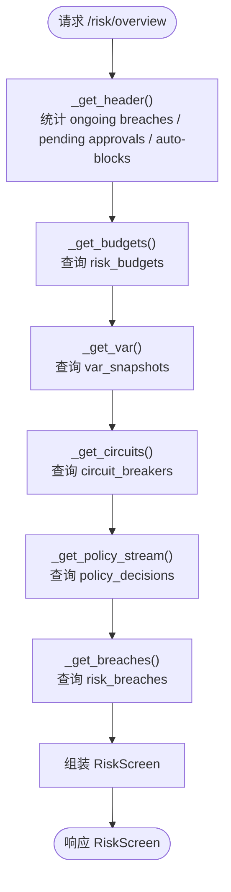
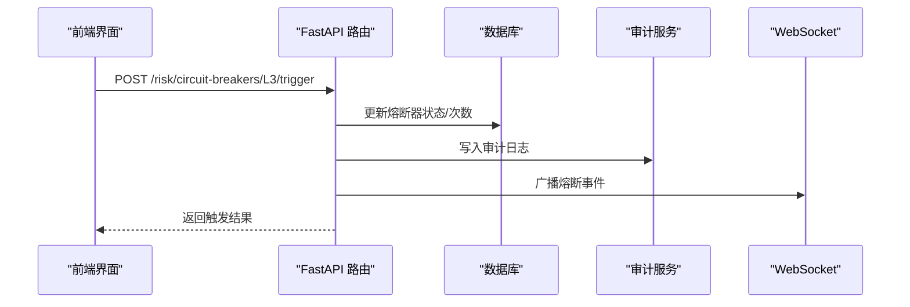
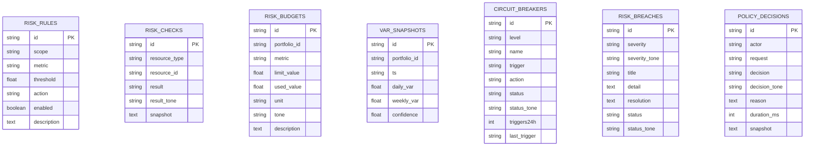
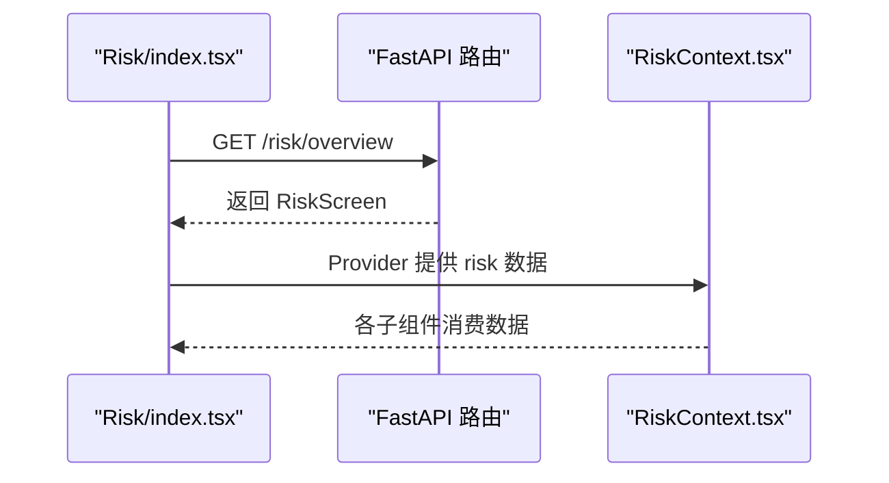
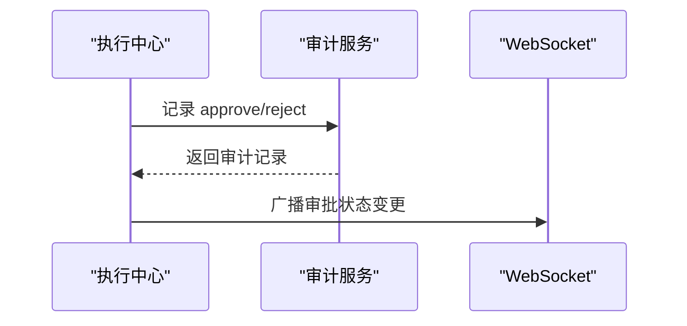
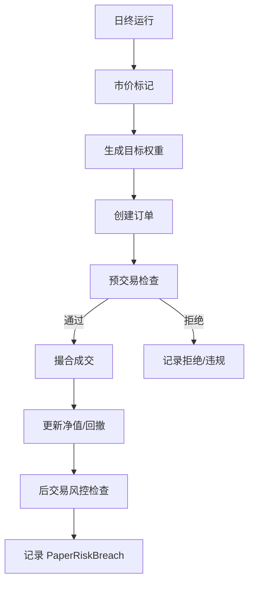
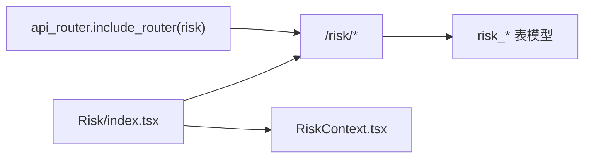

# 风控 API

<cite>
**本文引用的文件**
- [backend/app/api/v1/risk.py](file://backend/app/api/v1/risk.py)
- [backend/app/api/v1/router.py](file://backend/app/api/v1/router.py)
- [backend/app/domains/risk/models.py](file://backend/app/domains/risk/models.py)
- [backend/app/domains/risk/schemas.py](file://backend/app/domains/risk/schemas.py)
- [backend/app/services/paper_trading.py](file://backend/app/services/paper_trading.py)
- [backend/app/services/audit_service.py](file://backend/app/services/audit_service.py)
- [backend/app/api/v1/execution.py](file://backend/app/api/v1/execution.py)
- [backend/app/db/migrations/versions/20260513_000001_execution_risk_portfolio.py](file://backend/app/db/migrations/versions/20260513_000001_execution_risk_portfolio.py)
- [frontend/src/screens/Risk/index.tsx](file://frontend/src/screens/Risk/index.tsx)
- [frontend/src/contexts/RiskContext.tsx](file://frontend/src/contexts/RiskContext.tsx)
</cite>

## 目录
1. [简介](#简介)
2. [项目结构](#项目结构)
3. [核心组件](#核心组件)
4. [架构总览](#架构总览)
5. [详细组件分析](#详细组件分析)
6. [依赖分析](#依赖分析)
7. [性能考虑](#性能考虑)
8. [故障排查指南](#故障排查指南)
9. [结论](#结论)
10. [附录](#附录)

## 简介
本文件为风控 API 的全面文档，覆盖风控规则配置、实时监控、熔断管理、报警通知等接口规范，并结合账户级、组合级、策略级风控场景进行说明。文档同时阐述风控指标计算、阈值设置、自动化处理与人工干预流程，并提供策略配置示例与风险控制最佳实践。

## 项目结构
风控 API 位于后端 FastAPI 路由 v1 下，通过统一路由聚合器注册；前端通过 React 组件消费风控数据并展示。

**图表来源**
- [backend/app/api/v1/router.py:31](file://backend/app/api/v1/router.py#L31)
- [backend/app/api/v1/risk.py:28](file://backend/app/api/v1/risk.py#L28)

**章节来源**
- [backend/app/api/v1/router.py:1-40](file://backend/app/api/v1/router.py#L1-L40)
- [backend/app/api/v1/risk.py:1-273](file://backend/app/api/v1/risk.py#L1-L273)

## 核心组件
- 风控路由与接口：提供风控概览、熔断器触发/恢复等接口。
- 数据模型：风控规则、检查结果、预算、VaR 快照、熔断器、违规事件、策略决策等。
- 前端集成：通过上下文与页面组件消费风控数据。
- 审计与告警：审计服务记录操作链路，WebSocket 广播关键事件。
- 执行中心联动：预交易检查与风控联动，审批流与人工干预。

**章节来源**
- [backend/app/api/v1/risk.py:39-273](file://backend/app/api/v1/risk.py#L39-L273)
- [backend/app/domains/risk/models.py:1-101](file://backend/app/domains/risk/models.py#L1-L101)
- [backend/app/domains/risk/schemas.py:1-96](file://backend/app/domains/risk/schemas.py#L1-L96)
- [frontend/src/screens/Risk/index.tsx:17-44](file://frontend/src/screens/Risk/index.tsx#L17-L44)
- [frontend/src/contexts/RiskContext.tsx:1-13](file://frontend/src/contexts/RiskContext.tsx#L1-L13)

## 架构总览
风控 API 采用“路由 + 服务层 + 数据模型 + 前端组件”的分层架构。后端通过异步数据库会话访问风控相关表，聚合生成风控概览视图；前端通过上下文提供数据，组件按需渲染。

**图表来源**
- [backend/app/api/v1/risk.py:188-273](file://backend/app/api/v1/risk.py#L188-L273)
- [backend/app/services/audit_service.py:32-81](file://backend/app/services/audit_service.py#L32-L81)

## 详细组件分析

### 风控概览接口
- 接口路径：GET /risk/overview
- 功能：返回风控仪表板所需全部数据，包括健康度、KPI、预算、VaR、熔断器、策略决策流、违规历史。
- 数据来源：多表聚合（违规数、待审批数、自动拒绝数、预算、VaR、熔断器、策略决策、违规事件）。
- 输出模型：RiskScreen（包含 header、kpis、budgets、var、circuits、policyStream、breaches）。

**图表来源**
- [backend/app/api/v1/risk.py:39-207](file://backend/app/api/v1/risk.py#L39-L207)

**章节来源**
- [backend/app/api/v1/risk.py:188-207](file://backend/app/api/v1/risk.py#L188-L207)
- [backend/app/domains/risk/schemas.py:88-96](file://backend/app/domains/risk/schemas.py#L88-L96)

### 熔断管理接口
- 触发熔断：POST /risk/circuit-breakers/{level}/trigger
  - 将指定级别的熔断器置为“触发”，更新 24 小时触发次数，并写入审计日志与 WebSocket 广播。
- 恢复申请：POST /risk/circuit-breakers/{level}/recover
  - 若非“已武装”状态则置为“冷却”，写入审计日志与广播。

**图表来源**
- [backend/app/api/v1/risk.py:210-239](file://backend/app/api/v1/risk.py#L210-L239)
- [backend/app/api/v1/risk.py:242-272](file://backend/app/api/v1/risk.py#L242-L272)

**章节来源**
- [backend/app/api/v1/risk.py:210-272](file://backend/app/api/v1/risk.py#L210-L272)

### 风控规则与检查（模型）
- 风控规则：支持账户/组合/策略/订单维度，指标类型包括最大回撤、日损失、持仓限额、VaR 等，动作可为提醒、阻断、紧急开关。
- 风控检查：记录资源级检查结果（通过/观察/失败），支持快照 JSON。
- 风控预算：组合级预算分配与使用，含单位与状态色。
- VaR 快照：日/周 VaR 及置信度。
- 熔断器：分级（L1-L4）、触发条件、动作、状态与统计。
- 违规事件：严重级别、标题、详情、处置建议、状态与颜色。
- 策略决策：策略引擎决策流，含原因、耗时等。

**图表来源**
- [backend/app/domains/risk/models.py:9-101](file://backend/app/domains/risk/models.py#L9-L101)
- [backend/app/db/migrations/versions/20260513_000001_execution_risk_portfolio.py:127-203](file://backend/app/db/migrations/versions/20260513_000001_execution_risk_portfolio.py#L127-L203)

**章节来源**
- [backend/app/domains/risk/models.py:1-101](file://backend/app/domains/risk/models.py#L1-L101)
- [backend/app/db/migrations/versions/20260513_000001_execution_risk_portfolio.py:127-203](file://backend/app/db/migrations/versions/20260513_000001_execution_risk_portfolio.py#L127-L203)

### 前端集成与数据结构
- 前端通过 Risk/index.tsx 调用 /risk/overview 获取 RiskScreen 数据，并通过 RiskContext.tsx 提供上下文。
- 前端组件包括：风险预算矩阵、VaR 面板、熔断器面板、策略决策流、违规历史等。

**图表来源**
- [frontend/src/screens/Risk/index.tsx:17-44](file://frontend/src/screens/Risk/index.tsx#L17-L44)
- [frontend/src/contexts/RiskContext.tsx:1-13](file://frontend/src/contexts/RiskContext.tsx#L1-L13)

**章节来源**
- [frontend/src/screens/Risk/index.tsx:17-44](file://frontend/src/screens/Risk/index.tsx#L17-L44)
- [frontend/src/contexts/RiskContext.tsx:1-13](file://frontend/src/contexts/RiskContext.tsx#L1-L13)

### 执行中心与风控联动
- 预交易检查：执行中心提供静态的预交易检查清单（如个股集中度、行业集中度、单日亏损、净敞口、VaR 限额等），用于人工或自动化决策。
- 审批与审计：审批通过/拒绝会写入审计日志并通过 WebSocket 广播。

**图表来源**
- [backend/app/api/v1/execution.py:223-280](file://backend/app/api/v1/execution.py#L223-L280)
- [backend/app/services/audit_service.py:32-81](file://backend/app/services/audit_service.py#L32-L81)

**章节来源**
- [backend/app/api/v1/execution.py:43-70](file://backend/app/api/v1/execution.py#L43-L70)
- [backend/app/api/v1/execution.py:223-280](file://backend/app/api/v1/execution.py#L223-L280)

### 纸牌交易中的风控应用
- 日终引擎在执行信号、下单、成交后进行风控检查，如单日亏损超限、最大回撤超限等，形成 PaperRiskBreach。
- 引擎还执行预交易检查（如个股集中度、现金留存），对不合规订单直接拒绝。

**图表来源**
- [backend/app/services/paper_trading.py:82-134](file://backend/app/services/paper_trading.py#L82-L134)
- [backend/app/services/paper_trading.py:314-372](file://backend/app/services/paper_trading.py#L314-L372)
- [backend/app/services/paper_trading.py:536-577](file://backend/app/services/paper_trading.py#L536-L577)

**章节来源**
- [backend/app/services/paper_trading.py:82-134](file://backend/app/services/paper_trading.py#L82-L134)
- [backend/app/services/paper_trading.py:314-372](file://backend/app/services/paper_trading.py#L314-L372)
- [backend/app/services/paper_trading.py:536-577](file://backend/app/services/paper_trading.py#L536-L577)

## 依赖分析
- 路由聚合：/risk 前缀由 api_router.include_router 注册。
- 数据模型：风控相关实体分布在 risk_rules、risk_checks、risk_budgets、var_snapshots、circuit_breakers、risk_breaches、policy_decisions。
- 前端依赖：Risk/index.tsx 依赖 api.risk.overview，RiskContext.tsx 提供上下文。

**图表来源**
- [backend/app/api/v1/router.py:31](file://backend/app/api/v1/router.py#L31)
- [backend/app/api/v1/risk.py:28](file://backend/app/api/v1/risk.py#L28)

**章节来源**
- [backend/app/api/v1/router.py:25-31](file://backend/app/api/v1/router.py#L25-L31)
- [backend/app/api/v1/risk.py:28](file://backend/app/api/v1/risk.py#L28)

## 性能考虑
- 分页与限制：概览接口中对预算、VaR、策略决策、违规历史等查询设置了数量限制，避免一次性返回过多数据。
- 时间索引：熔断器按 level 建索引，预算按 portfolio_id 建索引，有助于查询性能。
- 异步数据库：使用异步会话减少阻塞。
- 建议：对高频查询增加缓存层（如 Redis）存储最近一次概览结果，降低数据库压力；对审计链验证仅在必要时执行。

## 故障排查指南
- 熔断器不存在：触发/恢复接口若指定 level 未找到，返回 404。
- 状态冲突：恢复接口若当前状态已是“已武装”，返回 409。
- 审计链验证：审计服务提供 verify_chain，可用于校验链式完整性。
- 前端加载失败：确认 /risk/overview 是否可达，检查网络与权限。

**章节来源**
- [backend/app/api/v1/risk.py:218-219](file://backend/app/api/v1/risk.py#L218-L219)
- [backend/app/api/v1/risk.py:252-253](file://backend/app/api/v1/risk.py#L252-L253)
- [backend/app/services/audit_service.py:83-108](file://backend/app/services/audit_service.py#L83-L108)

## 结论
风控 API 通过统一的概览接口整合多源风控数据，配合熔断器管理与审计链路，实现了从自动化到人工干预的闭环。结合执行中心的预交易检查与纸牌交易中的风控落地，形成覆盖账户、组合与策略的多层次风控体系。

## 附录

### 接口清单与规范

- GET /risk/overview
  - 请求参数：无
  - 响应：RiskScreen
  - 用途：风控仪表板全量数据

- POST /risk/circuit-breakers/{level}/trigger
  - 路径参数：level（L1-L4）
  - 响应：触发状态
  - 用途：人工触发熔断器，写审计日志并广播

- POST /risk/circuit-breakers/{level}/recover
  - 路径参数：level（L1-L4）
  - 响应：恢复请求状态
  - 用途：申请恢复熔断器

**章节来源**
- [backend/app/api/v1/risk.py:188-273](file://backend/app/api/v1/risk.py#L188-L273)

### 风控指标与阈值设置
- 指标类型：最大回撤、日损失、个股集中度、行业集中度、净敞口、VaR 等。
- 阈值设置：通过 risk_rules 中的 threshold 字段配置；不同 scope（账户/组合/策略/订单）可分别设定。
- 动作策略：alert（提醒）、block（阻断）、kill_switch（紧急开关）。

**章节来源**
- [backend/app/domains/risk/models.py:9-19](file://backend/app/domains/risk/models.py#L9-L19)
- [backend/app/api/v1/execution.py:43-49](file://backend/app/api/v1/execution.py#L43-L49)

### 自动化处理与人工干预流程
- 自动化：策略引擎与日终引擎在下单前后执行风控检查，自动拒绝不合规订单并记录违规事件。
- 人工干预：执行中心审批流支持批准/拒绝；熔断器可由人工触发/恢复；审计链保证可追溯性。

**章节来源**
- [backend/app/services/paper_trading.py:314-372](file://backend/app/services/paper_trading.py#L314-L372)
- [backend/app/api/v1/execution.py:223-280](file://backend/app/api/v1/execution.py#L223-L280)
- [backend/app/api/v1/risk.py:210-272](file://backend/app/api/v1/risk.py#L210-L272)
- [backend/app/services/audit_service.py:32-81](file://backend/app/services/audit_service.py#L32-L81)

### 风控策略配置示例与最佳实践
- 示例：为账户设置“单日亏损限额”规则，阈值为 5%，动作设为 block；为组合设置 VaR 限额，阈值为 2%，动作设为 alert。
- 最佳实践：
  - 分层配置：先在账户级设置基础阈值，再在组合/策略级细化。
  - 动态调整：根据市场波动率调整 VaR 置信度与窗口。
  - 审计留痕：所有人工干预必须通过审计服务记录。
  - 实时监控：利用 WebSocket 广播关键事件，前端及时响应。