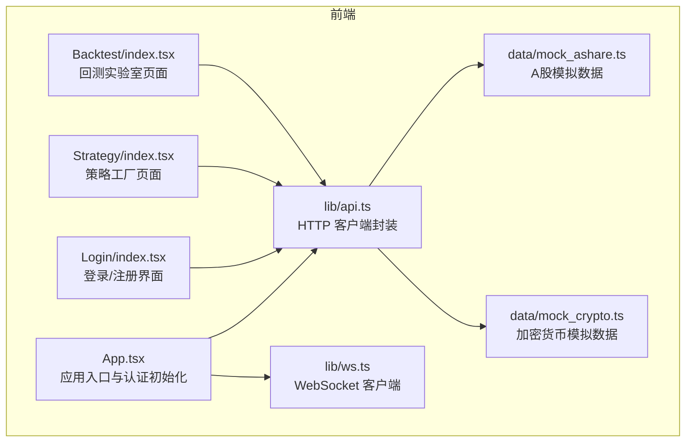
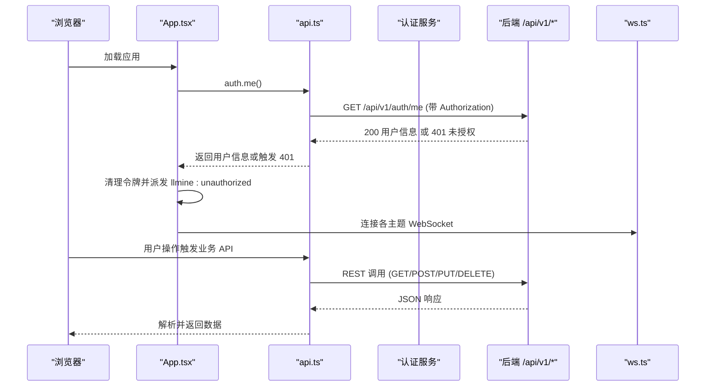
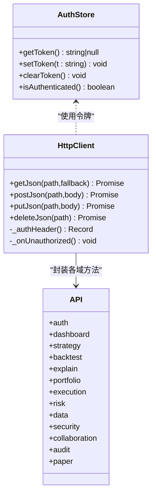
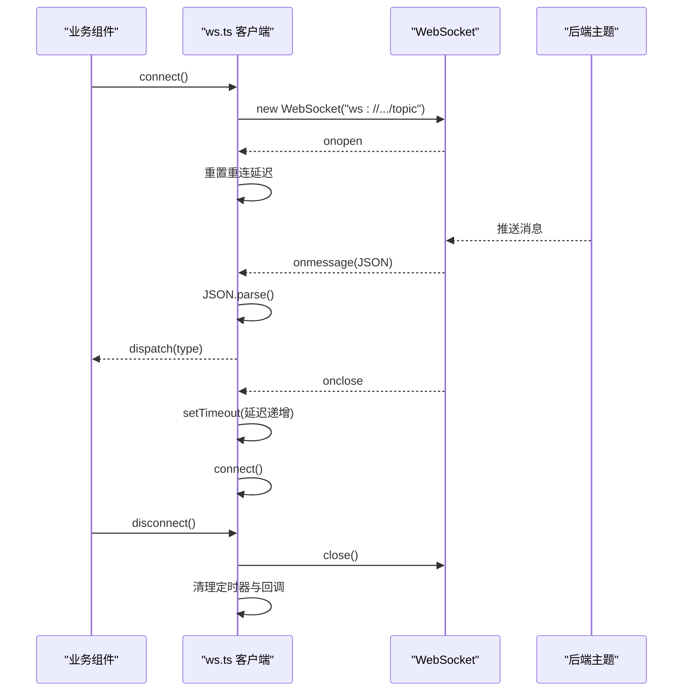
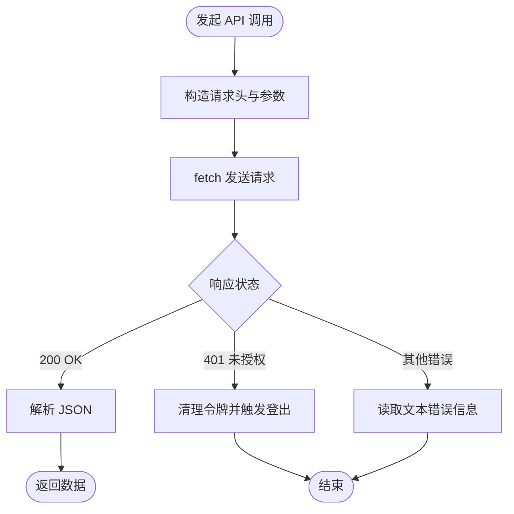
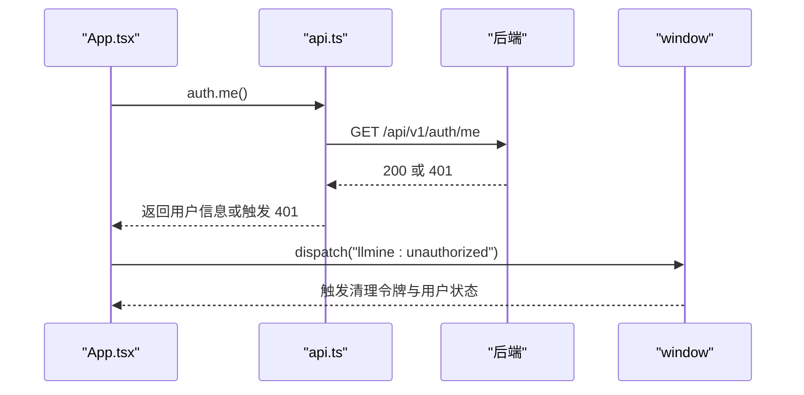
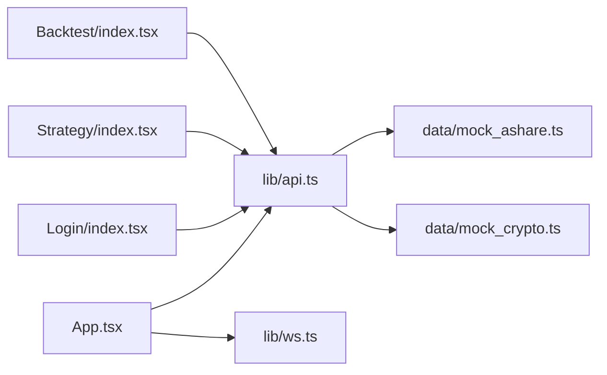

# API 集成层

<cite>
**本文档引用的文件**
- [api.ts](file://frontend/src/lib/api.ts)
- [ws.ts](file://frontend/src/lib/ws.ts)
- [App.tsx](file://frontend/src/App.tsx)
- [Login/index.tsx](file://frontend/src/screens/Login/index.tsx)
- [Strategy/index.tsx](file://frontend/src/screens/Strategy/index.tsx)
- [Backtest/index.tsx](file://frontend/src/screens/Backtest/index.tsx)
- [mock_ashare.ts](file://frontend/src/data/mock_ashare.ts)
- [mock_crypto.ts](file://frontend/src/data/mock_crypto.ts)
</cite>

## 目录
1. [简介](#简介)
2. [项目结构](#项目结构)
3. [核心组件](#核心组件)
4. [架构总览](#架构总览)
5. [详细组件分析](#详细组件分析)
6. [依赖关系分析](#依赖关系分析)
7. [性能考虑](#性能考虑)
8. [故障排查指南](#故障排查指南)
9. [结论](#结论)
10. [附录](#附录)

## 简介
本文件面向 llmine-quant 前端的 API 集成层，系统性解析 api.ts 中的 HTTP 客户端封装、认证机制与错误处理策略；详解 WebSocket 连接管理、实时数据流处理与连接状态维护；阐述 RESTful API 调用模式、请求/响应处理与重试机制；并给出 API 版本管理、缓存策略与性能优化方案。同时提供具体 API 调用示例、错误处理代码路径与最佳实践，帮助开发者理解并扩展前端与后端的通信机制。

## 项目结构
API 集成层位于前端工程的 lib 目录，核心文件包括：
- api.ts：统一的 HTTP 客户端封装与业务域 API 方法集合
- ws.ts：WebSocket 客户端工厂与主题订阅管理
- App.tsx：应用入口，负责认证状态初始化与 WebSocket 生命周期
- 各业务页面组件：Strategy、Backtest 等通过 api.ts 调用后端接口
- mock_*：用于演示与开发的本地数据模拟

图表来源
- [App.tsx:1-299](file://frontend/src/App.tsx#L1-L299)
- [api.ts:1-778](file://frontend/src/lib/api.ts#L1-L778)
- [ws.ts:1-95](file://frontend/src/lib/ws.ts#L1-L95)
- [mock_ashare.ts:1-800](file://frontend/src/data/mock_ashare.ts#L1-L800)
- [mock_crypto.ts:1-800](file://frontend/src/data/mock_crypto.ts#L1-L800)

章节来源
- [api.ts:1-778](file://frontend/src/lib/api.ts#L1-L778)
- [ws.ts:1-95](file://frontend/src/lib/ws.ts#L1-L95)
- [App.tsx:1-299](file://frontend/src/App.tsx#L1-L299)

## 核心组件
- HTTP 客户端封装
  - 基础前缀与认证：统一前缀 /api/v1，基于本地存储的令牌管理
  - 请求方法：getJson/postJson/putJson/deleteJson，统一处理 401 未授权与通用错误
  - 业务域 API：auth/dashboard/strategy/backtest/explain/portfolio/execution/risk/data/security/collaboration/audit/paper
- 认证机制
  - 令牌存储：localStorage 键名固定，支持设置、清除与检查
  - 授权头：自动附加 Authorization: Bearer <token>
  - 未授权处理：收到 401 时清理令牌并派发自定义事件
- WebSocket 客户端
  - 主题订阅：按主题创建独立客户端（strategy-events/execution-events/risk-events）
  - 自动重连：指数退避，最大延迟限制
  - 事件分发：按消息类型分发给对应处理器集合
- 错误处理策略
  - HTTP 错误：捕获网络异常与非 OK 状态，返回兜底数据或抛出错误
  - 401 未授权：清理令牌并触发全局登出流程
  - 业务错误：后端返回文本错误信息，前端显示用户可读提示

章节来源
- [api.ts:4-21](file://frontend/src/lib/api.ts#L4-L21)
- [api.ts:23-43](file://frontend/src/lib/api.ts#L23-L43)
- [api.ts:45-83](file://frontend/src/lib/api.ts#L45-L83)
- [api.ts:513-777](file://frontend/src/lib/api.ts#L513-L777)
- [ws.ts:27-89](file://frontend/src/lib/ws.ts#L27-L89)

## 架构总览
前端通过 api.ts 与后端 REST API 通信，通过 ws.ts 与后端 WebSocket 主题建立实时连接。认证状态由 App.tsx 初始化并监听 401 事件，实现全局登出与令牌清理。

图表来源
- [App.tsx:55-96](file://frontend/src/App.tsx#L55-L96)
- [api.ts:513-548](file://frontend/src/lib/api.ts#L513-L548)
- [ws.ts:91-95](file://frontend/src/lib/ws.ts#L91-L95)

## 详细组件分析

### HTTP 客户端封装与认证机制
- 基础配置
  - API 前缀：/api/v1
  - 令牌键名：llmine_token
  - 认证头：Authorization: Bearer <token>（若存在）
- 请求方法
  - getJson：GET 请求，401 时清理令牌并返回 fallback
  - postJson/putJson：POST/PUT 请求，401 时清理令牌并抛出错误
  - deleteJson：DELETE 请求，401 时清理令牌并抛出错误
- 认证流程
  - 登录/注册成功后写入 localStorage
  - 应用启动时调用 /auth/me 校验令牌有效性
  - 401 事件监听器触发全局登出与令牌清理
- 业务域 API
  - auth：登录、注册、注销、刷新、当前用户
  - dashboard：系统概览
  - strategy：策略列表、任务、模板、事件、详情、更新、删除、可回测策略
  - backtest：回测、Walk-Forward、敏感性、过拟合、交易、报告、任务列表、股票池建议
  - explain/portfolio/execution/risk/data/security/collaboration/audit/paper：对应领域接口

图表来源
- [api.ts:10-21](file://frontend/src/lib/api.ts#L10-L21)
- [api.ts:23-43](file://frontend/src/lib/api.ts#L23-L43)
- [api.ts:45-83](file://frontend/src/lib/api.ts#L45-L83)
- [api.ts:513-777](file://frontend/src/lib/api.ts#L513-L777)

章节来源
- [api.ts:4-21](file://frontend/src/lib/api.ts#L4-L21)
- [api.ts:23-83](file://frontend/src/lib/api.ts#L23-L83)
- [api.ts:513-777](file://frontend/src/lib/api.ts#L513-L777)

### WebSocket 连接管理与实时数据流
- 连接基址：根据当前协议与主机动态生成 ws/wss 地址
- 主题客户端：按主题创建独立实例，支持多主题并行
- 事件分发：消息类型字段缺失时回退到 __all__ 与 * 通配符
- 自动重连：指数退避，最大延迟 30 秒，避免频繁重试
- 生命周期：connect/on/disconnect/isConnected，支持组件卸载时清理

图表来源
- [ws.ts:21-25](file://frontend/src/lib/ws.ts#L21-L25)
- [ws.ts:40-68](file://frontend/src/lib/ws.ts#L40-L68)
- [ws.ts:77-88](file://frontend/src/lib/ws.ts#L77-L88)

章节来源
- [ws.ts:1-95](file://frontend/src/lib/ws.ts#L1-L95)

### RESTful API 调用模式与错误处理
- 调用模式
  - 统一前缀：/api/v1
  - 方法封装：GET/POST/PUT/DELETE 对应 getJson/postJson/putJson/deleteJson
  - 参数传递：查询参数拼装与 JSON 请求体
- 错误处理
  - 401 未授权：清理令牌并触发全局登出
  - 非 OK 状态：读取响应文本作为错误信息
  - 网络异常：捕获并返回 fallback 或抛出错误
- 业务示例
  - 登录/注册：调用 api.auth.login/register，成功后设置令牌
  - 获取策略列表：api.strategy.overview
  - 运行回测：api.backtest.runReal/buildPayload

图表来源
- [api.ts:32-43](file://frontend/src/lib/api.ts#L32-L43)
- [api.ts:45-57](file://frontend/src/lib/api.ts#L45-L57)
- [api.ts:59-83](file://frontend/src/lib/api.ts#L59-L83)

章节来源
- [api.ts:32-83](file://frontend/src/lib/api.ts#L32-L83)

### 认证流程与全局登出
- 应用启动时尝试调用 /auth/me 校验令牌
- 若返回 401，清理令牌并派发自定义事件
- 监听事件的副作用清理用户状态与令牌
- 登录页成功后设置令牌并进入主界面

图表来源
- [App.tsx:55-74](file://frontend/src/App.tsx#L55-L74)
- [api.ts:544-547](file://frontend/src/lib/api.ts#L544-L547)

章节来源
- [App.tsx:55-74](file://frontend/src/App.tsx#L55-L74)
- [api.ts:544-547](file://frontend/src/lib/api.ts#L544-L547)

### 业务域 API 使用示例
- 策略工厂页面
  - 刷新策略概览：api.strategy.overview
  - 创建策略任务：api.strategy.createTask
  - 获取策略事件：api.strategy.events
- 回测实验室页面
  - 获取可回测策略：api.strategy.backtestReady
  - 获取股票池：api.data.symbols
  - 运行回测：api.backtest.runReal
  - Walk-Forward：api.backtest.walkForward
  - 敏感性扫描：api.backtest.sensitivity
  - 过拟合评估：api.backtest.overfit
  - 交易明细：api.backtest.trades
  - 报告：api.backtest.report
  - 任务列表：api.backtest.list
  - 股票池建议：api.backtest.suggestUniverse

章节来源
- [Strategy/index.tsx:38-46](file://frontend/src/screens/Strategy/index.tsx#L38-L46)
- [Backtest/index.tsx:169-198](file://frontend/src/screens/Backtest/index.tsx#L169-L198)
- [Backtest/index.tsx:268-309](file://frontend/src/screens/Backtest/index.tsx#L268-L309)
- [Backtest/index.tsx:230-239](file://frontend/src/screens/Backtest/index.tsx#L230-L239)
- [api.ts:614-666](file://frontend/src/lib/api.ts#L614-L666)

## 依赖关系分析
- 组件耦合
  - App.tsx 依赖 api.ts 与 ws.ts，负责认证初始化与 WebSocket 生命周期
  - 业务页面组件依赖 api.ts 提供的各域方法
  - 登录组件依赖 api.auth.* 完成认证流程
- 外部依赖
  - fetch：浏览器原生 HTTP 客户端
  - localStorage：持久化令牌
  - WebSocket：实时通信
- 潜在循环依赖
  - 当前结构清晰，无明显循环依赖

图表来源
- [App.tsx:1-299](file://frontend/src/App.tsx#L1-L299)
- [api.ts:1-778](file://frontend/src/lib/api.ts#L1-L778)
- [ws.ts:1-95](file://frontend/src/lib/ws.ts#L1-L95)
- [mock_ashare.ts:1-800](file://frontend/src/data/mock_ashare.ts#L1-L800)
- [mock_crypto.ts:1-800](file://frontend/src/data/mock_crypto.ts#L1-L800)

章节来源
- [App.tsx:1-299](file://frontend/src/App.tsx#L1-L299)
- [api.ts:1-778](file://frontend/src/lib/api.ts#L1-L778)
- [ws.ts:1-95](file://frontend/src/lib/ws.ts#L1-L95)

## 性能考虑
- 请求合并与节流
  - 对高频查询（如股票池建议）可引入防抖/节流，减少不必要的请求
- 缓存策略
  - 本地缓存：对不频繁变化的数据（如策略模板、系统概览）可短期缓存
  - 会话缓存：利用 localStorage 存储令牌与用户信息，减少重复登录
- 重试机制
  - 对瞬时网络错误可引入指数退避重试，但需限制次数与总时长
- WebSocket 优化
  - 合理的主题粒度，避免过多主题导致连接数膨胀
  - 消息压缩与批量推送（若后端支持）

## 故障排查指南
- 401 未授权
  - 现象：页面提示“未授权”或自动登出
  - 处理：检查令牌是否过期或被后端吊销；确认 _onUnauthorized 是否被触发
  - 参考路径：[api.ts:27-30](file://frontend/src/lib/api.ts#L27-L30)，[App.tsx:69-74](file://frontend/src/App.tsx#L69-L74)
- 网络异常
  - 现象：请求失败，错误信息来自响应文本
  - 处理：检查网络连通性与 CORS 配置；必要时增加重试
  - 参考路径：[api.ts:45-57](file://frontend/src/lib/api.ts#L45-L57)，[api.ts:59-83](file://frontend/src/lib/api.ts#L59-L83)
- WebSocket 断线重连
  - 现象：实时数据中断
  - 处理：确认自动重连逻辑是否生效；检查后端 ws 地址与协议
  - 参考路径：[ws.ts:40-68](file://frontend/src/lib/ws.ts#L40-L68)，[ws.ts:91-95](file://frontend/src/lib/ws.ts#L91-L95)
- 登录/注册失败
  - 现象：表单提示错误信息
  - 处理：检查后端返回的错误码与消息；对特定错误（如 409 冲突）给出明确提示
  - 参考路径：[Login/index.tsx:33-62](file://frontend/src/screens/Login/index.tsx#L33-L62)

章节来源
- [api.ts:27-30](file://frontend/src/lib/api.ts#L27-L30)
- [api.ts:45-83](file://frontend/src/lib/api.ts#L45-L83)
- [ws.ts:40-68](file://frontend/src/lib/ws.ts#L40-L68)
- [Login/index.tsx:33-62](file://frontend/src/screens/Login/index.tsx#L33-L62)

## 结论
本集成层以简洁的 HTTP 客户端封装与强健的认证/错误处理为核心，结合 WebSocket 实现实时数据流。通过统一的 API 前缀与令牌管理，实现了前后端通信的一致性与可维护性。建议在实际生产环境中进一步完善缓存与重试策略，并对 WebSocket 的主题粒度与消息处理进行性能优化。

## 附录
- API 版本管理
  - 前缀 /api/v1 明确版本号，便于后续升级与兼容
- 最佳实践
  - 统一使用 api.ts 的方法封装，避免直接手写 fetch
  - 对关键业务（如回测）增加加载态与错误提示
  - WebSocket 主题按功能划分，避免过度耦合