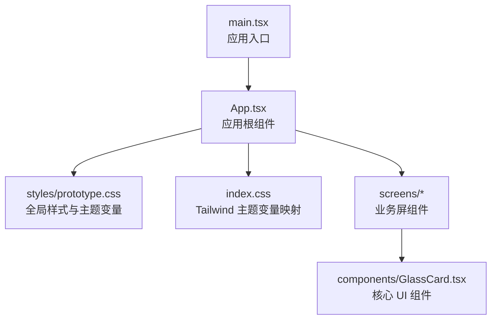
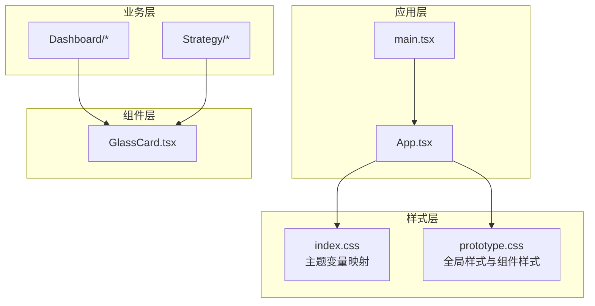
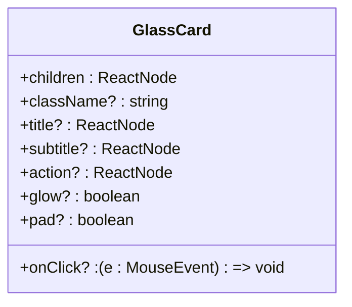
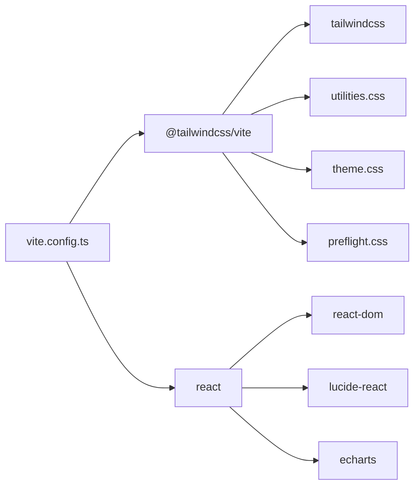

# UI 设计系统

<cite>
**本文引用的文件**
- [GlassCard.tsx](file://frontend/src/components/GlassCard.tsx)
- [prototype.css](file://frontend/src/styles/prototype.css)
- [index.css](file://frontend/src/index.css)
- [package.json](file://frontend/package.json)
- [vite.config.ts](file://frontend/vite.config.ts)
- [App.tsx](file://frontend/src/App.tsx)
- [main.tsx](file://frontend/src/main.tsx)
- [Dashboard/index.tsx](file://frontend/src/screens/Dashboard/index.tsx)
- [Strategy/index.tsx](file://frontend/src/screens/Strategy/index.tsx)
- [Dashboard/AgentMatrix.tsx](file://frontend/src/screens/Dashboard/AgentMatrix.tsx)
- [Strategy/StrategyMatrix.tsx](file://frontend/src/screens/Strategy/StrategyMatrix.tsx)
</cite>

## 目录
1. [简介](#简介)
2. [项目结构](#项目结构)
3. [核心组件](#核心组件)
4. [架构总览](#架构总览)
5. [详细组件分析](#详细组件分析)
6. [依赖分析](#依赖分析)
7. [性能考量](#性能考量)
8. [故障排查指南](#故障排查指南)
9. [结论](#结论)
10. [附录](#附录)

## 简介
本设计文档面向 llmine-quant 前端 UI 设计系统，聚焦于基于 Tailwind CSS 的样式架构、主题系统设计理念、组件库开发规范与可维护性。文档以 GlassCard 为核心组件，系统阐述其设计原理、样式定制与响应式布局实现；同时总结颜色系统、字体规范、间距标准与动画效果的设计规范，并覆盖移动端适配、无障碍访问支持与浏览器兼容性处理。最后提供组件使用示例、样式定制指南与设计最佳实践，帮助开发者构建一致且可维护的用户界面。

## 项目结构
前端采用 React + Vite + Tailwind CSS 4 架构，通过 @tailwindcss/vite 插件在构建时注入 Tailwind 工具类与预设样式。主入口引入自定义主题与原型样式，应用容器负责布局与导航，各业务屏组件按功能域组织并复用统一的 UI 规范。

图表来源
- [main.tsx:1-12](file://frontend/src/main.tsx#L1-L12)
- [App.tsx:181-297](file://frontend/src/App.tsx#L181-L297)
- [prototype.css:1-800](file://frontend/src/styles/prototype.css#L1-L800)
- [index.css:1-24](file://frontend/src/index.css#L1-L24)

章节来源
- [main.tsx:1-12](file://frontend/src/main.tsx#L1-L12)
- [App.tsx:42-299](file://frontend/src/App.tsx#L42-L299)
- [vite.config.ts:1-29](file://frontend/vite.config.ts#L1-L29)

## 核心组件
本节聚焦 GlassCard 组件，它是 UI 设计系统中的“玻璃拟态卡片”基础单元，具备标题区、副标题、操作区与内容区的结构化布局，支持发光、内边距与点击态等扩展能力。组件通过 className 动态拼接实现行为开关，保持最小接口与高可定制性。

- 设计目标
  - 结构清晰：头部三段式布局，便于灵活组合标题/副标题/操作区。
  - 可扩展：通过 glow、pad、onClick 等布尔属性切换视觉与交互状态。
  - 低耦合：仅依赖外部传入的 className，避免硬编码样式。

- 关键点
  - 头部条件渲染：仅当存在标题/副标题/操作区时才渲染头部容器。
  - 类名拼接：将内部默认类名与外部传入类名合并，过滤空字符串，保证最终类名有效。
  - 事件透传：点击事件直接透传给外层容器，便于上层绑定交互。

章节来源
- [GlassCard.tsx:1-49](file://frontend/src/components/GlassCard.tsx#L1-L49)

## 架构总览
下图展示 UI 设计系统的层次关系：应用入口加载全局样式与主题，App 负责布局与导航，业务屏组件按需使用通用样式与组件，GlassCard 作为卡片型组件被广泛复用。

图表来源
- [main.tsx:1-12](file://frontend/src/main.tsx#L1-L12)
- [App.tsx:181-297](file://frontend/src/App.tsx#L181-L297)
- [index.css:1-24](file://frontend/src/index.css#L1-L24)
- [prototype.css:1-800](file://frontend/src/styles/prototype.css#L1-L800)
- [GlassCard.tsx:14-48](file://frontend/src/components/GlassCard.tsx#L14-L48)

## 详细组件分析

### GlassCard 组件设计与使用
- 设计原理
  - 使用 CSS 变量统一管理颜色、半径、阴影与字体族，确保主题一致性。
  - 通过类名开关控制“发光”“内边距”“可点击”等状态，降低重复样式代码。
  - 头部区域采用弹性布局，标题与副标题分列，右侧放置操作区，满足信息密度与层级关系。

- 样式定制
  - 颜色系统：通过 :root 与 --color-* 变量集中管理背景、面板、线条、文本与强调色。
  - 圆角体系：--radius-xl 至 --radius-sm 对应不同卡片层级的圆角。
  - 字体规范：--font-sans 作为无衬线字体族，确保跨平台一致性。
  - 动画与过渡：按钮 hover、卡片点击态、页面切换淡入等使用过渡与关键帧，提升交互质感。

- 响应式布局
  - 侧边栏折叠：根据 collapsed/sidebar-collapsed 切换宽度、隐藏品牌与导航文本，按钮尺寸自适应。
  - 表格与网格：策略矩阵等复杂布局在窄屏下调整列数与元素排列，保证可读性。
  - 移动端标签栏：底部移动标签栏在小屏设备提供快速导航。

- 无障碍与兼容性
  - 导航按钮与切换按钮提供 aria-label，确保读屏器可识别。
  - 模态对话框使用 role="dialog" 与 aria-modal="true"，提升可访问性。
  - 浏览器兼容：通过 PostCSS 与 Tailwind CSS 4 的工具类自动处理前缀与降级方案。

- 使用示例与最佳实践
  - 基础用法：仅传入 children，适用于纯内容卡片。
  - 带标题：传入 title/subtitle/action，形成标准卡片头部。
  - 行为扩展：glow 开启发光边框；pad=false 关闭默认内边距；onClick 绑定点击回调。
  - 定制样式：通过 className 注入额外类名，结合 Tailwind 工具类微调尺寸、间距与颜色。

图表来源
- [GlassCard.tsx:3-12](file://frontend/src/components/GlassCard.tsx#L3-L12)

章节来源
- [GlassCard.tsx:14-48](file://frontend/src/components/GlassCard.tsx#L14-L48)
- [prototype.css:509-528](file://frontend/src/styles/prototype.css#L509-L528)
- [App.tsx:181-297](file://frontend/src/App.tsx#L181-L297)

### 主题系统与颜色规范
- 颜色系统
  - 背景与面板：--color-bg、--color-bg-soft、--color-panel、--color-panel-strong、--color-panel-light。
  - 线条与文本：--color-line、--color-line-strong、--color-text、--color-muted、--color-subtle。
  - 强调色：--color-accent-blue、--color-accent-cyan、--color-accent-green、--color-accent-yellow、--color-accent-orange、--color-accent-red、--color-accent-purple、--color-accent-pink。
  - 阴影与圆角：--shadow、--radius-xl 至 --radius-sm。
- 字体规范
  - --font-sans 作为无衬线字体族，覆盖系统字体与中文字体栈。
- 使用建议
  - 优先使用 CSS 变量，避免硬编码颜色。
  - 强调色用于重要状态与交互元素，保持语义化命名（如 success/warning/danger）。

章节来源
- [index.css:3-23](file://frontend/src/index.css#L3-L23)
- [prototype.css:2-27](file://frontend/src/styles/prototype.css#L2-L27)

### 布局与响应式设计
- 应用布局
  - 两列栅格：左侧固定宽度侧边栏，右侧自适应主内容区。
  - 侧边栏折叠：通过类名切换实现宽度与元素显隐，按钮 hover 改变边框与背景。
- 屏幕组件
  - Dashboard 与 Strategy 等屏组件使用网格与卡片布局，配合卡片组件统一风格。
- 响应式策略
  - 在 1220px 以下缩小复杂布局列数，隐藏非关键信息，保留核心交互。
  - 移动端提供底部标签栏，简化导航路径。

章节来源
- [prototype.css:58-146](file://frontend/src/styles/prototype.css#L58-L146)
- [Dashboard/index.tsx:28-46](file://frontend/src/screens/Dashboard/index.tsx#L28-L46)
- [Strategy/index.tsx:80-167](file://frontend/src/screens/Strategy/index.tsx#L80-L167)

### 动画与过渡效果
- 页面切换：屏幕显示使用淡入动画，提升页面切换的流畅感。
- 按钮交互：hover 时轻微位移与饱和度变化，增强反馈。
- 卡片点击态：可点击卡片在 hover/active 时改变阴影与滤镜，明确可交互性。
- 进度指示：Mini-bars 与仪表盘等组件使用渐变与阴影营造科技感。

章节来源
- [prototype.css:381-383](file://frontend/src/styles/prototype.css#L381-L383)
- [prototype.css:369-371](file://frontend/src/styles/prototype.css#L369-L371)
- [prototype.css:654-672](file://frontend/src/styles/prototype.css#L654-L672)

### 组件使用示例与定制指南
- 示例场景
  - 仪表盘卡片：标题 + 副标题 + 操作区 + 图表或数据。
  - 策略卡片：标题 + 状态标签 + 指标数值 + 操作按钮。
- 定制方法
  - 通过 className 注入 Tailwind 工具类，微调尺寸、间距与颜色。
  - 使用 glow/pad/onClick 控制视觉与交互状态。
  - 在业务屏组件中统一引入卡片样式，确保风格一致。

章节来源
- [Dashboard/AgentMatrix.tsx:15-43](file://frontend/src/screens/Dashboard/AgentMatrix.tsx#L15-L43)
- [Strategy/StrategyMatrix.tsx:303-428](file://frontend/src/screens/Strategy/StrategyMatrix.tsx#L303-L428)

## 依赖分析
- 样式依赖
  - Tailwind CSS 4：提供原子化工具类与预设样式。
  - @tailwindcss/vite：Vite 插件，构建时注入 Tailwind。
  - PostCSS：处理前缀与兼容性。
- 运行时依赖
  - React 与 React DOM：UI 渲染与事件处理。
  - lucide-react：图标库，统一图标风格。
  - echarts：图表可视化，与卡片布局结合使用。
- 构建与开发
  - Vite：开发服务器与打包工具。
  - TypeScript：类型安全与开发体验。

图表来源
- [vite.config.ts:1-29](file://frontend/vite.config.ts#L1-L29)
- [package.json:12-41](file://frontend/package.json#L12-L41)

章节来源
- [package.json:12-41](file://frontend/package.json#L12-L41)
- [vite.config.ts:1-29](file://frontend/vite.config.ts#L1-L29)

## 性能考量
- 样式体积
  - 通过 Tailwind 原子化类减少重复样式，避免全局重排。
  - 将主题变量集中管理，减少样式计算与重绘。
- 交互性能
  - 卡片点击态与按钮 hover 使用轻量过渡，避免昂贵动画。
  - 复杂表格与网格在小屏下减少列数，降低渲染压力。
- 构建优化
  - 使用 Vite 快速冷启动与热更新，缩短开发迭代周期。
  - Tailwind CSS 4 的按需生成减少未使用样式的体积。

## 故障排查指南
- 样式不生效
  - 检查 main.tsx 是否正确引入 index.css 与 prototype.css。
  - 确认 Vite 配置中已启用 @tailwindcss/vite 插件。
- 主题变量未生效
  - 确认 :root 或 --color-* 变量在 index.css 中定义且未被覆盖。
  - 检查业务组件是否使用了正确的 CSS 变量名。
- 交互异常
  - 检查按钮与卡片的 onClick 事件是否正确透传。
  - 确保模态框的 role 与 aria-modal 设置正确，避免可访问性问题。
- 响应式问题
  - 在小屏设备测试侧边栏折叠与网格布局，确认媒体查询生效。
  - 如需调整断点，可在 prototype.css 中修改对应规则。

章节来源
- [main.tsx:3-4](file://frontend/src/main.tsx#L3-L4)
- [vite.config.ts:6-7](file://frontend/vite.config.ts#L6-L7)
- [index.css:3-23](file://frontend/src/index.css#L3-L23)
- [prototype.css:794-798](file://frontend/src/styles/prototype.css#L794-L798)

## 结论
llmine-quant 的 UI 设计系统以 Tailwind CSS 4 为基础，结合集中式主题变量与组件化卡片（GlassCard），实现了风格统一、易于定制与良好可维护性的前端界面。通过明确的颜色、字体、间距与动画规范，以及完善的响应式与无障碍支持，系统能够稳定支撑复杂的金融量化场景界面需求。建议在后续迭代中持续沉淀组件库与设计令牌，进一步提升团队协作效率与产品一致性。

## 附录
- 设计令牌清单（摘自主题变量）
  - 颜色：--color-bg、--color-bg-soft、--color-panel、--color-panel-strong、--color-panel-light、--color-line、--color-line-strong、--color-text、--color-muted、--color-subtle、--color-accent-blue、--color-accent-cyan、--color-accent-green、--color-accent-yellow、--color-accent-orange、--color-accent-red、--color-accent-purple、--color-accent-pink。
  - 字体与圆角：--font-sans、--radius-xl、--radius-lg、--radius-md、--radius-sm。
  - 阴影：--shadow。
- 组件清单
  - GlassCard：卡片型组件，支持标题区、发光、内边距与点击态。
  - 业务屏组件：Dashboard、Strategy 等，统一使用卡片与网格布局。
- 参考文件
  - [index.css](file://frontend/src/index.css)
  - [prototype.css](file://frontend/src/styles/prototype.css)
  - [GlassCard.tsx](file://frontend/src/components/GlassCard.tsx)
  - [App.tsx](file://frontend/src/App.tsx)
  - [Dashboard/index.tsx](file://frontend/src/screens/Dashboard/index.tsx)
  - [Strategy/index.tsx](file://frontend/src/screens/Strategy/index.tsx)
  - [Dashboard/AgentMatrix.tsx](file://frontend/src/screens/Dashboard/AgentMatrix.tsx)
  - [Strategy/StrategyMatrix.tsx](file://frontend/src/screens/Strategy/StrategyMatrix.tsx)