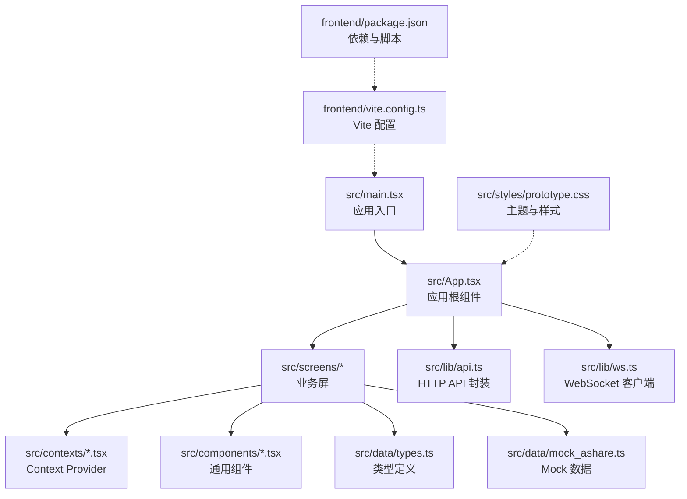
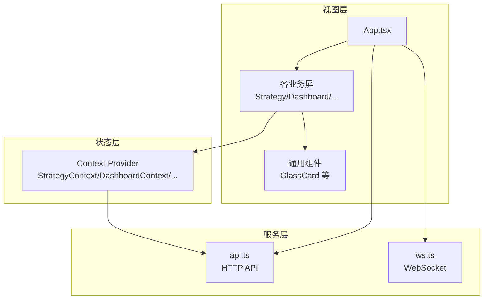
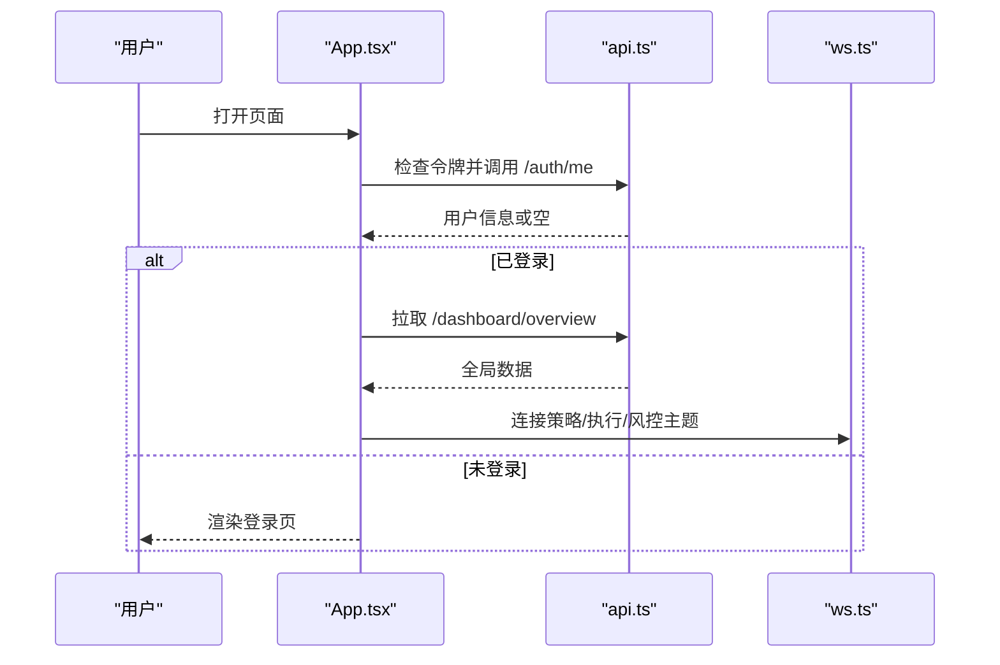
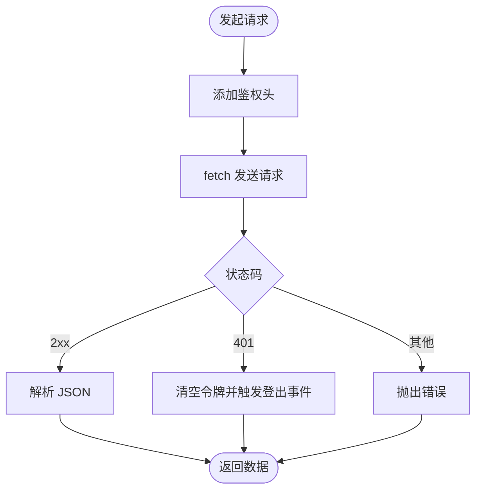
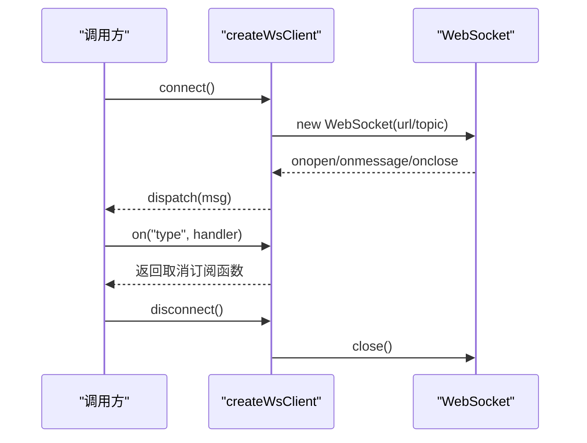
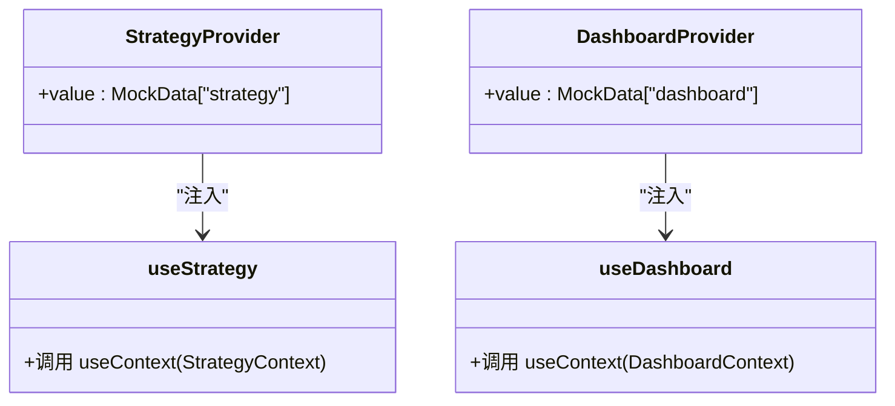
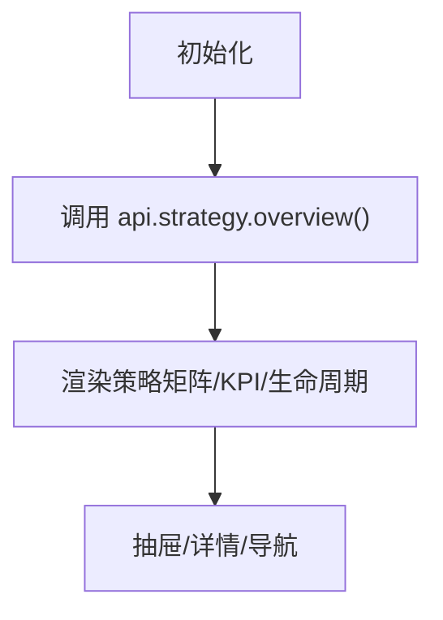
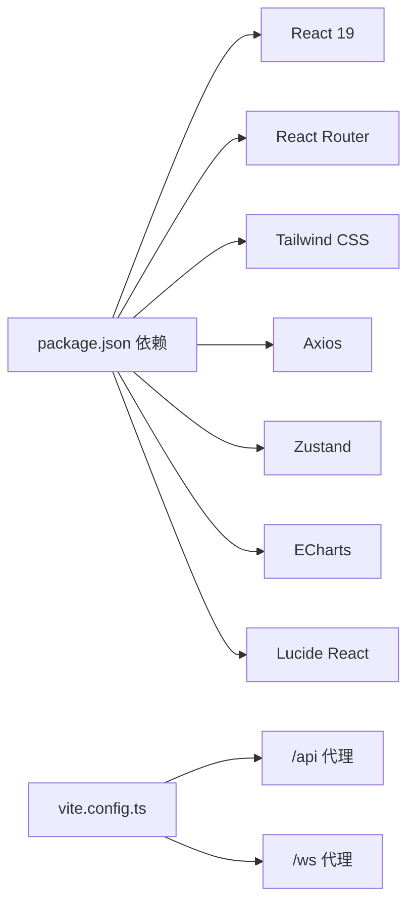

# 前端开发指南

<cite>
**本文档引用的文件**
- [package.json](file://frontend/package.json)
- [vite.config.ts](file://frontend/vite.config.ts)
- [main.tsx](file://frontend/src/main.tsx)
- [App.tsx](file://frontend/src/App.tsx)
- [api.ts](file://frontend/src/lib/api.ts)
- [ws.ts](file://frontend/src/lib/ws.ts)
- [StrategyContext.tsx](file://frontend/src/contexts/StrategyContext.tsx)
- [DashboardContext.tsx](file://frontend/src/contexts/DashboardContext.tsx)
- [types.ts](file://frontend/src/data/types.ts)
- [mock_ashare.ts](file://frontend/src/data/mock_ashare.ts)
- [GlassCard.tsx](file://frontend/src/components/GlassCard.tsx)
- [Strategy/index.tsx](file://frontend/src/screens/Strategy/index.tsx)
- [Dashboard/index.tsx](file://frontend/src/screens/Dashboard/index.tsx)
- [prototype.css](file://frontend/src/styles/prototype.css)
- [tsconfig.app.json](file://frontend/tsconfig.app.json)
- [eslint.config.js](file://frontend/eslint.config.js)
</cite>

## 目录
1. [简介](#简介)
2. [项目结构](#项目结构)
3. [核心组件](#核心组件)
4. [架构总览](#架构总览)
5. [详细组件分析](#详细组件分析)
6. [依赖关系分析](#依赖关系分析)
7. [性能考虑](#性能考虑)
8. [故障排除指南](#故障排除指南)
9. [结论](#结论)
10. [附录](#附录)

## 简介
本指南面向 llmine-quant 前端团队，目标是帮助开发者快速理解并高效构建基于 React 19 的前端应用。文档覆盖开发环境配置、组件架构设计、状态管理（含 Zustand 使用）、Context Provider 设计模式、WebSocket 实时通信、响应式布局与主题系统、组件库开发规范、性能与用户体验优化策略，并提供可直接参考的代码路径与最佳实践。

## 项目结构
前端采用 Vite + React 19 + TypeScript 架构，目录组织遵循按功能域划分的屏幕组件（screens）与通用工具（lib、contexts、components、data、styles）相结合的方式。核心入口位于 src/main.tsx，应用根组件 App.tsx 负责路由与全局状态协调；API 与 WebSocket 封装在 lib 目录下；各业务域通过 Context Provider 进行状态共享；样式采用 Tailwind CSS 与自定义 CSS 变量实现主题系统。

图表来源
- [main.tsx:1-12](file://frontend/src/main.tsx#L1-L12)
- [App.tsx:1-299](file://frontend/src/App.tsx#L1-L299)
- [api.ts:1-778](file://frontend/src/lib/api.ts#L1-L778)
- [ws.ts:1-95](file://frontend/src/lib/ws.ts#L1-L95)
- [prototype.css:1-800](file://frontend/src/styles/prototype.css#L1-L800)
- [vite.config.ts:1-29](file://frontend/vite.config.ts#L1-L29)
- [package.json:1-43](file://frontend/package.json#L1-L43)

章节来源
- [main.tsx:1-12](file://frontend/src/main.tsx#L1-L12)
- [vite.config.ts:1-29](file://frontend/vite.config.ts#L1-L29)
- [package.json:1-43](file://frontend/package.json#L1-L43)

## 核心组件
- 应用根组件 App.tsx：负责用户认证状态、全局数据加载、屏幕切换、模态框、侧边栏折叠、WebSocket 连接生命周期管理。
- API 封装 api.ts：统一处理鉴权头、错误处理（401 清理令牌并触发登出事件）、GET/POST/PUT/DELETE 请求与返回类型定义。
- WebSocket 客户端 ws.ts：支持自动重连、主题订阅、消息分发与事件监听。
- Context Provider：StrategyContext、DashboardContext 等，为各业务屏提供局部状态注入。
- 通用组件：GlassCard.tsx 提供玻璃拟态卡片封装，支持标题、副标题、操作按钮与点击回调。
- 屏幕组件：Strategy/index.tsx、Dashboard/index.tsx 等，负责数据拉取、状态管理与子组件编排。

章节来源
- [App.tsx:1-299](file://frontend/src/App.tsx#L1-L299)
- [api.ts:1-778](file://frontend/src/lib/api.ts#L1-L778)
- [ws.ts:1-95](file://frontend/src/lib/ws.ts#L1-L95)
- [StrategyContext.tsx:1-13](file://frontend/src/contexts/StrategyContext.tsx#L1-L13)
- [DashboardContext.tsx:1-13](file://frontend/src/contexts/DashboardContext.tsx#L1-L13)
- [GlassCard.tsx:1-49](file://frontend/src/components/GlassCard.tsx#L1-L49)
- [Strategy/index.tsx:1-168](file://frontend/src/screens/Strategy/index.tsx#L1-L168)
- [Dashboard/index.tsx:1-47](file://frontend/src/screens/Dashboard/index.tsx#L1-L47)

## 架构总览
应用采用“屏幕组件 + Context Provider + API/WebSocket + 通用组件”的分层架构。App.tsx 作为顶层协调者，负责登录态与全局数据；各业务屏通过 Context 注入所需数据；API 与 WebSocket 为数据与实时事件提供通道；通用组件保证视觉一致性与交互复用。

图表来源
- [App.tsx:1-299](file://frontend/src/App.tsx#L1-L299)
- [api.ts:1-778](file://frontend/src/lib/api.ts#L1-L778)
- [ws.ts:1-95](file://frontend/src/lib/ws.ts#L1-L95)
- [StrategyContext.tsx:1-13](file://frontend/src/contexts/StrategyContext.tsx#L1-L13)
- [DashboardContext.tsx:1-13](file://frontend/src/contexts/DashboardContext.tsx#L1-L13)

## 详细组件分析

### 应用根组件 App.tsx
- 登录态与会话恢复：从本地存储恢复令牌，首次加载时调用 /auth/me 获取当前用户信息；监听自定义事件 llmine:unauthorized 实现自动登出。
- 全局数据：登录成功后拉取仪表盘概览，填充顶部系统健康度、风险门禁、模态框文案等。
- 屏幕切换：支持复合导航 target[:param=value&other=...]，如 backtest:strategyId=abc。
- WebSocket 生命周期：登录后连接三类主题（策略、执行、风控），登出或卸载时断开。
- 模态框：根据全局数据中的模态配置渲染统一弹窗。

图表来源
- [App.tsx:55-96](file://frontend/src/App.tsx#L55-L96)
- [api.ts:544-551](file://frontend/src/lib/api.ts#L544-L551)
- [ws.ts:91-95](file://frontend/src/lib/ws.ts#L91-L95)

章节来源
- [App.tsx:1-299](file://frontend/src/App.tsx#L1-L299)

### API 封装 api.ts
- 鉴权存储：authStore 封装本地令牌读写与清理，支持 isAuthenticated。
- 请求工具：getJson/postJson/putJson/deleteJson 统一处理 401、错误文本与 JSON 解析。
- 类型定义：StrategyDetail、BacktestTaskResult、PaperAccount 等接口定义，确保类型安全。
- 模块化 API：auth/dashboard/strategy/backtest/explain/portfolio/execution/risk/data/security/collaboration/audit/paper 等模块化导出，便于按需引入。

图表来源
- [api.ts:32-83](file://frontend/src/lib/api.ts#L32-L83)

章节来源
- [api.ts:1-778](file://frontend/src/lib/api.ts#L1-L778)

### WebSocket 客户端 ws.ts
- 自动重连：断线后指数退避重连，最大延迟限制。
- 主题订阅：每个主题维护独立客户端，支持 on(type, handler) 订阅与取消。
- 消息分发：收到消息后按 msg.type 分派给对应处理器集合。

图表来源
- [ws.ts:27-95](file://frontend/src/lib/ws.ts#L27-L95)

章节来源
- [ws.ts:1-95](file://frontend/src/lib/ws.ts#L1-L95)

### Context Provider 设计模式
- StrategyContext/DashboardContext：分别注入策略与仪表盘的 Mock 数据，组件通过 useStrategy/useDashboard 获取上下文。
- 设计要点：Provider 包裹在各业务屏内，避免全局污染；在缺少 Provider 时抛出明确错误，便于定位问题。

图表来源
- [StrategyContext.tsx:1-13](file://frontend/src/contexts/StrategyContext.tsx#L1-L13)
- [DashboardContext.tsx:1-13](file://frontend/src/contexts/DashboardContext.tsx#L1-L13)
- [types.ts:1-647](file://frontend/src/data/types.ts#L1-L647)

章节来源
- [StrategyContext.tsx:1-13](file://frontend/src/contexts/StrategyContext.tsx#L1-L13)
- [DashboardContext.tsx:1-13](file://frontend/src/contexts/DashboardContext.tsx#L1-L13)
- [types.ts:1-647](file://frontend/src/data/types.ts#L1-L647)

### 屏幕组件：策略工厂 Strategy/index.tsx
- 数据加载：首次渲染时调用 api.strategy.overview() 获取策略工厂数据。
- KPI 展示：统计实盘/模拟盘/回测中策略数量与平均夏普比率。
- 交互：支持抽屉式新建策略、打开策略详情、生命周期卡片展示。

图表来源
- [Strategy/index.tsx:32-168](file://frontend/src/screens/Strategy/index.tsx#L32-L168)
- [api.ts:554-595](file://frontend/src/lib/api.ts#L554-L595)

章节来源
- [Strategy/index.tsx:1-168](file://frontend/src/screens/Strategy/index.tsx#L1-L168)

### 屏幕组件：仪表盘 Dashboard/index.tsx
- 数据加载：调用 api.dashboard.overview() 获取仪表盘数据。
- 结构：市场条、组合图表、Agent 矩阵、告警队列、策略网格、快捷操作等区域化布局。

章节来源
- [Dashboard/index.tsx:1-47](file://frontend/src/screens/Dashboard/index.tsx#L1-L47)

### 通用组件：GlassCard.tsx
- 能力：支持标题/副标题/操作按钮/点击回调/发光效果/内边距开关。
- 用途：用于策略卡片、指标卡、说明卡片等，统一视觉风格。

章节来源
- [GlassCard.tsx:1-49](file://frontend/src/components/GlassCard.tsx#L1-L49)

### 主题系统与响应式布局
- CSS 变量：通过 :root 定义颜色、半径、字体等变量，支持主题切换。
- 响应式：媒体查询适配不同宽度，侧边栏折叠、网格布局自适应。
- 玻璃拟态：使用 backdrop-filter、透明背景与阴影实现科技感界面。

章节来源
- [prototype.css:1-800](file://frontend/src/styles/prototype.css#L1-L800)

## 依赖关系分析
- 开发与构建：Vite 提供开发服务器与代理（/api -> http://localhost:8000, /ws -> ws://localhost:8000），TypeScript 严格类型检查，ESLint 规范化。
- 运行时依赖：React 19、React Router、Tailwind、Axios、Zustand、ECharts、Lucide React 等。
- 代理配置：前端开发时通过 /api 与 /ws 代理到后端服务，简化跨域与本地联调。

图表来源
- [package.json:12-24](file://frontend/package.json#L12-L24)
- [vite.config.ts:16-26](file://frontend/vite.config.ts#L16-L26)

章节来源
- [package.json:1-43](file://frontend/package.json#L1-L43)
- [vite.config.ts:1-29](file://frontend/vite.config.ts#L1-L29)

## 性能考虑
- 懒加载与按需渲染：App.tsx 在未认证时仅渲染登录页，减少初始渲染负担。
- 事件与副作用：在 useEffect 中正确清理 WebSocket 连接与事件监听，避免内存泄漏。
- 网络请求：统一错误处理与降级（401 清理令牌），避免阻塞 UI。
- 样式与动画：合理使用 CSS 变量与过渡，避免过度重绘；卡片与图表组件尽量复用。
- TypeScript 严格模式：启用 noUnusedLocals/noUnusedParameters 等规则，减少冗余代码。

## 故障排除指南
- 401 未授权：api.ts 在 401 时清空令牌并触发自定义事件 llmine:unauthorized，App.tsx 监听后清空用户状态并回到登录页。
- WebSocket 断线：ws.ts 内置指数退避重连，若仍失败检查后端 ws 地址与代理配置。
- 类型错误：确保使用 api.ts 导出的类型定义，避免与后端返回不一致导致的运行时错误。
- ESLint 报错：遵循 eslint.config.js 规则，使用 flat 配置与推荐插件，保持代码风格一致。

章节来源
- [api.ts:27-30](file://frontend/src/lib/api.ts#L27-L30)
- [App.tsx:69-74](file://frontend/src/App.tsx#L69-L74)
- [ws.ts:57-67](file://frontend/src/lib/ws.ts#L57-L67)
- [eslint.config.js:1-23](file://frontend/eslint.config.js#L1-L23)

## 结论
本指南提供了 llmine-quant 前端开发的完整蓝图：从环境配置到组件架构、状态管理、实时通信与主题系统，再到性能与故障排除。建议在实际开发中遵循本文档的模式与最佳实践，确保界面一致性、交互流畅性与可维护性。

## 附录

### 开发环境配置清单
- 安装依赖：npm install
- 启动开发：npm run dev
- 构建产物：npm run build
- 预览构建：npm run preview
- 代码检查：npm run lint

章节来源
- [package.json:6-11](file://frontend/package.json#L6-L11)

### 关键配置文件摘要
- Vite 配置：插件、别名、代理、端口与主机设置。
- TypeScript 配置：模块解析、JSX、忽略依赖弃用提示。
- ESLint 配置：推荐规则、React Hooks、React Refresh。

章节来源
- [vite.config.ts:1-29](file://frontend/vite.config.ts#L1-L29)
- [tsconfig.app.json:1-31](file://frontend/tsconfig.app.json#L1-L31)
- [eslint.config.js:1-23](file://frontend/eslint.config.js#L1-L23)