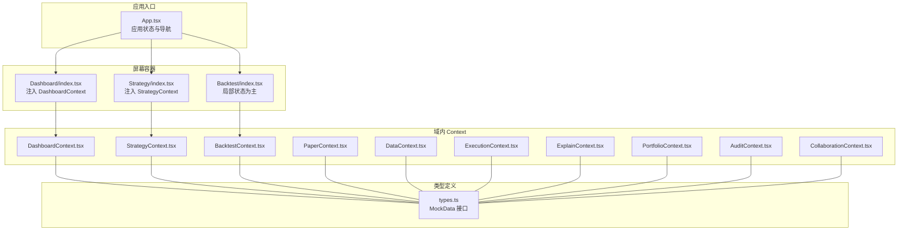
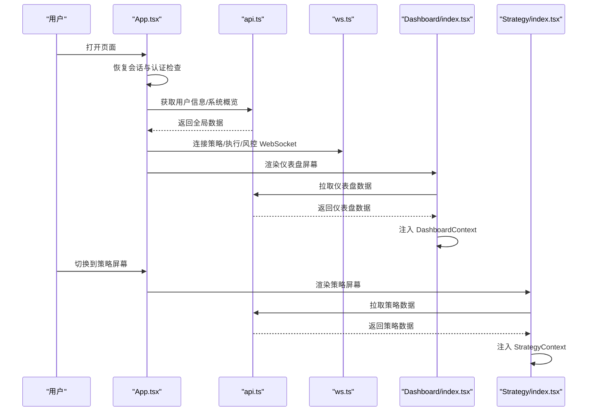
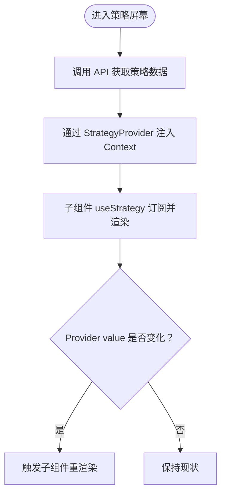
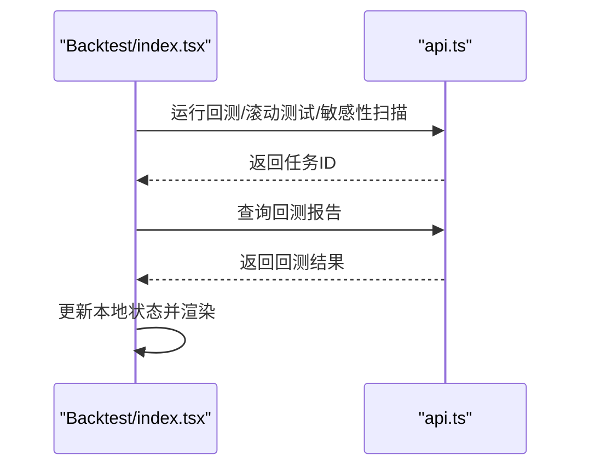
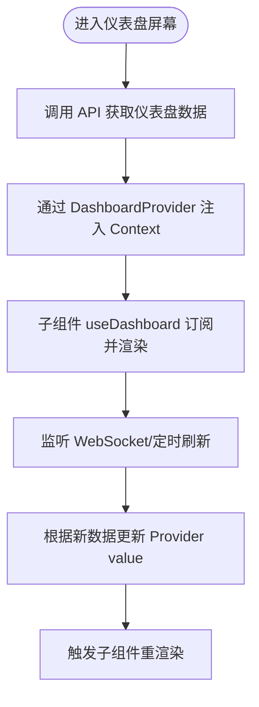
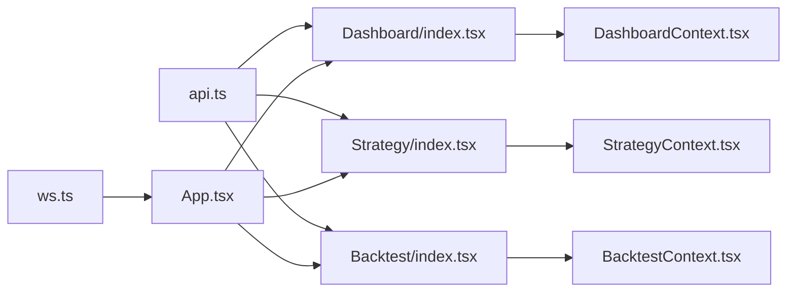

# 状态管理系统

<cite>
**本文引用的文件**
- [StrategyContext.tsx](file://frontend/src/contexts/StrategyContext.tsx)
- [BacktestContext.tsx](file://frontend/src/contexts/BacktestContext.tsx)
- [DashboardContext.tsx](file://frontend/src/contexts/DashboardContext.tsx)
- [types.ts](file://frontend/src/data/types.ts)
- [App.tsx](file://frontend/src/App.tsx)
- [Dashboard/index.tsx](file://frontend/src/screens/Dashboard/index.tsx)
- [Strategy/index.tsx](file://frontend/src/screens/Strategy/index.tsx)
- [Backtest/index.tsx](file://frontend/src/screens/Backtest/index.tsx)
- [PaperContext.tsx](file://frontend/src/contexts/PaperContext.tsx)
- [DataContext.tsx](file://frontend/src/contexts/DataContext.tsx)
- [ExecutionContext.tsx](file://frontend/src/contexts/ExecutionContext.tsx)
- [ExplainContext.tsx](file://frontend/src/contexts/ExplainContext.tsx)
- [PortfolioContext.tsx](file://frontend/src/contexts/PortfolioContext.tsx)
- [AuditContext.tsx](file://frontend/src/contexts/AuditContext.tsx)
- [CollaborationContext.tsx](file://frontend/src/contexts/CollaborationContext.tsx)
</cite>

## 目录
1. [引言](#引言)
2. [项目结构](#项目结构)
3. [核心组件](#核心组件)
4. [架构总览](#架构总览)
5. [详细组件分析](#详细组件分析)
6. [依赖关系分析](#依赖关系分析)
7. [性能考量](#性能考量)
8. [故障排查指南](#故障排查指南)
9. [结论](#结论)
10. [附录](#附录)

## 引言
本文件面向 llmine-quant 前端，系统性梳理基于 React Context 的状态管理模式，重点解析各 Context Provider 的设计思路与实现细节，覆盖 StrategyContext、BacktestContext、DashboardContext 等核心状态管理组件。文档同时阐述状态订阅机制、异步状态更新与持久化策略，给出最佳实践、性能优化技巧与常见问题解决方案，并提供可定位到源码路径的示例指引，帮助开发者正确使用与扩展状态管理系统。

## 项目结构
前端状态管理采用“按功能域划分”的 Context 组织方式：每个业务域（如策略、回测、仪表盘、数据、执行、解释、组合、风控、安全、协作、审计等）均提供独立的 Context 与 Provider，配合统一的类型定义与屏幕级容器组件，形成清晰的“域内状态 + 屏幕级注入”的分层结构。

图表来源
- [App.tsx:42-173](file://frontend/src/App.tsx#L42-L173)
- [Dashboard/index.tsx:28-45](file://frontend/src/screens/Dashboard/index.tsx#L28-L45)
- [Strategy/index.tsx:80-166](file://frontend/src/screens/Strategy/index.tsx#L80-L166)
- [Backtest/index.tsx:137-800](file://frontend/src/screens/Backtest/index.tsx#L137-L800)
- [DashboardContext.tsx:1-13](file://frontend/src/contexts/DashboardContext.tsx#L1-L13)
- [StrategyContext.tsx:1-13](file://frontend/src/contexts/StrategyContext.tsx#L1-L13)
- [BacktestContext.tsx:1-13](file://frontend/src/contexts/BacktestContext.tsx#L1-L13)
- [PaperContext.tsx:1-20](file://frontend/src/contexts/PaperContext.tsx#L1-L20)
- [DataContext.tsx:1-13](file://frontend/src/contexts/DataContext.tsx#L1-L13)
- [ExecutionContext.tsx:1-13](file://frontend/src/contexts/ExecutionContext.tsx#L1-L13)
- [ExplainContext.tsx:1-13](file://frontend/src/contexts/ExplainContext.tsx#L1-L13)
- [PortfolioContext.tsx:1-13](file://frontend/src/contexts/PortfolioContext.tsx#L1-L13)
- [AuditContext.tsx:1-13](file://frontend/src/contexts/AuditContext.tsx#L1-L13)
- [CollaborationContext.tsx:1-13](file://frontend/src/contexts/CollaborationContext.tsx#L1-L13)
- [types.ts:1-647](file://frontend/src/data/types.ts#L1-L647)

章节来源
- [App.tsx:42-173](file://frontend/src/App.tsx#L42-L173)
- [Dashboard/index.tsx:28-45](file://frontend/src/screens/Dashboard/index.tsx#L28-L45)
- [Strategy/index.tsx:80-166](file://frontend/src/screens/Strategy/index.tsx#L80-L166)
- [Backtest/index.tsx:137-800](file://frontend/src/screens/Backtest/index.tsx#L137-L800)
- [types.ts:1-647](file://frontend/src/data/types.ts#L1-L647)

## 核心组件
- Context 设计模式
  - 每个域提供一个 Context 对象与 Provider 包装器，以及对应的 hook（如 useStrategy/useBacktest/useDashboard 等），用于在子树中注入与消费状态。
  - Context 的值类型来自统一的 MockData 接口，确保跨域一致性与类型安全。
- Provider 注入位置
  - 屏幕级容器组件负责拉取 API 数据并注入对应 Context，例如 Dashboard/index.tsx 在渲染时通过 DashboardProvider 注入仪表盘数据；Strategy/index.tsx 注入策略域数据。
  - Backtest 屏幕以本地状态为主，不注入 BacktestContext，而是通过屏幕内部状态驱动视图。
- 订阅与更新
  - 子组件通过自定义 hook 订阅 Context，当 Provider 的 value 更新时触发重渲染。
  - 全局状态（如用户信息、系统健康度、模态配置）由 App.tsx 维护并在顶层渲染，影响多个屏幕。

章节来源
- [DashboardContext.tsx:1-13](file://frontend/src/contexts/DashboardContext.tsx#L1-L13)
- [StrategyContext.tsx:1-13](file://frontend/src/contexts/StrategyContext.tsx#L1-L13)
- [BacktestContext.tsx:1-13](file://frontend/src/contexts/BacktestContext.tsx#L1-L13)
- [Dashboard/index.tsx:28-45](file://frontend/src/screens/Dashboard/index.tsx#L28-L45)
- [Strategy/index.tsx:80-166](file://frontend/src/screens/Strategy/index.tsx#L80-L166)
- [App.tsx:42-173](file://frontend/src/App.tsx#L42-L173)

## 架构总览
下图展示应用启动到屏幕渲染的关键流程，包括用户认证、全局数据拉取、WebSocket 连接建立、屏幕切换与 Context 注入。

图表来源
- [App.tsx:55-96](file://frontend/src/App.tsx#L55-L96)
- [Dashboard/index.tsx:20-24](file://frontend/src/screens/Dashboard/index.tsx#L20-L24)
- [Strategy/index.tsx:38-46](file://frontend/src/screens/Strategy/index.tsx#L38-L46)

章节来源
- [App.tsx:55-96](file://frontend/src/App.tsx#L55-L96)
- [Dashboard/index.tsx:20-24](file://frontend/src/screens/Dashboard/index.tsx#L20-L24)
- [Strategy/index.tsx:38-46](file://frontend/src/screens/Strategy/index.tsx#L38-L46)

## 详细组件分析

### StrategyContext 分析
- 功能职责
  - 提供策略工厂域的全局状态，包括流水线状态、模板、自然语言提示、事件流、矩阵数据与流水线看板等。
- 状态结构
  - 值类型为 MockData['strategy']，字段覆盖策略生命周期、指标、时间序列等。
- 数据流转
  - Strategy/index.tsx 在挂载时调用 API 拉取策略概览，随后通过 StrategyProvider 注入 Context。
- 订阅与更新
  - 子组件通过 useStrategy 订阅，当 Provider value 更新时触发重渲染。
- 最佳实践
  - 将重型计算（如 KPI 统计）放在组件内部 useMemo 中，避免重复计算。
  - 保持 Provider 的 value 为不可变对象，减少不必要的重渲染。

图表来源
- [Strategy/index.tsx:32-78](file://frontend/src/screens/Strategy/index.tsx#L32-L78)
- [Strategy/index.tsx:80-166](file://frontend/src/screens/Strategy/index.tsx#L80-L166)
- [StrategyContext.tsx:1-13](file://frontend/src/contexts/StrategyContext.tsx#L1-L13)

章节来源
- [Strategy/index.tsx:32-78](file://frontend/src/screens/Strategy/index.tsx#L32-L78)
- [Strategy/index.tsx:80-166](file://frontend/src/screens/Strategy/index.tsx#L80-L166)
- [StrategyContext.tsx:1-13](file://frontend/src/contexts/StrategyContext.tsx#L1-L13)
- [types.ts:46-76](file://frontend/src/data/types.ts#L46-L76)

### BacktestContext 分析
- 功能职责
  - 提供回测域的全局状态，包括关键指标、等样本/样本外曲线、置信度、滚动测试折数、对比策略、压力场景、参数热力图等。
- 状态结构
  - 值类型为 MockData['backtest']，字段覆盖多类可视化与分析结果。
- 数据流转
  - Backtest 屏幕以本地状态为主，不注入 BacktestContext；其内部通过 API 调用与任务 ID 管理回测流程。
- 订阅与更新
  - 若需在其他屏幕共享回测上下文，可在上层容器注入 BacktestProvider 并传入必要上下文（如策略 ID 或任务 ID）。
- 最佳实践
  - 将复杂参数与配置封装为局部状态，避免污染全局 Context。
  - 使用任务 ID 作为路由参数，支持从外部链接直接打开特定回测任务。

图表来源
- [Backtest/index.tsx:268-310](file://frontend/src/screens/Backtest/index.tsx#L268-L310)
- [Backtest/index.tsx:230-246](file://frontend/src/screens/Backtest/index.tsx#L230-L246)

章节来源
- [Backtest/index.tsx:137-800](file://frontend/src/screens/Backtest/index.tsx#L137-L800)
- [BacktestContext.tsx:1-13](file://frontend/src/contexts/BacktestContext.tsx#L1-L13)
- [types.ts:77-125](file://frontend/src/data/types.ts#L77-L125)

### DashboardContext 分析
- 功能职责
  - 提供仪表盘域的全局状态，包括市场指数、组合指标、净值曲线、代理与策略列表、待审批数量等。
- 状态结构
  - 值类型为 MockData['dashboard']，字段覆盖系统健康度、KPI、图表数据与告警队列等。
- 数据流转
  - Dashboard/index.tsx 在挂载时调用 API 拉取仪表盘概览，随后通过 DashboardProvider 注入 Context。
- 订阅与更新
  - 子组件通过 useDashboard 订阅，仪表盘侧组件（如市场条、组合图、策略网格）共享该上下文。
- 最佳实践
  - 将全局系统健康度与模态配置与屏幕级数据解耦，避免 Context 过载。
  - 对高频更新的数据（如 WebSocket 推送）考虑在屏幕层单独处理，减少对全局 Context 的压力。

图表来源
- [Dashboard/index.tsx:17-26](file://frontend/src/screens/Dashboard/index.tsx#L17-L26)
- [Dashboard/index.tsx:28-45](file://frontend/src/screens/Dashboard/index.tsx#L28-L45)
- [DashboardContext.tsx:1-13](file://frontend/src/contexts/DashboardContext.tsx#L1-L13)

章节来源
- [Dashboard/index.tsx:17-26](file://frontend/src/screens/Dashboard/index.tsx#L17-L26)
- [Dashboard/index.tsx:28-45](file://frontend/src/screens/Dashboard/index.tsx#L28-L45)
- [DashboardContext.tsx:1-13](file://frontend/src/contexts/DashboardContext.tsx#L1-L13)
- [types.ts:5-45](file://frontend/src/data/types.ts#L5-L45)

### PaperContext 分析
- 功能职责
  - 提供模拟盘账户、净值序列、持仓与订单的聚合状态，用于模拟盘相关屏幕。
- 状态结构
  - 值类型为 PaperContextValue，包含账户、净值数组、持仓数组与订单数组。
- 数据流转
  - 通常由上层容器注入，模拟盘屏幕通过 usePaper 订阅。
- 最佳实践
  - 将模拟盘状态与实盘状态分离，避免混淆。
  - 对大数组（如净值序列）进行分页或采样，降低渲染压力。

章节来源
- [PaperContext.tsx:1-20](file://frontend/src/contexts/PaperContext.tsx#L1-L20)

### 其他域 Context（DataContext、ExecutionContext、ExplainContext、PortfolioContext、AuditContext、CollaborationContext）
- 设计一致
  - 每个域均提供对应的 Context、Provider 与 hook，值类型来自 MockData 对应字段。
- 使用方式
  - 与 StrategyContext、BacktestContext、DashboardContext 类似，由对应屏幕容器组件注入，子组件通过 hook 订阅。
- 注意事项
  - 对于仅在单屏使用的数据，优先采用屏幕内部状态，避免 Context 泛滥。
  - 对高频更新的数据（如 WebSocket 推送）建议在屏幕层维护局部状态，仅在需要跨组件共享时注入 Context。

章节来源
- [DataContext.tsx:1-13](file://frontend/src/contexts/DataContext.tsx#L1-L13)
- [ExecutionContext.tsx:1-13](file://frontend/src/contexts/ExecutionContext.tsx#L1-L13)
- [ExplainContext.tsx:1-13](file://frontend/src/contexts/ExplainContext.tsx#L1-L13)
- [PortfolioContext.tsx:1-13](file://frontend/src/contexts/PortfolioContext.tsx#L1-L13)
- [AuditContext.tsx:1-13](file://frontend/src/contexts/AuditContext.tsx#L1-L13)
- [CollaborationContext.tsx:1-13](file://frontend/src/contexts/CollaborationContext.tsx#L1-L13)
- [types.ts:1-647](file://frontend/src/data/types.ts#L1-L647)

## 依赖关系分析
- 组件耦合
  - 各 Context 与屏幕容器之间为弱耦合：屏幕容器负责数据获取与注入，子组件仅依赖 hook 订阅。
  - App.tsx 作为全局入口，负责用户认证、全局数据与 WebSocket 连接，为多个屏幕提供基础能力。
- 外部依赖
  - API 层（api.ts）与 WebSocket 层（ws.ts）为状态来源，回测与仪表盘等屏幕通过它们更新状态。
- 潜在风险
  - Context 泛滥可能导致性能下降与调试困难，应遵循“仅注入必要数据”的原则。
  - 对于频繁更新的数据，建议采用屏幕内部状态或专用状态库（如 Zustand）以提升可控性。

图表来源
- [App.tsx:1-299](file://frontend/src/App.tsx#L1-L299)
- [Dashboard/index.tsx:1-47](file://frontend/src/screens/Dashboard/index.tsx#L1-L47)
- [Strategy/index.tsx:1-168](file://frontend/src/screens/Strategy/index.tsx#L1-L168)
- [Backtest/index.tsx:1-1255](file://frontend/src/screens/Backtest/index.tsx#L1-L1255)
- [DashboardContext.tsx:1-13](file://frontend/src/contexts/DashboardContext.tsx#L1-L13)
- [StrategyContext.tsx:1-13](file://frontend/src/contexts/StrategyContext.tsx#L1-L13)
- [BacktestContext.tsx:1-13](file://frontend/src/contexts/BacktestContext.tsx#L1-L13)

章节来源
- [App.tsx:1-299](file://frontend/src/App.tsx#L1-L299)
- [Dashboard/index.tsx:1-47](file://frontend/src/screens/Dashboard/index.tsx#L1-L47)
- [Strategy/index.tsx:1-168](file://frontend/src/screens/Strategy/index.tsx#L1-L168)
- [Backtest/index.tsx:1-1255](file://frontend/src/screens/Backtest/index.tsx#L1-L1255)

## 性能考量
- 状态粒度
  - 将大对象拆分为多个 Context，避免单一 Context 的频繁更新引发大面积重渲染。
- 计算优化
  - 对派生数据使用 useMemo/useCallback，减少重复计算与对象重建。
- 渲染优化
  - 将高频更新的数据保留在屏幕内部状态，仅在需要跨组件共享时注入 Context。
- WebSocket 与轮询
  - 对实时数据采用局部状态与增量更新策略，避免阻塞主线程。
- 类型约束
  - 通过 MockData 接口约束状态结构，减少运行期错误与无效渲染。

## 故障排查指南
- Hook 使用错误
  - 错误：在 Context Provider 外使用 useStrategy/useBacktest/useDashboard 等 hook。
  - 解决：确保组件树包含对应 Provider，或在屏幕容器中注入后再消费。
- 数据未更新
  - 检查 Provider 的 value 是否被替换为新的对象实例，React 仅比较引用变化。
  - 确认屏幕是否重新渲染（可通过浏览器开发工具观察）。
- WebSocket 未连接
  - 检查 App.tsx 中认证状态与 WebSocket 初始化逻辑，确认在登录后才建立连接。
- 回测任务未显示
  - 检查任务 ID 参数是否正确传递至回测屏幕，确认 API 返回的任务 ID 有效。

章节来源
- [StrategyContext.tsx:8-12](file://frontend/src/contexts/StrategyContext.tsx#L8-L12)
- [BacktestContext.tsx:8-12](file://frontend/src/contexts/BacktestContext.tsx#L8-L12)
- [DashboardContext.tsx:8-12](file://frontend/src/contexts/DashboardContext.tsx#L8-L12)
- [App.tsx:85-96](file://frontend/src/App.tsx#L85-L96)
- [Backtest/index.tsx:230-246](file://frontend/src/screens/Backtest/index.tsx#L230-L246)

## 结论
本状态管理方案以 React Context 为核心，结合屏幕级容器注入与统一类型定义，实现了清晰的域内状态划分与良好的可维护性。对于高频更新与复杂交互场景，建议在屏幕内部使用局部状态，并仅在必要时通过 Context 共享。未来可引入轻量状态库（如 Zustand）进一步优化状态订阅与更新路径，提升性能与开发体验。

## 附录
- 使用指南
  - 在屏幕容器中拉取数据并注入对应 Context：参考 [Dashboard/index.tsx:28-45](file://frontend/src/screens/Dashboard/index.tsx#L28-L45)、[Strategy/index.tsx:80-166](file://frontend/src/screens/Strategy/index.tsx#L80-L166)。
  - 在子组件中使用 hook 订阅：参考 [StrategyContext.tsx:8-12](file://frontend/src/contexts/StrategyContext.tsx#L8-L12)、[BacktestContext.tsx:8-12](file://frontend/src/contexts/BacktestContext.tsx#L8-L12)、[DashboardContext.tsx:8-12](file://frontend/src/contexts/DashboardContext.tsx#L8-L12)。
  - 全局状态与 WebSocket：参考 [App.tsx:55-96](file://frontend/src/App.tsx#L55-L96)。
- 类型参考
  - 统一接口定义：参考 [types.ts:1-647](file://frontend/src/data/types.ts#L1-L647)。