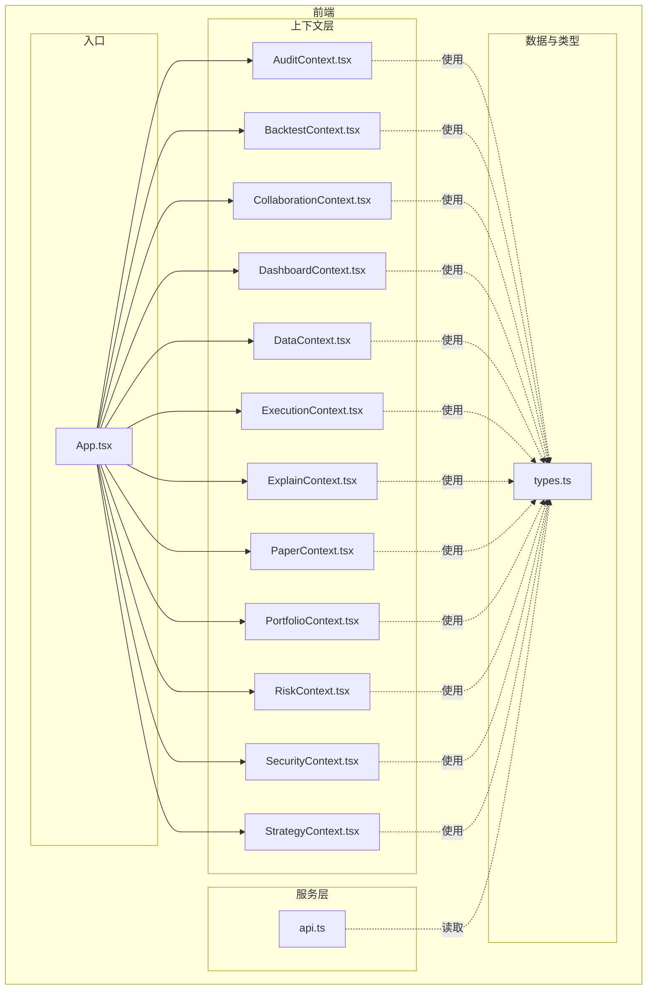
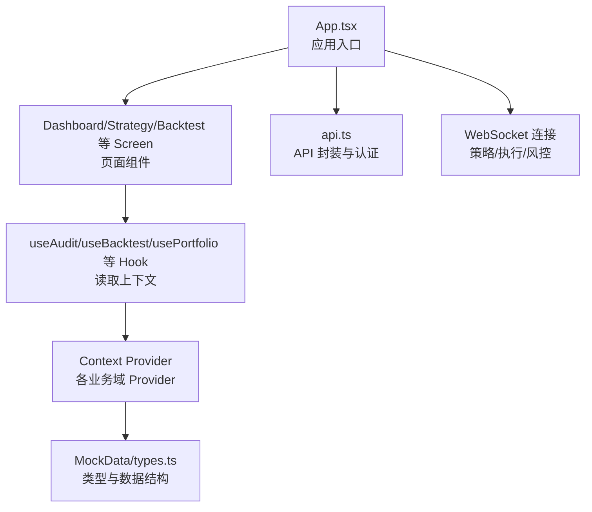
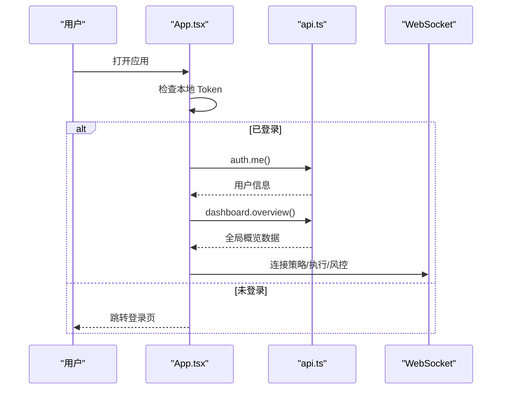
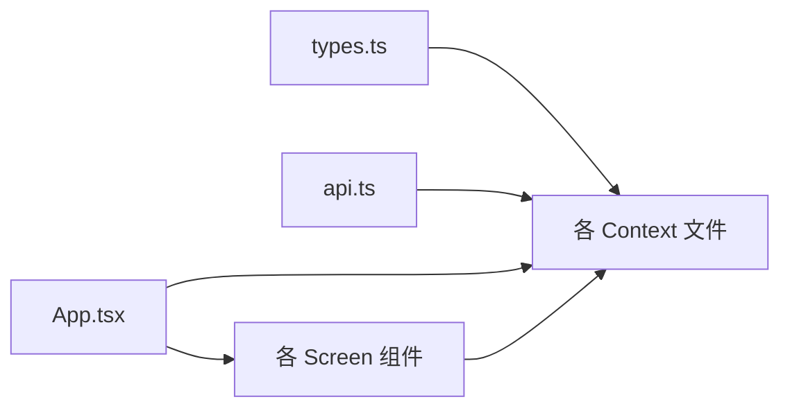

# Zustand 状态管理模式

<cite>
**本文引用的文件**
- [App.tsx](file://frontend/src/App.tsx)
- [AuditContext.tsx](file://frontend/src/contexts/AuditContext.tsx)
- [BacktestContext.tsx](file://frontend/src/contexts/BacktestContext.tsx)
- [CollaborationContext.tsx](file://frontend/src/contexts/CollaborationContext.tsx)
- [DashboardContext.tsx](file://frontend/src/contexts/DashboardContext.tsx)
- [DataContext.tsx](file://frontend/src/contexts/DataContext.tsx)
- [ExecutionContext.tsx](file://frontend/src/contexts/ExecutionContext.tsx)
- [ExplainContext.tsx](file://frontend/src/contexts/ExplainContext.tsx)
- [PaperContext.tsx](file://frontend/src/contexts/PaperContext.tsx)
- [PortfolioContext.tsx](file://frontend/src/contexts/PortfolioContext.tsx)
- [RiskContext.tsx](file://frontend/src/contexts/RiskContext.tsx)
- [SecurityContext.tsx](file://frontend/src/contexts/SecurityContext.tsx)
- [StrategyContext.tsx](file://frontend/src/contexts/StrategyContext.tsx)
- [types.ts](file://frontend/src/data/types.ts)
- [api.ts](file://frontend/src/lib/api.ts)
</cite>

## 目录
1. [引言](#引言)
2. [项目结构](#项目结构)
3. [核心组件](#核心组件)
4. [架构总览](#架构总览)
5. [详细组件分析](#详细组件分析)
6. [依赖关系分析](#依赖关系分析)
7. [性能考量](#性能考量)
8. [故障排查指南](#故障排查指南)
9. [结论](#结论)
10. [附录](#附录)

## 引言
本文件系统性梳理 llmine-quant 前端在 React 中采用的“上下文 + 手写 Hook”的状态管理模式，明确其设计理念、实现方式与最佳实践。尽管项目未直接引入 Zustand 库，但其上下文 Provider 与 useXXX Hook 的组织方式，天然契合 Zustand 的“以 Provider 为中心”的思想：通过 Context 将状态注入到组件树，用自定义 Hook 提供稳定的读取与订阅接口，并在应用入口集中装配 Provider，从而实现清晰的状态边界与高效的组件通信。

## 项目结构
前端状态管理相关文件主要分布在以下位置：
- contexts：按业务域划分的 Context 定义与 Hook，如审计、回测、组合、执行等
- data：类型定义与 Mock 数据结构
- lib：API 封装与认证存储
- App.tsx：应用入口，负责登录态恢复、WebSocket 连接与全局状态初始化

图表来源
- [App.tsx:42-173](file://frontend/src/App.tsx#L42-L173)
- [AuditContext.tsx:1-13](file://frontend/src/contexts/AuditContext.tsx#L1-L13)
- [BacktestContext.tsx:1-13](file://frontend/src/contexts/BacktestContext.tsx#L1-L13)
- [CollaborationContext.tsx:1-13](file://frontend/src/contexts/CollaborationContext.tsx#L1-L13)
- [DashboardContext.tsx:1-13](file://frontend/src/contexts/DashboardContext.tsx#L1-L13)
- [DataContext.tsx:1-13](file://frontend/src/contexts/DataContext.tsx#L1-L13)
- [ExecutionContext.tsx:1-13](file://frontend/src/contexts/ExecutionContext.tsx#L1-L13)
- [ExplainContext.tsx:1-13](file://frontend/src/contexts/ExplainContext.tsx#L1-L13)
- [PaperContext.tsx:1-20](file://frontend/src/contexts/PaperContext.tsx#L1-L20)
- [PortfolioContext.tsx:1-13](file://frontend/src/contexts/PortfolioContext.tsx#L1-L13)
- [RiskContext.tsx:1-13](file://frontend/src/contexts/RiskContext.tsx#L1-L13)
- [SecurityContext.tsx:1-13](file://frontend/src/contexts/SecurityContext.tsx#L1-L13)
- [StrategyContext.tsx:1-13](file://frontend/src/contexts/StrategyContext.tsx#L1-L13)
- [types.ts:1-647](file://frontend/src/data/types.ts#L1-L647)
- [api.ts:514-779](file://frontend/src/lib/api.ts#L514-L779)

章节来源
- [App.tsx:42-173](file://frontend/src/App.tsx#L42-L173)

## 核心组件
- Context 定义与 Provider
  - 每个业务域（如审计、回测、组合、执行等）均定义一个 Context，并导出对应的 Provider 与 useXXX Hook
  - Context 初始值为对应 MockData 的子结构或特定类型（如 PaperContext）
- 自定义 Hook
  - useXXX 返回 Context 值；若未包裹在对应 Provider 内部，抛出错误，强制约束使用范围
- 类型系统
  - types.ts 定义了完整的 MockData 结构，作为各 Context 的类型依据
- 入口装配
  - App.tsx 负责用户登录态恢复、全局概览数据拉取、WebSocket 连接与屏幕切换
  - 各 Screen 组件通过 props 接收导航回调与初始上下文参数（如回测场景）

章节来源
- [AuditContext.tsx:1-13](file://frontend/src/contexts/AuditContext.tsx#L1-L13)
- [BacktestContext.tsx:1-13](file://frontend/src/contexts/BacktestContext.tsx#L1-L13)
- [CollaborationContext.tsx:1-13](file://frontend/src/contexts/CollaborationContext.tsx#L1-L13)
- [DashboardContext.tsx:1-13](file://frontend/src/contexts/DashboardContext.tsx#L1-L13)
- [DataContext.tsx:1-13](file://frontend/src/contexts/DataContext.tsx#L1-L13)
- [ExecutionContext.tsx:1-13](file://frontend/src/contexts/ExecutionContext.tsx#L1-L13)
- [ExplainContext.tsx:1-13](file://frontend/src/contexts/ExplainContext.tsx#L1-L13)
- [PaperContext.tsx:1-20](file://frontend/src/contexts/PaperContext.tsx#L1-L20)
- [PortfolioContext.tsx:1-13](file://frontend/src/contexts/PortfolioContext.tsx#L1-L13)
- [RiskContext.tsx:1-13](file://frontend/src/contexts/RiskContext.tsx#L1-L13)
- [SecurityContext.tsx:1-13](file://frontend/src/contexts/SecurityContext.tsx#L1-L13)
- [StrategyContext.tsx:1-13](file://frontend/src/contexts/StrategyContext.tsx#L1-L13)
- [types.ts:1-647](file://frontend/src/data/types.ts#L1-L647)
- [App.tsx:42-173](file://frontend/src/App.tsx#L42-L173)

## 架构总览
该状态管理模式遵循“分而治之”的原则：每个业务域拥有独立的 Context，组件通过 useXXX 读取所需数据；应用入口负责全局状态初始化与跨域事件（如 WebSocket）。这种设计具备如下优势：
- 明确的状态边界：各域状态相互隔离，降低耦合
- 清晰的订阅模型：组件仅订阅自身需要的数据片段
- 可扩展性：新增域只需新增 Context 与 Hook，无需改动既有结构

图表来源
- [App.tsx:42-173](file://frontend/src/App.tsx#L42-L173)
- [AuditContext.tsx:8-12](file://frontend/src/contexts/AuditContext.tsx#L8-L12)
- [BacktestContext.tsx:8-12](file://frontend/src/contexts/BacktestContext.tsx#L8-L12)
- [PortfolioContext.tsx:8-12](file://frontend/src/contexts/PortfolioContext.tsx#L8-L12)
- [types.ts:1-647](file://frontend/src/data/types.ts#L1-L647)
- [api.ts:514-779](file://frontend/src/lib/api.ts#L514-L779)

## 详细组件分析

### 设计理念与实现方式
- 设计理念
  - 以 Context 为核心，将状态注入组件树
  - 通过自定义 Hook 暴露稳定接口，隐藏 Provider 包裹细节
  - 类型系统先行，确保上下文值与期望结构一致
- 实现方式
  - 每个域的 Context 初始化为 null 或具体类型
  - Provider 作为 Context.Provider 的别名导出，便于在入口统一装配
  - useXXX Hook 在未找到 Provider 时抛错，强制在正确范围内使用

章节来源
- [AuditContext.tsx:1-13](file://frontend/src/contexts/AuditContext.tsx#L1-L13)
- [BacktestContext.tsx:1-13](file://frontend/src/contexts/BacktestContext.tsx#L1-L13)
- [PaperContext.tsx:1-20](file://frontend/src/contexts/PaperContext.tsx#L1-L20)
- [types.ts:1-647](file://frontend/src/data/types.ts#L1-L647)

### Provider 创建与使用方法
- 创建 Provider
  - 定义 Context 并导出 Provider 别名
  - 在 App.tsx 中根据业务需要将 Provider 包裹在 Screen 组件外层
- 使用 Provider
  - 组件内部通过 useXXX Hook 获取上下文值
  - 若未包裹 Provider，Hook 将抛出错误，提示必须在对应 Provider 内部使用

章节来源
- [AuditContext.tsx:6-12](file://frontend/src/contexts/AuditContext.tsx#L6-L12)
- [BacktestContext.tsx:6-12](file://frontend/src/contexts/BacktestContext.tsx#L6-L12)
- [PaperContext.tsx:13-19](file://frontend/src/contexts/PaperContext.tsx#L13-L19)
- [App.tsx:137-173](file://frontend/src/App.tsx#L137-L173)

### Context Provider 设计模式
- 单一职责：每个 Provider 仅承载一个业务域的状态
- 类型安全：基于 types.ts 的 MockData 子结构，确保数据一致性
- 错误兜底：未包裹 Provider 时的显式错误，避免静默失败

章节来源
- [AuditContext.tsx:4-12](file://frontend/src/contexts/AuditContext.tsx#L4-L12)
- [BacktestContext.tsx:4-12](file://frontend/src/contexts/BacktestContext.tsx#L4-L12)
- [PortfolioContext.tsx:4-12](file://frontend/src/contexts/PortfolioContext.tsx#L4-L12)
- [types.ts:1-647](file://frontend/src/data/types.ts#L1-L647)

### 状态订阅机制与组件间通信
- 订阅机制
  - 组件通过 useXXX Hook 订阅对应 Context
  - 当 Context 值变化时，订阅该 Context 的组件会重新渲染
- 组件间通信
  - 屏幕级参数传递：App.tsx 通过 props 将回测场景参数传入 Backtest Screen
  - 业务域内通信：各域内的组件共享同一 Context，实现跨组件状态共享

章节来源
- [App.tsx:108-127](file://frontend/src/App.tsx#L108-L127)
- [BacktestContext.tsx:8-12](file://frontend/src/contexts/BacktestContext.tsx#L8-L12)

### 状态初始化、更新与销毁流程

#### 状态初始化
- 登录态恢复：App.tsx 在挂载时检查本地 Token 并调用后端接口确认用户信息
- 全局概览：认证成功后拉取 Dashboard 概览，填充全局 meta/system/modals
- WebSocket：认证成功后建立策略、执行、风控三路 WebSocket 连接

图表来源
- [App.tsx:55-96](file://frontend/src/App.tsx#L55-L96)
- [api.ts:545-549](file://frontend/src/lib/api.ts#L545-L549)
- [api.ts:550-553](file://frontend/src/lib/api.ts#L550-L553)

#### 状态更新
- 数据拉取：各 Screen 组件在首次渲染或路由切换时，调用 api.ts 对应接口获取最新数据
- WebSocket 推送：策略、执行、风控的实时事件通过 WebSocket 推送，驱动相应状态更新
- 本地状态：App.tsx 维护屏幕、侧边栏折叠、模态框等 UI 状态

章节来源
- [App.tsx:76-83](file://frontend/src/App.tsx#L76-L83)
- [App.tsx:85-96](file://frontend/src/App.tsx#L85-L96)
- [api.ts:514-779](file://frontend/src/lib/api.ts#L514-L779)

#### 状态销毁
- 组件卸载：React 生命周期自动清理事件监听与定时器
- WebSocket 断开：在 App.tsx 的 Effect cleanup 中断开策略、执行、风控连接
- 本地存储：登出时清除 Token 与用户信息

章节来源
- [App.tsx:91-96](file://frontend/src/App.tsx#L91-L96)
- [api.ts:27-30](file://frontend/src/lib/api.ts#L27-L30)

### 自定义 Context Provider 示例与 useXXX 使用
- 创建自定义 Context Provider
  - 定义 Context 并导出 Provider 别名
  - 在 App.tsx 中将 Provider 包裹在目标 Screen 外层
- 在组件中使用 useXXX
  - 导入对应 Hook
  - 在组件函数体内调用 Hook 获取上下文值
  - 如未包裹 Provider，将收到明确的错误提示

章节来源
- [AuditContext.tsx:6-12](file://frontend/src/contexts/AuditContext.tsx#L6-L12)
- [BacktestContext.tsx:6-12](file://frontend/src/contexts/BacktestContext.tsx#L6-L12)
- [PaperContext.tsx:13-19](file://frontend/src/contexts/PaperContext.tsx#L13-L19)
- [App.tsx:137-173](file://frontend/src/App.tsx#L137-L173)

## 依赖关系分析
- 上下文对类型的依赖
  - 各 Context 的初始值类型来自 types.ts 的 MockData 子结构
- 上下文对服务层的依赖
  - Screen 组件通过 api.ts 拉取数据，再将结果注入到对应 Context
- 入口对上下文的依赖
  - App.tsx 作为装配者，将各 Provider 注入到 Screen 组件树

图表来源
- [types.ts:1-647](file://frontend/src/data/types.ts#L1-L647)
- [AuditContext.tsx:1-13](file://frontend/src/contexts/AuditContext.tsx#L1-L13)
- [BacktestContext.tsx:1-13](file://frontend/src/contexts/BacktestContext.tsx#L1-L13)
- [PaperContext.tsx:1-20](file://frontend/src/contexts/PaperContext.tsx#L1-L20)
- [api.ts:514-779](file://frontend/src/lib/api.ts#L514-L779)
- [App.tsx:137-173](file://frontend/src/App.tsx#L137-L173)

章节来源
- [types.ts:1-647](file://frontend/src/data/types.ts#L1-L647)
- [api.ts:514-779](file://frontend/src/lib/api.ts#L514-L779)
- [App.tsx:137-173](file://frontend/src/App.tsx#L137-L173)

## 性能考量
- 渲染粒度
  - 将不同业务域拆分为独立 Context，可减少无关组件重渲染
- 订阅范围
  - 组件仅订阅自身所需的 Context，避免过度订阅
- 数据拉取策略
  - 利用 api.ts 的缓存与降级策略，避免频繁请求
- WebSocket 事件处理
  - 在 App.tsx 的 Effect cleanup 中断开连接，防止内存泄漏
- 本地状态最小化
  - UI 状态（如侧边栏折叠、模态框）尽量保持在 App.tsx 或 Screen 组件内部

## 故障排查指南
- “必须在对应 Provider 内部使用”错误
  - 症状：调用 useXXX Hook 抛出错误
  - 排查：确认目标 Screen 是否被对应 Provider 包裹
- 401 未授权
  - 症状：调用受保护接口返回 401
  - 排查：检查 Token 是否存在与过期；确认 api.ts 的 Unauthorized 处理是否触发
- WebSocket 连接异常
  - 症状：实时数据不更新
  - 排查：确认 App.tsx 的 Effect 是否在认证后建立连接并在卸载时断开
- 数据不一致
  - 症状：界面显示旧数据
  - 排查：确认 Screen 组件是否在路由切换或挂载时重新拉取数据

章节来源
- [AuditContext.tsx:10](file://frontend/src/contexts/AuditContext.tsx#L10)
- [BacktestContext.tsx:10](file://frontend/src/contexts/BacktestContext.tsx#L10)
- [PaperContext.tsx:17](file://frontend/src/contexts/PaperContext.tsx#L17)
- [api.ts:27-30](file://frontend/src/lib/api.ts#L27-L30)
- [App.tsx:85-96](file://frontend/src/App.tsx#L85-L96)

## 结论
llmine-quant 前端采用“上下文 + 自定义 Hook”的状态管理模式，实现了清晰的业务域隔离、强类型的上下文值与简洁的订阅接口。通过 App.tsx 的集中装配与 Screen 组件的参数传递，系统在保证可维护性的同时，具备良好的扩展性与可测试性。对于希望迁移到 Zustand 的团队，该项目的上下文组织方式提供了良好的参考：将每个业务域抽象为独立的状态模块，通过 Provider 注入，用 Hook 暴露读取接口，既保留了 React 生态的原生特性，又为后续引入 Zustand 的模块化与中间件能力打下基础。

## 附录
- 最佳实践
  - 为每个业务域创建独立 Context，避免“上帝对象”
  - 使用类型系统约束上下文值，确保结构一致
  - 在入口统一装配 Provider，避免分散配置
  - 组件内仅订阅必要上下文，减少重渲染
- 性能优化
  - 合理拆分 Context，避免不必要的广播
  - 利用 React.memo 与 useMemo 缓存计算结果
  - 控制 WebSocket 事件频率，避免风暴
- 常见陷阱
  - 忘记包裹 Provider 导致运行时错误
  - 过度订阅导致频繁重渲染
  - 忽略 Effect cleanup 导致内存泄漏