# 仪表板状态管理

<cite>
**本文档引用的文件**
- [DashboardContext.tsx](file://frontend/src/contexts/DashboardContext.tsx)
- [dashboard.py](file://backend/app/api/v1/dashboard.py)
- [dashboard.py](file://backend/app/schemas/dashboard.py)
- [types.ts](file://frontend/src/data/types.ts)
- [index.tsx](file://frontend/src/screens/Dashboard/index.tsx)
- [PortfolioChart.tsx](file://frontend/src/screens/Dashboard/PortfolioChart.tsx)
- [AgentMatrix.tsx](file://frontend/src/screens/Dashboard/AgentMatrix.tsx)
- [StrategyGrid.tsx](file://frontend/src/screens/Dashboard/StrategyGrid.tsx)
- [AlertQueue.tsx](file://frontend/src/screens/Dashboard/AlertQueue.tsx)
- [api.ts](file://frontend/src/lib/api.ts)
- [mock_ashare.ts](file://frontend/src/data/mock_ashare.ts)
</cite>

## 目录
1. [简介](#简介)
2. [项目结构](#项目结构)
3. [核心组件](#核心组件)
4. [架构概览](#架构概览)
5. [详细组件分析](#详细组件分析)
6. [依赖关系分析](#依赖关系分析)
7. [性能考虑](#性能考虑)
8. [故障排除指南](#故障排除指南)
9. [结论](#结论)

## 简介

llmine-quant 项目的仪表板状态管理系统是一个完整的前端状态管理解决方案，负责管理仪表板相关的所有实时数据和组件状态。该系统采用 React Context 模式，结合后端 API 提供的结构化数据，实现了高效的数据流管理和组件间状态同步。

系统的核心目标是为仪表板提供统一的状态管理，包括市场数据、投资组合指标、策略状态、告警信息等关键业务数据的实时更新和展示。通过精心设计的数据结构和状态管理模式，确保了复杂金融界面的流畅用户体验。

## 项目结构

仪表板状态管理系统主要分布在前端和后端两个层面：

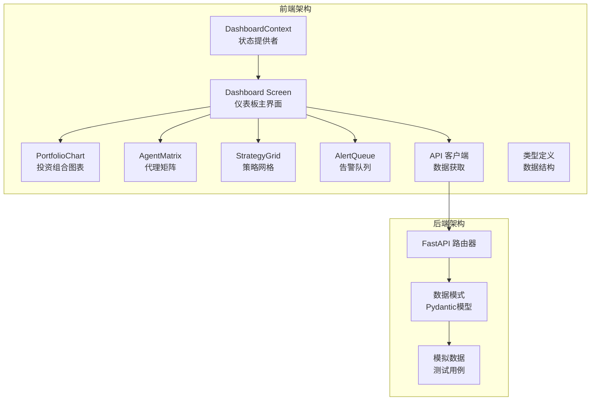

**图表来源**
- [DashboardContext.tsx:1-13](file://frontend/src/contexts/DashboardContext.tsx#L1-L13)
- [dashboard.py:1-148](file://backend/app/api/v1/dashboard.py#L1-L148)

**章节来源**
- [DashboardContext.tsx:1-13](file://frontend/src/contexts/DashboardContext.tsx#L1-L13)
- [dashboard.py:1-148](file://backend/app/api/v1/dashboard.py#L1-L148)

## 核心组件

### DashboardContext - 状态提供者

DashboardContext 是整个仪表板状态管理系统的核心，采用 React Context 模式提供状态共享能力：

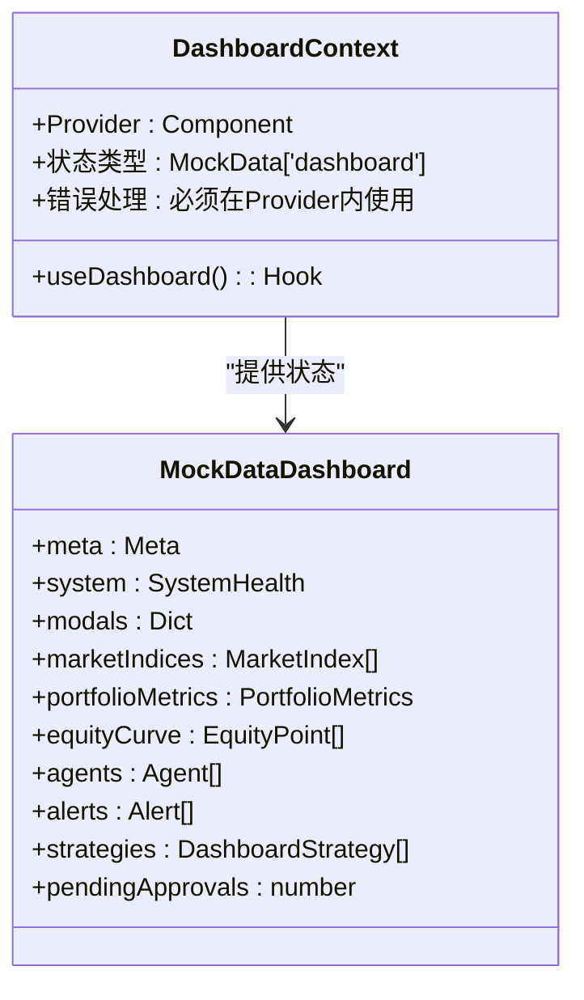

**图表来源**
- [DashboardContext.tsx:1-13](file://frontend/src/contexts/DashboardContext.tsx#L1-L13)
- [types.ts:5-45](file://frontend/src/data/types.ts#L5-L45)

DashboardContext 提供了以下关键功能：
- **状态封装**：将整个仪表板数据结构封装在单一上下文中
- **类型安全**：通过 TypeScript 类型定义确保数据完整性
- **错误处理**：强制要求在 Provider 内部使用，防止状态访问错误
- **组件集成**：为所有仪表板组件提供统一的状态访问接口

**章节来源**
- [DashboardContext.tsx:1-13](file://frontend/src/contexts/DashboardContext.tsx#L1-L13)
- [types.ts:5-45](file://frontend/src/data/types.ts#L5-L45)

### 后端数据模型

后端使用 Pydantic 模型定义了完整的仪表板数据结构：

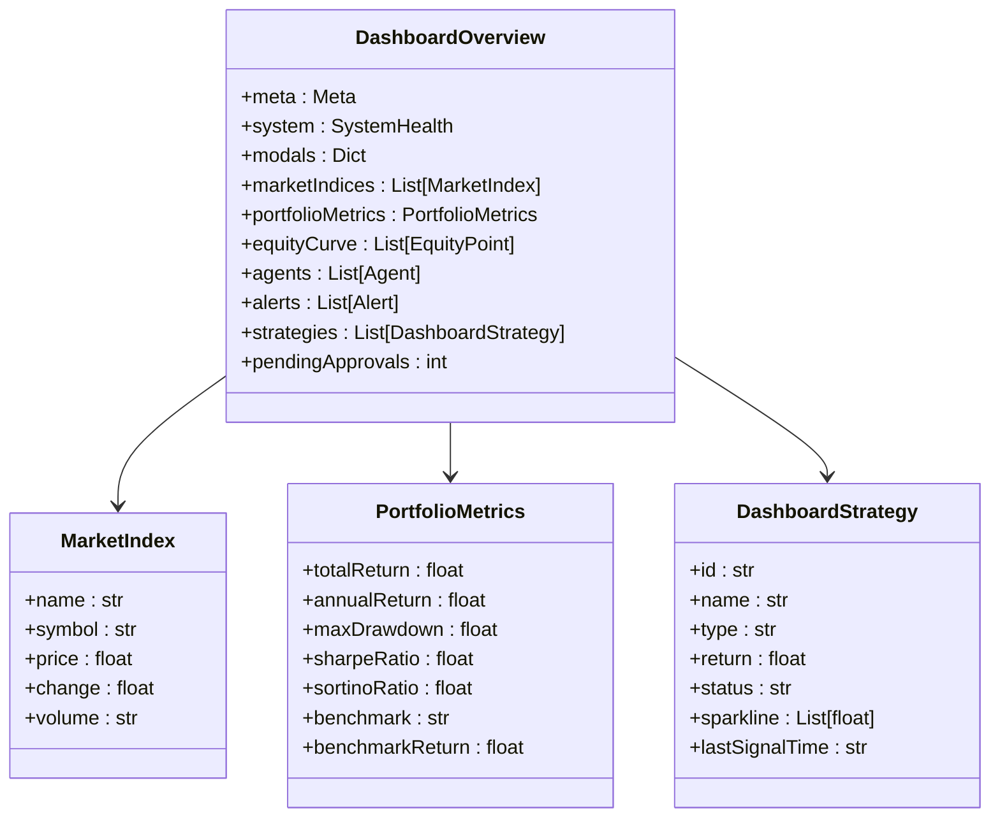

**图表来源**
- [dashboard.py:1-94](file://backend/app/schemas/dashboard.py#L1-L94)

**章节来源**
- [dashboard.py:1-94](file://backend/app/schemas/dashboard.py#L1-L94)

## 架构概览

仪表板状态管理系统的整体架构采用了分层设计模式：

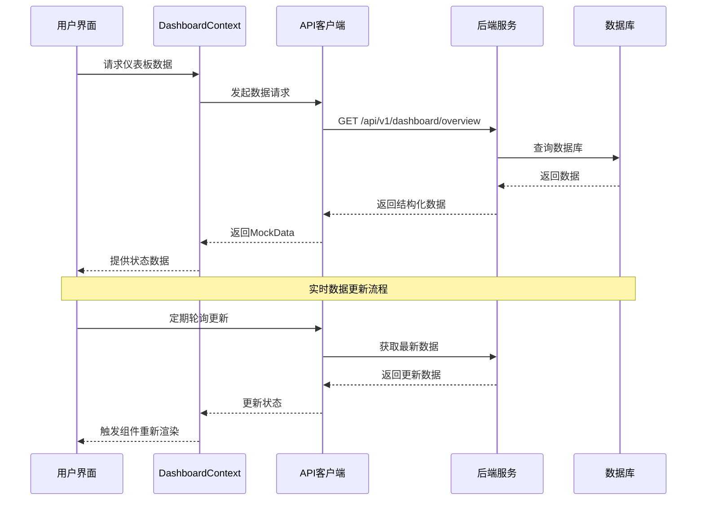

**图表来源**
- [index.tsx:17-46](file://frontend/src/screens/Dashboard/index.tsx#L17-L46)
- [api.ts:550-553](file://frontend/src/lib/api.ts#L550-L553)
- [dashboard.py:121-135](file://backend/app/api/v1/dashboard.py#L121-L135)

系统架构的关键特点：
- **前后端分离**：前端负责状态管理和用户交互，后端提供数据服务
- **类型安全**：通过 TypeScript 和 Pydantic 确保数据完整性
- **可扩展性**：模块化设计支持新功能的添加
- **实时性**：支持定期数据刷新和状态更新

## 详细组件分析

### 仪表板主界面组件

Dashboard 主界面作为状态管理的核心入口，负责协调各个子组件的状态同步：

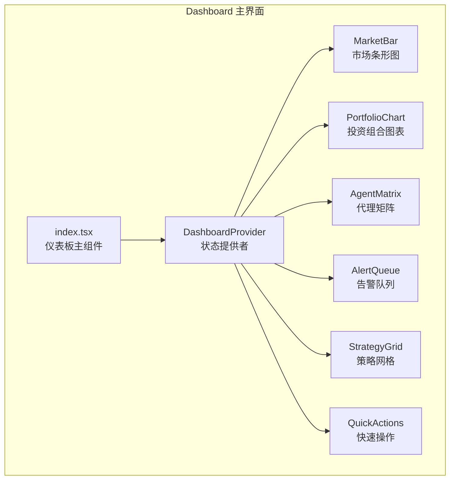

**图表来源**
- [index.tsx:1-46](file://frontend/src/screens/Dashboard/index.tsx#L1-L46)

**章节来源**
- [index.tsx:17-46](file://frontend/src/screens/Dashboard/index.tsx#L17-L46)

### 投资组合图表组件

PortfolioChart 组件展示了复杂的实时数据处理和可视化逻辑：

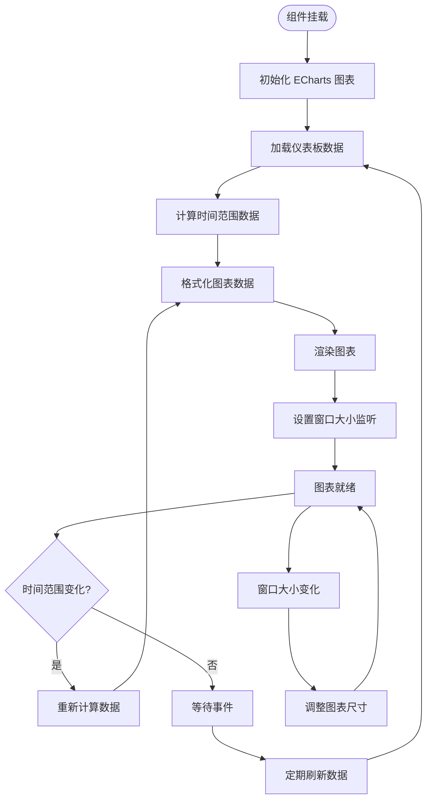

**图表来源**
- [PortfolioChart.tsx:20-177](file://frontend/src/screens/Dashboard/PortfolioChart.tsx#L20-L177)

组件特性：
- **时间范围选择**：支持 1M/3M/6M/1Y/ALL 时间范围切换
- **数据切片**：智能截取最近时间段的数据点
- **实时更新**：支持动态数据刷新和图表重绘
- **响应式设计**：自适应窗口大小变化

**章节来源**
- [PortfolioChart.tsx:20-177](file://frontend/src/screens/Dashboard/PortfolioChart.tsx#L20-L177)

### 代理矩阵组件

AgentMatrix 展示了代理状态的实时监控和可视化：

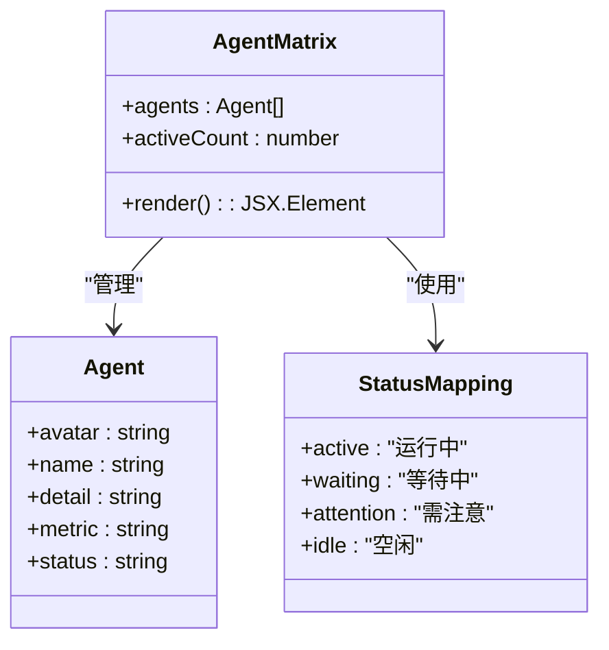

**图表来源**
- [AgentMatrix.tsx:1-44](file://frontend/src/screens/Dashboard/AgentMatrix.tsx#L1-L44)

**章节来源**
- [AgentMatrix.tsx:10-44](file://frontend/src/screens/Dashboard/AgentMatrix.tsx#L10-L44)

### 策略网格组件

StrategyGrid 实现了策略状态的可视化展示和交互：

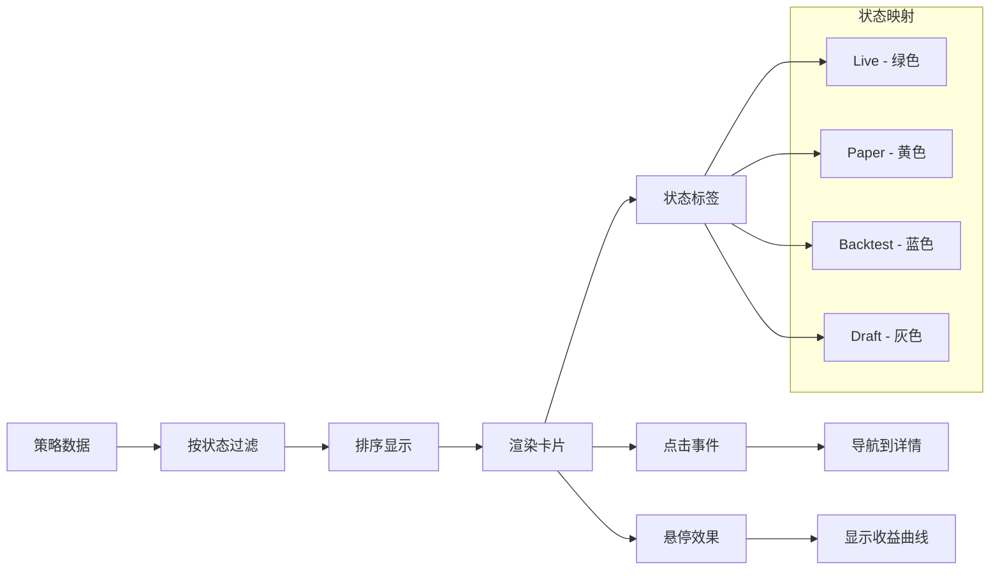

**图表来源**
- [StrategyGrid.tsx:1-91](file://frontend/src/screens/Dashboard/StrategyGrid.tsx#L1-L91)

**章节来源**
- [StrategyGrid.tsx:48-91](file://frontend/src/screens/Dashboard/StrategyGrid.tsx#L48-L91)

### 告警队列组件

AlertQueue 实现了多类型告警的分类管理和实时展示：

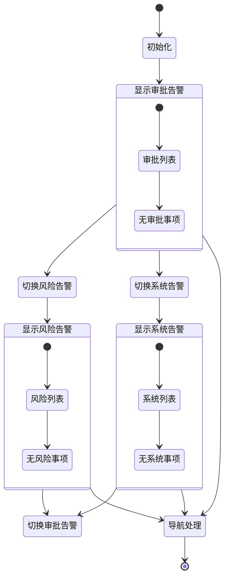

**图表来源**
- [AlertQueue.tsx:1-71](file://frontend/src/screens/Dashboard/AlertQueue.tsx#L1-L71)

**章节来源**
- [AlertQueue.tsx:16-71](file://frontend/src/screens/Dashboard/AlertQueue.tsx#L16-L71)

## 依赖关系分析

仪表板状态管理系统展现了清晰的依赖层次结构：

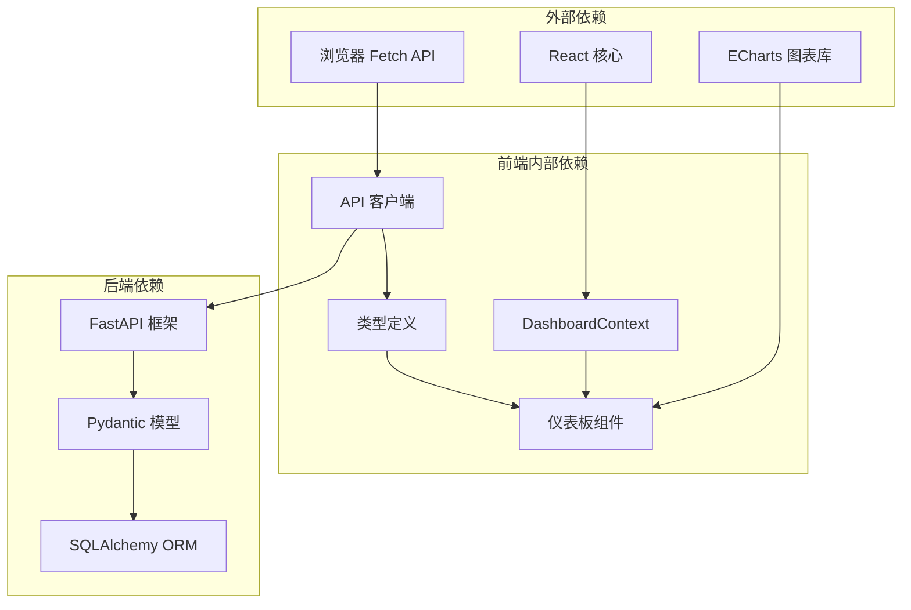

**图表来源**
- [DashboardContext.tsx:1-13](file://frontend/src/contexts/DashboardContext.tsx#L1-L13)
- [api.ts:1-779](file://frontend/src/lib/api.ts#L1-L779)
- [dashboard.py:1-148](file://backend/app/api/v1/dashboard.py#L1-L148)

**章节来源**
- [api.ts:550-553](file://frontend/src/lib/api.ts#L550-L553)
- [dashboard.py:121-135](file://backend/app/api/v1/dashboard.py#L121-L135)

## 性能考虑

### 数据缓存策略

系统采用了多层次的数据缓存机制来优化性能：

1. **组件级缓存**：每个组件维护自己的本地状态缓存
2. **API 级缓存**：API 客户端实现请求去重和缓存
3. **图表缓存**：ECharts 实例复用，避免重复初始化

### 渲染优化

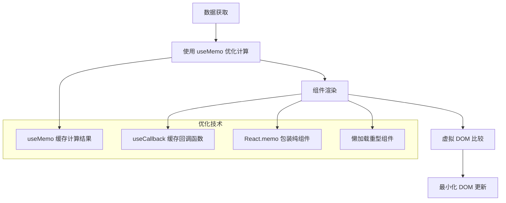

### 实时数据处理

系统通过以下机制处理大量实时数据：

- **数据分页**：后端支持数据分页和增量更新
- **数据压缩**：前端对大数据集进行压缩和优化
- **异步处理**：使用 Web Workers 处理复杂计算
- **节流控制**：限制高频数据更新频率

## 故障排除指南

### 常见问题诊断

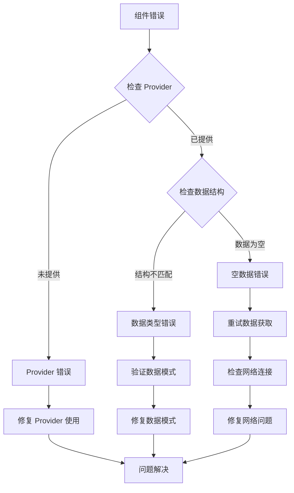

### 错误处理机制

系统实现了完善的错误处理机制：

1. **运行时错误捕获**：所有 API 调用都有错误处理
2. **状态降级**：网络错误时提供默认数据
3. **用户反馈**：友好的错误提示和恢复选项
4. **日志记录**：详细的错误日志便于调试

**章节来源**
- [DashboardContext.tsx:8-12](file://frontend/src/contexts/DashboardContext.tsx#L8-L12)
- [api.ts:32-43](file://frontend/src/lib/api.ts#L32-L43)

## 结论

llmine-quant 的仪表板状态管理系统展现了现代前端应用的最佳实践。通过精心设计的架构和实现，系统成功地解决了复杂金融界面的状态管理挑战。

### 主要成就

1. **架构清晰**：采用 React Context 模式，实现了良好的状态隔离和组件解耦
2. **类型安全**：通过 TypeScript 和 Pydantic 确保了数据完整性
3. **性能优化**：实现了多层次的缓存和渲染优化策略
4. **用户体验**：提供了流畅的实时数据更新和响应式交互

### 技术亮点

- **模块化设计**：支持功能的独立开发和测试
- **可扩展性**：易于添加新的仪表板组件和数据源
- **可维护性**：清晰的代码结构和完善的文档
- **可靠性**：全面的错误处理和状态恢复机制

该系统为金融领域的仪表板应用提供了一个优秀的参考实现，展示了如何在复杂业务场景下实现高效、可靠的状态管理。