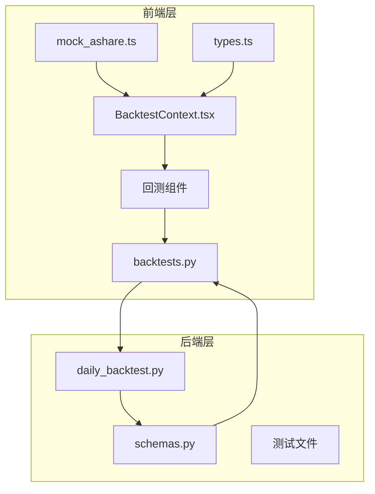
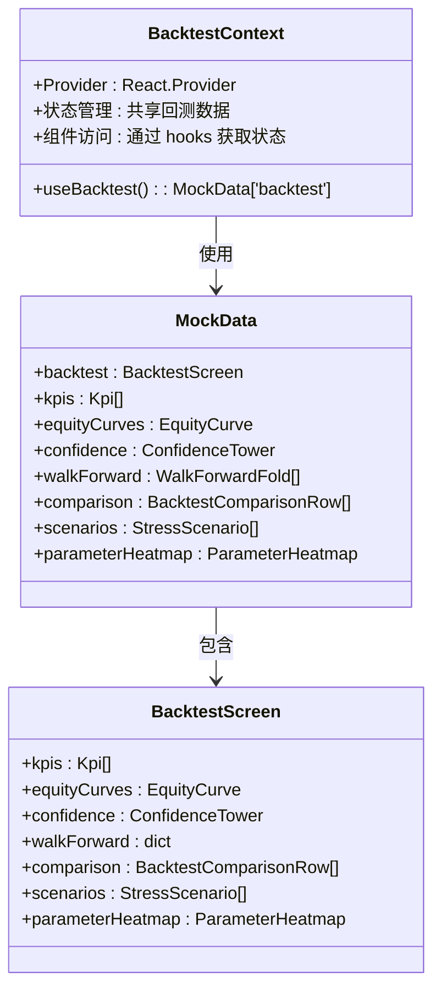
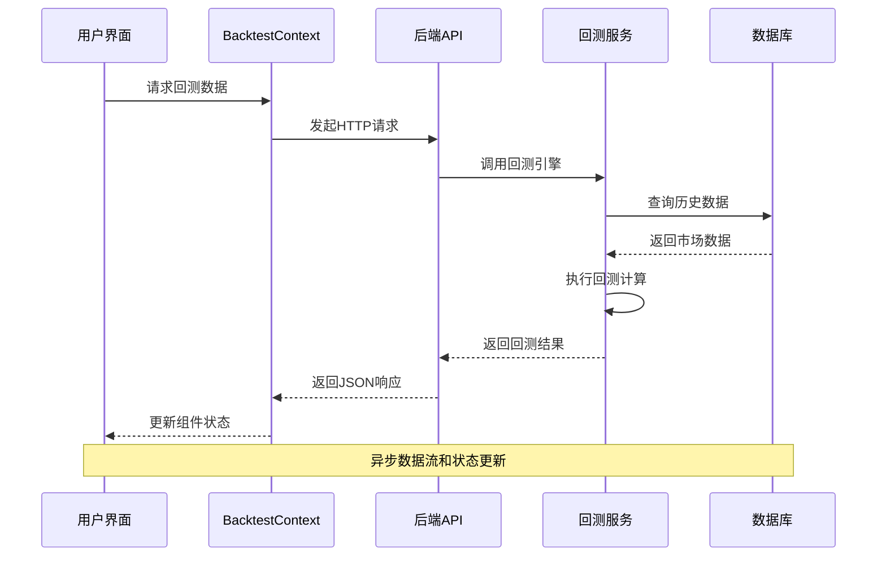
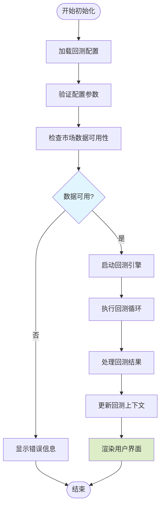
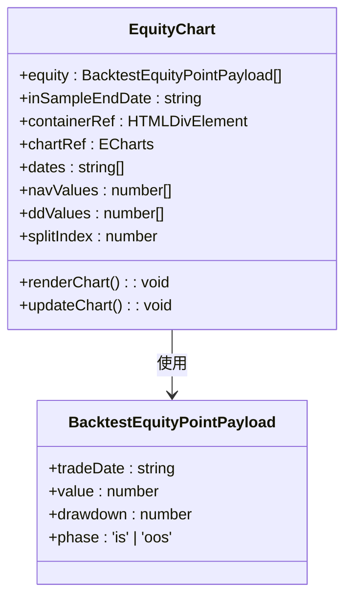
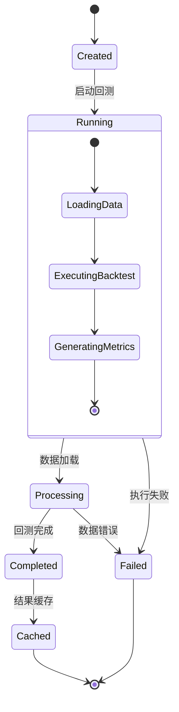
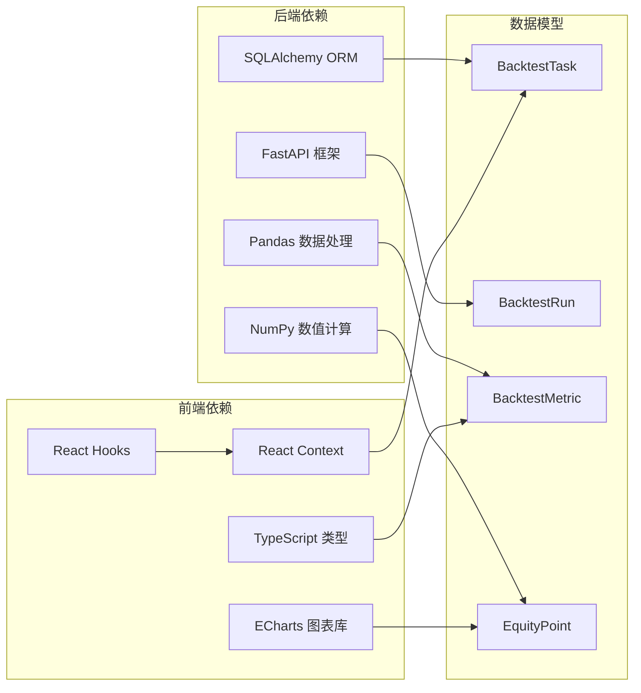
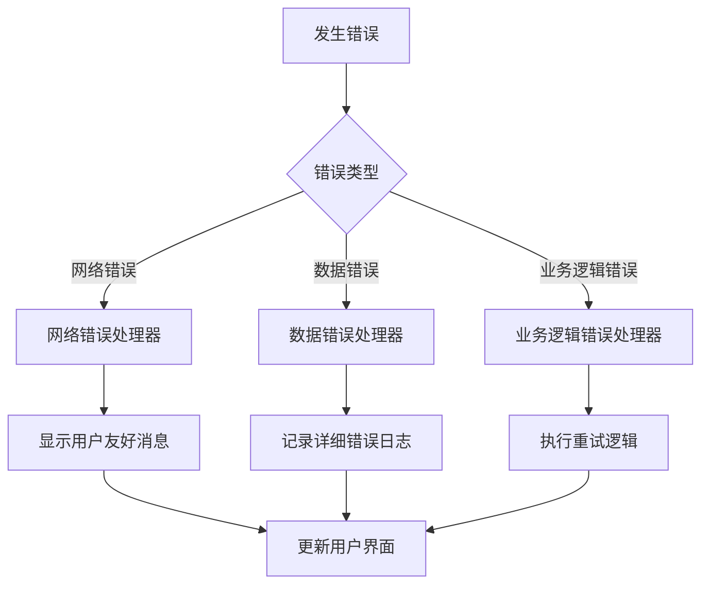

# 回测状态管理

<cite>
**本文档引用的文件**
- [BacktestContext.tsx](file://frontend/src/contexts/BacktestContext.tsx)
- [types.ts](file://frontend/src/data/types.ts)
- [mock_ashare.ts](file://frontend/src/data/mock_ashare.ts)
- [api.ts](file://frontend/src/lib/api.ts)
- [backtests.py](file://backend/app/api/v1/backtests.py)
- [daily_backtest.py](file://backend/app/services/daily_backtest.py)
- [schemas.py](file://backend/app/domains/backtest/schemas.py)
- [test_backtests.py](file://backend/tests/api/test_backtests.py)
- [test_daily_backtest.py](file://backend/tests/services/test_daily_backtest.py)
- [EquityChart.tsx](file://frontend/src/screens/Backtest/EquityChart.tsx)
- [BacktestComparison.tsx](file://frontend/src/screens/Backtest/BacktestComparison.tsx)
- [WalkForwardBars.tsx](file://frontend/src/screens/Backtest/WalkForwardBars.tsx)
- [EquityDivergence.tsx](file://frontend/src/screens/Backtest/EquityDivergence.tsx)
- [index.tsx](file://frontend/src/screens/Backtest/index.tsx)
</cite>

## 目录
1. [简介](#简介)
2. [项目结构](#项目结构)
3. [核心组件](#核心组件)
4. [架构概览](#架构概览)
5. [详细组件分析](#详细组件分析)
6. [依赖关系分析](#依赖关系分析)
7. [性能考虑](#性能考虑)
8. [故障排除指南](#故障排除指南)
9. [结论](#结论)

## 简介

llmine-quant 项目的回测状态管理系统是一个完整的前端-后端集成解决方案，负责管理量化回测任务的整个生命周期。该系统实现了从回测配置、执行、结果存储到可视化展示的全流程状态管理。

系统的核心是 BacktestContext，它提供了统一的回测状态上下文，支持多个回测组件共享和同步状态。后端通过 FastAPI API 提供回测服务，包括实时回测、样本外验证、敏感性分析等功能。

## 项目结构

回测状态管理系统跨越前后端两个主要部分：

**图表来源**
- [BacktestContext.tsx:1-13](file://frontend/src/contexts/BacktestContext.tsx#L1-L13)
- [types.ts:1-647](file://frontend/src/data/types.ts#L1-L647)
- [mock_ashare.ts:1-800](file://frontend/src/data/mock_ashare.ts#L1-L800)
- [api.ts:1-779](file://frontend/src/lib/api.ts#L1-L779)

**章节来源**
- [BacktestContext.tsx:1-13](file://frontend/src/contexts/BacktestContext.tsx#L1-L13)
- [types.ts:1-647](file://frontend/src/data/types.ts#L1-L647)
- [mock_ashare.ts:1-800](file://frontend/src/data/mock_ashare.ts#L1-L800)

## 核心组件

### BacktestContext - 回测状态上下文

BacktestContext 是整个回测状态管理系统的核心，它提供了一个 React Context 来管理回测相关的全局状态。

**图表来源**
- [BacktestContext.tsx:1-13](file://frontend/src/contexts/BacktestContext.tsx#L1-L13)
- [types.ts:77-125](file://frontend/src/data/types.ts#L77-L125)
- [schemas.py:83-91](file://backend/app/domains/backtest/schemas.py#L83-L91)

### 回测数据结构

系统定义了完整的回测数据结构，包括关键指标、曲线数据、置信度评估等：

**章节来源**
- [types.ts:77-125](file://frontend/src/data/types.ts#L77-L125)
- [schemas.py:10-91](file://backend/app/domains/backtest/schemas.py#L10-L91)

## 架构概览

回测状态管理系统采用分层架构设计，实现了清晰的职责分离：

**图表来源**
- [api.ts:618-667](file://frontend/src/lib/api.ts#L618-L667)
- [backtests.py:1-200](file://backend/app/api/v1/backtests.py#L1-L200)
- [daily_backtest.py:185-200](file://backend/app/services/daily_backtest.py#L185-L200)

## 详细组件分析

### 回测状态初始化流程

回测状态的初始化过程涉及多个步骤，从用户配置到最终状态渲染：

**图表来源**
- [index.tsx:81-114](file://frontend/src/screens/Backtest/index.tsx#L81-L114)
- [daily_backtest.py:191-200](file://backend/app/services/daily_backtest.py#L191-L200)

### 回测结果缓存策略

系统实现了多层次的结果缓存机制：

1. **前端缓存**: 使用 React Context 缓存最近的回测结果
2. **API 缓存**: 后端 API 层面的响应缓存
3. **数据库持久化**: 关键回测结果的持久化存储

**章节来源**
- [backtests.py:1117-1159](file://backend/app/api/v1/backtests.py#L1117-L1159)
- [daily_backtest.py:346-371](file://backend/app/services/daily_backtest.py#L346-L371)

### 可视化状态管理

系统提供了多种可视化组件来展示回测结果：

#### EquityChart - 净值曲线图表

**图表来源**
- [EquityChart.tsx:1-30](file://frontend/src/screens/Backtest/EquityChart.tsx#L1-L30)
- [api.ts:148-153](file://frontend/src/lib/api.ts#L148-L153)

#### BacktestComparison - 回测对比表格

BacktestComparison 组件实现了复杂的排序和筛选功能：

**章节来源**
- [BacktestComparison.tsx:1-176](file://frontend/src/screens/Backtest/BacktestComparison.tsx#L1-L176)

### 回测任务状态跟踪

系统实现了完整的回测任务生命周期管理：

**图表来源**
- [daily_backtest.py:366-371](file://backend/app/services/daily_backtest.py#L366-L371)

## 依赖关系分析

回测状态管理系统的关键依赖关系如下：

**图表来源**
- [backtests.py:11-20](file://backend/app/api/v1/backtests.py#L11-L20)
- [schemas.py:11-27](file://backend/app/domains/backtest/schemas.py#L11-L27)

**章节来源**
- [backtests.py:1-200](file://backend/app/api/v1/backtests.py#L1-L200)
- [schemas.py:1-350](file://backend/app/domains/backtest/schemas.py#L1-L350)

## 性能考虑

### 内存管理最佳实践

1. **组件卸载清理**: 所有图表组件都实现了适当的清理机制
2. **状态更新优化**: 使用 React.memo 和 useMemo 优化渲染性能
3. **数据分页**: 大量回测结果采用分页加载策略

### 异步更新处理

系统采用了多种异步更新策略：

1. **WebSocket 实时更新**: 支持回测任务的实时状态推送
2. **轮询机制**: 对于不支持 WebSocket 的场景提供轮询替代
3. **增量更新**: 只更新发生变化的数据点

**章节来源**
- [EquityChart.tsx:28-30](file://frontend/src/screens/Backtest/EquityChart.tsx#L28-L30)
- [api.ts:618-667](file://frontend/src/lib/api.ts#L618-L667)

## 故障排除指南

### 常见问题及解决方案

1. **回测数据缺失**: 检查市场数据源连接和数据完整性
2. **内存溢出**: 实施数据分页和组件清理机制
3. **性能问题**: 优化图表渲染和状态更新频率

### 错误处理机制

系统实现了多层次的错误处理：

**图表来源**
- [api.ts:32-43](file://frontend/src/lib/api.ts#L32-L43)
- [daily_backtest.py:29-31](file://backend/app/services/daily_backtest.py#L29-L31)

**章节来源**
- [api.ts:27-43](file://frontend/src/lib/api.ts#L27-L43)
- [daily_backtest.py:29-31](file://backend/app/services/daily_backtest.py#L29-L31)

## 结论

llmine-quant 的回测状态管理系统展现了现代量化金融应用的最佳实践。通过合理的架构设计、完善的状态管理机制和丰富的可视化组件，系统为用户提供了一个强大而易用的回测平台。

系统的成功关键在于：

1. **清晰的架构分层**: 前后端职责明确，接口设计合理
2. **完整的状态管理**: 从配置到结果的全生命周期状态跟踪
3. **优秀的用户体验**: 丰富的可视化组件和流畅的交互体验
4. **可靠的性能保障**: 多层次的缓存和优化策略

该系统为后续的功能扩展和维护奠定了坚实的基础，是量化金融领域回测系统设计的优秀范例。