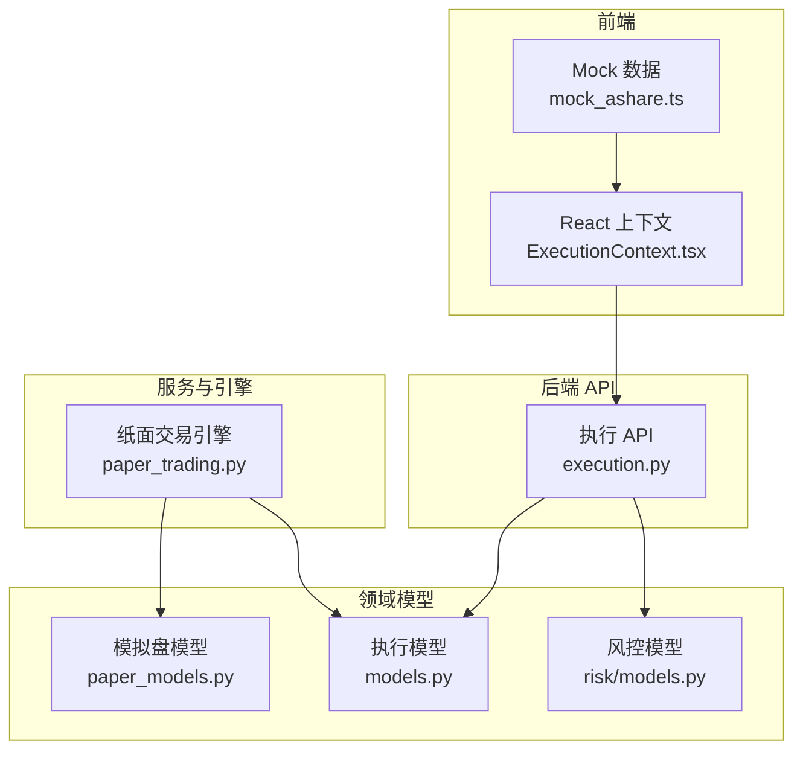
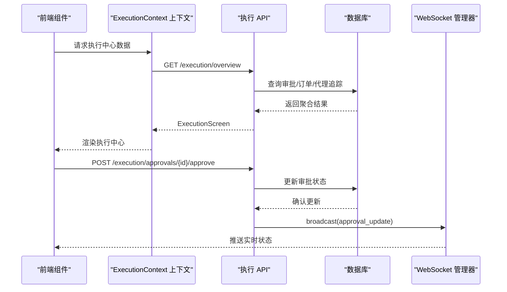
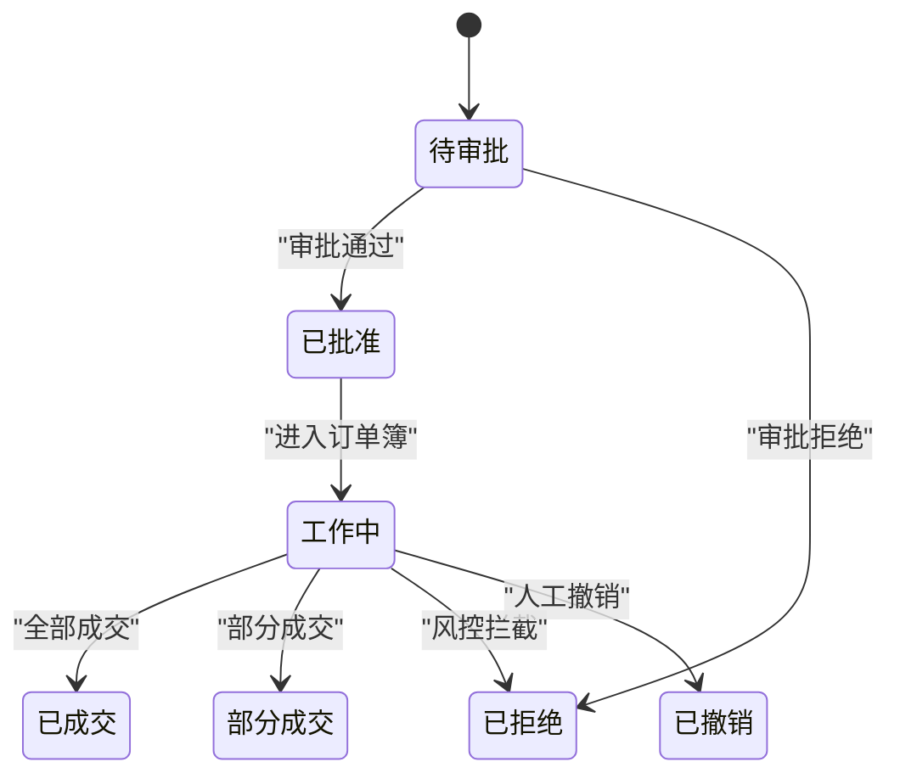
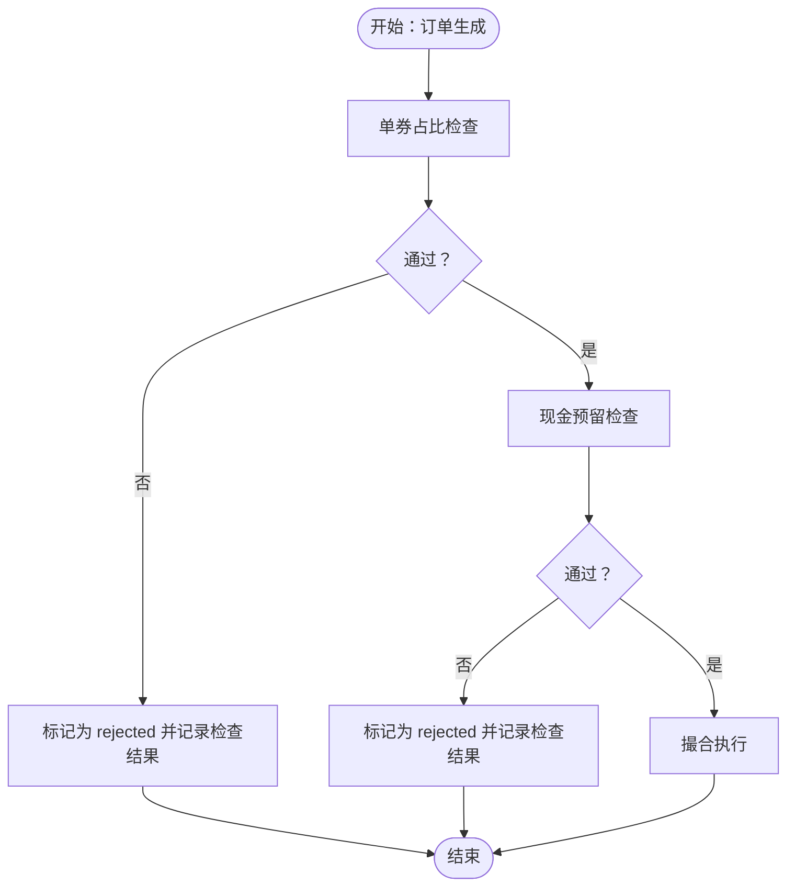
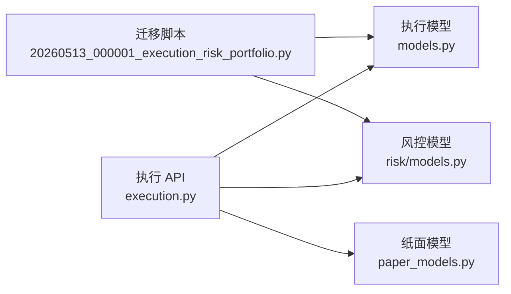

# 执行状态管理

<cite>
**本文引用的文件**
- [backend/app/api/v1/execution.py](file://backend/app/api/v1/execution.py)
- [backend/app/domains/execution/models.py](file://backend/app/domains/execution/models.py)
- [backend/app/domains/execution/schemas.py](file://backend/app/domains/execution/schemas.py)
- [backend/app/domains/execution/paper_models.py](file://backend/app/domains/execution/paper_models.py)
- [backend/app/domains/execution/paper_schemas.py](file://backend/app/domains/execution/paper_schemas.py)
- [backend/app/services/paper_trading.py](file://backend/app/services/paper_trading.py)
- [backend/app/domains/risk/models.py](file://backend/app/domains/risk/models.py)
- [backend/app/domains/risk/schemas.py](file://backend/app/domains/risk/schemas.py)
- [backend/app/db/migrations/versions/20260513_000001_execution_risk_portfolio.py](file://backend/app/db/migrations/versions/20260513_000001_execution_risk_portfolio.py)
- [frontend/src/contexts/ExecutionContext.tsx](file://frontend/src/contexts/ExecutionContext.tsx)
- [frontend/src/data/mock_ashare.ts](file://frontend/src/data/mock_ashare.ts)
</cite>

## 目录
1. [简介](#简介)
2. [项目结构](#项目结构)
3. [核心组件](#核心组件)
4. [架构总览](#架构总览)
5. [组件详解](#组件详解)
6. [依赖关系分析](#依赖关系分析)
7. [性能考量](#性能考量)
8. [故障排查指南](#故障排查指南)
9. [结论](#结论)
10. [附录](#附录)

## 简介
本文件聚焦 llmine-quant 后端“执行状态管理”子系统，围绕 ExecutionContext 的设计与实现展开，系统化解析交易执行相关的状态数据结构、订单状态管理、风控检查状态处理、订单生命周期跟踪、预交易检查状态管理、实时执行状态更新机制，以及初始化流程、状态变更监听与风控状态同步方式。文档同时提供在订单簿与预交易检查等前端组件中使用执行状态的参考路径，并总结可靠性保障与用户体验优化的最佳实践。

## 项目结构
执行状态管理由“数据库模型/模式 + API 层 + 业务引擎 + 前端上下文”构成，覆盖实盘与模拟盘两条主线，辅以风控域模型支撑。

图表来源
- [frontend/src/contexts/ExecutionContext.tsx:1-13](file://frontend/src/contexts/ExecutionContext.tsx#L1-L13)
- [backend/app/api/v1/execution.py:1-281](file://backend/app/api/v1/execution.py#L1-L281)
- [backend/app/domains/execution/models.py:1-103](file://backend/app/domains/execution/models.py#L1-L103)
- [backend/app/domains/risk/models.py:1-101](file://backend/app/domains/risk/models.py#L1-L101)
- [backend/app/domains/execution/paper_models.py:1-133](file://backend/app/domains/execution/paper_models.py#L1-L133)
- [backend/app/services/paper_trading.py:1-634](file://backend/app/services/paper_trading.py#L1-L634)

章节来源
- [backend/app/api/v1/execution.py:1-281](file://backend/app/api/v1/execution.py#L1-L281)
- [backend/app/domains/execution/models.py:1-103](file://backend/app/domains/execution/models.py#L1-L103)
- [backend/app/domains/execution/schemas.py:1-107](file://backend/app/domains/execution/schemas.py#L1-L107)
- [backend/app/domains/execution/paper_models.py:1-133](file://backend/app/domains/execution/paper_models.py#L1-L133)
- [backend/app/domains/execution/paper_schemas.py:1-111](file://backend/app/domains/execution/paper_schemas.py#L1-L111)
- [backend/app/domains/risk/models.py:1-101](file://backend/app/domains/risk/models.py#L1-L101)
- [backend/app/domains/risk/schemas.py:1-96](file://backend/app/domains/risk/schemas.py#L1-L96)
- [backend/app/db/migrations/versions/20260513_000001_execution_risk_portfolio.py:1-316](file://backend/app/db/migrations/versions/20260513_000001_execution_risk_portfolio.py#L1-L316)
- [frontend/src/contexts/ExecutionContext.tsx:1-13](file://frontend/src/contexts/ExecutionContext.tsx#L1-L13)
- [frontend/src/data/mock_ashare.ts:1-200](file://frontend/src/data/mock_ashare.ts#L1-L200)

## 核心组件
- 执行域模型与模式
  - 审批、订单、成交、执行指标、预交易检查、代理追踪等模型与输出模式定义清晰，支持前端“执行中心”页面的数据结构。
- 执行 API
  - 提供执行概览、审批列表、审批通过/拒绝等接口；内置静态的预交易检查与执行指标用于演示。
- 纸面交易引擎
  - 完整实现“标记-信号-预检查-撮合-净值”端到端流程，覆盖订单状态机（pending → filled/partial/rejected/canceled）与风控拦截。
- 风控域模型
  - 规则、检查、预算、VaR、熔断器、违规事件、策略决策等，支撑风控状态同步与可视化。
- 前端上下文
  - React 上下文提供执行态数据注入，配合 Mock 数据驱动执行中心界面。

章节来源
- [backend/app/domains/execution/models.py:9-103](file://backend/app/domains/execution/models.py#L9-L103)
- [backend/app/domains/execution/schemas.py:6-107](file://backend/app/domains/execution/schemas.py#L6-L107)
- [backend/app/api/v1/execution.py:188-281](file://backend/app/api/v1/execution.py#L188-L281)
- [backend/app/services/paper_trading.py:76-135](file://backend/app/services/paper_trading.py#L76-L135)
- [backend/app/domains/risk/models.py:9-101](file://backend/app/domains/risk/models.py#L9-L101)
- [frontend/src/contexts/ExecutionContext.tsx:1-13](file://frontend/src/contexts/ExecutionContext.tsx#L1-L13)

## 架构总览
执行状态管理采用“API 聚合 + 领域模型 + 引擎执行 + 风控联动”的分层架构。前端通过上下文消费后端聚合的执行中心数据，后端通过 API 路由汇总审批、订单、预交易检查与代理追踪，并在审批通过/拒绝时通过 WebSocket 广播状态变更。

图表来源
- [backend/app/api/v1/execution.py:188-250](file://backend/app/api/v1/execution.py#L188-L250)
- [frontend/src/contexts/ExecutionContext.tsx:1-13](file://frontend/src/contexts/ExecutionContext.tsx#L1-L13)

## 组件详解

### 订单生命周期与状态机
- 订单状态
  - 实盘订单状态包括 working、filled、partial、rejected、canceled；模拟盘 PaperOrder 状态包括 pending、approved、filled、partial、rejected、canceled。
- 生命周期关键节点
  - 创建：订单写入，状态 pending（模拟盘）或 working（实盘）。
  - 预检查：通过风控拦截则 rejected，否则进入执行阶段。
  - 执行：按市价/限价撮合，更新 filled_qty、slippage_bps、pnl 等。
  - 结算：根据成交记录生成 Fill，更新账户与持仓。
- 状态变更监听
  - 审批通过/拒绝通过 WebSocket 广播，前端即时刷新。

图表来源
- [backend/app/domains/execution/models.py:34-49](file://backend/app/domains/execution/models.py#L34-L49)
- [backend/app/domains/execution/paper_models.py:51-69](file://backend/app/domains/execution/paper_models.py#L51-L69)
- [backend/app/api/v1/execution.py:223-250](file://backend/app/api/v1/execution.py#L223-L250)

章节来源
- [backend/app/domains/execution/models.py:34-49](file://backend/app/domains/execution/models.py#L34-L49)
- [backend/app/domains/execution/paper_models.py:51-69](file://backend/app/domains/execution/paper_models.py#L51-L69)
- [backend/app/api/v1/execution.py:223-250](file://backend/app/api/v1/execution.py#L223-L250)

### 预交易检查与风控状态
- 预交易检查
  - 执行 API 内置一组示例检查项（如个股集中度、行业集中度、单日亏损、净敞口、VaR），返回统一结构供前端渲染。
- 纸面交易引擎中的预检查
  - 单券上限、现金预留等硬规则直接拒绝订单并记录 PaperPreTradeCheck。
- 风控状态同步
  - 风控域模型提供规则、检查、预算、VaR、熔断器、违规事件等，支持与执行状态联动展示。

图表来源
- [backend/app/api/v1/execution.py:43-49](file://backend/app/api/v1/execution.py#L43-L49)
- [backend/app/services/paper_trading.py:314-372](file://backend/app/services/paper_trading.py#L314-L372)

章节来源
- [backend/app/api/v1/execution.py:43-49](file://backend/app/api/v1/execution.py#L43-L49)
- [backend/app/services/paper_trading.py:314-372](file://backend/app/services/paper_trading.py#L314-L372)
- [backend/app/domains/risk/models.py:9-101](file://backend/app/domains/risk/models.py#L9-L101)

### 执行指标与可视化
- 执行指标
  - 包括滑点分布（平均/中位/95分位）、成交率（总/已成交/部分/拒绝/撤销）、拒单原因统计等。
- 前端渲染
  - ExecutionScreen 聚合汇总、审批、预交易检查、订单簿、指标与代理追踪，形成执行中心视图。

章节来源
- [backend/app/domains/execution/schemas.py:85-107](file://backend/app/domains/execution/schemas.py#L85-L107)
- [backend/app/api/v1/execution.py:51-70](file://backend/app/api/v1/execution.py#L51-L70)
- [backend/app/api/v1/execution.py:188-202](file://backend/app/api/v1/execution.py#L188-L202)

### 审批与人工干预
- 审批状态
  - pending、approved、rejected、expired；支持按 urgency 过滤与分页查询。
- 审批操作
  - 通过/拒绝接口校验状态一致性，更新审批状态并记录审计日志，随后广播给前端。

章节来源
- [backend/app/domains/execution/models.py:9-32](file://backend/app/domains/execution/models.py#L9-L32)
- [backend/app/api/v1/execution.py:205-281](file://backend/app/api/v1/execution.py#L205-L281)

### 纸面交易引擎（Paper Trading）
- 端到端流程
  - 标记（更新持仓最新价与市值）→ 信号（策略生成目标权重）→ 预检查（硬规则拦截）→ 撮合（按成本模型成交）→ 净值（计算每日净值、收益、回撤）。
- 关键状态
  - PaperOrder：pending → filled/partial/rejected/canceled；PaperPreTradeCheck：pass/warn/fail；PaperRiskBreach：ongoing/resolved 等。
- 成本与滑点
  - 使用 BacktestCostConfig 计算佣金、印花税、滑点，确保与研究回测一致。

章节来源
- [backend/app/services/paper_trading.py:76-135](file://backend/app/services/paper_trading.py#L76-L135)
- [backend/app/domains/execution/paper_models.py:51-133](file://backend/app/domains/execution/paper_models.py#L51-L133)
- [backend/app/domains/execution/paper_schemas.py:95-111](file://backend/app/domains/execution/paper_schemas.py#L95-L111)

### 前端执行上下文与 Mock 数据
- 上下文
  - ExecutionContext 提供执行态数据 Provider 与 Hook，要求在 Provider 内部使用。
- Mock 数据
  - mock_ashare.ts 提供执行中心、仪表盘、告警等 Mock 数据，便于前端联调与原型展示。

章节来源
- [frontend/src/contexts/ExecutionContext.tsx:1-13](file://frontend/src/contexts/ExecutionContext.tsx#L1-L13)
- [frontend/src/data/mock_ashare.ts:1-200](file://frontend/src/data/mock_ashare.ts#L1-L200)

## 依赖关系分析
- 数据库迁移
  - 执行、风控、组合相关表在迁移脚本中一次性创建，索引覆盖常用过滤字段（如审批状态、订单账户/符号、风控资源类型/ID 等）。
- API 对模型的依赖
  - 执行 API 直接依赖执行域模型与模式，同时引入审计服务与 WebSocket 管理器以实现状态广播。
- 引擎对模型的依赖
  - 纸面交易引擎依赖执行域与策略运行时、市场数据模型，以及成本配置，确保撮合与结算逻辑可复用研究回测成本函数。

图表来源
- [backend/app/db/migrations/versions/20260513_000001_execution_risk_portfolio.py:32-218](file://backend/app/db/migrations/versions/20260513_000001_execution_risk_portfolio.py#L32-L218)
- [backend/app/api/v1/execution.py:1-281](file://backend/app/api/v1/execution.py#L1-L281)
- [backend/app/domains/execution/models.py:1-103](file://backend/app/domains/execution/models.py#L1-L103)
- [backend/app/domains/execution/paper_models.py:1-133](file://backend/app/domains/execution/paper_models.py#L1-L133)
- [backend/app/domains/risk/models.py:1-101](file://backend/app/domains/risk/models.py#L1-L101)

章节来源
- [backend/app/db/migrations/versions/20260513_000001_execution_risk_portfolio.py:32-218](file://backend/app/db/migrations/versions/20260513_000001_execution_risk_portfolio.py#L32-L218)
- [backend/app/api/v1/execution.py:1-281](file://backend/app/api/v1/execution.py#L1-L281)

## 性能考量
- 查询与排序
  - 订单与审批查询按时间倒序并限制数量，避免大结果集导致延迟。
- 索引设计
  - 审批/订单/风控等表对高频过滤字段建立索引，提升筛选效率。
- 广播与增量更新
  - 审批状态变更通过 WebSocket 广播，减少轮询开销，提升前端响应速度。
- 成本计算
  - 纸面交易引擎的成本计算在内存中完成，避免额外 IO；滑点、佣金、印花税按固定配置计算，确保一致性与可预测性。

## 故障排查指南
- 审批状态异常
  - 若审批状态非 pending，审批/拒绝接口会返回冲突错误；请先刷新审批列表，确认状态后再操作。
- 订单未成交
  - 检查预交易检查是否拦截（模拟盘）或风控规则是否触发（实盘）；查看 ExecutionScreen 中的预交易检查与代理追踪。
- 端到端核对
  - 纸面交易引擎：确认账户状态为 active、交易日未重复处理、历史 K 线存在；核对目标权重与可买/可卖标志。
- 风控联动
  - 查看风控域模型中的规则、检查、预算、VaR、熔断器与违规事件，定位触发点与处置状态。

章节来源
- [backend/app/api/v1/execution.py:223-281](file://backend/app/api/v1/execution.py#L223-L281)
- [backend/app/services/paper_trading.py:82-135](file://backend/app/services/paper_trading.py#L82-L135)
- [backend/app/domains/risk/models.py:9-101](file://backend/app/domains/risk/models.py#L9-L101)

## 结论
执行状态管理通过清晰的领域模型、稳健的 API 聚合、可扩展的纸面交易引擎与完善的风控联动，实现了从审批、订单、预检查到成交、净值的全链路可观测与可治理。前端通过上下文与 Mock 数据快速集成，后端通过广播与索引优化保障实时性与性能。建议在生产环境中进一步完善动态风控规则、审计与告警、以及更细粒度的执行指标采集与可视化。

## 附录

### 常用代码片段路径参考
- 执行概览聚合
  - [GET /execution/overview:188-202](file://backend/app/api/v1/execution.py#L188-L202)
- 审批列表与过滤
  - [GET /execution/approvals:205-221](file://backend/app/api/v1/execution.py#L205-L221)
- 审批通过/拒绝
  - [POST /execution/approvals/{approval_id}/approve:223-250](file://backend/app/api/v1/execution.py#L223-L250)
  - [POST /execution/approvals/{approval_id}/reject:253-281](file://backend/app/api/v1/execution.py#L253-L281)
- 订单簿查询
  - [内部方法 _get_order_book:116-136](file://backend/app/api/v1/execution.py#L116-L136)
- 预交易检查（静态示例）
  - [静态常量 _PRE_TRADE_CHECKS:43-49](file://backend/app/api/v1/execution.py#L43-L49)
- 纸面交易端到端
  - [PaperTradingEngine.run_end_of_day:82-135](file://backend/app/services/paper_trading.py#L82-L135)
- 纸面订单状态机
  - [PaperOrder 状态定义:51-69](file://backend/app/domains/execution/paper_models.py#L51-L69)
- 风控规则与检查
  - [RiskRule/RiskCheck 模型:9-32](file://backend/app/domains/risk/models.py#L9-L32)
- 前端上下文与 Mock 数据
  - [ExecutionContext 上下文:1-13](file://frontend/src/contexts/ExecutionContext.tsx#L1-L13)
  - [Mock 数据入口:1-200](file://frontend/src/data/mock_ashare.ts#L1-L200)