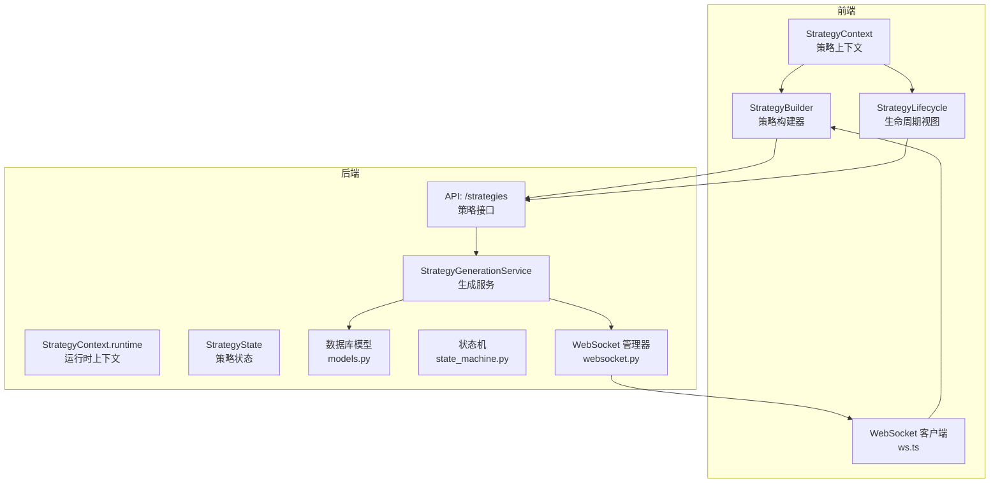
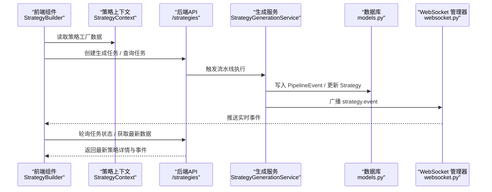
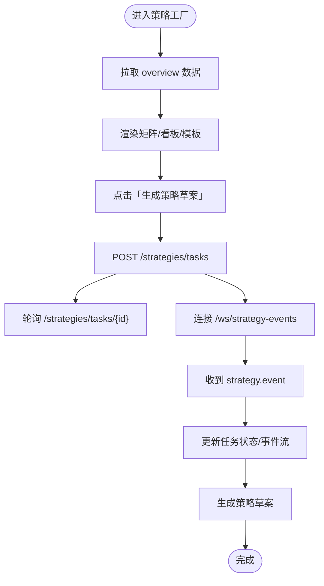
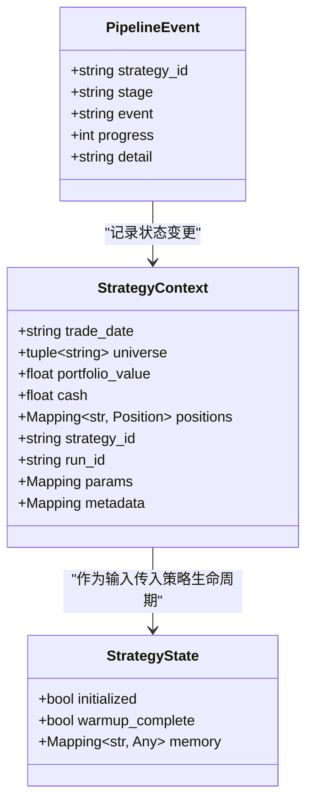
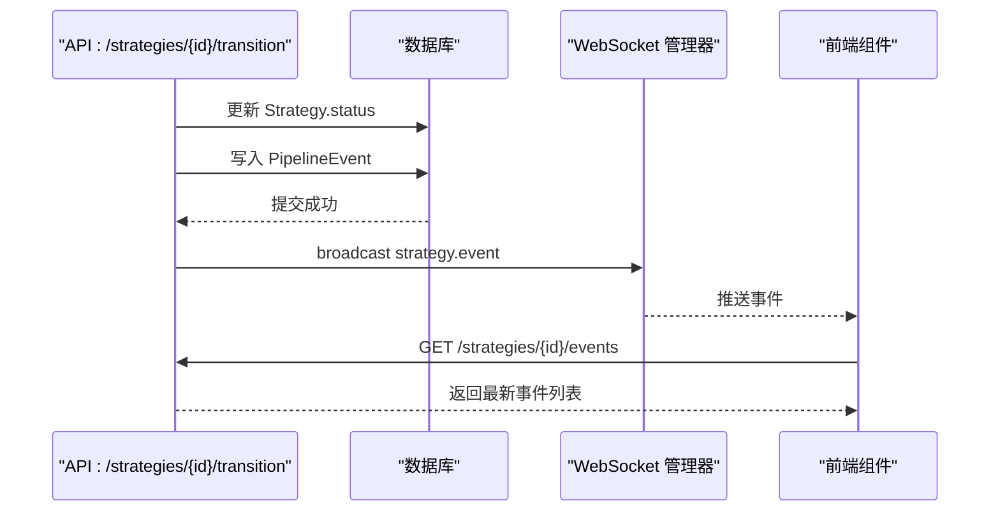
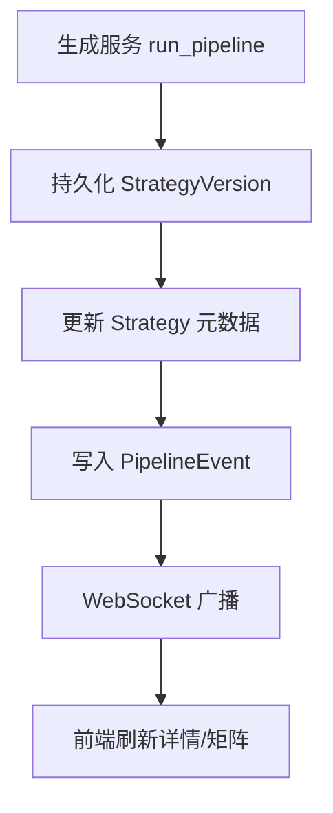
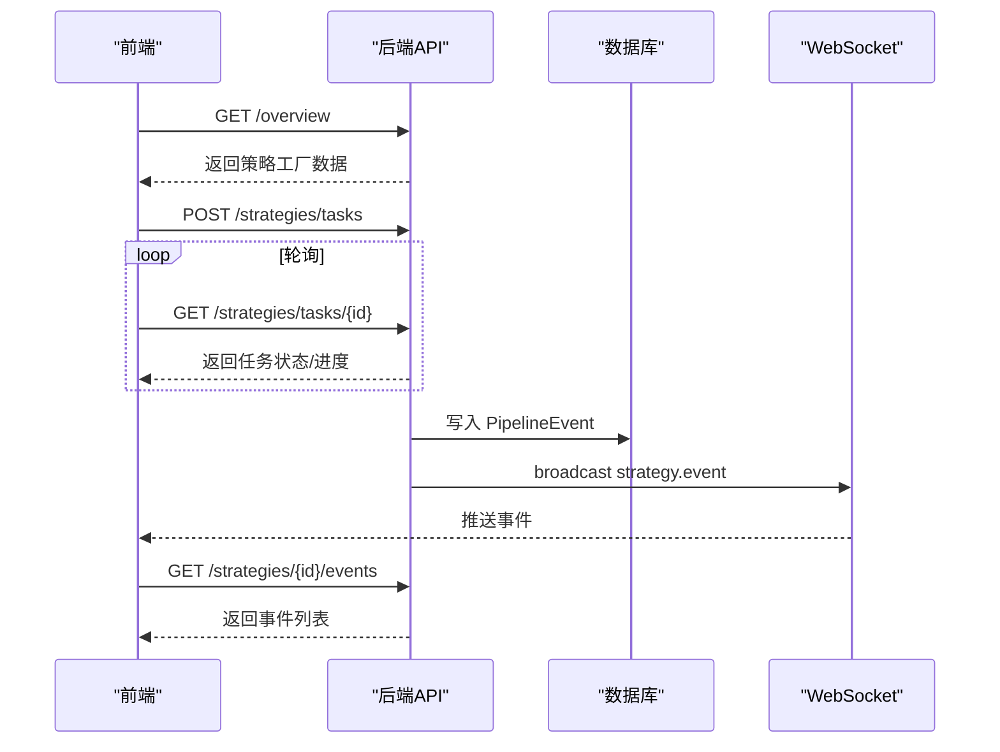
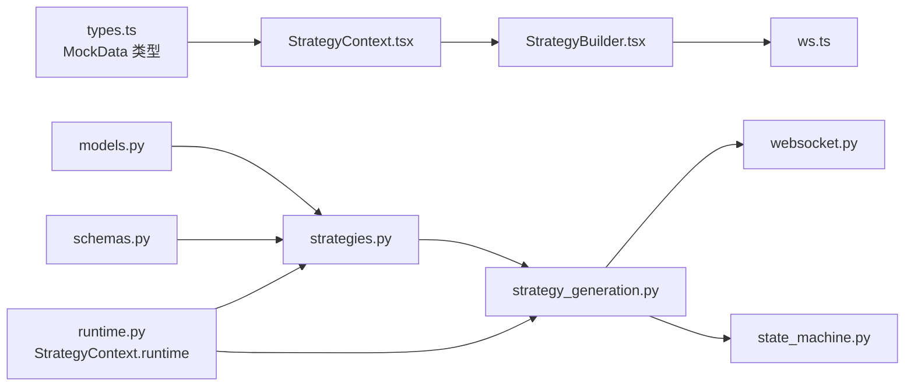

# 策略状态管理

<cite>
**本文档引用的文件**
- [StrategyContext.tsx](file://frontend/src/contexts/StrategyContext.tsx)
- [types.ts](file://frontend/src/data/types.ts)
- [StrategyBuilder.tsx](file://frontend/src/screens/Strategy/StrategyBuilder.tsx)
- [StrategyLifecycle.tsx](file://frontend/src/screens/Strategy/StrategyLifecycle.tsx)
- [index.tsx](file://frontend/src/screens/Strategy/index.tsx)
- [ws.ts](file://frontend/src/lib/ws.ts)
- [runtime.py](file://backend/app/domains/strategy/runtime.py)
- [models.py](file://backend/app/domains/strategy/models.py)
- [schemas.py](file://backend/app/domains/strategy/schemas.py)
- [state_machine.py](file://backend/app/domains/strategy/state_machine.py)
- [strategies.py](file://backend/app/api/v1/strategies.py)
- [strategy_generation.py](file://backend/app/services/strategy_generation.py)
- [websocket.py](file://backend/app/core/websocket.py)
</cite>

## 目录
1. [引言](#引言)
2. [项目结构](#项目结构)
3. [核心组件](#核心组件)
4. [架构总览](#架构总览)
5. [详细组件分析](#详细组件分析)
6. [依赖关系分析](#依赖关系分析)
7. [性能考虑](#性能考虑)
8. [故障排除指南](#故障排除指南)
9. [结论](#结论)

## 引言
本文件聚焦于 llmine-quant 项目中的策略状态管理组件，围绕前端策略上下文（StrategyContext）与后端策略生命周期（StrategyContext.runtime）展开，系统性阐述策略状态的数据结构、状态更新逻辑、组件间数据流、生命周期管理、版本控制与持久化、初始化流程、状态变更监听与异步更新机制，并给出最佳实践与性能优化建议。目标是帮助开发者在策略构建器与策略生命周期组件中正确使用策略状态，理解状态订阅与更新的完整链路。

## 项目结构
策略状态管理涉及前后端协同：
- 前端：React Context 提供策略全局状态，WebSocket 实时接收事件，组件负责渲染与交互。
- 后端：策略生命周期状态（StrategyState）与运行时上下文（StrategyContext）定义策略执行期的状态与内存，配合数据库模型与服务层实现状态持久化与事件广播。

**图表来源**
- [StrategyContext.tsx:1-13](file://frontend/src/contexts/StrategyContext.tsx#L1-L13)
- [StrategyBuilder.tsx:1-808](file://frontend/src/screens/Strategy/StrategyBuilder.tsx#L1-L808)
- [StrategyLifecycle.tsx:1-98](file://frontend/src/screens/Strategy/StrategyLifecycle.tsx#L1-L98)
- [ws.ts:1-95](file://frontend/src/lib/ws.ts#L1-L95)
- [runtime.py:58-83](file://backend/app/domains/strategy/runtime.py#L58-L83)
- [strategies.py:162-280](file://backend/app/api/v1/strategies.py#L162-L280)
- [strategy_generation.py:86-374](file://backend/app/services/strategy_generation.py#L86-L374)
- [models.py:9-84](file://backend/app/domains/strategy/models.py#L9-L84)
- [state_machine.py:1-23](file://backend/app/domains/strategy/state_machine.py#L1-L23)
- [websocket.py:10-45](file://backend/app/core/websocket.py#L10-L45)

**章节来源**
- [StrategyContext.tsx:1-13](file://frontend/src/contexts/StrategyContext.tsx#L1-L13)
- [types.ts:46-76](file://frontend/src/data/types.ts#L46-L76)
- [StrategyBuilder.tsx:1-808](file://frontend/src/screens/Strategy/StrategyBuilder.tsx#L1-L808)
- [StrategyLifecycle.tsx:1-98](file://frontend/src/screens/Strategy/StrategyLifecycle.tsx#L1-L98)
- [ws.ts:1-95](file://frontend/src/lib/ws.ts#L1-L95)
- [runtime.py:58-83](file://backend/app/domains/strategy/runtime.py#L58-L83)
- [strategies.py:162-280](file://backend/app/api/v1/strategies.py#L162-L280)
- [strategy_generation.py:86-374](file://backend/app/services/strategy_generation.py#L86-L374)
- [models.py:9-84](file://backend/app/domains/strategy/models.py#L9-L84)
- [state_machine.py:1-23](file://backend/app/domains/strategy/state_machine.py#L1-L23)
- [websocket.py:10-45](file://backend/app/core/websocket.py#L10-L45)

## 核心组件
- 前端策略上下文（StrategyContext）
  - 使用 React Context 提供策略工厂界面的全局状态，包括流水线状态、模板、消息流、矩阵与看板等。
  - 通过 Provider 注入，组件通过 hooks 访问策略数据。
- 运行时策略上下文（StrategyContext.runtime）
  - 在策略执行期传递给策略生命周期方法，包含交易日期、投资组合价值、现金、持仓映射、参数与元数据等。
  - 作为策略初始化、信号生成与再平衡的核心输入。
- 策略状态（StrategyState）
  - 表示每次运行步骤的“不可变状态包”，包含初始化标志、是否完成预热、可序列化的内存字典。
  - 通过不可变数据结构保证并发安全与可追溯性。
- 生命周期事件（PipelineEvent）
  - 记录策略在流水线各阶段的状态变化，支持进度、详情与时间戳，便于审计与可视化。
- 状态机（state_machine.py）
  - 定义策略状态合法转换集合，提供校验函数，确保状态变迁符合业务规则。

**章节来源**
- [StrategyContext.tsx:1-13](file://frontend/src/contexts/StrategyContext.tsx#L1-L13)
- [types.ts:46-76](file://frontend/src/data/types.ts#L46-L76)
- [runtime.py:58-83](file://backend/app/domains/strategy/runtime.py#L58-L83)
- [runtime.py:85-95](file://backend/app/domains/strategy/runtime.py#L85-L95)
- [models.py:61-71](file://backend/app/domains/strategy/models.py#L61-L71)
- [state_machine.py:4-11](file://backend/app/domains/strategy/state_machine.py#L4-L11)

## 架构总览
策略状态管理贯穿“前端展示—后端执行—事件广播—实时更新”的闭环：

**图表来源**
- [StrategyBuilder.tsx:358-381](file://frontend/src/screens/Strategy/StrategyBuilder.tsx#L358-L381)
- [strategies.py:301-335](file://backend/app/api/v1/strategies.py#L301-L335)
- [strategy_generation.py:132-374](file://backend/app/services/strategy_generation.py#L132-L374)
- [models.py:44-71](file://backend/app/domains/strategy/models.py#L44-L71)
- [websocket.py:27-42](file://backend/app/core/websocket.py#L27-L42)

## 详细组件分析

### 前端策略上下文与组件协作
- StrategyContext.tsx
  - 定义策略上下文类型与 Provider，组件通过 useStrategy 获取策略工厂数据。
- StrategyBuilder.tsx
  - 通过轮询与 WebSocket 双通道获取任务状态与事件流，驱动 UI 状态与草稿生成。
  - 使用 ws.ts 创建策略事件主题的 WebSocket 客户端，自动重连与事件分发。
- StrategyLifecycle.tsx
  - 基于策略矩阵与看板数据推导当前阶段，支持展开/收起与导航。
- index.tsx
  - 初始化策略工厂数据，提供 Provider 上下文，承载主界面布局与子组件。

**图表来源**
- [index.tsx:38-46](file://frontend/src/screens/Strategy/index.tsx#L38-L46)
- [StrategyBuilder.tsx:501-513](file://frontend/src/screens/Strategy/StrategyBuilder.tsx#L501-L513)
- [StrategyBuilder.tsx:358-381](file://frontend/src/screens/Strategy/StrategyBuilder.tsx#L358-L381)
- [ws.ts:27-89](file://frontend/src/lib/ws.ts#L27-L89)

**章节来源**
- [StrategyContext.tsx:1-13](file://frontend/src/contexts/StrategyContext.tsx#L1-L13)
- [StrategyBuilder.tsx:1-808](file://frontend/src/screens/Strategy/StrategyBuilder.tsx#L1-L808)
- [StrategyLifecycle.tsx:1-98](file://frontend/src/screens/Strategy/StrategyLifecycle.tsx#L1-L98)
- [index.tsx:32-80](file://frontend/src/screens/Strategy/index.tsx#L32-L80)
- [ws.ts:1-95](file://frontend/src/lib/ws.ts#L1-L95)

### 后端策略生命周期与状态持久化
- 运行时上下文与状态
  - StrategyContext.runtime：包含交易日期、投资组合价值、现金、持仓映射、参数与元数据，用于策略执行期。
  - StrategyState：不可变状态包，包含初始化标志与内存字典，保障并发安全。
- 生命周期事件与状态机
  - PipelineEvent：记录阶段、事件、进度与详情，支持审计与可视化。
  - state_machine.py：定义状态转换集合与校验函数，确保状态变迁合法。
- API 与服务层
  - strategies.py：提供 overview、任务查询、事件查询、策略详情与更新等接口。
  - strategy_generation.py：协调流水线执行、写入事件、广播 WebSocket、更新策略元数据与指标。

**图表来源**
- [runtime.py:58-95](file://backend/app/domains/strategy/runtime.py#L58-L95)
- [models.py:61-71](file://backend/app/domains/strategy/models.py#L61-L71)

**章节来源**
- [runtime.py:58-95](file://backend/app/domains/strategy/runtime.py#L58-L95)
- [models.py:61-71](file://backend/app/domains/strategy/models.py#L61-L71)
- [state_machine.py:4-11](file://backend/app/domains/strategy/state_machine.py#L4-L11)
- [strategies.py:422-447](file://backend/app/api/v1/strategies.py#L422-L447)
- [strategy_generation.py:132-374](file://backend/app/services/strategy_generation.py#L132-L374)

### 策略生命周期管理与状态更新
- 生命周期阶段
  - draft → backtesting → paper → live/paused/archived 等，状态机约束合法转换。
- 状态更新路径
  - 通过 API 更新策略状态并写入 PipelineEvent，前端通过轮询与 WebSocket 实时感知。
- 事件广播
  - 服务层在流水线关键节点写入事件并通过 WebSocket 广播，前端客户端订阅策略事件主题。

**图表来源**
- [strategies.py:422-447](file://backend/app/api/v1/strategies.py#L422-L447)
- [models.py:61-71](file://backend/app/domains/strategy/models.py#L61-L71)
- [websocket.py:27-42](file://backend/app/core/websocket.py#L27-L42)
- [StrategyBuilder.tsx:425-450](file://frontend/src/screens/Strategy/StrategyBuilder.tsx#L425-L450)

**章节来源**
- [strategies.py:422-447](file://backend/app/api/v1/strategies.py#L422-L447)
- [state_machine.py:4-11](file://backend/app/domains/strategy/state_machine.py#L4-L11)
- [strategy_generation.py:377-444](file://backend/app/services/strategy_generation.py#L377-L444)
- [websocket.py:27-42](file://backend/app/core/websocket.py#L27-L42)
- [StrategyBuilder.tsx:425-450](file://frontend/src/screens/Strategy/StrategyBuilder.tsx#L425-L450)

### 策略版本控制与持久化
- 版本模型
  - StrategyVersion：不可变版本快照，包含代码文本、参数模式、风控规则与状态。
- 元数据与指标持久化
  - 生成服务在流水线完成后更新策略元数据（如夏普比率、最大回撤、年化收益、样本外得分），并创建版本记录。
- API 输出
  - StrategyDetail 包含版本列表与最近事件，前端据此渲染策略详情页。

**图表来源**
- [strategy_generation.py:195-205](file://backend/app/services/strategy_generation.py#L195-L205)
- [strategy_generation.py:520-535](file://backend/app/services/strategy_generation.py#L520-L535)
- [models.py:30-42](file://backend/app/domains/strategy/models.py#L30-L42)
- [schemas.py:143-167](file://backend/app/domains/strategy/schemas.py#L143-L167)

**章节来源**
- [models.py:30-42](file://backend/app/domains/strategy/models.py#L30-L42)
- [schemas.py:129-141](file://backend/app/domains/strategy/schemas.py#L129-L141)
- [strategy_generation.py:520-535](file://backend/app/services/strategy_generation.py#L520-L535)

### 策略状态初始化、监听与异步更新
- 初始化
  - 前端通过 overview 接口一次性拉取策略工厂数据，随后在构建器中根据任务状态与事件流增量更新。
- 监听机制
  - 轮询：定期请求任务状态与事件，保证离线场景下的可见性。
  - WebSocket：订阅策略事件主题，实时接收服务端广播，提升交互体验。
- 异步更新
  - 服务端流水线异步执行，事件写入数据库后通过 WebSocket 推送，前端组件响应式更新 UI。

**图表来源**
- [strategies.py:162-280](file://backend/app/api/v1/strategies.py#L162-L280)
- [StrategyBuilder.tsx:358-381](file://frontend/src/screens/Strategy/StrategyBuilder.tsx#L358-L381)
- [ws.ts:27-89](file://frontend/src/lib/ws.ts#L27-L89)

**章节来源**
- [strategies.py:162-280](file://backend/app/api/v1/strategies.py#L162-L280)
- [StrategyBuilder.tsx:358-381](file://frontend/src/screens/Strategy/StrategyBuilder.tsx#L358-L381)
- [ws.ts:1-95](file://frontend/src/lib/ws.ts#L1-L95)

## 依赖关系分析
- 前端依赖
  - StrategyContext.tsx 依赖 types.ts 中的 MockData 类型定义，确保上下文数据结构一致。
  - StrategyBuilder.tsx 依赖 ws.ts 的 WebSocket 客户端，实现事件订阅与自动重连。
- 后端依赖
  - strategies.py 依赖 models.py 与 schemas.py，统一数据模型与输出格式。
  - strategy_generation.py 依赖 state_machine.py 的状态机与 websocket.py 的广播能力。
  - runtime.py 的 StrategyContext.runtime 与 StrategyState 为策略执行期提供稳定契约。

**图表来源**
- [types.ts:46-76](file://frontend/src/data/types.ts#L46-L76)
- [StrategyContext.tsx:1-13](file://frontend/src/contexts/StrategyContext.tsx#L1-L13)
- [StrategyBuilder.tsx:1-808](file://frontend/src/screens/Strategy/StrategyBuilder.tsx#L1-L808)
- [ws.ts:1-95](file://frontend/src/lib/ws.ts#L1-L95)
- [models.py:9-84](file://backend/app/domains/strategy/models.py#L9-L84)
- [schemas.py:1-208](file://backend/app/domains/strategy/schemas.py#L1-L208)
- [strategies.py:1-605](file://backend/app/api/v1/strategies.py#L1-L605)
- [strategy_generation.py:1-584](file://backend/app/services/strategy_generation.py#L1-L584)
- [websocket.py:1-45](file://backend/app/core/websocket.py#L1-L45)
- [runtime.py:58-95](file://backend/app/domains/strategy/runtime.py#L58-L95)
- [state_machine.py:1-23](file://backend/app/domains/strategy/state_machine.py#L1-L23)

**章节来源**
- [types.ts:46-76](file://frontend/src/data/types.ts#L46-L76)
- [StrategyContext.tsx:1-13](file://frontend/src/contexts/StrategyContext.tsx#L1-L13)
- [StrategyBuilder.tsx:1-808](file://frontend/src/screens/Strategy/StrategyBuilder.tsx#L1-L808)
- [ws.ts:1-95](file://frontend/src/lib/ws.ts#L1-L95)
- [models.py:9-84](file://backend/app/domains/strategy/models.py#L9-L84)
- [schemas.py:1-208](file://backend/app/domains/strategy/schemas.py#L1-L208)
- [strategies.py:1-605](file://backend/app/api/v1/strategies.py#L1-L605)
- [strategy_generation.py:1-584](file://backend/app/services/strategy_generation.py#L1-L584)
- [websocket.py:1-45](file://backend/app/core/websocket.py#L1-L45)
- [runtime.py:58-95](file://backend/app/domains/strategy/runtime.py#L58-L95)
- [state_machine.py:1-23](file://backend/app/domains/strategy/state_machine.py#L1-L23)

## 性能考虑
- 前端轮询与 WebSocket 结合
  - 使用较短间隔轮询（如 1200ms）以兼顾实时性与性能，同时通过 WebSocket 实时事件降低轮询压力。
- 事件去重与幂等
  - 前端对相同任务 ID 的事件进行过滤，避免重复渲染；后端事件写入具备幂等特性。
- 数据缓存与批量更新
  - overview 接口一次性返回矩阵、看板与流水线状态，减少多次请求；组件内部使用 useMemo 优化计算。
- WebSocket 自动重连
  - ws.ts 提供指数退避与连接状态管理，避免频繁抖动影响用户体验。

[本节为通用指导，无需特定文件来源]

## 故障排除指南
- WebSocket 连接失败
  - 检查 ws.ts 的协议与主机拼接，确认后端 WebSocket 管理器已启动。
  - 查看浏览器网络面板与后端日志，定位连接拒绝或异常关闭原因。
- 任务状态不更新
  - 确认轮询间隔合理且未被中断；检查后端流水线是否成功写入 PipelineEvent。
- 事件未到达前端
  - 核对事件主题与订阅通道；确认后端广播调用成功且未抛出异常。
- 状态机转换失败
  - 使用 can_transition 与 get_allowed_transitions 校验目标状态是否合法，避免非法状态变更。

**章节来源**
- [ws.ts:21-89](file://frontend/src/lib/ws.ts#L21-L89)
- [websocket.py:16-42](file://backend/app/core/websocket.py#L16-L42)
- [strategy_generation.py:377-444](file://backend/app/services/strategy_generation.py#L377-L444)
- [state_machine.py:14-23](file://backend/app/domains/strategy/state_machine.py#L14-L23)

## 结论
本文件系统梳理了 llmine-quant 策略状态管理的前后端协作机制：前端通过 StrategyContext 提供策略工厂数据，结合轮询与 WebSocket 实现实时更新；后端以 StrategyContext.runtime 与 StrategyState 为核心，配合 PipelineEvent 与状态机实现可控的生命周期管理与状态持久化。通过合理的初始化流程、状态变更监听与异步更新机制，策略构建器与生命周期组件能够高效、可靠地支撑策略全生命周期管理。建议在实际开发中遵循本文的最佳实践与性能优化建议，确保系统的稳定性与可维护性。