# 主应用组件设计

<cite>
**本文档引用的文件**
- [App.tsx](file://frontend/src/App.tsx)
- [api.ts](file://frontend/src/lib/api.ts)
- [ws.ts](file://frontend/src/lib/ws.ts)
- [main.tsx](file://frontend/src/main.tsx)
- [prototype.css](file://frontend/src/styles/prototype.css)
- [Dashboard/index.tsx](file://frontend/src/screens/Dashboard/index.tsx)
- [Backtest/index.tsx](file://frontend/src/screens/Backtest/index.tsx)
- [types.ts](file://frontend/src/data/types.ts)
- [BacktestContext.tsx](file://frontend/src/contexts/BacktestContext.tsx)
- [StrategyContext.tsx](file://frontend/src/contexts/StrategyContext.tsx)
</cite>

## 目录
1. [简介](#简介)
2. [项目结构](#项目结构)
3. [核心组件](#核心组件)
4. [架构概览](#架构概览)
5. [详细组件分析](#详细组件分析)
6. [依赖关系分析](#依赖关系分析)
7. [性能考虑](#性能考虑)
8. [故障排除指南](#故障排除指南)
9. [结论](#结论)

## 简介

LLMine Quant 是一个面向量化交易的综合平台，主应用组件 App.tsx 作为整个前端应用的核心控制器，负责管理全局状态、路由导航、模态框系统、侧边栏状态以及 WebSocket 连接。该组件采用 React Hooks 和现代前端架构模式，实现了高度模块化和可维护的单页应用架构。

## 项目结构

前端项目采用功能驱动的组织方式，主要目录结构如下：

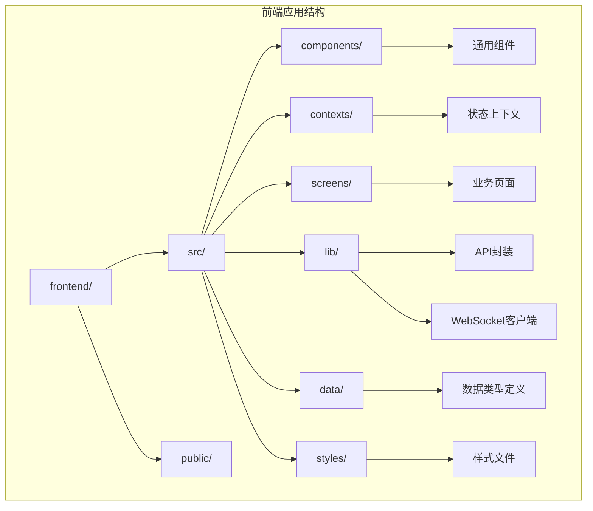

**图表来源**
- [main.tsx:1-12](file://frontend/src/main.tsx#L1-L12)
- [prototype.css:1-200](file://frontend/src/styles/prototype.css#L1-L200)

**章节来源**
- [main.tsx:1-12](file://frontend/src/main.tsx#L1-L12)

## 核心组件

### 状态管理系统

App.tsx 实现了完整的状态管理架构，包含以下关键状态：

| 状态类型 | 状态名称 | 数据类型 | 描述 |
|---------|----------|----------|------|
| 导航状态 | screen | Screen | 当前激活的屏幕组件 |
| 模态框状态 | modal | ModalType | 当前显示的模态框类型 |
| 侧边栏状态 | sidebarCollapsed | boolean | 侧边栏折叠状态 |
| 回测上下文 | backtestContext | object | 回测场景的初始参数 |
| 用户状态 | currentUser | object | 当前认证用户信息 |
| 认证状态 | authChecked | boolean | 认证检查完成状态 |
| 全局数据 | globalData | object | 系统概览和配置数据 |

### 导航系统设计

应用采用双层导航结构，支持 12 个主要功能模块：

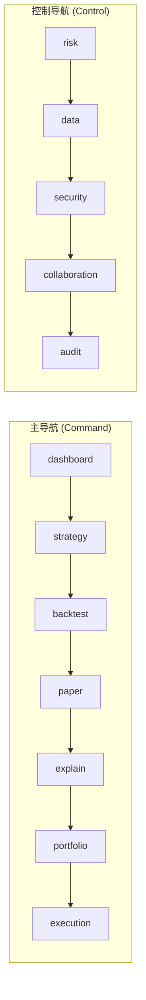

**图表来源**
- [App.tsx:24-40](file://frontend/src/App.tsx#L24-L40)

### 模态框系统

模态框系统支持 6 种预定义类型，通过全局数据动态配置：

| 模态框类型 | 功能描述 | 触发方式 |
|-----------|----------|----------|
| global | 全局概览 | 顶部工具栏按钮 |
| kill | Kill Switch | 危险操作确认 |
| create | 命令面板 | 快捷键触发 |
| autopilot | 自动驾驶设置 | 系统健康状态 |
| approve | 审批流程 | 交易审批 |
| pause | 暂停操作 | 系统暂停 |

**章节来源**
- [App.tsx:18-22](file://frontend/src/App.tsx#L18-L22)
- [App.tsx:42-53](file://frontend/src/App.tsx#L42-L53)

## 架构概览

### 整体架构设计

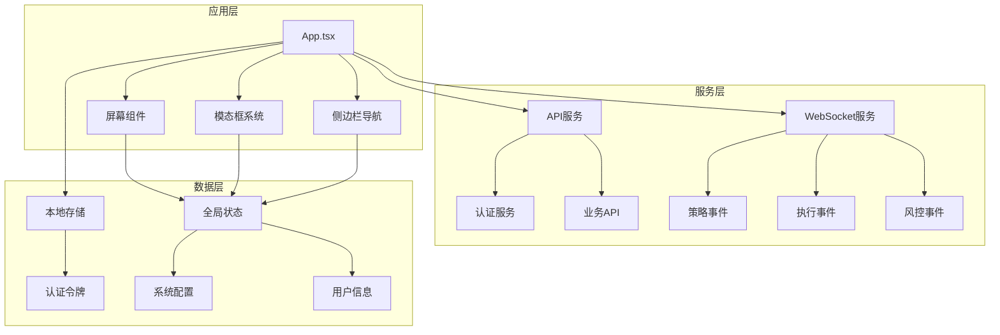

**图表来源**
- [App.tsx:1-17](file://frontend/src/App.tsx#L1-L17)
- [api.ts:514-779](file://frontend/src/lib/api.ts#L514-L779)
- [ws.ts:91-95](file://frontend/src/lib/ws.ts#L91-L95)

### 生命周期管理

应用采用 React Hooks 实现完整的生命周期管理：

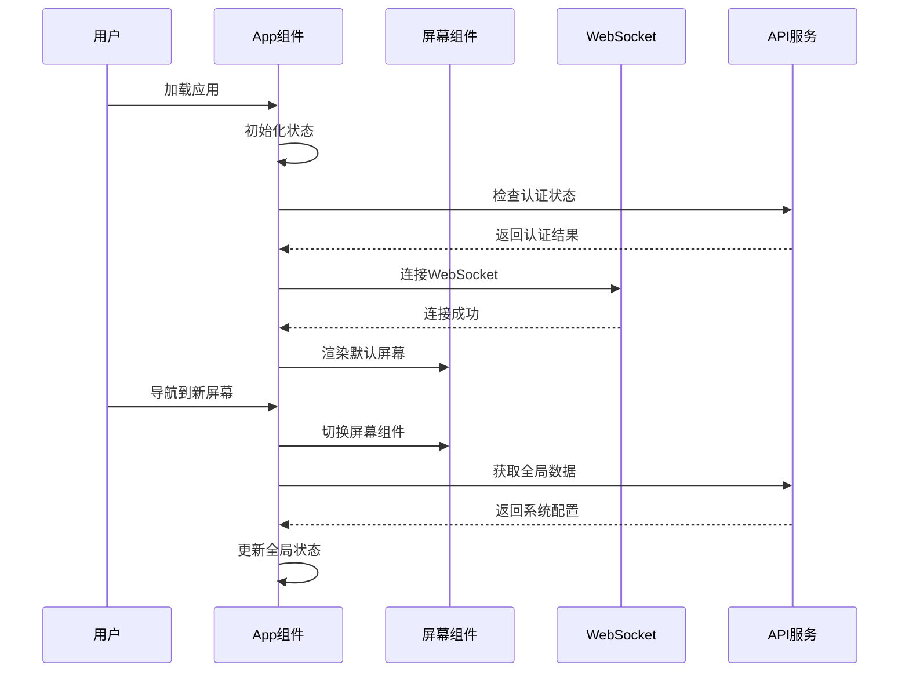

**图表来源**
- [App.tsx:55-96](file://frontend/src/App.tsx#L55-L96)

## 详细组件分析

### 主应用组件架构

#### 状态定义与初始化

App.tsx 使用 React Hooks 实现状态管理，所有状态都在组件顶层定义：

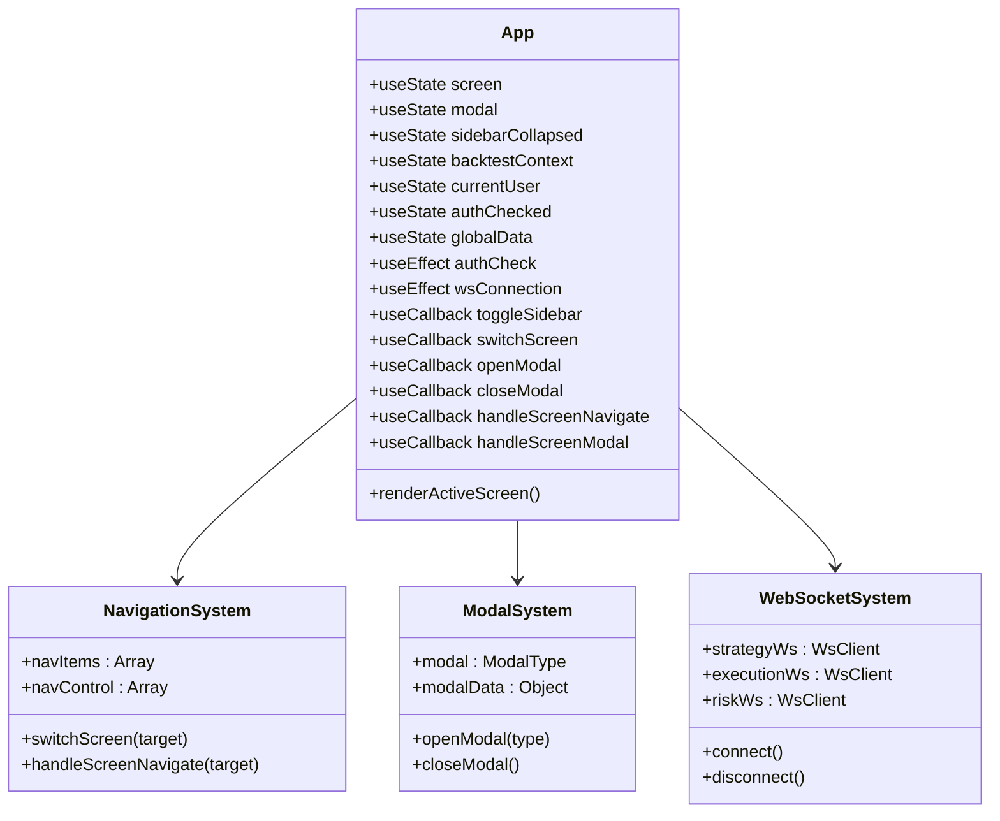

**图表来源**
- [App.tsx:42-299](file://frontend/src/App.tsx#L42-L299)

#### 复合目标处理机制

App.tsx 实现了智能的复合目标解析系统，支持复杂的导航参数：

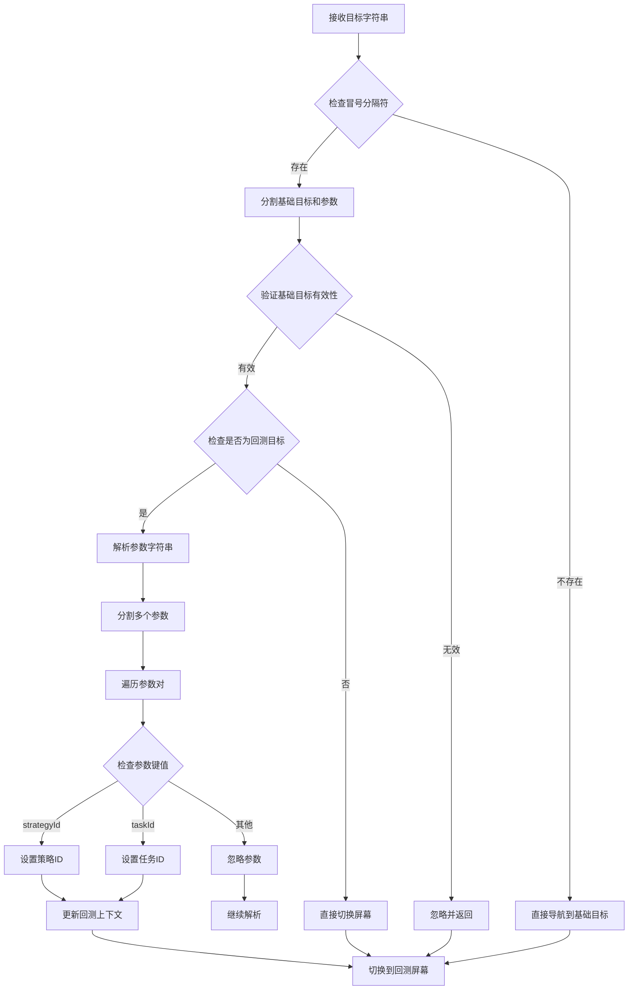

**图表来源**
- [App.tsx:108-127](file://frontend/src/App.tsx#L108-L127)

#### 事件处理器设计模式

应用采用统一的事件处理器模式，确保组件间的松耦合通信：

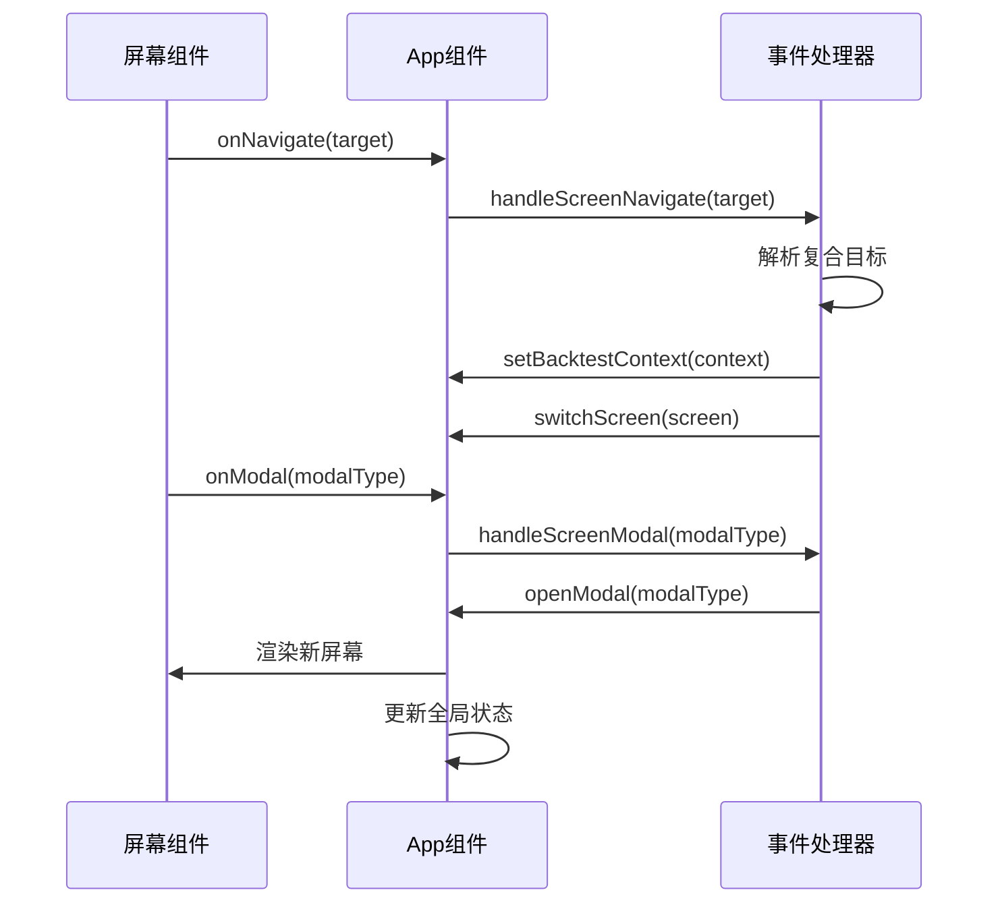

**图表来源**
- [App.tsx:100-133](file://frontend/src/App.tsx#L100-L133)

**章节来源**
- [App.tsx:100-133](file://frontend/src/App.tsx#L100-L133)

### WebSocket 连接管理

#### 连接生命周期

WebSocket 系统实现了自动重连机制，确保实时数据传输的可靠性：

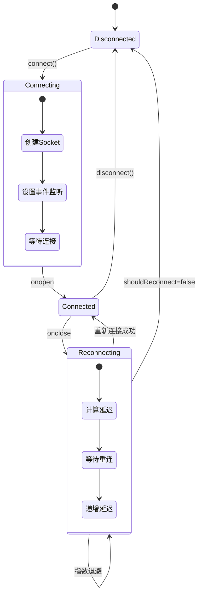

**图表来源**
- [ws.ts:40-67](file://frontend/src/lib/ws.ts#L40-L67)

#### 主题订阅机制

WebSocket 客户端支持多主题订阅，每个主题独立管理：

| 主题 | 用途 | 事件类型 |
|------|------|----------|
| strategy-events | 策略状态更新 | 策略创建、更新、删除 |
| execution-events | 交易执行状态 | 订单创建、填充、拒绝 |
| risk-events | 风控状态变化 | 风控触发、解除、警报 |

**章节来源**
- [ws.ts:91-95](file://frontend/src/lib/ws.ts#L91-L95)

### 认证状态检查

#### 认证流程

应用实现了完整的认证检查流程，确保用户会话的安全性：

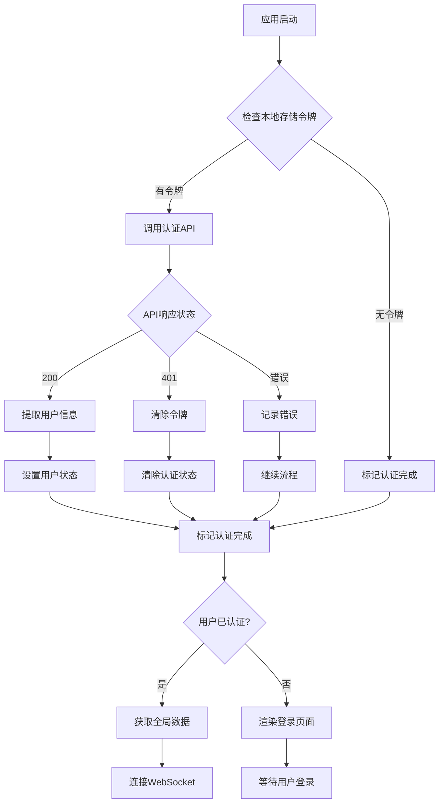

**图表来源**
- [App.tsx:55-67](file://frontend/src/App.tsx#L55-L67)
- [api.ts:27-30](file://frontend/src/lib/api.ts#L27-L30)

**章节来源**
- [App.tsx:55-96](file://frontend/src/App.tsx#L55-L96)

### 屏幕切换机制

#### 渲染策略

App.tsx 采用条件渲染策略，根据当前屏幕状态动态加载对应组件：

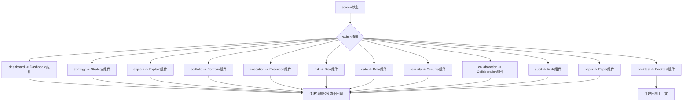

**图表来源**
- [App.tsx:137-173](file://frontend/src/App.tsx#L137-L173)

**章节来源**
- [App.tsx:137-173](file://frontend/src/App.tsx#L137-L173)

### 组件间通信机制

#### 上下文提升策略

应用采用 React Context 模式实现状态提升，避免深层组件树的 props drilling：

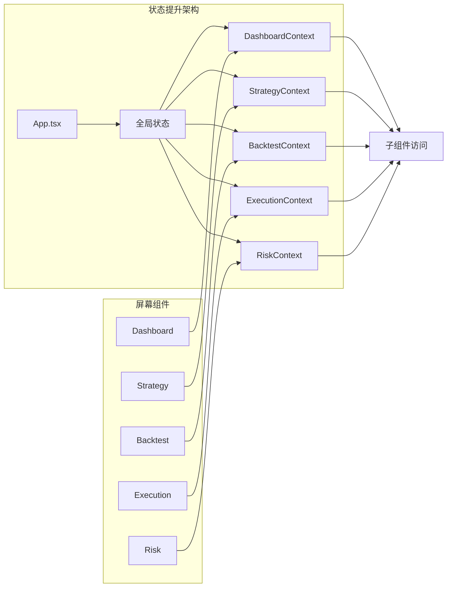

**图表来源**
- [BacktestContext.tsx:1-13](file://frontend/src/contexts/BacktestContext.tsx#L1-L13)
- [StrategyContext.tsx:1-13](file://frontend/src/contexts/StrategyContext.tsx#L1-L13)

#### 事件驱动通信

屏幕组件通过回调函数与 App.tsx 通信，实现松耦合的数据流：

| 通信类型 | 发送方 | 接收方 | 用途 |
|----------|--------|--------|------|
| 导航事件 | 屏幕组件 | App.tsx | 切换屏幕 |
| 模态框事件 | 屏幕组件 | App.tsx | 打开模态框 |
| WebSocket事件 | WebSocket客户端 | App.tsx | 更新状态 |
| 认证事件 | API服务 | App.tsx | 处理401错误 |

**章节来源**
- [Dashboard/index.tsx:12-15](file://frontend/src/screens/Dashboard/index.tsx#L12-L15)
- [Backtest/index.tsx:17-22](file://frontend/src/screens/Backtest/index.tsx#L17-L22)

## 依赖关系分析

### 外部依赖

应用的主要外部依赖包括：

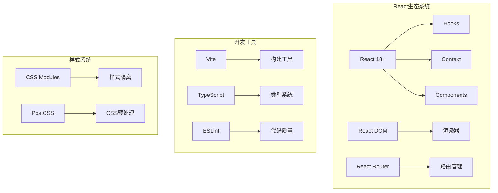

### 内部模块依赖

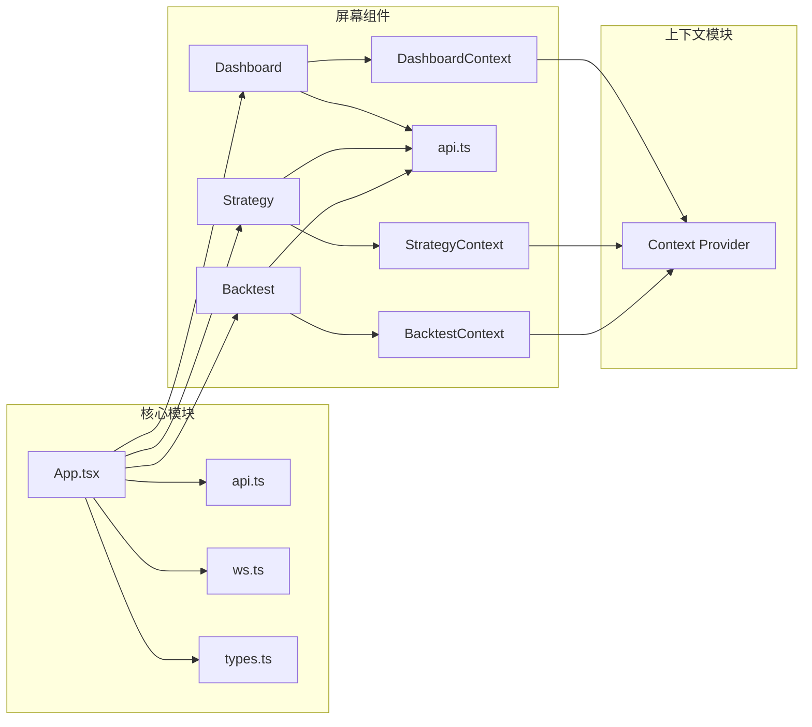

**图表来源**
- [App.tsx:1-17](file://frontend/src/App.tsx#L1-L17)
- [types.ts:1-647](file://frontend/src/data/types.ts#L1-L647)

**章节来源**
- [App.tsx:1-17](file://frontend/src/App.tsx#L1-L17)

## 性能考虑

### 渲染优化

应用采用了多种性能优化策略：

1. **组件懒加载**: 屏幕组件仅在需要时渲染
2. **状态最小化**: 仅在必要时更新状态
3. **事件节流**: 导航事件使用 useCallback 优化
4. **内存管理**: WebSocket 连接在组件卸载时正确清理

### 网络优化

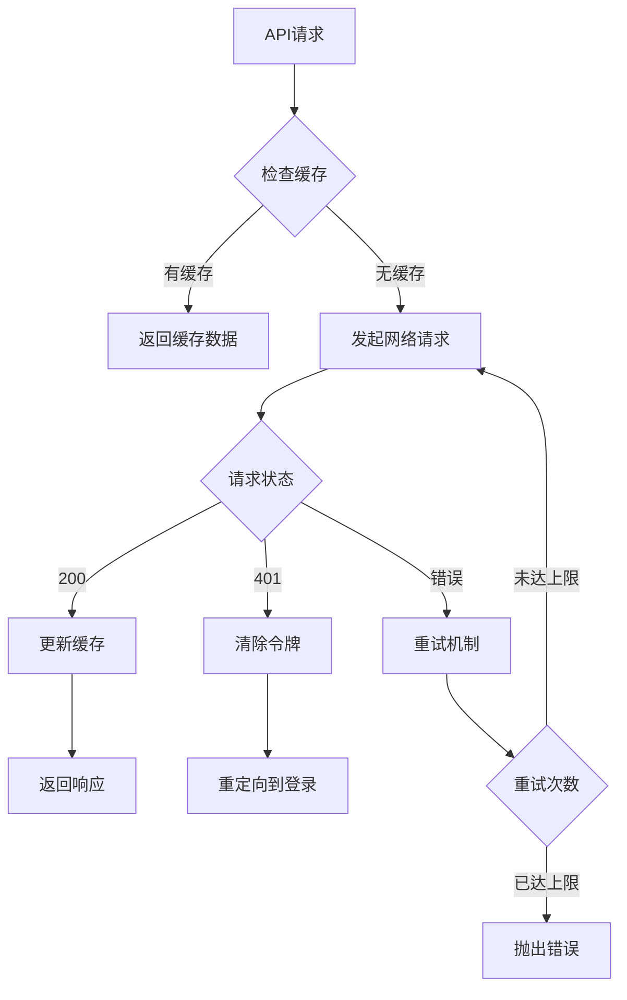

**图表来源**
- [api.ts:32-57](file://frontend/src/lib/api.ts#L32-L57)

### WebSocket 优化

1. **指数退避**: 连接失败时延迟时间逐步增加
2. **心跳检测**: 监控连接状态
3. **消息队列**: 处理离线期间的消息
4. **主题分离**: 不同主题独立管理

## 故障排除指南

### 常见问题诊断

#### 认证相关问题

| 问题症状 | 可能原因 | 解决方案 |
|----------|----------|----------|
| 无法登录 | 网络连接异常 | 检查网络状态 |
| 登录后立即登出 | 令牌过期 | 清除浏览器缓存 |
| 页面空白 | 认证检查超时 | 检查服务器响应 |

#### WebSocket 连接问题

| 问题症状 | 可能原因 | 解决方案 |
|----------|----------|----------|
| 无法接收实时数据 | 网络阻塞 | 检查防火墙设置 |
| 连接频繁断开 | 服务器重启 | 等待服务器恢复 |
| 消息丢失 | 网络不稳定 | 检查网络质量 |

#### 性能问题

| 问题症状 | 可能原因 | 解决方案 |
|----------|----------|----------|
| 页面卡顿 | 组件渲染过多 | 检查状态更新频率 |
| 内存泄漏 | WebSocket未清理 | 检查清理函数 |
| 响应缓慢 | API请求过多 | 实施请求合并 |

**章节来源**
- [App.tsx:69-74](file://frontend/src/App.tsx#L69-L74)
- [ws.ts:57-67](file://frontend/src/lib/ws.ts#L57-L67)

### 调试技巧

1. **开发者工具**: 使用浏览器开发者工具监控网络请求
2. **日志记录**: 在关键位置添加 console.log 输出
3. **状态检查**: 使用 React DevTools 检查组件状态
4. **WebSocket调试**: 监控 WebSocket 事件和消息

## 结论

App.tsx 作为 LLMine Quant 应用的核心控制器，展现了现代 React 应用的最佳实践。通过精心设计的状态管理、事件驱动的组件通信、可靠的 WebSocket 连接管理和完善的错误处理机制，该组件为整个应用提供了稳定、高效且可扩展的基础架构。

主要优势包括：
- **模块化设计**: 清晰的功能分离和职责划分
- **状态管理**: 合理的状态提升和上下文使用
- **性能优化**: 多层次的性能优化策略
- **可维护性**: 良好的代码结构和注释规范
- **用户体验**: 流畅的导航体验和实时数据更新

该设计为后续功能扩展和维护奠定了坚实的基础，是构建复杂前端应用的优秀参考案例。