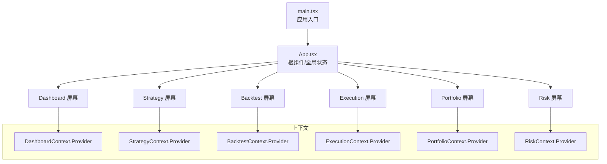
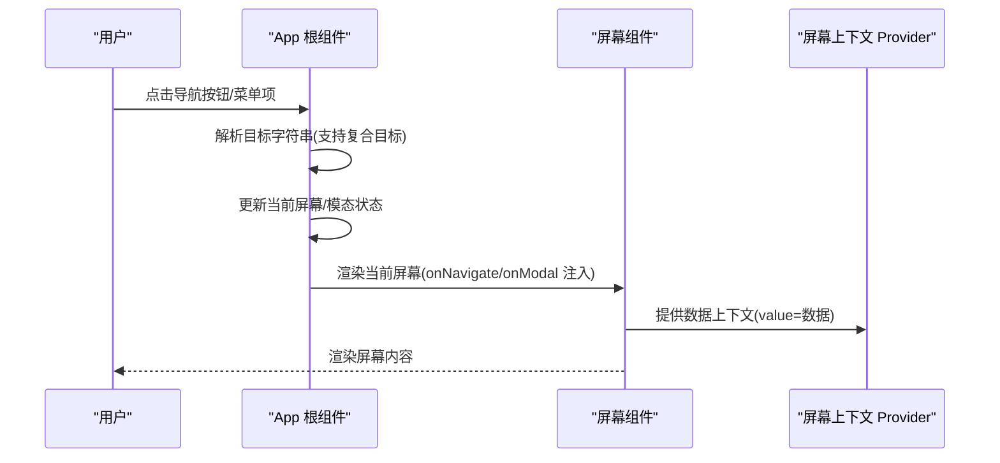
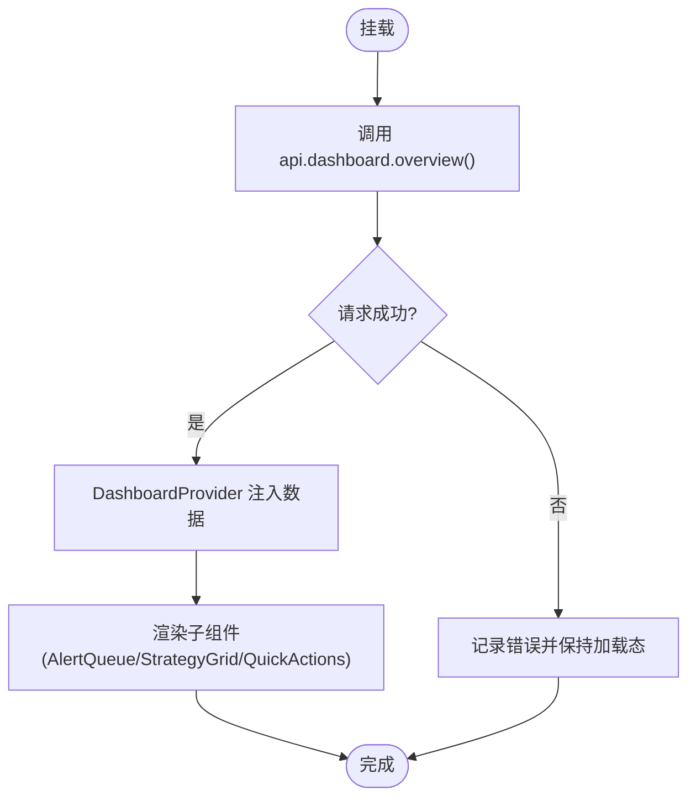
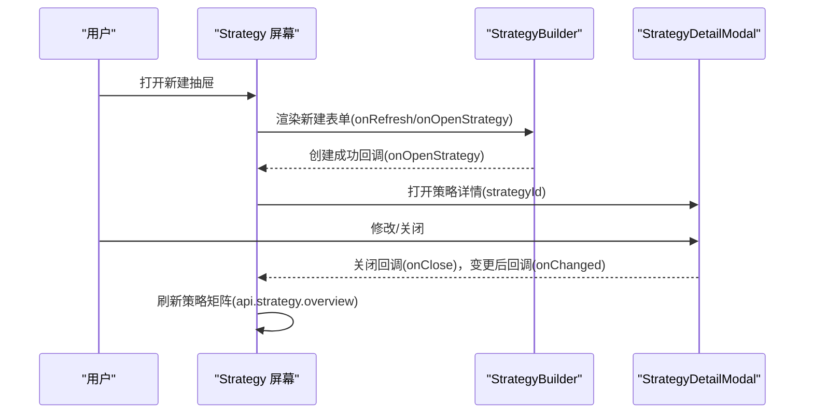
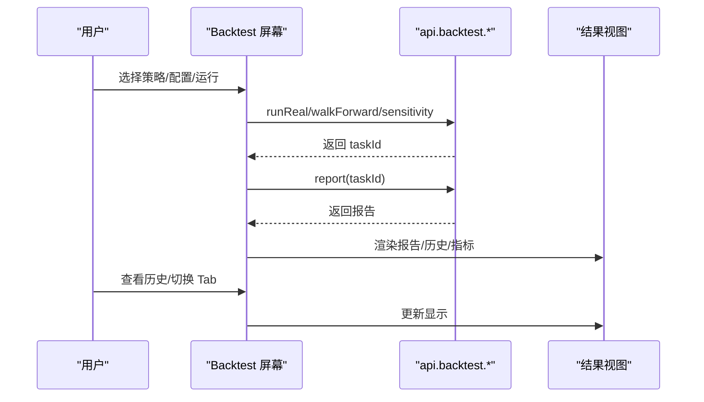
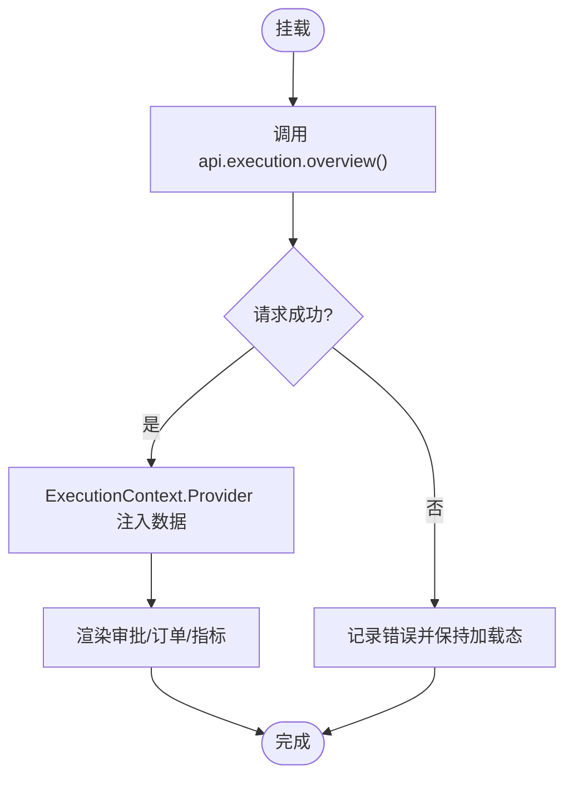
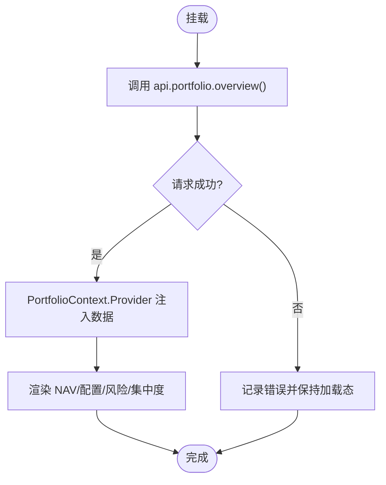
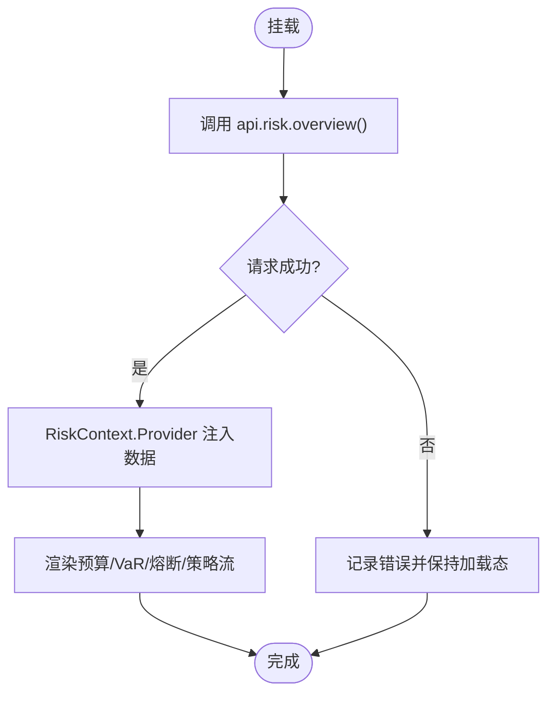
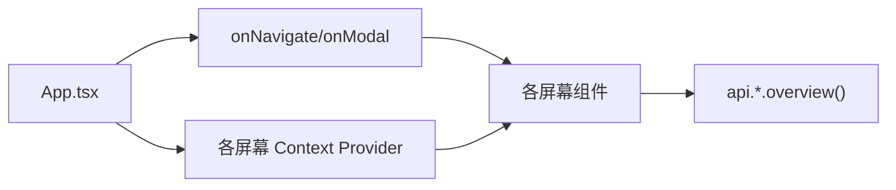

# 屏幕组件架构

<cite>
**本文引用的文件**
- [frontend/src/App.tsx](file://frontend/src/App.tsx)
- [frontend/src/main.tsx](file://frontend/src/main.tsx)
- [frontend/src/components/GlassCard.tsx](file://frontend/src/components/GlassCard.tsx)
- [frontend/src/contexts/DashboardContext.tsx](file://frontend/src/contexts/DashboardContext.tsx)
- [frontend/src/contexts/StrategyContext.tsx](file://frontend/src/contexts/StrategyContext.tsx)
- [frontend/src/contexts/BacktestContext.tsx](file://frontend/src/contexts/BacktestContext.tsx)
- [frontend/src/contexts/ExecutionContext.tsx](file://frontend/src/contexts/ExecutionContext.tsx)
- [frontend/src/contexts/PortfolioContext.tsx](file://frontend/src/contexts/PortfolioContext.tsx)
- [frontend/src/contexts/RiskContext.tsx](file://frontend/src/contexts/RiskContext.tsx)
- [frontend/src/screens/Dashboard/index.tsx](file://frontend/src/screens/Dashboard/index.tsx)
- [frontend/src/screens/Strategy/index.tsx](file://frontend/src/screens/Strategy/index.tsx)
- [frontend/src/screens/Backtest/index.tsx](file://frontend/src/screens/Backtest/index.tsx)
- [frontend/src/screens/Execution/index.tsx](file://frontend/src/screens/Execution/index.tsx)
- [frontend/src/screens/Portfolio/index.tsx](file://frontend/src/screens/Portfolio/index.tsx)
- [frontend/src/screens/Risk/index.tsx](file://frontend/src/screens/Risk/index.tsx)
</cite>

## 目录
1. [引言](#引言)
2. [项目结构](#项目结构)
3. [核心组件](#核心组件)
4. [架构总览](#架构总览)
5. [详细组件分析](#详细组件分析)
6. [依赖关系分析](#依赖关系分析)
7. [性能考量](#性能考量)
8. [故障排查指南](#故障排查指南)
9. [结论](#结论)
10. [附录](#附录)

## 引言
本设计文档聚焦 llmine-quant 前端“屏幕组件”架构，系统化阐述各屏幕组件（Dashboard、Strategy、Backtest、Execution、Portfolio、Risk 等）的职责边界、通用接口设计、数据获取与状态管理模式、与主应用的通信机制、路由参数传递与上下文共享方式，并给出生命周期管理、性能优化与用户体验设计的最佳实践与参考路径。

## 项目结构
前端采用“屏幕组件 + 上下文 Provider”的分层组织方式：
- 入口与根组件：App 负责全局状态、导航、模态框、WebSocket 连接与屏幕渲染调度。
- 屏幕组件：每个屏幕以独立目录组织，内部按功能模块拆分为子组件，通过 onNavigate/onModal 与主应用交互。
- 上下文：每个屏幕提供对应的 Context Provider，向子组件注入该屏幕的数据视图，实现弱耦合的数据共享。

图表来源
- [frontend/src/main.tsx:1-12](file://frontend/src/main.tsx#L1-L12)
- [frontend/src/App.tsx:42-173](file://frontend/src/App.tsx#L42-L173)
- [frontend/src/screens/Dashboard/index.tsx:28-45](file://frontend/src/screens/Dashboard/index.tsx#L28-L45)
- [frontend/src/screens/Strategy/index.tsx:80-166](file://frontend/src/screens/Strategy/index.tsx#L80-L166)
- [frontend/src/screens/Backtest/index.tsx:137-800](file://frontend/src/screens/Backtest/index.tsx#L137-L800)
- [frontend/src/screens/Execution/index.tsx:28-43](file://frontend/src/screens/Execution/index.tsx#L28-L43)
- [frontend/src/screens/Portfolio/index.tsx:28-41](file://frontend/src/screens/Portfolio/index.tsx#L28-L41)
- [frontend/src/screens/Risk/index.tsx:28-43](file://frontend/src/screens/Risk/index.tsx#L28-L43)

章节来源
- [frontend/src/main.tsx:1-12](file://frontend/src/main.tsx#L1-L12)
- [frontend/src/App.tsx:18-41](file://frontend/src/App.tsx#L18-L41)
- [frontend/src/App.tsx:137-173](file://frontend/src/App.tsx#L137-L173)

## 核心组件
- 根组件 App
  - 职责：维护当前屏幕、模态类型、侧边栏折叠状态、用户会话、全局系统概览数据；处理导航与模态事件；建立 WebSocket 连接；渲染当前屏幕与全局模态。
  - 关键能力：onNavigate 支持复合目标（如 backtest:strategyId=...），onModal 支持全局命令面板等；支持从 URL 片段解析初始回测参数。
- 屏幕组件
  - Dashboard/Strategy/Execution/Portfolio/Risk：统一接收 onNavigate/onModal，内部通过 api.*.overview 获取数据，使用对应 Context Provider 注入数据视图。
  - Backtest：接收 initialStrategyId/initialTaskId，负责实验配置、运行与结果展示，内部状态复杂，但对外仍遵循 onNavigate/onModal 与主应用解耦。
- 上下文
  - 每个屏幕提供一个 Context（DashboardContext、StrategyContext、BacktestContext、ExecutionContext、PortfolioContext、RiskContext），用于子组件读取该屏幕的数据视图，避免 props 下传。

章节来源
- [frontend/src/App.tsx:42-173](file://frontend/src/App.tsx#L42-L173)
- [frontend/src/screens/Dashboard/index.tsx:12-46](file://frontend/src/screens/Dashboard/index.tsx#L12-L46)
- [frontend/src/screens/Strategy/index.tsx:10-167](file://frontend/src/screens/Strategy/index.tsx#L10-L167)
- [frontend/src/screens/Backtest/index.tsx:17-800](file://frontend/src/screens/Backtest/index.tsx#L17-L800)
- [frontend/src/screens/Execution/index.tsx:12-44](file://frontend/src/screens/Execution/index.tsx#L12-L44)
- [frontend/src/screens/Portfolio/index.tsx:12-42](file://frontend/src/screens/Portfolio/index.tsx#L12-L42)
- [frontend/src/screens/Risk/index.tsx:12-44](file://frontend/src/screens/Risk/index.tsx#L12-L44)
- [frontend/src/contexts/DashboardContext.tsx:1-13](file://frontend/src/contexts/DashboardContext.tsx#L1-L13)
- [frontend/src/contexts/StrategyContext.tsx:1-13](file://frontend/src/contexts/StrategyContext.tsx#L1-L13)
- [frontend/src/contexts/BacktestContext.tsx:1-13](file://frontend/src/contexts/BacktestContext.tsx#L1-L13)
- [frontend/src/contexts/ExecutionContext.tsx:1-13](file://frontend/src/contexts/ExecutionContext.tsx#L1-L13)
- [frontend/src/contexts/PortfolioContext.tsx:1-13](file://frontend/src/contexts/PortfolioContext.tsx#L1-L13)
- [frontend/src/contexts/RiskContext.tsx:1-13](file://frontend/src/contexts/RiskContext.tsx#L1-L13)

## 架构总览
屏幕组件与根组件的交互通过统一的 onNavigate/onModal 接口进行，Backtest 屏幕支持从导航字符串解析初始参数，形成“参数驱动”的导航模式。各屏幕通过 Context Provider 将数据视图下沉至子组件，降低耦合度。

图表来源
- [frontend/src/App.tsx:100-133](file://frontend/src/App.tsx#L100-L133)
- [frontend/src/App.tsx:137-173](file://frontend/src/App.tsx#L137-L173)
- [frontend/src/screens/Dashboard/index.tsx:28-45](file://frontend/src/screens/Dashboard/index.tsx#L28-L45)
- [frontend/src/screens/Strategy/index.tsx:80-166](file://frontend/src/screens/Strategy/index.tsx#L80-L166)
- [frontend/src/screens/Backtest/index.tsx:137-800](file://frontend/src/screens/Backtest/index.tsx#L137-L800)
- [frontend/src/screens/Execution/index.tsx:28-43](file://frontend/src/screens/Execution/index.tsx#L28-L43)
- [frontend/src/screens/Portfolio/index.tsx:28-41](file://frontend/src/screens/Portfolio/index.tsx#L28-L41)
- [frontend/src/screens/Risk/index.tsx:28-43](file://frontend/src/screens/Risk/index.tsx#L28-L43)

## 详细组件分析

### Dashboard 屏幕
- 职责：聚合市场、组合、策略与快速操作等信息，作为中枢仪表盘。
- 数据获取：首次挂载时调用 api.dashboard.overview，成功后通过 DashboardContext.Provider 注入数据。
- 交互：AlertQueue/QuickActions 等子组件通过 onNavigate/onModal 与主应用通信。
- 设计要点：Provider 包裹整个布局，保证子组件可直接消费数据视图。

图表来源
- [frontend/src/screens/Dashboard/index.tsx:17-46](file://frontend/src/screens/Dashboard/index.tsx#L17-L46)

章节来源
- [frontend/src/screens/Dashboard/index.tsx:12-46](file://frontend/src/screens/Dashboard/index.tsx#L12-L46)
- [frontend/src/contexts/DashboardContext.tsx:1-13](file://frontend/src/contexts/DashboardContext.tsx#L1-L13)

### Strategy 屏幕
- 职责：策略工厂的总览、筛选、生命周期管理与新建流程。
- 数据获取：首次挂载调用 api.strategy.overview，支持刷新。
- 状态管理：selectedStrategyId、lastCreatedId、抽屉开关等，用于打开详情与新建流程。
- 交互：StrategyMatrix/StrategyLifecycle/StrategyDetailModal 通过 onNavigate/onModal 与主应用通信；新建抽屉内 StrategyBuilder 通过回调联动刷新与打开策略详情。
- 设计要点：KPI 统计在 useMemo 中计算，避免不必要重算；抽屉与模态解耦，提升可维护性。

图表来源
- [frontend/src/screens/Strategy/index.tsx:32-167](file://frontend/src/screens/Strategy/index.tsx#L32-L167)

章节来源
- [frontend/src/screens/Strategy/index.tsx:10-167](file://frontend/src/screens/Strategy/index.tsx#L10-L167)
- [frontend/src/contexts/StrategyContext.tsx:1-13](file://frontend/src/contexts/StrategyContext.tsx#L1-L13)

### Backtest 屏幕
- 职责：回测实验工作台，支持内置策略与策略工厂策略、Agent 构建股票池、运行回测/Walk-Forward/敏感性扫描、查看历史与报告。
- 导航参数：支持从 onNavigate 的复合目标解析 initialStrategyId/initialTaskId，自动填充配置。
- 状态管理：复杂配置对象、运行状态、报告数据、历史列表、Tab 切换等，均在组件内部集中管理。
- 交互：运行按钮触发 api.* 调用，结果更新 activeTaskId 与 report；历史面板支持加载已有任务。
- 设计要点：validate/flash/statusMsg 等辅助函数提升可读性；多 Tab 结果视图与配置面板分离，降低耦合。

图表来源
- [frontend/src/screens/Backtest/index.tsx:137-800](file://frontend/src/screens/Backtest/index.tsx#L137-L800)
- [frontend/src/App.tsx:108-127](file://frontend/src/App.tsx#L108-L127)

章节来源
- [frontend/src/screens/Backtest/index.tsx:17-800](file://frontend/src/screens/Backtest/index.tsx#L17-L800)
- [frontend/src/App.tsx:108-127](file://frontend/src/App.tsx#L108-L127)
- [frontend/src/contexts/BacktestContext.tsx:1-13](file://frontend/src/contexts/BacktestContext.tsx#L1-L13)

### Execution 屏幕
- 职责：交易审批、预交易检查、订单簿与执行指标可视化。
- 数据获取：首次挂载调用 api.execution.overview，通过 ExecutionContext.Provider 注入。
- 交互：ApprovalQueue 通过 onModal 与主应用模态通信。

图表来源
- [frontend/src/screens/Execution/index.tsx:17-44](file://frontend/src/screens/Execution/index.tsx#L17-L44)

章节来源
- [frontend/src/screens/Execution/index.tsx:12-44](file://frontend/src/screens/Execution/index.tsx#L12-L44)
- [frontend/src/contexts/ExecutionContext.tsx:1-13](file://frontend/src/contexts/ExecutionContext.tsx#L1-L13)

### Portfolio 屏幕
- 职责：净值走势、资产配置、风险预算、相关性与集中度等组合视图。
- 数据获取：首次挂载调用 api.portfolio.overview，通过 PortfolioContext.Provider 注入。
- 交互：RebalanceActions 通过 onModal 与主应用模态通信。

图表来源
- [frontend/src/screens/Portfolio/index.tsx:17-42](file://frontend/src/screens/Portfolio/index.tsx#L17-L42)

章节来源
- [frontend/src/screens/Portfolio/index.tsx:12-42](file://frontend/src/screens/Portfolio/index.tsx#L12-L42)
- [frontend/src/contexts/PortfolioContext.tsx:1-13](file://frontend/src/contexts/PortfolioContext.tsx#L1-L13)

### Risk 屏幕
- 职责：风险预算、VaR、熔断器、策略流与违例历史。
- 数据获取：首次挂载调用 api.risk.overview，通过 RiskContext.Provider 注入。
- 交互：RiskHeader/CircuitBreakerPanel 通过 onModal 与主应用模态通信。

图表来源
- [frontend/src/screens/Risk/index.tsx:17-44](file://frontend/src/screens/Risk/index.tsx#L17-L44)

章节来源
- [frontend/src/screens/Risk/index.tsx:12-44](file://frontend/src/screens/Risk/index.tsx#L12-L44)
- [frontend/src/contexts/RiskContext.tsx:1-13](file://frontend/src/contexts/RiskContext.tsx#L1-L13)

### 通用接口与数据流
- onNavigate(target: string)
  - 支持基础 screen 名称与复合目标（如 backtest:strategyId=...&taskId=...），由 App 解析并设置 backtestContext，随后切换屏幕。
- onModal(target: string)
  - 支持全局命令面板、Kill Switch 等模态类型，App 从全局系统数据中读取模态标题与内容，渲染统一模态。
- 数据获取模式
  - 各屏幕在挂载时调用 api.*.overview 获取初始数据，部分屏幕（如 Strategy/Backtest）支持后续刷新。
- 上下文共享
  - 每个屏幕提供对应的 Context Provider，子组件通过 use* 钩子读取数据视图，避免深层 props 传递。

章节来源
- [frontend/src/App.tsx:108-133](file://frontend/src/App.tsx#L108-L133)
- [frontend/src/App.tsx:137-173](file://frontend/src/App.tsx#L137-L173)
- [frontend/src/screens/Dashboard/index.tsx:17-46](file://frontend/src/screens/Dashboard/index.tsx#L17-L46)
- [frontend/src/screens/Strategy/index.tsx:32-167](file://frontend/src/screens/Strategy/index.tsx#L32-L167)
- [frontend/src/screens/Backtest/index.tsx:137-800](file://frontend/src/screens/Backtest/index.tsx#L137-L800)
- [frontend/src/screens/Execution/index.tsx:17-44](file://frontend/src/screens/Execution/index.tsx#L17-L44)
- [frontend/src/screens/Portfolio/index.tsx:17-42](file://frontend/src/screens/Portfolio/index.tsx#L17-L42)
- [frontend/src/screens/Risk/index.tsx:17-44](file://frontend/src/screens/Risk/index.tsx#L17-L44)

## 依赖关系分析
- 组件耦合
  - 屏幕组件仅依赖 App 注入的 onNavigate/onModal 与 Context Provider，彼此低耦合。
  - 子组件通过 Context 读取数据，避免跨屏直接依赖。
- 外部依赖
  - api.* 与 ws.* 由 App 统一管理，屏幕组件仅负责调用与渲染。
- 潜在循环依赖
  - 当前结构清晰，未见循环依赖迹象。

图表来源
- [frontend/src/App.tsx:100-133](file://frontend/src/App.tsx#L100-L133)
- [frontend/src/App.tsx:137-173](file://frontend/src/App.tsx#L137-L173)
- [frontend/src/screens/Dashboard/index.tsx:17-46](file://frontend/src/screens/Dashboard/index.tsx#L17-L46)
- [frontend/src/screens/Strategy/index.tsx:32-167](file://frontend/src/screens/Strategy/index.tsx#L32-L167)
- [frontend/src/screens/Backtest/index.tsx:137-800](file://frontend/src/screens/Backtest/index.tsx#L137-L800)
- [frontend/src/screens/Execution/index.tsx:17-44](file://frontend/src/screens/Execution/index.tsx#L17-L44)
- [frontend/src/screens/Portfolio/index.tsx:17-42](file://frontend/src/screens/Portfolio/index.tsx#L17-L42)
- [frontend/src/screens/Risk/index.tsx:17-44](file://frontend/src/screens/Risk/index.tsx#L17-L44)

章节来源
- [frontend/src/App.tsx:100-133](file://frontend/src/App.tsx#L100-L133)
- [frontend/src/screens/Dashboard/index.tsx:17-46](file://frontend/src/screens/Dashboard/index.tsx#L17-L46)
- [frontend/src/screens/Strategy/index.tsx:32-167](file://frontend/src/screens/Strategy/index.tsx#L32-L167)
- [frontend/src/screens/Backtest/index.tsx:137-800](file://frontend/src/screens/Backtest/index.tsx#L137-L800)
- [frontend/src/screens/Execution/index.tsx:17-44](file://frontend/src/screens/Execution/index.tsx#L17-L44)
- [frontend/src/screens/Portfolio/index.tsx:17-42](file://frontend/src/screens/Portfolio/index.tsx#L17-L42)
- [frontend/src/screens/Risk/index.tsx:17-44](file://frontend/src/screens/Risk/index.tsx#L17-L44)

## 性能考量
- 请求去抖与节流
  - 对频繁触发的 API 调用（如刷新）使用 useCallback 包装，减少无效重渲染。
- 计算缓存
  - 使用 useMemo 缓存 KPI 计算与派生数据，避免重复计算。
- 渲染优化
  - 仅在数据就绪后渲染屏幕主体，其余时间显示加载态，减少首屏阻塞。
- 状态收敛
  - 将复杂状态集中在屏幕组件内部，避免跨屏共享导致的状态风暴。
- WebSocket 生命周期
  - 在用户登录/登出时建立/断开连接，避免资源泄漏。

章节来源
- [frontend/src/screens/Strategy/index.tsx:59-70](file://frontend/src/screens/Strategy/index.tsx#L59-L70)
- [frontend/src/App.tsx:86-96](file://frontend/src/App.tsx#L86-L96)

## 故障排查指南
- 导航异常
  - 检查 onNavigate 的目标字符串是否在 VALID_SCREENS 内；复合目标的参数键值是否正确解析。
- 模态不显示
  - 确认 globalData 是否存在且包含对应模态键；确认 modal 类型在 VALID_MODALS 内。
- 数据加载失败
  - 查看各屏幕 useEffect 中的 catch 分支与控制台错误；确认 api.*.overview 是否返回预期数据。
- WebSocket 不生效
  - 确认 currentUser 存在后再建立连接；登出时断开连接。

章节来源
- [frontend/src/App.tsx:108-133](file://frontend/src/App.tsx#L108-L133)
- [frontend/src/App.tsx:135-136](file://frontend/src/App.tsx#L135-L136)
- [frontend/src/screens/Dashboard/index.tsx:20-24](file://frontend/src/screens/Dashboard/index.tsx#L20-L24)
- [frontend/src/screens/Strategy/index.tsx:38-42](file://frontend/src/screens/Strategy/index.tsx#L38-L42)
- [frontend/src/screens/Backtest/index.tsx:230-239](file://frontend/src/screens/Backtest/index.tsx#L230-L239)
- [frontend/src/screens/Execution/index.tsx:20-24](file://frontend/src/screens/Execution/index.tsx#L20-L24)
- [frontend/src/screens/Portfolio/index.tsx:20-24](file://frontend/src/screens/Portfolio/index.tsx#L20-L24)
- [frontend/src/screens/Risk/index.tsx:20-24](file://frontend/src/screens/Risk/index.tsx#L20-L24)

## 结论
该屏幕组件架构以 App 为核心协调者，通过 onNavigate/onModal 与屏幕解耦，结合 Context Provider 实现数据下沉，既保证了职责清晰、扩展性强，又兼顾了性能与可维护性。Backtest 的参数化导航与各屏幕的统一数据获取模式，为后续功能扩展提供了稳定基座。

## 附录
- 最佳实践清单
  - 保持 onNavigate/onModal 的语义一致，避免在子组件中绕过根组件直接跳转。
  - 使用 Context Provider 下沉数据视图，避免深层 props 传递。
  - 对昂贵计算使用 useMemo，对频繁调用使用 useCallback。
  - 在用户状态变化时同步管理 WebSocket 连接。
  - 为每个屏幕提供默认加载态与错误兜底，提升用户体验。