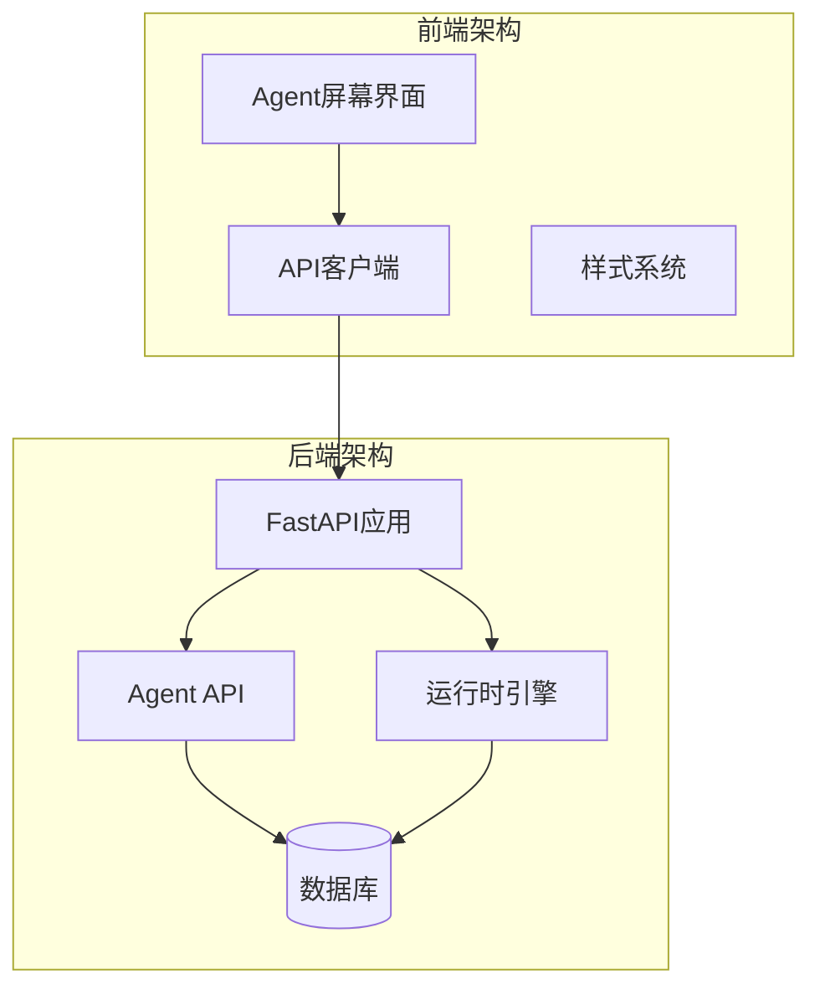
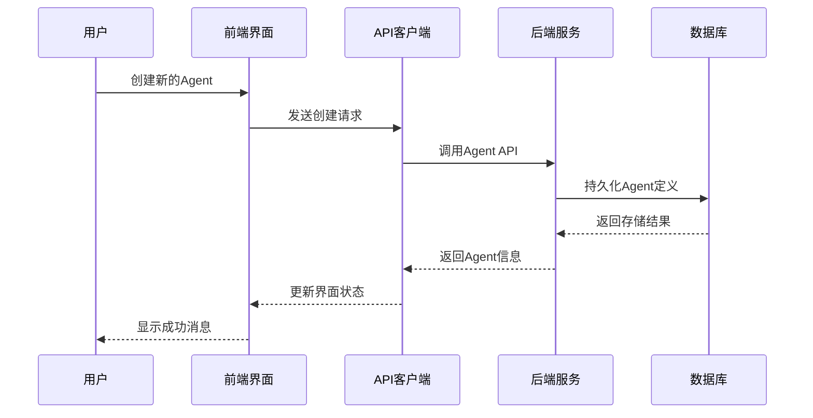
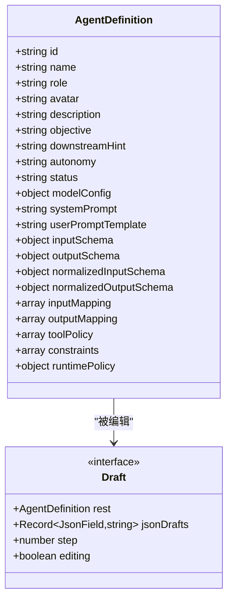
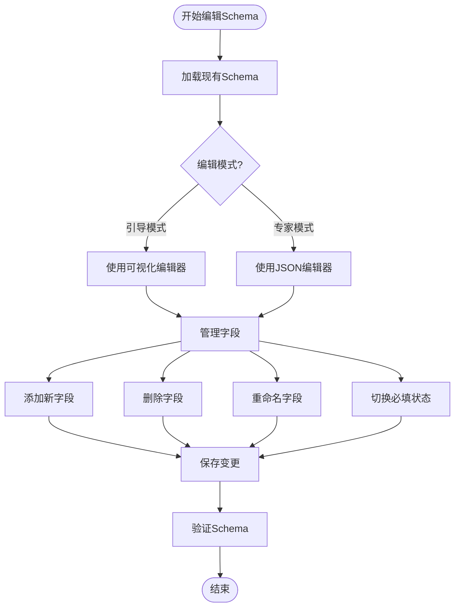
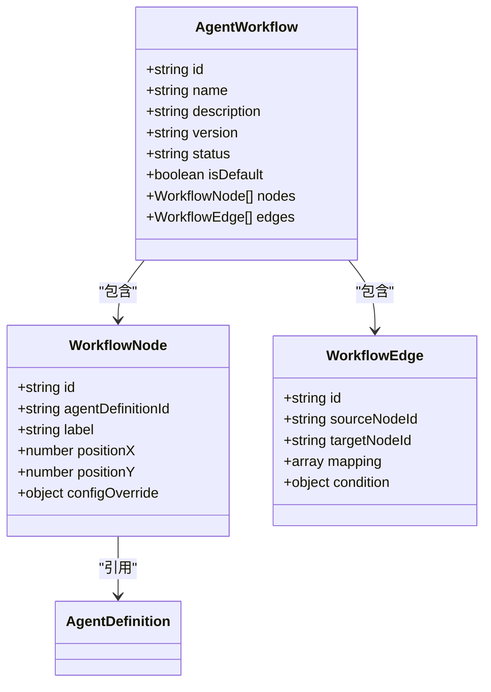
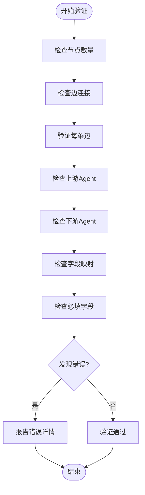
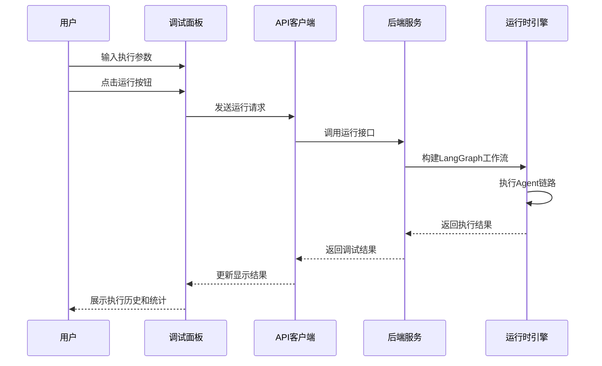
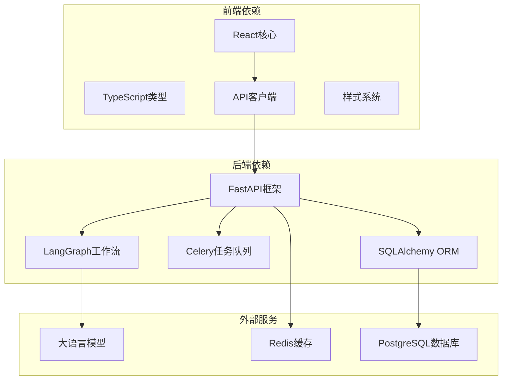

# Agent屏幕

<cite>
**本文档引用的文件**
- [index.tsx](file://frontend/src/screens/Agent/index.tsx)
- [App.tsx](file://frontend/src/App.tsx)
- [api.ts](file://frontend/src/lib/api.ts)
- [prototype.css](file://frontend/src/styles/prototype.css)
- [agents.py](file://backend/app/api/v1/agents.py)
- [runtime.py](file://backend/app/services/agents/runtime.py)
- [models.py](file://backend/app/domains/agents/models.py)
- [schemas.py](file://backend/app/domains/agents/schemas.py)
- [main.py](file://backend/app/main.py)
</cite>

## 目录
1. [简介](#简介)
2. [项目结构](#项目结构)
3. [核心组件](#核心组件)
4. [架构概览](#架构概览)
5. [详细组件分析](#详细组件分析)
6. [依赖关系分析](#依赖关系分析)
7. [性能考虑](#性能考虑)
8. [故障排除指南](#故障排除指南)
9. [结论](#结论)

## 简介

Agent屏幕是LLMine量化交易平台中的核心功能模块，提供了一个完整的Agent（智能代理）开发、编排和运行调试环境。该模块允许用户创建可复用的Agent定义，构建复杂的多Agent工作流，以及实时调试和验证Agent之间的交互。

Agent屏幕采用现代化的React + TypeScript技术栈构建，结合后端的FastAPI服务，实现了从Agent定义到工作流编排的全生命周期管理。系统支持引导模式和专家模式两种编辑体验，既满足初学者的快速上手需求，又为高级用户提供精细的配置能力。

## 项目结构

LLMine量化平台采用前后端分离的架构设计，Agent屏幕作为前端的重要组成部分，位于`frontend/src/screens/Agent/`目录下。

**图表来源**
- [index.tsx:1-266](file://frontend/src/screens/Agent/index.tsx#L1-L266)
- [App.tsx:1-352](file://frontend/src/App.tsx#L1-L352)
- [agents.py:1-571](file://backend/app/api/v1/agents.py#L1-L571)

**章节来源**
- [index.tsx:1-266](file://frontend/src/screens/Agent/index.tsx#L1-L266)
- [App.tsx:1-352](file://frontend/src/App.tsx#L1-L352)

## 核心组件

Agent屏幕由三个主要工作空间组成：Agents（代理定义）、Workflows（工作流编排）和Runs（运行调试）。每个工作空间都提供了专门的工具集来支持不同的开发阶段。

### 主要工作空间

1. **Agents工作空间**：用于创建和管理可复用的Agent定义
2. **Workflows工作空间**：用于构建和编排多Agent工作流
3. **Runs工作空间**：用于调试和验证工作流执行

### 编辑模式

系统提供两种编辑模式：
- **引导模式**：简化配置流程，适合快速创建Agent
- **专家模式**：完全开放的JSON编辑器，适合高级定制

**章节来源**
- [index.tsx:17-44](file://frontend/src/screens/Agent/index.tsx#L17-L44)

## 架构概览

Agent屏幕采用了分层架构设计，从前端界面到后端服务形成了清晰的职责分离。

**图表来源**
- [api.ts:699-717](file://frontend/src/lib/api.ts#L699-L717)
- [agents.py:373-414](file://backend/app/api/v1/agents.py#L373-L414)

## 详细组件分析

### Agent定义编辑器

Agent定义编辑器提供了完整的Agent配置界面，支持从基础信息到高级策略的全方位配置。

**图表来源**
- [api.ts:478-500](file://frontend/src/lib/api.ts#L478-L500)
- [index.tsx:4-16](file://frontend/src/screens/Agent/index.tsx#L4-L16)

#### 输入输出契约编辑器

系统提供了专门的Schema编辑器，支持可视化地管理Agent的输入输出契约。

**图表来源**
- [index.tsx:203-230](file://frontend/src/screens/Agent/index.tsx#L203-L230)

**章节来源**
- [index.tsx:150-164](file://frontend/src/screens/Agent/index.tsx#L150-L164)

### 工作流编排系统

工作流编排系统允许用户创建复杂的多Agent协作场景，支持节点拖拽、连线配置和实时验证。

**图表来源**
- [api.ts:519-528](file://frontend/src/lib/api.ts#L519-L528)
- [models.py:115-137](file://backend/app/domains/agents/models.py#L115-L137)

#### 实时契约验证

系统内置了强大的契约验证机制，确保工作流的正确性和完整性。

**图表来源**
- [agents.py:232-269](file://backend/app/api/v1/agents.py#L232-L269)

**章节来源**
- [index.tsx:165-177](file://frontend/src/screens/Agent/index.tsx#L165-L177)

### 运行调试面板

运行调试面板提供了完整的工作流执行和结果分析功能。

**图表来源**
- [agents.py:552-571](file://backend/app/api/v1/agents.py#L552-L571)
- [runtime.py:160-187](file://backend/app/services/agents/runtime.py#L160-L187)

**章节来源**
- [index.tsx:178-186](file://frontend/src/screens/Agent/index.tsx#L178-L186)

## 依赖关系分析

Agent屏幕的依赖关系体现了清晰的分层架构和职责分离。

**图表来源**
- [main.py:1-65](file://backend/app/main.py#L1-L65)
- [api.ts:1-991](file://frontend/src/lib/api.ts#L1-L991)

**章节来源**
- [main.py:1-65](file://backend/app/main.py#L1-L65)

## 性能考虑

Agent屏幕在设计时充分考虑了性能优化，特别是在大数据量和复杂工作流场景下的表现。

### 前端性能优化

1. **虚拟滚动**：对于大量Agent列表，使用虚拟滚动技术减少DOM节点数量
2. **状态管理**：采用React Hooks进行细粒度状态管理，避免不必要的重渲染
3. **懒加载**：工作流画布采用懒加载策略，只渲染可见区域
4. **缓存机制**：API响应结果进行缓存，减少重复请求

### 后端性能优化

1. **异步处理**：所有数据库操作采用异步模式，提高并发处理能力
2. **连接池**：数据库连接使用连接池管理，减少连接开销
3. **查询优化**：针对Agent工作流的复杂查询进行索引优化
4. **内存管理**：LangGraph工作流在执行完成后及时释放内存

## 故障排除指南

### 常见问题及解决方案

#### Agent定义保存失败

**症状**：尝试保存Agent定义时出现错误提示

**可能原因**：
1. 必填字段为空（名称或角色）
2. JSON格式不正确
3. 数据库连接异常

**解决步骤**：
1. 检查Agent基本信息是否完整填写
2. 验证JSON字段格式是否正确
3. 查看浏览器开发者工具的网络请求
4. 检查后端日志输出

#### 工作流发布失败

**症状**：点击发布按钮后收到契约验证错误

**可能原因**：
1. 边连接缺少必要的字段映射
2. 引用的Agent定义不存在
3. 工作流中存在循环依赖

**解决步骤**：
1. 使用工作流验证面板查看具体错误
2. 检查每条边的字段映射配置
3. 确认所有引用的Agent定义都存在
4. 移除循环依赖关系

#### 运行调试无响应

**症状**：点击运行按钮后没有返回结果

**可能原因**：
1. 大语言模型服务不可用
2. 工作流配置错误
3. 网络连接问题

**解决步骤**：
1. 检查LLM服务的健康状态
2. 在专家模式下查看工作流配置
3. 刷新页面重新建立连接
4. 检查防火墙设置

**章节来源**
- [index.tsx:72-80](file://frontend/src/screens/Agent/index.tsx#L72-L80)
- [agents.py:514-549](file://backend/app/api/v1/agents.py#L514-L549)

## 结论

Agent屏幕作为LLMine量化平台的核心功能模块，成功地将复杂的Agent编排和管理工作流程化、可视化。通过前后端的紧密配合和精心设计的架构，用户可以轻松地创建、管理和调试多Agent协作系统。

该模块的主要优势包括：

1. **用户体验友好**：提供引导模式和专家模式双重体验
2. **功能完整**：涵盖从Agent定义到工作流发布的全生命周期
3. **安全性强**：内置契约验证和权限控制机制
4. **扩展性强**：支持自定义Agent和工具集成
5. **性能优异**：采用异步处理和缓存优化

未来的发展方向包括增强AI辅助功能、提供更多可视化工具、以及支持更复杂的工作流编排场景。随着量化交易领域的不断发展，Agent屏幕将继续演进，为用户提供更加智能化和高效化的Agent开发体验。