# 仪表板屏幕

<cite>
**本文档引用的文件**
- [frontend/src/screens/Dashboard/index.tsx](file://frontend/src/screens/Dashboard/index.tsx)
- [frontend/src/contexts/DashboardContext.tsx](file://frontend/src/contexts/DashboardContext.tsx)
- [frontend/src/screens/Dashboard/MarketBar.tsx](file://frontend/src/screens/Dashboard/MarketBar.tsx)
- [frontend/src/screens/Dashboard/PortfolioChart.tsx](file://frontend/src/screens/Dashboard/PortfolioChart.tsx)
- [frontend/src/screens/Dashboard/AgentMatrix.tsx](file://frontend/src/screens/Dashboard/AgentMatrix.tsx)
- [frontend/src/screens/Dashboard/AlertQueue.tsx](file://frontend/src/screens/Dashboard/AlertQueue.tsx)
- [frontend/src/screens/Dashboard/StrategyGrid.tsx](file://frontend/src/screens/Dashboard/StrategyGrid.tsx)
- [frontend/src/screens/Dashboard/QuickActions.tsx](file://frontend/src/screens/Dashboard/QuickActions.tsx)
- [frontend/src/components/GlassCard.tsx](file://frontend/src/components/GlassCard.tsx)
- [backend/app/api/v1/dashboard.py](file://backend/app/api/v1/dashboard.py)
- [backend/app/schemas/dashboard.py](file://backend/app/schemas/dashboard.py)
- [frontend/src/lib/api.ts](file://frontend/src/lib/api.ts)
- [frontend/src/data/types.ts](file://frontend/src/data/types.ts)
- [frontend/src/App.tsx](file://frontend/src/App.tsx)
- [frontend/src/index.css](file://frontend/src/index.css)
</cite>

## 目录
1. [简介](#简介)
2. [项目结构](#项目结构)
3. [核心组件](#核心组件)
4. [架构总览](#架构总览)
5. [详细组件分析](#详细组件分析)
6. [依赖关系分析](#依赖关系分析)
7. [性能考虑](#性能考虑)
8. [故障排除指南](#故障排除指南)
9. [结论](#结论)
10. [附录](#附录)

## 简介
本文件为 llmine-quant 仪表板屏幕（Dashboard）的组件级技术文档。目标是帮助开发者与产品人员理解 Dashboard 主组件的架构设计、数据获取模式、状态管理与子组件组织结构；同时深入解析各子组件的功能职责与交互方式，并说明 DashboardProvider 上下文的作用与数据共享机制。文档还涵盖生命周期管理、API 调用模式、错误处理策略以及组件间通信与性能优化技巧。

## 项目结构
仪表板屏幕位于前端工程的 screens/Dashboard 目录下，采用“主组件 + 子组件 + 上下文”的分层组织方式：
- 主组件负责数据拉取、上下文提供与布局编排
- 子组件通过上下文读取数据并渲染各自视图
- 上下文统一管理仪表板数据，避免重复请求与跨层级传递

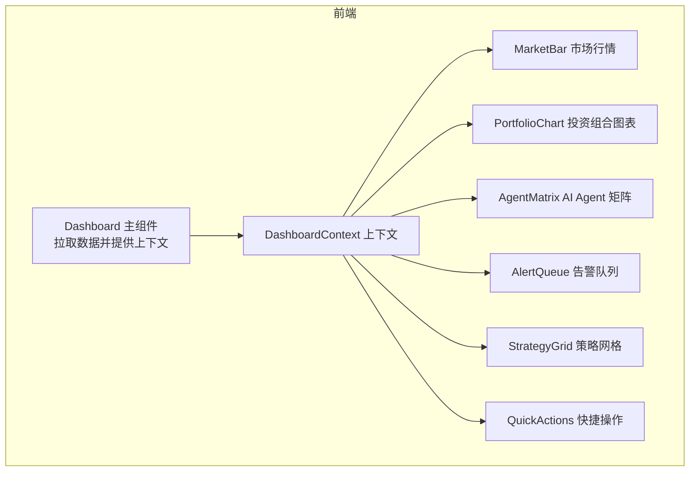

**图表来源**
- [frontend/src/screens/Dashboard/index.tsx:17-46](file://frontend/src/screens/Dashboard/index.tsx#L17-L46)
- [frontend/src/contexts/DashboardContext.tsx:1-13](file://frontend/src/contexts/DashboardContext.tsx#L1-L13)

**章节来源**
- [frontend/src/screens/Dashboard/index.tsx:1-47](file://frontend/src/screens/Dashboard/index.tsx#L1-L47)
- [frontend/src/contexts/DashboardContext.tsx:1-13](file://frontend/src/contexts/DashboardContext.tsx#L1-L13)

## 核心组件
- Dashboard 主组件：负责首次加载时调用 API 获取仪表板概览数据，设置初始状态并在根节点提供 DashboardContext，随后渲染子组件布局。
- DashboardContext：React Context，向下提供完整的仪表板数据对象，供所有子组件读取。
- 子组件：MarketBar、PortfolioChart、AgentMatrix、AlertQueue、StrategyGrid、QuickActions，分别承担不同信息域的展示与交互。

关键职责与数据来源：
- 数据来源：前端通过 api.dashboard.overview() 调用后端 /api/v1/dashboard/overview 接口，返回与前端 MockData 对齐的结构化数据。
- 数据共享：通过 DashboardProvider 将数据注入到子组件树，避免 props 深度传递。
- 生命周期：主组件在首次挂载时发起一次数据请求；图表类组件在初始化时建立可视化实例并监听窗口尺寸变化。

**章节来源**
- [frontend/src/screens/Dashboard/index.tsx:17-46](file://frontend/src/screens/Dashboard/index.tsx#L17-L46)
- [frontend/src/contexts/DashboardContext.tsx:1-13](file://frontend/src/contexts/DashboardContext.tsx#L1-L13)
- [frontend/src/lib/api.ts:550-553](file://frontend/src/lib/api.ts#L550-L553)
- [backend/app/api/v1/dashboard.py:121-135](file://backend/app/api/v1/dashboard.py#L121-L135)

## 架构总览
仪表板整体采用“请求-提供-渲染”三层架构：
- 请求层：前端 api.dashboard.overview() 发起 HTTP 请求
- 提供层：后端 /api/v1/dashboard/overview 返回结构化数据
- 渲染层：Dashboard 主组件提供上下文，子组件按需读取并渲染

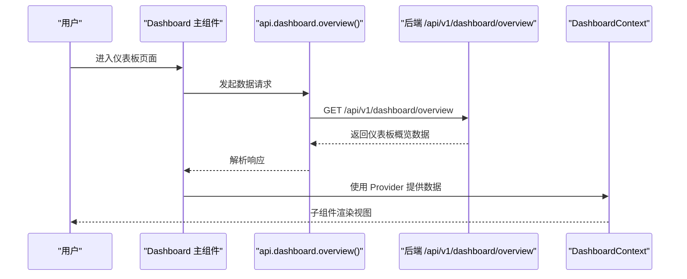

**图表来源**
- [frontend/src/screens/Dashboard/index.tsx:20-24](file://frontend/src/screens/Dashboard/index.tsx#L20-L24)
- [frontend/src/lib/api.ts:550-553](file://frontend/src/lib/api.ts#L550-L553)
- [backend/app/api/v1/dashboard.py:121-135](file://backend/app/api/v1/dashboard.py#L121-L135)

**章节来源**
- [frontend/src/screens/Dashboard/index.tsx:17-46](file://frontend/src/screens/Dashboard/index.tsx#L17-L46)
- [frontend/src/lib/api.ts:550-553](file://frontend/src/lib/api.ts#L550-L553)
- [backend/app/api/v1/dashboard.py:121-135](file://backend/app/api/v1/dashboard.py#L121-L135)

## 详细组件分析

### Dashboard 主组件与上下文
- 数据获取：在组件挂载时调用 api.dashboard.overview()，成功后设置状态；失败则记录错误日志。
- 上下文提供：使用 DashboardProvider 将数据注入整个子组件树。
- 布局组织：顶部 MarketBar，中部左右分区（左 PortfolioChart，右 AgentMatrix + AlertQueue），底部 StrategyGrid，底部外部 QuickActions。

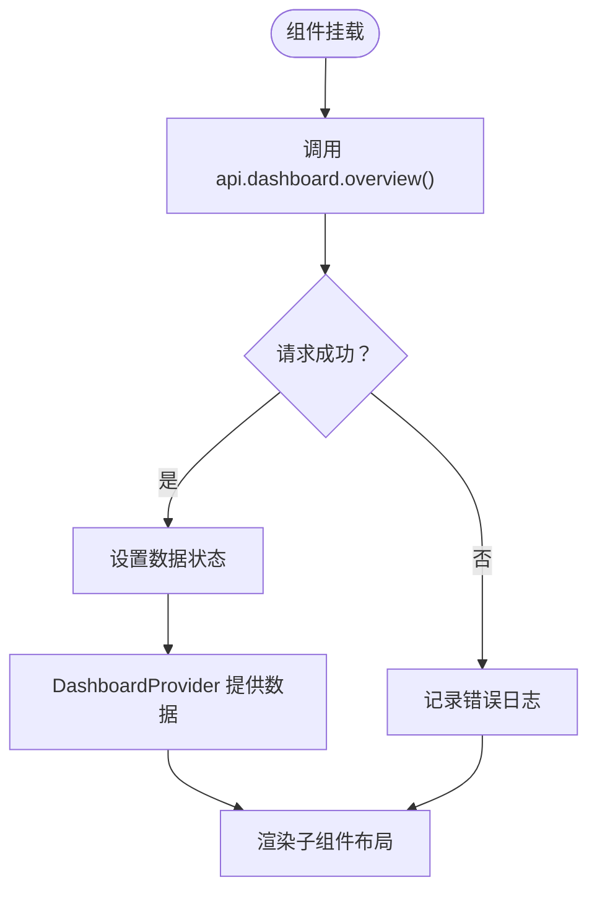

**图表来源**
- [frontend/src/screens/Dashboard/index.tsx:20-24](file://frontend/src/screens/Dashboard/index.tsx#L20-L24)
- [frontend/src/screens/Dashboard/index.tsx:29-44](file://frontend/src/screens/Dashboard/index.tsx#L29-L44)

**章节来源**
- [frontend/src/screens/Dashboard/index.tsx:17-46](file://frontend/src/screens/Dashboard/index.tsx#L17-L46)
- [frontend/src/contexts/DashboardContext.tsx:1-13](file://frontend/src/contexts/DashboardContext.tsx#L1-L13)

### MarketBar 市场行情显示
- 数据来源：从 DashboardContext 读取 marketIndices。
- 展示内容：指数名称、实时价格、涨跌幅、成交量等。
- 交互行为：格式化价格与百分比，区分涨跌颜色。

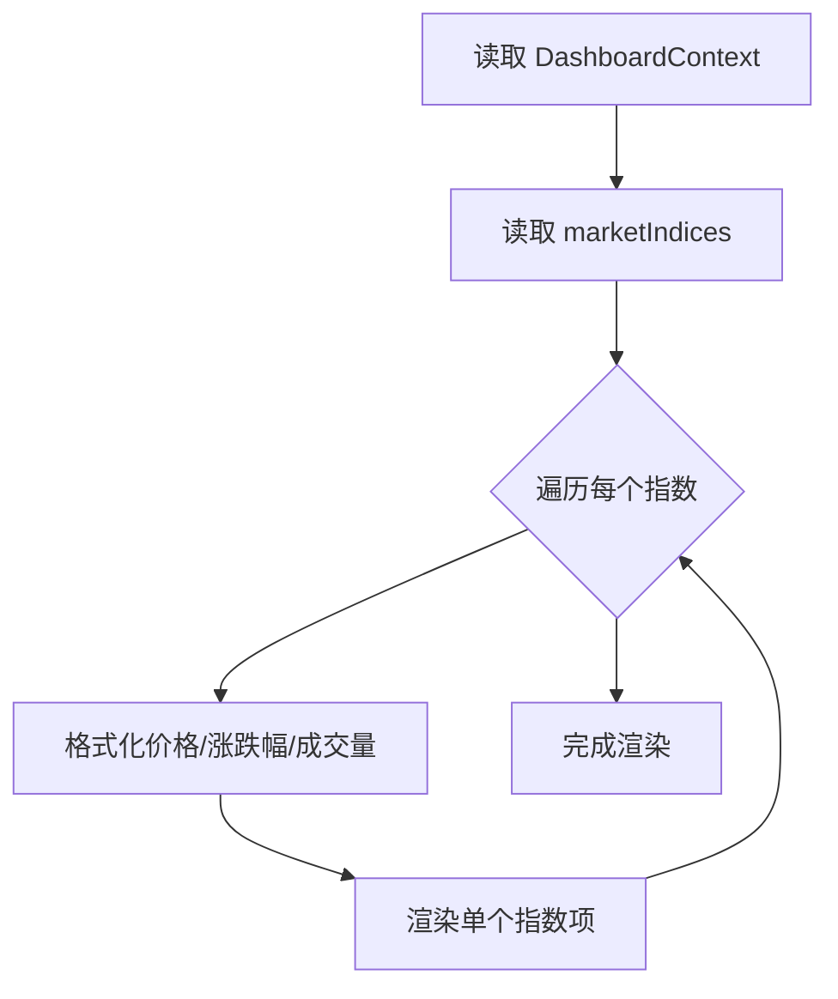

**图表来源**
- [frontend/src/screens/Dashboard/MarketBar.tsx:11-36](file://frontend/src/screens/Dashboard/MarketBar.tsx#L11-L36)

**章节来源**
- [frontend/src/screens/Dashboard/MarketBar.tsx:1-37](file://frontend/src/screens/Dashboard/MarketBar.tsx#L1-L37)

### PortfolioChart 投资组合图表
- 数据来源：从 DashboardContext 读取 equityCurve 与 portfolioMetrics。
- 图表库：使用 ECharts 初始化画布，设置网格、提示框、图例、坐标轴与折线系列。
- 时间范围：支持 1M/3M/6M/1Y/ALL 切换，动态裁剪数据序列。
- 生命周期：组件挂载时初始化 ECharts，监听窗口 resize 并在卸载时 dispose。

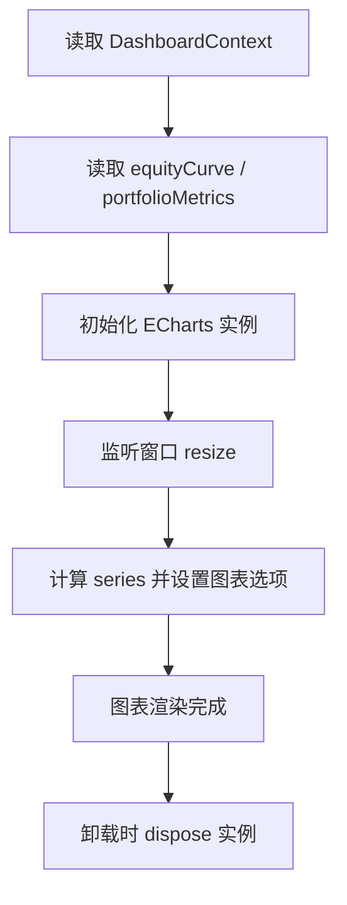

**图表来源**
- [frontend/src/screens/Dashboard/PortfolioChart.tsx:20-45](file://frontend/src/screens/Dashboard/PortfolioChart.tsx#L20-L45)
- [frontend/src/screens/Dashboard/PortfolioChart.tsx:47-141](file://frontend/src/screens/Dashboard/PortfolioChart.tsx#L47-L141)

**章节来源**
- [frontend/src/screens/Dashboard/PortfolioChart.tsx:1-198](file://frontend/src/screens/Dashboard/PortfolioChart.tsx#L1-L198)

### AgentMatrix AI Agent 矩阵
- 数据来源：从 DashboardContext 读取 agents。
- 展示内容：Agent 头像、名称、职责、指标、状态标签。
- 状态映射：将内部状态值映射为中文标签，统计活跃 Agent 数量。

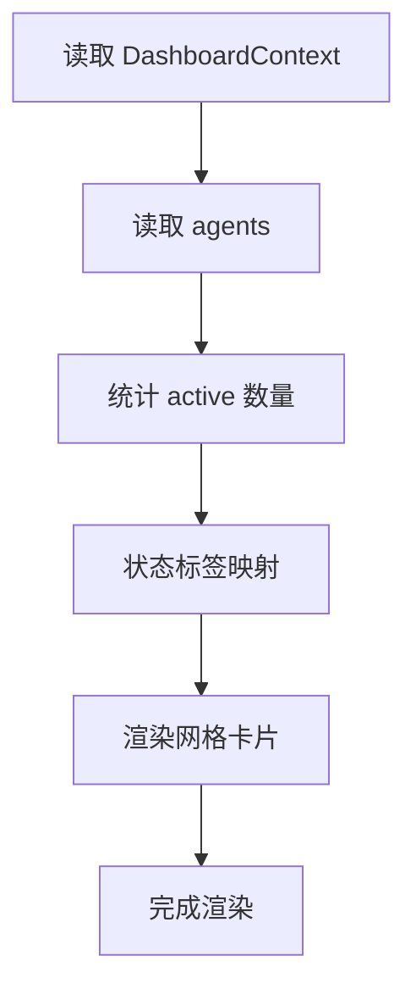

**图表来源**
- [frontend/src/screens/Dashboard/AgentMatrix.tsx:10-43](file://frontend/src/screens/Dashboard/AgentMatrix.tsx#L10-L43)

**章节来源**
- [frontend/src/screens/Dashboard/AgentMatrix.tsx:1-44](file://frontend/src/screens/Dashboard/AgentMatrix.tsx#L1-L44)

### AlertQueue 告警队列
- 数据来源：从 DashboardContext 读取 alerts。
- 分类与筛选：按 approval/risk/system 三类标签过滤显示。
- 交互行为：点击告警项可触发导航到对应目标（如 execution、strategy、risk）。

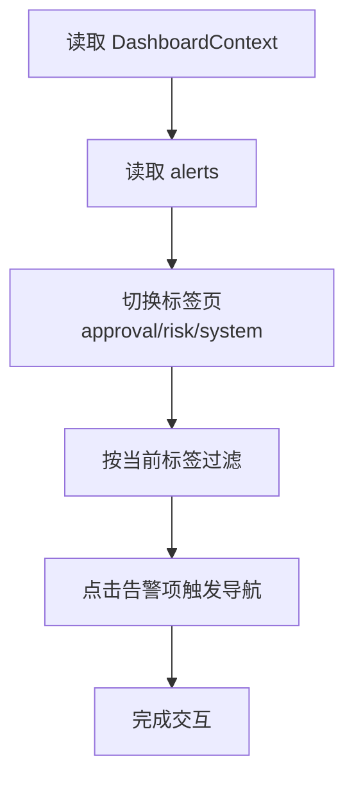

**图表来源**
- [frontend/src/screens/Dashboard/AlertQueue.tsx:16-70](file://frontend/src/screens/Dashboard/AlertQueue.tsx#L16-L70)

**章节来源**
- [frontend/src/screens/Dashboard/AlertQueue.tsx:1-71](file://frontend/src/screens/Dashboard/AlertQueue.tsx#L1-L71)

### StrategyGrid 策略网格
- 数据来源：从 DashboardContext 读取 strategies。
- 展示内容：策略名称、类型、状态、收益、时间序列（sparkline）、最后信号时间。
- 交互行为：点击卡片或“查看全部”按钮触发导航到策略页面。

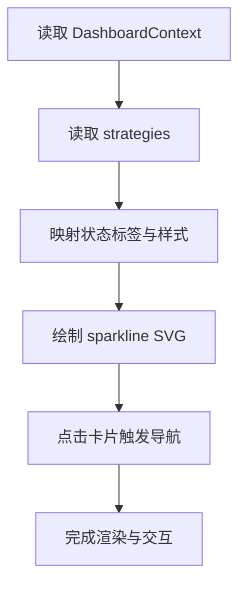

**图表来源**
- [frontend/src/screens/Dashboard/StrategyGrid.tsx:48-90](file://frontend/src/screens/Dashboard/StrategyGrid.tsx#L48-L90)

**章节来源**
- [frontend/src/screens/Dashboard/StrategyGrid.tsx:1-91](file://frontend/src/screens/Dashboard/StrategyGrid.tsx#L1-L91)

### QuickActions 快捷操作
- 数据来源：从 DashboardContext 读取 pendingApprovals。
- 行为：提供新建策略、批量回测、风控检查、审批中心等快捷入口；当存在待审批时显示徽标提醒。

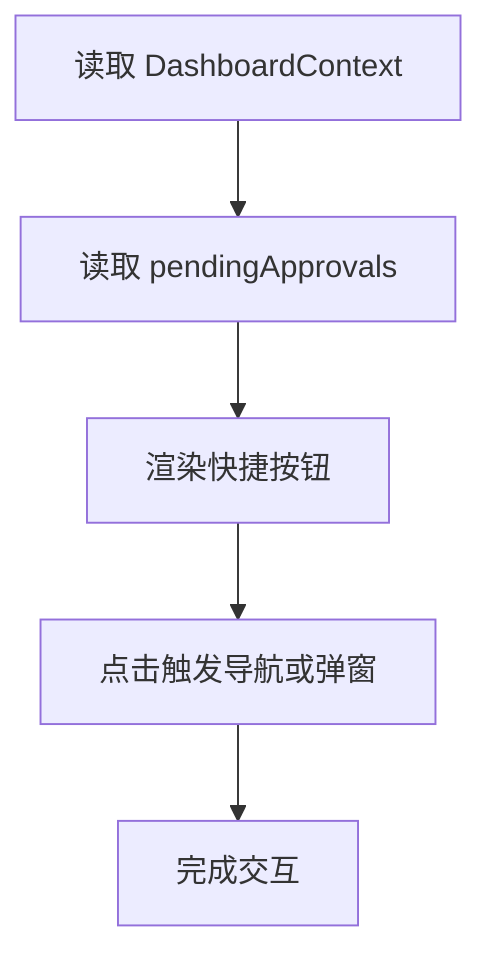

**图表来源**
- [frontend/src/screens/Dashboard/QuickActions.tsx:8-44](file://frontend/src/screens/Dashboard/QuickActions.tsx#L8-L44)

**章节来源**
- [frontend/src/screens/Dashboard/QuickActions.tsx:1-45](file://frontend/src/screens/Dashboard/QuickActions.tsx#L1-L45)

### DashboardProvider 上下文与数据共享
- 上下文定义：创建 Context 并导出 Provider 与自定义 hook useDashboard。
- 数据注入：主组件在根节点使用 Provider 将数据传给所有子组件。
- 错误处理：若在 Provider 外使用 useDashboard，抛出明确错误提示。

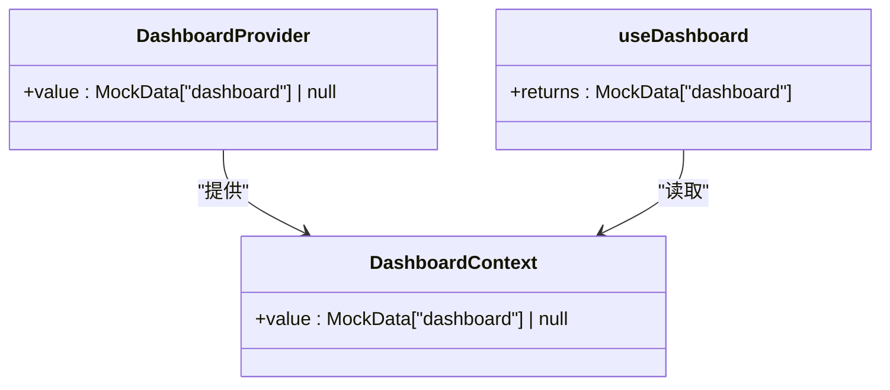

**图表来源**
- [frontend/src/contexts/DashboardContext.tsx:1-13](file://frontend/src/contexts/DashboardContext.tsx#L1-L13)

**章节来源**
- [frontend/src/contexts/DashboardContext.tsx:1-13](file://frontend/src/contexts/DashboardContext.tsx#L1-L13)

## 依赖关系分析
- 前端依赖：Dashboard 主组件依赖 api.dashboard.overview()；子组件依赖 useDashboard；GlassCard 作为通用卡片组件被多个子组件复用。
- 后端依赖：/api/v1/dashboard/overview 返回与前端 MockData 对齐的结构体，确保前后端契约稳定。
- 类型定义：前端 types.ts 与后端 schemas/dashboard.py 共同定义了仪表板数据结构。

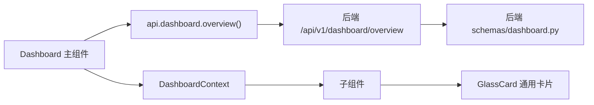

**图表来源**
- [frontend/src/screens/Dashboard/index.tsx:1-47](file://frontend/src/screens/Dashboard/index.tsx#L1-L47)
- [frontend/src/lib/api.ts:550-553](file://frontend/src/lib/api.ts#L550-L553)
- [backend/app/api/v1/dashboard.py:121-135](file://backend/app/api/v1/dashboard.py#L121-L135)
- [backend/app/schemas/dashboard.py:82-94](file://backend/app/schemas/dashboard.py#L82-L94)
- [frontend/src/components/GlassCard.tsx:1-49](file://frontend/src/components/GlassCard.tsx#L1-L49)

**章节来源**
- [frontend/src/lib/api.ts:550-553](file://frontend/src/lib/api.ts#L550-L553)
- [backend/app/api/v1/dashboard.py:121-135](file://backend/app/api/v1/dashboard.py#L121-L135)
- [backend/app/schemas/dashboard.py:82-94](file://backend/app/schemas/dashboard.py#L82-L94)
- [frontend/src/data/types.ts:1-647](file://frontend/src/data/types.ts#L1-L647)

## 性能考虑
- 图表性能：PortfolioChart 在组件卸载时释放 ECharts 实例，避免内存泄漏；监听窗口 resize 时仅触发 resize，减少重绘开销。
- 数据缓存：Dashboard 主组件仅在首次挂载时发起一次请求，避免重复拉取；后续可通过应用级状态或 WebSocket 更新（见 App.tsx 中的 WebSocket 连接）。
- 渲染优化：子组件通过 Context 读取数据，避免 props 深度传递；AlertQueue 与 StrategyGrid 内部使用状态切换与过滤，避免不必要的全量重渲染。
- 样式与主题：统一的主题变量与暗色背景减少视觉闪烁与重绘成本。

**章节来源**
- [frontend/src/screens/Dashboard/PortfolioChart.tsx:34-45](file://frontend/src/screens/Dashboard/PortfolioChart.tsx#L34-L45)
- [frontend/src/screens/Dashboard/AlertQueue.tsx:16-27](file://frontend/src/screens/Dashboard/AlertQueue.tsx#L16-L27)
- [frontend/src/screens/Dashboard/StrategyGrid.tsx:48-60](file://frontend/src/screens/Dashboard/StrategyGrid.tsx#L48-L60)
- [frontend/src/App.tsx:86-97](file://frontend/src/App.tsx#L86-L97)
- [frontend/src/index.css:3-23](file://frontend/src/index.css#L3-L23)

## 故障排除指南
- 401 未授权：api.ts 在收到 401 时清理本地 token 并触发全局事件，App.tsx 监听该事件并清空用户状态，引导重新登录。
- API 请求失败：Dashboard 主组件在请求失败时记录错误日志；可结合浏览器网络面板检查 /api/v1/dashboard/overview 是否可达。
- 上下文使用错误：在 DashboardProvider 外使用 useDashboard 会抛出错误，需确保组件在 Provider 包裹范围内使用。
- 图表渲染异常：PortfolioChart 在卸载时 dispose 实例；若出现内存泄漏，检查是否正确移除了 resize 监听与实例销毁。

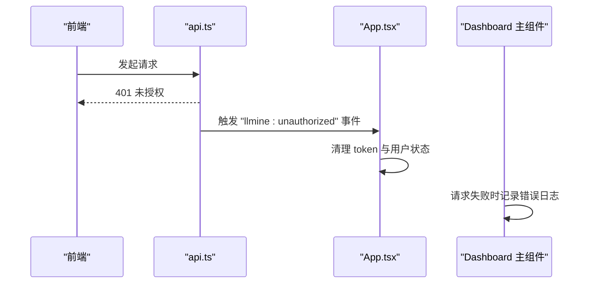

**图表来源**
- [frontend/src/lib/api.ts:27-30](file://frontend/src/lib/api.ts#L27-L30)
- [frontend/src/App.tsx:70-75](file://frontend/src/App.tsx#L70-L75)
- [frontend/src/screens/Dashboard/index.tsx:20-24](file://frontend/src/screens/Dashboard/index.tsx#L20-L24)

**章节来源**
- [frontend/src/lib/api.ts:27-30](file://frontend/src/lib/api.ts#L27-L30)
- [frontend/src/App.tsx:70-75](file://frontend/src/App.tsx#L70-L75)
- [frontend/src/screens/Dashboard/index.tsx:20-24](file://frontend/src/screens/Dashboard/index.tsx#L20-L24)

## 结论
本仪表板屏幕通过清晰的“请求-提供-渲染”架构实现了高效的数据共享与组件解耦。Dashboard 主组件负责一次性数据拉取与上下文提供，子组件通过 Context 读取数据并专注于各自领域的展示与交互。PortfolioChart 等图表组件具备良好的生命周期管理与资源释放机制，整体具备较好的性能与可维护性。建议后续引入 WebSocket 实时推送与缓存策略，进一步提升用户体验与系统吞吐能力。

## 附录
- 数据契约：前端 MockData 与后端 schemas/dashboard.py 保持一致，确保前后端数据结构稳定。
- 通用组件：GlassCard 提供统一的卡片样式与交互封装，便于子组件快速复用。

**章节来源**
- [backend/app/schemas/dashboard.py:1-94](file://backend/app/schemas/dashboard.py#L1-L94)
- [frontend/src/data/types.ts:1-647](file://frontend/src/data/types.ts#L1-L647)
- [frontend/src/components/GlassCard.tsx:1-49](file://frontend/src/components/GlassCard.tsx#L1-L49)