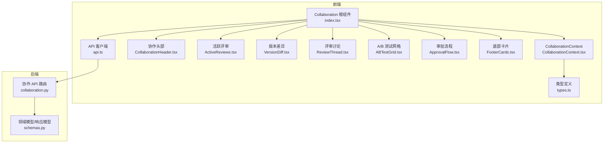
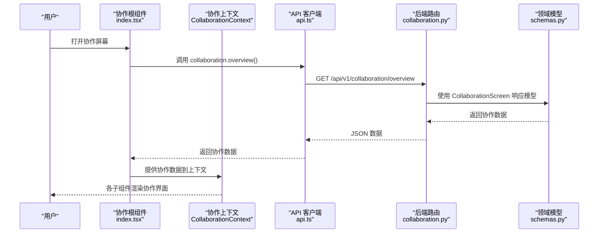
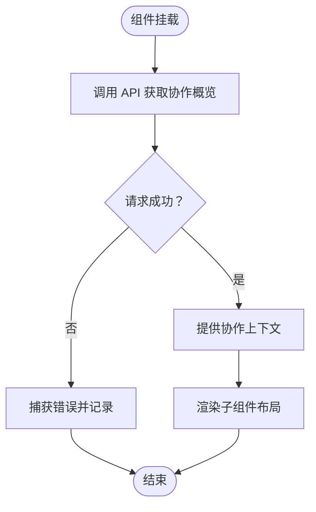
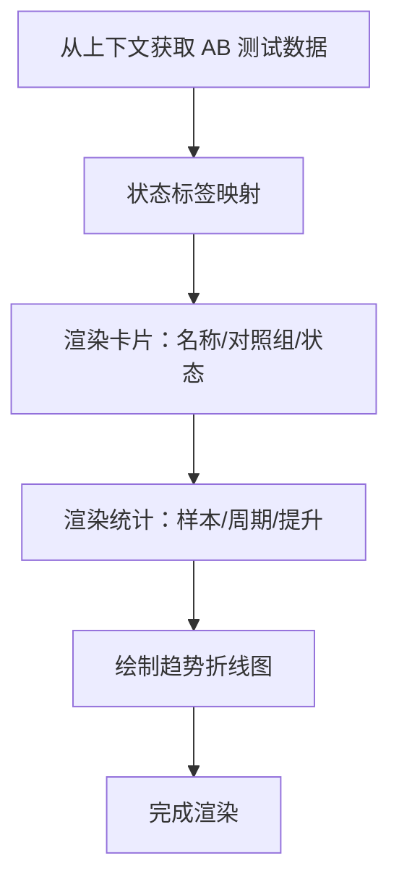
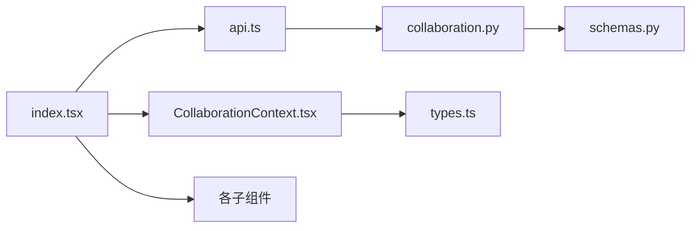

# 协作屏幕

<cite>
**本文档引用的文件**
- [frontend/src/screens/Collaboration/index.tsx](file://frontend/src/screens/Collaboration/index.tsx)
- [frontend/src/screens/Collaboration/CollaborationHeader.tsx](file://frontend/src/screens/Collaboration/CollaborationHeader.tsx)
- [frontend/src/screens/Collaboration/ActiveReviews.tsx](file://frontend/src/screens/Collaboration/ActiveReviews.tsx)
- [frontend/src/screens/Collaboration/VersionDiff.tsx](file://frontend/src/screens/Collaboration/VersionDiff.tsx)
- [frontend/src/screens/Collaboration/ReviewThread.tsx](file://frontend/src/screens/Collaboration/ReviewThread.tsx)
- [frontend/src/screens/Collaboration/ABTestGrid.tsx](file://frontend/src/screens/Collaboration/ABTestGrid.tsx)
- [frontend/src/screens/Collaboration/ApprovalFlow.tsx](file://frontend/src/screens/Collaboration/ApprovalFlow.tsx)
- [frontend/src/screens/Collaboration/FooterCards.tsx](file://frontend/src/screens/Collaboration/FooterCards.tsx)
- [frontend/src/contexts/CollaborationContext.tsx](file://frontend/src/contexts/CollaborationContext.tsx)
- [frontend/src/data/types.ts](file://frontend/src/data/types.ts)
- [frontend/src/lib/api.ts](file://frontend/src/lib/api.ts)
- [backend/app/api/v1/collaboration.py](file://backend/app/api/v1/collaboration.py)
- [backend/app/domains/collaboration/schemas.py](file://backend/app/domains/collaboration/schemas.py)
</cite>

## 目录
1. [简介](#简介)
2. [项目结构](#项目结构)
3. [核心组件](#核心组件)
4. [架构总览](#架构总览)
5. [详细组件分析](#详细组件分析)
6. [依赖关系分析](#依赖关系分析)
7. [性能考虑](#性能考虑)
8. [故障排除指南](#故障排除指南)
9. [结论](#结论)

## 简介
本文件为 llmine-quant 项目“协作屏幕”（Collaboration Lab）的专业组件文档。该界面面向量化策略研发与上线的团队协作场景，提供统一的评审、版本对比、A/B 对照实验、审批流程可视化与讨论记录管理能力。文档将从系统架构、组件职责、数据流、处理逻辑、集成点、错误处理与性能特征等方面进行深入解析，并结合前端 React 组件与后端 FastAPI 接口，给出可操作的实践建议。

## 项目结构
协作屏幕位于前端 screens/Collaboration 目录下，采用按功能分层的组织方式：
- 根组件负责数据拉取与上下文提供
- 子组件各自渲染特定业务板块
- 上下文用于在组件树内共享协作数据
- 类型定义与 API 客户端支撑数据契约与网络请求

**图表来源**
- [frontend/src/screens/Collaboration/index.tsx:18-46](file://frontend/src/screens/Collaboration/index.tsx#L18-L46)
- [frontend/src/contexts/CollaborationContext.tsx:1-13](file://frontend/src/contexts/CollaborationContext.tsx#L1-L13)
- [frontend/src/lib/api.ts:744-747](file://frontend/src/lib/api.ts#L744-L747)
- [backend/app/api/v1/collaboration.py:20-105](file://backend/app/api/v1/collaboration.py#L20-L105)
- [backend/app/domains/collaboration/schemas.py:80-88](file://backend/app/domains/collaboration/schemas.py#L80-L88)

**章节来源**
- [frontend/src/screens/Collaboration/index.tsx:1-47](file://frontend/src/screens/Collaboration/index.tsx#L1-L47)
- [frontend/src/contexts/CollaborationContext.tsx:1-13](file://frontend/src/contexts/CollaborationContext.tsx#L1-L13)
- [frontend/src/lib/api.ts:744-747](file://frontend/src/lib/api.ts#L744-L747)
- [backend/app/api/v1/collaboration.py:20-105](file://backend/app/api/v1/collaboration.py#L20-L105)
- [backend/app/domains/collaboration/schemas.py:80-88](file://backend/app/domains/collaboration/schemas.py#L80-L88)

## 核心组件
- 协作根组件：负责初始化加载协作数据并提供上下文，布局协调各子组件。
- 协作头部：展示项目概览与 KPI，提供全局状态与创建评审任务入口。
- 活跃评审：呈现当前评审任务列表及其评审者决策状态。
- 版本差异：以表格形式对比版本变更字段、旧值、新值与影响说明。
- 评审讨论：按角色与标签展示评审讨论内容。
- A/B 测试网格：展示多组对照实验的状态、样本数、周期、改进幅度与折线图。
- 审批流程：以阶段化流程图展示审批进度与责任人。
- 底部卡片：展示协作规范与指南类提示信息。
- 协作上下文：提供协作数据的全局访问。
- 类型定义与 API 客户端：定义数据契约与封装后端接口调用。

**章节来源**
- [frontend/src/screens/Collaboration/index.tsx:18-46](file://frontend/src/screens/Collaboration/index.tsx#L18-L46)
- [frontend/src/screens/Collaboration/CollaborationHeader.tsx:1-35](file://frontend/src/screens/Collaboration/CollaborationHeader.tsx#L1-L35)
- [frontend/src/screens/Collaboration/ActiveReviews.tsx:1-62](file://frontend/src/screens/Collaboration/ActiveReviews.tsx#L1-L62)
- [frontend/src/screens/Collaboration/VersionDiff.tsx:1-34](file://frontend/src/screens/Collaboration/VersionDiff.tsx#L1-L34)
- [frontend/src/screens/Collaboration/ReviewThread.tsx:1-34](file://frontend/src/screens/Collaboration/ReviewThread.tsx#L1-L34)
- [frontend/src/screens/Collaboration/ABTestGrid.tsx:1-77](file://frontend/src/screens/Collaboration/ABTestGrid.tsx#L1-L77)
- [frontend/src/screens/Collaboration/ApprovalFlow.tsx:1-41](file://frontend/src/screens/Collaboration/ApprovalFlow.tsx#L1-L41)
- [frontend/src/screens/Collaboration/FooterCards.tsx:1-19](file://frontend/src/screens/Collaboration/FooterCards.tsx#L1-L19)
- [frontend/src/contexts/CollaborationContext.tsx:1-13](file://frontend/src/contexts/CollaborationContext.tsx#L1-L13)
- [frontend/src/data/types.ts:560-600](file://frontend/src/data/types.ts#L560-L600)
- [frontend/src/lib/api.ts:744-747](file://frontend/src/lib/api.ts#L744-L747)

## 架构总览
协作屏幕采用“根组件 + 上下文 + 多子组件”的前端架构，配合后端协作 API 提供统一的数据源。整体交互流程如下：

**图表来源**
- [frontend/src/screens/Collaboration/index.tsx:18-25](file://frontend/src/screens/Collaboration/index.tsx#L18-L25)
- [frontend/src/lib/api.ts:744-747](file://frontend/src/lib/api.ts#L744-L747)
- [backend/app/api/v1/collaboration.py:94-105](file://backend/app/api/v1/collaboration.py#L94-L105)
- [backend/app/domains/collaboration/schemas.py:80-88](file://backend/app/domains/collaboration/schemas.py#L80-L88)

## 详细组件分析

### 协作根组件（Collaboration）
- 职责：拉取协作数据、提供上下文、组织布局。
- 关键点：
  - 首次挂载时调用 API 获取协作概览数据。
  - 将数据注入协作上下文，供子组件使用。
  - 布局分为主区（活跃评审 + 版本差异）、副区（评审讨论 + A/B 测试网格）、审批流程与底部卡片。

**图表来源**
- [frontend/src/screens/Collaboration/index.tsx:18-25](file://frontend/src/screens/Collaboration/index.tsx#L18-L25)
- [frontend/src/screens/Collaboration/index.tsx:29-45](file://frontend/src/screens/Collaboration/index.tsx#L29-L45)

**章节来源**
- [frontend/src/screens/Collaboration/index.tsx:18-46](file://frontend/src/screens/Collaboration/index.tsx#L18-L46)

### 协作头部（CollaborationHeader）
- 职责：展示项目标题、副标题、KPI 区域与快捷操作按钮。
- 关键点：
  - 从上下文中读取 KPI 列表并渲染。
  - 提供“查看全局状态”“创建评审任务”等入口，支持回调通知父级。

**章节来源**
- [frontend/src/screens/Collaboration/CollaborationHeader.tsx:1-35](file://frontend/src/screens/Collaboration/CollaborationHeader.tsx#L1-L35)
- [frontend/src/contexts/CollaborationContext.tsx:8-12](file://frontend/src/contexts/CollaborationContext.tsx#L8-L12)

### 活跃评审（ActiveReviews）
- 职责：展示当前评审任务列表，包含策略名、版本前后、优先级、状态与评审者决策。
- 关键点：
  - 使用状态标签与优先级标签区分视觉层级。
  - 评审者图标直观表达“同意/需修改/待评审”。

**章节来源**
- [frontend/src/screens/Collaboration/ActiveReviews.tsx:1-62](file://frontend/src/screens/Collaboration/ActiveReviews.tsx#L1-L62)

### 版本差异（VersionDiff）
- 职责：对比两个版本的关键字段变更，标注影响。
- 关键点：
  - 表头显示对比摘要与变更条数。
  - 表格逐行展示字段、旧值、新值与影响说明。

**章节来源**
- [frontend/src/screens/Collaboration/VersionDiff.tsx:1-34](file://frontend/src/screens/Collaboration/VersionDiff.tsx#L1-L34)

### 评审讨论（ReviewThread）
- 职责：按角色与标签展示评审过程中的讨论内容。
- 关键点：
  - 角色头像与标签帮助快速识别身份与状态。
  - 文本区域承载评审意见与建议。

**章节来源**
- [frontend/src/screens/Collaboration/ReviewThread.tsx:1-34](file://frontend/src/screens/Collaboration/ReviewThread.tsx#L1-L34)

### A/B 测试网格（ABTestGrid）
- 职责：并行展示多个对照实验的运行状态、样本数、周期、改进幅度与趋势折线。
- 关键点：
  - 状态映射中文标签，便于非技术用户理解。
  - 内嵌 SVG 折线图展示收益趋势。

**图表来源**
- [frontend/src/screens/Collaboration/ABTestGrid.tsx:32-76](file://frontend/src/screens/Collaboration/ABTestGrid.tsx#L32-L76)

**章节来源**
- [frontend/src/screens/Collaboration/ABTestGrid.tsx:1-77](file://frontend/src/screens/Collaboration/ABTestGrid.tsx#L1-L77)

### 审批流程（ApprovalFlow）
- 职责：以阶段化流程图展示审批进度，包含完成比例与责任人。
- 关键点：
  - 计算完成阶段占比并渲染进度条。
  - 阶段点连接线体现流程顺序。

**章节来源**
- [frontend/src/screens/Collaboration/ApprovalFlow.tsx:1-41](file://frontend/src/screens/Collaboration/ApprovalFlow.tsx#L1-L41)

### 底部卡片（FooterCards）
- 职责：展示协作规范、指南等提示信息卡片。
- 关键点：
  - 标签分类辅助快速识别信息类别。

**章节来源**
- [frontend/src/screens/Collaboration/FooterCards.tsx:1-19](file://frontend/src/screens/Collaboration/FooterCards.tsx#L1-L19)

### 协作上下文（CollaborationContext）
- 职责：提供协作数据的全局访问，确保子组件无需层层传递 props。
- 关键点：
  - 提供 Provider 与 hook，未在 Provider 内使用会抛出错误。

**章节来源**
- [frontend/src/contexts/CollaborationContext.tsx:1-13](file://frontend/src/contexts/CollaborationContext.tsx#L1-L13)

### 类型定义与 API 客户端
- 类型定义：前端 MockData 中定义了 collaboration 字段的完整结构，确保组件与后端数据一致。
- API 客户端：封装了协作相关接口，包括概览与评审审批等。

**章节来源**
- [frontend/src/data/types.ts:560-600](file://frontend/src/data/types.ts#L560-L600)
- [frontend/src/lib/api.ts:744-747](file://frontend/src/lib/api.ts#L744-L747)

### 后端协作 API 与领域模型
- 路由：提供 /collaboration/overview 获取协作屏幕数据；提供 /collaboration/reviews/{id}/approve 审批接口示例。
- 领域模型：使用 Pydantic 模型定义 KPI、评审、差异面板、讨论项、AB 测试、审批阶段与底部卡片等结构。

**章节来源**
- [backend/app/api/v1/collaboration.py:94-112](file://backend/app/api/v1/collaboration.py#L94-L112)
- [backend/app/domains/collaboration/schemas.py:6-88](file://backend/app/domains/collaboration/schemas.py#L6-L88)

## 依赖关系分析
- 组件耦合：
  - 子组件仅依赖协作上下文，降低耦合度。
  - 根组件承担数据拉取与上下文提供，形成清晰的单向数据流。
- 外部依赖：
  - 前端依赖 API 客户端与后端协作路由。
  - 后端依赖 SQLAlchemy 会话与 Pydantic 模型。
- 潜在循环依赖：
  - 当前结构为单向依赖，无循环风险。

**图表来源**
- [frontend/src/screens/Collaboration/index.tsx:18-46](file://frontend/src/screens/Collaboration/index.tsx#L18-L46)
- [frontend/src/lib/api.ts:744-747](file://frontend/src/lib/api.ts#L744-L747)
- [backend/app/api/v1/collaboration.py:94-105](file://backend/app/api/v1/collaboration.py#L94-L105)
- [backend/app/domains/collaboration/schemas.py:80-88](file://backend/app/domains/collaboration/schemas.py#L80-L88)

**章节来源**
- [frontend/src/screens/Collaboration/index.tsx:18-46](file://frontend/src/screens/Collaboration/index.tsx#L18-L46)
- [frontend/src/lib/api.ts:744-747](file://frontend/src/lib/api.ts#L744-L747)
- [backend/app/api/v1/collaboration.py:94-105](file://backend/app/api/v1/collaboration.py#L94-L105)
- [backend/app/domains/collaboration/schemas.py:80-88](file://backend/app/domains/collaboration/schemas.py#L80-L88)

## 性能考虑
- 数据缓存：根组件一次性拉取协作数据，后续组件直接从上下文读取，避免重复请求。
- 渲染优化：子组件按需渲染，列表组件使用稳定 key，减少重排。
- 图形渲染：A/B 测试网格的折线图采用 SVG，轻量且可缩放。
- 网络请求：API 客户端统一处理鉴权头与 401 处理，减少组件内样板代码。

## 故障排除指南
- 未在协作上下文中使用 hook
  - 现象：调用 useCollaboration 抛出错误。
  - 处理：确保根组件已提供协作上下文。
- API 请求失败
  - 现象：控制台输出协作 API 错误日志。
  - 处理：检查网络连通性与鉴权状态；确认后端路由可用。
- 审批接口返回异常
  - 现象：审批请求返回非 2xx。
  - 处理：根据后端返回体或错误消息定位问题；必要时刷新页面重试。

**章节来源**
- [frontend/src/contexts/CollaborationContext.tsx:8-12](file://frontend/src/contexts/CollaborationContext.tsx#L8-L12)
- [frontend/src/screens/Collaboration/index.tsx:21-25](file://frontend/src/screens/Collaboration/index.tsx#L21-L25)
- [frontend/src/lib/api.ts:32-57](file://frontend/src/lib/api.ts#L32-L57)
- [backend/app/api/v1/collaboration.py:108-112](file://backend/app/api/v1/collaboration.py#L108-L112)

## 结论
协作屏幕通过清晰的组件划分与上下文共享，实现了评审、版本对比、A/B 对照、审批流程与讨论管理的一体化展示。前端采用 React Hooks 与上下文模式，后端以 FastAPI 与 Pydantic 模型提供稳定的数据契约。整体架构具备良好的扩展性与可维护性，适合在团队协作与策略上线流程中持续演进。