# 回测屏幕

<cite>
**本文引用的文件**   
- [frontend/src/screens/Backtest/index.tsx](file://frontend/src/screens/Backtest/index.tsx)
- [frontend/src/screens/Backtest/EquityChart.tsx](file://frontend/src/screens/Backtest/EquityChart.tsx)
- [frontend/src/screens/Backtest/KpiStrip.tsx](file://frontend/src/screens/Backtest/KpiStrip.tsx)
- [frontend/src/screens/Backtest/WalkForwardBars.tsx](file://frontend/src/screens/Backtest/WalkForwardBars.tsx)
- [frontend/src/screens/Backtest/ConfidenceTower.tsx](file://frontend/src/screens/Backtest/ConfidenceTower.tsx)
- [frontend/src/screens/Backtest/EquityDivergence.tsx](file://frontend/src/screens/Backtest/EquityDivergence.tsx)
- [frontend/src/screens/Backtest/MonthlyHeatmap.tsx](file://frontend/src/screens/Backtest/MonthlyHeatmap.tsx)
- [frontend/src/screens/Backtest/StressScenarios.tsx](file://frontend/src/screens/Backtest/StressScenarios.tsx)
- [frontend/src/screens/Backtest/ParameterHeatmap.tsx](file://frontend/src/screens/Backtest/ParameterHeatmap.tsx)
- [frontend/src/contexts/BacktestContext.tsx](file://frontend/src/contexts/BacktestContext.tsx)
- [frontend/src/data/types.ts](file://frontend/src/data/types.ts)
- [frontend/src/lib/api.ts](file://frontend/src/lib/api.ts)
- [frontend/src/components/GlassCard.tsx](file://frontend/src/components/GlassCard.tsx)
</cite>

## 目录
1. [简介](#简介)
2. [项目结构](#项目结构)
3. [核心组件](#核心组件)
4. [架构总览](#架构总览)
5. [组件详解](#组件详解)
6. [依赖关系分析](#依赖关系分析)
7. [性能考量](#性能考量)
8. [故障排查指南](#故障排查指南)
9. [结论](#结论)
10. [附录](#附录)

## 简介
本文件面向 llmine-quant 的“回测屏幕”，系统化梳理回测结果可视化界面的架构设计与实现细节，涵盖净值曲线图表（EquityChart）、关键指标条（KpiStrip）、Walk-forward 柱状图（WalkForwardBars）、置信塔（ConfidenceTower）、等额收益分歧（EquityDivergence）、月度热力图（MonthlyHeatmap）、压力情景（StressScenarios）、参数热力图（ParameterHeatmap）等组件。文档同时解释回测数据加载机制、图表组件的交互设计与性能优化策略，帮助开发者与使用者高效理解与扩展该界面。

## 项目结构
回测屏幕位于前端目录的 screens/Backtest 下，采用按功能模块划分的组织方式：每个可视化组件独立封装，通过上下文或外部数据驱动渲染；顶层工作台负责配置项、任务生命周期与结果面板切换。

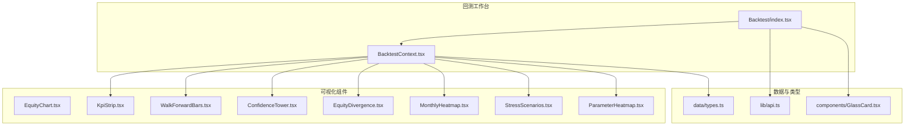

**图表来源**
- [frontend/src/screens/Backtest/index.tsx:137-362](file://frontend/src/screens/Backtest/index.tsx#L137-L362)
- [frontend/src/contexts/BacktestContext.tsx:1-13](file://frontend/src/contexts/BacktestContext.tsx#L1-L13)
- [frontend/src/lib/api.ts:135-200](file://frontend/src/lib/api.ts#L135-L200)
- [frontend/src/data/types.ts:77-125](file://frontend/src/data/types.ts#L77-L125)
- [frontend/src/components/GlassCard.tsx:1-49](file://frontend/src/components/GlassCard.tsx#L1-L49)

**章节来源**
- [frontend/src/screens/Backtest/index.tsx:137-362](file://frontend/src/screens/Backtest/index.tsx#L137-L362)

## 核心组件
- 回测工作台（Backtest/index.tsx）
  - 负责策略源选择、股票池构建（手动/Agent）、参数配置、成本假设、回测执行与结果面板切换。
  - 提供运行状态管理（回测/Walk-Forward/敏感性）、历史记录加载与任务详情联动。
- 上下文（BacktestContext）
  - 通过 Provider 向各子组件注入回测数据结构，简化跨层级数据传递。
- 图表与指标组件
  - EquityChart：净值曲线与回撤叠加展示，支持 IS/OOS 分割标记。
  - KpiStrip：关键指标条，按指标趋势与数值等级着色。
  - WalkForwardBars：Walk-Forward 折叠收益对比，突出 IS/OOS 偏离。
  - ConfidenceTower：AI 综合置信度仪表盘，分解特征得分。
  - EquityDivergence：IS/OOS 等额收益分歧对比，标注最大收益点与稳定性比率。
  - MonthlyHeatmap：月度收益热力图，支持 YTD 计算与颜色强度映射。
  - StressScenarios：压力情景卡片，展示严重程度、组合损失、最大回撤与建议。
  - ParameterHeatmap：参数敏感性热力图，标注最佳参数组合与评分。

**章节来源**
- [frontend/src/screens/Backtest/index.tsx:137-362](file://frontend/src/screens/Backtest/index.tsx#L137-L362)
- [frontend/src/contexts/BacktestContext.tsx:1-13](file://frontend/src/contexts/BacktestContext.tsx#L1-L13)
- [frontend/src/screens/Backtest/EquityChart.tsx:1-189](file://frontend/src/screens/Backtest/EquityChart.tsx#L1-L189)
- [frontend/src/screens/Backtest/KpiStrip.tsx:1-19](file://frontend/src/screens/Backtest/KpiStrip.tsx#L1-L19)
- [frontend/src/screens/Backtest/WalkForwardBars.tsx:1-81](file://frontend/src/screens/Backtest/WalkForwardBars.tsx#L1-L81)
- [frontend/src/screens/Backtest/ConfidenceTower.tsx:1-60](file://frontend/src/screens/Backtest/ConfidenceTower.tsx#L1-L60)
- [frontend/src/screens/Backtest/EquityDivergence.tsx:1-278](file://frontend/src/screens/Backtest/EquityDivergence.tsx#L1-L278)
- [frontend/src/screens/Backtest/MonthlyHeatmap.tsx:1-87](file://frontend/src/screens/Backtest/MonthlyHeatmap.tsx#L1-L87)
- [frontend/src/screens/Backtest/StressScenarios.tsx:1-65](file://frontend/src/screens/Backtest/StressScenarios.tsx#L1-L65)
- [frontend/src/screens/Backtest/ParameterHeatmap.tsx:1-88](file://frontend/src/screens/Backtest/ParameterHeatmap.tsx#L1-L88)

## 架构总览
回测屏幕采用“工作台 + 组件库”的分层架构：
- 工作台负责输入配置、任务调度与结果面板切换；
- 组件通过上下文消费统一数据模型，实现解耦与复用；
- 图表组件基于 ECharts 实现，具备响应式布局与主题一致性；
- 数据类型定义与 API 层提供强类型约束与错误处理。

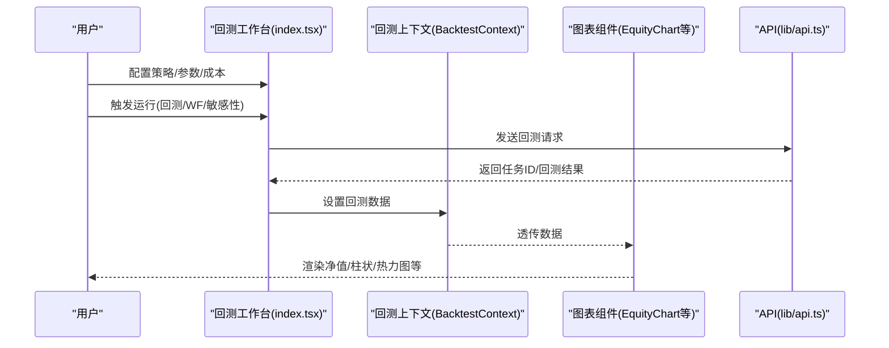

**图表来源**
- [frontend/src/screens/Backtest/index.tsx:292-333](file://frontend/src/screens/Backtest/index.tsx#L292-L333)
- [frontend/src/contexts/BacktestContext.tsx:1-13](file://frontend/src/contexts/BacktestContext.tsx#L1-L13)
- [frontend/src/lib/api.ts:135-200](file://frontend/src/lib/api.ts#L135-L200)

## 组件详解

### 净值曲线图表（EquityChart）
- 数据准备
  - 将基准归一化为 1，计算净值曲线百分比与回撤百分比序列。
  - 根据 inSampleEndDate 计算分割索引，用于后续 markArea/markLine。
- 图表配置
  - 双轴布局：上方净值曲线（累计收益），下方回撤曲线（最大至 0）。
  - Tooltip、Legend、Grid、X/Y 轴样式统一，支持跨屏响应。
  - IS/OOS 分割：垂直虚线与浅色区域高亮，增强可读性。
- 交互与性能
  - ResizeObserver 自适应容器尺寸变化。
  - ECharts Canvas 渲染，动画时长与渐变色彩提升观感。

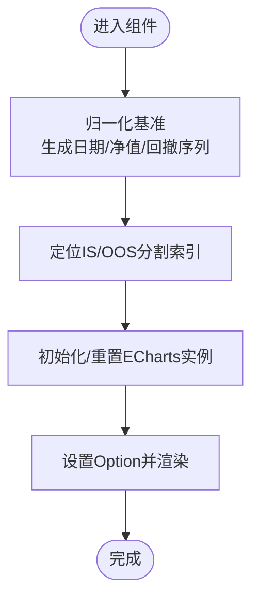

**图表来源**
- [frontend/src/screens/Backtest/EquityChart.tsx:14-26](file://frontend/src/screens/Backtest/EquityChart.tsx#L14-L26)
- [frontend/src/screens/Backtest/EquityChart.tsx:74-181](file://frontend/src/screens/Backtest/EquityChart.tsx#L74-L181)

**章节来源**
- [frontend/src/screens/Backtest/EquityChart.tsx:1-189](file://frontend/src/screens/Backtest/EquityChart.tsx#L1-L189)

### 关键指标条（KpiStrip）
- 数据来源：BacktestContext 提供的 kpis 数组。
- 展示要点：标签、数值、趋势与按 tone 着色的条带，紧凑排列便于快速浏览。
- 设计原则：信息密度高、颜色语义明确、与整体风格一致。

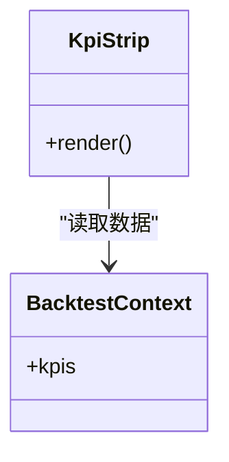

**图表来源**
- [frontend/src/screens/Backtest/KpiStrip.tsx:1-19](file://frontend/src/screens/Backtest/KpiStrip.tsx#L1-L19)
- [frontend/src/contexts/BacktestContext.tsx:1-13](file://frontend/src/contexts/BacktestContext.tsx#L1-L13)

**章节来源**
- [frontend/src/screens/Backtest/KpiStrip.tsx:1-19](file://frontend/src/screens/Backtest/KpiStrip.tsx#L1-L19)

### Walk-forward 柱状图（WalkForwardBars）
- 数据聚合
  - 计算所有折 IS/OOS 收益绝对值的最大值，作为相对宽度基准。
  - 统计 IS/OOS 符号不同或差值超过阈值的折数，高亮“偏离”。
- 可视化
  - 两列对比：IS 与 OOS，正负分别用不同类名控制样式。
  - 图例与标题清晰标识“折数”“偏离”等关键信息。

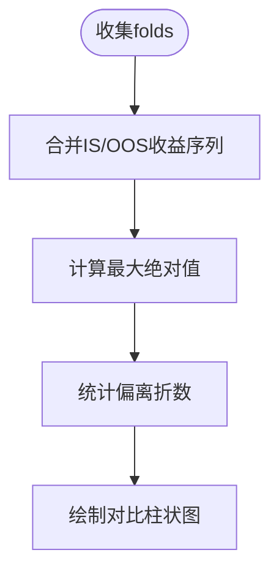

**图表来源**
- [frontend/src/screens/Backtest/WalkForwardBars.tsx:7-17](file://frontend/src/screens/Backtest/WalkForwardBars.tsx#L7-L17)

**章节来源**
- [frontend/src/screens/Backtest/WalkForwardBars.tsx:1-81](file://frontend/src/screens/Backtest/WalkForwardBars.tsx#L1-L81)

### 置信塔（ConfidenceTower）
- 数据与评分
  - 综合置信度 score 映射到 0~1 区间，计算圆周与描边长度。
  - 按阈值分级（高/中/低）决定主色调与渐变色。
- 特征分解
  - features 列表逐项展示标题、描述与评分，配合 tone 着色。

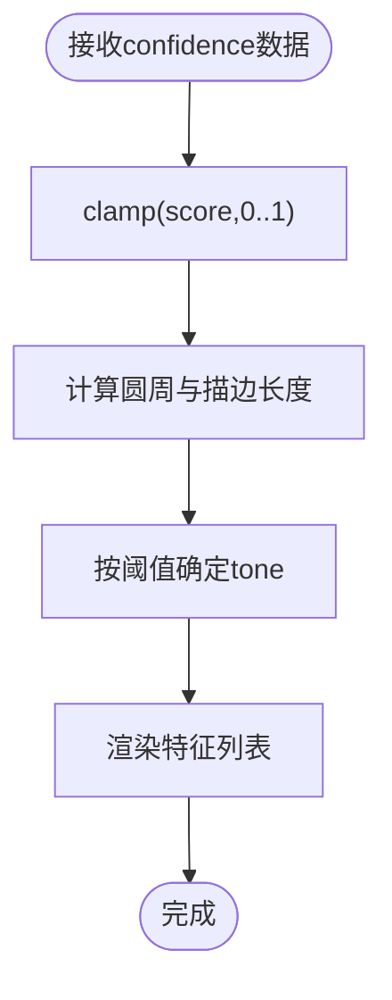

**图表来源**
- [frontend/src/screens/Backtest/ConfidenceTower.tsx:7-11](file://frontend/src/screens/Backtest/ConfidenceTower.tsx#L7-L11)
- [frontend/src/screens/Backtest/ConfidenceTower.tsx:47-56](file://frontend/src/screens/Backtest/ConfidenceTower.tsx#L47-L56)

**章节来源**
- [frontend/src/screens/Backtest/ConfidenceTower.tsx:1-60](file://frontend/src/screens/Backtest/ConfidenceTower.tsx#L1-L60)

### 等额收益分歧（EquityDivergence）
- 数据对齐
  - 将 IS/OOS 与 Drawdown 按日期对齐，缺失日期补 null，保证折线连续性。
  - 计算 per-week 增长率与稳定性比率（OOS/IS 百分比）。
- 图表与标注
  - 上方两条曲线分别标注最大收益点（+xx%）。
  - 下方回撤曲线仅显示负值区域，强调风险。
- 性能
  - 使用 pendingOptionRef 缓存 Option，避免重复计算；ResizeObserver 动态初始化。

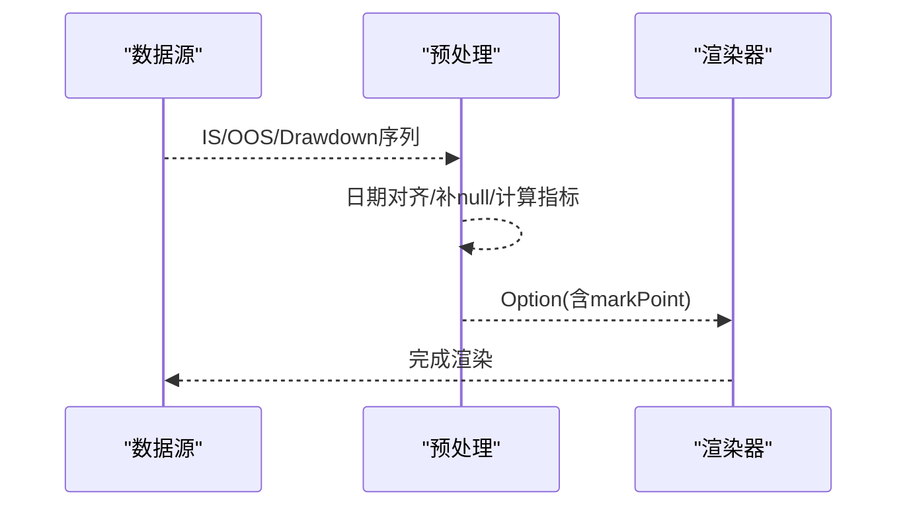

**图表来源**
- [frontend/src/screens/Backtest/EquityDivergence.tsx:12-42](file://frontend/src/screens/Backtest/EquityDivergence.tsx#L12-L42)
- [frontend/src/screens/Backtest/EquityDivergence.tsx:164-179](file://frontend/src/screens/Backtest/EquityDivergence.tsx#L164-L179)
- [frontend/src/screens/Backtest/EquityDivergence.tsx:240-244](file://frontend/src/screens/Backtest/EquityDivergence.tsx#L240-L244)

**章节来源**
- [frontend/src/screens/Backtest/EquityDivergence.tsx:1-278](file://frontend/src/screens/Backtest/EquityDivergence.tsx#L1-L278)

### 月度热力图（MonthlyHeatmap）
- 输入格式
  - monthlyReturns 为“年-月”到收益的映射。
- 可视化
  - 每年一行，12 个月单元格，颜色强度与透明度随收益绝对值线性变化。
  - 计算 YTD 并在右侧单独单元格展示，支持 hover 提示。
- 辅助函数
  - pct 与 cellColor 将数值映射为颜色字符串，保持视觉一致性。

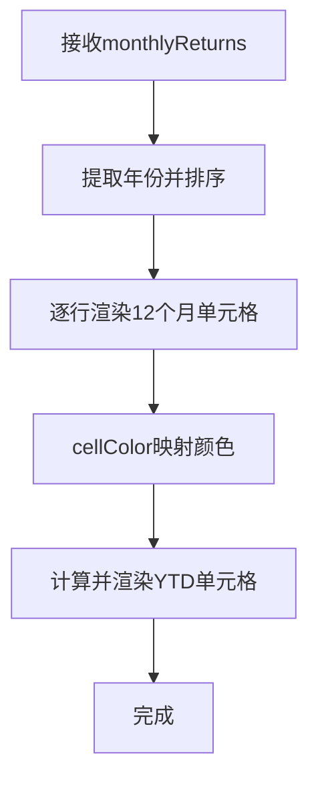

**图表来源**
- [frontend/src/screens/Backtest/MonthlyHeatmap.tsx:23-26](file://frontend/src/screens/Backtest/MonthlyHeatmap.tsx#L23-L26)
- [frontend/src/screens/Backtest/MonthlyHeatmap.tsx:51-56](file://frontend/src/screens/Backtest/MonthlyHeatmap.tsx#L51-L56)
- [frontend/src/screens/Backtest/MonthlyHeatmap.tsx:65-69](file://frontend/src/screens/Backtest/MonthlyHeatmap.tsx#L65-L69)

**章节来源**
- [frontend/src/screens/Backtest/MonthlyHeatmap.tsx:1-87](file://frontend/src/screens/Backtest/MonthlyHeatmap.tsx#L1-L87)

### 压力情景（StressScenarios）
- 数据与交互
  - scenarios 列表按严重程度与熔断状态分类，点击卡片可导航至风险页面。
  - 展示组合损失、最大回撤、人工介入需求与 AI 建议摘要。
- 设计要点
  - 严重程度标签与熔断状态颜色区分，信息层次清晰。

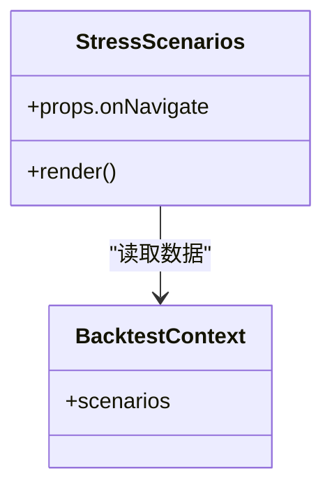

**图表来源**
- [frontend/src/screens/Backtest/StressScenarios.tsx:13-62](file://frontend/src/screens/Backtest/StressScenarios.tsx#L13-L62)

**章节来源**
- [frontend/src/screens/Backtest/StressScenarios.tsx:1-65](file://frontend/src/screens/Backtest/StressScenarios.tsx#L1-L65)

### 参数热力图（ParameterHeatmap）
- 数据与最佳点
  - cells 二维数组存储评分（如夏普比率），bestX/bestY 标注全局最优。
  - 通过 min/max 归一化计算强度，映射为“hot/mid/cool”三档色调。
- 可视化
  - X/Y 轴刻度标签、最佳评分与坐标提示，图例辅助解读。

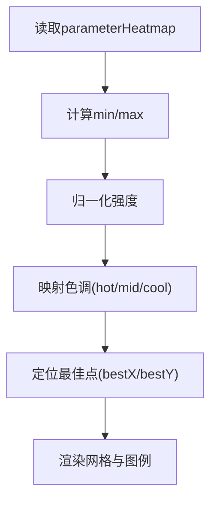

**图表来源**
- [frontend/src/screens/Backtest/ParameterHeatmap.tsx:7-15](file://frontend/src/screens/Backtest/ParameterHeatmap.tsx#L7-L15)
- [frontend/src/screens/Backtest/ParameterHeatmap.tsx:53-60](file://frontend/src/screens/Backtest/ParameterHeatmap.tsx#L53-L60)

**章节来源**
- [frontend/src/screens/Backtest/ParameterHeatmap.tsx:1-88](file://frontend/src/screens/Backtest/ParameterHeatmap.tsx#L1-L88)

## 依赖关系分析
- 组件依赖
  - 所有可视化组件依赖 BacktestContext 提供的数据结构，降低耦合度。
  - EquityChart 与 EquityDivergence 依赖 ECharts，具备自适应与缓存策略。
- 类型与 API
  - lib/api.ts 定义回测任务、指标、等额收益点、Walk-Forward 折叠与敏感性扫描等接口类型。
  - data/types.ts 定义回测数据模型（KPI、等额收益曲线、置信度、场景、参数热力图等）。
- 样式与通用组件
  - GlassCard 提供卡片式容器，统一标题/副标题/操作区与点击态。

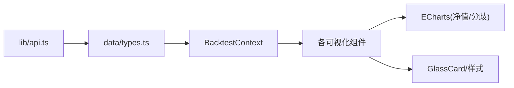

**图表来源**
- [frontend/src/lib/api.ts:135-200](file://frontend/src/lib/api.ts#L135-L200)
- [frontend/src/data/types.ts:77-125](file://frontend/src/data/types.ts#L77-L125)
- [frontend/src/contexts/BacktestContext.tsx:1-13](file://frontend/src/contexts/BacktestContext.tsx#L1-L13)
- [frontend/src/components/GlassCard.tsx:1-49](file://frontend/src/components/GlassCard.tsx#L1-L49)

**章节来源**
- [frontend/src/lib/api.ts:135-200](file://frontend/src/lib/api.ts#L135-L200)
- [frontend/src/data/types.ts:77-125](file://frontend/src/data/types.ts#L77-L125)

## 性能考量
- 图表渲染
  - 使用 ECharts Canvas 渲染，减少 DOM 开销；通过 ResizeObserver 动态初始化，避免无效渲染。
  - EquityDivergence 采用 pendingOptionRef 缓存 Option，首次初始化后直接 setOption。
- 数据处理
  - 对 IS/OOS 日期对齐与 null 补位，避免图表断点；计算稳定性比率与最大绝对值仅在数据变更时触发。
- 交互与状态
  - 回测工作台集中管理运行状态与定时器，避免多处副作用；任务完成后统一刷新历史记录。
- 样式与布局
  - 使用统一的 GlassCard 与主题变量，减少重复样式计算；组件内部最小化重排与重绘。

[本节为通用性能指导，不直接分析具体文件]

## 故障排查指南
- 回测未显示数据
  - 检查 activeTaskId 是否正确设置，确认 report 加载成功。
  - 若 equity 为空，EquityChart 将提示“运行一次回测以查看净值曲线”。
- 图表不渲染或尺寸异常
  - 确认容器可见且宽高大于 0；检查 ResizeObserver 初始化逻辑。
  - EquityDivergence 需要等待 ECharts 实例就绪后再 setOption。
- 数据类型不匹配
  - 核对 data/types.ts 中 backtest 模块字段与实际返回是否一致。
  - lib/api.ts 中的接口类型需与后端返回严格对应，避免运行时报错。
- 权限与认证
  - 401 时会清除本地 token 并触发登出事件，检查本地存储与请求头。

**章节来源**
- [frontend/src/screens/Backtest/index.tsx:236-239](file://frontend/src/screens/Backtest/index.tsx#L236-L239)
- [frontend/src/screens/Backtest/EquityChart.tsx:32-50](file://frontend/src/screens/Backtest/EquityChart.tsx#L32-L50)
- [frontend/src/lib/api.ts:32-43](file://frontend/src/lib/api.ts#L32-L43)

## 结论
回测屏幕通过清晰的分层架构与强类型数据模型，实现了从配置到可视化的完整闭环。各组件职责明确、耦合度低，既满足专业分析需求，又兼顾易用性与可维护性。建议在后续迭代中持续关注大数据量下的渲染性能与交互流畅度，并完善错误边界与可访问性。

## 附录
- 数据模型速览（回测相关）
  - kpis、equityCurves、confidence、walkForward、comparison、scenarios、parameterHeatmap
- API 类型速览（回测相关）
  - BacktestMetricPayload、BacktestEquityPointPayload、WalkForwardFoldPayload、SensitivityRunPayload、OverfitAssessmentPayload

**章节来源**
- [frontend/src/data/types.ts:77-125](file://frontend/src/data/types.ts#L77-L125)
- [frontend/src/lib/api.ts:135-200](file://frontend/src/lib/api.ts#L135-L200)