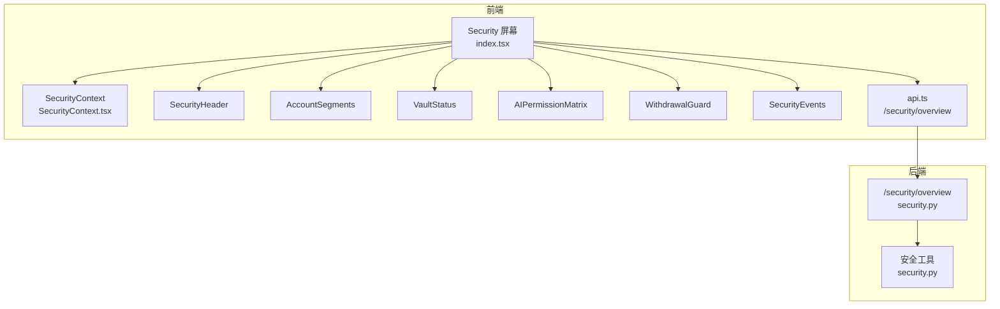
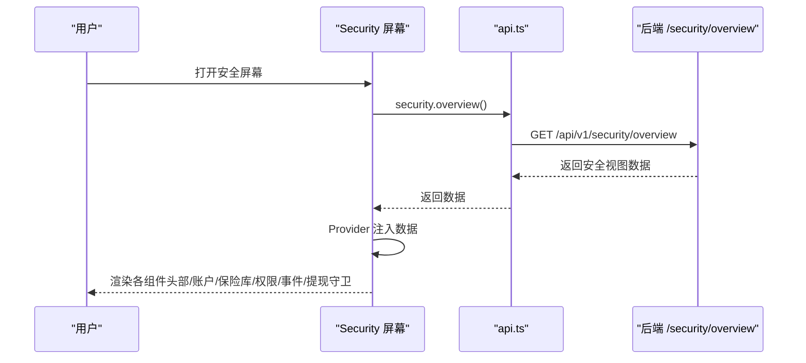
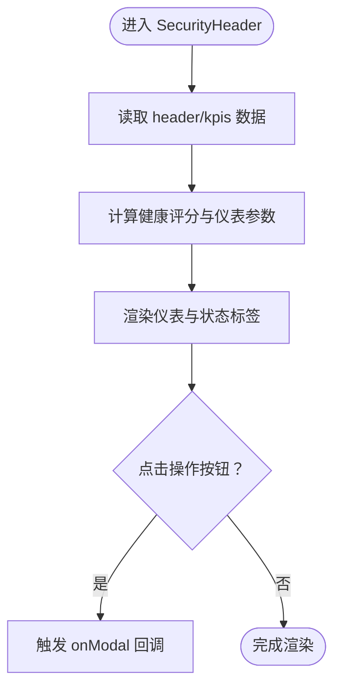
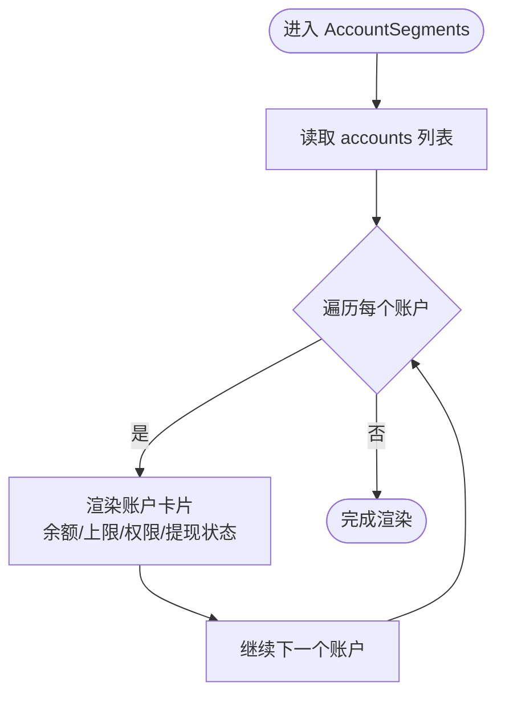
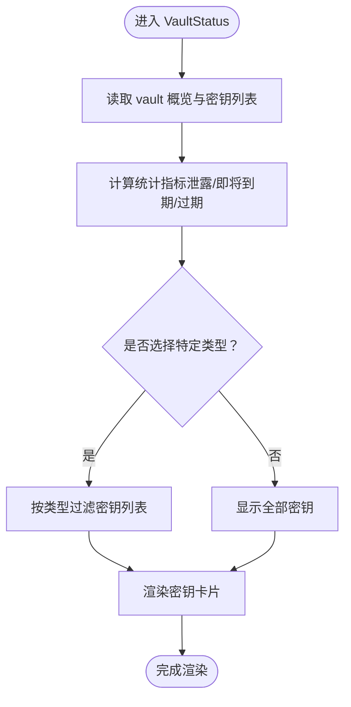
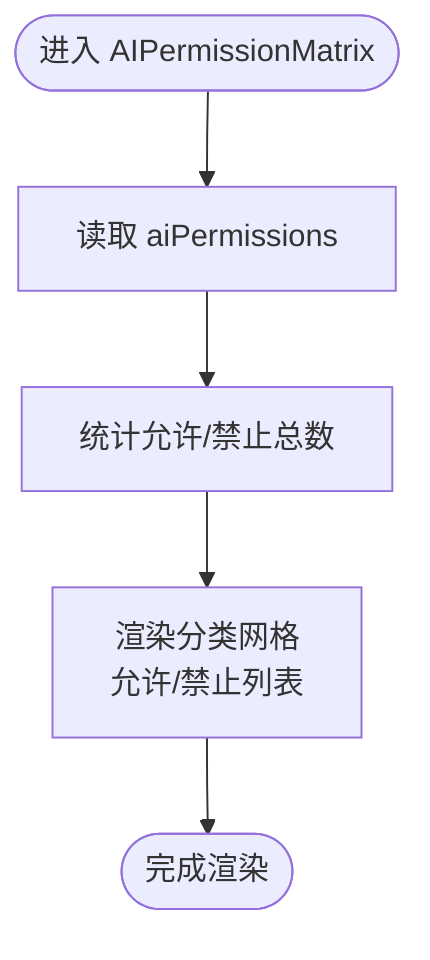
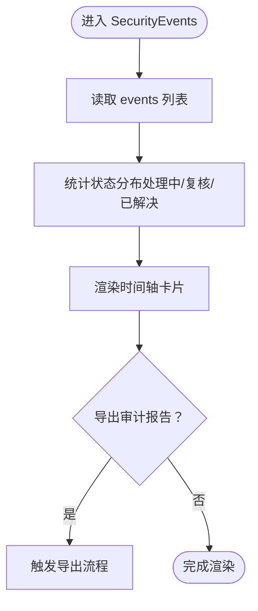
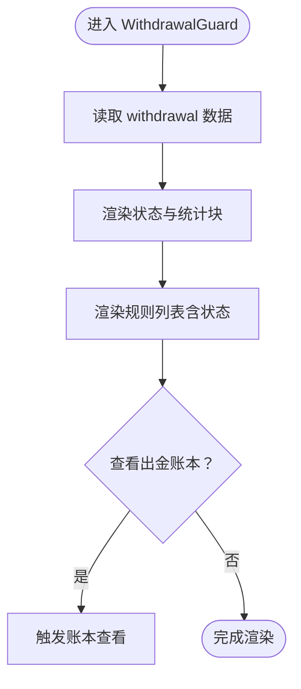
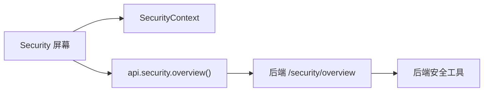

# 安全屏幕

<cite>
**本文引用的文件**
- [frontend/src/screens/Security/index.tsx](file://frontend/src/screens/Security/index.tsx)
- [frontend/src/screens/Security/SecurityHeader.tsx](file://frontend/src/screens/Security/SecurityHeader.tsx)
- [frontend/src/screens/Security/AccountSegments.tsx](file://frontend/src/screens/Security/AccountSegments.tsx)
- [frontend/src/screens/Security/VaultStatus.tsx](file://frontend/src/screens/Security/VaultStatus.tsx)
- [frontend/src/screens/Security/AIPermissionMatrix.tsx](file://frontend/src/screens/Security/AIPermissionMatrix.tsx)
- [frontend/src/screens/Security/SecurityEvents.tsx](file://frontend/src/screens/Security/SecurityEvents.tsx)
- [frontend/src/screens/Security/WithdrawalGuard.tsx](file://frontend/src/screens/Security/WithdrawalGuard.tsx)
- [frontend/src/contexts/SecurityContext.tsx](file://frontend/src/contexts/SecurityContext.tsx)
- [frontend/src/data/types.ts](file://frontend/src/data/types.ts)
- [frontend/src/lib/api.ts](file://frontend/src/lib/api.ts)
- [backend/app/api/v1/security.py](file://backend/app/api/v1/security.py)
- [backend/app/core/security.py](file://backend/app/core/security.py)
</cite>

## 目录
1. [简介](#简介)
2. [项目结构](#项目结构)
3. [核心组件](#核心组件)
4. [架构总览](#架构总览)
5. [详细组件分析](#详细组件分析)
6. [依赖分析](#依赖分析)
7. [性能考虑](#性能考虑)
8. [故障排查指南](#故障排查指南)
9. [结论](#结论)

## 简介
本文件为 llmine-quant 项目的“安全屏幕”专业组件文档，聚焦于安全管控界面的前端实现与后端数据支撑。内容涵盖安全头部（SecurityHeader）的权限概览、账户段（AccountSegments）的权限分组、保险库状态（VaultStatus）的安全监控、AI 权限矩阵（AIPermissionMatrix）的访问控制、安全事件（SecurityEvents）的日志追踪以及提现守卫（WithdrawalGuard）的风控措施。文档同时解释安全策略的前端实现、权限验证机制与安全事件的实时告警设计，帮助开发者与运维人员快速理解与维护该界面。

## 项目结构
安全屏幕位于前端 screens/Security 目录，采用模块化组件设计，通过 SecurityContext 提供全局安全数据，由 Security 屏幕入口统一加载与渲染。后端提供 /security/overview 接口，返回完整的安全视图数据。

图表来源
- [frontend/src/screens/Security/index.tsx:17-44](file://frontend/src/screens/Security/index.tsx#L17-L44)
- [frontend/src/contexts/SecurityContext.tsx:1-13](file://frontend/src/contexts/SecurityContext.tsx#L1-L13)
- [frontend/src/lib/api.ts:741-743](file://frontend/src/lib/api.ts#L741-L743)
- [backend/app/api/v1/security.py:154-165](file://backend/app/api/v1/security.py#L154-L165)

章节来源
- [frontend/src/screens/Security/index.tsx:1-45](file://frontend/src/screens/Security/index.tsx#L1-L45)
- [frontend/src/contexts/SecurityContext.tsx:1-13](file://frontend/src/contexts/SecurityContext.tsx#L1-L13)
- [frontend/src/lib/api.ts:741-743](file://frontend/src/lib/api.ts#L741-L743)
- [backend/app/api/v1/security.py:154-165](file://backend/app/api/v1/security.py#L154-L165)

## 核心组件
- 安全头部（SecurityHeader）：展示资金安全中心的整体健康评分、关键安全指标、Vault 状态、提现开关、密钥轮换与 AI 越权拦截统计，并提供“AI 权限审计”“密钥轮换”等快捷入口。
- 账户段（AccountSegments）：按角色分层展示账户（实盘主账户、模拟盘、托管等），显示余额、资金上限与使用率、AI 权限标签与提现开关状态。
- 保险库状态（VaultStatus）：汇总密钥总数、类型分布、轮换与到期情况，支持按类型筛选，展示密钥提供商、作用域与到期天数。
- AI 权限矩阵（AIPermissionMatrix）：按类别展示允许与禁止的 API 调用清单，标注物理禁止原因，形成“许可门”式的访问控制视图。
- 安全事件（SecurityEvents）：展示最近 7 天的安全事件时间线，标注严重程度、类型、状态与处置进展，支持导出审计报告。
- 提现守卫（WithdrawalGuard）：展示提现开关状态、白名单地址数量、待审批数量与 24 小时拦截次数，列出物理与流程规则及其状态。

章节来源
- [frontend/src/screens/Security/SecurityHeader.tsx:1-107](file://frontend/src/screens/Security/SecurityHeader.tsx#L1-L107)
- [frontend/src/screens/Security/AccountSegments.tsx:1-80](file://frontend/src/screens/Security/AccountSegments.tsx#L1-L80)
- [frontend/src/screens/Security/VaultStatus.tsx:1-120](file://frontend/src/screens/Security/VaultStatus.tsx#L1-L120)
- [frontend/src/screens/Security/AIPermissionMatrix.tsx:1-63](file://frontend/src/screens/Security/AIPermissionMatrix.tsx#L1-L63)
- [frontend/src/screens/Security/SecurityEvents.tsx:1-78](file://frontend/src/screens/Security/SecurityEvents.tsx#L1-L78)
- [frontend/src/screens/Security/WithdrawalGuard.tsx:1-69](file://frontend/src/screens/Security/WithdrawalGuard.tsx#L1-L69)

## 架构总览
安全屏幕的数据流从后端 /security/overview 获取，前端通过 api.security.overview() 请求，SecurityProvider 将数据注入各子组件。组件内部通过 useSecurity() 读取上下文，渲染对应的 UI 结构与交互。

图表来源
- [frontend/src/screens/Security/index.tsx:17-44](file://frontend/src/screens/Security/index.tsx#L17-L44)
- [frontend/src/lib/api.ts:741-743](file://frontend/src/lib/api.ts#L741-L743)
- [backend/app/api/v1/security.py:154-165](file://backend/app/api/v1/security.py#L154-L165)

章节来源
- [frontend/src/screens/Security/index.tsx:17-44](file://frontend/src/screens/Security/index.tsx#L17-L44)
- [frontend/src/lib/api.ts:741-743](file://frontend/src/lib/api.ts#L741-L743)
- [backend/app/api/v1/security.py:154-165](file://backend/app/api/v1/security.py#L154-L165)

## 详细组件分析

### 安全头部（SecurityHeader）
- 数据来源：header 字段包含健康评分、健康状态、Vault 状态、提现开关、密钥轮换周期、明文泄露与 24 小时 AI 越权拦截数；kpis 字段用于展示关键指标条带。
- 可视化：健康评分以 SVG 仪表形式呈现，颜色随状态（绿/黄/红）变化；状态标签与关键指标条带辅助快速判断整体安全态势。
- 行为：提供“AI 权限审计”“密钥轮换”按钮，触发上层回调以打开对应模态框或执行轮换流程。

图表来源
- [frontend/src/screens/Security/SecurityHeader.tsx:7-107](file://frontend/src/screens/Security/SecurityHeader.tsx#L7-L107)

章节来源
- [frontend/src/screens/Security/SecurityHeader.tsx:7-107](file://frontend/src/screens/Security/SecurityHeader.tsx#L7-L107)

### 账户段（AccountSegments）
- 数据来源：accounts 数组，每项包含账户 ID、名称、角色（custody/live-main/live-small/paper/sandbox）、余额、资金上限与使用率、AI 权限列表、提现开关与描述。
- 可视化：按角色色调区分账户层级，展示余额与资金上限使用率（70%-90% 为关注，≥90% 为警告），权限以标签形式展示，提现关闭时显式提示。
- 行为：支持“查看资金结构”按钮，便于进一步钻取。

图表来源
- [frontend/src/screens/Security/AccountSegments.tsx:11-79](file://frontend/src/screens/Security/AccountSegments.tsx#L11-L79)

章节来源
- [frontend/src/screens/Security/AccountSegments.tsx:11-79](file://frontend/src/screens/Security/AccountSegments.tsx#L11-L79)

### 保险库状态（VaultStatus）
- 数据来源：vault.summary 包含密钥总数、各类型数量、30 天轮换次数、即将到期与过期数量；vault.keys 为密钥明细列表。
- 可视化：顶部统计条展示明文泄露、即将到期与过期数量；下方按类型筛选器支持快速定位；密钥卡片展示类型图标、提供商、作用域、轮换与到期日期、剩余天数与状态标签。
- 行为：支持按类型过滤密钥列表，便于审计与轮换管理。

图表来源
- [frontend/src/screens/Security/VaultStatus.tsx:29-119](file://frontend/src/screens/Security/VaultStatus.tsx#L29-L119)

章节来源
- [frontend/src/screens/Security/VaultStatus.tsx:29-119](file://frontend/src/screens/Security/VaultStatus.tsx#L29-L119)

### AI 权限矩阵（AIPermissionMatrix）
- 数据来源：aiPermissions 为分类数组，每类包含 allowed 与 blocked 两部分，分别列出允许与物理禁止的 API 及说明与原因。
- 可视化：顶部统计“允许/物理禁止”数量；网格布局分为两类区域，左侧允许列表，右侧禁止列表并标注原因；支持“查看 Tool Registry”按钮。
- 行为：作为“许可门”的可视化体现，帮助运营与风控人员快速掌握 AI 的访问边界。

图表来源
- [frontend/src/screens/Security/AIPermissionMatrix.tsx:3-62](file://frontend/src/screens/Security/AIPermissionMatrix.tsx#L3-L62)

章节来源
- [frontend/src/screens/Security/AIPermissionMatrix.tsx:3-62](file://frontend/src/screens/Security/AIPermissionMatrix.tsx#L3-L62)

### 安全事件（SecurityEvents）
- 数据来源：events 列表，包含事件时间、类型（轮换/阻断/访问/违规/审计）、严重程度、标题、行为人、详情、处置状态与结果。
- 可视化：时间轴卡片展示事件序列，按严重程度与状态着色；顶部统计“7 天内事件数、处理中、复核中、已解决”等状态；支持“导出审计报告”。
- 行为：用于安全事件的实时追踪与审计留痕。

图表来源
- [frontend/src/screens/Security/SecurityEvents.tsx:25-77](file://frontend/src/screens/Security/SecurityEvents.tsx#L25-L77)

章节来源
- [frontend/src/screens/Security/SecurityEvents.tsx:25-77](file://frontend/src/screens/Security/SecurityEvents.tsx#L25-L77)

### 提现守卫（WithdrawalGuard）
- 数据来源：withdrawal 字段包含提现开关、白名单地址数量、待审批数量、24 小时拦截次数与最近一次拦截时间；rules 为物理与流程规则列表及状态。
- 可视化：顶部状态条展示提现开关与拦截统计；中部统计块展示白名单地址与待审批数量；底部规则列表展示规则名称、描述与状态标签；支持“查看出金账本”。
- 行为：作为提现风控的最后一道防线，确保提现流程符合物理与流程规则。

图表来源
- [frontend/src/screens/Security/WithdrawalGuard.tsx:9-68](file://frontend/src/screens/Security/WithdrawalGuard.tsx#L9-L68)

章节来源
- [frontend/src/screens/Security/WithdrawalGuard.tsx:9-68](file://frontend/src/screens/Security/WithdrawalGuard.tsx#L9-L68)

## 依赖分析
- 前端依赖
  - Security 屏幕依赖 SecurityContext 提供全局安全数据。
  - 各子组件通过 useSecurity() 读取上下文，避免重复请求。
  - api.ts 的 api.security.overview() 作为数据源，封装了认证头与错误处理。
- 后端依赖
  - /security/overview 返回聚合后的安全视图数据，包含头部、KPI、账户、保险库、AI 权限、提现与事件。
  - 后端安全工具模块提供 JWT 与密码哈希等通用能力，保障认证与令牌安全。

图表来源
- [frontend/src/screens/Security/index.tsx:17-44](file://frontend/src/screens/Security/index.tsx#L17-L44)
- [frontend/src/contexts/SecurityContext.tsx:1-13](file://frontend/src/contexts/SecurityContext.tsx#L1-L13)
- [frontend/src/lib/api.ts:741-743](file://frontend/src/lib/api.ts#L741-L743)
- [backend/app/api/v1/security.py:154-165](file://backend/app/api/v1/security.py#L154-L165)
- [backend/app/core/security.py:1-38](file://backend/app/core/security.py#L1-L38)

章节来源
- [frontend/src/screens/Security/index.tsx:17-44](file://frontend/src/screens/Security/index.tsx#L17-L44)
- [frontend/src/contexts/SecurityContext.tsx:1-13](file://frontend/src/contexts/SecurityContext.tsx#L1-L13)
- [frontend/src/lib/api.ts:741-743](file://frontend/src/lib/api.ts#L741-L743)
- [backend/app/api/v1/security.py:154-165](file://backend/app/api/v1/security.py#L154-L165)
- [backend/app/core/security.py:1-38](file://backend/app/core/security.py#L1-L38)

## 性能考虑
- 数据缓存与懒加载：Security 屏幕在首次渲染时发起一次 /security/overview 请求，随后通过 React Context 在组件树内共享数据，避免重复请求。
- 组件渲染优化：各子组件按需读取 useSecurity() 返回的字段，减少不必要的重渲染；列表渲染采用稳定的 key（如账户 ID、密钥 ID）以提升虚拟 DOM 更新效率。
- 图表与交互：SVG 仪表与时间轴采用轻量渲染，避免复杂动画；筛选器与按钮交互响应迅速，保证用户体验。
- 后端性能：/security/overview 返回聚合数据，减少前端多次请求；后端安全工具模块使用高效的哈希与令牌编码算法。

## 故障排查指南
- 无数据或加载失败
  - 检查 api.security.overview() 是否抛错；若返回 401，前端会清除本地令牌并触发未授权事件，请确认登录状态与令牌有效性。
  - 参考路径：[frontend/src/lib/api.ts:32-43](file://frontend/src/lib/api.ts#L32-L43)
- 上下文未提供数据
  - 确认 Security 屏幕已在 SecurityProvider 内包裹；useSecurity() 调用应在 Provider 作用域内。
  - 参考路径：[frontend/src/contexts/SecurityContext.tsx:8-12](file://frontend/src/contexts/SecurityContext.tsx#L8-L12)
- 数据字段缺失
  - 核对 MockData.types.ts 中 security 字段结构，确保后端返回字段与前端类型定义一致。
  - 参考路径：[frontend/src/data/types.ts:473-559](file://frontend/src/data/types.ts#L473-L559)
- 权限验证问题
  - 若出现未授权访问，检查后端安全工具模块的令牌解析与权限校验逻辑。
  - 参考路径：[backend/app/core/security.py:32-37](file://backend/app/core/security.py#L32-L37)

章节来源
- [frontend/src/lib/api.ts:32-43](file://frontend/src/lib/api.ts#L32-L43)
- [frontend/src/contexts/SecurityContext.tsx:8-12](file://frontend/src/contexts/SecurityContext.tsx#L8-L12)
- [frontend/src/data/types.ts:473-559](file://frontend/src/data/types.ts#L473-L559)
- [backend/app/core/security.py:32-37](file://backend/app/core/security.py#L32-L37)

## 结论
安全屏幕通过清晰的模块化设计与强类型数据模型，实现了对资金安全、账户权限、密钥保险库、AI 访问控制、安全事件与提现风控的全面可视化与实时监控。前端通过单一数据源与上下文共享，降低了耦合度与重复请求；后端提供聚合接口与安全工具，保障了数据一致性与安全性。该组件体系为 llmine-quant 的安全治理提供了坚实基础，适合在生产环境中持续演进与扩展。