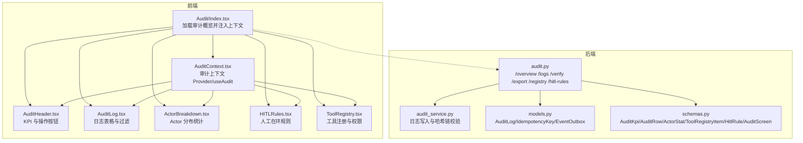
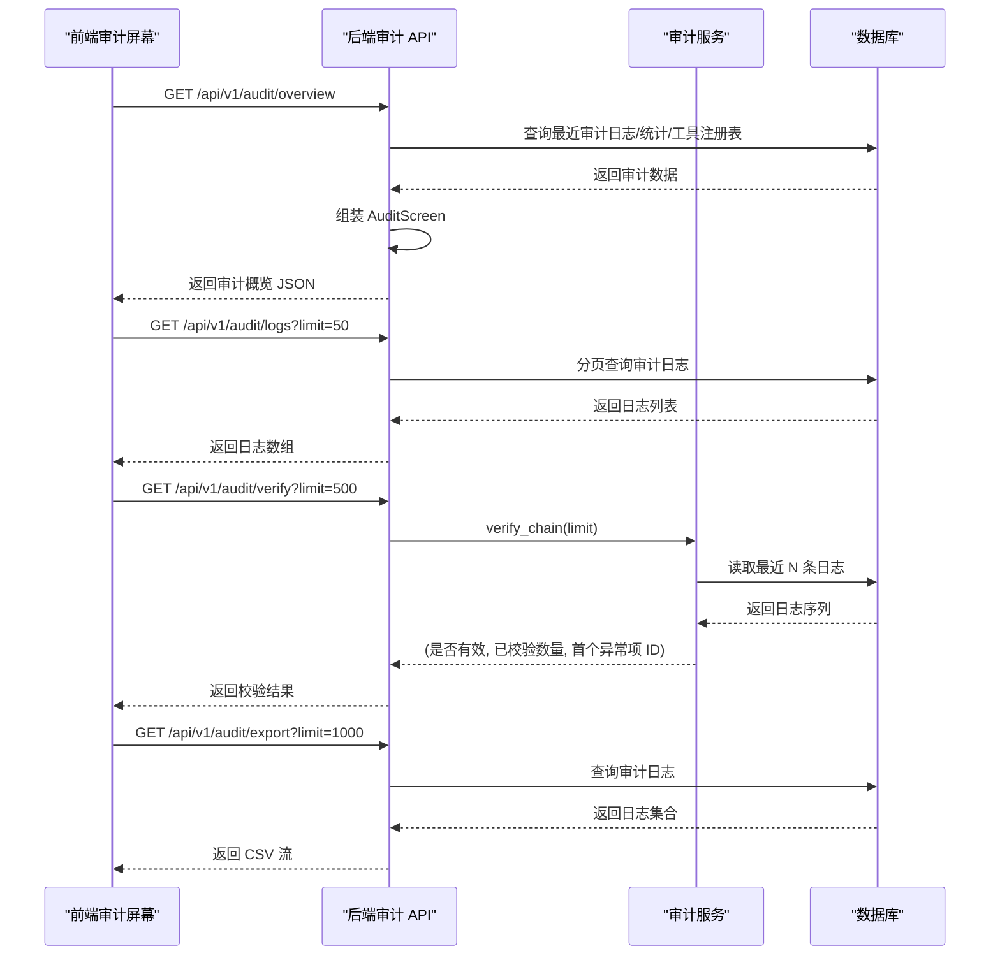
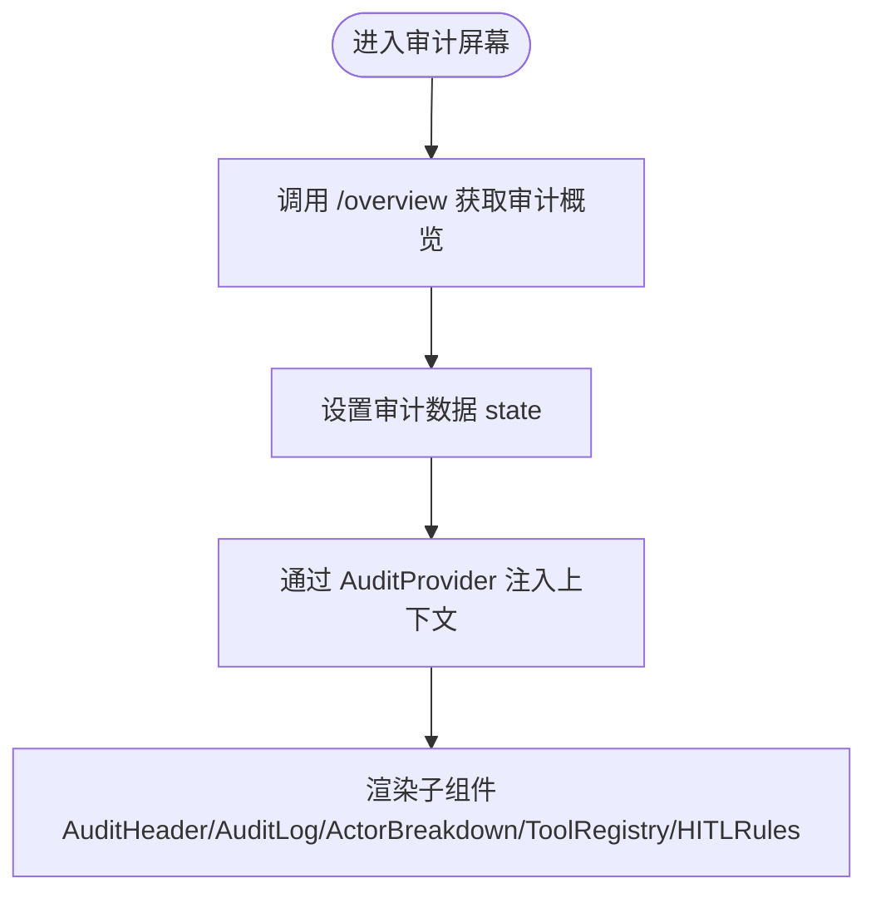
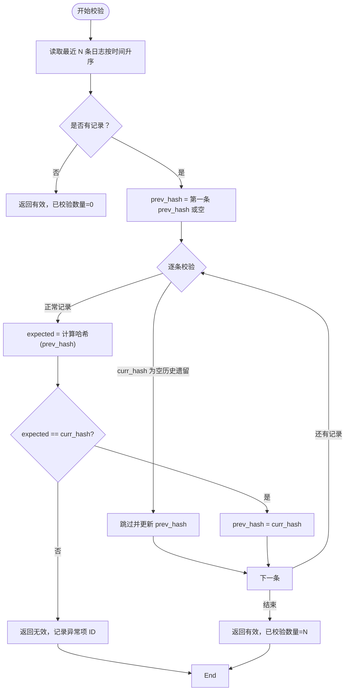
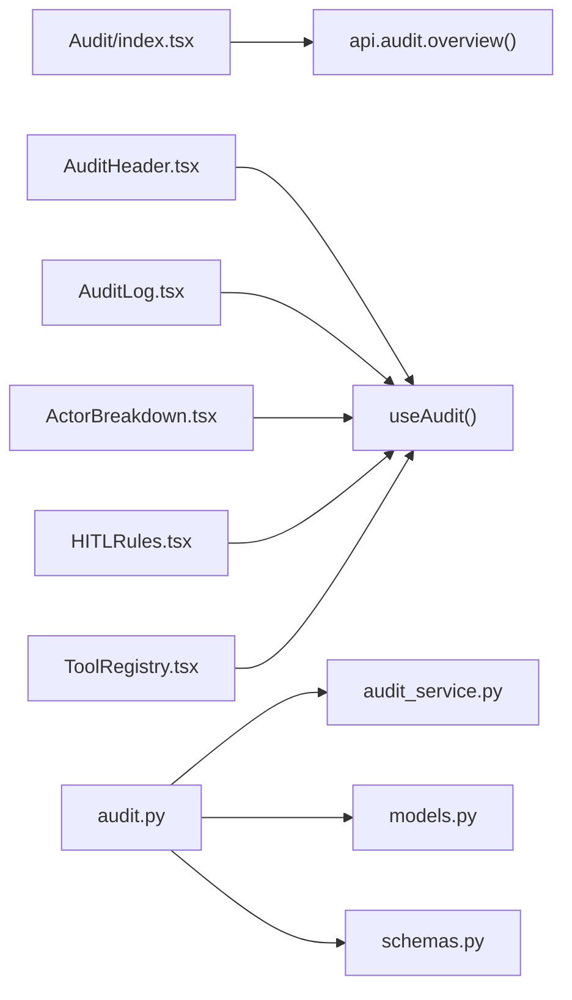

# 审计屏幕

<cite>
**本文引用的文件**
- [frontend/src/screens/Audit/index.tsx](file://frontend/src/screens/Audit/index.tsx)
- [frontend/src/screens/Audit/AuditHeader.tsx](file://frontend/src/screens/Audit/AuditHeader.tsx)
- [frontend/src/screens/Audit/AuditLog.tsx](file://frontend/src/screens/Audit/AuditLog.tsx)
- [frontend/src/screens/Audit/ActorBreakdown.tsx](file://frontend/src/screens/Audit/ActorBreakdown.tsx)
- [frontend/src/screens/Audit/HITLRules.tsx](file://frontend/src/screens/Audit/HITLRules.tsx)
- [frontend/src/screens/Audit/ToolRegistry.tsx](file://frontend/src/screens/Audit/ToolRegistry.tsx)
- [frontend/src/contexts/AuditContext.tsx](file://frontend/src/contexts/AuditContext.tsx)
- [backend/app/api/v1/audit.py](file://backend/app/api/v1/audit.py)
- [backend/app/services/audit_service.py](file://backend/app/services/audit_service.py)
- [backend/app/domains/audit/models.py](file://backend/app/domains/audit/models.py)
- [backend/app/domains/audit/schemas.py](file://backend/app/domains/audit/schemas.py)
- [frontend/src/data/types.ts](file://frontend/src/data/types.ts)
- [frontend/src/data/mock_ashare.ts](file://frontend/src/data/mock_ashare.ts)
- [frontend/src/lib/api.ts](file://frontend/src/lib/api.ts)
- [frontend/src/styles/prototype.css](file://frontend/src/styles/prototype.css)
</cite>

## 目录
1. [简介](#简介)
2. [项目结构](#项目结构)
3. [核心组件](#核心组件)
4. [架构总览](#架构总览)
5. [详细组件分析](#详细组件分析)
6. [依赖分析](#依赖分析)
7. [性能考量](#性能考量)
8. [故障排查指南](#故障排查指南)
9. [结论](#结论)
10. [附录](#附录)

## 简介
本文件面向 llmine-quant 的“审计屏幕”功能，系统性梳理前端审计界面与后端审计服务的架构设计与实现细节。重点覆盖以下组件与能力：
- 审计头部（AuditHeader）：合规概览 KPI 展示与操作入口
- 审计日志（AuditLog）：操作追踪与过滤
- 参与者分解（ActorBreakdown）：角色与行为分布统计
- HILT 规则（HITLRules）：人工在环（Human-in-the-loop）规则与状态
- 工具注册表（ToolRegistry）：Agent 工具权限与分配
- 审计数据采集与哈希链完整性校验：后端审计服务与模型
- 审计报告导出与隐私保护：接口与前端渲染策略

目标是帮助开发者与运维人员快速理解审计数据来源、前端展示逻辑、后端持久化与校验机制，以及如何在保证数据安全的前提下提供可审计、可追溯、可验证的合规能力。

## 项目结构
审计屏幕位于前端 screens/Audit 目录，采用模块化组件组织；后端审计 API 位于 backend/app/api/v1/audit.py，配套服务与领域模型位于 backend/app/services/audit_service.py 与 backend/app/domains/audit/ 目录。

图表来源
- [frontend/src/screens/Audit/index.tsx:16-42](file://frontend/src/screens/Audit/index.tsx#L16-L42)
- [frontend/src/screens/Audit/AuditHeader.tsx:7-34](file://frontend/src/screens/Audit/AuditHeader.tsx#L7-L34)
- [frontend/src/screens/Audit/AuditLog.tsx:19-98](file://frontend/src/screens/Audit/AuditLog.tsx#L19-L98)
- [frontend/src/screens/Audit/ActorBreakdown.tsx:3-37](file://frontend/src/screens/Audit/ActorBreakdown.tsx#L3-L37)
- [frontend/src/screens/Audit/HITLRules.tsx:9-37](file://frontend/src/screens/Audit/HITLRules.tsx#L9-L37)
- [frontend/src/screens/Audit/ToolRegistry.tsx:3-39](file://frontend/src/screens/Audit/ToolRegistry.tsx#L3-L39)
- [frontend/src/contexts/AuditContext.tsx:1-12](file://frontend/src/contexts/AuditContext.tsx#L1-L12)
- [backend/app/api/v1/audit.py:153-257](file://backend/app/api/v1/audit.py#L153-L257)
- [backend/app/services/audit_service.py:32-108](file://backend/app/services/audit_service.py#L32-L108)
- [backend/app/domains/audit/models.py:9-51](file://backend/app/domains/audit/models.py#L9-L51)
- [backend/app/domains/audit/schemas.py:6-52](file://backend/app/domains/audit/schemas.py#L6-L52)

章节来源
- [frontend/src/screens/Audit/index.tsx:16-42](file://frontend/src/screens/Audit/index.tsx#L16-L42)
- [backend/app/api/v1/audit.py:153-257](file://backend/app/api/v1/audit.py#L153-L257)

## 核心组件
- 审计概览加载与上下文注入：前端在进入审计屏幕时调用后端 /overview 接口获取完整审计视图数据，并通过 React Context 提供给各子组件使用。
- 审计头部：展示关键指标（KPI）与操作按钮（全局状态、导出报告），用于快速概览与触发审计报告生成。
- 审计日志：以表格形式呈现操作日志，支持按 Actor 类型过滤，显示时间、Actor、动作、资源、结果、置信度、详情与 Trace ID。
- 参与者分解：统计不同 Actor 的操作次数与占比，形成可视化条形图，辅助识别高频操作主体。
- HILT 规则：展示与策略、交易、风控、资金相关的“人工在环”规则及其状态（自动、复核、审批）。
- 工具注册表：列出启用的 Agent 工具及其权限等级与允许使用的 Agent 列表，便于审计工具使用情况。

章节来源
- [frontend/src/screens/Audit/AuditHeader.tsx:7-34](file://frontend/src/screens/Audit/AuditHeader.tsx#L7-L34)
- [frontend/src/screens/Audit/AuditLog.tsx:19-98](file://frontend/src/screens/Audit/AuditLog.tsx#L19-L98)
- [frontend/src/screens/Audit/ActorBreakdown.tsx:3-37](file://frontend/src/screens/Audit/ActorBreakdown.tsx#L3-L37)
- [frontend/src/screens/Audit/HITLRules.tsx:9-37](file://frontend/src/screens/Audit/HITLRules.tsx#L9-L37)
- [frontend/src/screens/Audit/ToolRegistry.tsx:3-39](file://frontend/src/screens/Audit/ToolRegistry.tsx#L3-L39)
- [frontend/src/contexts/AuditContext.tsx:1-12](file://frontend/src/contexts/AuditContext.tsx#L1-L12)

## 架构总览
审计屏幕从前端发起概览请求，后端聚合审计日志、KPI、Actor 统计、工具注册表与 HILT 规则，返回统一的审计视图对象。前端通过上下文共享数据，各组件独立渲染各自模块。后端还提供日志列表、Actor 统计、哈希链完整性校验与 CSV 导出等接口，满足审计与合规需求。

图表来源
- [backend/app/api/v1/audit.py:153-257](file://backend/app/api/v1/audit.py#L153-L257)
- [backend/app/services/audit_service.py:83-108](file://backend/app/services/audit_service.py#L83-L108)

章节来源
- [backend/app/api/v1/audit.py:153-257](file://backend/app/api/v1/audit.py#L153-L257)
- [backend/app/services/audit_service.py:32-108](file://backend/app/services/audit_service.py#L32-L108)

## 详细组件分析

### 审计概览与上下文（Audit/index.tsx 与 AuditContext）
- 审计概览加载：组件在挂载时调用 api.audit.overview() 获取初始数据，随后将数据通过 AuditProvider 注入上下文，供子组件 useAudit 使用。
- 上下文封装：useAudit 在子组件中统一读取审计数据，若未在 Provider 内使用会抛出错误，确保上下文使用规范。

图表来源
- [frontend/src/screens/Audit/index.tsx:19-25](file://frontend/src/screens/Audit/index.tsx#L19-L25)
- [frontend/src/contexts/AuditContext.tsx:8-12](file://frontend/src/contexts/AuditContext.tsx#L8-L12)

章节来源
- [frontend/src/screens/Audit/index.tsx:16-42](file://frontend/src/screens/Audit/index.tsx#L16-L42)
- [frontend/src/contexts/AuditContext.tsx:1-12](file://frontend/src/contexts/AuditContext.tsx#L1-L12)

### 审计头部（AuditHeader）
- 展示 KPI 区域：遍历 kpis 渲染标签、数值、趋势与色调，直观反映总体事件数、Agent 操作、人工审批、异常事件与哈希链完整性。
- 操作入口：提供“全局状态”“导出审计报告”两个按钮，分别用于查看系统全局状态与触发报告导出。

章节来源
- [frontend/src/screens/Audit/AuditHeader.tsx:7-34](file://frontend/src/screens/Audit/AuditHeader.tsx#L7-L34)

### 审计日志（AuditLog）
- 过滤与统计：支持按 Actor 类型（全部/Agent/人工/系统）过滤，并统计各类别数量。
- 表格列：时间、Actor、动作、资源、结果、置信度、详情、Trace ID；结果列根据 tone 应用不同样式。
- 结果标签映射：将内部枚举映射为中文标签（如 PASS/DENIED/BLOCKED/APPROVAL/APPROVED/TRACE/VERIFIED/AUTO/FILLED/NOTIFY）。

章节来源
- [frontend/src/screens/Audit/AuditLog.tsx:19-98](file://frontend/src/screens/Audit/AuditLog.tsx#L19-L98)

### 参与者分解（ActorBreakdown）
- 统计逻辑：对 actorStats 进行求和计算总量，按 Actor 名称与次数绘制条形图，显示百分比。
- 可视化：条形宽度代表占比，右侧标注百分比，便于识别主要操作者。

章节来源
- [frontend/src/screens/Audit/ActorBreakdown.tsx:3-37](file://frontend/src/screens/Audit/ActorBreakdown.tsx#L3-L37)

### HILT 规则（HITLRules）
- 规则展示：展示规则名称、描述与状态（自动/复核/审批），状态以不同色调标识。
- 规则来源：后端提供固定规则集，前端仅负责渲染。

章节来源
- [frontend/src/screens/Audit/HITLRules.tsx:9-37](file://frontend/src/screens/Audit/HITLRules.tsx#L9-L37)
- [backend/app/api/v1/audit.py:29-36](file://backend/app/api/v1/audit.py#L29-L36)

### 工具注册表（ToolRegistry）
- 工具列表：展示工具名称、风险等级（低/中/高/极高）、描述与允许使用的 Agent 列表。
- 权限分级：根据等级映射不同色调，便于快速识别高风险工具。

章节来源
- [frontend/src/screens/Audit/ToolRegistry.tsx:3-39](file://frontend/src/screens/Audit/ToolRegistry.tsx#L3-L39)

### 审计数据采集与哈希链完整性校验
- 数据采集：后端审计服务在每次审计事件发生时，计算前一条记录的 curr_hash 作为 prev_hash，生成新的 curr_hash 并持久化，形成不可篡改的链式日志。
- 完整性校验：verify_chain 从最早到最晚顺序校验每条记录的 curr_hash 是否等于基于 prev_hash 重新计算的结果，返回是否有效、已校验数量与首个异常项 ID。

图表来源
- [backend/app/services/audit_service.py:83-108](file://backend/app/services/audit_service.py#L83-L108)
- [backend/app/services/audit_service.py:18-29](file://backend/app/services/audit_service.py#L18-L29)

章节来源
- [backend/app/services/audit_service.py:32-108](file://backend/app/services/audit_service.py#L32-L108)

### 审计报告生成与导出
- 导出接口：/api/v1/audit/export 支持按 Actor 类型过滤与限制导出数量，输出 CSV 文件，包含时间、Actor、Actor 类型、动作、资源类型、资源 ID、结果、置信度、详情、Trace ID、curr_hash 等字段。
- 前端触发：审计头部的“导出审计报告”按钮可触发导出流程，后端以流式响应返回 CSV。

章节来源
- [backend/app/api/v1/audit.py:215-245](file://backend/app/api/v1/audit.py#L215-L245)

### 审计隐私保护与数据安全设计
- 不可篡改链：每条审计记录携带 prev_hash 与 curr_hash，形成哈希链，任何篡改都会导致后续校验失败，保障审计数据的完整性与抗抵赖性。
- 仅读取与追加：审计日志模型为只读追加，不支持更新或删除，避免数据被恶意修改。
- 透明可验证：提供 /verify 接口，允许外部系统对最近若干条日志进行完整性校验，便于第三方审计。
- 最小暴露原则：前端仅渲染必要字段（如 actor、action、resource、result、traceId 等），不直接展示敏感内容；导出 CSV 也遵循最小必要原则，避免泄露非必要信息。

章节来源
- [backend/app/domains/audit/models.py:9-27](file://backend/app/domains/audit/models.py#L9-L27)
- [backend/app/api/v1/audit.py:198-212](file://backend/app/api/v1/audit.py#L198-L212)

## 依赖分析
- 前端依赖：Audit/index.tsx 依赖 api.audit.overview()；各子组件依赖 useAudit 上下文；样式依赖 prototype.css。
- 后端依赖：audit.py 依赖审计服务与领域模型；审计服务依赖数据库会话与 tracing 工具；模型定义审计日志与幂等键等实体。

图表来源
- [frontend/src/screens/Audit/index.tsx:1-25](file://frontend/src/screens/Audit/index.tsx#L1-L25)
- [frontend/src/screens/Audit/AuditHeader.tsx:1-9](file://frontend/src/screens/Audit/AuditHeader.tsx#L1-L9)
- [frontend/src/screens/Audit/AuditLog.tsx:1-22](file://frontend/src/screens/Audit/AuditLog.tsx#L1-L22)
- [frontend/src/screens/Audit/ActorBreakdown.tsx:1-6](file://frontend/src/screens/Audit/ActorBreakdown.tsx#L1-L6)
- [frontend/src/screens/Audit/HITLRules.tsx:1-11](file://frontend/src/screens/Audit/HITLRules.tsx#L1-L11)
- [frontend/src/screens/Audit/ToolRegistry.tsx:1-6](file://frontend/src/screens/Audit/ToolRegistry.tsx#L1-L6)
- [backend/app/api/v1/audit.py:1-26](file://backend/app/api/v1/audit.py#L1-L26)
- [backend/app/services/audit_service.py:1-16](file://backend/app/services/audit_service.py#L1-L16)
- [backend/app/domains/audit/models.py:1-6](file://backend/app/domains/audit/models.py#L1-L6)
- [backend/app/domains/audit/schemas.py:1-6](file://backend/app/domains/audit/schemas.py#L1-L6)

章节来源
- [frontend/src/screens/Audit/index.tsx:1-25](file://frontend/src/screens/Audit/index.tsx#L1-L25)
- [backend/app/api/v1/audit.py:1-26](file://backend/app/api/v1/audit.py#L1-L26)

## 性能考量
- 前端渲染优化：日志表格与 Actor 分布采用简单循环渲染，建议在数据量增大时引入虚拟滚动与分页。
- 后端查询优化：/overview 聚合查询应使用索引字段（如 created_at、actor_type、resource_type 等）；/logs 支持分页与过滤，避免一次性拉取过多数据。
- 哈希链校验：verify_chain 默认限制校验数量，防止大规模链校验造成性能问题；可按需调整 limit 参数。

## 故障排查指南
- 审计数据为空：检查 /overview 请求是否成功，确认后端数据库中是否存在审计日志记录。
- 完整性告警：当 /verify 返回无效时，根据返回的 brokenEntryId 定位具体异常项，检查对应记录的 prev_hash/curr_hash 是否匹配。
- 导出异常：确认 /export 请求参数（actor_type、limit）是否合理，检查后端 CSV 写入过程是否抛错。
- 前端上下文错误：若 useAudit 抛出“必须在 Provider 内使用”的错误，请确认组件树中存在 AuditProvider，并传入了正确的审计数据。

章节来源
- [backend/app/api/v1/audit.py:198-212](file://backend/app/api/v1/audit.py#L198-L212)
- [backend/app/services/audit_service.py:83-108](file://backend/app/services/audit_service.py#L83-L108)

## 结论
审计屏幕通过前端模块化组件与后端统一审计服务实现了完整的合规审计能力：从概览 KPI、日志追踪、Actor 分布、HILT 规则到工具注册表，再到哈希链完整性校验与 CSV 导出，形成了覆盖“采集—展示—验证—导出”的闭环。结合不可篡改链与最小暴露原则，既满足监管要求，又兼顾用户体验与性能。

## 附录
- 数据类型定义：前端 MockData 中的 audit 字段定义了审计屏幕所需的数据结构，便于前后端契约对齐与联调。
- 样式参考：prototype.css 提供了审计屏幕所需的卡片、表格、标签等基础样式，确保视觉一致性与可读性。

章节来源
- [frontend/src/data/types.ts:601-618](file://frontend/src/data/types.ts#L601-L618)
- [frontend/src/styles/prototype.css:509-574](file://frontend/src/styles/prototype.css#L509-L574)