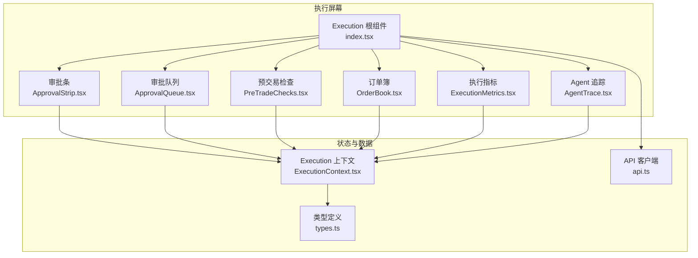
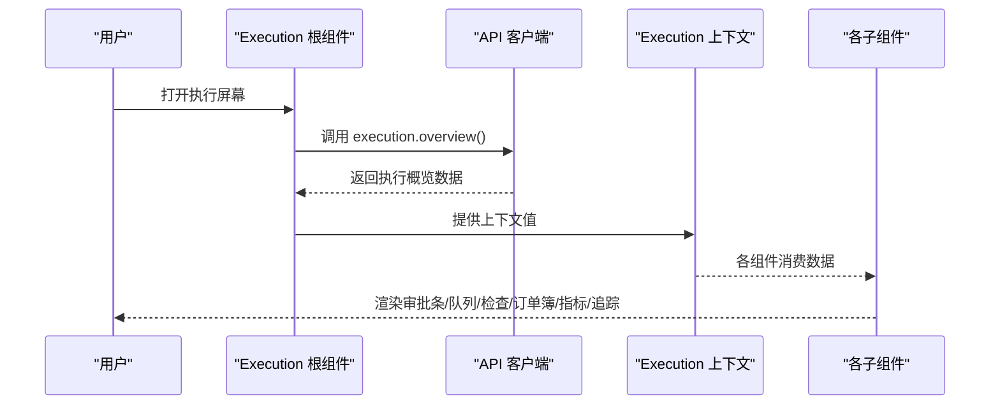
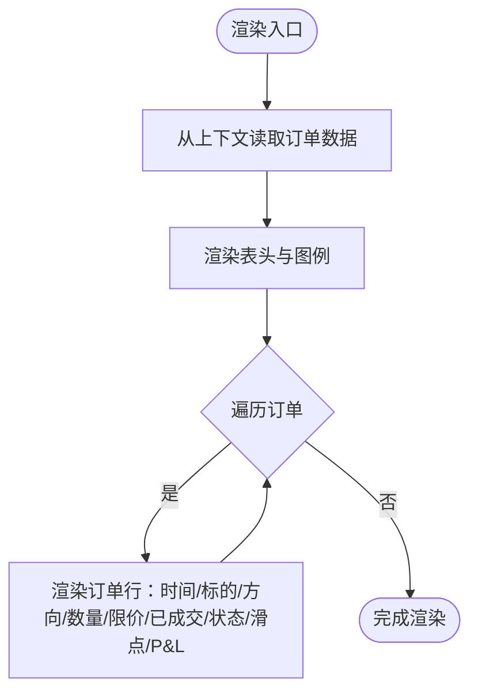
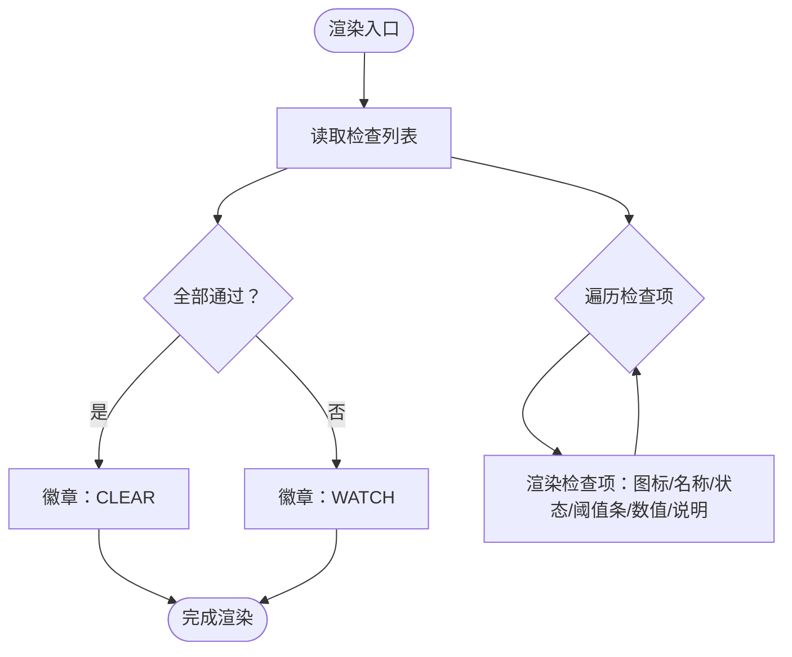
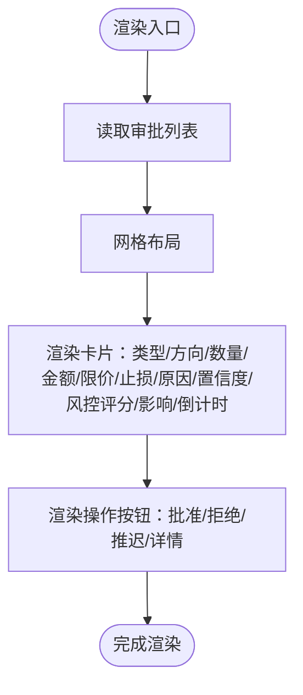
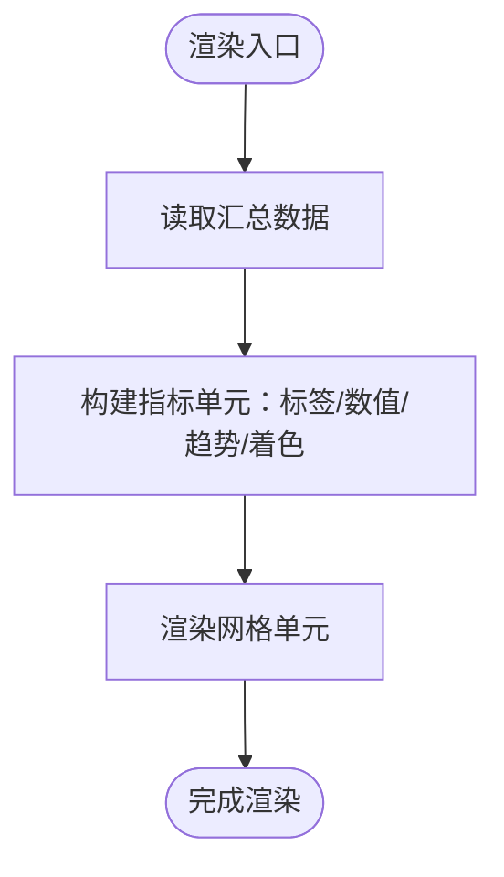
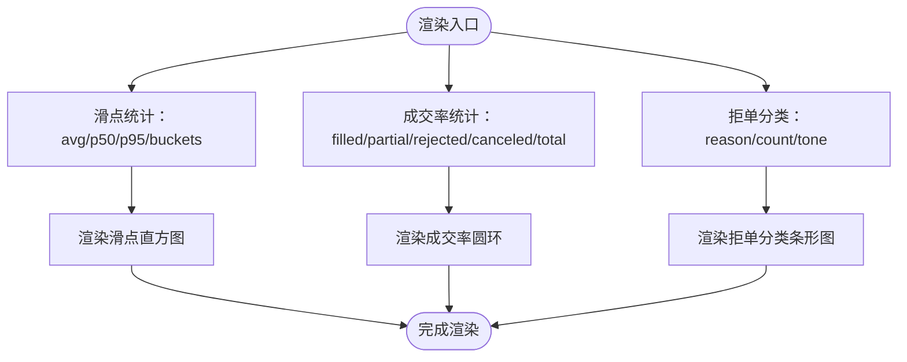
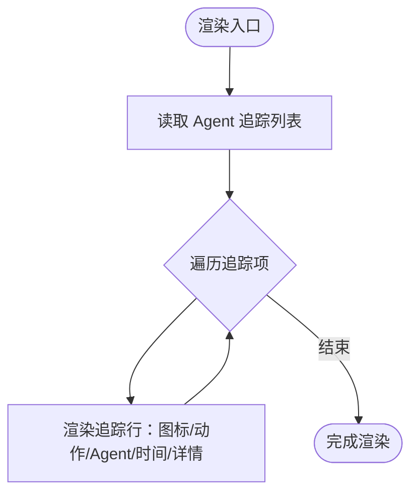
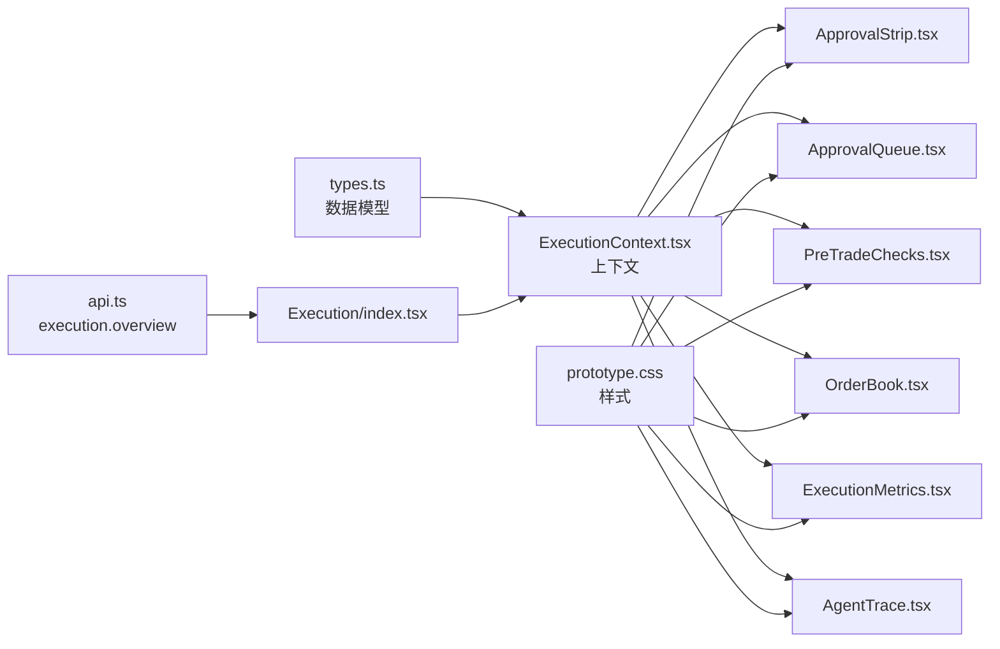

# 执行屏幕

<cite>
**本文档引用的文件**
- [frontend/src/screens/Execution/index.tsx](file://frontend/src/screens/Execution/index.tsx)
- [frontend/src/screens/Execution/OrderBook.tsx](file://frontend/src/screens/Execution/OrderBook.tsx)
- [frontend/src/screens/Execution/PreTradeChecks.tsx](file://frontend/src/screens/Execution/PreTradeChecks.tsx)
- [frontend/src/screens/Execution/ApprovalQueue.tsx](file://frontend/src/screens/Execution/ApprovalQueue.tsx)
- [frontend/src/screens/Execution/ApprovalStrip.tsx](file://frontend/src/screens/Execution/ApprovalStrip.tsx)
- [frontend/src/screens/Execution/ExecutionMetrics.tsx](file://frontend/src/screens/Execution/ExecutionMetrics.tsx)
- [frontend/src/screens/Execution/AgentTrace.tsx](file://frontend/src/screens/Execution/AgentTrace.tsx)
- [frontend/src/contexts/ExecutionContext.tsx](file://frontend/src/contexts/ExecutionContext.tsx)
- [frontend/src/data/types.ts](file://frontend/src/data/types.ts)
- [frontend/src/lib/api.ts](file://frontend/src/lib/api.ts)
- [frontend/src/styles/prototype.css](file://frontend/src/styles/prototype.css)
</cite>

## 目录
1. [简介](#简介)
2. [项目结构](#项目结构)
3. [核心组件](#核心组件)
4. [架构总览](#架构总览)
5. [详细组件分析](#详细组件分析)
6. [依赖关系分析](#依赖关系分析)
7. [性能考量](#性能考量)
8. [故障排查指南](#故障排查指南)
9. [结论](#结论)
10. [附录](#附录)

## 简介
本文件面向 llmine-quant 的“执行屏幕”，系统化梳理交易执行界面的前端架构与实现细节，覆盖以下关键子系统：
- 订单簿（OrderBook）：实时订单流展示与状态可视化
- 预交易检查（PreTradeChecks）：风险控制闸门的阈值与状态展示
- 审批队列（ApprovalQueue）：交易提案的卡片式列表与交互
- 审批条（ApprovalStrip）：执行概览的关键指标与趋势
- 执行指标（ExecutionMetrics）：滑点分布、成交率与拒单分类的可视化
- Agent 追踪（AgentTrace）：执行链路中的 Agent 操作流实时展示
同时，文档解释前端状态管理、实时数据更新机制与用户交互流程，并给出安全控制与用户体验优化的设计考虑。

## 项目结构
执行屏幕位于前端工程的 screens/Execution 目录，采用“按功能域划分”的组织方式，每个子组件独立负责一块 UI 区域，并通过上下文（Execution Provider）共享统一的执行数据模型。

图表来源
- [frontend/src/screens/Execution/index.tsx:17-44](file://frontend/src/screens/Execution/index.tsx#L17-L44)
- [frontend/src/contexts/ExecutionContext.tsx:1-13](file://frontend/src/contexts/ExecutionContext.tsx#L1-L13)
- [frontend/src/data/types.ts:242-316](file://frontend/src/data/types.ts#L242-L316)
- [frontend/src/lib/api.ts:679-691](file://frontend/src/lib/api.ts#L679-L691)

章节来源
- [frontend/src/screens/Execution/index.tsx:17-44](file://frontend/src/screens/Execution/index.tsx#L17-L44)
- [frontend/src/contexts/ExecutionContext.tsx:1-13](file://frontend/src/contexts/ExecutionContext.tsx#L1-L13)
- [frontend/src/data/types.ts:242-316](file://frontend/src/data/types.ts#L242-L316)
- [frontend/src/lib/api.ts:679-691](file://frontend/src/lib/api.ts#L679-L691)

## 核心组件
- 执行根组件：负责拉取执行概览数据、提供上下文、编排子组件布局
- 审批条：展示待审批数、紧急数、拦截数、24小时批准量、平均时延与成功率
- 审批队列：以卡片形式展示待审批提案，含类型、方向、数量、名义金额、限价、止损、置信度、风控评分、影响估算与倒计时
- 预交易检查：展示各项闸门检查的当前值、阈值、状态与告警
- 订单簿：展示最近 5 分钟内的订单流，含时间、标的、方向、数量、限价、已成交、状态、滑点与 P&L
- 执行指标：滑点分布直方图、成交率堆叠圆环、拒单分类柱状图
- Agent 追踪：实时展示 Agent 操作流，含动作、Agent 名称、时间与详情

章节来源
- [frontend/src/screens/Execution/index.tsx:17-44](file://frontend/src/screens/Execution/index.tsx#L17-L44)
- [frontend/src/screens/Execution/ApprovalStrip.tsx:9-34](file://frontend/src/screens/Execution/ApprovalStrip.tsx#L9-L34)
- [frontend/src/screens/Execution/ApprovalQueue.tsx:40-137](file://frontend/src/screens/Execution/ApprovalQueue.tsx#L40-L137)
- [frontend/src/screens/Execution/PreTradeChecks.tsx:15-67](file://frontend/src/screens/Execution/PreTradeChecks.tsx#L15-L67)
- [frontend/src/screens/Execution/OrderBook.tsx:19-80](file://frontend/src/screens/Execution/OrderBook.tsx#L19-L80)
- [frontend/src/screens/Execution/ExecutionMetrics.tsx:3-133](file://frontend/src/screens/Execution/ExecutionMetrics.tsx#L3-L133)
- [frontend/src/screens/Execution/AgentTrace.tsx:3-36](file://frontend/src/screens/Execution/AgentTrace.tsx#L3-L36)

## 架构总览
执行屏幕采用“容器组件 + 展示组件”的分层模式：
- 容器组件（Execution 根组件）负责数据获取与上下文提供
- 展示组件通过自定义 Hook 使用上下文数据，渲染各自区域
- 数据模型由类型定义约束，API 客户端封装接口调用

图表来源
- [frontend/src/screens/Execution/index.tsx:20-24](file://frontend/src/screens/Execution/index.tsx#L20-L24)
- [frontend/src/lib/api.ts:679-680](file://frontend/src/lib/api.ts#L679-L680)
- [frontend/src/contexts/ExecutionContext.tsx:6-12](file://frontend/src/contexts/ExecutionContext.tsx#L6-L12)

章节来源
- [frontend/src/screens/Execution/index.tsx:17-44](file://frontend/src/screens/Execution/index.tsx#L17-L44)
- [frontend/src/lib/api.ts:679-691](file://frontend/src/lib/api.ts#L679-L691)
- [frontend/src/contexts/ExecutionContext.tsx:1-13](file://frontend/src/contexts/ExecutionContext.tsx#L1-L13)

## 详细组件分析

### 订单簿（OrderBook）
职责与特性
- 展示最近 5 分钟的订单流，支持按状态着色与图标标识
- 提供滑点与 P&L 的可视化，支持人民币货币单位显示
- 行内状态映射与图例帮助快速理解订单状态

图表来源
- [frontend/src/screens/Execution/OrderBook.tsx:19-80](file://frontend/src/screens/Execution/OrderBook.tsx#L19-L80)

章节来源
- [frontend/src/screens/Execution/OrderBook.tsx:19-80](file://frontend/src/screens/Execution/OrderBook.tsx#L19-L80)
- [frontend/src/data/types.ts:280-291](file://frontend/src/data/types.ts#L280-L291)

### 预交易检查（PreTradeChecks）
职责与特性
- 展示多项风险闸门检查，含名称、当前值、阈值、状态与提示信息
- 使用进度条与比例指示阈值占用情况
- 整体状态根据所有检查是否通过决定徽章颜色

图表来源
- [frontend/src/screens/Execution/PreTradeChecks.tsx:15-67](file://frontend/src/screens/Execution/PreTradeChecks.tsx#L15-L67)

章节来源
- [frontend/src/screens/Execution/PreTradeChecks.tsx:15-67](file://frontend/src/screens/Execution/PreTradeChecks.tsx#L15-L67)
- [frontend/src/data/types.ts:272-279](file://frontend/src/data/types.ts#L272-L279)

### 审批队列（ApprovalQueue）
职责与特性
- 以卡片网格展示待审批提案，支持批量审批按钮
- 卡片内含类型、方向、数量、名义金额、限价、止损、原因、置信度、风控评分、影响估算与倒计时
- 倒计时小于阈值时高亮警示，过期态卡片降权显示

图表来源
- [frontend/src/screens/Execution/ApprovalQueue.tsx:40-137](file://frontend/src/screens/Execution/ApprovalQueue.tsx#L40-L137)

章节来源
- [frontend/src/screens/Execution/ApprovalQueue.tsx:40-137](file://frontend/src/screens/Execution/ApprovalQueue.tsx#L40-L137)
- [frontend/src/data/types.ts:251-271](file://frontend/src/data/types.ts#L251-L271)

### 审批条（ApprovalStrip）
职责与特性
- 展示关键执行指标：待审批、紧急、风险拦截、24小时批准量、平均时延、成功率
- 指标带趋势标签，根据阈值动态着色（正向/负向/警告/中性）

图表来源
- [frontend/src/screens/Execution/ApprovalStrip.tsx:9-34](file://frontend/src/screens/Execution/ApprovalStrip.tsx#L9-L34)

章节来源
- [frontend/src/screens/Execution/ApprovalStrip.tsx:9-34](file://frontend/src/screens/Execution/ApprovalStrip.tsx#L9-L34)
- [frontend/src/data/types.ts:243-250](file://frontend/src/data/types.ts#L243-L250)

### 执行指标（ExecutionMetrics）
职责与特性
- 滑点分布：展示近 50 笔订单的滑点区间直方图，标注平均、P50、P95
- 成交率：堆叠圆环展示已成交/部分/拒单/撤单占比
- 拒单分类：按原因统计拒单数量，按最大值缩放条形长度

图表来源
- [frontend/src/screens/Execution/ExecutionMetrics.tsx:3-133](file://frontend/src/screens/Execution/ExecutionMetrics.tsx#L3-L133)

章节来源
- [frontend/src/screens/Execution/ExecutionMetrics.tsx:3-133](file://frontend/src/screens/Execution/ExecutionMetrics.tsx#L3-L133)
- [frontend/src/data/types.ts:292-307](file://frontend/src/data/types.ts#L292-L307)

### Agent 追踪（AgentTrace）
职责与特性
- 实时展示 Agent 操作流，包含时间、Agent 名称、动作与详情
- 使用脉搏指示器表示实时性

图表来源
- [frontend/src/screens/Execution/AgentTrace.tsx:3-36](file://frontend/src/screens/Execution/AgentTrace.tsx#L3-L36)

章节来源
- [frontend/src/screens/Execution/AgentTrace.tsx:3-36](file://frontend/src/screens/Execution/AgentTrace.tsx#L3-L36)
- [frontend/src/data/types.ts:308-316](file://frontend/src/data/types.ts#L308-L316)

## 依赖关系分析
- 组件依赖：各展示组件均依赖自定义 Hook useExecution 从上下文读取数据
- 数据模型：types.ts 中的 execution 结构为所有组件提供类型保障
- 接口调用：api.ts 的 execution.overview 作为数据源，返回 mock 或真实后端数据
- 样式体系：prototype.css 提供统一的玻璃面板风格与主题色系

图表来源
- [frontend/src/data/types.ts:242-316](file://frontend/src/data/types.ts#L242-L316)
- [frontend/src/contexts/ExecutionContext.tsx:1-13](file://frontend/src/contexts/ExecutionContext.tsx#L1-L13)
- [frontend/src/lib/api.ts:679-680](file://frontend/src/lib/api.ts#L679-L680)
- [frontend/src/styles/prototype.css:5670-5869](file://frontend/src/styles/prototype.css#L5670-L5869)

章节来源
- [frontend/src/data/types.ts:242-316](file://frontend/src/data/types.ts#L242-L316)
- [frontend/src/contexts/ExecutionContext.tsx:1-13](file://frontend/src/contexts/ExecutionContext.tsx#L1-L13)
- [frontend/src/lib/api.ts:679-691](file://frontend/src/lib/api.ts#L679-L691)
- [frontend/src/styles/prototype.css:5670-5869](file://frontend/src/styles/prototype.css#L5670-L5869)

## 性能考量
- 渲染优化
  - 使用稳定的 key（如数组索引或唯一 ID）避免不必要的重排
  - 对长列表采用虚拟滚动（如后续扩展）降低 DOM 节点数量
- 数据更新
  - 当前实现为一次性加载概览数据；若需实时刷新，可在根组件中引入定时器或 WebSocket 推送
  - 对高频更新的区域（如订单簿、Agent 追踪）可采用局部刷新策略
- 图表绘制
  - 圆环图使用 CSS 渐变绘制，避免引入重型图表库
  - 直方图按最大值缩放，确保视觉一致性
- 样式性能
  - 使用 backdrop-filter 与渐变背景，现代浏览器性能良好；在低端设备上可考虑降级策略

## 故障排查指南
- 上下文未提供错误
  - 症状：useExecution 抛出错误
  - 排查：确认根组件已包裹在 ExecutionProvider 内
  - 参考路径：[frontend/src/contexts/ExecutionContext.tsx:8-12](file://frontend/src/contexts/ExecutionContext.tsx#L8-L12)
- 数据为空或加载失败
  - 症状：屏幕显示 Loading 或空白
  - 排查：检查 API 调用是否成功，网络请求是否被拦截，后端是否可用
  - 参考路径：[frontend/src/screens/Execution/index.tsx:20-24](file://frontend/src/screens/Execution/index.tsx#L20-L24)，[frontend/src/lib/api.ts:32-43](file://frontend/src/lib/api.ts#L32-L43)
- 审批队列交互无效
  - 症状：点击“批准/拒绝/推迟”无响应
  - 排查：确认事件回调 onModal 是否正确传入，按钮 onClick 是否绑定
  - 参考路径：[frontend/src/screens/Execution/ApprovalQueue.tsx:52-130](file://frontend/src/screens/Execution/ApprovalQueue.tsx#L52-L130)
- 指标显示异常
  - 症状：成交率圆环或滑点直方图比例不正确
  - 排查：核对数据字段（总数、分母、桶计数），确保计算逻辑一致
  - 参考路径：[frontend/src/screens/Execution/ExecutionMetrics.tsx:9-27](file://frontend/src/screens/Execution/ExecutionMetrics.tsx#L9-L27)，[frontend/src/screens/Execution/ExecutionMetrics.tsx:63-78](file://frontend/src/screens/Execution/ExecutionMetrics.tsx#L63-L78)

章节来源
- [frontend/src/contexts/ExecutionContext.tsx:8-12](file://frontend/src/contexts/ExecutionContext.tsx#L8-L12)
- [frontend/src/screens/Execution/index.tsx:20-24](file://frontend/src/screens/Execution/index.tsx#L20-L24)
- [frontend/src/lib/api.ts:32-43](file://frontend/src/lib/api.ts#L32-L43)
- [frontend/src/screens/Execution/ApprovalQueue.tsx:52-130](file://frontend/src/screens/Execution/ApprovalQueue.tsx#L52-L130)
- [frontend/src/screens/Execution/ExecutionMetrics.tsx:9-27](file://frontend/src/screens/Execution/ExecutionMetrics.tsx#L9-L27)
- [frontend/src/screens/Execution/ExecutionMetrics.tsx:63-78](file://frontend/src/screens/Execution/ExecutionMetrics.tsx#L63-L78)

## 结论
执行屏幕通过清晰的功能分区与统一的数据上下文，实现了交易执行全流程的可视化与交互。组件间低耦合、高内聚，便于扩展与维护。建议后续在数据刷新、图表性能与交互反馈方面持续优化，以提升实时性与用户体验。

## 附录
- 样式参考
  - 执行面板通用样式与主题色：[frontend/src/styles/prototype.css:5670-5869](file://frontend/src/styles/prototype.css#L5670-L5869)
- 类型定义参考
  - 执行数据模型：[frontend/src/data/types.ts:242-316](file://frontend/src/data/types.ts#L242-L316)