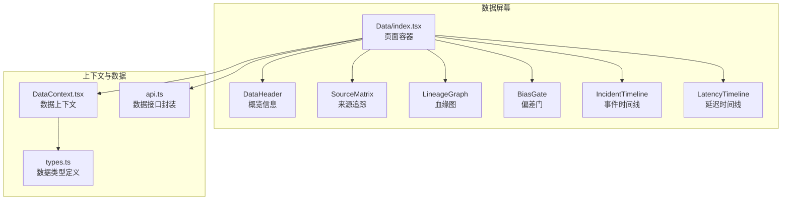
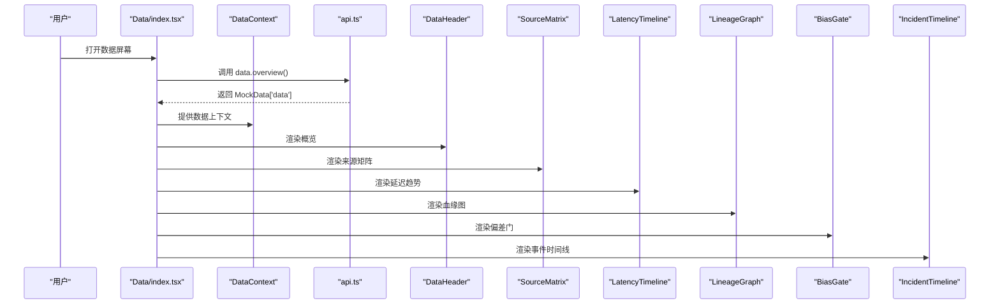
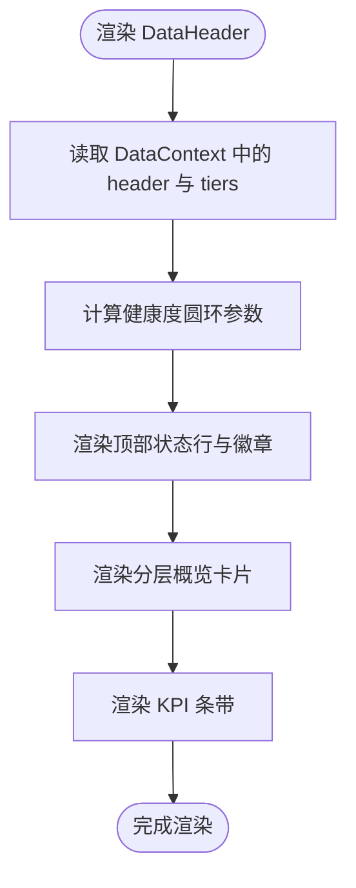
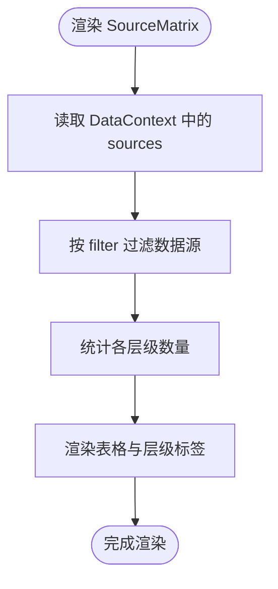
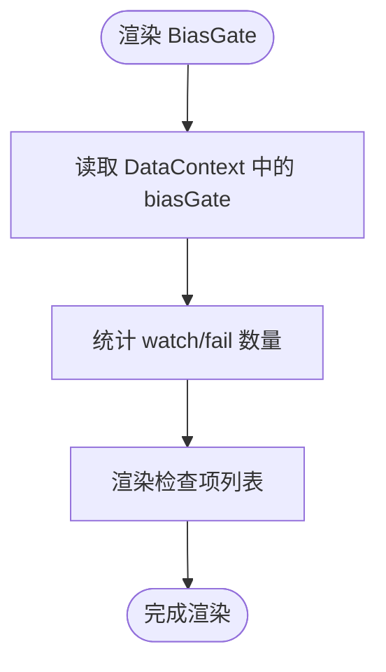
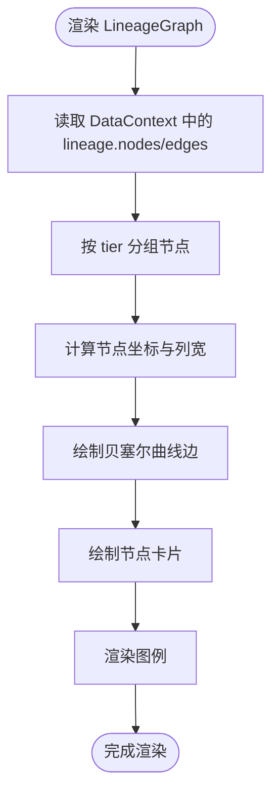
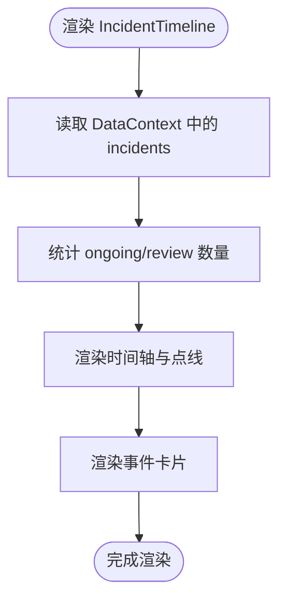
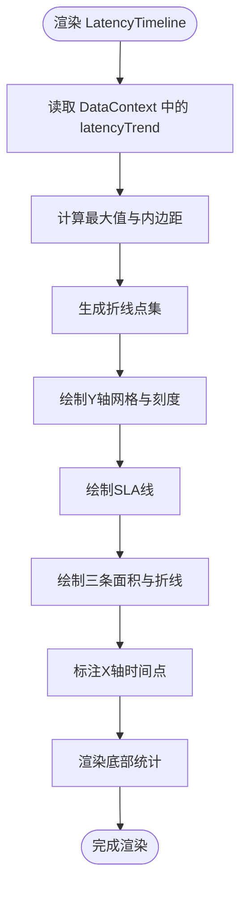
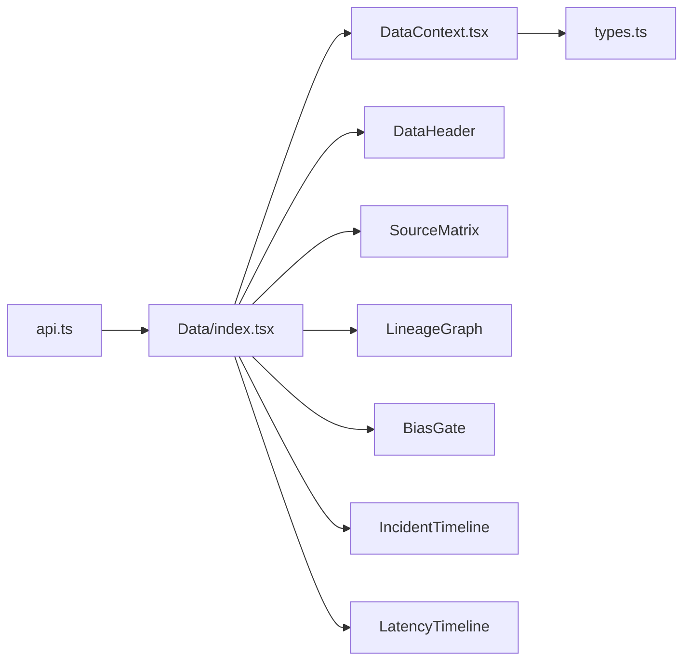

# 数据屏幕

<cite>
**本文引用的文件**
- [frontend/src/screens/Data/index.tsx](file://frontend/src/screens/Data/index.tsx)
- [frontend/src/screens/Data/DataHeader.tsx](file://frontend/src/screens/Data/DataHeader.tsx)
- [frontend/src/screens/Data/SourceMatrix.tsx](file://frontend/src/screens/Data/SourceMatrix.tsx)
- [frontend/src/screens/Data/BiasGate.tsx](file://frontend/src/screens/Data/BiasGate.tsx)
- [frontend/src/screens/Data/LineageGraph.tsx](file://frontend/src/screens/Data/LineageGraph.tsx)
- [frontend/src/screens/Data/IncidentTimeline.tsx](file://frontend/src/screens/Data/IncidentTimeline.tsx)
- [frontend/src/screens/Data/LatencyTimeline.tsx](file://frontend/src/screens/Data/LatencyTimeline.tsx)
- [frontend/src/contexts/DataContext.tsx](file://frontend/src/contexts/DataContext.tsx)
- [frontend/src/data/types.ts](file://frontend/src/data/types.ts)
- [frontend/src/lib/api.ts](file://frontend/src/lib/api.ts)
- [frontend/src/index.css](file://frontend/src/index.css)
- [frontend/src/styles/prototype.css](file://frontend/src/styles/prototype.css)
</cite>

## 目录
1. [简介](#简介)
2. [项目结构](#项目结构)
3. [核心组件](#核心组件)
4. [架构总览](#架构总览)
5. [详细组件分析](#详细组件分析)
6. [依赖关系分析](#依赖关系分析)
7. [性能考量](#性能考量)
8. [故障排查指南](#故障排查指南)
9. [结论](#结论)

## 简介
本文件为 llmine-quant 数据屏幕的组件级技术文档，聚焦数据质量管理界面的前端实现。围绕数据可靠性中心的五大核心视图展开：概览信息（DataHeader）、来源追踪（SourceMatrix）、偏差门（BiasGate）、血缘图（LineageGraph）、事件时间线（IncidentTimeline）与延迟时间线（LatencyTimeline）。文档解释了各组件的职责、数据流、渲染逻辑、交互行为与视觉设计，并提供架构图与序列图帮助理解前端如何消费后端数据并进行可视化呈现。

## 项目结构
数据屏幕位于前端工程的 screens/Data 目录下，采用“页面容器 + 组件”的分层组织方式：
- 页面容器负责拉取数据、提供上下文、编排布局
- 各子组件专注单一职责，通过上下文读取共享数据
- 样式采用主题变量与 TailwindCSS，确保统一风格与响应式布局

图表来源
- [frontend/src/screens/Data/index.tsx:17-44](file://frontend/src/screens/Data/index.tsx#L17-L44)
- [frontend/src/contexts/DataContext.tsx:1-13](file://frontend/src/contexts/DataContext.tsx#L1-L13)
- [frontend/src/data/types.ts:387-472](file://frontend/src/data/types.ts#L387-L472)
- [frontend/src/lib/api.ts:726-740](file://frontend/src/lib/api.ts#L726-L740)

章节来源
- [frontend/src/screens/Data/index.tsx:1-45](file://frontend/src/screens/Data/index.tsx#L1-L45)
- [frontend/src/contexts/DataContext.tsx:1-13](file://frontend/src/contexts/DataContext.tsx#L1-L13)
- [frontend/src/data/types.ts:387-472](file://frontend/src/data/types.ts#L387-L472)
- [frontend/src/lib/api.ts:726-740](file://frontend/src/lib/api.ts#L726-L740)

## 核心组件
- DataHeader：展示数据可靠性中心的整体健康度、关键指标与分层概览，提供全局操作入口
- SourceMatrix：按层级筛选展示数据源列表，标注延迟、缺失率、漂移与状态
- BiasGate：展示数据质量检查项的状态与结论，支持快速定位问题
- LineageGraph：以有向曲线连接的方式展示从原始数据到订单提案的血缘流转
- IncidentTimeline：按时间顺序展示事件的严重程度、类型与处理状态
- LatencyTimeline：展示三层（研究/模拟/实盘）延迟趋势与SLA对比

章节来源
- [frontend/src/screens/Data/DataHeader.tsx:1-148](file://frontend/src/screens/Data/DataHeader.tsx#L1-L148)
- [frontend/src/screens/Data/SourceMatrix.tsx:1-112](file://frontend/src/screens/Data/SourceMatrix.tsx#L1-L112)
- [frontend/src/screens/Data/BiasGate.tsx:1-59](file://frontend/src/screens/Data/BiasGate.tsx#L1-L59)
- [frontend/src/screens/Data/LineageGraph.tsx:1-138](file://frontend/src/screens/Data/LineageGraph.tsx#L1-L138)
- [frontend/src/screens/Data/IncidentTimeline.tsx:1-78](file://frontend/src/screens/Data/IncidentTimeline.tsx#L1-L78)
- [frontend/src/screens/Data/LatencyTimeline.tsx:1-129](file://frontend/src/screens/Data/LatencyTimeline.tsx#L1-L129)

## 架构总览
数据屏幕的前端架构遵循“容器组件 + 展示组件”的模式：
- 容器组件（Data/index.tsx）负责生命周期管理、数据拉取与上下文提供
- 展示组件通过 DataContext 读取共享数据，避免重复请求与状态分散
- 数据类型定义集中于 types.ts，保证组件间契约一致
- API 封装在 api.ts 中，统一错误处理与鉴权头

图表来源
- [frontend/src/screens/Data/index.tsx:17-44](file://frontend/src/screens/Data/index.tsx#L17-L44)
- [frontend/src/lib/api.ts:726-740](file://frontend/src/lib/api.ts#L726-L740)
- [frontend/src/contexts/DataContext.tsx:1-13](file://frontend/src/contexts/DataContext.tsx#L1-L13)

## 详细组件分析

### DataHeader 组件分析
- 职责：展示整体健康度（仪表盘）、关键指标（P95延迟、缺失率、24H事件）、分层概览与KPI条带
- 关键实现：
  - 使用 SVG 圆环绘制健康度仪表，根据健康分数计算圆弧长度
  - 顶部状态行统计总源/活跃/异常数量
  - 分层区域横向滚动展示研究/模拟/实盘三层的计数、平均延迟与描述
  - KPI 条带展示多维度指标与趋势
- 交互：提供“查看血缘”“新增数据源”按钮，回调 onModal

图表来源
- [frontend/src/screens/Data/DataHeader.tsx:13-148](file://frontend/src/screens/Data/DataHeader.tsx#L13-L148)

章节来源
- [frontend/src/screens/Data/DataHeader.tsx:1-148](file://frontend/src/screens/Data/DataHeader.tsx#L1-L148)

### SourceMatrix 组件分析
- 职责：以表格形式展示所有数据源，支持按层级筛选（全部/研究/模拟/实盘）
- 关键实现：
  - 过滤逻辑：根据当前 filter 状态筛选数据源
  - 统计：计算各层级的数量分布
  - 表格列：名称/提供商、类型、覆盖范围、延迟（P50/P95）、缺失率、漂移得分、许可层级、状态、最后更新时间
  - 样式：根据状态与层级设置颜色与警告提示
- 交互：点击层级标签切换筛选条件

图表来源
- [frontend/src/screens/Data/SourceMatrix.tsx:19-112](file://frontend/src/screens/Data/SourceMatrix.tsx#L19-L112)

章节来源
- [frontend/src/screens/Data/SourceMatrix.tsx:1-112](file://frontend/src/screens/Data/SourceMatrix.tsx#L1-L112)

### BiasGate 组件分析
- 职责：展示数据质量检查项的状态（通过/关注/失败/强制），汇总统计并提供规则入口
- 关键实现：
  - 统计关注与失败数量，动态更新副标题
  - 列表项包含标题、描述、备注与时间戳
  - 状态图标与标签映射，便于快速识别问题级别
- 交互：提供“查看规则”按钮

图表来源
- [frontend/src/screens/Data/BiasGate.tsx:17-59](file://frontend/src/screens/Data/BiasGate.tsx#L17-L59)

章节来源
- [frontend/src/screens/Data/BiasGate.tsx:1-59](file://frontend/src/screens/Data/BiasGate.tsx#L1-L59)

### LineageGraph 组件分析
- 职责：可视化数据从原始到订单提案的血缘流转，强调不同阶段（原始/特征/模型/信号/订单）的权限与版本
- 关键实现：
  - 节点按层级分组，计算每列位置与节点垂直分布
  - 使用 SVG 贝塞尔曲线绘制边，带箭头与渐变填充
  - 图例展示各层级含义与颜色
- 交互：无交互，纯展示

图表来源
- [frontend/src/screens/Data/LineageGraph.tsx:24-138](file://frontend/src/screens/Data/LineageGraph.tsx#L24-L138)

章节来源
- [frontend/src/screens/Data/LineageGraph.tsx:1-138](file://frontend/src/screens/Data/LineageGraph.tsx#L1-L138)

### IncidentTimeline 组件分析
- 职责：按时间顺序展示数据相关事件，标注严重程度、类型、状态与处理详情
- 关键实现：
  - 时间轴样式：点线连接，末尾节点无延伸线
  - 严重程度与状态标签映射，颜色区分
  - 卡片包含标题、来源、详情与解决方案
- 交互：提供“导出周报”按钮

图表来源
- [frontend/src/screens/Data/IncidentTimeline.tsx:25-78](file://frontend/src/screens/Data/IncidentTimeline.tsx#L25-L78)

章节来源
- [frontend/src/screens/Data/IncidentTimeline.tsx:1-78](file://frontend/src/screens/Data/IncidentTimeline.tsx#L1-L78)

### LatencyTimeline 组件分析
- 职责：展示研究/模拟/实盘三层延迟趋势，叠加SLA线与面积填充
- 关键实现：
  - 计算最大值用于Y轴缩放，绘制Y轴刻度
  - 三条折线分别对应三层，面积填充使用线性渐变
  - X轴标注时间点，SLA线使用虚线标注阈值
  - 底部统计三层数值
- 交互：无交互，纯展示

图表来源
- [frontend/src/screens/Data/LatencyTimeline.tsx:10-129](file://frontend/src/screens/Data/LatencyTimeline.tsx#L10-L129)

章节来源
- [frontend/src/screens/Data/LatencyTimeline.tsx:1-129](file://frontend/src/screens/Data/LatencyTimeline.tsx#L1-L129)

## 依赖关系分析
- 页面容器依赖 API 封装与 DataContext，负责数据获取与上下文提供
- 展示组件依赖 DataContext 读取数据，避免耦合具体数据源
- 类型定义集中于 types.ts，确保组件契约稳定
- 样式通过主题变量与通用类名统一风格，减少重复样式

图表来源
- [frontend/src/lib/api.ts:726-740](file://frontend/src/lib/api.ts#L726-L740)
- [frontend/src/screens/Data/index.tsx:17-44](file://frontend/src/screens/Data/index.tsx#L17-L44)
- [frontend/src/contexts/DataContext.tsx:1-13](file://frontend/src/contexts/DataContext.tsx#L1-L13)
- [frontend/src/data/types.ts:387-472](file://frontend/src/data/types.ts#L387-L472)

章节来源
- [frontend/src/lib/api.ts:726-740](file://frontend/src/lib/api.ts#L726-L740)
- [frontend/src/screens/Data/index.tsx:17-44](file://frontend/src/screens/Data/index.tsx#L17-L44)
- [frontend/src/contexts/DataContext.tsx:1-13](file://frontend/src/contexts/DataContext.tsx#L1-L13)
- [frontend/src/data/types.ts:387-472](file://frontend/src/data/types.ts#L387-L472)

## 性能考量
- 渲染优化
  - SourceMatrix 与 LatencyTimeline 使用预计算坐标与路径点，减少每次渲染的计算量
  - LineageGraph 通过分层布局与固定画布尺寸，避免频繁重排
- 数据访问
  - 通过 DataContext 一次提供数据，组件内部按需读取，避免重复请求
- 样式性能
  - 使用 CSS 渐变与 SVG，充分利用 GPU 加速；主题变量减少样式体积
- 可扩展性
  - 组件职责单一，易于按需懒加载或虚拟化长列表（如 SourceMatrix 的大数据集）

## 故障排查指南
- 数据为空或加载失败
  - 检查 Data/index.tsx 中的 API 调用是否成功返回
  - 确认 DataContext 是否正确提供数据
- 仪表盘显示异常
  - 检查 DataHeader 中健康度计算逻辑与 SVG 圆环参数
- 血缘图节点错位
  - 检查 LineageGraph 中节点分组与坐标计算逻辑
- 延迟图线异常
  - 检查 LatencyTimeline 中最大值计算与点集生成
- 事件时间线样式错乱
  - 检查 IncidentTimeline 中严重程度与状态标签映射

章节来源
- [frontend/src/screens/Data/index.tsx:17-44](file://frontend/src/screens/Data/index.tsx#L17-L44)
- [frontend/src/screens/Data/DataHeader.tsx:19-84](file://frontend/src/screens/Data/DataHeader.tsx#L19-L84)
- [frontend/src/screens/Data/LineageGraph.tsx:36-46](file://frontend/src/screens/Data/LineageGraph.tsx#L36-L46)
- [frontend/src/screens/Data/LatencyTimeline.tsx:13-27](file://frontend/src/screens/Data/LatencyTimeline.tsx#L13-L27)
- [frontend/src/screens/Data/IncidentTimeline.tsx:3-14](file://frontend/src/screens/Data/IncidentTimeline.tsx#L3-L14)

## 结论
数据屏幕通过清晰的组件划分与上下文共享，实现了数据可靠性中心的可视化呈现。概览、来源、偏差、血缘、事件与延迟六大视图相互补充，既满足日常监控需求，也为异常排查与治理流程提供直观支撑。建议后续结合后端真实数据接口，完善错误处理与加载状态，并考虑对长列表进行虚拟化优化。