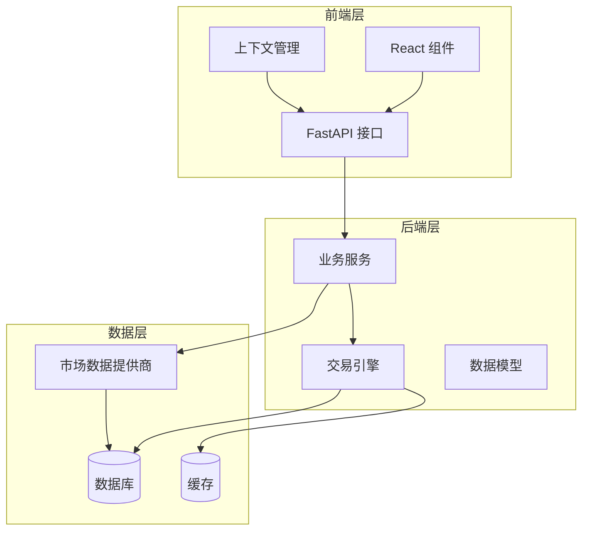
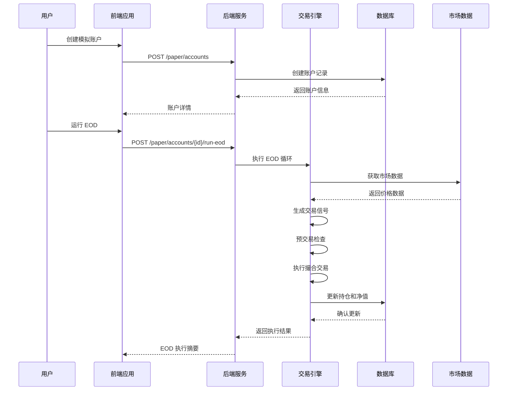
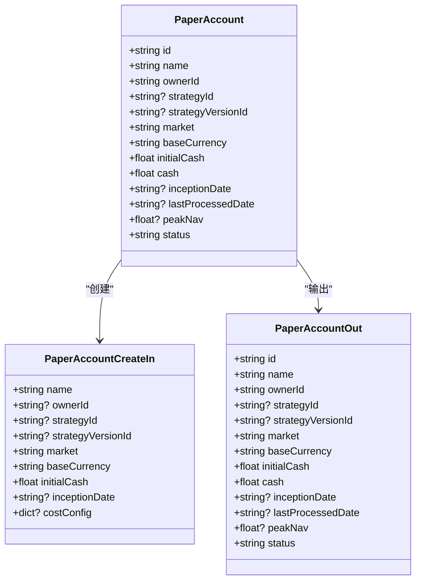
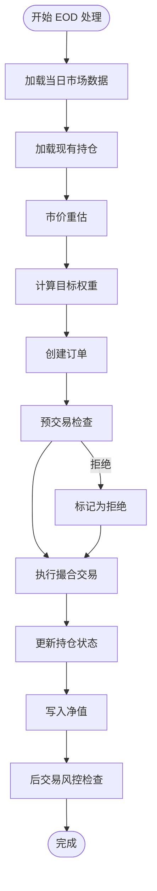
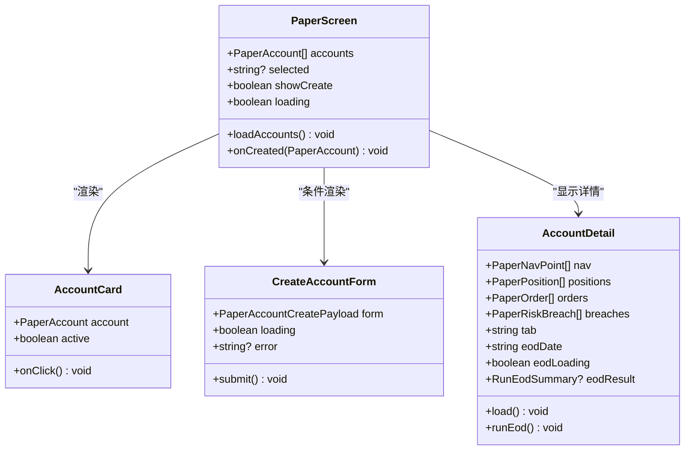
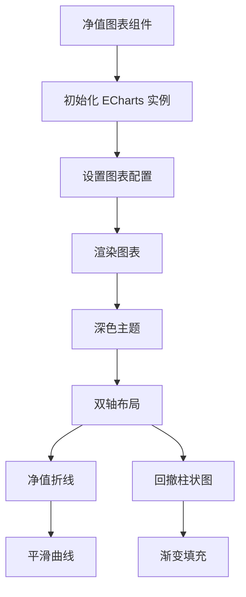
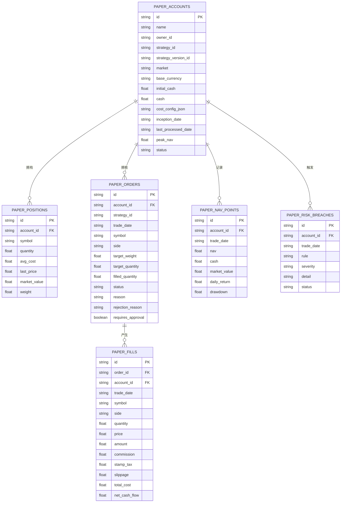
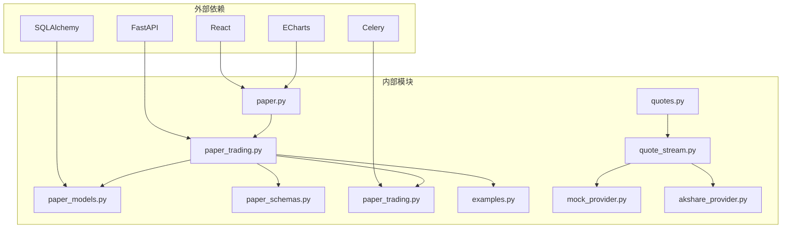

# 模拟盘屏幕

<cite>
**本文档引用的文件**
- [paper.py](file://backend/app/api/v1/paper.py)
- [paper_trading.py](file://backend/app/services/paper_trading.py)
- [index.tsx](file://frontend/src/screens/Paper/index.tsx)
- [PaperContext.tsx](file://frontend/src/contexts/PaperContext.tsx)
- [paper_models.py](file://backend/app/domains/execution/paper_models.py)
- [paper_schemas.py](file://backend/app/domains/execution/paper_schemas.py)
- [paper_trading.py](file://backend/app/tasks/paper_trading.py)
- [api.ts](file://frontend/src/lib/api.ts)
- [examples.py](file://backend/app/domains/strategy/examples.py)
- [quotes.py](file://backend/app/api/v1/quotes.py)
- [quote_stream.py](file://backend/app/services/quote_stream.py)
- [mock_provider.py](file://backend/app/integrations/market_data/mock_provider.py)
- [akshare_provider.py](file://backend/app/integrations/market_data/akshare_provider.py)
</cite>

## 目录
1. [简介](#简介)
2. [项目结构](#项目结构)
3. [核心组件](#核心组件)
4. [架构概览](#架构概览)
5. [详细组件分析](#详细组件分析)
6. [依赖关系分析](#依赖关系分析)
7. [性能考量](#性能考量)
8. [故障排除指南](#故障排除指南)
9. [结论](#结论)

## 简介

模拟盘屏幕是 llmine-quant 量化交易系统中的核心组件，为用户提供了一个完整的模拟交易环境。该系统基于真实的市场数据和交易成本模型，实现了从策略生成到模拟执行的完整闭环。模拟盘支持日结 EOD（End-of-Day）周期处理，提供实时市场数据展示和交易执行模拟，帮助用户验证交易策略的有效性和风险控制能力。

模拟盘系统的主要特点包括：
- **真实市场数据**：通过多种数据提供商获取实时或历史市场数据
- **完整的交易成本**：包含佣金、印花税、滑点等真实交易成本
- **风控校验**：内置多种风控规则和 Breach 检查
- **可视化展示**：提供直观的图表和表格展示投资组合表现
- **策略验证**：支持用户策略的离线验证和性能评估

## 项目结构

模拟盘系统采用前后端分离的架构设计，主要由以下层次组成：

**图表来源**
- [paper.py:36-37](file://backend/app/api/v1/paper.py#L36-L37)
- [index.tsx:1-18](file://frontend/src/screens/Paper/index.tsx#L1-L18)

**章节来源**
- [paper.py:1-276](file://backend/app/api/v1/paper.py#L1-L276)
- [index.tsx:1-452](file://frontend/src/screens/Paper/index.tsx#L1-L452)

## 核心组件

### 后端核心组件

#### 1. 模拟交易 API 层
负责提供模拟交易相关的 RESTful API 接口，包括账户管理、订单处理、持仓查询等功能。

#### 2. 交易引擎服务
实现完整的 EOD 交易循环，包括信号生成、预交易检查、撮合执行和净值计算。

#### 3. 数据模型层
定义模拟交易相关的数据库表结构，包括账户、持仓、订单、成交记录等。

#### 4. 市场数据服务
提供实时市场数据获取和缓存功能，支持多种数据提供商。

### 前端核心组件

#### 1. 主屏幕组件
提供模拟盘的主界面，包含账户列表、详情面板、图表展示等功能。

#### 2. 上下文管理
管理模拟盘相关的全局状态，包括账户信息、持仓数据、订单历史等。

#### 3. 图表组件
使用 ECharts 库实现净值曲线、回撤图表等可视化展示。

**章节来源**
- [paper_trading.py:76-134](file://backend/app/services/paper_trading.py#L76-L134)
- [paper_models.py:14-133](file://backend/app/domains/execution/paper_models.py#L14-L133)
- [index.tsx:369-452](file://frontend/src/screens/Paper/index.tsx#L369-L452)

## 架构概览

模拟盘系统采用分层架构设计，确保了良好的可维护性和扩展性：

**图表来源**
- [paper.py:229-247](file://backend/app/api/v1/paper.py#L229-L247)
- [paper_trading.py:82-134](file://backend/app/services/paper_trading.py#L82-L134)

系统的核心处理流程包括五个阶段：

1. **标记阶段（Mark）**：更新持仓的最新价格和市值
2. **信号阶段（Signal）**：基于策略生成目标权重
3. **预检查阶段（Pre-check）**：执行风控规则检查
4. **撮合阶段（Match）**：按照收盘价执行交易
5. **净值阶段（Nav）**：计算每日净值和风险指标

**章节来源**
- [paper_trading.py:1-20](file://backend/app/services/paper_trading.py#L1-L20)

## 详细组件分析

### 后端 API 组件

#### 模拟账户管理 API

模拟账户管理是模拟盘系统的基础功能，提供了完整的账户生命周期管理：

**图表来源**
- [paper_models.py:14-32](file://backend/app/domains/execution/paper_models.py#L14-L32)
- [paper_schemas.py:8-36](file://backend/app/domains/execution/paper_schemas.py#L8-L36)

#### 交易执行 API

模拟盘的交易执行完全基于策略信号，实现了真实的 T+1 撮合机制：

**图表来源**
- [paper_trading.py:82-134](file://backend/app/services/paper_trading.py#L82-L134)

**章节来源**
- [paper.py:43-86](file://backend/app/api/v1/paper.py#L43-L86)
- [paper_trading.py:179-196](file://backend/app/services/paper_trading.py#L179-L196)

### 前端组件分析

#### 主屏幕组件

主屏幕组件是用户与模拟盘交互的核心界面：

**图表来源**
- [index.tsx:369-452](file://frontend/src/screens/Paper/index.tsx#L369-L452)

#### 图表组件

净值图表组件使用 ECharts 实现了专业的金融图表展示：

**图表来源**
- [index.tsx:37-82](file://frontend/src/screens/Paper/index.tsx#L37-L82)

**章节来源**
- [index.tsx:84-452](file://frontend/src/screens/Paper/index.tsx#L84-L452)
- [PaperContext.tsx:1-20](file://frontend/src/contexts/PaperContext.tsx#L1-L20)

### 数据模型组件

#### 模拟交易数据模型

模拟盘系统定义了完整的数据模型来支持交易生命周期管理：

**图表来源**
- [paper_models.py:14-133](file://backend/app/domains/execution/paper_models.py#L14-L133)

**章节来源**
- [paper_models.py:1-133](file://backend/app/domains/execution/paper_models.py#L1-L133)

## 依赖关系分析

模拟盘系统的依赖关系体现了清晰的分层架构：

**图表来源**
- [paper.py:1-35](file://backend/app/api/v1/paper.py#L1-L35)
- [paper_trading.py:1-52](file://backend/app/services/paper_trading.py#L1-L52)

系统的关键依赖包括：

1. **前端框架**：React 提供组件化开发基础
2. **图表库**：ECharts 实现专业金融图表展示
3. **后端框架**：FastAPI 提供高性能 API 服务
4. **数据库 ORM**：SQLAlchemy 管理数据持久化
5. **任务队列**：Celery 支持异步任务处理

**章节来源**
- [api.ts:528-799](file://frontend/src/lib/api.ts#L528-L799)
- [paper_trading.py:1-52](file://backend/app/services/paper_trading.py#L1-L52)

## 性能考量

### 后端性能优化

模拟盘系统在性能方面采用了多项优化措施：

1. **批量数据处理**：使用 SQLAlchemy 的批量查询减少数据库往返
2. **异步处理**：利用 asyncio 和异步数据库连接提高并发性能
3. **缓存机制**：市场数据采用内存缓存减少重复请求
4. **索引优化**：关键字段建立数据库索引提升查询速度

### 前端性能优化

前端组件层面的优化包括：

1. **懒加载**：图表组件按需初始化，避免不必要的资源消耗
2. **状态管理**：使用 React Context 减少不必要的组件重渲染
3. **数据缓存**：API 请求结果缓存，避免重复网络请求
4. **虚拟滚动**：长列表采用虚拟滚动技术提升渲染性能

## 故障排除指南

### 常见问题及解决方案

#### 1. EOD 执行失败
**症状**：运行 EOD 时出现错误提示
**可能原因**：
- 市场数据缺失或格式异常
- 账户状态不正确
- 交易成本配置错误

**解决步骤**：
1. 检查市场数据是否正常加载
2. 验证账户状态为 active
3. 确认成本配置参数有效

#### 2. 图表显示异常
**症状**：净值图表无法正常显示
**可能原因**：
- ECharts 初始化失败
- 数据格式不正确
- DOM 元素未就绪

**解决步骤**：
1. 检查浏览器控制台错误信息
2. 验证数据格式符合要求
3. 确保容器元素具有正确的尺寸

#### 3. 实时数据延迟
**症状**：市场数据更新不及时
**可能原因**：
- WebSocket 连接断开
- 数据提供器响应慢
- 网络连接问题

**解决步骤**：
1. 检查 WebSocket 连接状态
2. 验证数据提供器可用性
3. 检查网络连接质量

**章节来源**
- [paper_trading.py:82-134](file://backend/app/services/paper_trading.py#L82-L134)
- [index.tsx:192-222](file://frontend/src/screens/Paper/index.tsx#L192-L222)

## 结论

模拟盘屏幕作为 llmine-quant 量化交易系统的重要组成部分，成功实现了从策略验证到交易执行的完整闭环。系统采用现代化的技术栈和清晰的架构设计，为用户提供了专业级的模拟交易体验。

### 主要优势

1. **完整性**：覆盖了从策略生成到交易执行的全流程
2. **真实性**：使用真实的市场数据和交易成本模型
3. **可视化**：提供直观的数据展示和分析工具
4. **可扩展性**：模块化设计便于功能扩展和维护

### 技术亮点

1. **EOD 周期处理**：实现了完整的日结交易流程
2. **风控集成**：内置多种风控规则和检查机制
3. **实时数据**：支持实时市场数据获取和展示
4. **性能优化**：多层优化确保系统高效运行

### 发展建议

1. **增强实时性**：可以考虑增加 WebSocket 实时数据推送
2. **扩展策略**：支持更多类型的交易策略
3. **移动端适配**：优化移动端用户体验
4. **高级分析**：增加更深入的风险分析和回测功能

模拟盘系统为量化交易研究和策略验证提供了坚实的技术基础，是构建完整量化交易生态系统的关键环节。