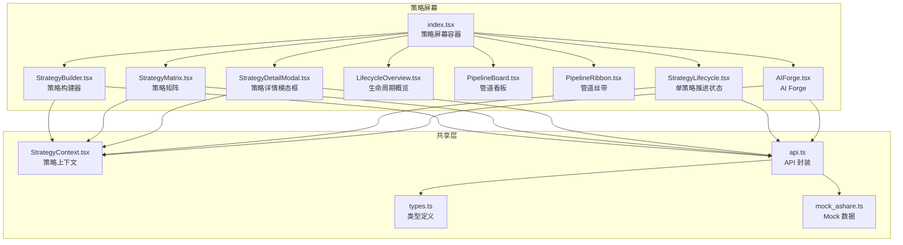
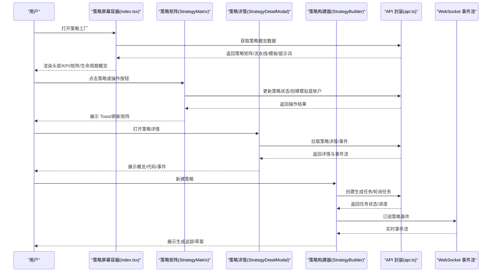
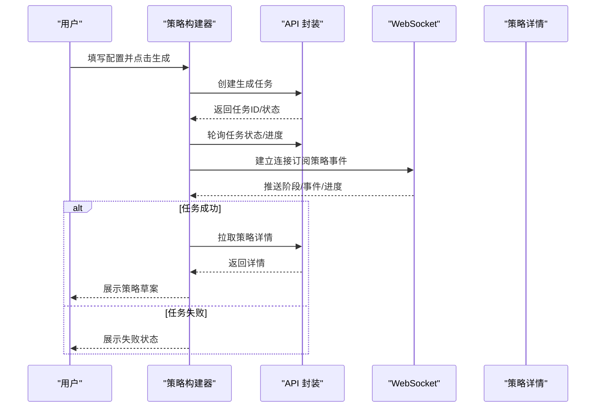
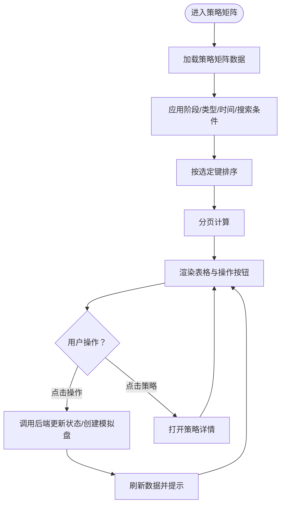
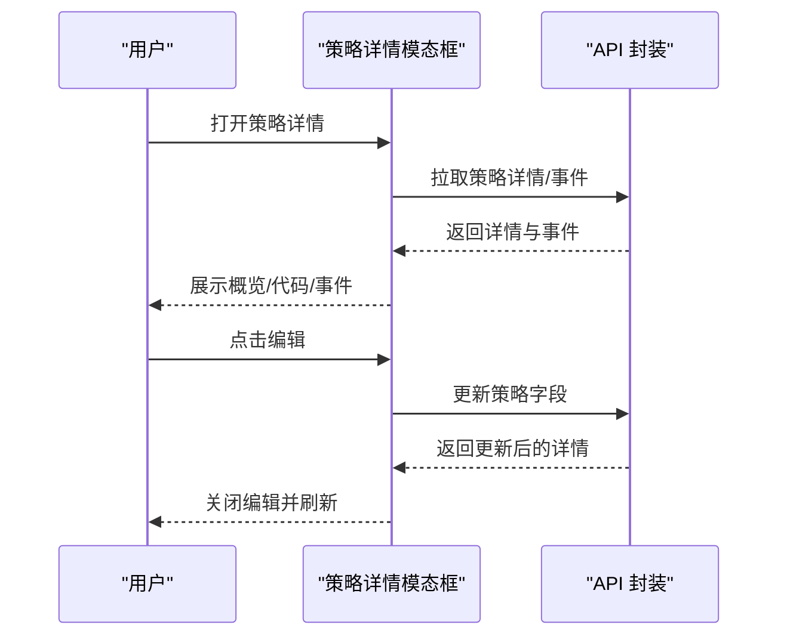
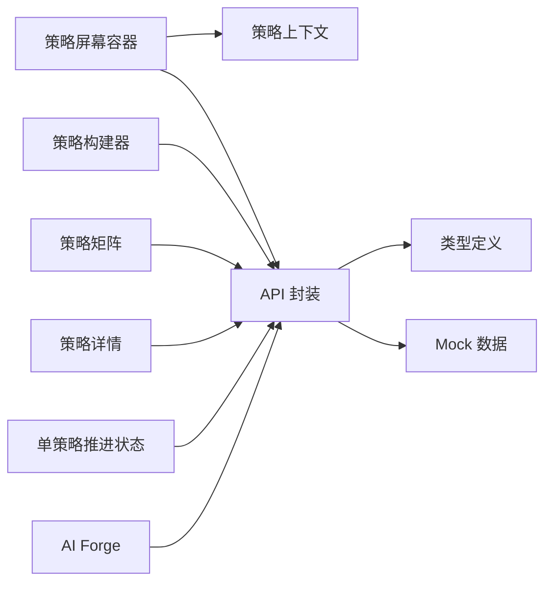

# 策略屏幕

<cite>
**本文档引用的文件**
- [frontend/src/screens/Strategy/index.tsx](file://frontend/src/screens/Strategy/index.tsx)
- [frontend/src/screens/Strategy/StrategyBuilder.tsx](file://frontend/src/screens/Strategy/StrategyBuilder.tsx)
- [frontend/src/screens/Strategy/StrategyMatrix.tsx](file://frontend/src/screens/Strategy/StrategyMatrix.tsx)
- [frontend/src/screens/Strategy/StrategyDetailModal.tsx](file://frontend/src/screens/Strategy/StrategyDetailModal.tsx)
- [frontend/src/screens/Strategy/LifecycleOverview.tsx](file://frontend/src/screens/Strategy/LifecycleOverview.tsx)
- [frontend/src/screens/Strategy/PipelineBoard.tsx](file://frontend/src/screens/Strategy/PipelineBoard.tsx)
- [frontend/src/screens/Strategy/PipelineRibbon.tsx](file://frontend/src/screens/Strategy/PipelineRibbon.tsx)
- [frontend/src/screens/Strategy/AIForge.tsx](file://frontend/src/screens/Strategy/AIForge.tsx)
- [frontend/src/screens/Strategy/StrategyLifecycle.tsx](file://frontend/src/screens/Strategy/StrategyLifecycle.tsx)
- [frontend/src/contexts/StrategyContext.tsx](file://frontend/src/contexts/StrategyContext.tsx)
- [frontend/src/lib/api.ts](file://frontend/src/lib/api.ts)
- [frontend/src/data/types.ts](file://frontend/src/data/types.ts)
- [frontend/src/data/mock_ashare.ts](file://frontend/src/data/mock_ashare.ts)
</cite>

## 目录
1. [简介](#简介)
2. [项目结构](#项目结构)
3. [核心组件](#核心组件)
4. [架构总览](#架构总览)
5. [详细组件分析](#详细组件分析)
6. [依赖关系分析](#依赖关系分析)
7. [性能考虑](#性能考虑)
8. [故障排除指南](#故障排除指南)
9. [结论](#结论)
10. [附录](#附录)

## 简介
本文件面向 llmine-quant 项目的策略屏幕（Strategy Screen），系统性梳理策略工厂的前端架构与交互实现，覆盖策略构建器（StrategyBuilder）、策略矩阵（StrategyMatrix）、策略详情模态框（StrategyDetailModal）、策略生命周期概览（LifecycleOverview）、管道看板（PipelineBoard）、管道丝带（PipelineRibbon）以及 AI Forge 的智能策略生成功能。文档同时解释策略状态管理、版本控制与审批流程的前端实现，并详述策略搜索、筛选与排序机制。

## 项目结构
策略屏幕位于前端工程的 Strategy 屏幕目录下，采用“屏幕级容器 + 组件级模块”的组织方式：
- 屏幕容器负责数据拉取、状态注入与布局编排
- 各功能组件分别承担构建、展示、详情、流程推进等职责
- 上下文提供共享数据，API 层封装后端接口，类型定义确保数据结构一致性

**图表来源**
- [frontend/src/screens/Strategy/index.tsx:1-182](file://frontend/src/screens/Strategy/index.tsx#L1-L182)
- [frontend/src/screens/Strategy/StrategyBuilder.tsx:1-808](file://frontend/src/screens/Strategy/StrategyBuilder.tsx#L1-L808)
- [frontend/src/screens/Strategy/StrategyMatrix.tsx:1-503](file://frontend/src/screens/Strategy/StrategyMatrix.tsx#L1-L503)
- [frontend/src/screens/Strategy/StrategyDetailModal.tsx:1-400](file://frontend/src/screens/Strategy/StrategyDetailModal.tsx#L1-L400)
- [frontend/src/screens/Strategy/LifecycleOverview.tsx:1-120](file://frontend/src/screens/Strategy/LifecycleOverview.tsx#L1-L120)
- [frontend/src/screens/Strategy/PipelineBoard.tsx:1-79](file://frontend/src/screens/Strategy/PipelineBoard.tsx#L1-L79)
- [frontend/src/screens/Strategy/PipelineRibbon.tsx:1-28](file://frontend/src/screens/Strategy/PipelineRibbon.tsx#L1-L28)
- [frontend/src/screens/Strategy/AIForge.tsx:1-284](file://frontend/src/screens/Strategy/AIForge.tsx#L1-L284)
- [frontend/src/screens/Strategy/StrategyLifecycle.tsx:1-203](file://frontend/src/screens/Strategy/StrategyLifecycle.tsx#L1-L203)
- [frontend/src/contexts/StrategyContext.tsx:1-13](file://frontend/src/contexts/StrategyContext.tsx#L1-L13)
- [frontend/src/lib/api.ts:514-617](file://frontend/src/lib/api.ts#L514-L617)
- [frontend/src/data/types.ts:46-76](file://frontend/src/data/types.ts#L46-L76)
- [frontend/src/data/mock_ashare.ts:162-306](file://frontend/src/data/mock_ashare.ts#L162-L306)

**章节来源**
- [frontend/src/screens/Strategy/index.tsx:1-182](file://frontend/src/screens/Strategy/index.tsx#L1-L182)
- [frontend/src/contexts/StrategyContext.tsx:1-13](file://frontend/src/contexts/StrategyContext.tsx#L1-L13)
- [frontend/src/lib/api.ts:514-617](file://frontend/src/lib/api.ts#L514-L617)
- [frontend/src/data/types.ts:46-76](file://frontend/src/data/types.ts#L46-L76)
- [frontend/src/data/mock_ashare.ts:162-306](file://frontend/src/data/mock_ashare.ts#L162-L306)

## 核心组件
本节聚焦策略屏幕的关键组件及其职责边界与协作关系。

- 策略屏幕容器（index.tsx）
  - 负责整体布局、头部信息、KPI 展示、策略矩阵渲染、生命周期概览、抽屉式策略构建器与详情模态框的开关控制
  - 通过 Provider 注入策略上下文数据，统一刷新与导航回调

- 策略构建器（StrategyBuilder）
  - 提供市场、股票池、策略风格、风险偏好等配置项
  - 通过 WebSocket 与轮询结合跟踪生成任务进度，实时展示 Agent 日志与阶段状态
  - 生成完成后产出策略草案，支持回测、审查、风控检查与保存草稿等下一步操作

- 策略矩阵（StrategyMatrix）
  - 支持按阶段、类型、时间窗口、关键词搜索与排序
  - 提供分页与菜单式操作（开始研究、运行回测、推送模拟盘、部署实盘、暂停/恢复等）
  - 展示关键指标（年化收益、最大回撤、夏普、OOS）与趋势微图

- 策略详情模态框（StrategyDetailModal）
  - 展示策略概览、代码与事件流水线
  - 支持编辑基础字段（名称、族群、市场、风险偏好、频率、股票池、状态等）
  - 支持删除策略（软删除，可通过审计恢复）

- 生命周期概览（LifecycleOverview）
  - 以卡片形式展示各阶段策略数量与上下文说明
  - 支持点击筛选对应阶段

- 管道看板（PipelineBoard）
  - 按阶段 lanes 展示策略版本票据，包含标题、描述、进度条与指标块
  - 支持高亮当前策略

- 管道丝带（PipelineRibbon）
  - 以横向条形图展示各阶段策略占比与数量

- AI Forge
  - 一键生成策略的入口，支持风险偏好过滤与模板选择
  - 实时展示生成流水线事件与 Agent 状态

- 单策略推进状态（StrategyLifecycle）
  - 基于当前策略在流水线中的位置，提供下一步推进按钮（如开始研究、运行回测、提交风控审查、推送模拟盘、部署实盘、暂停/恢复等）

**章节来源**
- [frontend/src/screens/Strategy/index.tsx:32-181](file://frontend/src/screens/Strategy/index.tsx#L32-L181)
- [frontend/src/screens/Strategy/StrategyBuilder.tsx:107-808](file://frontend/src/screens/Strategy/StrategyBuilder.tsx#L107-L808)
- [frontend/src/screens/Strategy/StrategyMatrix.tsx:87-503](file://frontend/src/screens/Strategy/StrategyMatrix.tsx#L87-L503)
- [frontend/src/screens/Strategy/StrategyDetailModal.tsx:47-400](file://frontend/src/screens/Strategy/StrategyDetailModal.tsx#L47-L400)
- [frontend/src/screens/Strategy/LifecycleOverview.tsx:59-120](file://frontend/src/screens/Strategy/LifecycleOverview.tsx#L59-L120)
- [frontend/src/screens/Strategy/PipelineBoard.tsx:14-79](file://frontend/src/screens/Strategy/PipelineBoard.tsx#L14-L79)
- [frontend/src/screens/Strategy/PipelineRibbon.tsx:3-28](file://frontend/src/screens/Strategy/PipelineRibbon.tsx#L3-L28)
- [frontend/src/screens/Strategy/AIForge.tsx:18-284](file://frontend/src/screens/Strategy/AIForge.tsx#L18-L284)
- [frontend/src/screens/Strategy/StrategyLifecycle.tsx:22-203](file://frontend/src/screens/Strategy/StrategyLifecycle.tsx#L22-L203)

## 架构总览
策略屏幕采用“容器组件 + 功能组件 + 上下文 + API 封装”的分层架构：
- 容器组件负责数据拉取与状态管理，通过 Provider 注入策略上下文
- 功能组件通过 API 封装与后端交互，同时监听 WebSocket 事件
- 类型定义与 Mock 数据保证前后端契约一致与本地开发可用

**图表来源**
- [frontend/src/screens/Strategy/index.tsx:32-181](file://frontend/src/screens/Strategy/index.tsx#L32-L181)
- [frontend/src/screens/Strategy/StrategyMatrix.tsx:107-161](file://frontend/src/screens/Strategy/StrategyMatrix.tsx#L107-L161)
- [frontend/src/screens/Strategy/StrategyDetailModal.tsx:58-81](file://frontend/src/screens/Strategy/StrategyDetailModal.tsx#L58-L81)
- [frontend/src/screens/Strategy/StrategyBuilder.tsx:242-483](file://frontend/src/screens/Strategy/StrategyBuilder.tsx#L242-L483)
- [frontend/src/lib/api.ts:554-617](file://frontend/src/lib/api.ts#L554-L617)

**章节来源**
- [frontend/src/screens/Strategy/index.tsx:32-181](file://frontend/src/screens/Strategy/index.tsx#L32-L181)
- [frontend/src/lib/api.ts:554-617](file://frontend/src/lib/api.ts#L554-L617)

## 详细组件分析

### 策略构建器（StrategyBuilder）
- 交互设计
  - 左侧配置区：市场、股票池、策略风格、风险偏好、自然语言描述
  - 右侧输出区：生成追踪与策略草案
  - 生成追踪 Tab 展示 Agent 阶段与进度条，支持展开/收起原始日志
  - 草案 Tab 展示信号定义、入场/出场规则、调仓频率、仓位管理、风控约束与基准
- 生成流程
  - 创建任务后，优先轮询任务状态，同时建立 WebSocket 订阅
  - 通过事件流映射 Agent 阶段（扫描、生成、风控、回测），并更新追踪面板
  - 任务完成后，优先从详情加载草案，否则从 WebSocket 事件中提取关键字段
- 下一步操作
  - 运行回测、审查信号逻辑、风控检查、保存草稿

**图表来源**
- [frontend/src/screens/Strategy/StrategyBuilder.tsx:485-513](file://frontend/src/screens/Strategy/StrategyBuilder.tsx#L485-L513)
- [frontend/src/screens/Strategy/StrategyBuilder.tsx:242-483](file://frontend/src/screens/Strategy/StrategyBuilder.tsx#L242-L483)
- [frontend/src/lib/api.ts:556-594](file://frontend/src/lib/api.ts#L556-L594)

**章节来源**
- [frontend/src/screens/Strategy/StrategyBuilder.tsx:107-808](file://frontend/src/screens/Strategy/StrategyBuilder.tsx#L107-L808)
- [frontend/src/lib/api.ts:556-594](file://frontend/src/lib/api.ts#L556-L594)

### 策略矩阵（StrategyMatrix）
- 筛选与排序
  - 阶段筛选：草稿、研究、回测、模拟盘、实盘、暂停
  - 类型筛选：趋势、动量、价值、均值回归、套利、多因子等
  - 时间范围：全部、近7天、近30天、近90天
  - 关键词搜索：按策略名称模糊匹配
  - 排序：名称（字母序）、年化收益（数值降序）、最大回撤、夏普比率、OOS
- 操作菜单
  - 根据当前状态提供“开始研究”、“运行回测”、“推送模拟盘”、“部署实盘”、“暂停/恢复”等操作
  - 模拟盘部署会自动创建账户并更新状态
- 分页与高亮
  - 支持每页显示 10/25/50 条，页码省略中间省略号
  - 支持高亮最新创建的策略

**图表来源**
- [frontend/src/screens/Strategy/StrategyMatrix.tsx:172-204](file://frontend/src/screens/Strategy/StrategyMatrix.tsx#L172-L204)
- [frontend/src/screens/Strategy/StrategyMatrix.tsx:107-161](file://frontend/src/screens/Strategy/StrategyMatrix.tsx#L107-L161)

**章节来源**
- [frontend/src/screens/Strategy/StrategyMatrix.tsx:87-503](file://frontend/src/screens/Strategy/StrategyMatrix.tsx#L87-L503)

### 策略详情模态框（StrategyDetailModal）
- 信息呈现
  - 概览页：年化收益、最大回撤、夏普、OOS 等指标
  - 代码页：展示最新版本代码文本
  - 事件页：展示最近的流水线事件（阶段、事件、进度、时间）
- 编辑与删除
  - 支持编辑基础字段（名称、族群、市场、风险偏好、频率、股票池、状态）
  - 删除策略（软删除，可通过审计恢复）

**图表来源**
- [frontend/src/screens/Strategy/StrategyDetailModal.tsx:58-81](file://frontend/src/screens/Strategy/StrategyDetailModal.tsx#L58-L81)
- [frontend/src/screens/Strategy/StrategyDetailModal.tsx:90-122](file://frontend/src/screens/Strategy/StrategyDetailModal.tsx#L90-L122)
- [frontend/src/lib/api.ts:607-614](file://frontend/src/lib/api.ts#L607-L614)

**章节来源**
- [frontend/src/screens/Strategy/StrategyDetailModal.tsx:47-400](file://frontend/src/screens/Strategy/StrategyDetailModal.tsx#L47-L400)
- [frontend/src/lib/api.ts:607-614](file://frontend/src/lib/api.ts#L607-L614)

### 策略生命周期概览（LifecycleOverview）
- 以卡片形式展示各阶段策略数量与上下文说明
- 支持点击筛选对应阶段，清除筛选

**章节来源**
- [frontend/src/screens/Strategy/LifecycleOverview.tsx:59-120](file://frontend/src/screens/Strategy/LifecycleOverview.tsx#L59-L120)

### 管道看板（PipelineBoard）与管道丝带（PipelineRibbon）
- 管道看板：按阶段 lanes 展示策略版本票据，包含标题、描述、进度条与指标块，支持高亮当前策略
- 管道丝带：以横向条形图展示各阶段策略占比与数量

**章节来源**
- [frontend/src/screens/Strategy/PipelineBoard.tsx:14-79](file://frontend/src/screens/Strategy/PipelineBoard.tsx#L14-L79)
- [frontend/src/screens/Strategy/PipelineRibbon.tsx:3-28](file://frontend/src/screens/Strategy/PipelineRibbon.tsx#L3-L28)

### AI Forge（智能策略生成）
- 一键生成策略的入口，支持风险偏好过滤与模板选择
- 实时展示生成流水线事件与 Agent 状态，支持 WebSocket 与轮询双通道

**章节来源**
- [frontend/src/screens/Strategy/AIForge.tsx:18-284](file://frontend/src/screens/Strategy/AIForge.tsx#L18-L284)

### 单策略推进状态（StrategyLifecycle）
- 基于当前策略在流水线中的位置，提供下一步推进按钮
- 支持状态推进（开始研究、运行回测、提交风控审查、推送模拟盘、部署实盘、暂停/恢复等）

**章节来源**
- [frontend/src/screens/Strategy/StrategyLifecycle.tsx:22-203](file://frontend/src/screens/Strategy/StrategyLifecycle.tsx#L22-L203)

## 依赖关系分析
- 组件耦合
  - 容器组件与功能组件通过上下文与 API 封装解耦
  - 功能组件之间无直接依赖，主要通过 API 与上下文交互
- 外部依赖
  - API 封装统一管理后端接口与错误处理
  - Mock 数据用于本地开发与演示
- 数据契约
  - 类型定义确保前后端字段一致，避免运行时错误

**图表来源**
- [frontend/src/screens/Strategy/index.tsx:1-182](file://frontend/src/screens/Strategy/index.tsx#L1-L182)
- [frontend/src/contexts/StrategyContext.tsx:1-13](file://frontend/src/contexts/StrategyContext.tsx#L1-L13)
- [frontend/src/lib/api.ts:514-617](file://frontend/src/lib/api.ts#L514-L617)
- [frontend/src/data/types.ts:46-76](file://frontend/src/data/types.ts#L46-L76)
- [frontend/src/data/mock_ashare.ts:162-306](file://frontend/src/data/mock_ashare.ts#L162-L306)

**章节来源**
- [frontend/src/screens/Strategy/index.tsx:1-182](file://frontend/src/screens/Strategy/index.tsx#L1-L182)
- [frontend/src/contexts/StrategyContext.tsx:1-13](file://frontend/src/contexts/StrategyContext.tsx#L1-L13)
- [frontend/src/lib/api.ts:514-617](file://frontend/src/lib/api.ts#L514-L617)
- [frontend/src/data/types.ts:46-76](file://frontend/src/data/types.ts#L46-L76)
- [frontend/src/data/mock_ashare.ts:162-306](file://frontend/src/data/mock_ashare.ts#L162-L306)

## 性能考虑
- 渲染优化
  - 策略矩阵使用分页与有限渲染，避免一次性渲染大量行
  - 使用 useMemo 缓存筛选与排序结果，减少重复计算
- 网络优化
  - 生成流程采用轮询与 WebSocket 双通道，降低长轮询开销
  - 详情与事件按需拉取，避免不必要的请求
- 交互体验
  - 操作按钮禁用状态与 Toast 提示，避免重复提交
  - 高亮最新创建策略，提升反馈速度

## 故障排除指南
- 生成任务失败
  - 检查 WebSocket 连接与轮询状态，确认任务状态与错误信息
  - 若 WebSocket 断开，系统会自动切换到轮询模式
- 策略详情加载失败
  - 确认策略 ID 是否正确，检查后端接口返回
  - 若详情不可用，可在模态框中看到相应提示
- 操作失败
  - 查看 Toast 提示与错误信息，确认权限与状态是否满足操作条件
  - 必要时刷新页面或重新登录

**章节来源**
- [frontend/src/screens/Strategy/StrategyBuilder.tsx:273-284](file://frontend/src/screens/Strategy/StrategyBuilder.tsx#L273-L284)
- [frontend/src/screens/Strategy/StrategyDetailModal.tsx:111-122](file://frontend/src/screens/Strategy/StrategyDetailModal.tsx#L111-L122)
- [frontend/src/lib/api.ts:573-594](file://frontend/src/lib/api.ts#L573-L594)

## 结论
策略屏幕通过清晰的组件划分与上下文/API 封装，实现了从策略生成、矩阵管理、详情审查到生命周期推进的完整闭环。其交互设计强调可视化与可操作性，结合实时事件流与状态推进，有效支撑了策略研发与上线的全流程工作台需求。

## 附录
- 策略状态管理
  - 通过上下文注入策略数据，组件通过 API 更新状态并触发刷新
  - 支持草稿、研究、回测、模拟盘、实盘、暂停等状态流转
- 版本控制与审批流程
  - 详情页展示版本信息与参数模板、风险规则
  - 审批流程通过后端接口与前端按钮协同实现
- 搜索、筛选与排序
  - 策略矩阵提供多维筛选与排序，支持快速定位目标策略

**章节来源**
- [frontend/src/screens/Strategy/StrategyDetailModal.tsx:88-323](file://frontend/src/screens/Strategy/StrategyDetailModal.tsx#L88-L323)
- [frontend/src/screens/Strategy/StrategyMatrix.tsx:172-204](file://frontend/src/screens/Strategy/StrategyMatrix.tsx#L172-L204)
- [frontend/src/screens/Strategy/StrategyLifecycle.tsx:27-38](file://frontend/src/screens/Strategy/StrategyLifecycle.tsx#L27-L38)