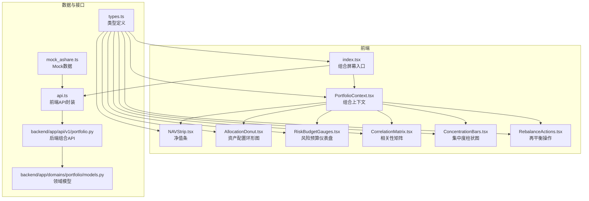
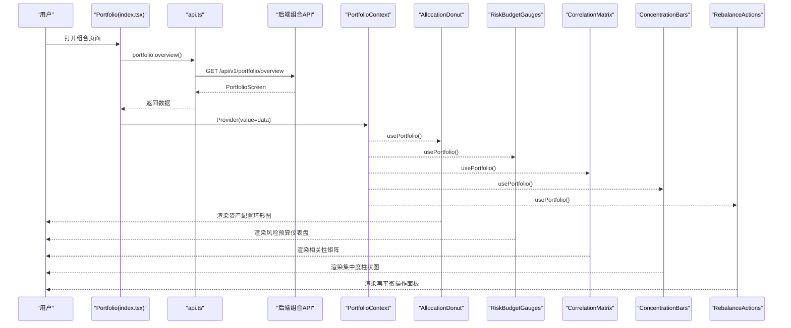
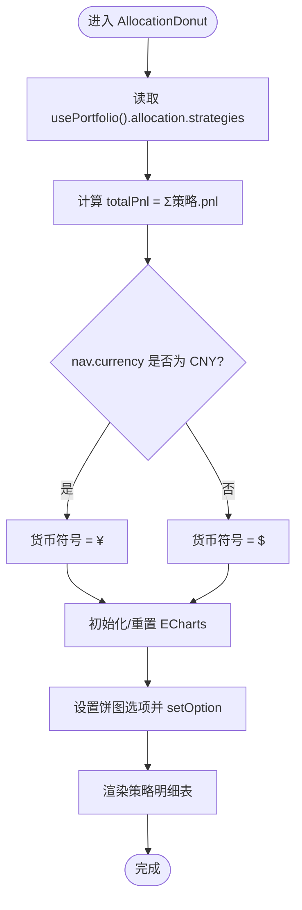
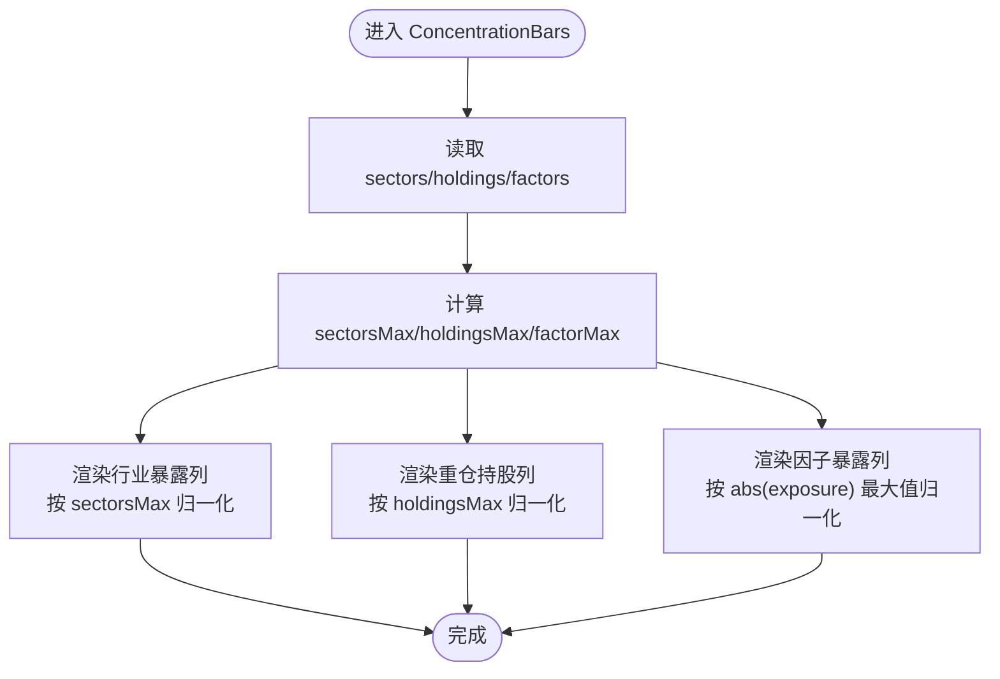
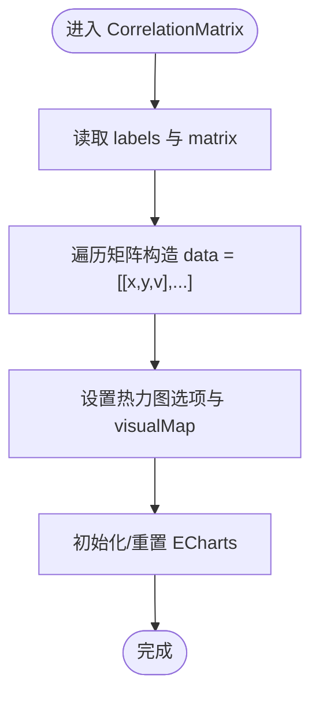
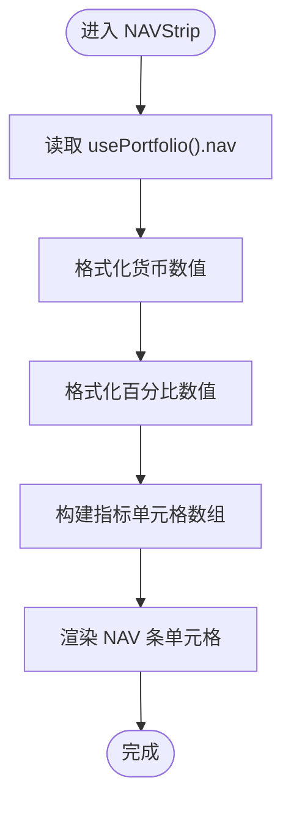
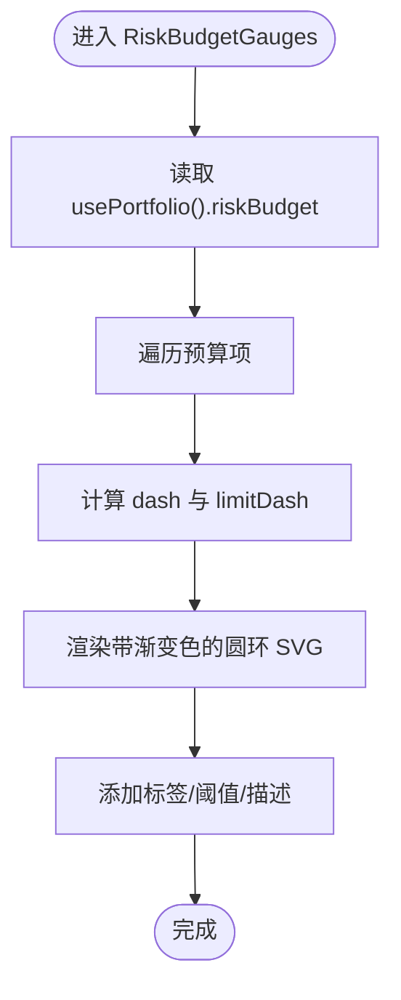
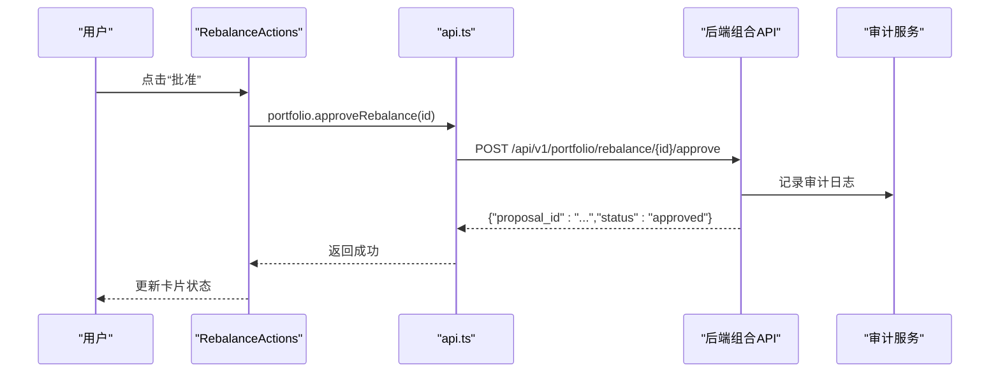
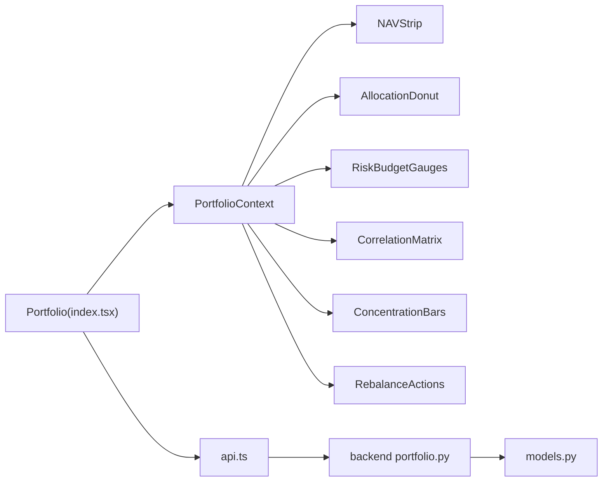

# 组合屏幕

<cite>
**本文引用的文件**
- [frontend/src/screens/Portfolio/index.tsx](file://frontend/src/screens/Portfolio/index.tsx)
- [frontend/src/screens/Portfolio/AllocationDonut.tsx](file://frontend/src/screens/Portfolio/AllocationDonut.tsx)
- [frontend/src/screens/Portfolio/ConcentrationBars.tsx](file://frontend/src/screens/Portfolio/ConcentrationBars.tsx)
- [frontend/src/screens/Portfolio/CorrelationMatrix.tsx](file://frontend/src/screens/Portfolio/CorrelationMatrix.tsx)
- [frontend/src/screens/Portfolio/NAVStrip.tsx](file://frontend/src/screens/Portfolio/NAVStrip.tsx)
- [frontend/src/screens/Portfolio/RebalanceActions.tsx](file://frontend/src/screens/Portfolio/RebalanceActions.tsx)
- [frontend/src/screens/Portfolio/RiskBudgetGauges.tsx](file://frontend/src/screens/Portfolio/RiskBudgetGauges.tsx)
- [frontend/src/contexts/PortfolioContext.tsx](file://frontend/src/contexts/PortfolioContext.tsx)
- [frontend/src/data/types.ts](file://frontend/src/data/types.ts)
- [frontend/src/data/mock_ashare.ts](file://frontend/src/data/mock_ashare.ts)
- [frontend/src/lib/api.ts](file://frontend/src/lib/api.ts)
- [backend/app/api/v1/portfolio.py](file://backend/app/api/v1/portfolio.py)
- [backend/app/domains/portfolio/models.py](file://backend/app/domains/portfolio/models.py)
</cite>

## 目录
1. [简介](#简介)
2. [项目结构](#项目结构)
3. [核心组件](#核心组件)
4. [架构总览](#架构总览)
5. [详细组件分析](#详细组件分析)
6. [依赖分析](#依赖分析)
7. [性能考虑](#性能考虑)
8. [故障排查指南](#故障排查指南)
9. [结论](#结论)
10. [附录](#附录)

## 简介
本文件为 llmine-quant 组合屏幕的专业组件文档，聚焦于投资组合管理界面的五大核心图表与再平衡面板：资产配置环形图（AllocationDonut）、集中度柱状图（ConcentrationBars）、相关性矩阵（CorrelationMatrix）、净值条（NAVStrip）、风险预算仪表盘（RiskBudgetGauges），以及再平衡操作（RebalanceActions）。文档深入解析前端组件的架构设计、数据流与渲染策略，结合后端 API 的数据来源与业务规则，阐述实时更新机制、风险指标计算逻辑与用户交互设计原则。

## 项目结构
组合屏幕位于前端 screens/Portfolio 目录，采用“上下文 + 组件”的组织方式：
- 屏幕入口负责拉取组合概览数据并提供上下文给子组件
- 各组件独立负责可视化与交互，通过 ECharts 或 SVG 渲染
- 上下文 PortfolioContext 提供统一的数据注入
- 类型定义与 Mock 数据支撑前端演示与接口契约

**图表来源**
- [frontend/src/screens/Portfolio/index.tsx:1-43](file://frontend/src/screens/Portfolio/index.tsx#L1-L43)
- [frontend/src/contexts/PortfolioContext.tsx:1-13](file://frontend/src/contexts/PortfolioContext.tsx#L1-L13)
- [frontend/src/lib/api.ts:692-699](file://frontend/src/lib/api.ts#L692-L699)
- [backend/app/api/v1/portfolio.py:140-152](file://backend/app/api/v1/portfolio.py#L140-L152)
- [backend/app/domains/portfolio/models.py:56-83](file://backend/app/domains/portfolio/models.py#L56-L83)

**章节来源**
- [frontend/src/screens/Portfolio/index.tsx:1-43](file://frontend/src/screens/Portfolio/index.tsx#L1-L43)
- [frontend/src/contexts/PortfolioContext.tsx:1-13](file://frontend/src/contexts/PortfolioContext.tsx#L1-L13)

## 核心组件
- 资产配置环形图（AllocationDonut）
  - 展示策略权重分布与总收益，支持饼图动画与提示框
  - 通过策略列表计算总收益并格式化货币单位
- 集中度柱状图（ConcentrationBars）
  - 行业暴露、重仓持股、因子暴露三列布局，按最大值归一化显示
  - 因子暴露采用左右对称条形，颜色按色调映射
- 相关性矩阵（CorrelationMatrix）
  - 使用热力图展示策略间的相关性，支持悬停提示与视觉映射
  - 数据由二维矩阵与标签数组构成
- 净值条（NAVStrip）
  - 展示总市值、当日收益、月度/年度收益、现金占比、杠杆倍数、净敞口、当日 VaR 等关键指标
  - 数值格式化与趋势标注
- 风险预算仪表盘（RiskBudgetGauges）
  - 使用 SVG 圆环仪表展示各项风险预算使用率与阈值，超限时高亮
- 再平衡操作（RebalanceActions）
  - 展示 AI 推荐的调仓建议，包含类型、紧急度、方向、影响与原因
  - 支持批量审批与单项操作

**章节来源**
- [frontend/src/screens/Portfolio/AllocationDonut.tsx:1-158](file://frontend/src/screens/Portfolio/AllocationDonut.tsx#L1-L158)
- [frontend/src/screens/Portfolio/ConcentrationBars.tsx:1-122](file://frontend/src/screens/Portfolio/ConcentrationBars.tsx#L1-L122)
- [frontend/src/screens/Portfolio/CorrelationMatrix.tsx:1-153](file://frontend/src/screens/Portfolio/CorrelationMatrix.tsx#L1-L153)
- [frontend/src/screens/Portfolio/NAVStrip.tsx:1-45](file://frontend/src/screens/Portfolio/NAVStrip.tsx#L1-L45)
- [frontend/src/screens/Portfolio/RiskBudgetGauges.tsx:1-90](file://frontend/src/screens/Portfolio/RiskBudgetGauges.tsx#L1-L90)
- [frontend/src/screens/Portfolio/RebalanceActions.tsx:1-82](file://frontend/src/screens/Portfolio/RebalanceActions.tsx#L1-L82)

## 架构总览
组合屏幕的前端架构遵循“入口组件 + 上下文 + 多子组件”的模式：
- 入口组件 Portfolio 负责首次加载与数据注入
- PortfolioContext 提供 portfolio 数据给所有子组件
- 各组件通过自身逻辑渲染图表或表格，避免跨组件耦合
- 数据来源通过 api.ts 的 portfolio.overview 获取，后端路由返回 PortfolioScreen 结构

**图表来源**
- [frontend/src/screens/Portfolio/index.tsx:17-42](file://frontend/src/screens/Portfolio/index.tsx#L17-L42)
- [frontend/src/lib/api.ts:692-699](file://frontend/src/lib/api.ts#L692-L699)
- [backend/app/api/v1/portfolio.py:140-152](file://backend/app/api/v1/portfolio.py#L140-L152)

**章节来源**
- [frontend/src/screens/Portfolio/index.tsx:1-43](file://frontend/src/screens/Portfolio/index.tsx#L1-L43)
- [frontend/src/lib/api.ts:692-699](file://frontend/src/lib/api.ts#L692-L699)
- [backend/app/api/v1/portfolio.py:140-152](file://backend/app/api/v1/portfolio.py#L140-L152)

## 详细组件分析

### 资产配置环形图（AllocationDonut）
- 数据来源：allocation.strategies
- 计算逻辑：
  - 总收益 totalPnl 为各策略 pnl 求和
  - 货币符号根据 nav.currency 判断（CNY 显示人民币符号）
- 图表特性：
  - 使用 ECharts 饼图，内外半径自适应容器
  - 支持 ResizeObserver 自适应窗口变化
  - 提示框显示策略名称与权重百分比
  - 左侧统计区显示总收益与策略数量
  - 右侧策略明细表包含权重条形与 P&L、贡献度、状态等字段

**图表来源**
- [frontend/src/screens/Portfolio/AllocationDonut.tsx:13-89](file://frontend/src/screens/Portfolio/AllocationDonut.tsx#L13-L89)

**章节来源**
- [frontend/src/screens/Portfolio/AllocationDonut.tsx:1-158](file://frontend/src/screens/Portfolio/AllocationDonut.tsx#L1-L158)

### 集中度柱状图（ConcentrationBars）
- 数据来源：concentration.sectors、holdings、factors
- 归一化策略：
  - 行业暴露与重仓持股分别按各自最大权重归一化
  - 因子暴露按绝对值最大值归一化，左右对称绘制
- 颜色映射：
  - 因子色调映射为绿色/黄色/红色/蓝色/紫色
- 交互与趋势：
  - 每行显示权重与变化方向（上涨/下跌）

**图表来源**
- [frontend/src/screens/Portfolio/ConcentrationBars.tsx:13-117](file://frontend/src/screens/Portfolio/ConcentrationBars.tsx#L13-L117)

**章节来源**
- [frontend/src/screens/Portfolio/ConcentrationBars.tsx:1-122](file://frontend/src/screens/Portfolio/ConcentrationBars.tsx#L1-L122)

### 相关性矩阵（CorrelationMatrix）
- 数据来源：correlation.labels 与 correlation.matrix
- 渲染策略：
  - 使用 ECharts 热力图，行列轴标签来自 labels
  - 数据转换为 [x, y, value] 三维数组
  - visualMap 控制颜色深浅，提示框显示交叉策略与相关系数
- 适配与交互：
  - ResizeObserver 自适应容器尺寸
  - 支持悬停强调与标签旋转控制

**图表来源**
- [frontend/src/screens/Portfolio/CorrelationMatrix.tsx:44-133](file://frontend/src/screens/Portfolio/CorrelationMatrix.tsx#L44-L133)

**章节来源**
- [frontend/src/screens/Portfolio/CorrelationMatrix.tsx:1-153](file://frontend/src/screens/Portfolio/CorrelationMatrix.tsx#L1-L153)

### 净值条（NAVStrip）
- 数据来源：nav 字段
- 指标与格式化：
  - 总市值、今日 P&L、MTD、YTD、现金占比、杠杆倍数、净敞口、当日 VaR
  - 货币格式化与百分比格式化，带正负号与趋势标注
  - 趋势状态按阈值判定（如杠杆>1.5标记为警告）

**图表来源**
- [frontend/src/screens/Portfolio/NAVStrip.tsx:16-44](file://frontend/src/screens/Portfolio/NAVStrip.tsx#L16-L44)

**章节来源**
- [frontend/src/screens/Portfolio/NAVStrip.tsx:1-45](file://frontend/src/screens/Portfolio/NAVStrip.tsx#L1-L45)

### 风险预算仪表盘（RiskBudgetGauges）
- 数据来源：riskBudget 列表
- 渲染策略：
  - 使用 SVG 圆环，strokeDasharray 表示使用率与阈值
  - 超限时圆环高亮，文本显示百分比
  - 每个仪表包含标签、阈值描述与简要说明

**图表来源**
- [frontend/src/screens/Portfolio/RiskBudgetGauges.tsx:61-86](file://frontend/src/screens/Portfolio/RiskBudgetGauges.tsx#L61-L86)

**章节来源**
- [frontend/src/screens/Portfolio/RiskBudgetGauges.tsx:1-90](file://frontend/src/screens/Portfolio/RiskBudgetGauges.tsx#L1-L90)

### 再平衡操作（RebalanceActions）
- 数据来源：rebalance 列表
- 交互设计：
  - 类型映射（减仓/加仓/轮换/对冲）与图标/色调
  - 紧急度（高/中/低）对应不同状态色
  - 支持批量审批按钮与单项“批准/推迟/详情”操作
- 审批流程：
  - 前端触发 approveRebalance，后端更新状态并记录审计日志

**图表来源**
- [frontend/src/screens/Portfolio/RebalanceActions.tsx:28-81](file://frontend/src/screens/Portfolio/RebalanceActions.tsx#L28-L81)
- [frontend/src/lib/api.ts:694-698](file://frontend/src/lib/api.ts#L694-L698)
- [backend/app/api/v1/portfolio.py:161-185](file://backend/app/api/v1/portfolio.py#L161-L185)

**章节来源**
- [frontend/src/screens/Portfolio/RebalanceActions.tsx:1-82](file://frontend/src/screens/Portfolio/RebalanceActions.tsx#L1-L82)
- [frontend/src/lib/api.ts:694-698](file://frontend/src/lib/api.ts#L694-L698)
- [backend/app/api/v1/portfolio.py:161-185](file://backend/app/api/v1/portfolio.py#L161-L185)

## 依赖分析
- 组件间依赖
  - 所有子组件均依赖 PortfolioContext 提供的 portfolio 数据
  - AllocationDonut、RiskBudgetGauges、CorrelationMatrix、ConcentrationBars、RebalanceActions 互不直接通信，通过上下文共享数据
- 前后端依赖
  - 前端通过 api.ts 的 portfolio.overview 获取 PortfolioScreen
  - 后端路由 /portfolio/overview 返回 NAV、riskBudget、allocation、correlation、concentration、rebalance
  - 审批接口 /portfolio/rebalance/{proposal_id}/approve 更新 RebalanceProposal 状态并记录审计日志

**图表来源**
- [frontend/src/screens/Portfolio/index.tsx:17-42](file://frontend/src/screens/Portfolio/index.tsx#L17-L42)
- [frontend/src/contexts/PortfolioContext.tsx:8-12](file://frontend/src/contexts/PortfolioContext.tsx#L8-L12)
- [frontend/src/lib/api.ts:692-699](file://frontend/src/lib/api.ts#L692-L699)
- [backend/app/api/v1/portfolio.py:140-152](file://backend/app/api/v1/portfolio.py#L140-L152)
- [backend/app/domains/portfolio/models.py:68-83](file://backend/app/domains/portfolio/models.py#L68-L83)

**章节来源**
- [frontend/src/screens/Portfolio/index.tsx:1-43](file://frontend/src/screens/Portfolio/index.tsx#L1-L43)
- [frontend/src/contexts/PortfolioContext.tsx:1-13](file://frontend/src/contexts/PortfolioContext.tsx#L1-L13)
- [frontend/src/lib/api.ts:692-699](file://frontend/src/lib/api.ts#L692-L699)
- [backend/app/api/v1/portfolio.py:140-152](file://backend/app/api/v1/portfolio.py#L140-L152)
- [backend/app/domains/portfolio/models.py:68-83](file://backend/app/domains/portfolio/models.py#L68-L83)

## 性能考虑
- 图表渲染优化
  - ECharts 初始化与 resize 使用 ResizeObserver，避免频繁重绘
  - 饼图/热力图设置动画时长与缓动，保证流畅体验
- 数据更新策略
  - Portfolio 入口仅在首次挂载时拉取一次数据；若需实时刷新，可在入口处引入定时器或 WebSocket 订阅
  - 各组件内部通过依赖数组（如 strategies、correlation）触发局部更新
- 渲染复杂度
  - 相关性矩阵数据规模与渲染复杂度呈平方增长，建议在大数据量场景下采用采样或降维策略
- 资源释放
  - 组件卸载时释放 ECharts 实例与 ResizeObserver，防止内存泄漏

[本节为通用指导，不直接分析具体文件]

## 故障排查指南
- 图表不显示或空白
  - 检查容器尺寸是否为 0，确认 ResizeObserver 是否正确初始化
  - 确认 ECharts 实例在卸载时已 dispose
- 数据未更新
  - 确认 api.ts 的 portfolio.overview 是否返回最新 PortfolioScreen
  - 检查后端 /portfolio/overview 是否正确组装数据
- 审批失败
  - 检查 proposal_id 是否存在且状态为 pending
  - 查看后端审计日志是否记录成功审批

**章节来源**
- [frontend/src/screens/Portfolio/AllocationDonut.tsx:19-48](file://frontend/src/screens/Portfolio/AllocationDonut.tsx#L19-L48)
- [frontend/src/screens/Portfolio/CorrelationMatrix.tsx:13-42](file://frontend/src/screens/Portfolio/CorrelationMatrix.tsx#L13-L42)
- [frontend/src/lib/api.ts:694-698](file://frontend/src/lib/api.ts#L694-L698)
- [backend/app/api/v1/portfolio.py:161-185](file://backend/app/api/v1/portfolio.py#L161-L185)

## 结论
组合屏幕通过清晰的上下文分发与组件化渲染，实现了资产配置、集中度监控、相关性分析、净值追踪与风险预算的可视化展示。再平衡面板则提供了从 AI 建议到人工审批的闭环流程。整体架构具备良好的可扩展性与可维护性，后续可在数据刷新、图表性能与交互细节方面进一步优化。

[本节为总结性内容，不直接分析具体文件]

## 附录
- 数据类型与 Mock
  - PortfolioScreen 结构与各字段定义见 types.ts
  - mock_ashare.ts 提供完整的 Portfolio 数据示例，便于前端联调与演示
- 后端模型
  - NAVSnapshot 与 RebalanceProposal 作为组合数据与再平衡提案的核心模型

**章节来源**
- [frontend/src/data/types.ts:186-241](file://frontend/src/data/types.ts#L186-L241)
- [frontend/src/data/mock_ashare.ts:587-667](file://frontend/src/data/mock_ashare.ts#L587-L667)
- [backend/app/domains/portfolio/models.py:56-83](file://backend/app/domains/portfolio/models.py#L56-L83)