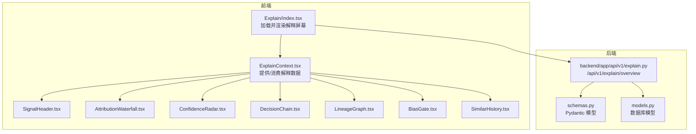
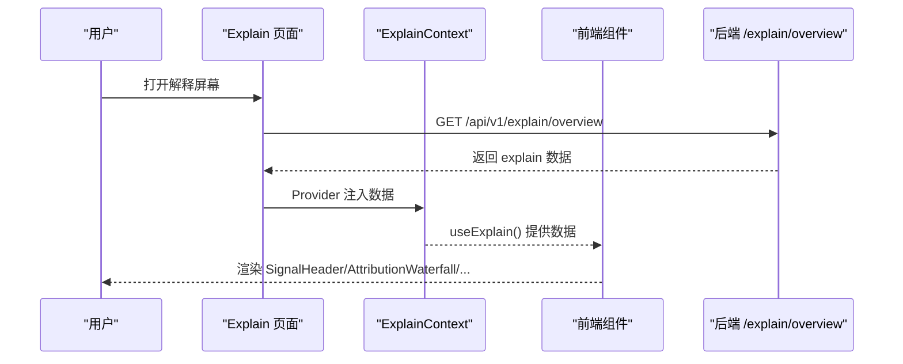
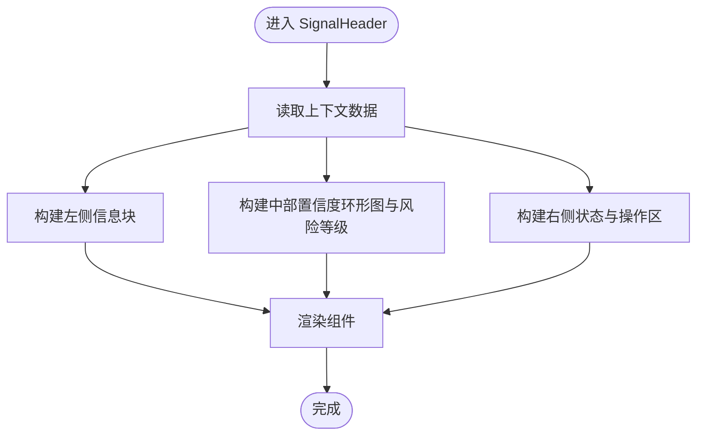
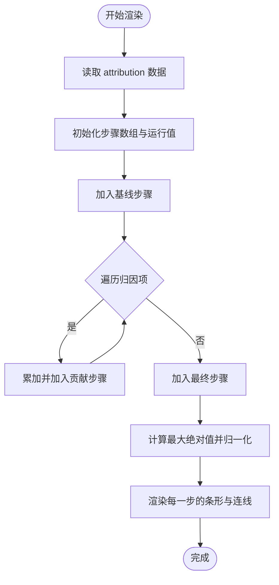
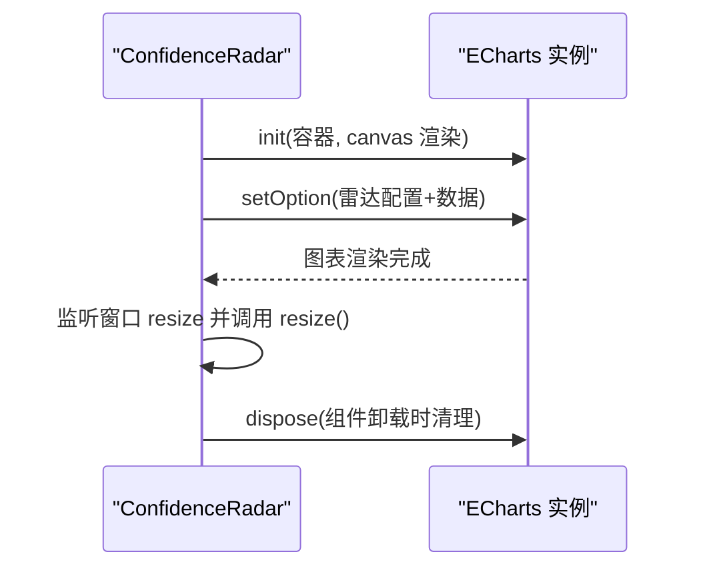
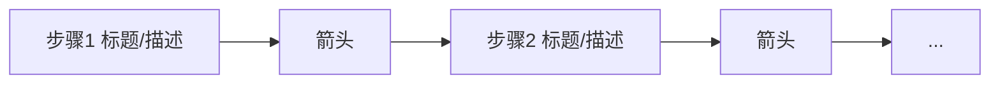
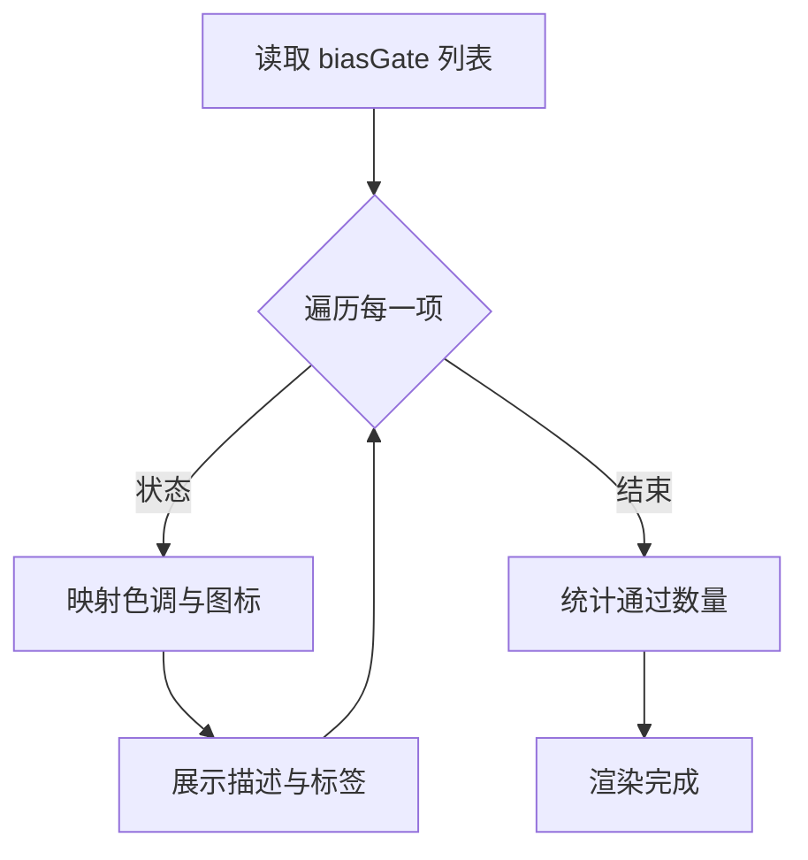
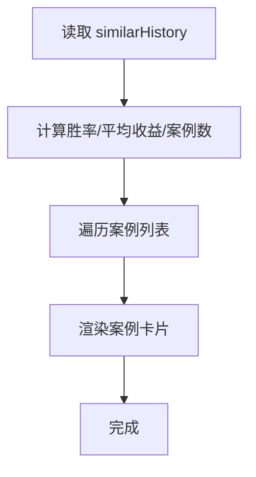
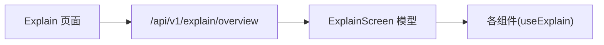

# 解释屏幕

<cite>
**本文引用的文件**
- [frontend/src/screens/Explain/index.tsx](file://frontend/src/screens/Explain/index.tsx)
- [frontend/src/screens/Explain/SignalHeader.tsx](file://frontend/src/screens/Explain/SignalHeader.tsx)
- [frontend/src/screens/Explain/AttributionWaterfall.tsx](file://frontend/src/screens/Explain/AttributionWaterfall.tsx)
- [frontend/src/screens/Explain/ConfidenceRadar.tsx](file://frontend/src/screens/Explain/ConfidenceRadar.tsx)
- [frontend/src/screens/Explain/DecisionChain.tsx](file://frontend/src/screens/Explain/DecisionChain.tsx)
- [frontend/src/screens/Explain/LineageGraph.tsx](file://frontend/src/screens/Explain/LineageGraph.tsx)
- [frontend/src/screens/Explain/BiasGate.tsx](file://frontend/src/screens/Explain/BiasGate.tsx)
- [frontend/src/screens/Explain/SimilarHistory.tsx](file://frontend/src/screens/Explain/SimilarHistory.tsx)
- [frontend/src/contexts/ExplainContext.tsx](file://frontend/src/contexts/ExplainContext.tsx)
- [frontend/src/data/types.ts](file://frontend/src/data/types.ts)
- [frontend/src/lib/api.ts](file://frontend/src/lib/api.ts)
- [backend/app/api/v1/explain.py](file://backend/app/api/v1/explain.py)
- [backend/app/domains/explain/schemas.py](file://backend/app/domains/explain/schemas.py)
- [backend/app/domains/explain/models.py](file://backend/app/domains/explain/models.py)
</cite>

## 目录
1. [简介](#简介)
2. [项目结构](#项目结构)
3. [核心组件](#核心组件)
4. [架构总览](#架构总览)
5. [详细组件分析](#详细组件分析)
6. [依赖分析](#依赖分析)
7. [性能考量](#性能考量)
8. [故障排查指南](#故障排查指南)
9. [结论](#结论)

## 简介
本文件面向 llmine-quant 的“解释屏幕”，系统化梳理可解释性分析界面的前端架构与交互设计，覆盖以下关键模块：
- 决策概览：SignalHeader 展示信号动作、目标、置信度、风险等级与追踪号等关键元信息
- 归因瀑布：AttributionWaterfall 将信号得分从基线到最终决策的各因子贡献可视化
- 决策链：DecisionChain 追溯从策略扫描到人工审批的关键步骤与判断依据
- 血缘图：LineageGraph 追踪数据从原始到订单的全链路权限与版本信息
- 偏差闸门：BiasGate 检测未来函数、幸存者偏差、数据窥探与回测偏差等风险
- 相似历史：SimilarHistory 提供历史相似信号的胜率、平均收益与案例卡片
- 置信度雷达：ConfidenceRadar 以四象限雷达图综合评估数据、历史、执行与风险维度的可信度

本说明同时解释前端可视化实现与用户理解优化的设计考虑，并给出后端数据模型与接口定义的映射。

## 项目结构
解释屏幕位于前端 screens/Explain 目录下，采用上下文提供者模式注入解释数据，各组件通过自定义 Hook 使用上下文中的 explain 数据。后端提供统一的解释概览接口，返回包含上述所有模块的数据结构。

图表来源
- [frontend/src/screens/Explain/index.tsx:1-47](file://frontend/src/screens/Explain/index.tsx#L1-L47)
- [frontend/src/contexts/ExplainContext.tsx:1-13](file://frontend/src/contexts/ExplainContext.tsx#L1-L13)
- [frontend/src/lib/api.ts:689-691](file://frontend/src/lib/api.ts#L689-L691)
- [backend/app/api/v1/explain.py:98-110](file://backend/app/api/v1/explain.py#L98-L110)
- [backend/app/domains/explain/schemas.py:85-93](file://backend/app/domains/explain/schemas.py#L85-L93)
- [backend/app/domains/explain/models.py:9-87](file://backend/app/domains/explain/models.py#L9-L87)

章节来源
- [frontend/src/screens/Explain/index.tsx:1-47](file://frontend/src/screens/Explain/index.tsx#L1-L47)
- [frontend/src/contexts/ExplainContext.tsx:1-13](file://frontend/src/contexts/ExplainContext.tsx#L1-L13)
- [frontend/src/lib/api.ts:689-691](file://frontend/src/lib/api.ts#L689-L691)
- [backend/app/api/v1/explain.py:98-110](file://backend/app/api/v1/explain.py#L98-L110)

## 核心组件
- SignalHeader：展示动作、目标、置信度环形图、风险等级、追踪号与状态标签，并提供批准与导出按钮
- AttributionWaterfall：将归因项按正负向堆叠，显示从基线到最终得分的变化路径
- ConfidenceRadar：基于 ECharts 的雷达图，展示数据、历史、执行、风险等维度的可信度与综合评分
- DecisionChain：以带箭头的流程单元格展示决策步骤，标注阶段标签与状态色调
- LineageGraph：展示数据血缘节点与权限流转，提供版本与哈希信息
- BiasGate：列举偏差检测项的状态与描述，支持“通过/观察/失败/强制”四种状态
- SimilarHistory：统计相似历史的胜率与平均收益，并以卡片形式呈现具体案例

章节来源
- [frontend/src/screens/Explain/SignalHeader.tsx:1-75](file://frontend/src/screens/Explain/SignalHeader.tsx#L1-L75)
- [frontend/src/screens/Explain/AttributionWaterfall.tsx:1-87](file://frontend/src/screens/Explain/AttributionWaterfall.tsx#L1-L87)
- [frontend/src/screens/Explain/ConfidenceRadar.tsx:1-115](file://frontend/src/screens/Explain/ConfidenceRadar.tsx#L1-L115)
- [frontend/src/screens/Explain/DecisionChain.tsx:1-43](file://frontend/src/screens/Explain/DecisionChain.tsx#L1-L43)
- [frontend/src/screens/Explain/LineageGraph.tsx:1-43](file://frontend/src/screens/Explain/LineageGraph.tsx#L1-L43)
- [frontend/src/screens/Explain/BiasGate.tsx:1-51](file://frontend/src/screens/Explain/BiasGate.tsx#L1-L51)
- [frontend/src/screens/Explain/SimilarHistory.tsx:1-55](file://frontend/src/screens/Explain/SimilarHistory.tsx#L1-L55)

## 架构总览
解释屏幕采用“页面容器 + 上下文 + 多视图组件”的分层架构：
- 页面容器负责数据拉取与布局排版
- 上下文提供统一的数据入口，避免跨层级 props 传递
- 各组件专注单一职责，通过上下文读取所需字段
- 后端提供统一的解释概览接口，返回前端类型定义一致的数据结构

图表来源
- [frontend/src/screens/Explain/index.tsx:18-46](file://frontend/src/screens/Explain/index.tsx#L18-L46)
- [frontend/src/contexts/ExplainContext.tsx:8-12](file://frontend/src/contexts/ExplainContext.tsx#L8-L12)
- [frontend/src/lib/api.ts:689-691](file://frontend/src/lib/api.ts#L689-L691)
- [backend/app/api/v1/explain.py:98-110](file://backend/app/api/v1/explain.py#L98-L110)

## 详细组件分析

### SignalHeader 分析
- 设计要点
  - 左侧：动作标签（正负中性）、目标与策略、数量、时间戳
  - 中部：置信度环形图（SVG 虚拟描边）、风险等级、追踪号
  - 右侧：状态标签（含点状指示）、批准与导出按钮
- 用户理解优化
  - 动作与置信度直观传达决策倾向与强度
  - 风险等级帮助快速识别潜在风险
  - 追踪号便于审计与问题定位
- 数据来源
  - 来自上下文中的 signalHeader 字段

图表来源
- [frontend/src/screens/Explain/SignalHeader.tsx:7-74](file://frontend/src/screens/Explain/SignalHeader.tsx#L7-L74)
- [frontend/src/contexts/ExplainContext.tsx:8-12](file://frontend/src/contexts/ExplainContext.tsx#L8-L12)

章节来源
- [frontend/src/screens/Explain/SignalHeader.tsx:1-75](file://frontend/src/screens/Explain/SignalHeader.tsx#L1-L75)
- [frontend/src/data/types.ts:126-138](file://frontend/src/data/types.ts#L126-L138)

### AttributionWaterfall 分析
- 设计要点
  - 以瀑布图展示从基线到最终得分的累积变化
  - 正负贡献分别用不同色调标识
  - 每一步附带简要描述，便于理解贡献来源
- 算法实现
  - 计算每一步的 from/to 值，确定左右位置与宽度
  - 通过最大绝对值归一化，保证坐标系稳定
- 用户理解优化
  - 通过“基线 → 因子贡献 → 最终决策”的路径，帮助用户理解得分构成
  - 描述文本提供因果解释，降低认知负担

图表来源
- [frontend/src/screens/Explain/AttributionWaterfall.tsx:8-27](file://frontend/src/screens/Explain/AttributionWaterfall.tsx#L8-L27)

章节来源
- [frontend/src/screens/Explain/AttributionWaterfall.tsx:1-87](file://frontend/src/screens/Explain/AttributionWaterfall.tsx#L1-L87)
- [frontend/src/data/types.ts:139-145](file://frontend/src/data/types.ts#L139-L145)

### ConfidenceRadar 分析
- 设计要点
  - 使用 ECharts 雷达图展示多个维度的评分
  - 综合评分与各轴数值并列展示
  - 每个轴根据阈值给出绿/黄/红等级
- 实现细节
  - 初始化时绑定容器与窗口 resize 事件
  - 根据 axes 构造雷达指标，设置渐变色与透明填充
- 用户理解优化
  - 雷达图直观体现“强项与薄弱环节”
  - 综合评分与轴级评分形成“全局与局部”的双重视角

图表来源
- [frontend/src/screens/Explain/ConfidenceRadar.tsx:11-80](file://frontend/src/screens/Explain/ConfidenceRadar.tsx#L11-L80)

章节来源
- [frontend/src/screens/Explain/ConfidenceRadar.tsx:1-115](file://frontend/src/screens/Explain/ConfidenceRadar.tsx#L1-L115)
- [frontend/src/data/types.ts:146-149](file://frontend/src/data/types.ts#L146-L149)

### DecisionChain 分析
- 设计要点
  - 以带箭头的流程单元格展示决策步骤
  - 每步包含序号、标签、标题、描述与详情
  - 状态色调区分不同阶段（如策略、模型、风控、组合、人工）
- 用户理解优化
  - “触发 → 风控 → 负面 → 最终动作”的路径帮助用户理解决策链条
  - 标签与描述提供上下文，便于非技术用户理解

图表来源
- [frontend/src/screens/Explain/DecisionChain.tsx:14-38](file://frontend/src/screens/Explain/DecisionChain.tsx#L14-L38)

章节来源
- [frontend/src/screens/Explain/DecisionChain.tsx:1-43](file://frontend/src/screens/Explain/DecisionChain.tsx#L1-L43)
- [frontend/src/data/types.ts:150-157](file://frontend/src/data/types.ts#L150-L157)

### LineageGraph 分析
- 设计要点
  - 展示从原始数据到订单的全链路节点
  - 每个节点包含步骤、版本、哈希、权限与详情
  - 提供图例说明权限状态（Live/HITL/Research）
- 用户理解优化
  - 血缘可视化帮助用户追溯数据来源与变更轨迹
  - 版本与哈希便于审计与回滚定位

图表来源
- [frontend/src/screens/Explain/LineageGraph.tsx:19-38](file://frontend/src/screens/Explain/LineageGraph.tsx#L19-L38)

章节来源
- [frontend/src/screens/Explain/LineageGraph.tsx:1-43](file://frontend/src/screens/Explain/LineageGraph.tsx#L1-L43)
- [frontend/src/data/types.ts:158-165](file://frontend/src/data/types.ts#L158-L165)

### BiasGate 分析
- 设计要点
  - 列表展示多项偏差检测项及其状态与描述
  - 状态映射到不同色调与图标，便于快速识别
  - 提供总体通过统计
- 用户理解优化
  - 将复杂的风险检测简化为直观的列表与颜色
  - 通过“通过/观察/失败/强制”明确处置建议

图表来源
- [frontend/src/screens/Explain/BiasGate.tsx:17-49](file://frontend/src/screens/Explain/BiasGate.tsx#L17-L49)

章节来源
- [frontend/src/screens/Explain/BiasGate.tsx:1-51](file://frontend/src/screens/Explain/BiasGate.tsx#L1-L51)
- [frontend/src/data/types.ts:166-170](file://frontend/src/data/types.ts#L166-L170)

### SimilarHistory 分析
- 设计要点
  - 统计相似历史的胜率、平均收益与案例数量
  - 案例网格以卡片形式展示日期、动作、持有期与收益
  - 成功/失败卡片区分颜色
- 用户理解优化
  - 通过历史数据增强对当前信号的信心或警示
  - 案例卡片提供具体情境，便于类比推理

图表来源
- [frontend/src/screens/Explain/SimilarHistory.tsx:3-53](file://frontend/src/screens/Explain/SimilarHistory.tsx#L3-L53)

章节来源
- [frontend/src/screens/Explain/SimilarHistory.tsx:1-55](file://frontend/src/screens/Explain/SimilarHistory.tsx#L1-L55)
- [frontend/src/data/types.ts:171-185](file://frontend/src/data/types.ts#L171-L185)

## 依赖分析
- 前端依赖
  - Explain 页面通过 api.explain.overview() 获取数据，使用 ExplainContext 提供给子组件
  - 各组件通过 useExplain() 读取对应模块数据
- 后端依赖
  - /api/v1/explain/overview 返回 ExplainScreen 结构，包含所有解释模块
  - Pydantic 模型与数据库模型定义了数据结构与持久化字段

图表来源
- [frontend/src/lib/api.ts:689-691](file://frontend/src/lib/api.ts#L689-L691)
- [backend/app/api/v1/explain.py:98-110](file://backend/app/api/v1/explain.py#L98-L110)
- [backend/app/domains/explain/schemas.py:85-93](file://backend/app/domains/explain/schemas.py#L85-L93)

章节来源
- [frontend/src/lib/api.ts:689-691](file://frontend/src/lib/api.ts#L689-L691)
- [backend/app/api/v1/explain.py:98-110](file://backend/app/api/v1/explain.py#L98-L110)
- [backend/app/domains/explain/schemas.py:85-93](file://backend/app/domains/explain/schemas.py#L85-L93)

## 性能考量
- 渲染性能
  - 归因瀑布与雷达图均采用一次性计算与渲染，避免频繁重排
  - 雷达图在窗口 resize 时仅触发 resize，卸载时主动释放实例
- 数据获取
  - 页面首次挂载时仅一次请求解释概览数据，后续通过上下文共享
- 可访问性
  - 使用语义化标签与清晰的视觉层次，确保不同背景用户可理解

## 故障排查指南
- 常见问题
  - 数据为空：确认 api.explain.overview() 请求成功，检查网络与鉴权头
  - 图表不显示：确认容器存在且 ECharts 实例已初始化；检查 resize 事件绑定
  - 状态异常：核对后端 ExplainScreen 字段是否完整，前端类型定义是否匹配
- 排查步骤
  - 打开浏览器开发者工具，查看 /api/v1/explain/overview 的响应体
  - 在 Explain 页面断点，确认 ExplainProvider 是否正确注入数据
  - 对照后端 schemas.py 与前端 types.ts 的字段定义，确保一一对应

章节来源
- [frontend/src/lib/api.ts:32-43](file://frontend/src/lib/api.ts#L32-L43)
- [frontend/src/screens/Explain/ConfidenceRadar.tsx:11-22](file://frontend/src/screens/Explain/ConfidenceRadar.tsx#L11-L22)
- [backend/app/domains/explain/schemas.py:85-93](file://backend/app/domains/explain/schemas.py#L85-L93)
- [frontend/src/data/types.ts:126-185](file://frontend/src/data/types.ts#L126-L185)

## 结论
解释屏幕通过模块化的组件设计与清晰的数据流，将复杂的可解释性信息转化为直观易懂的可视化界面。SignalHeader、AttributionWaterfall、ConfidenceRadar、DecisionChain、LineageGraph、BiasGate 与 SimilarHistory 各司其职，共同构成完整的解释与审计闭环。前后端通过统一的 ExplainScreen 结构与类型定义保持一致性，既满足专业用户的深度分析需求，也兼顾非技术用户的理解成本。