# 风险屏幕

<cite>
**本文档引用的文件**
- [frontend/src/screens/Risk/index.tsx](file://frontend/src/screens/Risk/index.tsx)
- [frontend/src/screens/Risk/RiskHeader.tsx](file://frontend/src/screens/Risk/RiskHeader.tsx)
- [frontend/src/screens/Risk/VaRPanel.tsx](file://frontend/src/screens/Risk/VaRPanel.tsx)
- [frontend/src/screens/Risk/BreachHistory.tsx](file://frontend/src/screens/Risk/BreachHistory.tsx)
- [frontend/src/screens/Risk/CircuitBreakerPanel.tsx](file://frontend/src/screens/Risk/CircuitBreakerPanel.tsx)
- [frontend/src/screens/Risk/RiskBudgetMatrix.tsx](file://frontend/src/screens/Risk/RiskBudgetMatrix.tsx)
- [frontend/src/screens/Risk/PolicyStream.tsx](file://frontend/src/screens/Risk/PolicyStream.tsx)
- [frontend/src/contexts/RiskContext.tsx](file://frontend/src/contexts/RiskContext.tsx)
- [frontend/src/data/types.ts](file://frontend/src/data/types.ts)
- [frontend/src/lib/api.ts](file://frontend/src/lib/api.ts)
- [backend/app/api/v1/risk.py](file://backend/app/api/v1/risk.py)
- [frontend/src/styles/prototype.css](file://frontend/src/styles/prototype.css)
- [frontend/src/components/GlassCard.tsx](file://frontend/src/components/GlassCard.tsx)
</cite>

## 目录
1. [简介](#简介)
2. [项目结构](#项目结构)
3. [核心组件](#核心组件)
4. [架构概览](#架构概览)
5. [详细组件分析](#详细组件分析)
6. [依赖关系分析](#依赖关系分析)
7. [性能考虑](#性能考虑)
8. [故障排除指南](#故障排除指南)
9. [结论](#结论)

## 简介

llmine-quant 风控屏幕是一个全面的风险管理可视化界面，为量化交易系统提供实时风险监控和控制功能。该系统采用前后端分离架构，前端使用 React 和 TypeScript 构建，后端基于 FastAPI 提供 RESTful API。

风险屏幕的核心功能包括：
- 风险头部概览：实时健康状态监控
- VaR 风险价值计算：历史回测和预测分析
- 违规历史追踪：完整的审计日志
- 熔断器保护机制：分级熔断控制
- 风险预算矩阵：限额分配和监控
- 策略流实时监控：决策引擎跟踪

## 项目结构

风险屏幕位于前端项目的 `screens/Risk` 目录下，采用模块化设计：

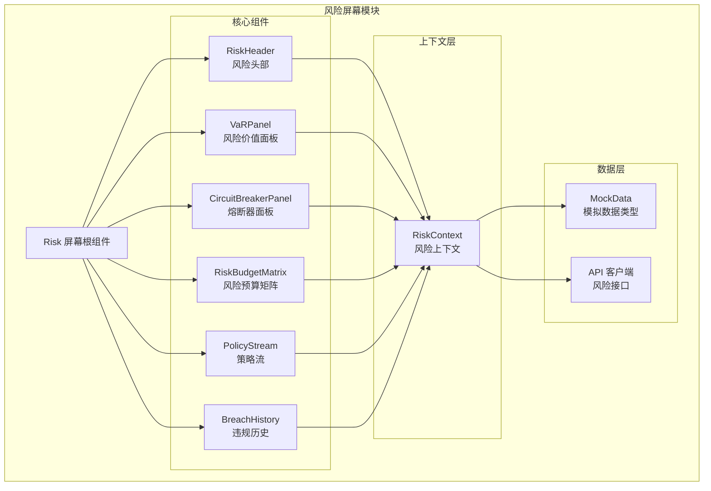

**图表来源**
- [frontend/src/screens/Risk/index.tsx:1-45](file://frontend/src/screens/Risk/index.tsx#L1-L45)
- [frontend/src/contexts/RiskContext.tsx:1-13](file://frontend/src/contexts/RiskContext.tsx#L1-L13)

**章节来源**
- [frontend/src/screens/Risk/index.tsx:1-45](file://frontend/src/screens/Risk/index.tsx#L1-L45)
- [frontend/src/contexts/RiskContext.tsx:1-13](file://frontend/src/contexts/RiskContext.tsx#L1-L13)

## 核心组件

### 风控屏幕根组件

Risk 屏幕根组件负责整体布局和数据加载，采用 React Hooks 管理状态和生命周期。

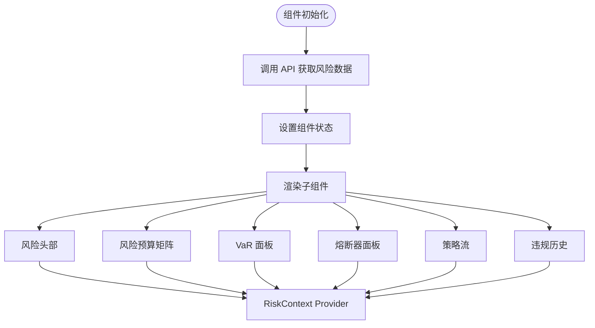

**图表来源**
- [frontend/src/screens/Risk/index.tsx:17-44](file://frontend/src/screens/Risk/index.tsx#L17-L44)

### 风险上下文系统

RiskContext 提供全局状态管理，确保所有风险组件能够访问统一的数据源。

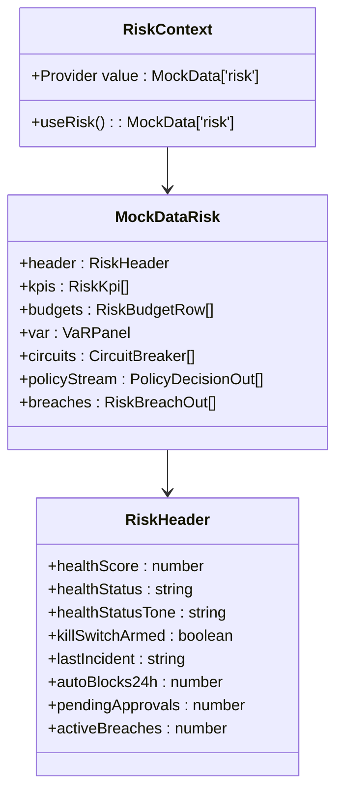

**图表来源**
- [frontend/src/contexts/RiskContext.tsx:1-13](file://frontend/src/contexts/RiskContext.tsx#L1-L13)
- [frontend/src/data/types.ts:317-386](file://frontend/src/data/types.ts#L317-L386)

**章节来源**
- [frontend/src/contexts/RiskContext.tsx:1-13](file://frontend/src/contexts/RiskContext.tsx#L1-L13)
- [frontend/src/data/types.ts:317-386](file://frontend/src/data/types.ts#L317-L386)

## 架构概览

风险屏幕采用分层架构设计，确保关注点分离和代码可维护性：

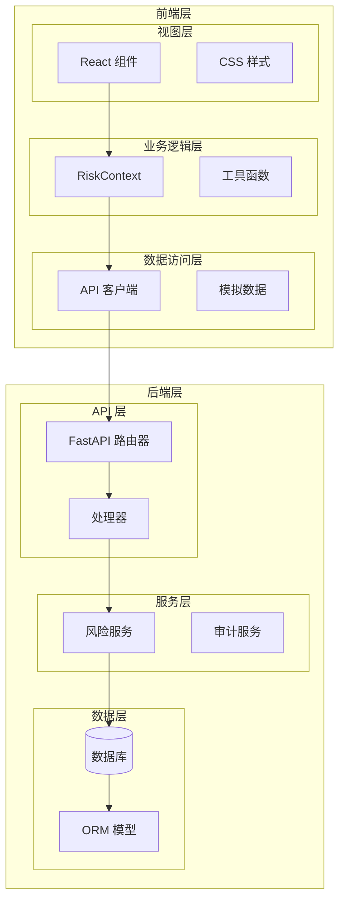

**图表来源**
- [frontend/src/lib/api.ts:528-725](file://frontend/src/lib/api.ts#L528-L725)
- [backend/app/api/v1/risk.py:28-207](file://backend/app/api/v1/risk.py#L28-L207)

### 数据流架构

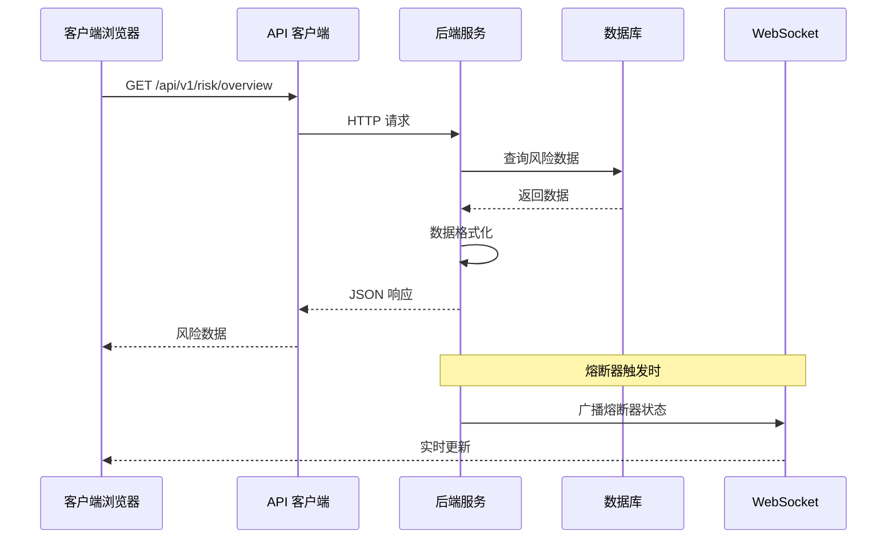

**图表来源**
- [frontend/src/lib/api.ts:713-725](file://frontend/src/lib/api.ts#L713-L725)
- [backend/app/api/v1/risk.py:188-207](file://backend/app/api/v1/risk.py#L188-L207)

**章节来源**
- [frontend/src/lib/api.ts:528-725](file://frontend/src/lib/api.ts#L528-L725)
- [backend/app/api/v1/risk.py:188-273](file://backend/app/api/v1/risk.py#L188-L273)

## 详细组件分析

### 风险头部 (RiskHeader)

RiskHeader 组件提供风险状态的全局概览，包含健康评分仪表盘和关键指标。

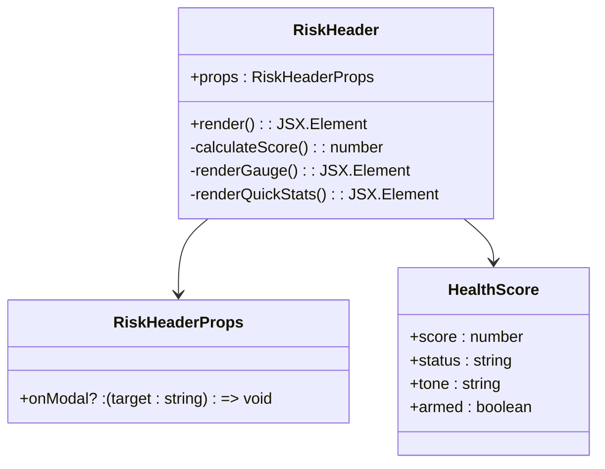

**图表来源**
- [frontend/src/screens/Risk/RiskHeader.tsx:1-112](file://frontend/src/screens/Risk/RiskHeader.tsx#L1-L112)

#### 仪表盘实现细节

组件使用 SVG 创建圆形仪表盘，支持动态颜色渐变和动画效果：

- **健康评分仪表盘**：基于 0-100 分的评分系统
- **状态指示器**：绿色(健康)、黄色(警告)、红色(危险)
- **熔断开关**：全局熔断状态显示
- **快速统计**：24小时拦截次数、待审批数量、活跃违规

**章节来源**
- [frontend/src/screens/Risk/RiskHeader.tsx:1-112](file://frontend/src/screens/Risk/RiskHeader.tsx#L1-L112)

### VaR 面板 (VaRPanel)

VaRPanel 实现风险价值计算和历史趋势分析，提供策略级风险分解。

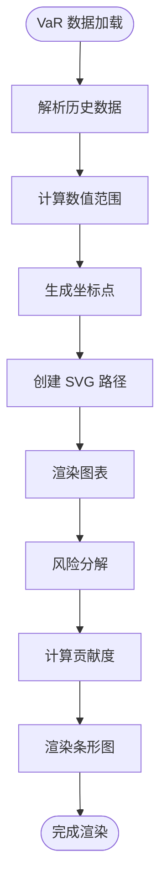

**图表来源**
- [frontend/src/screens/Risk/VaRPanel.tsx:1-120](file://frontend/src/screens/Risk/VaRPanel.tsx#L1-L120)

#### VaR 计算算法

VaR 面板采用历史模拟法计算风险价值：

1. **数据准备**：收集 30 天历史 VaR 数据
2. **统计分析**：计算峰值、均值和标准差
3. **可视化**：绘制面积图和趋势线
4. **策略分解**：按策略维度分析风险贡献

**章节来源**
- [frontend/src/screens/Risk/VaRPanel.tsx:1-120](file://frontend/src/screens/Risk/VaRPanel.tsx#L1-L120)

### 熔断器面板 (CircuitBreakerPanel)

熔断器面板实现四级熔断机制，提供实时状态监控和手动控制功能。

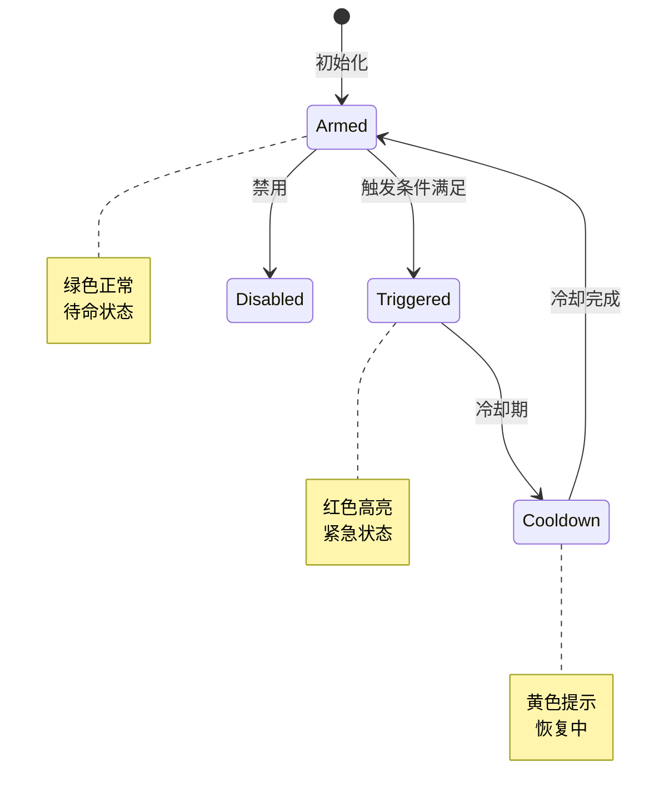

**图表来源**
- [frontend/src/screens/Risk/CircuitBreakerPanel.tsx:1-88](file://frontend/src/screens/Risk/CircuitBreakerPanel.tsx#L1-L88)

#### 熔断器状态管理

熔断器系统包含四个级别：

- **L1**: 预警级别 - 风险指标接近阈值
- **L2**: 警告级别 - 风险指标超过阈值
- **L3**: 部分熔断 - 自动限制部分交易活动
- **L4**: 全局熔断 - 完全停止新交易

**章节来源**
- [frontend/src/screens/Risk/CircuitBreakerPanel.tsx:1-88](file://frontend/src/screens/Risk/CircuitBreakerPanel.tsx#L1-L88)

### 风险预算矩阵 (RiskBudgetMatrix)

风险预算矩阵提供限额分配和使用情况监控，支持 8 项风险指标的实时跟踪。

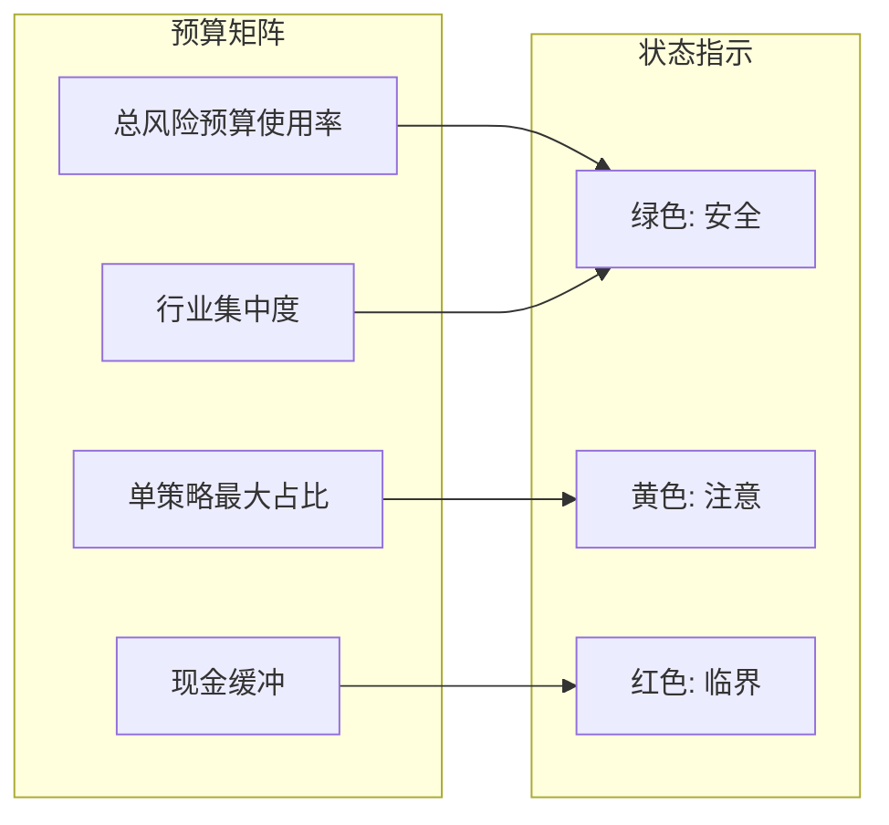

**图表来源**
- [frontend/src/screens/Risk/RiskBudgetMatrix.tsx:1-56](file://frontend/src/screens/Risk/RiskBudgetMatrix.tsx#L1-L56)

#### 预算监控机制

每个预算项包含以下信息：
- **使用率**: 当前使用量与限额的比率
- **状态色调**: 基于使用率的颜色编码
- **剩余缓冲**: 距离限额的安全距离
- **描述信息**: 风险状况的详细说明

**章节来源**
- [frontend/src/screens/Risk/RiskBudgetMatrix.tsx:1-56](file://frontend/src/screens/Risk/RiskBudgetMatrix.tsx#L1-L56)

### 策略流 (PolicyStream)

策略流组件实时监控决策引擎的执行情况，提供 10 笔最新决策的详细信息。

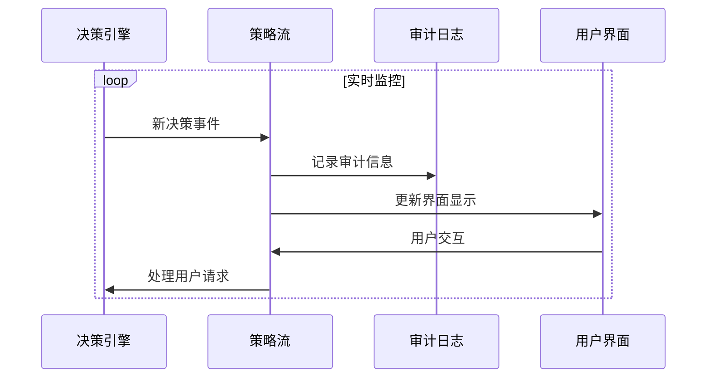

**图表来源**
- [frontend/src/screens/Risk/PolicyStream.tsx:1-70](file://frontend/src/screens/Risk/PolicyStream.tsx#L1-L70)

#### 决策跟踪功能

策略流包含以下关键信息：
- **决策类型**: 允许、拒绝、需要审批、修改
- **执行时间**: 决策耗时统计
- **策略名称**: 触发决策的具体策略
- **原因说明**: 决策依据和逻辑
- **状态统计**: 实时决策类型分布

**章节来源**
- [frontend/src/screens/Risk/PolicyStream.tsx:1-70](file://frontend/src/screens/Risk/PolicyStream.tsx#L1-L70)

### 违规历史 (BreachHistory)

违规历史组件提供完整的审计追踪，记录所有风险违规事件的状态变化。

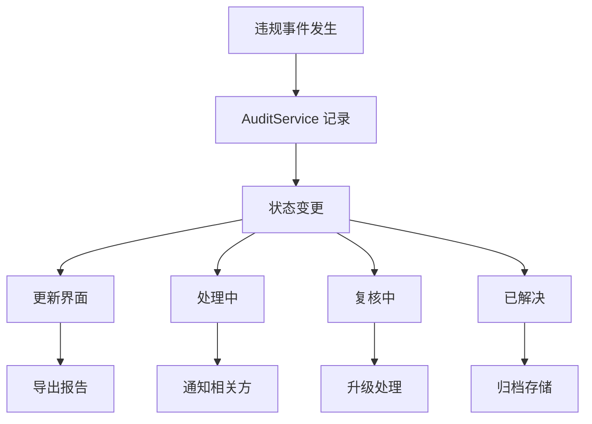

**图表来源**
- [frontend/src/screens/Risk/BreachHistory.tsx:1-66](file://frontend/src/screens/Risk/BreachHistory.tsx#L1-L66)

#### 审计追踪特性

违规历史包含：
- **事件详情**: 时间、严重程度、标题、详细描述
- **处理状态**: 解决、处理中、复核中
- **响应措施**: 解决方案和后续步骤
- **统计信息**: 7 天内违规总数和状态分布

**章节来源**
- [frontend/src/screens/Risk/BreachHistory.tsx:1-66](file://frontend/src/screens/Risk/BreachHistory.tsx#L1-L66)

## 依赖关系分析

风险屏幕组件之间的依赖关系清晰明确，遵循单一职责原则：

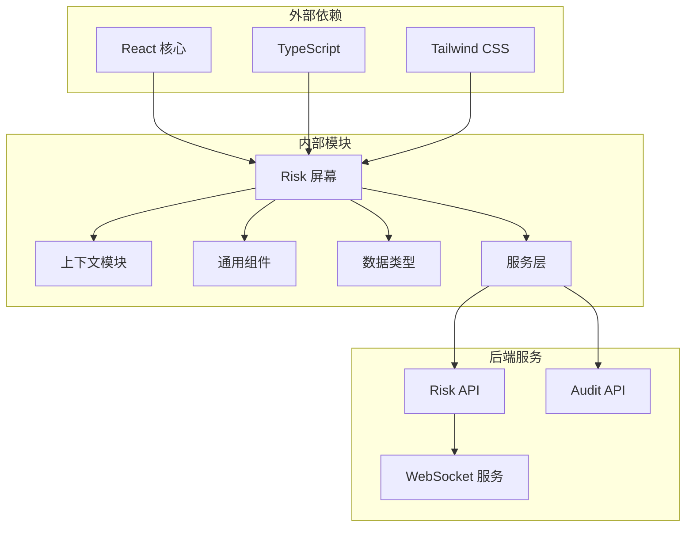

**图表来源**
- [frontend/src/screens/Risk/index.tsx:1-10](file://frontend/src/screens/Risk/index.tsx#L1-L10)
- [frontend/src/lib/api.ts:528-725](file://frontend/src/lib/api.ts#L528-L725)

### 组件间通信模式

风险屏幕采用多种通信模式确保数据流畅通：

1. **上下文传递**: 通过 RiskContext 提供全局状态
2. **属性传递**: 父组件向子组件传递数据和回调函数
3. **事件驱动**: 用户交互触发状态更新
4. **API 调用**: 异步数据获取和更新

**章节来源**
- [frontend/src/screens/Risk/index.tsx:1-45](file://frontend/src/screens/Risk/index.tsx#L1-L45)
- [frontend/src/contexts/RiskContext.tsx:1-13](file://frontend/src/contexts/RiskContext.tsx#L1-L13)

## 性能考虑

### 渲染优化

风险屏幕实现了多项性能优化措施：

- **虚拟滚动**: 对长列表使用虚拟滚动技术
- **懒加载**: 图表和复杂组件按需加载
- **缓存策略**: API 响应结果缓存
- **防抖处理**: 频繁更新的操作进行防抖

### 数据处理优化

- **增量更新**: 仅更新发生变化的数据区域
- **批量操作**: 多个状态更新合并执行
- **内存管理**: 及时清理不再使用的数据引用
- **计算优化**: 复杂计算使用 Web Workers

### 网络性能

- **请求合并**: 相关 API 请求合并执行
- **错误重试**: 网络错误自动重试机制
- **超时控制**: 合理的请求超时设置
- **离线支持**: 基础功能离线可用

## 故障排除指南

### 常见问题诊断

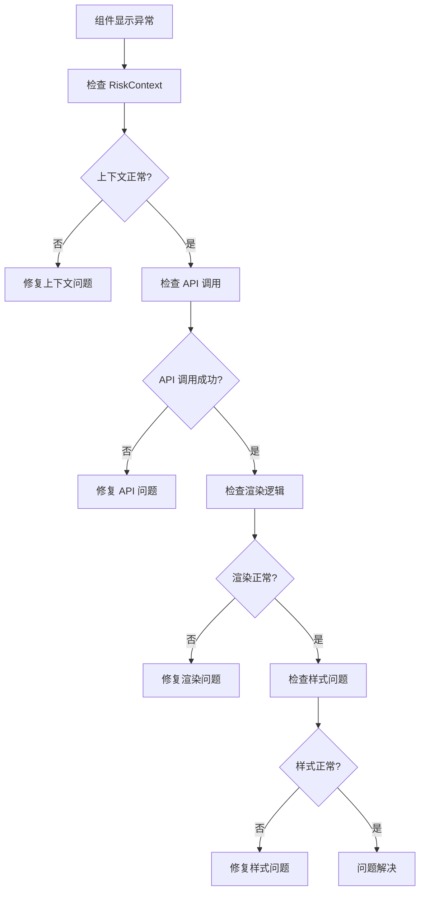

### 错误处理机制

风险屏幕包含完善的错误处理：

- **网络错误**: 自动重试和用户提示
- **数据错误**: 数据验证和降级处理
- **渲染错误**: 错误边界捕获和恢复
- **状态错误**: 状态同步和一致性保证

**章节来源**
- [frontend/src/lib/api.ts:32-57](file://frontend/src/lib/api.ts#L32-L57)
- [backend/app/api/v1/risk.py:210-273](file://backend/app/api/v1/risk.py#L210-L273)

## 结论

llmine-quant 风控屏幕是一个设计精良、功能完备的风险管理可视化系统。其主要特点包括：

### 技术优势

- **模块化设计**: 清晰的组件层次和职责分离
- **实时监控**: 全面的风险指标实时更新
- **可视化丰富**: 多种图表和仪表盘展示方式
- **用户体验**: 响应式设计和直观的操作界面

### 功能完整性

- **风险监控**: 从宏观到微观的全方位风险覆盖
- **控制机制**: 多层级的熔断和限额控制系统
- **审计追踪**: 完整的合规性记录和报告
- **实时反馈**: 即时的决策和状态更新

### 扩展性考虑

系统设计充分考虑了未来的扩展需求：
- **插件架构**: 易于添加新的风险指标和控制机制
- **配置驱动**: 通过配置文件调整风险参数和阈值
- **API 兼容**: 标准化的接口设计便于集成第三方服务

风险屏幕为量化交易系统提供了强大的风险管理基础设施，既满足了当前的需求，也为未来的发展奠定了坚实的基础。