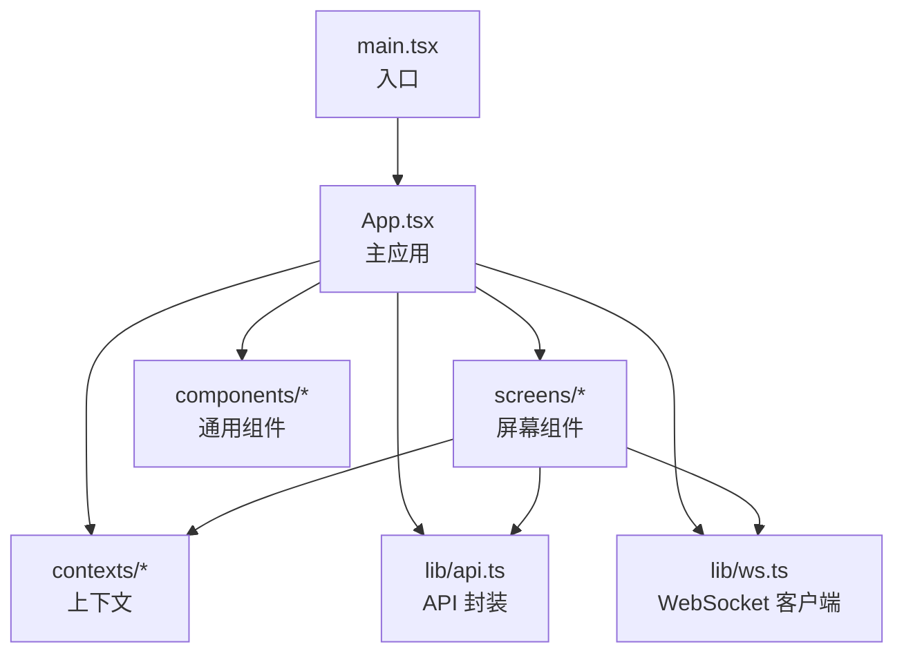
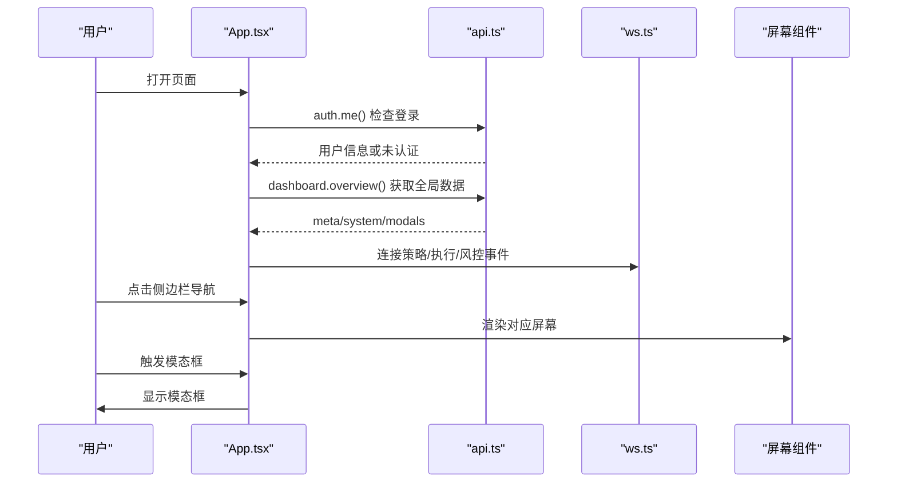
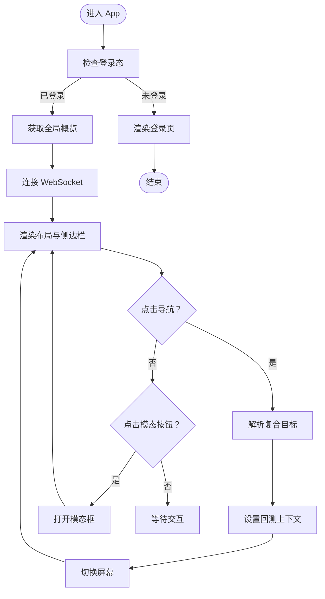
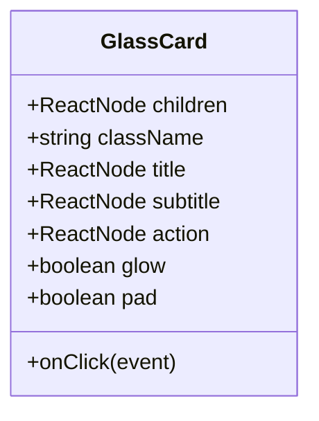
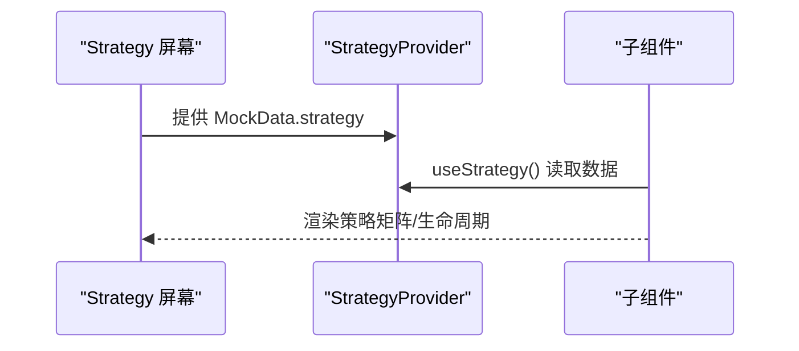
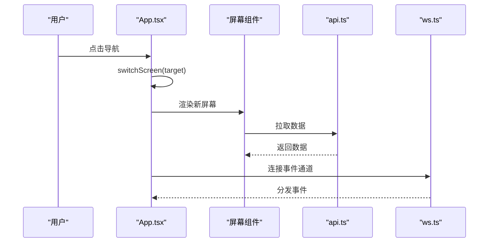
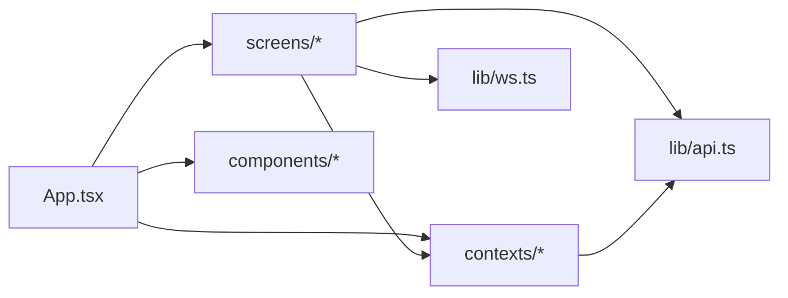

# 组件架构设计

<cite>
**本文引用的文件**
- [frontend/src/App.tsx](file://frontend/src/App.tsx)
- [frontend/src/main.tsx](file://frontend/src/main.tsx)
- [frontend/src/components/GlassCard.tsx](file://frontend/src/components/GlassCard.tsx)
- [frontend/src/contexts/StrategyContext.tsx](file://frontend/src/contexts/StrategyContext.tsx)
- [frontend/src/contexts/BacktestContext.tsx](file://frontend/src/contexts/BacktestContext.tsx)
- [frontend/src/lib/api.ts](file://frontend/src/lib/api.ts)
- [frontend/src/lib/ws.ts](file://frontend/src/lib/ws.ts)
- [frontend/src/screens/Dashboard/index.tsx](file://frontend/src/screens/Dashboard/index.tsx)
- [frontend/src/screens/Strategy/index.tsx](file://frontend/src/screens/Strategy/index.tsx)
- [frontend/src/screens/Backtest/index.tsx](file://frontend/src/screens/Backtest/index.tsx)
- [frontend/src/data/types.ts](file://frontend/src/data/types.ts)
- [frontend/src/styles/prototype.css](file://frontend/src/styles/prototype.css)
</cite>

## 目录
1. [简介](#简介)
2. [项目结构](#项目结构)
3. [核心组件](#核心组件)
4. [架构总览](#架构总览)
5. [详细组件分析](#详细组件分析)
6. [依赖关系分析](#依赖关系分析)
7. [性能考量](#性能考量)
8. [故障排查指南](#故障排查指南)
9. [结论](#结论)
10. [附录](#附录)

## 简介
本设计文档面向 llmine-quant 前端 React 19 应用，聚焦于组件层次结构、屏幕组件组织方式与通用组件设计模式。重点阐述主应用组件 App.tsx 如何统一管理导航、模态框与侧边栏状态，并对各屏幕组件（如 Dashboard、Strategy、Backtest 等）进行职责划分；同时解释 GlassCard 等通用组件的设计理念与复用策略，梳理组件间通信机制、Props 传递模式与事件处理流程，并给出最佳实践与参考路径，帮助开发者遵循统一的设计规范。

## 项目结构
前端采用“屏幕级功能域 + 通用组件 + 上下文”的分层组织方式：
- 入口：main.tsx 渲染根组件 App.tsx
- 主应用：App.tsx 负责全局状态、导航、模态框与侧边栏管理
- 屏幕组件：按业务域划分至 screens 下的子目录，每个屏幕自包含其子组件
- 通用组件：components 提供跨屏幕复用的 UI 基元
- 上下文：contexts 为屏幕提供领域数据的 Provider/Consumer
- 数据类型：data/types.ts 定义 MockData 与 API 返回类型
- 样式：styles/prototype.css 提供主题变量与布局样式

图表来源
- [frontend/src/main.tsx:1-12](file://frontend/src/main.tsx#L1-L12)
- [frontend/src/App.tsx:1-299](file://frontend/src/App.tsx#L1-L299)

章节来源
- [frontend/src/main.tsx:1-12](file://frontend/src/main.tsx#L1-L12)
- [frontend/src/App.tsx:1-299](file://frontend/src/App.tsx#L1-L299)

## 核心组件
- 主应用 App.tsx
  - 状态：屏幕、模态框、侧边栏折叠、用户信息、全局系统数据、回测上下文等
  - 行为：登录态检查、全局概览数据拉取、WebSocket 连接管理、导航与模态框触发、屏幕渲染
- 通用组件
  - GlassCard.tsx：卡片容器，支持标题/副标题/操作区、点击回调、发光与内边距开关
- 上下文
  - StrategyContext.tsx、BacktestContext.tsx：为 Strategy、Backtest 等屏幕提供领域数据 Provider/Consumer
- API 与 WebSocket
  - api.ts：封装认证、仪表盘、策略、回测、解释、组合、执行、风控、数据、安全、协作、审计、模拟盘等接口
  - ws.ts：基于 createWsClient 的 WebSocket 客户端，支持自动重连与事件订阅

章节来源
- [frontend/src/App.tsx:42-299](file://frontend/src/App.tsx#L42-L299)
- [frontend/src/components/GlassCard.tsx:1-49](file://frontend/src/components/GlassCard.tsx#L1-L49)
- [frontend/src/contexts/StrategyContext.tsx:1-13](file://frontend/src/contexts/StrategyContext.tsx#L1-L13)
- [frontend/src/contexts/BacktestContext.tsx:1-13](file://frontend/src/contexts/BacktestContext.tsx#L1-L13)
- [frontend/src/lib/api.ts:513-778](file://frontend/src/lib/api.ts#L513-L778)
- [frontend/src/lib/ws.ts:1-95](file://frontend/src/lib/ws.ts#L1-L95)

## 架构总览
App.tsx 作为顶层容器，负责：
- 用户会话与权限：登录态检查、401 事件监听、登出清理
- 全局数据：系统健康、产品信息、模态框文案
- 导航与路由：屏幕切换、复合目标解析（如 backtest:taskId=...）
- 模态框：命令面板、全局概览、Kill Switch 等
- WebSocket：策略、执行、风控三类事件流
- 响应式布局：侧边栏折叠、移动端 Tab

图表来源
- [frontend/src/App.tsx:55-96](file://frontend/src/App.tsx#L55-L96)
- [frontend/src/lib/api.ts:549-552](file://frontend/src/lib/api.ts#L549-L552)
- [frontend/src/lib/ws.ts:91-95](file://frontend/src/lib/ws.ts#L91-L95)

章节来源
- [frontend/src/App.tsx:42-299](file://frontend/src/App.tsx#L42-L299)
- [frontend/src/lib/api.ts:513-778](file://frontend/src/lib/api.ts#L513-L778)
- [frontend/src/lib/ws.ts:1-95](file://frontend/src/lib/ws.ts#L1-L95)

## 详细组件分析

### 主应用组件 App.tsx 设计
- 状态管理
  - screen：当前激活屏幕标识
  - modal：当前激活模态框类型
  - sidebarCollapsed：侧边栏折叠状态
  - backtestContext：回测场景上下文（策略/任务）
  - currentUser/globalData：用户与全局系统数据
- 生命周期与副作用
  - 登录态恢复与 401 监听
  - 全局概览数据拉取
  - WebSocket 连接/断开
- 导航与模态框
  - switchScreen：切换屏幕并滚动到顶部
  - handleScreenNavigate：解析复合目标（如 backtest:taskId=...），设置 backtestContext 并切换
  - handleScreenModal：校验并打开指定模态框
- 渲染策略
  - renderActiveScreen：根据 screen 渲染对应屏幕，向子屏幕传递 onNavigate/onModal
  - 侧边栏与移动端 Tab：分组导航、系统健康展示
  - 模态框：根据 globalData.modals 动态渲染

图表来源
- [frontend/src/App.tsx:55-134](file://frontend/src/App.tsx#L55-L134)
- [frontend/src/App.tsx:137-173](file://frontend/src/App.tsx#L137-L173)

章节来源
- [frontend/src/App.tsx:42-299](file://frontend/src/App.tsx#L42-L299)

### 通用组件 GlassCard 设计
- 设计理念
  - 语义化卡片容器，支持标题/副标题/操作区，可选点击行为、发光效果与内边距
  - 通过 className 扩展与组合，保持最小职责与高复用性
- Props 模式
  - children：内容区
  - className/title/subtitle/action：头部区域扩展
  - onClick/glow/pad：行为与外观开关
- 复用策略
  - 在各屏幕组件中作为基础卡片基底，统一视觉与交互风格
  - 通过 action 区域承载按钮/菜单等交互元素，减少重复布局代码

图表来源
- [frontend/src/components/GlassCard.tsx:3-32](file://frontend/src/components/GlassCard.tsx#L3-L32)

章节来源
- [frontend/src/components/GlassCard.tsx:1-49](file://frontend/src/components/GlassCard.tsx#L1-L49)

### 上下文与屏幕组件协作
- StrategyContext/BacktestContext
  - 以 Provider 形式注入 MockData 对应片段，供 Strategy/Backtest 屏幕内的子组件消费
  - 使用时需确保在 Provider 内部调用，否则抛出错误提示
- 屏幕组件职责
  - Dashboard：聚合市场、组合、代理矩阵、告警队列、策略网格与快捷操作
  - Strategy：策略矩阵、生命周期、详情弹窗、抽屉式策略构建器
  - Backtest：实验工坊，含策略源选择、股票池构建、参数与成本配置、运行与结果视图

图表来源
- [frontend/src/screens/Strategy/index.tsx:32-168](file://frontend/src/screens/Strategy/index.tsx#L32-L168)
- [frontend/src/contexts/StrategyContext.tsx:1-13](file://frontend/src/contexts/StrategyContext.tsx#L1-L13)

章节来源
- [frontend/src/contexts/StrategyContext.tsx:1-13](file://frontend/src/contexts/StrategyContext.tsx#L1-L13)
- [frontend/src/contexts/BacktestContext.tsx:1-13](file://frontend/src/contexts/BacktestContext.tsx#L1-L13)
- [frontend/src/screens/Dashboard/index.tsx:17-47](file://frontend/src/screens/Dashboard/index.tsx#L17-L47)
- [frontend/src/screens/Strategy/index.tsx:32-168](file://frontend/src/screens/Strategy/index.tsx#L32-L168)
- [frontend/src/screens/Backtest/index.tsx:137-800](file://frontend/src/screens/Backtest/index.tsx#L137-L800)

### 组件间通信机制与事件处理
- Props 传递
  - App.tsx 向屏幕组件传递 onNavigate/onModal，用于跨屏幕导航与模态框控制
  - 屏幕组件向下传递给子组件，形成单向数据流
- 事件处理
  - 侧边栏按钮与移动端 Tab：通过 switchScreen 切换 screen
  - 模态框按钮：通过 openModal/closeModal 控制 modal
  - 复合目标：handleScreenNavigate 解析 backtest:taskId=... 等，设置 backtestContext 并切换
- WebSocket 事件
  - 策略/执行/风控事件通过 ws.ts 订阅，App.tsx 在登录后建立连接，登出时断开

图表来源
- [frontend/src/App.tsx:100-134](file://frontend/src/App.tsx#L100-L134)
- [frontend/src/lib/api.ts:513-778](file://frontend/src/lib/api.ts#L513-L778)
- [frontend/src/lib/ws.ts:91-95](file://frontend/src/lib/ws.ts#L91-L95)

章节来源
- [frontend/src/App.tsx:100-134](file://frontend/src/App.tsx#L100-L134)
- [frontend/src/lib/api.ts:513-778](file://frontend/src/lib/api.ts#L513-L778)
- [frontend/src/lib/ws.ts:1-95](file://frontend/src/lib/ws.ts#L1-L95)

### 屏幕组件职责划分
- Dashboard
  - 负责首页概览：市场指标、组合曲线、代理矩阵、告警队列、策略网格、快捷操作
  - 通过 DashboardProvider 注入全局数据
- Strategy
  - 策略工厂：策略矩阵、生命周期、详情弹窗、抽屉式构建器
  - 通过 StrategyProvider 注入策略数据
- Backtest
  - 实验工坊：策略源（内置/工厂）、股票池（Agent 构建/手动）、参数与成本配置、运行与多维度结果视图
  - 支持回测、Walk-Forward、敏感性扫描与历史查看

章节来源
- [frontend/src/screens/Dashboard/index.tsx:17-47](file://frontend/src/screens/Dashboard/index.tsx#L17-L47)
- [frontend/src/screens/Strategy/index.tsx:32-168](file://frontend/src/screens/Strategy/index.tsx#L32-L168)
- [frontend/src/screens/Backtest/index.tsx:137-800](file://frontend/src/screens/Backtest/index.tsx#L137-L800)

## 依赖关系分析
- 组件耦合
  - App.tsx 与 screens 为弱耦合：通过 onNavigate/onModal 与 screen 切换解耦
  - 通用组件与业务组件解耦：GlassCard 仅依赖 props 与 className
  - 上下文与屏幕：通过 Provider 注入，子组件通过 hooks 消费
- 外部依赖
  - API 层：集中封装 HTTP 请求与 401 处理
  - WebSocket 层：统一事件订阅与自动重连
- 潜在循环依赖
  - 当前结构未见直接循环依赖；若未来引入跨屏幕共享逻辑，建议通过上下文或独立 hooks 抽离

图表来源
- [frontend/src/App.tsx:1-299](file://frontend/src/App.tsx#L1-L299)
- [frontend/src/lib/api.ts:513-778](file://frontend/src/lib/api.ts#L513-L778)
- [frontend/src/lib/ws.ts:1-95](file://frontend/src/lib/ws.ts#L1-L95)

章节来源
- [frontend/src/App.tsx:1-299](file://frontend/src/App.tsx#L1-L299)
- [frontend/src/lib/api.ts:513-778](file://frontend/src/lib/api.ts#L513-L778)
- [frontend/src/lib/ws.ts:1-95](file://frontend/src/lib/ws.ts#L1-L95)

## 性能考量
- 渲染优化
  - App.tsx 使用 useCallback 缓存切换与模态框函数，避免子组件不必要重渲染
  - 屏幕组件内部使用 useMemo 计算派生数据（如 Strategy 的 KPI）
- 网络与事件
  - API 层统一处理 401，避免重复请求与无效渲染
  - WebSocket 自动重连与事件去抖，降低连接抖动影响
- 样式与布局
  - CSS Grid 与响应式断点减少重排
  - 侧边栏折叠通过类名切换，避免复杂动画

章节来源
- [frontend/src/App.tsx:98-107](file://frontend/src/App.tsx#L98-L107)
- [frontend/src/screens/Strategy/index.tsx:59-70](file://frontend/src/screens/Strategy/index.tsx#L59-L70)
- [frontend/src/lib/ws.ts:40-68](file://frontend/src/lib/ws.ts#L40-L68)
- [frontend/src/styles/prototype.css:58-146](file://frontend/src/styles/prototype.css#L58-L146)

## 故障排查指南
- 登录态异常
  - 现象：页面空白或反复跳转登录
  - 排查：确认 authStore 是否存在 token；检查 401 事件是否被正确移除；确认 api.auth.me() 返回
- WebSocket 不生效
  - 现象：事件不更新
  - 排查：确认 currentUser 存在后再连接；检查 WS_BASE 协议与主机；查看 onclose 与重连逻辑
- 模态框不显示
  - 现象：点击无效
  - 排查：确认 globalData.modals 是否存在对应键；检查 openModal 参数是否在有效集合内
- 屏幕切换异常
  - 现象：无法跳转或参数丢失
  - 排查：检查 handleScreenNavigate 的复合目标解析；确认 VALID_SCREENS/VALID_MODALS

章节来源
- [frontend/src/App.tsx:55-96](file://frontend/src/App.tsx#L55-L96)
- [frontend/src/lib/api.ts:27-30](file://frontend/src/lib/api.ts#L27-L30)
- [frontend/src/lib/ws.ts:91-95](file://frontend/src/lib/ws.ts#L91-L95)

## 结论
该前端架构以 App.tsx 为中心，通过清晰的屏幕组件边界、通用组件复用与上下文注入，实现了高内聚低耦合的组件体系。配合 API 与 WebSocket 的统一抽象，保证了数据流与事件流的一致性与可维护性。遵循本文的设计规范与最佳实践，可进一步提升开发效率与代码质量。

## 附录
- 最佳实践
  - 使用 onNavigate/onModal 统一处理跨屏幕导航与模态框
  - 优先使用上下文注入领域数据，避免深层 Props 传递
  - 通用组件保持最小职责，通过 className 与可选区域扩展
  - 对复杂计算使用 useMemo，对高频回调使用 useCallback
  - 严格区分屏幕内局部状态与全局状态，避免滥用全局状态
- 参考路径
  - 主应用与导航：[frontend/src/App.tsx:42-299](file://frontend/src/App.tsx#L42-L299)
  - 通用卡片组件：[frontend/src/components/GlassCard.tsx:1-49](file://frontend/src/components/GlassCard.tsx#L1-L49)
  - 上下文定义与使用：[frontend/src/contexts/StrategyContext.tsx:1-13](file://frontend/src/contexts/StrategyContext.tsx#L1-L13)、[frontend/src/contexts/BacktestContext.tsx:1-13](file://frontend/src/contexts/BacktestContext.tsx#L1-L13)
  - API 封装与类型：[frontend/src/lib/api.ts:513-778](file://frontend/src/lib/api.ts#L513-L778)、[frontend/src/data/types.ts:1-647](file://frontend/src/data/types.ts#L1-L647)
  - WebSocket 客户端：[frontend/src/lib/ws.ts:1-95](file://frontend/src/lib/ws.ts#L1-L95)
  - 屏幕组件示例：[frontend/src/screens/Dashboard/index.tsx:17-47](file://frontend/src/screens/Dashboard/index.tsx#L17-L47)、[frontend/src/screens/Strategy/index.tsx:32-168](file://frontend/src/screens/Strategy/index.tsx#L32-L168)、[frontend/src/screens/Backtest/index.tsx:137-800](file://frontend/src/screens/Backtest/index.tsx#L137-L800)
  - 样式与主题：[frontend/src/styles/prototype.css:1-800](file://frontend/src/styles/prototype.css#L1-L800)