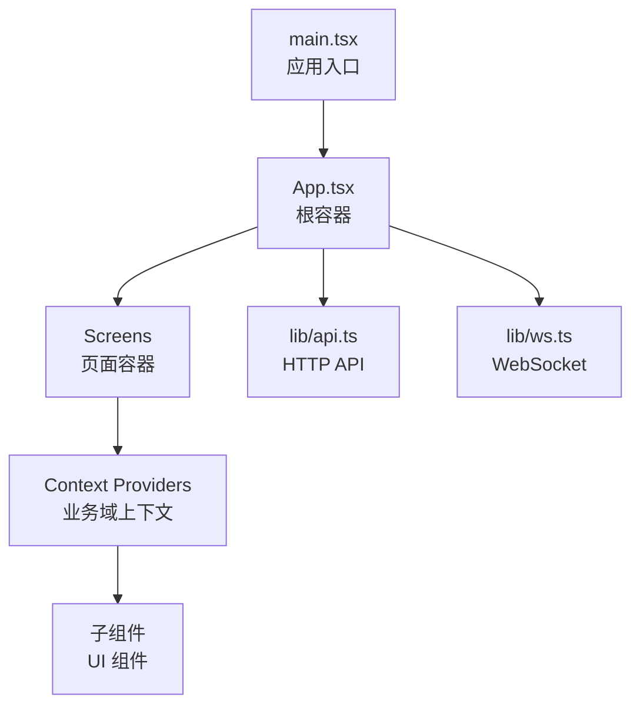
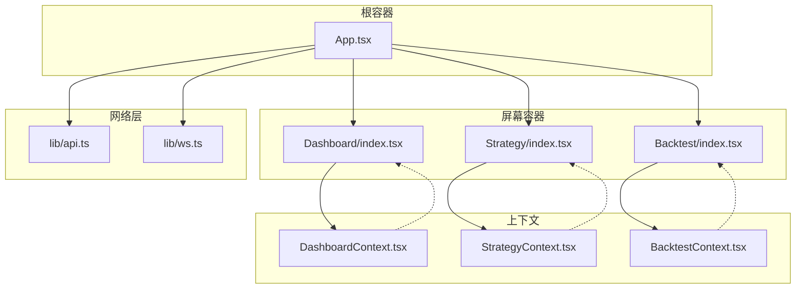
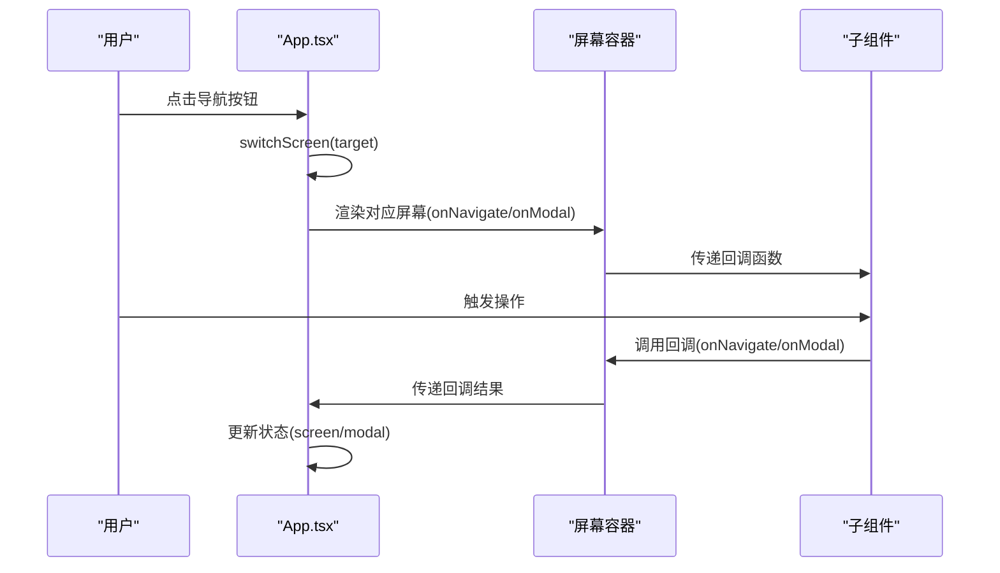
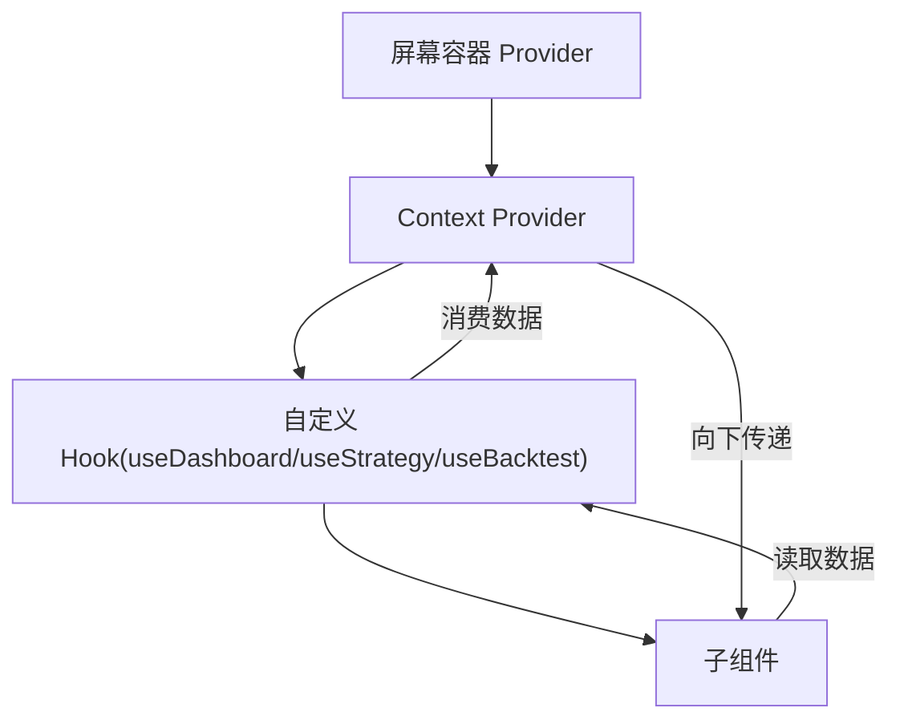
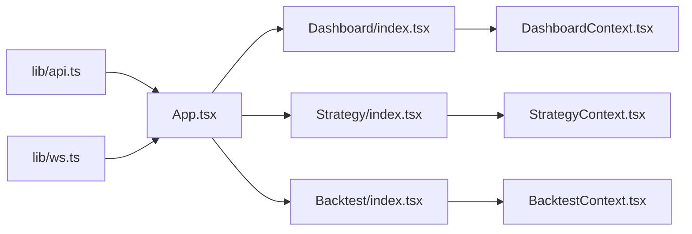

# 组件通信机制

<cite>
**本文档引用的文件**
- [frontend/src/App.tsx](file://frontend/src/App.tsx)
- [frontend/src/main.tsx](file://frontend/src/main.tsx)
- [frontend/src/lib/api.ts](file://frontend/src/lib/api.ts)
- [frontend/src/lib/ws.ts](file://frontend/src/lib/ws.ts)
- [frontend/src/contexts/DashboardContext.tsx](file://frontend/src/contexts/DashboardContext.tsx)
- [frontend/src/contexts/StrategyContext.tsx](file://frontend/src/contexts/StrategyContext.tsx)
- [frontend/src/contexts/BacktestContext.tsx](file://frontend/src/contexts/BacktestContext.tsx)
- [frontend/src/contexts/DataContext.tsx](file://frontend/src/contexts/DataContext.tsx)
- [frontend/src/contexts/ExecutionContext.tsx](file://frontend/src/contexts/ExecutionContext.tsx)
- [frontend/src/contexts/ExplainContext.tsx](file://frontend/src/contexts/ExplainContext.tsx)
- [frontend/src/contexts/PaperContext.tsx](file://frontend/src/contexts/PaperContext.tsx)
- [frontend/src/contexts/PortfolioContext.tsx](file://frontend/src/contexts/PortfolioContext.tsx)
- [frontend/src/contexts/RiskContext.tsx](file://frontend/src/contexts/RiskContext.tsx)
- [frontend/src/contexts/SecurityContext.tsx](file://frontend/src/contexts/SecurityContext.tsx)
- [frontend/src/contexts/CollaborationContext.tsx](file://frontend/src/contexts/CollaborationContext.tsx)
- [frontend/src/contexts/AuditContext.tsx](file://frontend/src/contexts/AuditContext.tsx)
- [frontend/src/contexts/StrategyContext.tsx](file://frontend/src/contexts/StrategyContext.tsx)
- [frontend/src/contexts/BacktestContext.tsx](file://frontend/src/contexts/BacktestContext.tsx)
- [frontend/src/contexts/DashboardContext.tsx](file://frontend/src/contexts/DashboardContext.tsx)
- [frontend/src/screens/Dashboard/index.tsx](file://frontend/src/screens/Dashboard/index.tsx)
- [frontend/src/screens/Strategy/index.tsx](file://frontend/src/screens/Strategy/index.tsx)
- [frontend/src/screens/Backtest/index.tsx](file://frontend/src/screens/Backtest/index.tsx)
- [frontend/src/data/types.ts](file://frontend/src/data/types.ts)
- [frontend/src/data/mock_ashare.ts](file://frontend/src/data/mock_ashare.ts)
</cite>

## 目录
1. [引言](#引言)
2. [项目结构](#项目结构)
3. [核心组件](#核心组件)
4. [架构总览](#架构总览)
5. [详细组件分析](#详细组件分析)
6. [依赖关系分析](#依赖关系分析)
7. [性能考量](#性能考量)
8. [故障排查指南](#故障排查指南)
9. [结论](#结论)
10. [附录](#附录)

## 引言
本设计文档聚焦 llmine-quant 前端组件通信机制，系统梳理父子组件通信（Props 传递、回调函数）、兄弟组件通信以及跨层级通信的实现模式；深入解析 Context API 的使用策略、状态提升与事件冒泡机制；并结合实际代码路径说明 WebSocket 与 API 的集成方式。文档同时总结最佳实践、性能优化与调试技巧，帮助开发者在复杂业务场景下高效、稳定地组织组件间的数据流与控制流。

## 项目结构
前端采用 React + TypeScript 构建，主要目录与职责如下：
- src/main.tsx：应用入口，渲染根组件 App
- src/App.tsx：应用根容器，负责全局状态、路由切换、模态框、WebSocket 连接与用户认证
- src/contexts/*：各业务域的 Context 提供器与 Hook，用于跨层级数据共享
- src/screens/*：页面级容器组件，负责拉取数据、聚合子组件并向下传递 Props
- src/lib/*：网络层（API）与实时通信层（WebSocket）
- src/data/*：类型定义与 Mock 数据

图表来源
- [frontend/src/main.tsx:1-12](file://frontend/src/main.tsx#L1-L12)
- [frontend/src/App.tsx:1-299](file://frontend/src/App.tsx#L1-L299)
- [frontend/src/lib/api.ts:1-779](file://frontend/src/lib/api.ts#L1-L779)
- [frontend/src/lib/ws.ts:1-95](file://frontend/src/lib/ws.ts#L1-L95)

章节来源
- [frontend/src/main.tsx:1-12](file://frontend/src/main.tsx#L1-L12)
- [frontend/src/App.tsx:1-299](file://frontend/src/App.tsx#L1-L299)

## 核心组件
本节聚焦组件通信的关键角色与职责：
- App 根容器：统一管理屏幕切换、模态框、用户认证、系统健康信息与 WebSocket 连接
- 屏幕容器：如 Dashboard、Strategy、Backtest 等，负责拉取数据、聚合子组件并向下传递 Props
- Context 提供器：StrategyContext、BacktestContext、DashboardContext 等，封装业务域数据与 Hook
- API 与 WebSocket：提供统一的网络访问与实时订阅能力

章节来源
- [frontend/src/App.tsx:42-173](file://frontend/src/App.tsx#L42-L173)
- [frontend/src/screens/Dashboard/index.tsx:12-46](file://frontend/src/screens/Dashboard/index.tsx#L12-L46)
- [frontend/src/screens/Strategy/index.tsx:10-167](file://frontend/src/screens/Strategy/index.tsx#L10-L167)
- [frontend/src/screens/Backtest/index.tsx:17-800](file://frontend/src/screens/Backtest/index.tsx#L17-L800)
- [frontend/src/contexts/DashboardContext.tsx:1-13](file://frontend/src/contexts/DashboardContext.tsx#L1-L13)
- [frontend/src/contexts/StrategyContext.tsx:1-13](file://frontend/src/contexts/StrategyContext.tsx#L1-L13)
- [frontend/src/contexts/BacktestContext.tsx:1-13](file://frontend/src/contexts/BacktestContext.tsx#L1-L13)
- [frontend/src/lib/api.ts:514-779](file://frontend/src/lib/api.ts#L514-L779)
- [frontend/src/lib/ws.ts:27-95](file://frontend/src/lib/ws.ts#L27-L95)

## 架构总览
下图展示了组件通信的整体架构：App 作为根容器协调全局状态与事件；屏幕容器通过 Context 提供业务域数据；API 与 WebSocket 为数据与事件来源；子组件通过 Props 与 Context 获取所需数据并向上回调。

图表来源
- [frontend/src/App.tsx:137-173](file://frontend/src/App.tsx#L137-L173)
- [frontend/src/screens/Dashboard/index.tsx:28-44](file://frontend/src/screens/Dashboard/index.tsx#L28-L44)
- [frontend/src/screens/Strategy/index.tsx:80-165](file://frontend/src/screens/Strategy/index.tsx#L80-L165)
- [frontend/src/screens/Backtest/index.tsx:137-800](file://frontend/src/screens/Backtest/index.tsx#L137-L800)
- [frontend/src/contexts/DashboardContext.tsx:1-13](file://frontend/src/contexts/DashboardContext.tsx#L1-L13)
- [frontend/src/contexts/StrategyContext.tsx:1-13](file://frontend/src/contexts/StrategyContext.tsx#L1-L13)
- [frontend/src/contexts/BacktestContext.tsx:1-13](file://frontend/src/contexts/BacktestContext.tsx#L1-L13)
- [frontend/src/lib/api.ts:514-779](file://frontend/src/lib/api.ts#L514-L779)
- [frontend/src/lib/ws.ts:27-95](file://frontend/src/lib/ws.ts#L27-L95)

## 详细组件分析

### 父子组件通信（Props 与回调）
- 父组件向子组件传递 Props：App 将 onNavigate、onModal 等回调函数传递给各屏幕容器；屏幕容器再将这些回调传递给其子组件，实现“命令式导航”和“模态框控制”
- 子组件向上回调：子组件通过回调函数通知父组件更新状态（如打开/关闭模态框、切换屏幕）

图表来源
- [frontend/src/App.tsx:100-133](file://frontend/src/App.tsx#L100-L133)
- [frontend/src/screens/Dashboard/index.tsx:12-46](file://frontend/src/screens/Dashboard/index.tsx#L12-L46)
- [frontend/src/screens/Strategy/index.tsx:10-167](file://frontend/src/screens/Strategy/index.tsx#L10-L167)
- [frontend/src/screens/Backtest/index.tsx:17-800](file://frontend/src/screens/Backtest/index.tsx#L17-L800)

章节来源
- [frontend/src/App.tsx:100-133](file://frontend/src/App.tsx#L100-L133)
- [frontend/src/screens/Dashboard/index.tsx:12-46](file://frontend/src/screens/Dashboard/index.tsx#L12-L46)
- [frontend/src/screens/Strategy/index.tsx:10-167](file://frontend/src/screens/Strategy/index.tsx#L10-L167)
- [frontend/src/screens/Backtest/index.tsx:17-800](file://frontend/src/screens/Backtest/index.tsx#L17-L800)

### 兄弟组件通信
- 通过父组件状态提升实现：App 维护 screen、modal 等状态，兄弟组件通过回调函数与父组件通信，避免跨层级直接耦合
- 模态框数据来源于全局数据 globalData，兄弟组件通过相同的 onModal 回调共享同一套模态框内容

章节来源
- [frontend/src/App.tsx:42-135](file://frontend/src/App.tsx#L42-L135)
- [frontend/src/screens/Dashboard/index.tsx:12-46](file://frontend/src/screens/Dashboard/index.tsx#L12-L46)

### 跨层级通信（Context API）
- 各屏幕容器在顶层提供 Context，子组件通过自定义 Hook 使用数据，避免层层 Props 下传
- 示例：DashboardProvider 包裹 Dashboard 子组件树，useDashboard 在任意层级读取仪表盘数据

图表来源
- [frontend/src/screens/Dashboard/index.tsx:28-44](file://frontend/src/screens/Dashboard/index.tsx#L28-L44)
- [frontend/src/contexts/DashboardContext.tsx:1-13](file://frontend/src/contexts/DashboardContext.tsx#L1-L13)
- [frontend/src/contexts/StrategyContext.tsx:1-13](file://frontend/src/contexts/StrategyContext.tsx#L1-L13)
- [frontend/src/contexts/BacktestContext.tsx:1-13](file://frontend/src/contexts/BacktestContext.tsx#L1-L13)

章节来源
- [frontend/src/screens/Dashboard/index.tsx:12-46](file://frontend/src/screens/Dashboard/index.tsx#L12-L46)
- [frontend/src/contexts/DashboardContext.tsx:1-13](file://frontend/src/contexts/DashboardContext.tsx#L1-L13)
- [frontend/src/contexts/StrategyContext.tsx:1-13](file://frontend/src/contexts/StrategyContext.tsx#L1-L13)
- [frontend/src/contexts/BacktestContext.tsx:1-13](file://frontend/src/contexts/BacktestContext.tsx#L1-L13)

### 状态提升策略
- App 维护全局状态：screen、modal、sidebarCollapsed、backtestContext、currentUser、globalData 等
- 屏幕容器负责局部状态：如 Strategy 的 drawerOpen、selectedStrategyId、lastCreatedId；Backtest 的 config、report、running 等
- 通过回调函数在父子组件间传递控制信息，避免兄弟组件直接共享状态

章节来源
- [frontend/src/App.tsx:42-135](file://frontend/src/App.tsx#L42-L135)
- [frontend/src/screens/Strategy/index.tsx:32-167](file://frontend/src/screens/Strategy/index.tsx#L32-L167)
- [frontend/src/screens/Backtest/index.tsx:137-800](file://frontend/src/screens/Backtest/index.tsx#L137-L800)

### 事件冒泡机制
- 自定义事件：当 API 返回 401 时，App 监听并派发自定义事件 llmine:unauthorized，用于全局登出
- WebSocket 事件：createWsClient 内部维护消息分发，支持按 type 或通配符 * 分发事件

章节来源
- [frontend/src/lib/api.ts:27-30](file://frontend/src/lib/api.ts#L27-L30)
- [frontend/src/App.tsx:69-74](file://frontend/src/App.tsx#L69-L74)
- [frontend/src/lib/ws.ts:34-38](file://frontend/src/lib/ws.ts#L34-L38)

### Zustand 状态管理的使用情况
经检索，项目中未发现 Zustand 相关的集成实现。当前通信机制主要依赖 React Context、Props 与自定义事件，满足现有业务需求。

## 依赖关系分析
- App 依赖 lib/api 与 lib/ws 提供网络与实时能力
- 屏幕容器依赖各自 Context 提供器
- 子组件依赖 Context Hook 与父组件回调
- 类型系统由 src/data/types.ts 统一约束

图表来源
- [frontend/src/lib/api.ts:514-779](file://frontend/src/lib/api.ts#L514-L779)
- [frontend/src/lib/ws.ts:27-95](file://frontend/src/lib/ws.ts#L27-L95)
- [frontend/src/App.tsx:137-173](file://frontend/src/App.tsx#L137-L173)
- [frontend/src/screens/Dashboard/index.tsx:28-44](file://frontend/src/screens/Dashboard/index.tsx#L28-L44)
- [frontend/src/screens/Strategy/index.tsx:80-165](file://frontend/src/screens/Strategy/index.tsx#L80-L165)
- [frontend/src/screens/Backtest/index.tsx:137-800](file://frontend/src/screens/Backtest/index.tsx#L137-L800)
- [frontend/src/contexts/DashboardContext.tsx:1-13](file://frontend/src/contexts/DashboardContext.tsx#L1-L13)
- [frontend/src/contexts/StrategyContext.tsx:1-13](file://frontend/src/contexts/StrategyContext.tsx#L1-L13)
- [frontend/src/contexts/BacktestContext.tsx:1-13](file://frontend/src/contexts/BacktestContext.tsx#L1-L13)

章节来源
- [frontend/src/App.tsx:1-299](file://frontend/src/App.tsx#L1-L299)
- [frontend/src/lib/api.ts:1-779](file://frontend/src/lib/api.ts#L1-L779)
- [frontend/src/lib/ws.ts:1-95](file://frontend/src/lib/ws.ts#L1-L95)
- [frontend/src/contexts/DashboardContext.tsx:1-13](file://frontend/src/contexts/DashboardContext.tsx#L1-L13)
- [frontend/src/contexts/StrategyContext.tsx:1-13](file://frontend/src/contexts/StrategyContext.tsx#L1-L13)
- [frontend/src/contexts/BacktestContext.tsx:1-13](file://frontend/src/contexts/BacktestContext.tsx#L1-L13)

## 性能考量
- 网络请求缓存：API 层对错误与 401 情况进行降级处理，减少重复失败请求带来的抖动
- WebSocket 自动重连：createWsClient 具备指数退避与自动重连机制，保证实时数据稳定性
- 状态最小化：App 仅维护全局必要状态，屏幕容器维护局部状态，避免不必要的重渲染
- 回调函数稳定性：App 中的回调通过 useCallback 包装，减少子组件重渲染

章节来源
- [frontend/src/lib/api.ts:32-57](file://frontend/src/lib/api.ts#L32-L57)
- [frontend/src/lib/ws.ts:57-67](file://frontend/src/lib/ws.ts#L57-L67)
- [frontend/src/App.tsx:98-106](file://frontend/src/App.tsx#L98-L106)

## 故障排查指南
- 登录态失效：API 层检测 401 后清理本地 token 并派发自定义事件，App 监听并清空用户状态
- WebSocket 断线重连：检查 createWsClient 的连接状态与重连计时器，确认服务端 WebSocket 地址与协议
- 模态框显示异常：确认 App 维护的 modal 状态与 globalData.modals 的键名一致
- 屏幕切换异常：检查 App.handleScreenNavigate 的目标合法性与 backtestContext 解析逻辑

章节来源
- [frontend/src/lib/api.ts:27-30](file://frontend/src/lib/api.ts#L27-L30)
- [frontend/src/App.tsx:69-74](file://frontend/src/App.tsx#L69-L74)
- [frontend/src/lib/ws.ts:27-95](file://frontend/src/lib/ws.ts#L27-L95)
- [frontend/src/App.tsx:108-127](file://frontend/src/App.tsx#L108-L127)

## 结论
llmine-quant 的组件通信以 App 为核心，结合 Context API、Props 与自定义事件，实现了清晰的父子、兄弟与跨层级通信。API 与 WebSocket 的集成提供了稳定的后端与实时数据通道。当前未引入 Zustand，但通过合理的状态提升与事件机制已能满足复杂业务场景。建议在后续扩展中保持通信模式的一致性，持续优化性能与可维护性。

## 附录
- 类型定义：src/data/types.ts 提供完整的 MockData 与接口类型，确保组件间数据契约一致
- Mock 数据：src/data/mock_ashare.ts 提供各业务域的示例数据，便于开发与联调

章节来源
- [frontend/src/data/types.ts:1-647](file://frontend/src/data/types.ts#L1-L647)
- [frontend/src/data/mock_ashare.ts:1-800](file://frontend/src/data/mock_ashare.ts#L1-L800)