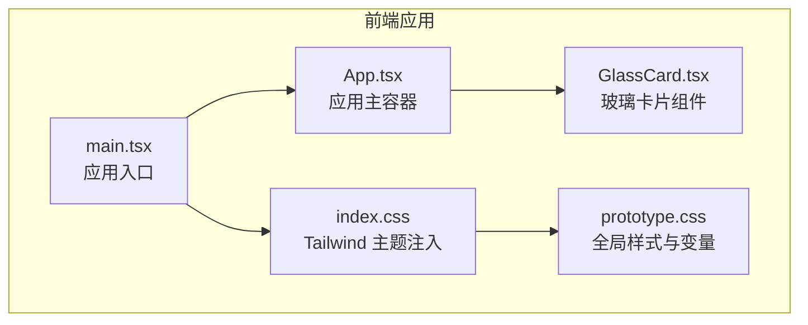
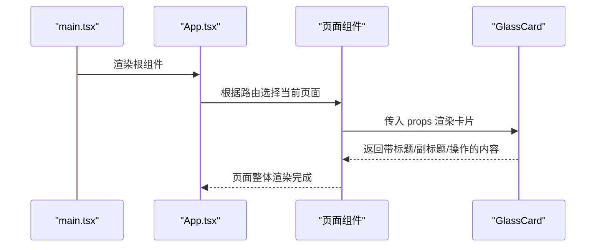
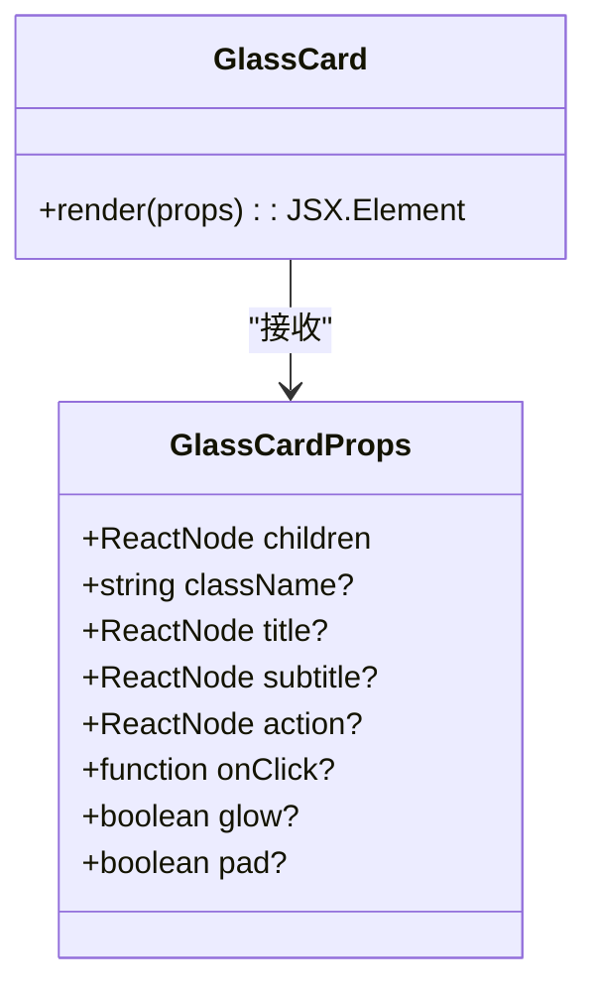
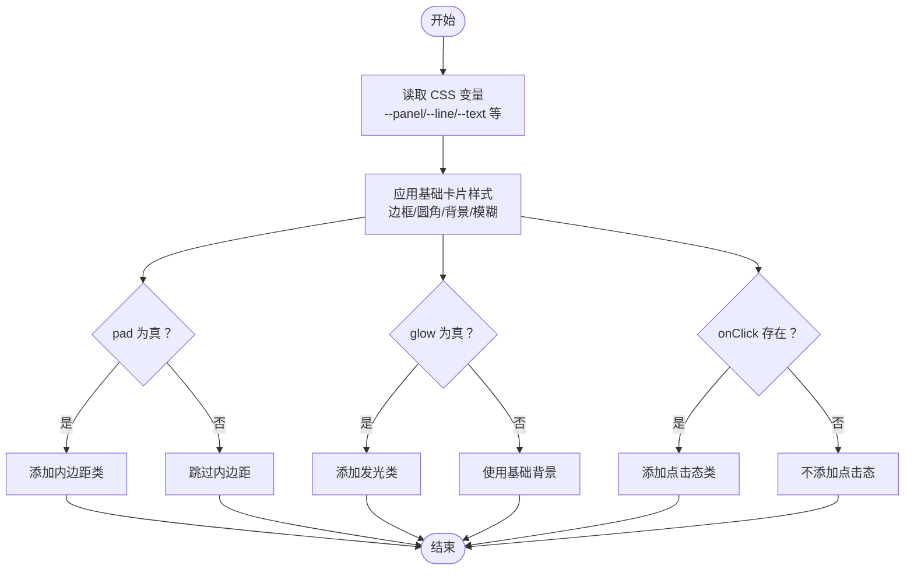
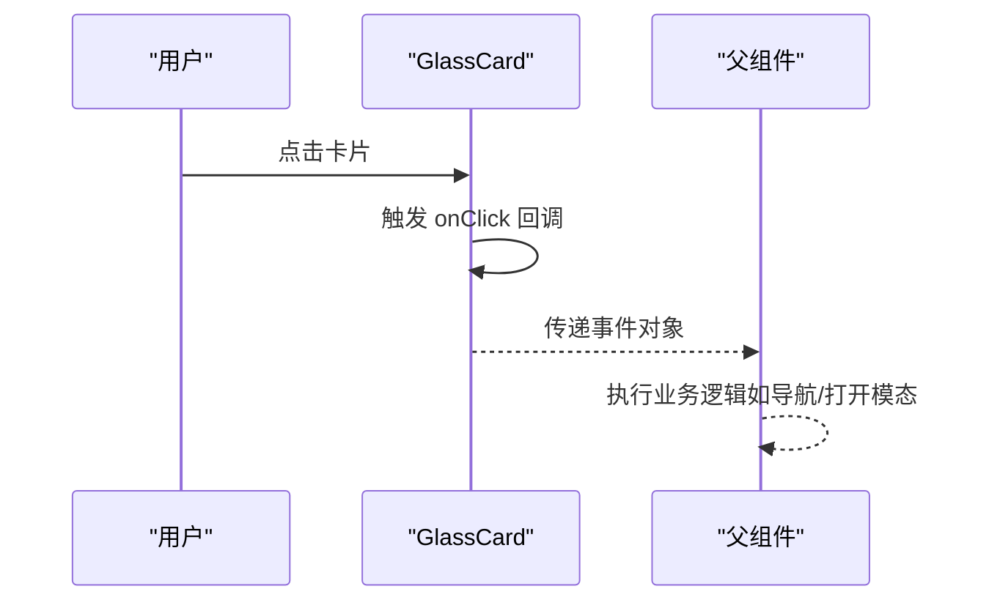
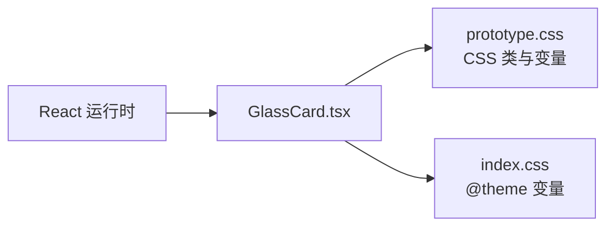

# 通用组件设计

<cite>
**本文档引用的文件**
- [GlassCard.tsx](file://frontend/src/components/GlassCard.tsx)
- [prototype.css](file://frontend/src/styles/prototype.css)
- [index.css](file://frontend/src/index.css)
- [main.tsx](file://frontend/src/main.tsx)
- [App.tsx](file://frontend/src/App.tsx)
</cite>

## 目录
1. [简介](#简介)
2. [项目结构](#项目结构)
3. [核心组件](#核心组件)
4. [架构总览](#架构总览)
5. [详细组件分析](#详细组件分析)
6. [依赖关系分析](#依赖关系分析)
7. [性能考虑](#性能考虑)
8. [故障排除指南](#故障排除指南)
9. [结论](#结论)
10. [附录](#附录)

## 简介
本设计文档聚焦于 llmine-quant 前端的通用组件设计，以 GlassCard 为核心案例，系统阐述其设计理念、复用策略、实现模式与最佳实践。文档将从 Props 接口设计、样式系统与主题支持、可定制性、状态管理与事件处理、性能优化与内存管理、渲染策略、到与设计系统的集成与一致性保证进行全面解析，并提供使用示例与集成指导。

## 项目结构
前端采用 React + TypeScript + TailwindCSS 风格的自定义 CSS 变量体系，组件位于 `frontend/src/components/`，样式集中于 `frontend/src/styles/prototype.css`，并通过 `frontend/src/index.css` 将 CSS 变量注入到 Tailwind 主题中。入口文件 `frontend/src/main.tsx` 渲染根组件 `App.tsx`，应用整体布局与导航在 App 中实现。

**图表来源**
- [main.tsx:1-12](file://frontend/src/main.tsx#L1-L12)
- [App.tsx:1-299](file://frontend/src/App.tsx#L1-L299)
- [GlassCard.tsx:1-49](file://frontend/src/components/GlassCard.tsx#L1-L49)
- [index.css:1-24](file://frontend/src/index.css#L1-L24)
- [prototype.css:1-80](file://frontend/src/styles/prototype.css#L1-L80)

**章节来源**
- [main.tsx:1-12](file://frontend/src/main.tsx#L1-L12)
- [App.tsx:1-299](file://frontend/src/App.tsx#L1-L299)
- [index.css:1-24](file://frontend/src/index.css#L1-L24)
- [prototype.css:1-80](file://frontend/src/styles/prototype.css#L1-L80)

## 核心组件
本节围绕 GlassCard 组件进行深入分析，涵盖 Props 设计、渲染结构、交互行为与样式系统。

- 设计理念
  - 以“玻璃态”视觉风格为核心，强调半透明、模糊背景与柔和边框，契合深色科技风的整体设计语言。
  - 通过可选标题、副标题与操作区，形成统一的卡片头部结构，便于在不同页面场景下快速复用。
  - 支持点击态与发光效果开关，满足交互反馈与层次强调需求。

- Props 接口设计
  - children: ReactNode，卡片内容主体。
  - className?: string，扩展类名，用于覆盖或增强默认样式。
  - title?: ReactNode，卡片标题区域。
  - subtitle?: ReactNode，卡片副标题区域。
  - action?: ReactNode，卡片右上角操作区。
  - onClick?: (e: MouseEvent<HTMLDivElement>) => void，点击回调，启用点击态样式。
  - glow?: boolean，默认 false，开启发光背景。
  - pad?: boolean，默认 true，控制内边距开关。

- 渲染结构
  - 头部区域仅在存在标题/副标题/操作时渲染，避免空占位。
  - 内容区域直接承载 children，保持灵活性与可组合性。

- 样式系统与主题支持
  - 使用 CSS 变量统一主题色值，包括背景、面板、线条、文字与强调色等。
  - GlassCard 默认继承全局变量，确保与整体设计系统一致。
  - glow 开关切换背景渐变，pad 控制内边距，clickable 提供悬停与过渡动画。

- 可定制性
  - 通过 className 扩展类名，实现局部样式覆盖。
  - 通过 glow/pad/onClick 参数控制外观与交互，满足多种业务场景。

- 状态管理与事件处理
  - 组件本身无内部状态，完全受控；onClick 由父组件传入，实现点击行为的解耦与复用。

- 性能与内存管理
  - 无内部状态与副作用，渲染路径稳定，重渲染成本低。
  - 类名拼接采用数组过滤与 join，避免冗余字符串拼接，提升可读性与性能。

**章节来源**
- [GlassCard.tsx:1-49](file://frontend/src/components/GlassCard.tsx#L1-L49)
- [prototype.css:1608-1641](file://frontend/src/styles/prototype.css#L1608-L1641)
- [index.css:3-23](file://frontend/src/index.css#L3-L23)

## 架构总览
GlassCard 在应用中的定位是“通用卡片容器”，广泛用于仪表盘、策略、回测、解释等页面的模块化布局。其与 App 主容器的关系如下：

**图表来源**
- [main.tsx:1-12](file://frontend/src/main.tsx#L1-L12)
- [App.tsx:137-173](file://frontend/src/App.tsx#L137-L173)
- [GlassCard.tsx:14-48](file://frontend/src/components/GlassCard.tsx#L14-L48)

## 详细组件分析

### GlassCard 类型与接口
GlassCard 采用函数组件与受控 Props 的模式，接口清晰、职责单一，便于组合与测试。

**图表来源**
- [GlassCard.tsx:3-12](file://frontend/src/components/GlassCard.tsx#L3-L12)
- [GlassCard.tsx:14-48](file://frontend/src/components/GlassCard.tsx#L14-L48)

**章节来源**
- [GlassCard.tsx:1-49](file://frontend/src/components/GlassCard.tsx#L1-L49)

### 样式系统与主题支持
GlassCard 的样式基于全局 CSS 变量，确保与设计系统的一致性与可维护性。

- 全局变量注入
  - index.css 通过 @theme 注入颜色与字体变量，供 CSS 使用。
- 卡片基础样式
  - 边框、圆角、背景、模糊与阴影遵循设计规范。
- 可选样式
  - glass-card-pad：内边距开关。
  - glass-card-glow：发光背景渐变。
  - glass-card-clickable：点击态与悬停过渡。

**图表来源**
- [GlassCard.tsx:24-32](file://frontend/src/components/GlassCard.tsx#L24-L32)
- [prototype.css:1608-1626](file://frontend/src/styles/prototype.css#L1608-L1626)
- [index.css:3-23](file://frontend/src/index.css#L3-L23)

**章节来源**
- [prototype.css:1608-1641](file://frontend/src/styles/prototype.css#L1608-L1641)
- [index.css:3-23](file://frontend/src/index.css#L3-L23)

### 事件处理与交互
- 点击回调 onClick：由父组件传入，GlassCard 仅负责绑定到根元素，实现点击态样式与行为解耦。
- 点击态样式：glass-card-clickable 提供悬停过渡与轻微位移，增强交互反馈。

**图表来源**
- [GlassCard.tsx:9-20](file://frontend/src/components/GlassCard.tsx#L9-L20)
- [prototype.css:1622-1626](file://frontend/src/styles/prototype.css#L1622-L1626)

**章节来源**
- [GlassCard.tsx:9-20](file://frontend/src/components/GlassCard.tsx#L9-L20)
- [prototype.css:1622-1626](file://frontend/src/styles/prototype.css#L1622-L1626)

### 与设计系统的集成与一致性
- 设计系统基线：全局 CSS 变量统一了色彩、字体与间距，GlassCard 直接消费这些变量，确保跨页面一致性。
- 响应式与布局：App 主容器与页面组件负责布局与响应式规则，GlassCard 作为子组件遵循网格与间距规范。
- 可扩展性：通过 className 覆盖与 glow/pad/onClick 参数，GlassCard 可在不破坏设计系统的情况下实现差异化展示。

**章节来源**
- [index.css:3-23](file://frontend/src/index.css#L3-L23)
- [prototype.css:1-80](file://frontend/src/styles/prototype.css#L1-L80)
- [App.tsx:137-173](file://frontend/src/App.tsx#L137-L173)

## 依赖关系分析
GlassCard 的依赖关系简洁明确，耦合度低，便于复用与维护。

**图表来源**
- [GlassCard.tsx:1-1](file://frontend/src/components/GlassCard.tsx#L1-L1)
- [prototype.css:1608-1641](file://frontend/src/styles/prototype.css#L1608-L1641)
- [index.css:3-23](file://frontend/src/index.css#L3-L23)

**章节来源**
- [GlassCard.tsx:1-49](file://frontend/src/components/GlassCard.tsx#L1-L49)
- [prototype.css:1608-1641](file://frontend/src/styles/prototype.css#L1608-L1641)
- [index.css:3-23](file://frontend/src/index.css#L3-L23)

## 性能考虑
- 渲染路径稳定：无内部状态与副作用，每次渲染只依赖 Props，减少不必要的计算。
- 类名拼接优化：使用数组过滤与 join，避免空字符串与多余空格，降低 DOM 操作成本。
- 样式复用：通过 CSS 变量与公共类名，减少重复样式定义，提升样式层性能。
- 事件绑定：onClick 仅在存在时绑定，避免无效事件监听器。
- 建议
  - 对频繁更新的父组件，建议使用 memo 包裹使用 GlassCard 的页面片段，减少重渲染。
  - 对大量卡片的列表，优先使用虚拟滚动或分页，避免一次性渲染过多节点。

[本节为通用性能建议，无需特定文件来源]

## 故障排除指南
- 样式未生效
  - 检查是否正确引入样式文件与 CSS 变量。
  - 确认 className 是否被父级样式覆盖。
- 点击无反应
  - 确认 onClick 是否正确传入且未被父级阻止事件冒泡。
- 发光效果异常
  - 检查 glow 参数与对应 CSS 类是否正确应用。
- 内边距不符合预期
  - 确认 pad 参数与 glass-card-pad 类的组合是否符合预期。

**章节来源**
- [GlassCard.tsx:24-32](file://frontend/src/components/GlassCard.tsx#L24-L32)
- [prototype.css:1608-1641](file://frontend/src/styles/prototype.css#L1608-L1641)

## 结论
GlassCard 以简洁的 Props 接口、稳定的渲染路径与统一的样式系统，实现了高复用与强一致性的通用卡片组件。通过 CSS 变量与可选样式参数，它既能融入整体设计系统，又能在细节上灵活定制。结合合理的事件处理与性能优化策略，GlassCard 可作为 llmine-quant 前端组件库的重要基石，支撑多页面、多场景的高效开发与维护。

[本节为总结性内容，无需特定文件来源]

## 附录
- 使用示例（路径指引）
  - 在页面组件中引入 GlassCard 并传入所需 Props。
  - 示例路径参考：[GlassCard.tsx:14-48](file://frontend/src/components/GlassCard.tsx#L14-L48)
- 集成指导
  - 在 App 主容器中按需渲染页面组件，页面组件内部使用 GlassCard 组织内容。
  - 示例路径参考：[App.tsx:137-173](file://frontend/src/App.tsx#L137-L173)
- 最佳实践
  - Props 保持最小必要集，避免过度耦合。
  - 使用 className 进行局部覆盖，避免破坏全局样式。
  - 合理使用 glow/pad/onClick 参数，确保交互与视觉一致。

**章节来源**
- [GlassCard.tsx:14-48](file://frontend/src/components/GlassCard.tsx#L14-L48)
- [App.tsx:137-173](file://frontend/src/App.tsx#L137-L173)