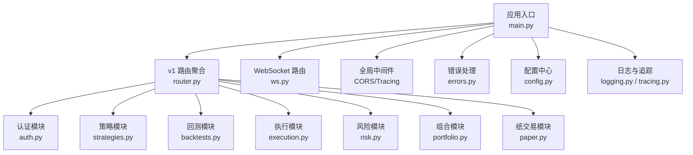
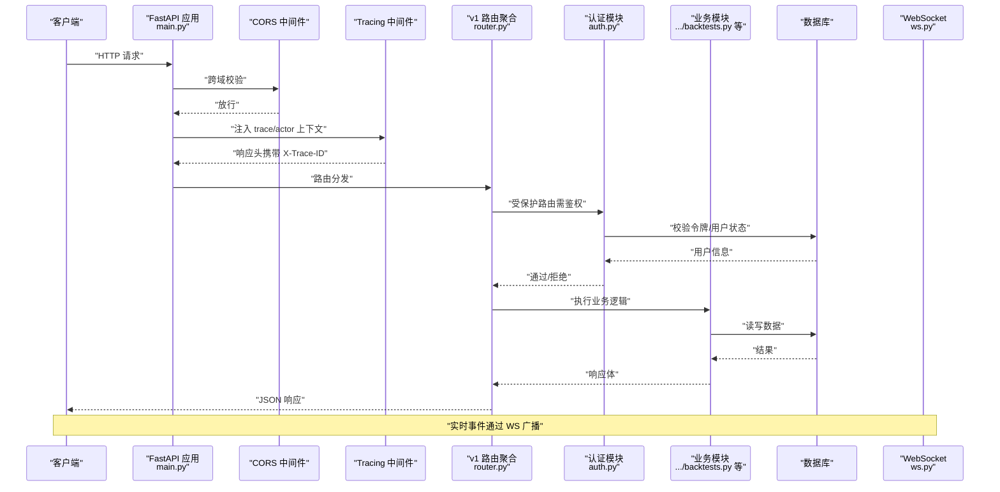
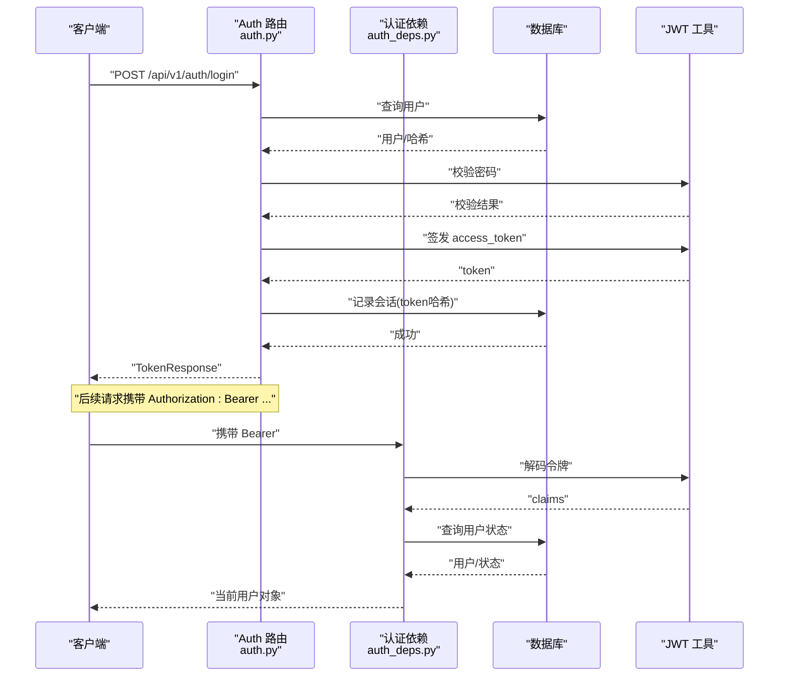
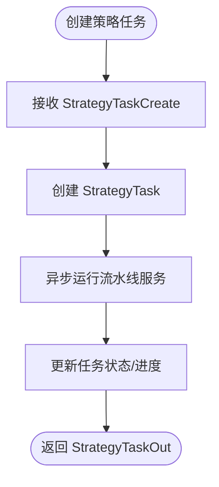
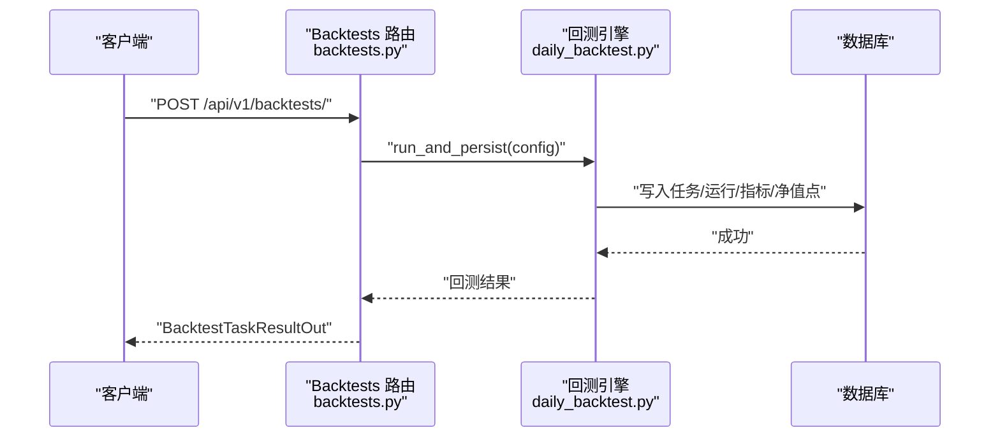
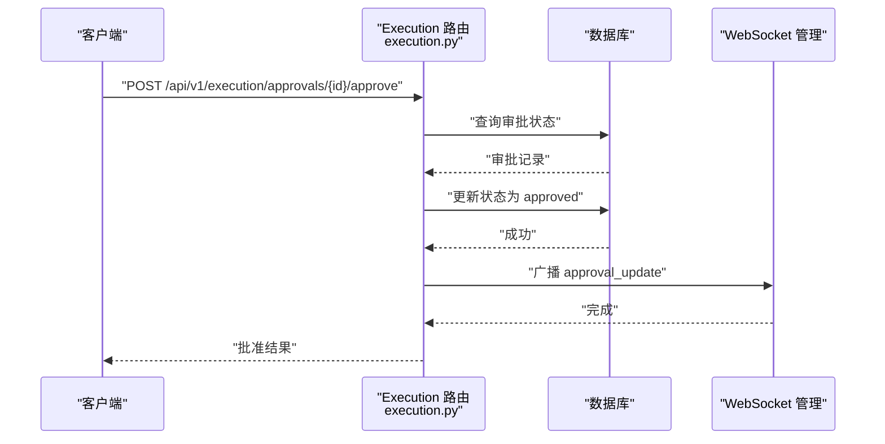
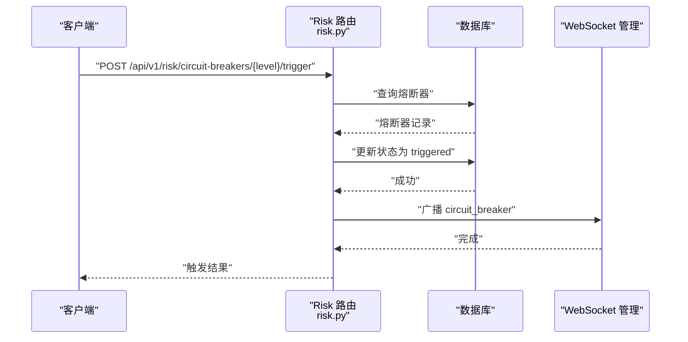
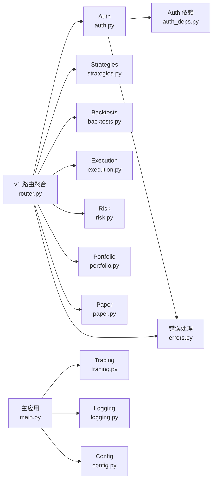

# API 设计

<cite>
**本文引用的文件**
- [backend/app/main.py](file://backend/app/main.py)
- [backend/app/api/v1/router.py](file://backend/app/api/v1/router.py)
- [backend/app/core/auth_deps.py](file://backend/app/core/auth_deps.py)
- [backend/app/core/errors.py](file://backend/app/core/errors.py)
- [backend/app/api/v1/auth.py](file://backend/app/api/v1/auth.py)
- [backend/app/api/v1/strategies.py](file://backend/app/api/v1/strategies.py)
- [backend/app/api/v1/backtests.py](file://backend/app/api/v1/backtests.py)
- [backend/app/api/v1/execution.py](file://backend/app/api/v1/execution.py)
- [backend/app/api/v1/risk.py](file://backend/app/api/v1/risk.py)
- [backend/app/api/v1/portfolio.py](file://backend/app/api/v1/portfolio.py)
- [backend/app/api/v1/paper.py](file://backend/app/api/v1/paper.py)
- [backend/app/api/v1/ws.py](file://backend/app/api/v1/ws.py)
- [backend/app/core/config.py](file://backend/app/core/config.py)
- [backend/app/core/tracing.py](file://backend/app/core/tracing.py)
- [backend/app/core/logging.py](file://backend/app/core/logging.py)
</cite>

## 目录
1. [简介](#简介)
2. [项目结构](#项目结构)
3. [核心组件](#核心组件)
4. [架构总览](#架构总览)
5. [详细组件分析](#详细组件分析)
6. [依赖分析](#依赖分析)
7. [性能考虑](#性能考虑)
8. [故障排查指南](#故障排查指南)
9. [结论](#结论)
10. [附录](#附录)

## 简介
本文件系统性梳理 llmine-quant 后端的 RESTful API 设计，覆盖 FastAPI 路由组织、认证授权、中间件、错误处理、版本管理与各功能模块接口规范。目标是帮助开发者快速理解并正确使用系统提供的 RESTful 接口。

## 项目结构
- 应用入口与全局配置
  - 入口应用：在应用启动时注册中间件、异常处理器、路由前缀，并挂载 v1 路由与 WebSocket 路由。
  - 配置中心：集中管理应用名、版本、数据库、Redis、CORS、API 前缀、分页、市场数据与 LLM 提供商等。
- API 分层
  - v1 路由聚合器：统一 include 各业务模块路由，按标签分组，便于 OpenAPI 文档生成与维护。
  - 业务模块：认证、策略工厂、回测实验室、执行中心、风险控制、组合舱、纸交易、仪表盘、数据、报价、解释追踪、协作、审计、代理编排、WS 实时事件等。
- 中间件与可观测性
  - CORS、Tracing（上下文注入）、结构化日志。
- 错误处理
  - 统一自定义异常体系与异常处理器，保证错误响应一致可追踪。

图表来源
- [backend/app/main.py:39-65](file://backend/app/main.py#L39-L65)
- [backend/app/api/v1/router.py:23-40](file://backend/app/api/v1/router.py#L23-L40)

章节来源
- [backend/app/main.py:39-65](file://backend/app/main.py#L39-L65)
- [backend/app/api/v1/router.py:23-40](file://backend/app/api/v1/router.py#L23-L40)
- [backend/app/core/config.py:48-108](file://backend/app/core/config.py#L48-L108)

## 核心组件
- 路由前缀与版本管理
  - API v1 前缀为固定常量，所有 v1 路由以 /api/v1 开头，便于未来版本演进与迁移。
- 认证与授权
  - 基于 JWT 的 OAuth2 密码流，支持登录、注册、刷新、登出与“当前用户”查询。
  - 依赖注入获取当前用户，未携带有效令牌或用户无效时返回 401。
- 中间件
  - CORS：允许跨域访问，支持凭证与任意方法/头。
  - Tracing：注入 trace_id、actor_id、org_id，响应头携带 trace_id，便于全链路追踪。
- 错误处理
  - 自定义异常类族，覆盖常见业务错误与 LLM 提供商错误。
  - 异常处理器统一输出 code、message、details、trace_id，保障可观测性与客户端可读性。
- 日志与追踪
  - 结构化日志，开发环境控制台渲染，生产环境 JSON 渲染。
  - 追踪上下文贯穿请求生命周期，支持审计与问题定位。

章节来源
- [backend/app/core/config.py:72-74](file://backend/app/core/config.py#L72-L74)
- [backend/app/core/auth_deps.py:12-39](file://backend/app/core/auth_deps.py#L12-L39)
- [backend/app/core/tracing.py:49-86](file://backend/app/core/tracing.py#L49-L86)
- [backend/app/core/errors.py:13-118](file://backend/app/core/errors.py#L13-L118)
- [backend/app/core/logging.py:11-41](file://backend/app/core/logging.py#L11-L41)

## 架构总览
下图展示了请求从客户端到各模块的流转路径，以及认证、追踪与异常处理的关键节点。

图表来源
- [backend/app/main.py:48-58](file://backend/app/main.py#L48-L58)
- [backend/app/core/tracing.py:49-86](file://backend/app/core/tracing.py#L49-L86)
- [backend/app/api/v1/router.py:23-40](file://backend/app/api/v1/router.py#L23-L40)
- [backend/app/api/v1/auth.py:47-89](file://backend/app/api/v1/auth.py#L47-L89)

## 详细组件分析

### 认证与授权（Auth）
- 路由与响应模型
  - 登录：邮箱+密码，返回 access_token、有效期、用户信息。
  - 注册：创建用户并发放令牌。
  - 刷新：基于有效旧令牌签发新令牌。
  - 登出：撤销会话记录。
  - 当前用户：从 Bearer 令牌解析用户信息。
- 认证依赖
  - OAuth2PasswordBearer 指向 /api/v1/auth/login。
  - get_current_user：缺失或无效令牌返回 401；用户不存在或非活跃返回 401/403。
  - get_optional_user：公开端点可选认证，无令牌返回 None。
- 安全要点
  - 密码哈希与校验。
  - 令牌哈希入库用于登出撤销。
  - 用户状态检查（仅活跃用户可登录）。

图表来源
- [backend/app/api/v1/auth.py:47-89](file://backend/app/api/v1/auth.py#L47-L89)
- [backend/app/core/auth_deps.py:15-39](file://backend/app/core/auth_deps.py#L15-L39)

章节来源
- [backend/app/api/v1/auth.py:24-194](file://backend/app/api/v1/auth.py#L24-L194)
- [backend/app/core/auth_deps.py:12-53](file://backend/app/core/auth_deps.py#L12-L53)

### 策略工厂（Strategies）
- 主要能力
  - 策略概览：流水线状态、模板、消息流、矩阵视图。
  - 模板列表：返回策略模板集合。
  - 创建生成任务：提交提示词、市场、风险偏好，异步运行流水线。
  - 查询任务：支持按任务 ID 或关联策略/版本解析。
  - 策略列表：支持按状态、家族、市场、关键词过滤与分页。
  - 策略详情：版本与最近流水线事件。
  - 更新/删除：软删除（标记 deleted_at）。
  - 流水线事件：记录状态迁移与审计。
- 关键流程
  - 创建任务后后台独立运行流水线服务。
  - 通过 _resolve_live_strategy 支持多种 ID 形态解析。
  - 审计日志记录更新与删除行为。

图表来源
- [backend/app/api/v1/strategies.py:301-314](file://backend/app/api/v1/strategies.py#L301-L314)
- [backend/app/api/v1/strategies.py:125-130](file://backend/app/api/v1/strategies.py#L125-L130)

章节来源
- [backend/app/api/v1/strategies.py:162-605](file://backend/app/api/v1/strategies.py#L162-L605)

### 回测实验室（Backtests）
- 主要能力
  - 股票池建议：基于 LLM 与本地数据统计，返回候选与理由。
  - 概览：KPI、净值曲线、信心塔、WF 折线、对比表、压力情景、参数热力图。
  - 单次回测：创建并持久化回测任务，返回指标与等分段结果。
  - 敏感性分析：基线 + 参数/滑点扰动。
  - Walk-Forward：训练/测试折线与汇总。
  - 历史查询：任务列表与最新运行结果。
  - 交易明细：按任务返回成交清单与原因。
  - 报告聚合：统一 Phase 3 报告（IS/OOS/WF/Sens/Overfit/Trades/Lineage）。
- 关键流程
  - 输入参数校验与错误映射为 400。
  - 引擎执行与持久化，失败抛出业务异常。
  - 报告聚合时重新评估过拟合，确保报告新鲜度。

图表来源
- [backend/app/api/v1/backtests.py:444-455](file://backend/app/api/v1/backtests.py#L444-L455)
- [backend/app/api/v1/backtests.py:554-584](file://backend/app/api/v1/backtests.py#L554-L584)

章节来源
- [backend/app/api/v1/backtests.py:200-800](file://backend/app/api/v1/backtests.py#L200-L800)

### 执行中心（Execution）
- 主要能力
  - 概览：待审批、订单簿、代理轨迹、预交易检查、执行指标。
  - 审批列表：按状态与条数过滤。
  - 审批操作：批准/拒绝，写入审计并广播 WS 事件。
- 关键流程
  - 审批状态约束：仅 pending 可变更，重复操作返回 409。
  - 审批变更后通过 WebSocket 广播主题 execution-events。

图表来源
- [backend/app/api/v1/execution.py:223-250](file://backend/app/api/v1/execution.py#L223-L250)

章节来源
- [backend/app/api/v1/execution.py:188-281](file://backend/app/api/v1/execution.py#L188-L281)

### 风险控制（Risk）
- 主要能力
  - 概览：健康评分、杀开关、待处理审批、自动阻断、VaR、熔断器、策略流、风险事件。
  - 熔断器：手动触发/恢复，写入审计并广播 WS 事件。
- 关键流程
  - 健康评分综合活跃风险事件与自动阻断次数。
  - 熔断器状态变更与 24 小时触发计数更新。

图表来源
- [backend/app/api/v1/risk.py:210-239](file://backend/app/api/v1/risk.py#L210-L239)

章节来源
- [backend/app/api/v1/risk.py:188-273](file://backend/app/api/v1/risk.py#L188-L273)

### 组合舱（Portfolio）
- 主要能力
  - 概览：净值、风险预算、资产配置、相关系数、集中度、再平衡提案。
  - 再平衡：列出待审批提案，批准后写入审计。
- 关键流程
  - 提案状态约束：仅 pending 可批准，重复操作返回 409。

章节来源
- [backend/app/api/v1/portfolio.py:140-186](file://backend/app/api/v1/portfolio.py#L140-L186)

### 纸交易（Paper）
- 主要能力
  - 账户：创建、列表、详情。
  - 持仓/订单/成交/净值/风险事件：按账户维度查询。
  - EOD：手动触发指定交易日的结日流程。
- 关键流程
  - 账户存在性校验，不存在返回 404。
  - EOD 执行后返回汇总统计。

章节来源
- [backend/app/api/v1/paper.py:43-276](file://backend/app/api/v1/paper.py#L43-L276)

### WebSocket 实时事件（WS）
- 端点
  - /ws/events：通用事件。
  - /ws/strategy-events：策略流水线事件。
  - /ws/execution-events：执行审批事件。
  - /ws/risk-events：风险/熔断事件。
- 行为
  - 心跳：收到消息后 echo pong。
  - 异常：捕获错误并断开连接，记录日志。

章节来源
- [backend/app/api/v1/ws.py:28-50](file://backend/app/api/v1/ws.py#L28-L50)

## 依赖分析
- 路由聚合
  - v1 路由聚合器统一 include 各模块路由，形成清晰的模块边界与标签分组。
- 认证依赖
  - get_current_user 与 get_optional_user 作为通用依赖，贯穿多个模块的受保护端点。
- 错误处理
  - LLMineException 及其子类统一异常语义；handle_llmine_exception 与 handle_generic_exception 保证错误响应一致性。
- 追踪与日志
  - tracing_middleware 注入 trace_id/actor_id/org_id；logging 提供结构化日志配置。

图表来源
- [backend/app/api/v1/router.py:23-40](file://backend/app/api/v1/router.py#L23-L40)
- [backend/app/core/auth_deps.py:12-53](file://backend/app/core/auth_deps.py#L12-L53)
- [backend/app/core/errors.py:73-118](file://backend/app/core/errors.py#L73-L118)
- [backend/app/core/tracing.py:49-86](file://backend/app/core/tracing.py#L49-L86)
- [backend/app/core/logging.py:11-41](file://backend/app/core/logging.py#L11-L41)
- [backend/app/core/config.py:48-108](file://backend/app/core/config.py#L48-L108)

章节来源
- [backend/app/api/v1/router.py:23-40](file://backend/app/api/v1/router.py#L23-L40)
- [backend/app/core/auth_deps.py:12-53](file://backend/app/core/auth_deps.py#L12-L53)
- [backend/app/core/errors.py:73-118](file://backend/app/core/errors.py#L73-L118)

## 性能考虑
- 异步数据库会话：使用 SQLAlchemy 异步引擎，减少 I/O 阻塞。
- 任务异步化：策略生成、回测等耗时流程采用异步任务与后台运行，避免阻塞请求。
- 分页与限制：列表接口默认限制条数，防止一次性返回过多数据。
- 缓存与静态数据：部分前端展示数据采用静态常量或轻量计算，降低数据库压力。
- WebSocket：按主题订阅，避免广播无关事件，减少带宽与 CPU 开销。

## 故障排查指南
- 常见错误与处理
  - 401 未认证：检查 Authorization 头是否携带 Bearer 令牌，令牌是否有效。
  - 403 禁止访问：账户状态非 active。
  - 404 资源不存在：ID 错误或已被软删除。
  - 409 冲突：资源状态不允许当前操作（如审批已处理）。
  - 400 参数错误：回测输入参数不合法或数据缺失。
  - 500 内部错误：查看 trace_id 定位日志。
- 定位步骤
  - 检查响应头 X-Trace-ID，结合日志定位请求链路。
  - 使用 /health 检查服务健康状态与版本。
  - 对 WS 连接问题，确认主题与心跳响应。

章节来源
- [backend/app/api/v1/auth.py:57-64](file://backend/app/api/v1/auth.py#L57-L64)
- [backend/app/api/v1/execution.py:226-230](file://backend/app/api/v1/execution.py#L226-L230)
- [backend/app/api/v1/backtests.py:453-454](file://backend/app/api/v1/backtests.py#L453-L454)
- [backend/app/core/errors.py:73-118](file://backend/app/core/errors.py#L73-L118)
- [backend/app/main.py:61-64](file://backend/app/main.py#L61-L64)

## 结论
本设计以 FastAPI 为基础，通过 v1 路由聚合实现模块化组织，配合 JWT 认证、CORS、Tracing、结构化日志与统一异常处理，形成清晰、可扩展、可观测的 RESTful API 体系。各功能模块接口职责明确，参数与响应模型统一，便于前后端协同与长期演进。

## 附录

### API 版本管理
- 前缀：/api/v1
- 说明：当前版本为 v1，未来可通过新增 /api/v2 路由平滑迁移，保持现有接口稳定。

章节来源
- [backend/app/core/config.py:72-74](file://backend/app/core/config.py#L72-L74)
- [backend/app/main.py:42](file://backend/app/main.py#L42)

### 认证与授权最佳实践
- 使用 Bearer 令牌访问受保护接口。
- 登出时调用刷新接口传入 access_token，服务端撤销会话。
- 令牌过期时间可在配置中调整，生产环境建议缩短并启用刷新流程。

章节来源
- [backend/app/api/v1/auth.py:134-169](file://backend/app/api/v1/auth.py#L134-L169)
- [backend/app/api/v1/auth.py:172-182](file://backend/app/api/v1/auth.py#L172-L182)
- [backend/app/core/config.py:65-67](file://backend/app/core/config.py#L65-L67)

### 错误响应格式
- 字段：code、message、details、trace_id。
- 示例：参考错误处理器返回结构。

章节来源
- [backend/app/core/errors.py:73-95](file://backend/app/core/errors.py#L73-L95)
- [backend/app/core/errors.py:98-118](file://backend/app/core/errors.py#L98-L118)

### 中间件与可观测性
- CORS：允许任意来源与方法，支持凭证。
- Tracing：注入 trace_id/actor_id，响应头携带 X-Trace-ID。
- 日志：结构化输出，生产环境 JSON，开发环境控制台。

章节来源
- [backend/app/main.py:48-50](file://backend/app/main.py#L48-L50)
- [backend/app/core/tracing.py:49-86](file://backend/app/core/tracing.py#L49-L86)
- [backend/app/core/logging.py:11-41](file://backend/app/core/logging.py#L11-L41)