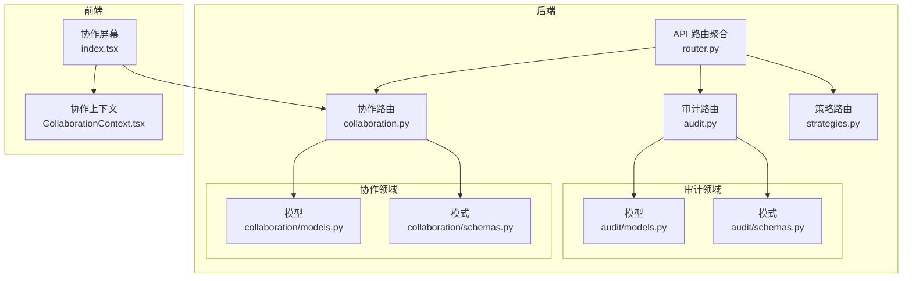
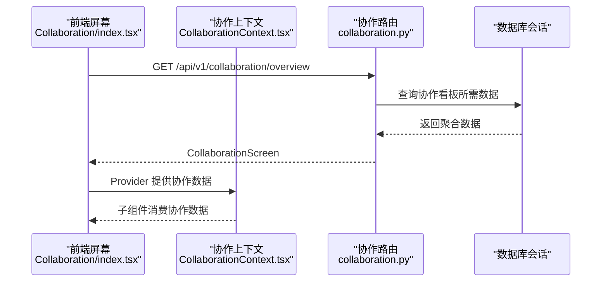
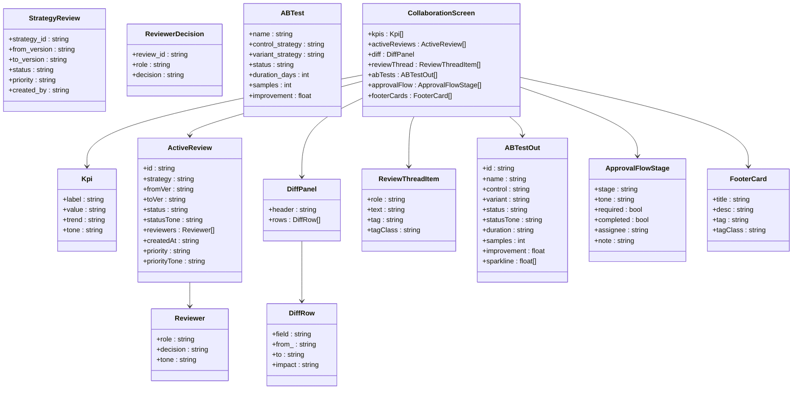
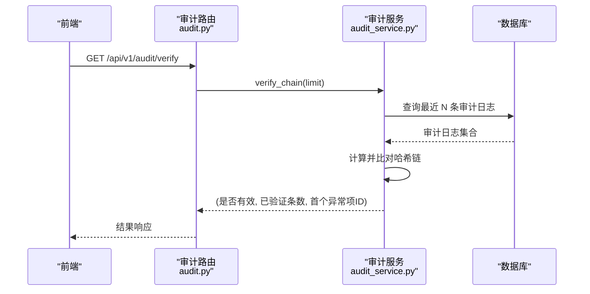
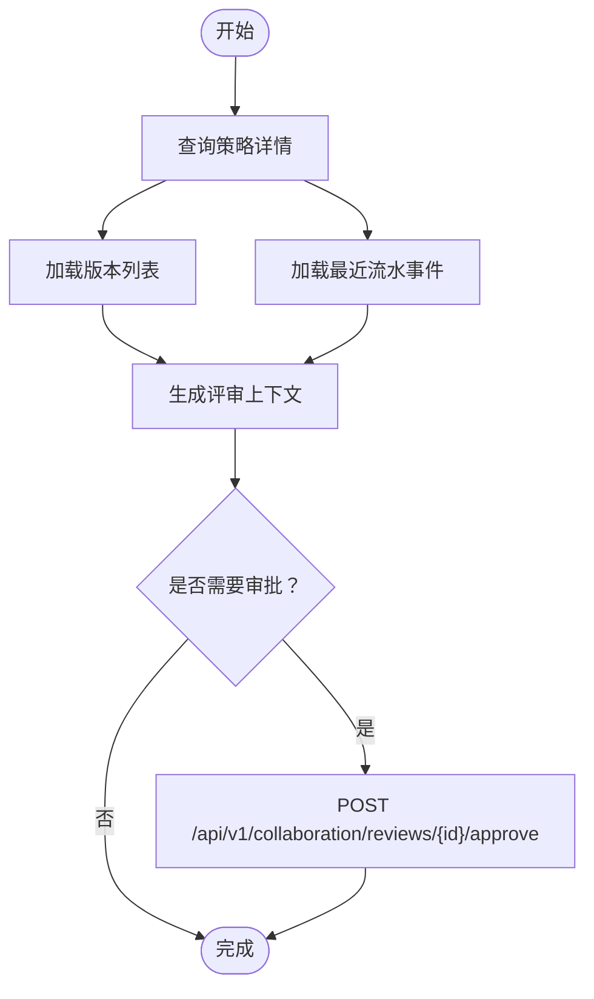
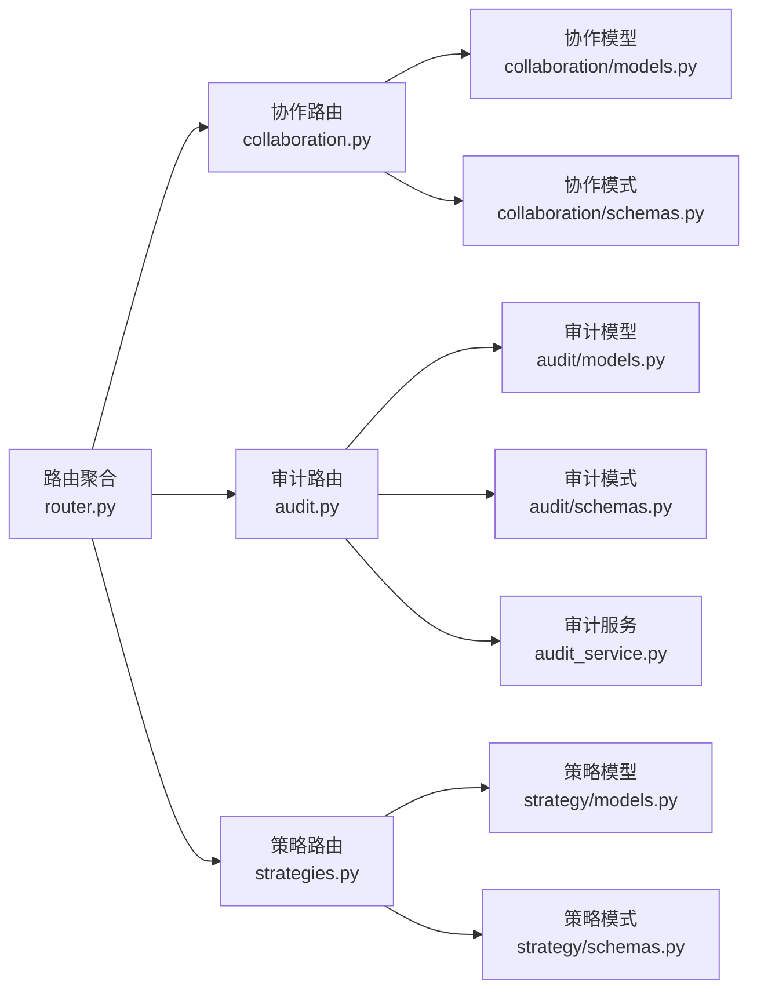

# 协作 API

<cite>
**本文引用的文件**
- [backend/app/api/v1/collaboration.py](file://backend/app/api/v1/collaboration.py)
- [backend/app/domains/collaboration/models.py](file://backend/app/domains/collaboration/models.py)
- [backend/app/domains/collaboration/schemas.py](file://backend/app/domains/collaboration/schemas.py)
- [backend/app/api/v1/router.py](file://backend/app/api/v1/router.py)
- [backend/app/api/v1/audit.py](file://backend/app/api/v1/audit.py)
- [backend/app/domains/audit/models.py](file://backend/app/domains/audit/models.py)
- [backend/app/domains/audit/schemas.py](file://backend/app/domains/audit/schemas.py)
- [backend/app/services/audit_service.py](file://backend/app/services/audit_service.py)
- [backend/app/api/v1/strategies.py](file://backend/app/api/v1/strategies.py)
- [backend/app/domains/strategy/models.py](file://backend/app/domains/strategy/models.py)
- [backend/app/domains/strategy/schemas.py](file://backend/app/domains/strategy/schemas.py)
- [frontend/src/screens/Collaboration/index.tsx](file://frontend/src/screens/Collaboration/index.tsx)
- [frontend/src/contexts/CollaborationContext.tsx](file://frontend/src/contexts/CollaborationContext.tsx)
</cite>

## 目录
1. [简介](#简介)
2. [项目结构](#项目结构)
3. [核心组件](#核心组件)
4. [架构总览](#架构总览)
5. [详细组件分析](#详细组件分析)
6. [依赖分析](#依赖分析)
7. [性能考虑](#性能考虑)
8. [故障排查指南](#故障排查指南)
9. [结论](#结论)
10. [附录](#附录)

## 简介
本文件系统化梳理协作 API 的设计与实现，覆盖多人协作、版本比较、审批流程与评论系统等核心能力。文档基于后端 FastAPI 路由与领域模型，结合前端上下文与屏幕组件，给出接口定义、数据模型、工作流与权限控制要点，并提供变更追踪与冲突解决的实践建议。

## 项目结构
协作 API 位于后端 v1 路由下，采用“路由聚合 + 领域模型 + Pydantic 序列化”的分层设计；前端通过 React 上下文与屏幕组件消费协作数据。

图表来源
- [backend/app/api/v1/router.py:1-40](file://backend/app/api/v1/router.py#L1-L40)
- [backend/app/api/v1/collaboration.py:1-112](file://backend/app/api/v1/collaboration.py#L1-L112)
- [backend/app/api/v1/audit.py:1-258](file://backend/app/api/v1/audit.py#L1-L258)
- [backend/app/api/v1/strategies.py:1-605](file://backend/app/api/v1/strategies.py#L1-L605)
- [backend/app/domains/collaboration/models.py:1-44](file://backend/app/domains/collaboration/models.py#L1-L44)
- [backend/app/domains/collaboration/schemas.py:1-88](file://backend/app/domains/collaboration/schemas.py#L1-L88)
- [backend/app/domains/audit/models.py:1-51](file://backend/app/domains/audit/models.py#L1-L51)
- [backend/app/domains/audit/schemas.py:1-53](file://backend/app/domains/audit/schemas.py#L1-L53)
- [frontend/src/screens/Collaboration/index.tsx:1-47](file://frontend/src/screens/Collaboration/index.tsx#L1-L47)
- [frontend/src/contexts/CollaborationContext.tsx:1-13](file://frontend/src/contexts/CollaborationContext.tsx#L1-L13)

章节来源
- [backend/app/api/v1/router.py:1-40](file://backend/app/api/v1/router.py#L1-L40)
- [backend/app/api/v1/collaboration.py:1-112](file://backend/app/api/v1/collaboration.py#L1-L112)
- [frontend/src/screens/Collaboration/index.tsx:1-47](file://frontend/src/screens/Collaboration/index.tsx#L1-L47)

## 核心组件
- 协作路由与视图：提供协作看板概览与评审审批接口，返回 KPI、活动评审、差异面板、评审线程、A/B 测试与审批流程等聚合数据。
- 审计路由与服务：提供审计日志列表、统计、工具注册表、HITL 规则、哈希链校验与导出能力，支撑变更可追溯与合规。
- 策略路由与模型：提供策略生命周期、版本、任务与流水事件，为协作中的评审与审批提供上下文数据。
- 前端协作屏幕：以 React 组件消费协作数据，通过上下文暴露给子组件使用。

章节来源
- [backend/app/api/v1/collaboration.py:94-112](file://backend/app/api/v1/collaboration.py#L94-L112)
- [backend/app/api/v1/audit.py:153-258](file://backend/app/api/v1/audit.py#L153-L258)
- [backend/app/api/v1/strategies.py:162-280](file://backend/app/api/v1/strategies.py#L162-L280)
- [frontend/src/screens/Collaboration/index.tsx:18-46](file://frontend/src/screens/Collaboration/index.tsx#L18-L46)

## 架构总览
协作 API 通过统一路由聚合器挂载至 /api/v1，协作模块提供协作看板与评审审批接口；审计模块提供合规与追踪能力；策略模块提供评审上下文与版本信息；前端通过上下文与屏幕组件消费数据。

图表来源
- [frontend/src/screens/Collaboration/index.tsx:21-25](file://frontend/src/screens/Collaboration/index.tsx#L21-L25)
- [backend/app/api/v1/collaboration.py:94-105](file://backend/app/api/v1/collaboration.py#L94-L105)
- [frontend/src/contexts/CollaborationContext.tsx:4-12](file://frontend/src/contexts/CollaborationContext.tsx#L4-L12)

## 详细组件分析

### 协作路由与数据模型
- 路由与端点
  - GET /api/v1/collaboration/overview：返回协作看板聚合数据（KPI、活动评审、差异面板、评审线程、A/B 测试、审批流程、页脚卡片）。
  - POST /api/v1/collaboration/reviews/{review_id}/approve：审批评审（示例接口，返回状态）。
- 数据模型与序列化
  - 协作领域模型：包含评审请求、评审决策、A/B 测试等实体。
  - 协作模式：KPI、评审者、活动评审、差异行/面板、评审线程项、A/B 测试输出、审批流程阶段、页脚卡片等。
- 前端集成
  - 屏幕组件按区域渲染：活动评审、版本差异、评审线程、A/B 测试网格、审批流程与页脚卡片。
  - 使用协作上下文在组件树内共享数据。

图表来源
- [backend/app/domains/collaboration/models.py:9-44](file://backend/app/domains/collaboration/models.py#L9-L44)
- [backend/app/domains/collaboration/schemas.py:6-88](file://backend/app/domains/collaboration/schemas.py#L6-L88)

章节来源
- [backend/app/api/v1/collaboration.py:94-112](file://backend/app/api/v1/collaboration.py#L94-L112)
- [backend/app/domains/collaboration/models.py:9-44](file://backend/app/domains/collaboration/models.py#L9-L44)
- [backend/app/domains/collaboration/schemas.py:6-88](file://backend/app/domains/collaboration/schemas.py#L6-L88)
- [frontend/src/screens/Collaboration/index.tsx:18-46](file://frontend/src/screens/Collaboration/index.tsx#L18-L46)
- [frontend/src/contexts/CollaborationContext.tsx:4-12](file://frontend/src/contexts/CollaborationContext.tsx#L4-L12)

### 审计与合规（变更追踪与不可篡改）
- 路由能力
  - GET /api/v1/audit/overview：返回审计 KPI、日志行、演员统计、工具注册表与 HITL 规则。
  - GET /api/v1/audit/logs：分页查询审计日志，支持按演员类型与动作过滤。
  - GET /api/v1/audit/actor-stats：按频率统计演员操作次数。
  - GET /api/v1/audit/verify：验证最近 N 条审计日志的 SHA-256 哈希链完整性。
  - GET /api/v1/audit/export：导出审计日志为 CSV。
  - GET /api/v1/audit/registry：返回启用的工具注册表。
  - GET /api/v1/audit/hitl-rules：返回 HITL 政策规则。
- 模型与服务
  - 审计日志模型：不可变追加写入，包含演员、动作、资源、结果、置信度、详情、追踪 ID、IP 地址及前后哈希字段。
  - 审计服务：负责计算哈希链、追加日志与校验链路完整性。
- 工作流意义
  - 为协作中的评审、审批与策略变更提供不可篡改的审计轨迹，满足合规要求。

图表来源
- [backend/app/api/v1/audit.py:198-212](file://backend/app/api/v1/audit.py#L198-L212)
- [backend/app/services/audit_service.py:83-109](file://backend/app/services/audit_service.py#L83-L109)

章节来源
- [backend/app/api/v1/audit.py:153-258](file://backend/app/api/v1/audit.py#L153-L258)
- [backend/app/domains/audit/models.py:9-27](file://backend/app/domains/audit/models.py#L9-L27)
- [backend/app/domains/audit/schemas.py:6-53](file://backend/app/domains/audit/schemas.py#L6-L53)
- [backend/app/services/audit_service.py:32-109](file://backend/app/services/audit_service.py#L32-L109)

### 策略生命周期与评审上下文
- 路由能力
  - GET /api/v1/strategies/overview：返回策略工厂看板数据（流水线状态、模板、消息流、矩阵、流水板）。
  - GET /api/v1/strategies/{strategy_id}：返回策略详情（含版本与最近流水事件）。
  - POST /api/v1/strategies/{strategy_id}/transition：推动策略进入下一阶段。
  - GET /api/v1/strategies/{strategy_id}/events：返回策略流水事件。
- 模型与模式
  - 策略主表、版本、任务、流水事件与模板。
  - 策略屏幕、任务输出、事件输出、版本输出、详情与列表等模式。
- 协作关联
  - 评审与审批通常围绕策略版本展开；策略详情中的版本与事件为评审提供上下文。

图表来源
- [backend/app/api/v1/strategies.py:463-510](file://backend/app/api/v1/strategies.py#L463-L510)
- [backend/app/api/v1/strategies.py:449-461](file://backend/app/api/v1/strategies.py#L449-L461)
- [backend/app/domains/strategy/models.py:9-84](file://backend/app/domains/strategy/models.py#L9-L84)
- [backend/app/domains/strategy/schemas.py:143-167](file://backend/app/domains/strategy/schemas.py#L143-L167)

章节来源
- [backend/app/api/v1/strategies.py:162-280](file://backend/app/api/v1/strategies.py#L162-L280)
- [backend/app/api/v1/strategies.py:422-447](file://backend/app/api/v1/strategies.py#L422-L447)
- [backend/app/api/v1/strategies.py:449-461](file://backend/app/api/v1/strategies.py#L449-L461)
- [backend/app/domains/strategy/models.py:9-84](file://backend/app/domains/strategy/models.py#L9-L84)
- [backend/app/domains/strategy/schemas.py:143-167](file://backend/app/domains/strategy/schemas.py#L143-L167)

### 前端协作屏幕与上下文
- 屏幕组件
  - 加载协作概览数据并渲染多个区域：活动评审、版本差异、评审线程、A/B 测试网格、审批流程与页脚卡片。
- 上下文
  - 使用 React Context 将协作数据注入子组件，确保跨层级访问一致性。

章节来源
- [frontend/src/screens/Collaboration/index.tsx:18-46](file://frontend/src/screens/Collaboration/index.tsx#L18-L46)
- [frontend/src/contexts/CollaborationContext.tsx:4-12](file://frontend/src/contexts/CollaborationContext.tsx#L4-L12)

## 依赖分析
- 路由聚合
  - 路由聚合器 include_router 将协作、审计、策略等模块挂载到统一前缀下，便于扩展与维护。
- 协作模块内部
  - 路由依赖 SQLAlchemy 异步会话进行数据查询；返回数据由 Pydantic 模式序列化，保证前后端契约一致。
- 审计模块内部
  - 服务层负责哈希链计算与校验，模型层定义不可变审计日志结构，路由层提供对外接口。
- 策略模块内部
  - 路由层提供策略生命周期管理与事件查询，模型层定义版本与任务等实体，模式层定义输出结构。

图表来源
- [backend/app/api/v1/router.py:25-40](file://backend/app/api/v1/router.py#L25-L40)
- [backend/app/api/v1/collaboration.py:1-20](file://backend/app/api/v1/collaboration.py#L1-L20)
- [backend/app/api/v1/audit.py:1-25](file://backend/app/api/v1/audit.py#L1-L25)
- [backend/app/api/v1/strategies.py:1-45](file://backend/app/api/v1/strategies.py#L1-L45)

章节来源
- [backend/app/api/v1/router.py:25-40](file://backend/app/api/v1/router.py#L25-L40)
- [backend/app/api/v1/collaboration.py:1-20](file://backend/app/api/v1/collaboration.py#L1-L20)
- [backend/app/api/v1/audit.py:1-25](file://backend/app/api/v1/audit.py#L1-L25)
- [backend/app/api/v1/strategies.py:1-45](file://backend/app/api/v1/strategies.py#L1-L45)

## 性能考虑
- 分页与限制
  - 审计日志查询支持 limit 与 offset，避免一次性拉取大量数据。
- 前端缓存与懒加载
  - 协作屏幕在首次渲染时请求概览数据，后续可按需刷新或局部更新。
- 数据序列化
  - 使用 Pydantic 模式进行序列化，减少前端类型转换开销。
- 并发与后台任务
  - 策略生成与流水线执行采用异步会话与后台任务，避免阻塞主线程。

## 故障排查指南
- 审计链校验失败
  - 使用 /api/v1/audit/verify 获取链路完整性状态与首个异常项 ID，定位问题批次。
- 审计日志导出
  - 使用 /api/v1/audit/export 导出 CSV，用于离线分析与归档。
- 审计日志筛选
  - 使用 /api/v1/audit/logs 的 actor_type 与 action 参数快速定位特定事件。
- 协作概览加载失败
  - 检查协作路由 /api/v1/collaboration/overview 是否返回预期数据结构；核对前端上下文是否正确提供数据。

章节来源
- [backend/app/api/v1/audit.py:198-245](file://backend/app/api/v1/audit.py#L198-L245)
- [frontend/src/screens/Collaboration/index.tsx:21-25](file://frontend/src/screens/Collaboration/index.tsx#L21-L25)

## 结论
协作 API 通过清晰的路由分层、严谨的数据模型与模式、以及完善的审计与合规能力，为团队协作提供了可追溯、可审计、可扩展的接口基础。配合前端上下文与屏幕组件，能够高效支撑评审、审批、版本比较与 A/B 测试等关键场景。

## 附录

### 接口清单与规范
- 协作
  - GET /api/v1/collaboration/overview：返回协作看板聚合数据。
  - POST /api/v1/collaboration/reviews/{review_id}/approve：审批评审。
- 审计
  - GET /api/v1/audit/overview：返回审计看板数据。
  - GET /api/v1/audit/logs：分页查询审计日志。
  - GET /api/v1/audit/actor-stats：演员统计。
  - GET /api/v1/audit/verify：哈希链校验。
  - GET /api/v1/audit/export：导出审计日志。
  - GET /api/v1/audit/registry：工具注册表。
  - GET /api/v1/audit/hitl-rules：HITL 规则。
- 策略
  - GET /api/v1/strategies/overview：策略工厂看板。
  - GET /api/v1/strategies/{strategy_id}：策略详情。
  - POST /api/v1/strategies/{strategy_id}/transition：推进策略阶段。
  - GET /api/v1/strategies/{strategy_id}/events：策略事件。

章节来源
- [backend/app/api/v1/collaboration.py:94-112](file://backend/app/api/v1/collaboration.py#L94-L112)
- [backend/app/api/v1/audit.py:153-258](file://backend/app/api/v1/audit.py#L153-L258)
- [backend/app/api/v1/strategies.py:162-280](file://backend/app/api/v1/strategies.py#L162-L280)