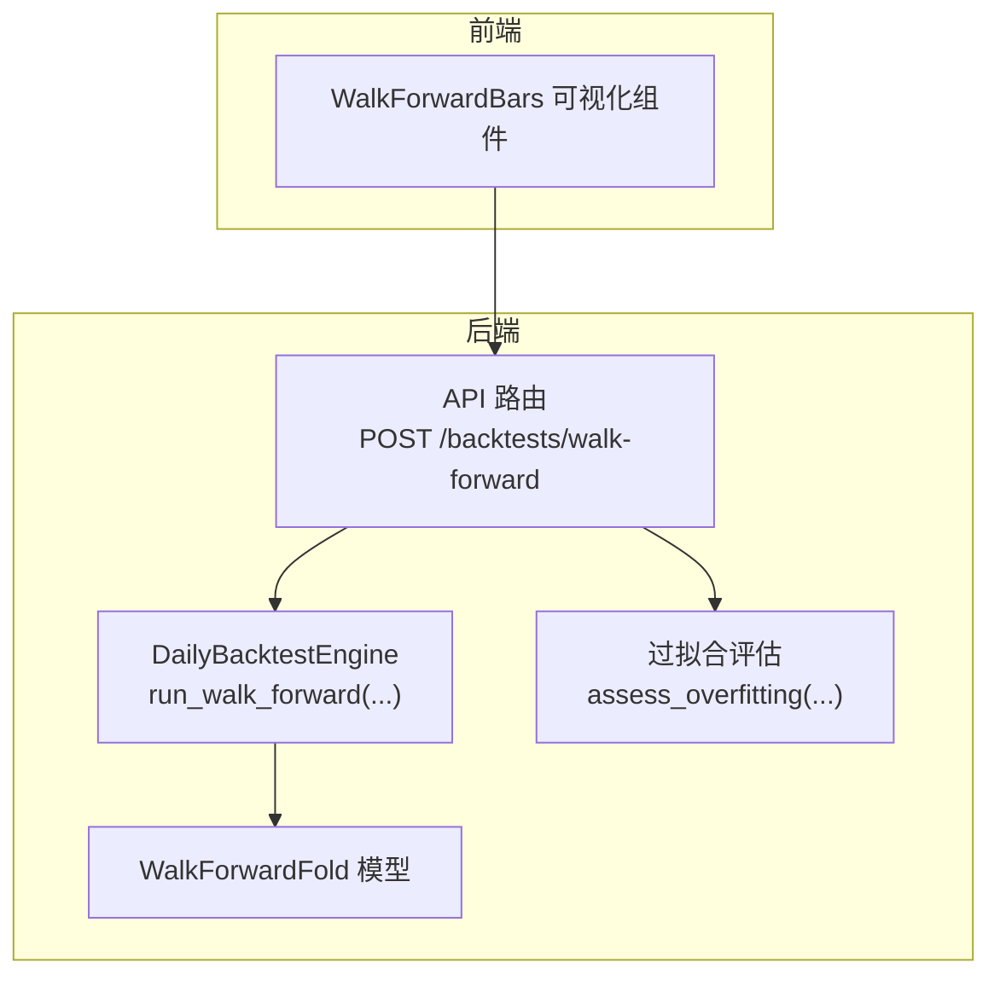
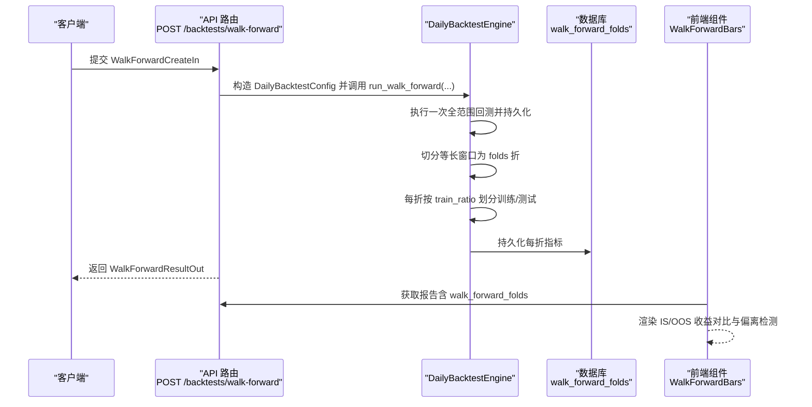
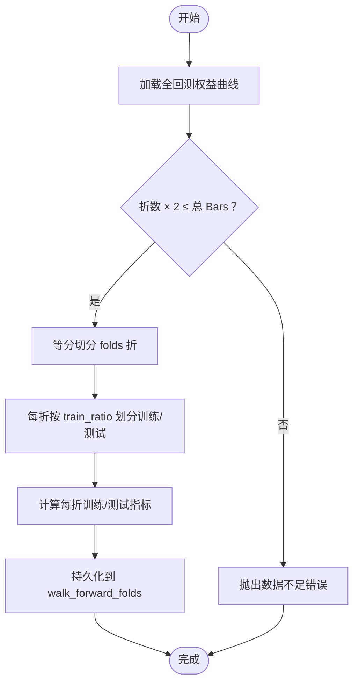
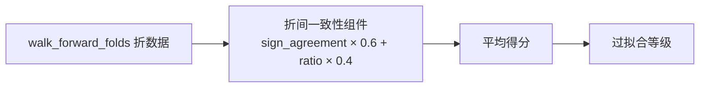
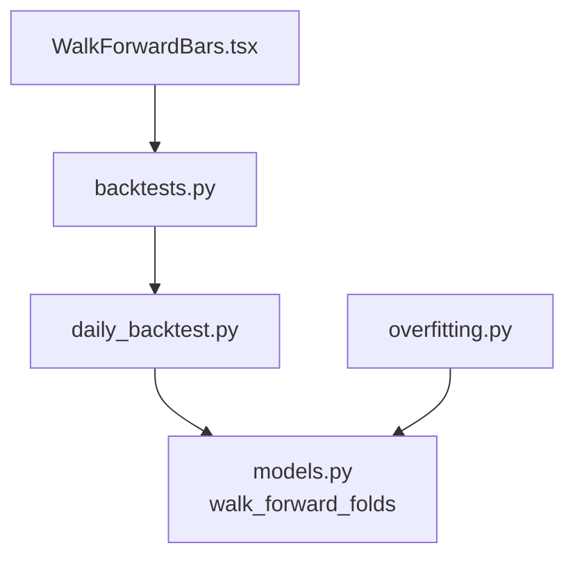

# Walk-forward 验证

<cite>
**本文引用的文件**
- [backtests.py](file://backend/app/api/v1/backtests.py)
- [daily_backtest.py](file://backend/app/services/daily_backtest.py)
- [schemas.py](file://backend/app/domains/backtest/schemas.py)
- [models.py](file://backend/app/domains/backtest/models.py)
- [65eb0814322d_walk_forward_folds.py](file://backend/app/db/migrations/versions/65eb0814322d_walk_forward_folds.py)
- [overfitting.py](file://backend/app/services/overfitting.py)
- [test_daily_backtest.py](file://backend/tests/services/test_daily_backtest.py)
- [WalkForwardBars.tsx](file://frontend/src/screens/Backtest/WalkForwardBars.tsx)
</cite>

## 目录
1. [简介](#简介)
2. [项目结构](#项目结构)
3. [核心组件](#核心组件)
4. [架构总览](#架构总览)
5. [详细组件分析](#详细组件分析)
6. [依赖关系分析](#依赖关系分析)
7. [性能考量](#性能考量)
8. [故障排查指南](#故障排查指南)
9. [结论](#结论)
10. [附录](#附录)

## 简介
本文件系统性阐述 Walk-forward（滚动窗口）验证在本项目的实现与使用方式，包括请求/响应结构、训练集/测试集划分策略、交叉验证机制、时间序列验证与样本外测试、过拟合检测与稳定性评估，以及完整的验证流程、参数配置与结果解读方法。目标是帮助开发者正确实施 Walk-forward 验证，并将其融入到策略开发与评估流程中。

## 项目结构
Walk-forward 验证涉及后端 API、服务层、领域模型与前端展示组件，关键文件如下：
- 后端 API：定义请求/响应模型与路由，负责接收请求并调用服务层执行 Walk-forward 分析。
- 服务层：实现单次全范围回测后切片为多个 Fold 的训练/测试窗口，并计算指标。
- 领域模型与数据库：持久化 Walk-forward 折信息与相关指标。
- 过拟合评估：基于 Walk-forward 折间一致性打分，辅助稳定性评估。
- 前端组件：消费 Walk-forward 折结果并可视化展示。

图表来源
- [backtests.py:540-590](file://backend/app/api/v1/backtests.py#L540-L590)
- [daily_backtest.py:373-452](file://backend/app/services/daily_backtest.py#L373-L452)
- [models.py:95-119](file://backend/app/domains/backtest/models.py#L95-L119)
- [overfitting.py:129-168](file://backend/app/services/overfitting.py#L129-L168)
- [WalkForwardBars.tsx:1-81](file://frontend/src/screens/Backtest/WalkForwardBars.tsx#L1-L81)

章节来源
- [backtests.py:540-590](file://backend/app/api/v1/backtests.py#L540-L590)
- [daily_backtest.py:373-452](file://backend/app/services/daily_backtest.py#L373-L452)
- [schemas.py:315-336](file://backend/app/domains/backtest/schemas.py#L315-L336)
- [models.py:95-119](file://backend/app/domains/backtest/models.py#L95-L119)
- [65eb0814322d_walk_forward_folds.py:34-56](file://backend/app/db/migrations/versions/65eb0814322d_walk_forward_folds.py#L34-L56)
- [overfitting.py:87-106](file://backend/app/services/overfitting.py#L87-L106)
- [WalkForwardBars.tsx:1-81](file://frontend/src/screens/Backtest/WalkForwardBars.tsx#L1-L81)

## 核心组件
- 请求模型：WalkForwardCreateIn
  - 字段：universe、startDate、endDate、strategyName、initialCash、strategyParams、costConfig、folds、trainRatio
  - 参数约束：folds ≥ 2；0.1 ≤ trainRatio < 1.0
- 响应模型：WalkForwardResultOut
  - 字段：taskId、runId、aggregate（聚合指标）、folds（每折指标）
  - 折指标：foldIndex、trainStart/trainEnd、testStart/testEnd、trainReturn/testReturn、trainSharpe/testSharpe、trainMaxDd/testMaxDd
- 服务层：DailyBacktestEngine.run_walk_forward(...)
  - 先执行一次全范围回测并持久化
  - 将等分的时间窗口切分为若干 Fold
  - 每折内按 trainRatio 划分训练/测试窗口
  - 计算每折训练/测试指标并持久化到 walk_forward_folds 表
- 数据库表：walk_forward_folds
  - 存储每折的起止日期、训练/测试收益、夏普比率、最大回撤及训练参数 JSON
- 过拟合评估：基于折间一致性打分
  - 使用折间收益方向一致性与幅度比例综合评分
- 前端展示：WalkForwardBars
  - 展示每折 IS（训练）与 OOS（测试）收益对比，识别偏离折

章节来源
- [schemas.py:315-336](file://backend/app/domains/backtest/schemas.py#L315-L336)
- [daily_backtest.py:373-452](file://backend/app/services/daily_backtest.py#L373-L452)
- [models.py:95-119](file://backend/app/domains/backtest/models.py#L95-L119)
- [65eb0814322d_walk_forward_folds.py:34-56](file://backend/app/db/migrations/versions/65eb0814322d_walk_forward_folds.py#L34-L56)
- [overfitting.py:87-106](file://backend/app/services/overfitting.py#L87-L106)
- [WalkForwardBars.tsx:1-81](file://frontend/src/screens/Backtest/WalkForwardBars.tsx#L1-L81)

## 架构总览
下图展示了从 API 到服务层再到数据库与前端的整体交互流程。

图表来源
- [backtests.py:540-590](file://backend/app/api/v1/backtests.py#L540-L590)
- [daily_backtest.py:373-452](file://backend/app/services/daily_backtest.py#L373-L452)
- [models.py:95-119](file://backend/app/domains/backtest/models.py#L95-L119)
- [WalkForwardBars.tsx:1-81](file://frontend/src/screens/Backtest/WalkForwardBars.tsx#L1-L81)

## 详细组件分析

### 请求格式：WalkForwardCreateIn
- 字段与含义
  - universe：标的集合
  - startDate/endDate：回测时间范围
  - strategyName：策略名称
  - initialCash：初始资金
  - strategyParams：策略参数字典
  - costConfig：交易成本配置（佣金率、最低佣金、印花税、滑点 bps）
  - folds：折数（≥2）
  - trainRatio：训练集占比（0.1≤trainRatio<1.0）
- 约束与校验
  - folds 必须 ≥ 2
  - trainRatio 必须在 [0.1, 1.0)
  - 时间范围与标的数据需满足最小折数要求（见“故障排查”）

章节来源
- [schemas.py:315-327](file://backend/app/domains/backtest/schemas.py#L315-L327)

### 响应结构：WalkForwardResultOut
- 字段与含义
  - taskId/runId：任务与运行标识
  - aggregate：全回测聚合指标（累计收益、年化收益、最大回撤、夏普比率、胜率、换手率等）
  - folds：每折指标列表
    - foldIndex：折序号
    - trainStart/trainEnd/testStart/testEnd：训练/测试窗口日期
    - trainReturn/testReturn：训练/测试累计收益
    - trainSharpe/testSharpe：训练/测试夏普比率
    - trainMaxDd/testMaxDd：训练/测试最大回撤
- 数据来源
  - aggregate 来自全回测结果
  - folds 来自持久化的 walk_forward_folds 表

章节来源
- [schemas.py:329-336](file://backend/app/domains/backtest/schemas.py#L329-L336)
- [models.py:95-119](file://backend/app/domains/backtest/models.py#L95-L119)

### 训练集/测试集划分策略与交叉验证机制
- 划分策略
  - 先执行一次全范围回测，得到完整等时序的权益曲线
  - 将权益曲线等分切为 folds 折
  - 每折内部按 trainRatio 划分训练与测试窗口
- 交叉验证机制
  - 本实现采用“折内 OOS 报告”，即同一参数在各折上分别进行训练/测试，不进行逐折参数优化
  - 通过折间收益一致性与指标稳定性评估策略鲁棒性
- 关键边界处理
  - 折内训练集至少保留 1 根 K 线
  - 折内训练/测试窗口严格满足：train_end < test_start
  - 若折数过多导致每折过短，将触发数据不足错误

图表来源
- [daily_backtest.py:373-452](file://backend/app/services/daily_backtest.py#L373-L452)
- [test_daily_backtest.py:305-319](file://backend/tests/services/test_daily_backtest.py#L305-L319)

章节来源
- [daily_backtest.py:373-452](file://backend/app/services/daily_backtest.py#L373-L452)
- [test_daily_backtest.py:287-303](file://backend/tests/services/test_daily_backtest.py#L287-L303)

### 时间序列验证、样本外测试与过拟合检测
- 时间序列验证
  - 通过等时序切分确保训练/测试窗口严格前后顺序，避免未来信息泄露
- 样本外测试（OOS）
  - 每折测试期独立于训练期，测试收益与指标用于评估策略在新环境中的表现
- 过拟合检测
  - 折间一致性：收益方向一致性与幅度比例综合评分
  - 该评分作为 overfit_level 的依据之一，结合 IS/OOS 夏普比率与最大回撤一致性共同评估

图表来源
- [overfitting.py:87-106](file://backend/app/services/overfitting.py#L87-L106)
- [models.py:95-119](file://backend/app/domains/backtest/models.py#L95-L119)

章节来源
- [overfitting.py:87-106](file://backend/app/services/overfitting.py#L87-L106)
- [models.py:95-119](file://backend/app/domains/backtest/models.py#L95-L119)

### 完整验证流程说明
- 步骤
  1) 客户端提交 WalkForwardCreateIn
  2) API 路由构造 DailyBacktestConfig 并调用 DailyBacktestEngine.run_walk_forward(...)
  3) 引擎执行一次全范围回测并持久化任务、运行、指标与权益曲线
  4) 引擎切分等长窗口为 folds 折，计算每折训练/测试指标并持久化到 walk_forward_folds
  5) API 返回 WalkForwardResultOut（包含 aggregate 与 folds）
  6) 前端组件消费并渲染折间 IS/OOS 对比与偏离检测
  7) 可选：调用过拟合评估，获得 overfit_level 与组件明细

章节来源
- [backtests.py:540-590](file://backend/app/api/v1/backtests.py#L540-L590)
- [daily_backtest.py:373-452](file://backend/app/services/daily_backtest.py#L373-L452)
- [WalkForwardBars.tsx:1-81](file://frontend/src/screens/Backtest/WalkForwardBars.tsx#L1-L81)

### 参数配置指南
- folds（折数）
  - 建议范围：2–20（默认 4）
  - 折数越多，越能体现策略在不同时间段的表现，但需保证每折至少有足够 Bars
- train_ratio（训练集占比）
  - 建议范围：0.1–0.9（默认 0.7）
  - 较小的训练集更接近“滚动 OOS”特性，但可能增加估计噪声
- 其他通用参数
  - universe、startDate、endDate、strategyName、initialCash、strategyParams、costConfig
  - 注意：当 folds 设置过大时，需确保总 Bars ≥ folds × 2

章节来源
- [schemas.py:325-326](file://backend/app/domains/backtest/schemas.py#L325-L326)
- [daily_backtest.py:389-392](file://backend/app/services/daily_backtest.py#L389-L392)

### 结果解读方法
- aggregate
  - 用于总体评估策略在全回测期内的表现
- folds
  - 每折的 trainReturn/testReturn、trainSharpe/testSharpe、trainMaxDd/testMaxDd
  - 前端 WalkForwardBars 会比较每折 IS 与 OOS 收益，标记偏离折（方向相反或绝对差超过阈值）
- 过拟合评估
  - 折间一致性评分越高，策略在不同时间段表现越稳定
  - 结合 IS/OOS 夏普比率与最大回撤一致性综合判断策略稳健性

章节来源
- [schemas.py:329-336](file://backend/app/domains/backtest/schemas.py#L329-L336)
- [WalkForwardBars.tsx:7-17](file://frontend/src/screens/Backtest/WalkForwardBars.tsx#L7-L17)
- [overfitting.py:87-106](file://backend/app/services/overfitting.py#L87-L106)

## 依赖关系分析
- API 依赖服务层：API 路由调用 DailyBacktestEngine.run_walk_forward(...)
- 服务层依赖数据库：持久化 WalkForwardFold 折数据
- 前端依赖 API：获取 WalkForwardResultOut 中的 folds
- 过拟合评估依赖折数据：从数据库查询 walk_forward_folds 并计算折间一致性

图表来源
- [backtests.py:540-590](file://backend/app/api/v1/backtests.py#L540-L590)
- [daily_backtest.py:373-452](file://backend/app/services/daily_backtest.py#L373-L452)
- [models.py:95-119](file://backend/app/domains/backtest/models.py#L95-L119)
- [WalkForwardBars.tsx:1-81](file://frontend/src/screens/Backtest/WalkForwardBars.tsx#L1-L81)
- [overfitting.py:129-168](file://backend/app/services/overfitting.py#L129-L168)

章节来源
- [backtests.py:540-590](file://backend/app/api/v1/backtests.py#L540-L590)
- [daily_backtest.py:373-452](file://backend/app/services/daily_backtest.py#L373-L452)
- [models.py:95-119](file://backend/app/domains/backtest/models.py#L95-L119)
- [overfitting.py:129-168](file://backend/app/services/overfitting.py#L129-L168)
- [WalkForwardBars.tsx:1-81](file://frontend/src/screens/Backtest/WalkForwardBars.tsx#L1-L81)

## 性能考量
- 计算复杂度
  - 单次全范围回测的时间复杂度与 Bars 数成正比
  - 折切分与指标计算为线性遍历，整体开销可控
- 数据存储
  - 每折指标写入 walk_forward_folds，索引 on run_id/fold_index 便于查询
- 前端渲染
  - 折间收益对比与偏离检测为 O(n) 计算，UI 渲染轻量

[本节为通用建议，无需特定文件来源]

## 故障排查指南
- 错误：折数过多导致每折 Bars 不足
  - 现象：抛出“need at least folds×2 bars for N-fold walk-forward”类错误
  - 处理：减少 folds 或延长回测时间范围，确保总 Bars ≥ folds × 2
- 错误：folds < 2
  - 现象：参数校验失败
  - 处理：设置 folds ≥ 2
- 错误：train_ratio 不在 [0.1, 1.0)
  - 现象：参数校验失败
  - 处理：调整 train_ratio 至合法区间
- 测试用例参考
  - 折数与窗口顺序校验
  - 数据不足场景的错误抛出

章节来源
- [daily_backtest.py:389-401](file://backend/app/services/daily_backtest.py#L389-L401)
- [test_daily_backtest.py:287-303](file://backend/tests/services/test_daily_backtest.py#L287-L303)
- [test_daily_backtest.py:305-319](file://backend/tests/services/test_daily_backtest.py#L305-L319)

## 结论
本 Walk-forward 验证方案通过“折内 OOS 报告”的方式，在不引入逐折参数优化的前提下，实现了时间序列严格验证与跨时间段稳定性评估。配合过拟合评估与前端可视化，能够有效识别策略在不同市场阶段的一致性与潜在过拟合风险，为策略迭代与上线决策提供可靠依据。

[本节为总结性内容，无需特定文件来源]

## 附录

### 数据库表结构：walk_forward_folds
- 关键字段
  - run_id：关联父回测运行
  - fold_index：折序号
  - train_start/train_end/test_start/test_end：训练/测试窗口日期
  - train_return/test_return：训练/测试累计收益
  - train_sharpe/test_sharpe：训练/测试夏普比率
  - train_max_dd/test_max_dd：训练/测试最大回撤
  - train_params_json：训练参数 JSON（预留）
- 索引
  - run_id、fold_index

章节来源
- [models.py:95-119](file://backend/app/domains/backtest/models.py#L95-L119)
- [65eb0814322d_walk_forward_folds.py:34-56](file://backend/app/db/migrations/versions/65eb0814322d_walk_forward_folds.py#L34-L56)

### API 路由与响应映射
- 路由：POST /backtests/walk-forward
- 请求体：WalkForwardCreateIn
- 响应体：WalkForwardResultOut
- 错误处理：参数非法或数据不足时返回 400

章节来源
- [backtests.py:540-590](file://backend/app/api/v1/backtests.py#L540-L590)