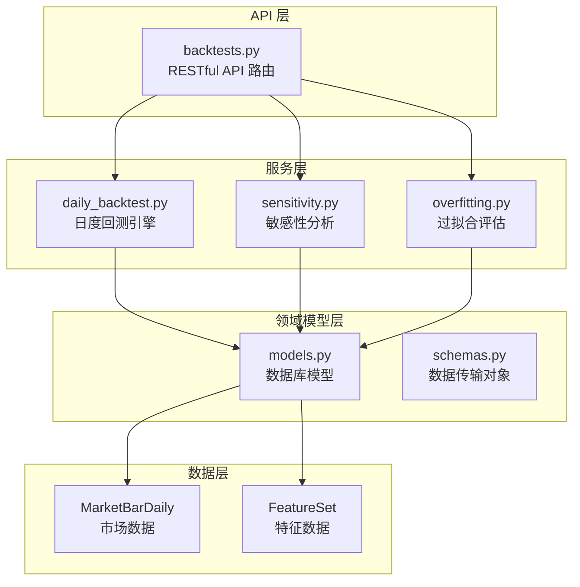
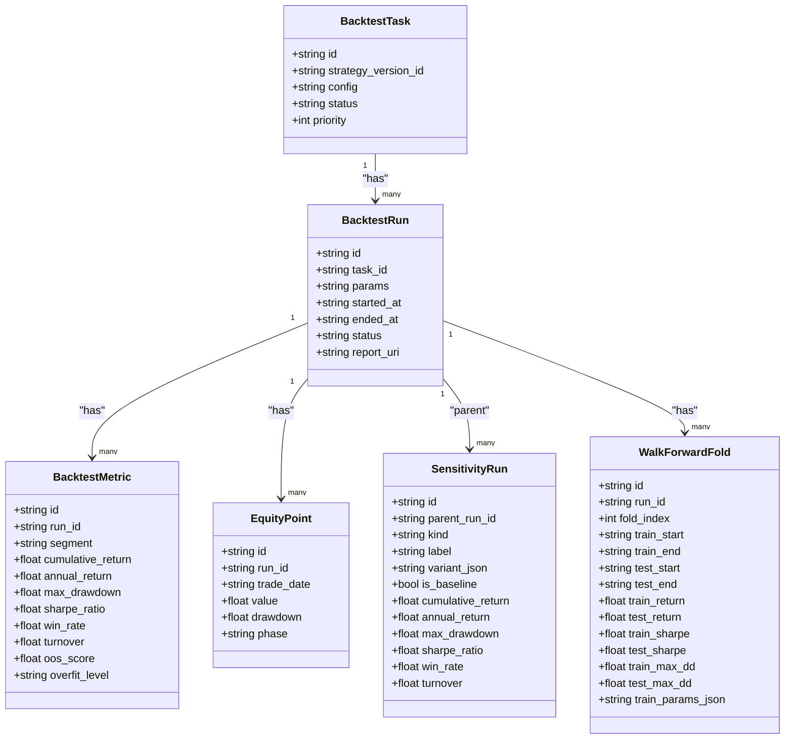
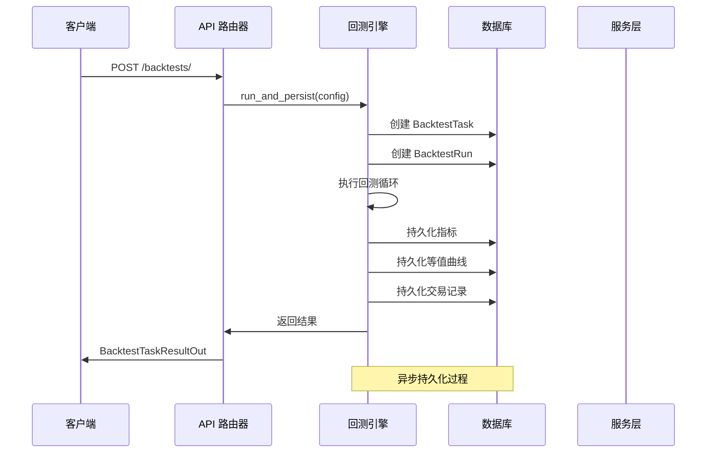
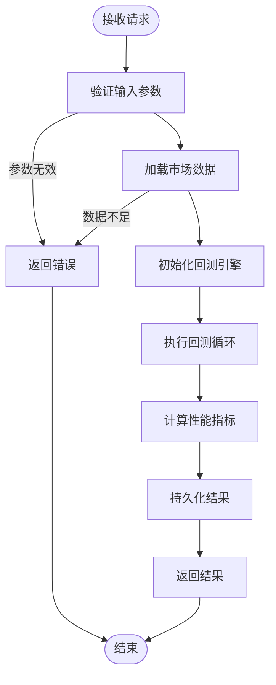
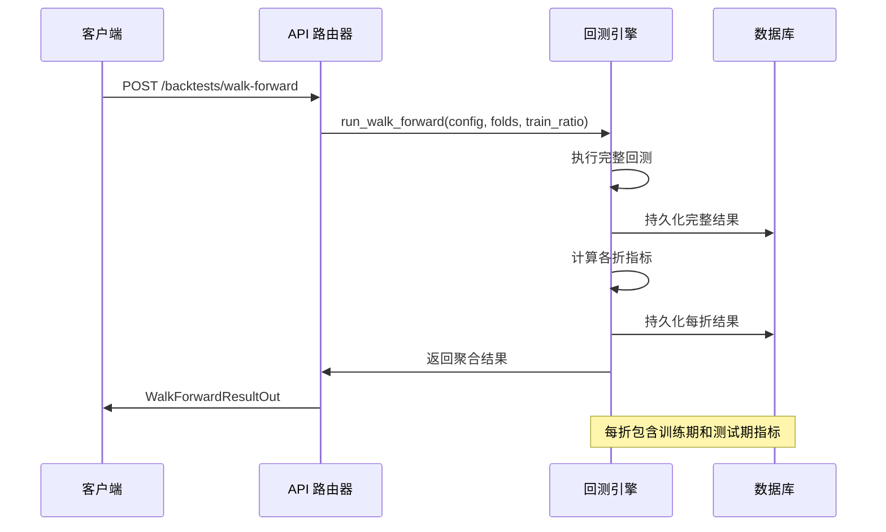
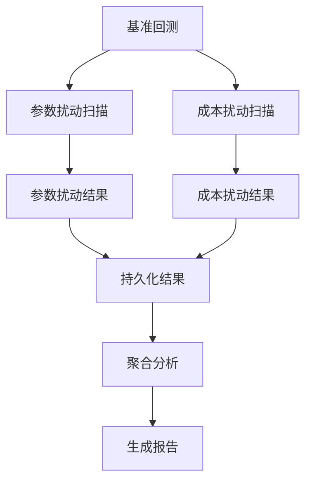
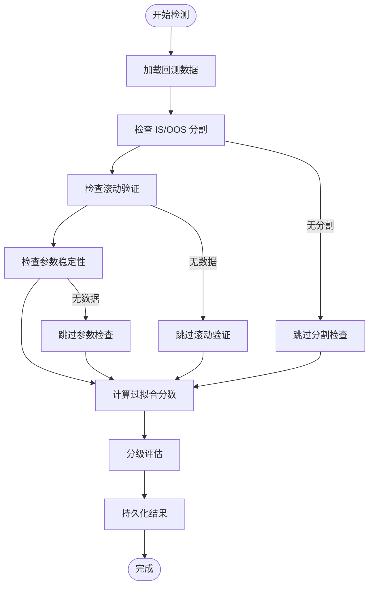
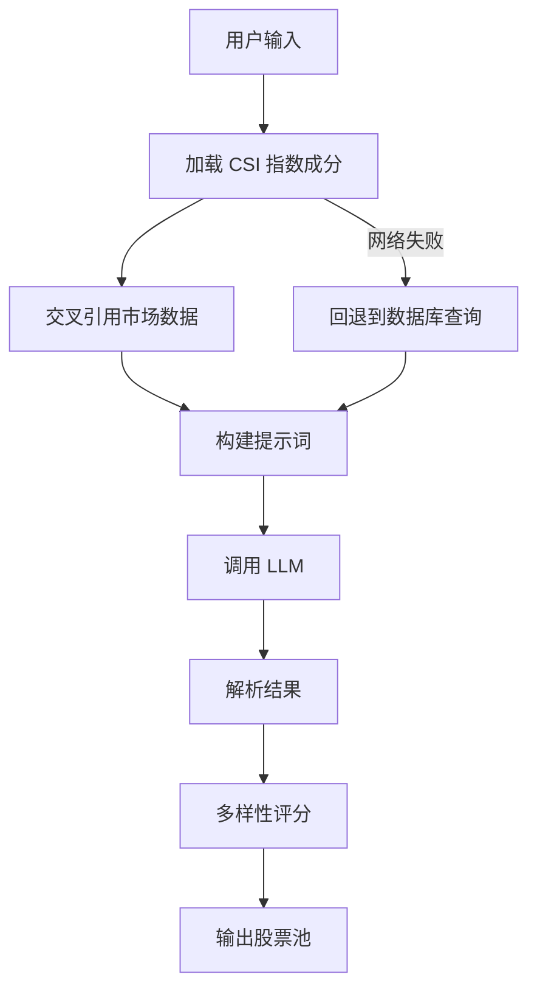
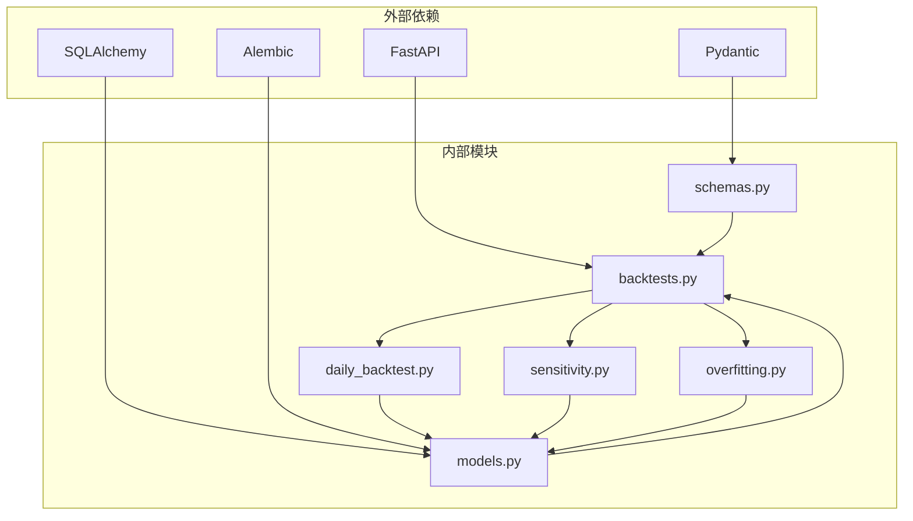
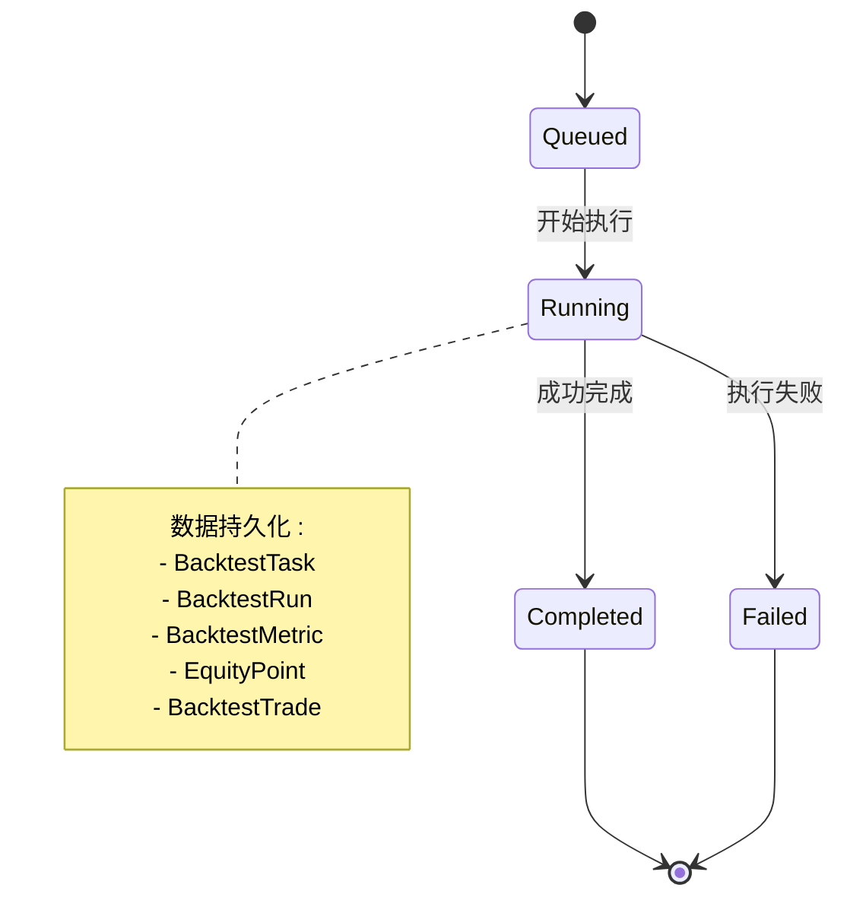

# 回测 API

<cite>
**本文档引用的文件**
- [backtests.py](file://backend/app/api/v1/backtests.py)
- [models.py](file://backend/app/domains/backtest/models.py)
- [schemas.py](file://backend/app/domains/backtest/schemas.py)
- [daily_backtest.py](file://backend/app/services/daily_backtest.py)
- [sensitivity.py](file://backend/app/services/sensitivity.py)
- [overfitting.py](file://backend/app/services/overfitting.py)
- [test_backtests.py](file://backend/tests/api/test_backtests.py)
- [20260512_000004_backtest_results.py](file://backend/app/db/migrations/versions/20260512_000004_backtest_results.py)
- [65eb0814322d_walk_forward_folds.py](file://backend/app/db/migrations/versions/65eb0814322d_walk_forward_folds.py)
- [a00a9a166a85_sensitivity_runs.py](file://backend/app/db/migrations/versions/a00a9a166a85_sensitivity_runs.py)
- [c029ffadba27_strategy_task_backtest_link.py](file://backend/app/db/migrations/versions/c029ffadba27_strategy_task_backtest_link.py)
</cite>

## 目录
1. [简介](#简介)
2. [项目结构](#项目结构)
3. [核心组件](#核心组件)
4. [架构概览](#架构概览)
5. [详细组件分析](#详细组件分析)
6. [依赖关系分析](#依赖关系分析)
7. [性能考虑](#性能考虑)
8. [故障排除指南](#故障排除指南)
9. [结论](#结论)

## 简介

回测 API 是量化交易实验室的核心功能模块，提供了完整的策略回测、性能分析和结果展示能力。该系统支持多种回测模式，包括单次回测、批量回测、Walk-forward 验证、敏感性分析和过拟合检测，为量化研究人员提供了全面的策略验证工具集。

系统采用 RESTful API 设计，结合 SQLAlchemy ORM 进行数据持久化，支持实时计算和异步处理。通过统一的数据模型和标准化的接口，开发者可以轻松集成各种量化策略进行回测分析。

## 项目结构

回测 API 的项目结构遵循清晰的分层架构设计：

**图表来源**
- [backtests.py:1-1122](file://backend/app/api/v1/backtests.py#L1-L1122)
- [daily_backtest.py:1-899](file://backend/app/services/daily_backtest.py#L1-L899)
- [models.py:1-155](file://backend/app/domains/backtest/models.py#L1-L155)

**章节来源**
- [backtests.py:1-1122](file://backend/app/api/v1/backtests.py#L1-L1122)
- [models.py:1-155](file://backend/app/domains/backtest/models.py#L1-L155)

## 核心组件

### API 路由器

回测 API 使用 FastAPI 的路由系统，定义了完整的 RESTful 接口：

- **根路径**：`/api/v1/backtests/`
- **子路径**：`/universe/suggest`、`/walk-forward`、`/sensitivity`、`/overview`

### 数据模型

系统采用 SQLAlchemy ORM 定义了完整的回测数据模型：

**图表来源**
- [models.py:9-155](file://backend/app/domains/backtest/models.py#L9-L155)

### 数据传输对象

系统使用 Pydantic 定义了完整的数据传输结构：

- **输入模型**：`BacktestCreateIn`、`UniverseSuggestIn`、`WalkForwardCreateIn`、`SensitivityCreateIn`
- **输出模型**：`BacktestTaskResultOut`、`UniverseSuggestOut`、`WalkForwardResultOut`、`SensitivityResultOut`
- **报告模型**：`BacktestReportOut`、`BacktestScreen`

**章节来源**
- [schemas.py:1-350](file://backend/app/domains/backtest/schemas.py#L1-L350)
- [models.py:1-155](file://backend/app/domains/backtest/models.py#L1-L155)

## 架构概览

回测 API 采用了分层架构设计，确保了良好的可维护性和扩展性：

**图表来源**
- [backtests.py:445-456](file://backend/app/api/v1/backtests.py#L445-L456)
- [daily_backtest.py:285-371](file://backend/app/services/daily_backtest.py#L285-L371)

### 性能分析组件

系统内置了多种性能分析工具：

- **过拟合检测**：基于 IS/OOS 分割、滚动验证、参数稳定性等指标
- **敏感性分析**：参数扰动和滑点敏感性测试
- **风险评估**：基于收益风险比的自动评级系统

**章节来源**
- [backtests.py:832-857](file://backend/app/api/v1/backtests.py#L832-L857)
- [overfitting.py:129-167](file://backend/app/services/overfitting.py#L129-L167)

## 详细组件分析

### 基础回测功能

#### 回测任务创建

基础回测功能支持单次策略回测执行：

**图表来源**
- [daily_backtest.py:191-283](file://backend/app/services/daily_backtest.py#L191-L283)
- [daily_backtest.py:285-371](file://backend/app/services/daily_backtest.py#L285-L371)

#### 回测配置参数

回测配置支持丰富的参数设置：

| 参数名称 | 类型 | 默认值 | 描述 |
|---------|------|--------|------|
| universe | List[str] | 必填 | 交易标的列表 |
| start_date | str | 必填 | 回测开始日期 |
| end_date | str | 必填 | 回测结束日期 |
| strategy_name | str | "dual_ma" | 策略名称 |
| initial_cash | float | 1,000,000.0 | 初始资金 |
| strategy_params | Dict | {} | 策略参数字典 |
| cost_config | BacktestCostIn | 实例 | 交易成本配置 |

**章节来源**
- [schemas.py:102-119](file://backend/app/domains/backtest/schemas.py#L102-L119)
- [daily_backtest.py:148-183](file://backend/app/services/daily_backtest.py#L148-L183)

### Walk-forward 验证

Walk-forward 分析是系统的核心功能之一，提供了滚动验证能力：

**图表来源**
- [backtests.py:502-552](file://backend/app/api/v1/backtests.py#L502-L552)
- [daily_backtest.py:373-452](file://backend/app/services/daily_backtest.py#L373-L452)

#### Walk-forward 配置

| 参数名称 | 类型 | 默认值 | 描述 |
|---------|------|--------|------|
| folds | int | 4 | 折数（2-20） |
| train_ratio | float | 0.7 | 训练期比例（0.1-1.0） |

**章节来源**
- [schemas.py:315-327](file://backend/app/domains/backtest/schemas.py#L315-L327)

### 敏感性分析

系统提供参数和滑点敏感性分析功能：

**图表来源**
- [sensitivity.py:60-138](file://backend/app/services/sensitivity.py#L60-L138)

#### 敏感性分析配置

系统针对不同的策略类型提供特定的扰动方案：

- **双均线策略**：短周期和长周期参数扰动
- **滑点成本**：在基准基础上增加 5bps 和 20bps 的扰动

**章节来源**
- [sensitivity.py:34-57](file://backend/app/services/sensitivity.py#L34-L57)

### 过拟合检测

过拟合检测是系统的重要质量控制功能：

**图表来源**
- [overfitting.py:129-167](file://backend/app/services/overfitting.py#L129-L167)

#### 过拟合评估指标

| 指标类型 | 计算方法 | 评分范围 |
|---------|----------|----------|
| IS/OOS Sharpe 衰减 | OOS/IS 比值 | 0-1 |
| IS/OOS 回撤一致性 | 绝对差值比 | 0-1 |
| 滚动验证连续性 | 训练到测试回报连续性 | 0-1 |
| 参数稳定性 | 累积回报标准差 | 0-1 |

**章节来源**
- [overfitting.py:51-126](file://backend/app/services/overfitting.py#L51-L126)

### 股票池构建

系统提供 AI 驱动的股票池构建功能：

**图表来源**
- [backtests.py:200-428](file://backend/app/api/v1/backtests.py#L200-L428)

#### 股票池构建参数

| 参数名称 | 类型 | 默认值 | 描述 |
|---------|------|--------|------|
| strategy_family | str | "trend" | 策略类型 |
| max_symbols | int | 20 | 最大标的数 |
| min_bars | int | 60 | 最小 K 线数 |
| diversify | bool | True | 是否多样化 |

**章节来源**
- [schemas.py:121-128](file://backend/app/domains/backtest/schemas.py#L121-L128)

## 依赖关系分析

回测 API 的依赖关系体现了清晰的分层架构：

**图表来源**
- [backtests.py:1-58](file://backend/app/api/v1/backtests.py#L1-L58)
- [daily_backtest.py:12-26](file://backend/app/services/daily_backtest.py#L12-L26)

### 数据流分析

回测系统的数据流遵循严格的生命周期管理：

**图表来源**
- [models.py:9-31](file://backend/app/domains/backtest/models.py#L9-L31)

**章节来源**
- [models.py:1-155](file://backend/app/domains/backtest/models.py#L1-L155)

## 性能考虑

### 数据加载优化

系统采用批量数据加载策略，减少数据库查询次数：

- **批量查询**：一次性加载指定日期范围内的所有市场数据
- **内存缓存**：按日期分组存储市场数据，提高访问效率
- **索引优化**：为常用查询字段建立数据库索引

### 并发处理

回测引擎支持异步处理：

- **异步数据库操作**：使用 SQLAlchemy AsyncSession
- **并发数据获取**：利用 asyncio.gather 并行获取多个数据源
- **资源管理**：自动管理数据库连接和事务

### 内存管理

系统采用渐进式数据处理：

- **流式处理**：逐日处理市场数据，避免内存峰值
- **数据清理**：及时释放不再使用的中间结果
- **对象复用**：重用计算对象，减少垃圾回收压力

## 故障排除指南

### 常见错误及解决方案

| 错误类型 | 错误码 | 可能原因 | 解决方案 |
|---------|--------|----------|----------|
| 数据不足 | 400 | 无可用市场数据 | 导入历史数据或调整标的池 |
| 参数无效 | 400 | 配置参数不合法 | 检查日期范围和参数边界 |
| 任务不存在 | 404 | 任务ID错误 | 验证任务ID的有效性 |
| 数据库连接 | 500 | 数据库异常 | 检查数据库连接状态 |

### 调试建议

1. **启用详细日志**：检查回测执行过程中的关键节点
2. **验证数据完整性**：确保市场数据的连续性和完整性
3. **参数范围检查**：确认策略参数在合理范围内
4. **内存监控**：关注长时间回测的内存使用情况

**章节来源**
- [backtests.py:454-456](file://backend/app/api/v1/backtests.py#L454-L456)
- [daily_backtest.py:29-31](file://backend/app/services/daily_backtest.py#L29-L31)

## 结论

回测 API 提供了完整的量化策略验证解决方案，具有以下特点：

### 核心优势

1. **功能完整**：支持从基础回测到高级分析的全流程功能
2. **易于使用**：标准化的 API 接口和清晰的参数配置
3. **性能优秀**：优化的数据处理和内存管理机制
4. **可扩展性**：模块化的架构设计便于功能扩展

### 应用场景

- **策略开发**：快速验证新策略的有效性
- **参数优化**：通过敏感性分析找到最优参数组合
- **风险评估**：通过过拟合检测评估策略的稳健性
- **批量测试**：支持多策略、多参数的批量回测

### 发展方向

未来可以考虑的功能增强：

- **实时回测**：支持实时市场数据的在线回测
- **分布式计算**：支持大规模并行回测任务
- **可视化增强**：提供更丰富的图表和报告功能
- **算法优化**：持续改进回测引擎的性能和准确性

通过本文档的详细介绍，开发者可以充分利用回测 API 的各项功能，构建高质量的量化策略验证系统。