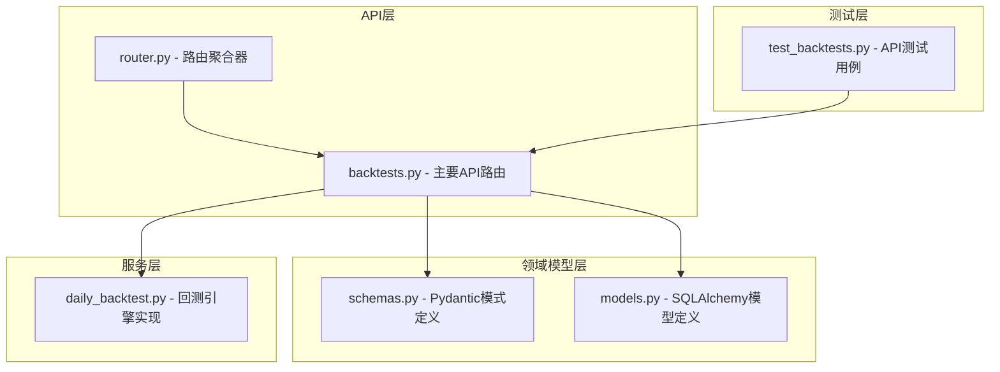
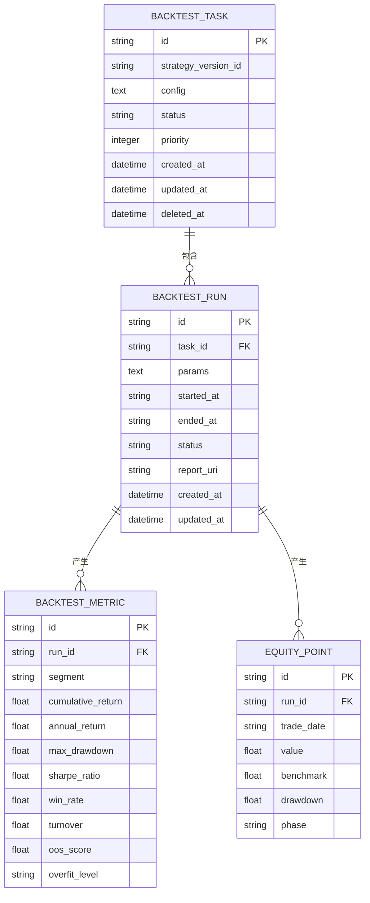
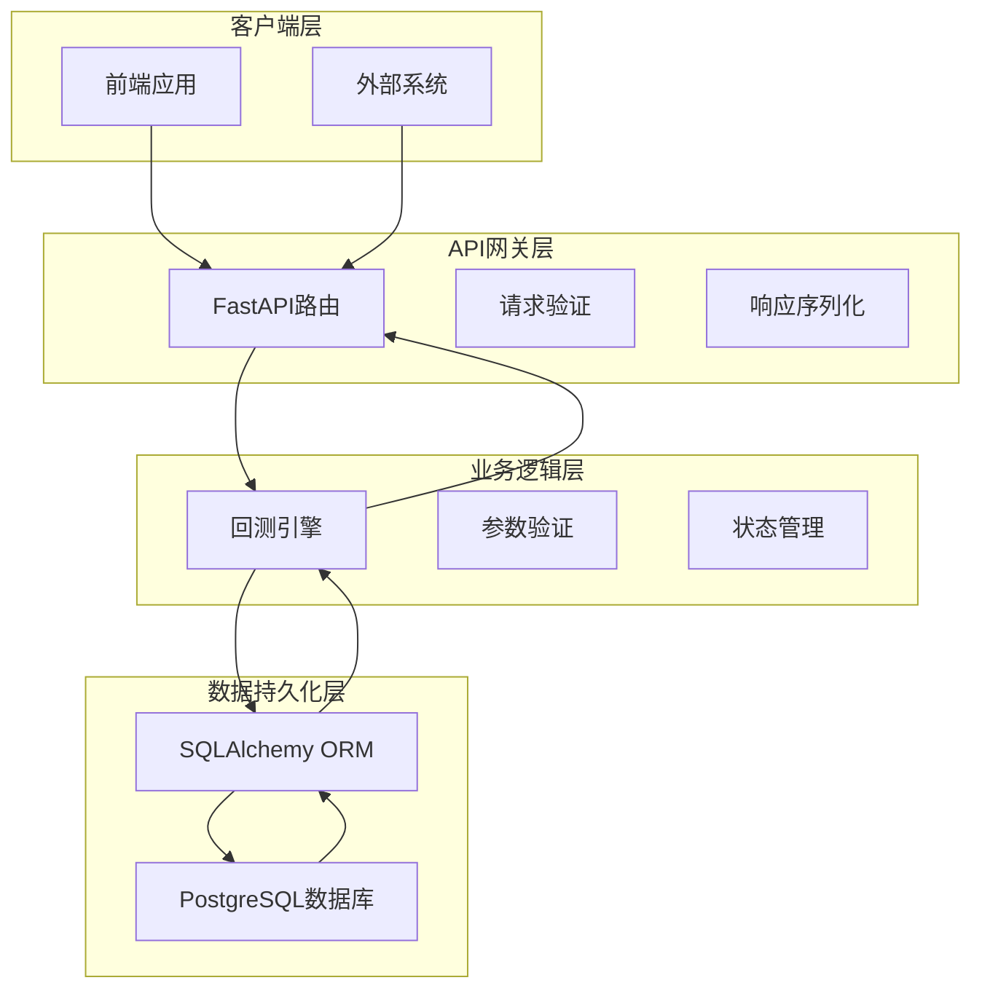
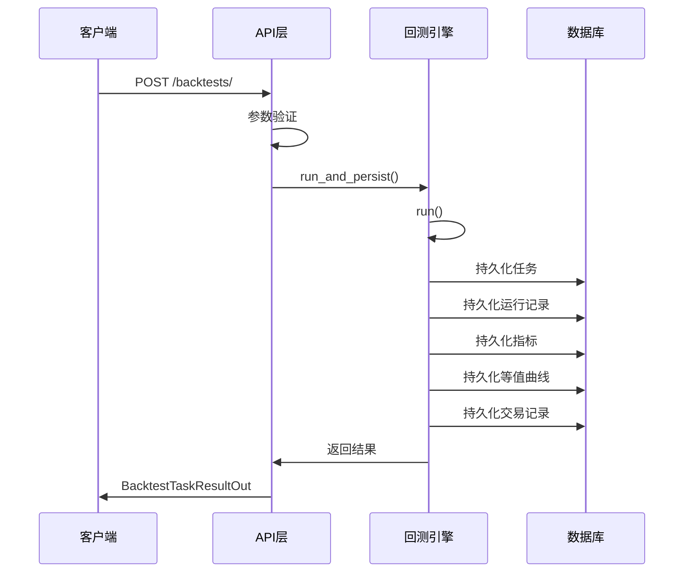
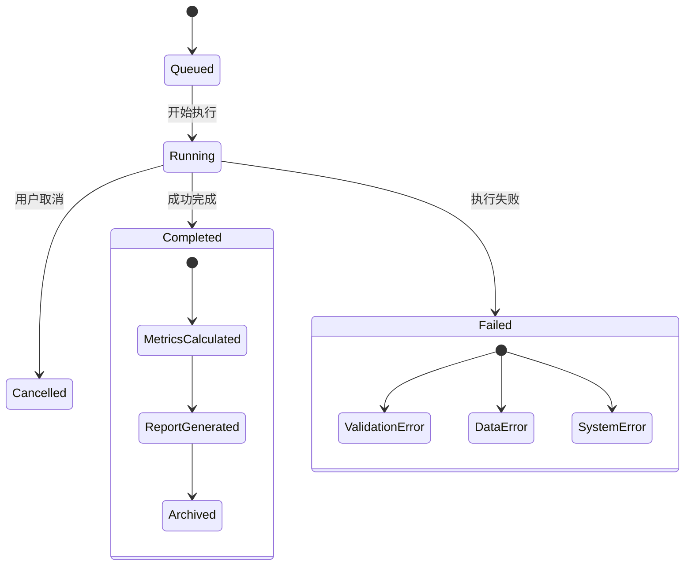
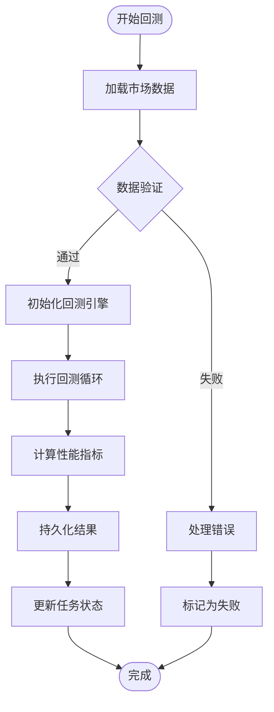
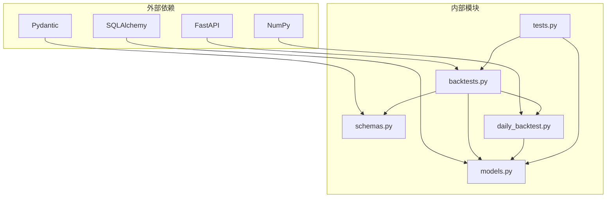
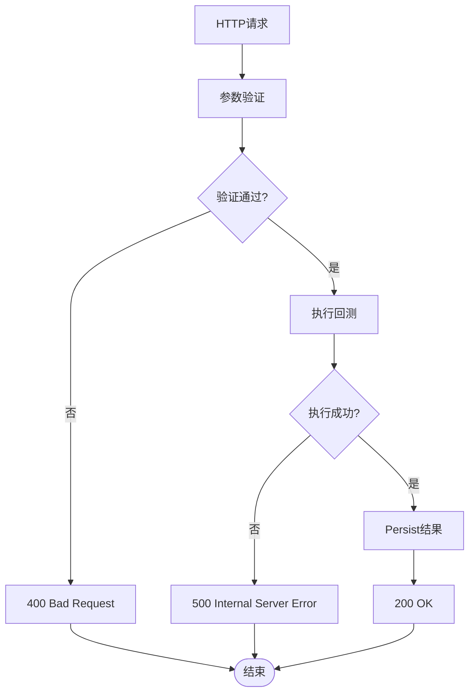

# 回测任务管理

<cite>
**本文档引用的文件**
- [backtests.py](file://backend/app/api/v1/backtests.py)
- [schemas.py](file://backend/app/domains/backtest/schemas.py)
- [models.py](file://backend/app/domains/backtest/models.py)
- [daily_backtest.py](file://backend/app/services/daily_backtest.py)
- [test_backtests.py](file://backend/tests/api/test_backtests.py)
- [router.py](file://backend/app/api/v1/router.py)
</cite>

## 目录
1. [简介](#简介)
2. [项目结构](#项目结构)
3. [核心组件](#核心组件)
4. [架构概览](#架构概览)
5. [详细组件分析](#详细组件分析)
6. [依赖关系分析](#依赖关系分析)
7. [性能考虑](#性能考虑)
8. [故障排除指南](#故障排除指南)
9. [结论](#结论)

## 简介

回测任务管理系统是量化交易平台的核心组件，负责管理策略回测任务的完整生命周期。该系统提供了完整的API接口，支持创建、查询、列表和状态管理回测任务，同时集成了异步执行机制和结果持久化功能。

系统采用分层架构设计，包括API层、服务层和数据访问层，确保了良好的可维护性和扩展性。所有回测数据都会被持久化到数据库中，支持后续的查询和分析。

## 项目结构

回测任务管理功能分布在以下关键文件中：

**图表来源**
- [backtests.py:1-800](file://backend/app/api/v1/backtests.py#L1-L800)
- [schemas.py:1-350](file://backend/app/domains/backtest/schemas.py#L1-L350)
- [models.py:1-155](file://backend/app/domains/backtest/models.py#L1-L155)
- [daily_backtest.py:1-899](file://backend/app/services/daily_backtest.py#L1-L899)

**章节来源**
- [backtests.py:1-800](file://backend/app/api/v1/backtests.py#L1-L800)
- [router.py:29](file://backend/app/api/v1/router.py#L29)

## 核心组件

### API路由定义

系统提供以下主要API端点：

| 端点 | 方法 | 描述 |
|------|------|------|
| `/api/v1/backtests/` | POST | 创建新的回测任务 |
| `/api/v1/backtests/{task_id}` | GET | 获取指定回测任务详情 |
| `/api/v1/backtests/` | GET | 列出最近的回测任务 |
| `/api/v1/backtests/{task_id}/trades` | GET | 获取回测交易记录 |
| `/api/v1/backtests/{task_id}/report` | GET | 获取完整的回测报告 |
| `/api/v1/backtests/universe/suggest` | POST | 建议股票池 |
| `/api/v1/backtests/walk-forward` | POST | 执行行走前沿分析 |
| `/api/v1/backtests/sensitivity` | POST | 执行敏感性分析 |

### 数据模型结构

**图表来源**
- [models.py:9-155](file://backend/app/domains/backtest/models.py#L9-L155)

**章节来源**
- [models.py:9-155](file://backend/app/domains/backtest/models.py#L9-L155)
- [schemas.py:102-350](file://backend/app/domains/backtest/schemas.py#L102-L350)

## 架构概览

回测任务管理采用经典的三层架构模式：

**图表来源**
- [backtests.py:483-683](file://backend/app/api/v1/backtests.py#L483-L683)
- [daily_backtest.py:185-371](file://backend/app/services/daily_backtest.py#L185-L371)

## 详细组件分析

### 回测任务创建流程

回测任务的创建过程涉及多个步骤，从参数验证到结果持久化：

**图表来源**
- [backtests.py:483-494](file://backend/app/api/v1/backtests.py#L483-L494)
- [daily_backtest.py:285-371](file://backend/app/services/daily_backtest.py#L285-L371)

### 参数验证规则

系统对回测任务参数实施严格验证：

| 参数 | 类型 | 必填 | 验证规则 | 默认值 |
|------|------|------|----------|--------|
| universe | List[str] | 是 | 非空 | - |
| start_date | str | 是 | ISO格式日期 | - |
| end_date | str | 是 | ISO格式日期，≥start_date | - |
| strategy_name | str | 否 | 内置策略名称 | "dual_ma" |
| initial_cash | float | 否 | >0 | 1,000,000.0 |
| strategy_params | dict | 否 | 策略特定参数 | {} |
| cost_config | BacktestCostIn | 否 | 交易成本配置 | 默认成本配置 |
| in_sample_end_date | str | 否 | [start_date, end_date)，留至少一天OOS | None |

**章节来源**
- [schemas.py:102-118](file://backend/app/domains/backtest/schemas.py#L102-L118)
- [daily_backtest.py:165-183](file://backend/app/services/daily_backtest.py#L165-L183)

### 任务状态管理

回测任务遵循明确的状态流转：

**图表来源**
- [models.py:14-17](file://backend/app/domains/backtest/models.py#L14-L17)
- [daily_backtest.py:316-323](file://backend/app/services/daily_backtest.py#L316-L323)

### 异步执行机制

系统采用异步执行模式，支持高并发处理：

**图表来源**
- [daily_backtest.py:191-283](file://backend/app/services/daily_backtest.py#L191-L283)
- [daily_backtest.py:285-371](file://backend/app/services/daily_backtest.py#L285-L371)

**章节来源**
- [daily_backtest.py:185-452](file://backend/app/services/daily_backtest.py#L185-L452)

### 结果持久化

回测结果被持久化到多个表中，确保数据的完整性和可追溯性：

| 表名 | 存储内容 | 关键字段 |
|------|----------|----------|
| backtest_tasks | 任务元数据 | strategy_version_id, config, status |
| backtest_runs | 运行记录 | task_id, params, status |
| backtest_metrics | 性能指标 | run_id, segment, cumulative_return |
| equity_points | 等值曲线 | run_id, trade_date, value |
| backtest_trades | 交易记录 | run_id, symbol, side |

**章节来源**
- [models.py:9-155](file://backend/app/domains/backtest/models.py#L9-L155)

## 依赖关系分析

### 组件依赖图

**图表来源**
- [backtests.py:1-58](file://backend/app/api/v1/backtests.py#L1-L58)
- [daily_backtest.py:12-26](file://backend/app/services/daily_backtest.py#L12-L26)

### 错误处理机制

系统实现了多层次的错误处理：

**图表来源**
- [backtests.py:492-494](file://backend/app/api/v1/backtests.py#L492-L494)
- [daily_backtest.py:316-323](file://backend/app/services/daily_backtest.py#L316-L323)

**章节来源**
- [backtests.py:492-494](file://backend/app/api/v1/backtests.py#L492-L494)
- [daily_backtest.py:29-47](file://backend/app/services/daily_backtest.py#L29-L47)

## 性能考虑

### 数据库优化

- 使用索引优化常用查询：`ix_backtest_tasks_status`, `ix_backtest_runs_task_id`
- 分页查询支持：默认限制20条记录
- 异步数据库操作：减少I/O等待时间

### 内存管理

- 流式处理大量数据：逐日处理市场数据
- 及时释放内存：使用生成器和迭代器
- 优化数据结构：使用元组存储不可变数据

### 并发处理

- 异步API设计：支持高并发请求
- 任务队列集成：可扩展到Celery
- 连接池管理：复用数据库连接

## 故障排除指南

### 常见错误及解决方案

| 错误类型 | 错误码 | 原因 | 解决方案 |
|----------|--------|------|----------|
| 数据缺失 | 400 | 无市场数据 | 导入历史数据后再执行回测 |
| 参数无效 | 400 | 日期范围错误 | 检查start_date和end_date的顺序 |
| 策略参数错误 | 400 | 策略参数不匹配 | 验证策略参数格式和范围 |
| 数据库连接失败 | 500 | 数据库连接异常 | 检查数据库配置和连接池 |

### 调试技巧

1. **启用详细日志**：在开发环境中启用DEBUG级别日志
2. **使用测试数据**：创建小规模测试数据集进行调试
3. **分步验证**：逐步验证每个组件的功能
4. **监控资源使用**：关注内存和CPU使用情况

**章节来源**
- [test_backtests.py:93-106](file://backend/tests/api/test_backtests.py#L93-L106)
- [test_backtests.py:317-332](file://backend/tests/api/test_backtests.py#L317-L332)

## 结论

回测任务管理系统是一个功能完整、架构清晰的量化交易基础设施组件。系统提供了全面的API接口，支持从简单的单策略回测到复杂的多策略对比分析。

关键优势包括：
- **完整的生命周期管理**：从创建到结果查询的全流程支持
- **严格的数据验证**：确保输入参数的有效性和一致性
- **可靠的结果持久化**：所有回测数据都被安全存储
- **灵活的扩展性**：模块化设计便于功能扩展
- **完善的错误处理**：多层次的错误检测和恢复机制

该系统为量化策略研发提供了坚实的技术基础，支持从概念验证到生产部署的完整流程。