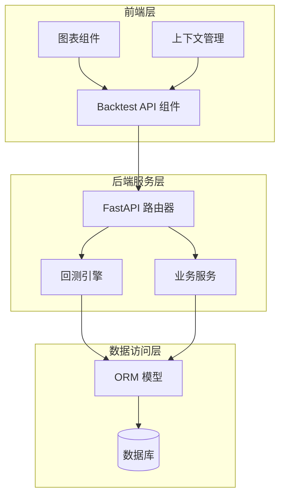
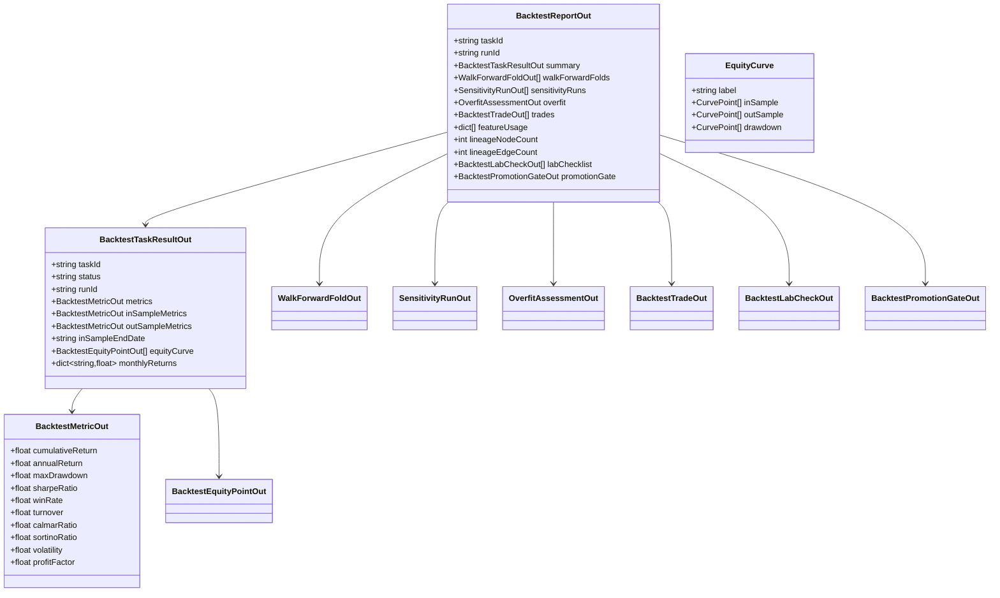
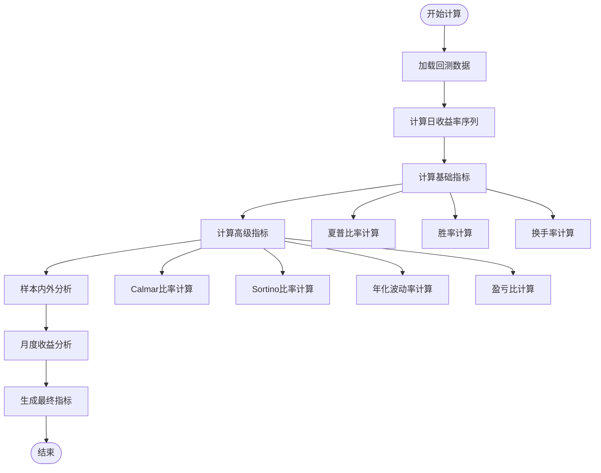
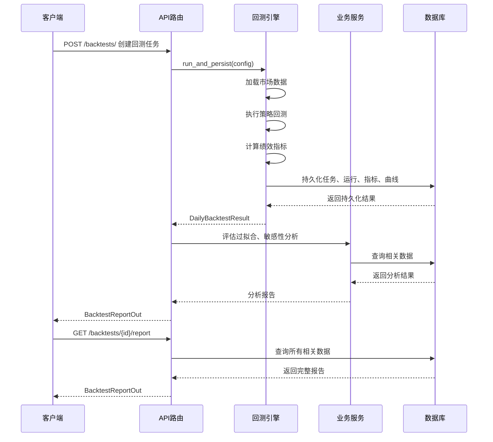
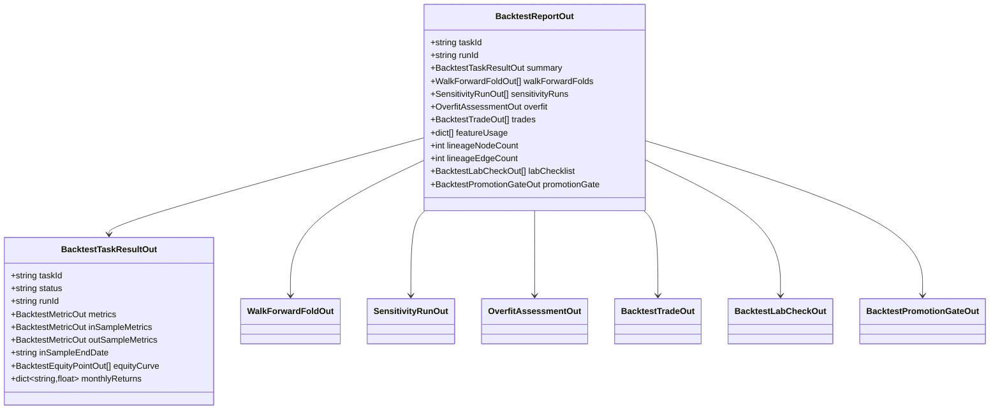
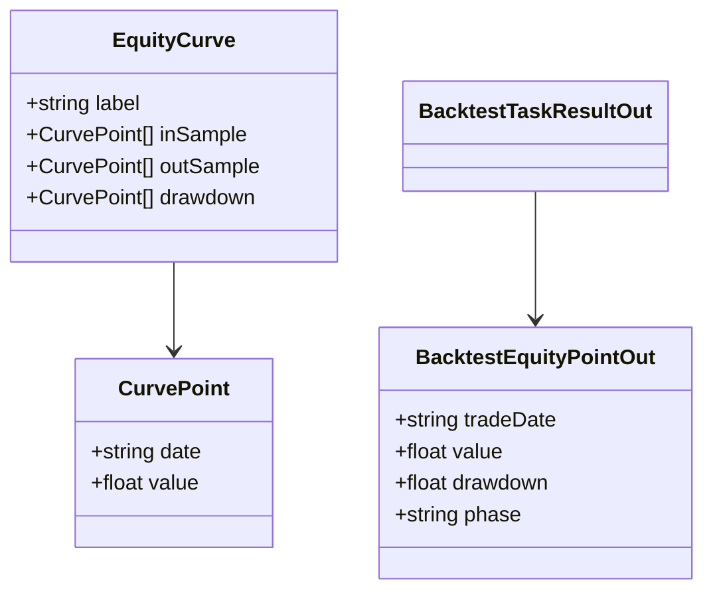
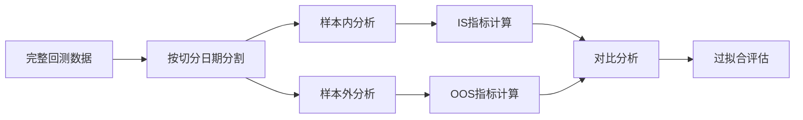
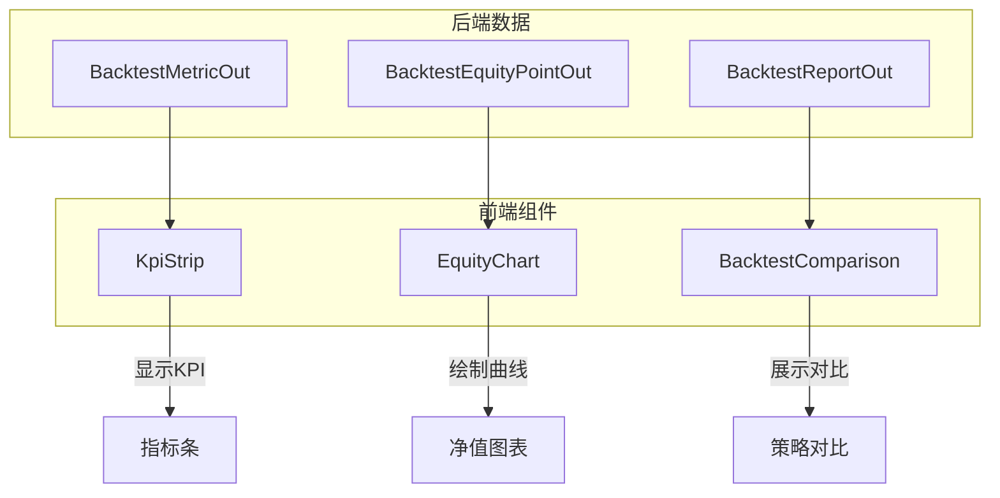
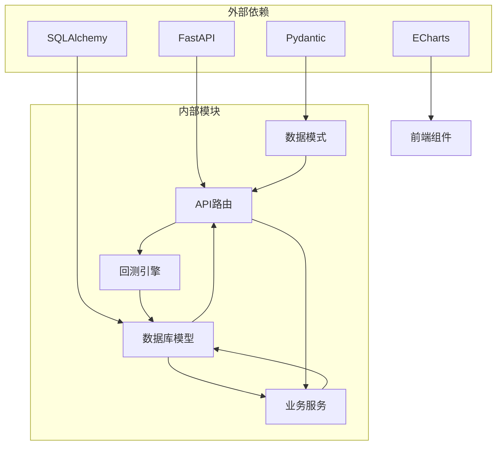

# 回测结果分析

<cite>
**本文档引用的文件**
- [backend/app/domains/backtest/schemas.py](file://backend/app/domains/backtest/schemas.py)
- [backend/app/domains/backtest/models.py](file://backend/app/domains/backtest/models.py)
- [backend/app/api/v1/backtests.py](file://backend/app/api/v1/backtests.py)
- [backend/app/services/daily_backtest.py](file://backend/app/services/daily_backtest.py)
- [backend/app/services/overfitting.py](file://backend/app/services/overfitting.py)
- [backend/app/services/sensitivity.py](file://backend/app/services/sensitivity.py)
- [backend/tests/api/test_backtests.py](file://backend/tests/api/test_backtests.py)
- [frontend/src/screens/Backtest/EquityChart.tsx](file://frontend/src/screens/Backtest/EquityChart.tsx)
- [frontend/src/screens/Backtest/KpiStrip.tsx](file://frontend/src/screens/Backtest/KpiStrip.tsx)
- [frontend/src/screens/Backtest/BacktestComparison.tsx](file://frontend/src/screens/Backtest/BacktestComparison.tsx)
- [doc/prd/backtest-lab-v2.md](file://doc/prd/backtest-lab-v2.md)
</cite>

## 目录
1. [简介](#简介)
2. [项目结构](#项目结构)
3. [核心组件](#核心组件)
4. [架构概览](#架构概览)
5. [详细组件分析](#详细组件分析)
6. [依赖分析](#依赖分析)
7. [性能考虑](#性能考虑)
8. [故障排除指南](#故障排除指南)
9. [结论](#结论)
10. [附录](#附录)

## 简介

本文件详细解析量化交易回测系统的回测结果分析机制，涵盖回测结果的获取、指标计算和可视化展示接口。重点说明以下核心数据结构：

- **BacktestReportOut 综合报告格式**：整合回测任务摘要、样本内外指标、滚动验证、敏感性分析、过拟合评估、交易明细、特征使用情况等完整信息
- **BacktestMetricOut 指标数据结构**：包含累计收益、年化收益、最大回撤、夏普比率、胜率、换手率以及新增的 Calmar 比率、Sortino 比率、年化波动率、盈亏比等深度风险指标
- **EquityCurve 收益曲线**：提供净值曲线、样本内外分割标识和回撤序列
- **KPI 指标定义**：核心收益指标与深度风险指标的含义解释

系统支持样本内/样本外分析、风险指标计算、收益统计和性能评估，并提供完整的可视化组件用于结果展示。

## 项目结构

回测系统采用分层架构，主要由以下层次组成：

**图表来源**
- [backend/app/api/v1/backtests.py:1-800](file://backend/app/api/v1/backtests.py#L1-L800)
- [backend/app/services/daily_backtest.py:1-899](file://backend/app/services/daily_backtest.py#L1-L899)

**章节来源**
- [backend/app/api/v1/backtests.py:1-800](file://backend/app/api/v1/backtests.py#L1-L800)
- [backend/app/services/daily_backtest.py:1-899](file://backend/app/services/daily_backtest.py#L1-L899)

## 核心组件

### 数据模型与架构

系统采用 Pydantic 模型定义数据结构，确保前后端数据传输的一致性和类型安全：

**图表来源**
- [backend/app/domains/backtest/schemas.py:231-350](file://backend/app/domains/backtest/schemas.py#L231-L350)

### 核心指标计算

系统实现了全面的绩效指标计算框架，包括基础指标和深度风险指标：

**图表来源**
- [backend/app/services/daily_backtest.py:702-804](file://backend/app/services/daily_backtest.py#L702-L804)

**章节来源**
- [backend/app/domains/backtest/schemas.py:155-350](file://backend/app/domains/backtest/schemas.py#L155-L350)
- [backend/app/services/daily_backtest.py:702-804](file://backend/app/services/daily_backtest.py#L702-L804)

## 架构概览

回测系统采用模块化设计，各组件职责清晰：

**图表来源**
- [backend/app/api/v1/backtests.py:483-867](file://backend/app/api/v1/backtests.py#L483-L867)
- [backend/app/services/daily_backtest.py:285-371](file://backend/app/services/daily_backtest.py#L285-L371)

## 详细组件分析

### BacktestReportOut 综合报告

综合报告是回测结果的核心载体，整合了所有分析产物：

**图表来源**
- [backend/app/domains/backtest/schemas.py:231-247](file://backend/app/domains/backtest/schemas.py#L231-L247)

### BacktestMetricOut 指标数据结构

指标结构支持基础和高级指标的完整计算：

| 指标类别 | 指标名称 | 含义 | 计算方式 |
|---------|---------|------|---------|
| **基础收益** | 累计收益 | 总回报率 | 最终净值/初始资金 - 1 |
| | 年化收益 | 年化回报率 | (V/T)^(252/N) - 1 |
| | 最大回撤 | 最大下跌幅度 | min(净值/峰值 - 1) |
| | 夏普比率 | 风险调整收益 | 平均日收益/日收益标准差×√252 |
| **交易效率** | 胜率 | 盈利交易比例 | 盈利交易数/总交易数 |
| | 换手率 | 交易活跃度 | 总交易金额/平均净值 |
| **深度风险** | Calmar比率 | 回撤调整收益 | 年化收益/|最大回撤| |
| | Sortino比率 | 下行风险调整收益 | 平均收益/下行标准差×√252 |
| | 年化波动率 | 投资风险水平 | 日收益标准差×√252 |
| | 盈亏比 | 盈利能力指标 | 盈利总额/亏损总额 |

**章节来源**
- [backend/app/domains/backtest/schemas.py:155-167](file://backend/app/domains/backtest/schemas.py#L155-L167)
- [backend/app/services/daily_backtest.py:702-804](file://backend/app/services/daily_backtest.py#L702-L804)

### EquityCurve 收益曲线

收益曲线提供可视化所需的数据结构：

**图表来源**
- [backend/app/domains/backtest/schemas.py:22-26](file://backend/app/domains/backtest/schemas.py#L22-L26)
- [backend/app/domains/backtest/schemas.py:170-177](file://backend/app/domains/backtest/schemas.py#L170-L177)

### 样本内/样本外分析

系统支持 IS/OOS 切分分析，提供更可靠的性能评估：

**图表来源**
- [backend/app/services/daily_backtest.py:495-534](file://backend/app/services/daily_backtest.py#L495-L534)

**章节来源**
- [backend/app/services/daily_backtest.py:495-534](file://backend/app/services/daily_backtest.py#L495-L534)

### 可视化组件集成

前端组件与后端数据结构完美对接：

**图表来源**
- [frontend/src/screens/Backtest/KpiStrip.tsx:1-19](file://frontend/src/screens/Backtest/KpiStrip.tsx#L1-L19)
- [frontend/src/screens/Backtest/EquityChart.tsx:1-189](file://frontend/src/screens/Backtest/EquityChart.tsx#L1-L189)
- [frontend/src/screens/Backtest/BacktestComparison.tsx:1-176](file://frontend/src/screens/Backtest/BacktestComparison.tsx#L1-L176)

**章节来源**
- [frontend/src/screens/Backtest/KpiStrip.tsx:1-19](file://frontend/src/screens/Backtest/KpiStrip.tsx#L1-L19)
- [frontend/src/screens/Backtest/EquityChart.tsx:1-189](file://frontend/src/screens/Backtest/EquityChart.tsx#L1-L189)
- [frontend/src/screens/Backtest/BacktestComparison.tsx:1-176](file://frontend/src/screens/Backtest/BacktestComparison.tsx#L1-L176)

## 依赖分析

系统依赖关系清晰，模块间耦合度低：

**图表来源**
- [backend/app/domains/backtest/schemas.py:7-8](file://backend/app/domains/backtest/schemas.py#L7-L8)
- [backend/app/domains/backtest/models.py:3-6](file://backend/app/domains/backtest/models.py#L3-L6)

**章节来源**
- [backend/app/domains/backtest/schemas.py:1-50](file://backend/app/domains/backtest/schemas.py#L1-L50)
- [backend/app/domains/backtest/models.py:1-50](file://backend/app/domains/backtest/models.py#L1-L50)

## 性能考虑

系统在性能方面采取了多项优化措施：

1. **内存优化**：使用生成器和流式处理减少内存占用
2. **数据库优化**：批量插入和索引优化提升查询性能
3. **计算优化**：缓存中间结果避免重复计算
4. **并发处理**：异步数据库操作提升响应速度

## 故障排除指南

### 常见问题及解决方案

| 问题类型 | 症状 | 可能原因 | 解决方案 |
|---------|------|---------|---------|
| 数据加载失败 | "no market bars found" | 市场数据缺失 | 导入历史数据或检查数据源 |
| IS/OOS 切分错误 | "in_sample_end_date" 参数错误 | 切分日期超出范围 | 确保切分日期在[开始日期, 结束日期)范围内 |
| 指标计算异常 | 指标值为NaN或无穷大 | 除零错误或数据异常 | 检查输入数据质量和边界条件 |
| 性能问题 | 回测执行时间过长 | 数据量过大或算法复杂度高 | 优化策略参数或分批处理数据 |

**章节来源**
- [backend/tests/api/test_backtests.py:93-106](file://backend/tests/api/test_backtests.py#L93-L106)
- [backend/tests/api/test_backtests.py:317-332](file://backend/tests/api/test_backtests.py#L317-L332)

## 结论

本回测结果分析系统提供了完整的量化交易回测解决方案，具有以下特点：

1. **全面的指标体系**：涵盖基础收益指标和深度风险指标，支持多维度性能评估
2. **灵活的分析框架**：支持样本内/样本外分析、滚动验证、敏感性分析等多种分析方法
3. **直观的可视化**：提供净值曲线、KPI指标条、策略对比等丰富的可视化组件
4. **可靠的质量保证**：完善的测试覆盖和错误处理机制确保系统稳定性

系统为量化交易策略的研发和评估提供了强有力的技术支撑，有助于提高策略开发的效率和质量。

## 附录

### API 接口规范

系统提供完整的 RESTful API 接口，支持回测任务的创建、查询、分析和报告生成。

### 数据格式说明

所有数据传输采用 JSON 格式，使用 Pydantic 模型进行类型验证和数据转换。

### 分析方法指导

建议采用以下分析流程进行回测结果解读：
1. 首先检查基础收益指标，评估整体表现
2. 分析样本内外指标，判断策略的泛化能力
3. 查看深度风险指标，了解风险调整后的收益水平
4. 结合可视化图表，进行趋势和异常识别
5. 使用敏感性分析，评估策略的稳健性